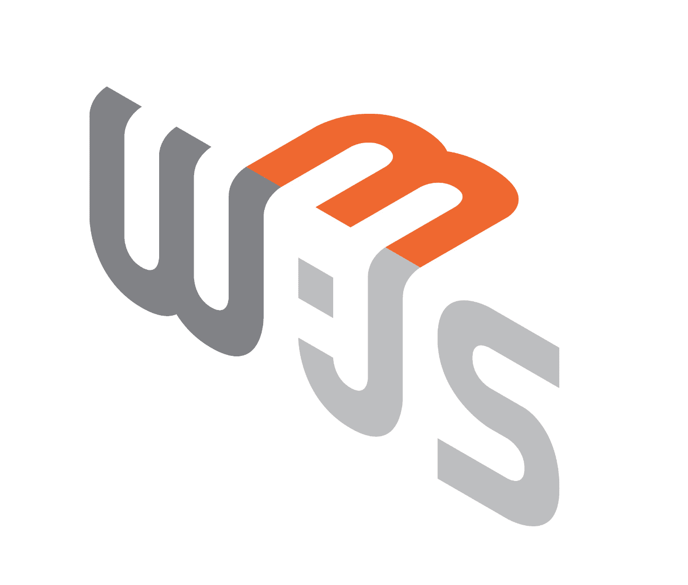
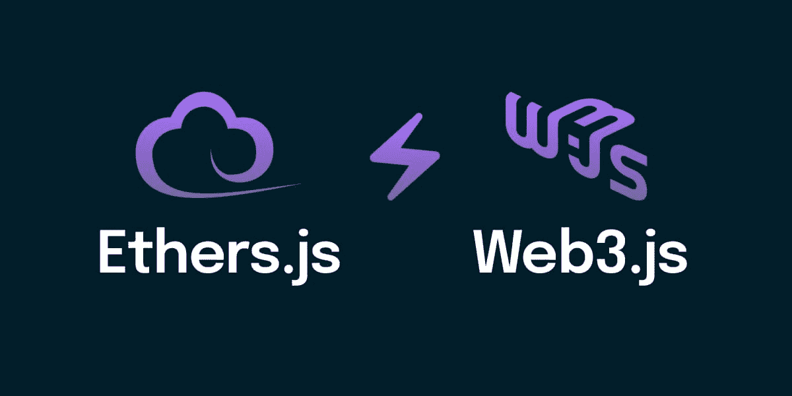
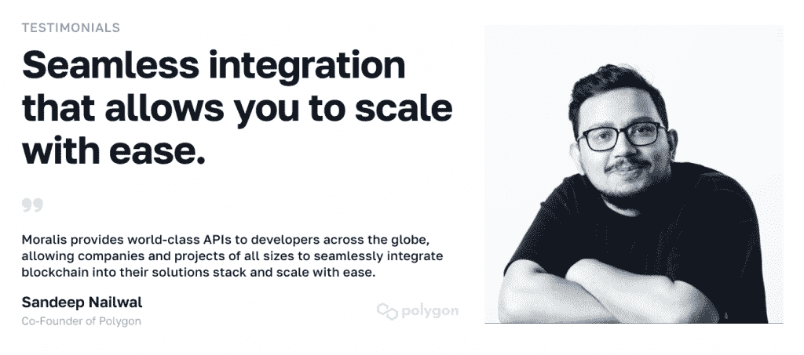

# 全指南:什么是 Ethers.js？

> 原文：<https://moralis.io/full-guide-what-is-ethers-js/>

Web3 JavaScript (JS)开发的一个最重要的方面是跨系统的交互。当构建分散应用程序(dapps)或其他 Web3 平台时，您需要一个无缝的工作流来连接您的项目和各种区块链网络。在以太坊开发中，一个这样的资产是 ethers.js。此外，ethers.js 是一个著名的 Web3 库，开发人员可以使用它与以太坊区块链进行交互。可以想象，像这样的库在 Web3 开发中扮演着重要的角色。所以，如果你想了解更多关于 ethers.js 的知识，请加入我们的指南，因为我们将介绍这个以太坊库的来龙去脉！

在本文的开始部分，我们将探索 ethers.js 的复杂性。在这一过程中，我们将介绍该库的一些最突出的特性和模块。一旦您对 ethers.js 有了更好的理解，我们将简要介绍 Web3.js，并对两者进行比较，以突出它们之间的差异和相似之处。最后，最重要的是，最后一节涵盖了一个突出的 ethers.js 替代方案: [Moralis](https://moralis.io) Streams API！

前面提到的接口是 Moralis 杰出的[web 3 API](https://moralis.io/web3-apis-exploring-the-top-5-blockchain-apis/)之一，使任何人都可以通过 Web3 webhooks 轻松地将区块链数据传输到任何应用程序的后端。其他值得注意的 Moralis 开发工具包括 [Auth API](https://moralis.io/authentication/) 、 [NFT API](https://moralis.io/nft-api/) 、 [Token API](https://moralis.io/token-api/) 等。这些工具有助于更容易获得 Web3 开发人员的体验，这就是为什么 Moralis 提出了构建 Web3 应用程序的最快方法！

如果这听起来令人兴奋，并且你想访问这些 Web3 开发特性，[注册 Moralis](https://admin.moralis.io/register) 。您可以创建一个完全免费的帐户，并立即利用区块链技术的全部潜力。所以，立即设立你的帐户；只需要几秒钟！

## 什么是 Ethers.js？

Ethers.js 是 2016 年发布的 Web3 JavaScript (JS)库，由毛利小五郎创建。它是当今最受欢迎的开源以太坊 JS 库之一，拥有数百万的下载量。与传统的编程库非常相似，ethers.js 由一组预先编写的代码片段组成，这些代码片段可以重用来执行基本的日常功能。然而，ethers.js 与其他传统库不同，它是基于 Web3 的。此外，开发人员可以使用这个库轻松地与以太坊区块链进行交流和交互。

Ethers.js 最初是为“ *ethers.io* 设计的。然而，它已经扩展成为一个更通用的库。此外，ethers.js 具有较小的包大小、广泛而简单的文档、用户友好的 API 结构，并且是用类型脚本编写的。因此，对于许多 Web3 开发人员来说，它是一个极具吸引力的库，因为它使用起来直观明了。

此外，为了更好地理解 ethers.js 的效用，让我们仔细看看这个库的一些关键特性:

*   **大小**–ethers . js 很小，只有 88 KB 压缩和 284 KB 未压缩。
*   **ENS**–以太坊名称服务(ENS)名称是一等公民。因此，它们可以在任何可以使用以太坊地址的地方使用。
*   **测试用例**–ethers . js 的特点是收集了大量的测试用例，并积极维护和更新。
*   麻省理工学院许可证(MIT License)–该库是完全开源的，包括所有的依赖项。
*   **安全**——有了 ethers.js，你就可以保证你的私钥安全无虞。

上面的特性只是五个突出的例子，ethers.js 还可以提供更多。因此，有更多的东西需要你自己去发现。然而，我们需要在本指南中进一步探索的 ethers.js 的一些基本组件是它的各种模块。反过来，我们将了解图书馆是如何工作的。

### 库模块

在探索 ethers.js 模块之前，让我们首先简要回顾一下 js 模块是什么。模块是一个函数或类似函数的集合，创建它是为了更好地构建/组织代码库。更重要的是，模块通常是独立的、特定的和可重用的。现在，简单介绍一下什么是模块，让我们直接进入 ethers.js！

Ethers.js 有四个核心模块:“ *Ethers.contract* ”、“ *ethers.utils* ”、“*ethers . wallet*”和“ethers”。*提供者*。这些模块是 ethers.js 的应用编程接口(API)的核心。因此，让我们分别分解每个模块，以便快速了解它们的用途:

*   "*"*"*ethers . contract*"模块的主要目的是提供无缝部署以太坊智能合约的能力。然而，尽管这是该模块的主要功能，它还能提供更多的功能。例如，您可以使用“*ethers . contract*”*来监听智能合约事件、调用函数、查询有关合约的信息等等。***

****   "***ethers . utils***"*–您可以使用" *ethers.utils* "来处理用户输入和格式化数据。这是两个至关重要的 Web3 开发任务，这意味着这个模块使区块链开发更容易实现。****

***   "***ethers . wallet***"-通过" *ethers.wallet* "模块，您可以轻松连接到现有的钱包(以太坊地址)，创建新的钱包，并签署交易。**

***   "***. ethers . provider***"–通过"*ethers . provider*"模块，您可以与以太坊网络无缝建立连接。此外，您可以利用该模块查询链上数据并发送已签名的事务。因此，通过这个模块，你可以用 ethers.js 改变以太坊区块链的状态！**

**以上介绍了 ethers.js 的基本内容！在下一节中，我们将仔细研究 web3.js，了解这些库的不同之处，并探究 ethers.js 的独特之处！**

## **Web3.js 是什么？**

**就像 ethers.js 一样，Web3.js 是一个开源的 js 库，方便了与以太坊区块链的无缝交互。此外，以太坊基金会创建了 Web3.js。因此，它有一个相当广泛的社区的支持，这增加了这个库的价值。此外，Web3.js 自 2015 年以来一直存在，这意味着这是一个经过战斗考验的库，在许多突出的项目中使用。**

**

Web3.js 通过 JSON-RPC(“JavaScript 对象符号-远程过程调用”)协议建立与以太坊节点的通信。此外，很像 ethers.js，这个库也有模块。具体来说，它总共有五个模块:

*   "***web 3 . eth***"——这是与以太坊网络交互的模块。此外，它还提供了额外的子模块，如" *web3.eth.contract* " *，*"*web 3 . eth . subscribe*"*，*"*web 3 . eth . accounts*"等。

*   “***【web3.net】***”——可以使用“*”与网络属性进行交互。*

**   "***web 3 . shh***"*–通过" *web3.shh* "模块，可以与耳语协议进行交互。**

***   "***web 3 . utils***"–"*web 3 . utils*"模块提供以太坊 dapps 和其他包的实用函数。**

***   "***web 3 . bzz***"——你用" *web3.bzz* "与蜂群网络进行交互。**

**基于对 ethers.js 和 web3.js 的概述，您可能已经注意到这些库非常相似，并且服务于相似的目的。因此，下面的部分比较了这两者，突出了它们之间的区别！**

## **Ethers.js vs Web3.js**

**如果您已经学习了这么多，现在应该熟悉 ethers.js 和 Web3.js 了。反过来，您现在也熟悉了这些库的各种模块、关键特性以及开发人员如何使用它们。你也知道像这样的 Web3 库在区块链开发中是至关重要的，因为它们允许开发者节省大量的时间和资源。**

**

然而，你可能也已经注意到了，它们服务于相似的目的，并且非常相似。因此，本节将对 ethers.js 和 Web3.js 进行比较，以突出一些显著的差异。通过这样做，你将有希望在你的发展努力中更容易选择哪一个。

有各种方法来比较这两个库；但是，对于本指南，我们将重点关注社区、文档和受欢迎程度:

*   **底层社区**–web 3 . js 如前所述，是以太坊基金会项目。因此，这意味着 Web3.js 由组织直接支持，由 ChainSafe 维护。相反，ethers.js 是由一个叫毛利小五郎的人构建的，一个小得多的开发团队维护这个库。

*   **文档**–ethers . js 和 Web3.js 都有全面的文档。然而，在这方面，基于广泛的和初学者友好的“入门”指南，ethers.js 似乎有一点优势。

*   **人气**–web 3 . js 是目前两个以太坊 JS 库中最大的。然而，ethers.js 目前正以每周下载量为基础快速增长。但是在 GitHub stars 方面，Web3.js 超过 ethers.js 一万多。

尽管如此，ethers.js 和 Web3.js 各有利弊。因此，作为开发人员，您可以根据自己的需要在它们之间做出选择！

## 探索 Ethers.js 替代方案

除了前面提到的库，还有其他与以太坊区块链交互的方式，一个很好的例子就是 Moralis 的 Web3 [Streams API](https://moralis.io/streams/) ！有了 API，你可以通过 [Moralis webhooks](https://moralis.io/moralis-webhooks-an-introduction-to-web3-webhooks/) 无缝地将链上数据传输到你的应用程序的后端。更重要的是，由于 Moralis 的跨链能力，你不必将自己局限于以太坊网络。事实上，您可以为多个领先的可编程区块链设置流。这包括多边形，雪崩，BNB 链，克罗诺斯，Fantom，和[更多的](https://docs.moralis.io/reference/supported-chains)！因此，您可以让您所有的区块链项目面向未来！

从传统的角度来看，向区块链网络查询数据一直是一项繁琐的任务。然而，现在已经不是这样了，感谢 Moralis！使用 Streams API，您可以避免诸如连接和维护 RPC 节点、浪费时间构建复杂的数据管道、设置不必要的抽象等任务。相反，您可以节省时间，专注于为客户创造更多价值。

因此，无论何时，您都可以在多个网络和第二层(L2)平台上轻松设置流来接收 Web3 webhooks:

*   有人参与象征性的销售
*   特定的资产被发送、交换、接收或标记
*   某个地址发送或接收资产
*   一场战斗在一个网络 3 游戏中开始
*   或基于您的过滤器触发的其他智能合约事件

此外，由于 Streams API 的可访问性，您只需简单的五个步骤就可以设置流:

1.  提供地址
2.  应用过滤器来指定何时接收网页挂钩
3.  指定您要监视的链
4.  添加您的 webhook URL
5.  接收网页挂钩

### 后续步骤

如果你想了解更多关于如何用 Moralis 设置 Web3 流的信息，请查看我们关于[以太坊 webhooks](https://moralis.io/ethereum-webhooks-what-they-are-and-how-to-use-webhooks-for-ethereum/) 和[多边形 webhooks](https://moralis.io/polygon-webhooks-how-to-use-webhooks-on-polygon/) 的指南。这些文章提供了为各种链设置 Web3 webhooks 的综合教程！此外，如果你想探索 Moralis——最终的 [Web3 提供商](https://moralis.io/web3-provider-why-blockchain-developers-should-use-one/)—如何让开发者[获得钱包余额](https://moralis.io/get-wallet-balance-how-to-get-wallets-native-crypto-balance/),包括来自地址的本机和 [ERC20 令牌，请务必阅读我们的文章探索最佳](https://moralis.io/balance-of-erc20-how-to-get-balance-of-an-erc20-token-from-address/) [ERC20 令牌余额 API](https://moralis.io/the-best-erc20-token-balance-api-for-dapp-development/) ！此外，如果您想将[可扩展的 Web3 基础设施](https://moralis.io/scale/)添加到您的项目中，Moralis 是您的首选。事实上，Moralis 受到了行业领导者的信任，包括 MetaMask、1inch、SuperFarm 和许多其他公司！平均而言，项目节省了 8640 万美元的工程成本，并大幅缩短了 87%的上市时间！

[**Sign Up with Moralis**](https://admin.moralis.io/register)

## 总结–什么是 Ethers.js？

Ethers.js 是最常用的以太坊 JavaScript (JS)库之一，其主要目的是促进与以太坊区块链的无缝通信和交互。使用 TypeScript，这个库诞生了，它具有直观的文档、较小的包大小和用户友好的 API 结构。因此，很容易掌握 ethers.js，使其成为全球 Web3 开发者的首选。此外，ethers.js 还有四个主要模块:“ *ethers.contract* ”、“ *ethers.utils* ”、“*ethers . wallet*”和“ethers。*提供者*。这些组件是这个库的 API 的核心，对它的工作方式至关重要。此外，ethers.js 的一些主要特性是它的小尺寸、ENS 支持、广泛的测试用例集等。

一个令人兴奋的 ethers.js 替代品是 Moralis 的 Web3 Streams API。有了这个接口，你可以很容易地设置 [Web3 webhooks](https://moralis.io/web3-webhooks-the-ultimate-guide-to-blockchain-webhooks/) 来很容易地将链上数据传输到任何项目的后端。因此，使用 Moralis，您可以通过充分利用区块链技术的力量来更有效和高效地创建 dapps。

如果你喜欢这个教程，可以考虑在道德网的博客上查看更多的文章。例如，阅读我们在 [Goerli testnet](https://moralis.io/goerli-eth-what-is-the-goerli-testnet/) 上的指南，如何[创建 AWS Lambda 函数](https://moralis.io/creating-a-lambda-function-learn-how-to-create-an-aws-lambda-function/)，下一代 L2 链[Palm 网络](https://moralis.io/palm-blockchain-what-is-the-palm-network/)需要什么，等等！这个博客为新的和有经验的开发者提供了新鲜和激动人心的 Web3 开发内容。

此外，如果你想成为一名更熟练的 Web3 开发者，可以考虑报名参加道德学院。该学院提供一系列信息丰富、激动人心的区块链发展课程。比如查看“[区块链&比特币基本面](https://academy.moralis.io/courses/blockchain-bitcoin-101)”了解区块链行业的基础知识！

然而，不管你的 Web3 抱负如何，[与 Moralis](https://admin.moralis.io/register) 签约，获得最无缝的 Web3 开发者体验。创建帐户是免费的，所以你不会有任何损失！****