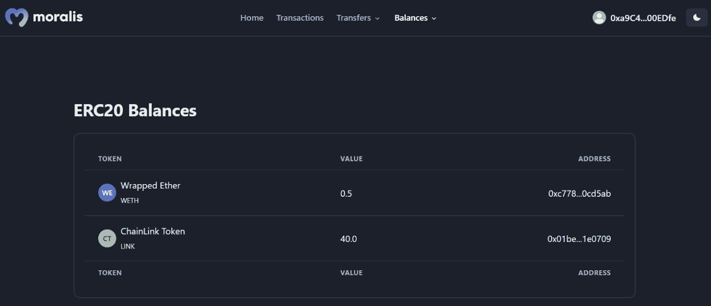

# 多边形样板–如何构建多边形 Dapps

> 原文：<https://moralis.io/polygon-boilerplate-how-to-build-polygon-dapps/>

您是否正在寻找构建多边形 dapps 的最高效和最有效的方法？如果是这样，那你来对地方了！这篇文章展示了使用 Moralis 的 Polygon 样板构建 Web3 应用程序的最快方法。这个样板文件就像一个 [Web3 网站模板](https://moralis.io/web3-template-build-a-dapp-using-a-web3-website-template/)一样，使开发过程变得更加容易，让你可以立刻创建多边形 dapps！为了展示[道德规范](https://moralis.io)和 Polygon 样板文件的威力，我们展示了如何创建一个 dapp，用户可以在其中登录并查看关于他们的 Web3 钱包的[链上数据](https://moralis.io/on-chain-data-the-ultimate-guide-to-understanding-and-accessing-on-chain-data/)。此外，如果您想跳过教程并立即检查项目代码，请单击下面的链接:

**全多边形样板文档—**[**https://github . com/以太坊-样板/以太坊-样板**](https://github.com/ethereum-boilerplate/ethereum-boilerplate)

如果你点击上面的链接，你会注意到这个库被称为“以太坊-样板”，这可能有点令人困惑。然而，这个模板是跨链兼容的，这表明你可以用它来构建多边形 dapps。您所需要做的就是对代码进行一些配置，这将在本指南中介绍。

然而，Polygon 样板文件提供了一个更容易访问的 Web3 开发过程，使您能够更有效地启动 Polygon dapps。结合其他 Moralis 工具——如各种[web 3 API](https://moralis.io/web3-apis-exploring-the-top-5-blockchain-apis/)——您可以使用该模板比竞争对手更快地创建 dapps 并将其推向市场！不管你是想用 Moralis 的 Polygon 样板创建 Polygon dapps 还是任何其他 Web3 项目——都可以考虑注册 Moralis。有了帐户，您将立即获得各种道德工具。更重要的是，你可以[免费创建你的账户](https://admin.moralis.io/register)，只需要几秒钟！

## 多边形解释–什么是多边形？

以太坊是 Web3 开发最突出的区块链；但是，网络遇到了拥塞问题，这是多边形网络进入等式的原因。Polygon 是以太坊网络的分散式扩展平台，有可能解决以太坊遇到的拥塞问题。

Polygon 提供了一个更具经济可行性和可持续性的发展。因此，开发人员可以以更低的成本创建 dapps。此外，Polygon 的重点是可扩展性和保持低交易费用。由于 Polygon 是一个以太坊扩展平台，网络可以在不牺牲安全性的情况下实现这一点，因为它利用了以太坊链。那么，Polygon 到底是如何做到这一点的呢？为了解释，我们将介绍多边形的一些基本特征:

*   **可扩展性**–以太坊的一个重要问题是可扩展性。Polygon 可以通过提供更具可扩展性的共识机制来解决这一问题。
*   **模块化**–多边形是模块化的。这表明网络倾向于更高的可扩展性、可升级性和可定制性。
*   **用户体验**–Polygon 注意到一个采用问题:Web2 和 Web3 中的用户体验不同。因此，Polygon 提供了类似于 Web2 的用户体验。

此外，由于多边形和以太坊密切相关，网络有许多相似之处。一个明显的例子是令牌标准。Polygon 就像以太坊一样，实现了熟悉的标准，如 ERC-20 和 ERC-721。事实上，MATIC——Polygon 的本机令牌——实现了 ERC-20 标准。

现在您可能对多边形网络更熟悉了，是时候深入到文章的中心部分了。因此，下面的部分将涵盖用 Moralis 的多边形样板创建多边形 dapps 的整个过程！

## 如何用 Moralis 的多边形样板创建 Dapps

对 Polygon 有了更好的理解，我们现在将通过下面的部分来展示用 Moralis 的 Polygon 样板构建 Polygon dapps 是多么容易。这样，我们将创建一个简单的 dapp，用户可以使用他们的 [Web3 钱包](https://moralis.io/what-is-a-web3-wallet-web3-wallets-explained/)进行身份验证。一旦通过认证，他们将能够访问有关他们钱包的信息。这包括他们的交易历史、特定代币的转移、余额等。

为了使教程更全面，我们将把指南分成四个部分。首先，我们将向您展示如何将项目克隆到您的本地目录。接下来，我们将看看环境变量的一些必要配置。最后，我们将向您展示如何启动和测试 dapp。

此外，在我们开始学习本教程之前，您需要快速处理一个先决条件，即 Moralis 帐户。配置环境变量时，您将需要一个 Moralis 帐户。然而，创建一个道德帐户很容易，只需要几秒钟。您只需点击 Moralis 网站右上角的“[免费开始](https://admin.moralis.io/register)”按钮:

在那里，输入一个电子邮件，创建一个密码，选中“我接受…”框，然后点击“注册”按钮。更何况这是完全免费的！现在，有了一个 Moralis 帐户供您使用，我们可以继续深入了解如何克隆 Moralis Polygon 样板文件！

### 克隆 Moralis 的多边形样板

本指南的第一部分围绕克隆 Moralis 的多边形样板。因此，首先使用简介中的链接导航到 GitHub 存储库。打开存储库后，您需要通过单击“代码”和“复制”按钮来复制回购 URL:

接下来，打开您选择的 IDE(集成开发环境)并为项目创建一个新文件夹。对于本演练，我们将使用 VSC (Visual Studio 代码)。请记住，如果您使用任何替代 IDE，某些步骤可能会略有不同。

从那里，打开一个新的终端。如果您像我们一样使用 VSC，您可以点击“终端”选项卡，然后点击“新建终端”:

现在，要将项目克隆到您的本地目录，剩下的工作就是在项目文件夹对应的位置使用 repo URL 运行以下命令:

*git 克隆“样板 _ URL”*

运行上面的命令会将多边形样板文件克隆到您的本地目录。从那里，您可以通过在终端中输入以下内容再次进入正确的文件夹:

*cd 以太坊-样板文件*

如果您按照初始部分中的步骤操作，它应该会在您的 IDE 中产生类似于下面的结构:

### 配置环境变量

本节将涵盖您需要对环境变量进行的所有配置。因此，您可以通过打开“. env.local.example”文件并将其重命名为“. env.local”来继续。此外，这是文件最初的样子:

*APP_CHAIN_ID=0x1*

*APP _ DOMAIN = ether eum . boilerplate*

*MORALIS_API_KEY= #获取您的密钥 https://admin.moralis.io/account/profile*

*next auth _ SECRET = # Linux:` OpenSSL rand-hex 32 `或者去 https://generate-secret.now.sh/64*

*next auth _ URL = http://localhost:3000 #生产替换*

从上面的片段中可以看出，有五个环境变量。然而，在这种情况下，您只需要考虑第一、第三和第四个变量。让我们从名为“ *APP_CHAIN_ID* ”的第一个开始，其值为“ *0x1* ”。您必须将该值更改为“ *0x1* ”对应以太坊区块链。因此，将“ *0x1* ”替换为“ *0x89* ”，即多边形网络的链 ID。

对于第三个" *MORALIS_API_KEY* "变量，您必须添加您的 API 密钥，这也是您的 MORALIS 帐户发挥作用的地方。因此，请登录，单击“Account”选项卡，然后单击“Keys ”,并复制 Web3 API 密钥:

从那里，只需将您的 API 密钥粘贴到代码中。您需要配置的最后一个变量是“ *NEXTAUTH_SECRET* ”。您需要为这个变量添加一个密钥，并且您可以使用这个链接来生成一个值:“【https://generate-secret.now.sh/32”[”。手头有一个密钥，将密钥输入到代码中，使“ *NEXTAUTH_SECRET* ”等于该值。](https://generate-secret.now.sh/32)

最后一个变量“ *NEXTAUTH_URL* ”设置为“ *http://localhost:3000* ”。这将允许您在本地主机上运行多边形 dapp。这在发展阶段是非常好的；然而，一旦您启动了 dapp，您就需要将这个值更改为等于您的 dapp 的 URL。

然而，在下面，您会发现“. env.local”文件的代码可能是这样的示例:

*APP_CHAIN_ID=0x89*

*APP _ DOMAIN = ether eum . boilerplate*

*MORALIS _ API _ KEY = " YOUR _ API _ KEY "*

*next auth _ SECRET = b8e 786967d 7 bcbc 0 f 920d 35 bcc 3 f 891 c*

*next auth _ URL = http://localhost:3000*

### 启动 Dapp

现在，多边形 dapp 基本定型了！多亏了 Moralis 和 Polygon 样板，它不会比这更难。现在剩下的工作就是启动并测试应用程序。因此，我们将简要地利用这一部分向您展示如何启动该应用程序。

但是，在启动 Polygon dapp 之前，您必须安装各种依赖项。因此，在终端中运行以下命令之一(取决于您使用的是“ *npm* 还是“ *yarn* ”):

*npm i*

*纱线*

接下来，您可以使用以下任一输入在本地主机上运行 dapp:

*npm 运行开发*

*纱线运行开发*

dapp 启动并运行后，您可以使用之前指定的 URL 来启动它:“ [http://localhost:3000](http://localhost:3000/) ”。在下一节中，我们将确保一切正常，并涵盖 Moralis 的多边形样板的一些基本特性！

## 测试 Dapp 探索 Moralis 的多边形样板

一旦您启动多边形 dapp，您将到达以下登录页面:

如上图所示，顶部有几个选项卡和按钮供您浏览。但是，在探索各种选项之前，您首先需要通过点击“连接钱包”按钮来验证您的 Web3 身份:

这将启动您的 MetaMask 钱包，并允许您签署消息。然而，元掩码只是 Polygon 样板文件的默认 [Web3 认证](https://moralis.io/authentication/)机制。有了 Moralis，就有可能轻松地集成其他选项。如果您对此感兴趣，请学习如何使用 RainbowKit[添加签到。](https://moralis.io/how-to-add-a-sign-in-with-rainbowkit-to-your-project-in-5-steps/)

一旦通过认证，dapp 将会填充所有关于你的 Web3 钱包的信息。因此，例如，如果您点击顶部的“交易”选项卡，您会发现一个显示您的交易历史的表格:

您还可以浏览其他选项卡，如“转账”和“余额”。这些功能有一个小菜单，允许您在 NFTs 和 ERC-20 令牌之间进行筛选。如果您点击“Balances ”,它看起来会像这样:

在那里，您可以选择任何一种令牌类型。例如，如果选择了“ERC-20”选项，dapp 将显示钱包中的所有代币:

这基本上涵盖了多边形样板的基本特性。如果一切都如预期的那样工作，那么现在由您来添加或删除特性了！此外，如果你需要灵感，可以看看 Moralis 的博客。该博客以新鲜和令人兴奋的 Web3 开发内容为特色。例如，学习如何[建立一个 Web3 FIFA 克隆](https://moralis.io/how-to-build-a-web3-fifa-clone/)或[创建一个 NFT 门控网站](https://moralis.io/how-to-create-an-nft-gated-website-in-django/)。

然而，如果关于这个过程的问题仍然存在，请查看来自 [Moralis 的 YouTube](https://www.youtube.com/c/MoralisWeb3) 频道的以下剪辑，它进一步详细解释了我们在本文中研究的所有内容:

https://www.youtube.com/watch?v=Bb5Pc–kyAY

## 总结——用 Moralis 的多边形样板创建 Dapps

在本文中，我们向您展示了如何使用 Moralis 的 Polygon 样板文件构建 Web3 应用程序。该模板允许您在几分钟内轻松创建多边形 dapps！事实上，您需要做的就是克隆多边形样板文件，配置一些环境变量，并启动多边形 dapp。

这样做的结果是一个简单的应用程序，用户可以用他们的 Web3 钱包登录。登录后，他们可以查看自己钱包的信息，包括交易历史、某些代币的转账、余额等。因此，它为任何 dapp 提供了一个很好的基础，您需要做的就是通过添加/删除特性来定制模板！

如果你觉得这篇文章很有帮助，并且想要其他网络的指南，可以看看下面关于如何[构建以太坊 dapp](https://moralis.io/full-guide-how-to-build-an-ethereum-dapp-in-5-steps/) 或者[构建 Cronos dapp](https://moralis.io/how-to-build-a-cronos-dapp-in-5-steps/) 的文章。这些指南利用了 Moralis 的奇妙工具，促进了更容易获得的开发体验。如果你有进一步的兴趣，想了解更多关于 Moralis 的工具，我们建议你，例如，查看 Moralis 的 [Web3 Streams API](https://moralis.io/streams/) 或 [Solana API](https://moralis.io/solana-api/) 。

此外，如果你想开始你的 Web3 开发之旅并构建你自己的项目，可以考虑 [Moralis Academy](https://academy.moralis.io) 。通过注册，你可以成为区块链认证，并立即开始建立你的第一个 dapps！例如，如果你是这个领域的新手，可以看看下面涵盖基础知识的课程:“[区块链&比特币 101](https://academy.moralis.io/courses/blockchain-bitcoin-101) ”。

然而，如果您想使用 Moralis 的多边形样板或任何其他项目来构建，这并不重要；[注册 Moralis](https://admin.moralis.io/register) 并访问各种开发工具，因为它们将有助于任何开发过程！