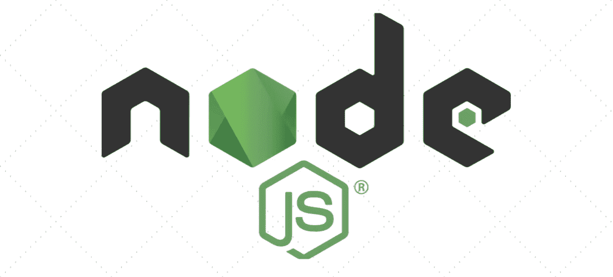
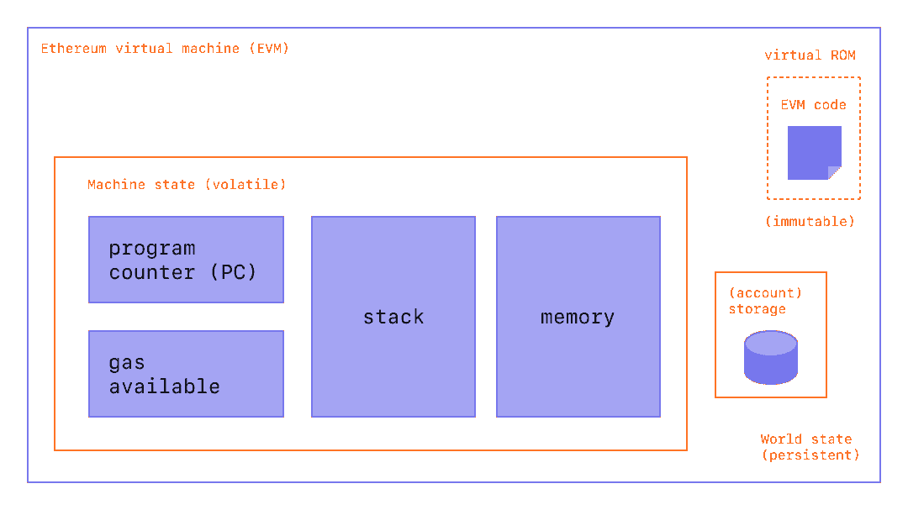
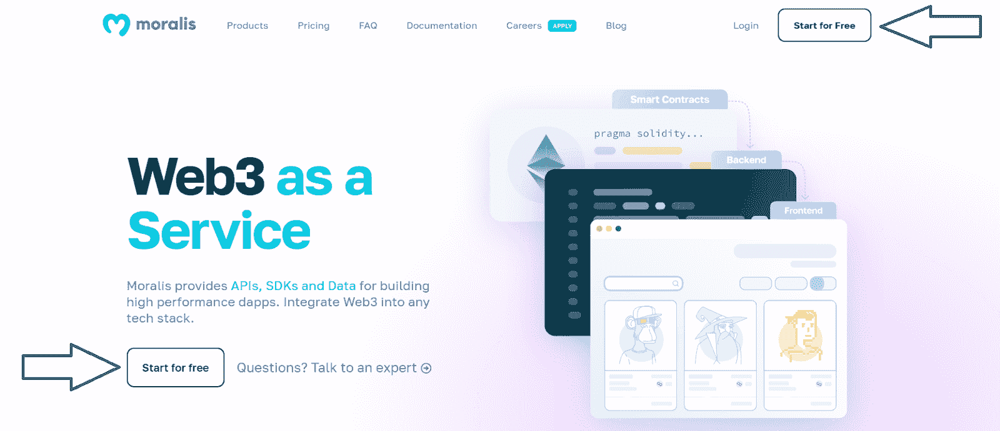
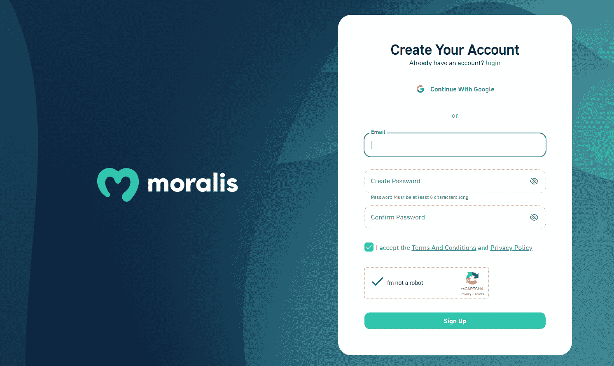
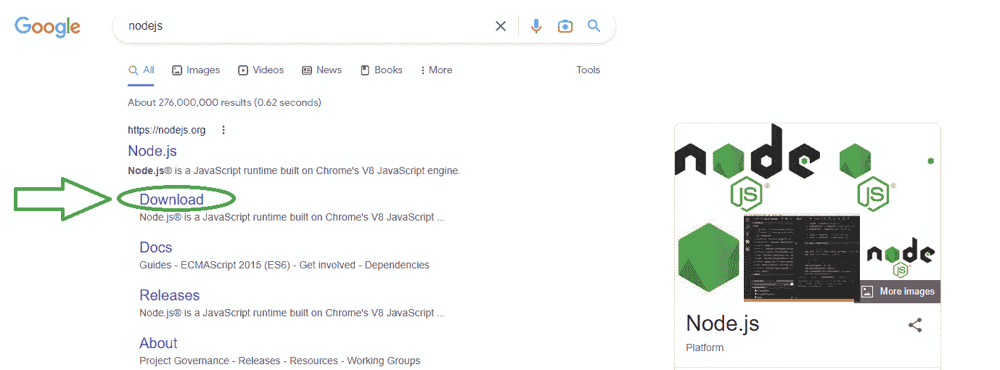
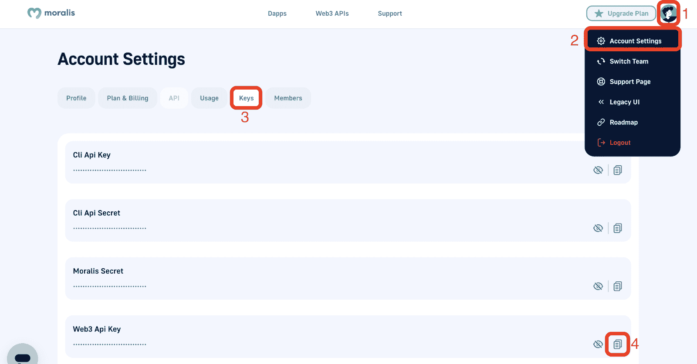
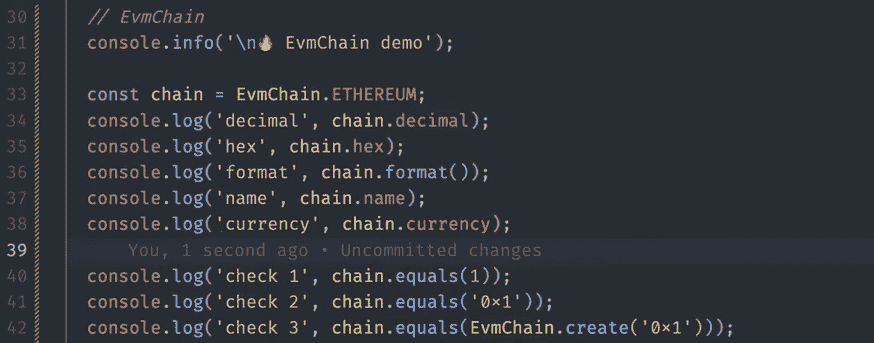

# 探索终极节点 EVM API

> 原文：<https://moralis.io/exploring-the-ultimate-nodejs-evm-api/>

为了快速启动 Web3 项目，开发人员必须有一个简单的方法将 Web3 集成到他们的技术堆栈中。这就是拥有一个有能力的 NodeJS EVM API 的原因。如果你想不费吹灰之力地用 JavaScript 创建杀手级应用程序，这个 Web3 API 是关键！此外，Moralis 简化了使用这个 NodeJS EVM API 的过程，并允许您免费使用它。在这里，我们演示了如何开始使用这个 API，但是首先，我们需要确保你们都知道基础知识。因此，我们必须首先检查什么是 NodeJS 和 EVM。然后，我们简单解释一下什么是 API。最后，我们展示了如何获得 Moralis API 密钥，这将是您使用最终 NodeJS EVM API 的门户！

在介绍了 Moralis 的 NodeJS EVM API 的基础知识之后，我们将演练一下如何使用 NodeJS SDK。因此，请确保您[创建了您的免费道德账户](https://admin.moralis.io/register),以便您可以跟随我们的脚步。此外，利用本文中获得的知识和技能，您将准备好轻松地处理自己的想法。

除非你一直生活在岩石下，否则你知道 Moralis 是最终的 Web3 后端平台。它为您提供了三个核心的 Web3 开发特性——[web 3 认证](https://moralis.io/authentication/)、 [Web3 同步](https://moralis.io/syncs/)和 Web3 APIs。此外，Moralis 是跨平台互操作的。因此，你可以使用你喜欢的遗留平台和 Web2 开发技能来加入 Web3 革命。此外，Moralis 支持多区块链，这使您能够使用相同的代码行将 dapps 部署到不同的网络。因此，您将获得更大的影响力，并使您的工作经得起未来的考验。



## 什么是 node.js

NodeJS，或 Node.js，是 2009 年诞生的一个编程平台或环境。它的主要目的是帮助管理 JavaScript 的一些复杂性。而且 NodeJS 适合区块链时代的 web 开发。这个编程平台是建立在 Chrome 的 JavaScript 运行时之上的。此外，NodeJS 使开发人员更容易构建可伸缩的高性能应用程序。它通过具有以下重要特征的框架实现了这一目标:

*   **利用事件驱动的非阻塞 I/O 模型–**后者确保节点流程在检索单一响应时不会锁定整个 web 应用程序。相反，它只是移动到下一个事件，并继续运行，直到事件队列为空。此外，NodeJS 引入了一个独特的事件模型。后者不仅使用库作为运行时构造函数，还使用事件循环。此外，这个模型不需要阻塞调用来启动事件循环。由于这个特性，NodeJS 提供了一个轻量级的、高效的、非常适合跨分散网络的实时应用程序的框架。

*   **同时在客户端和服务器端运行—**这个 NodeJS 特性增强了 JavaScript 的使用。通过允许 web 应用程序以实时、双向连接的方式运行，服务器和客户端都可以发起通信并自由交换数据。

*   **支持开发人员重用代码—**NodeJS 打包管理器(NPM)以代码重用而闻名。毕竟，有超过一百万个软件包可供开发人员在编程任务中使用。此外，重用代码的能力极大地有利于运行大量 JavaScript 应用程序的开发人员。这使他们能够避免在编辑和搜索工具之间切换上下文的额外负担。


最终，NodeJS 实现了实时数据交换和通信，这在处理公共区块链时至关重要。



## 什么是 EVM？

以太坊虚拟机，或 EVM，是一个图灵完全虚拟机，使代码完全按照预期执行。因此，它是以太坊和其他 EVM 兼容链上所有智能合约的运行时环境。这使得 EVM 成为推动以太坊和其他 EVM 兼容链的引擎；毕竟，智能合约是所有加密货币和 dapps 背后的核心程序。

*如果这是你第一次听说图灵完备性和虚拟机，请务必阅读我们的“**”和“*[EMV API 终极版](https://moralis.io/the-ultimate-evm-api-full-2022-guide/) *”指南。后者也将为你提供什么是智能合同的简洁解释。*

让我们也考虑一下 API 的如下定义。API 代表“应用程序编程接口”，这是一种使软件能够与其他软件进行交互的接口。此外，API 通过使不同的指令集能够被翻译或以某种方式被传递以便相互理解来支持这种通信。此外，API 使开发人员能够在他们的应用程序中使用现有的 API 集，避免浪费时间和金钱或重新发明轮子。

现在，我们可以将所有这些联系在一起，并得出结论，NodeJS EVM API 是一组指令、定义和协议，支持运行在 EVM 和基于 JavaScript 的前端上的软件之间的通信。


## 使用终极 NodeJS EVM API

正如本文开头提到的，Moralis 为您提供了终极节点 EVM API。后者是完全模块化的，非常容易使用。这是将 Web3 功能集成到任何后端的最简单的方法之一。此外，它提供了完整的类型脚本(TS)支持。通过使用 NodeJS EVM API，您可以毫不费力地查询各种区块链数据。这包括 NFT(不可替代令牌)、可替代令牌、余额、交易等等。此外，由于 Moralis 的跨链互操作性，您可以在所有领先的可编程区块链上使用这个 NodeJS EVM API！

要使用 Moralis 的 NodeJS EVM API，您必须完成以下步骤:

1.  创建 NodeJS Web3 应用程序
2.  导入并设置最新的 Moralis NodeJS SDK
3.  设置简单快速服务器
4.  将您的应用程序与 Moralis 服务集成

通过完成上述步骤，您将能够从所有支持的区块链中读取各种数据。当然，我们会一起看一些例子。此外，要完成上述步骤，您必须创建您的 Moralis 帐户。您可以使用我们在本文中最初提到的“创建您的免费 Moralis 帐户”链接，或者访问 Moralis 官方网站并点击“免费开始”按钮:



在下一页上，输入您的凭据:



不要忘记点击发送到您电子邮箱的电子邮件中的确认链接。接下来，您还需要安装和设置您喜欢的代码编辑器或 IDE。如果你想跟随我们的领导，请随意使用 Visual Studio 代码(VSC)。尽管如此，您还需要安装 NodeJS:



## 终极 NodeJS EVM API 入门

在初始化新项目之前，请确保为项目创建一个新文件夹。然后在 VSC 打开那个文件夹。接下来，使用 VSC 的终端并使用“npm init”命令来初始化一个新项目。完成设置后，您必须根据您的喜好为您的项目命名并填写详细信息。如果您决定使用默认设置，可以按 enter 键。初始设置后，您应该会看到“package.json”文件。此外，您还需要安装“Express”和“Moralis”依赖项。为此，请再次使用终端并输入“npm install moralis express”命令。

接下来，创建“index.js”文件，它将负责 Express 服务器的设置:

```
const express = require('express')
const app = express()
const port = 3000

app.get('/', (req, res) => {
  res.send('Hello World!')
})

app.listen(port, () => {
  console.log(`Example app listening on port ${port}`)
})
```

另外，请确保将以下脚本添加到您的“package.json”文件中:

```
"scripts": {
  "start": "node index.js"
},
```

现在，您可以使用“npm run start”命令运行 Express 服务器了。然后，您可以通过访问以下 URL 来检查您的服务器是否正在运行:

*http://localhost:3000*

要实际使用 Moralis 的 NodeJS EVM API，您还需要将 Moralis 添加到您的 dapp 中。要做到这一点，您需要从您的 Moralis 仪表板获取您的 Web3 API 密钥，只有在您创建了您的 Moralis 帐户(如上所述)后，您才能访问该仪表板。进入 Moralis 仪表板后，点击右上角的个人资料图标。然后，点击帐户设置，并选择“钥匙”标签。在那里，您可以复制您的 Web3 API 密钥:



最后，您需要将 API 密匙粘贴到代码中。

### 将 Moralis 的 Web3 API 密钥添加到代码中

在将 Moralis Web3 API 键添加到代码中时，您有几种选择。例如，您可以按照官方的 [Moralis 文档](https://docs.moralis.io/docs/nodejs-dapp-from-scratch)中的说明，将它直接添加到之前创建的“index.js”文件中。或者，你可以有一个单独的”。env”文件，该文件将保存该值(有关详细信息，请参见本文底部的视频):


无论哪种情况，您都需要从*‘Moralis’*和*‘@ moralisweb 3/EVM-utils’*的“EvmChain”数据类型中导入 Moralis。此外，您还需要“Moralis.start”功能。

## 终极节点是 EVM API 和“EvmChain”

*注* *:关于如何处理 EVM 兼容链条的详细视频教程，请使用下面的视频，从 1:20 开始。*

Moralis 的 NodeJS EVM API 将链作为一个名为“Moralis dataTypes”的独立类实例来处理。因此，您调用“EvmChain ”,后跟一个点，然后是链。以下是一些例子:

*   *EvmChain。以太坊*
*   " T0 "是个新手
*   *EvmChain。BSC*
*   *EvmChain。多边形*
*   *EvmChain。雪崩*
*   *EvmChain.FANTOM*

您也可以使用“ *EvmChain.create()* ”来完成上述操作，您需要在括号中输入链名或 ID。这里有一个例子:

*   *EvmChain.create("以太坊")或 EvmChain.create(1)*

要查看以上值是如何记录的，请使用下面从 2:05 开始的视频。在那里，您还将看到以下实用程序方法的运行:

*   “ *.decimal* ”
*   *。十六进制*
*   *。姓名*
*   *。货币*
*   *。格式**(这个需要自己设置格式)*
*   *。等于()*"



## 终极节点是 EVM API 和“EvmAddress”

*注意* *:关于如何使用“EvmAddress”的详细视频教程，请查看下面的视频，从 3:51 开始。*

要使用最终的 NodeJS EVM API 创建新地址，可以使用“ *EvmAddress.create()* ”。此外，地址需要在括号内，就像这样:

```
EvmAddress.create("0x1234567890123456789012345678901234567890")
```

在上面的例子中，我们使用小写，但它也适用于大写字母。此外，以下是一些常见的实用方法:

*   *。小写*
*   “ *.checksum* ”
*   *。等于()*"
*   *。format()**(这个需要自己设置格式)*


## 《埃夫马皮》和《道德》。授权"

*注* *:关于如何使用“EvmAPI”的详细视频教程，请查看下面的视频，从 4:33 开始。*

使用“EvmAPI”会给你带来我们 NodeJS EVM API 不可思议的强大功能。就像“EvmChain”和“EvmAddress”一样，“EvmAPI”跟在“Moralis”后面。后面是 API 和 API 端点的类型。下面是一个获取账户代币余额的示例:

```
"Moralis.EvmApi.account.getTokeBalances()”
```


使用*。托吉森*、*。生*、*。结果*"数据类型使您能够选择返回值的格式。

NodeJS EVM API 还允许您访问 Moralis Web3 Auth API (7:55)。再者，*道德家。Auth* 有两种方法——“*请求消息*和“*验证*”。将来，我们会发布更多关于如何使用 Moralis Web3 Auth API 的信息。然而，这里有一个关于代码的例子:


最后但同样重要的是，这里有一个视频教程，我们的内部专家将为您提供更多关于道德 EVM API 的详细信息:

https://www.youtube.com/watch?v=RPK37-_ZJFE

## 探索终极 NodeJS EVM API–总结

在本文中，您有机会了解了道德 EVM API。我们从解释什么是 NodeJS 和 EVM 开始。此外，我们简要介绍了什么是 API。有了基础知识之后，我们把重点放在实际使用这个终极节点 EVM API 上。这就是我们检查您需要开始的步骤的地方。因此，您发现先决条件之一包括获得您的 Moralis Web3 API 密钥。现在你知道后者在你的 Moralis 仪表盘的账户设置中的“钥匙”标签里等着你。随着我们向前推进，你也有机会仔细看看“ *EvmChain* ”、“ *EvmAddress* ”、“ *EvmAPI* ”和“ *Moralis”。Auth* ”。

我们希望这篇文章能让你看到，你可以利用你现有的 JavaScript 能力，开始毫不费力地创建 Web3 应用程序。通过使用 Moralis 的 NodeJS EVM API，您可以专注于创建最好的前端，而 Moralis 则满足您的后端需求。如果你已经有了一些很酷的 dapp 想法，一定要卷起袖子开始行动。然而，如果你有兴趣先学习一些优秀的教程，一定要去看看[道德博客](https://moralis.io/blog/)和[道德 YouTube 频道](https://www.youtube.com/c/MoralisWeb3)。本质上，这两个途径可以让你免费成为 Web3 开发者。

另一方面，你可能有兴趣采取更专业的方法。如果这是你喜欢的，报名参加道德学院可能正是你需要的自信提升。通过成为区块链认证，你将大大提高你的机会去全职加密越早越好。