# 如何将 NFT 转换成游戏中的物品

> 原文：<https://moralis.io/how-to-convert-an-nft-to-an-in-game-item/>

**[**不可替代代币**](https://moralis.io/non-fungible-tokens-explained-what-are-nfts/) **(NFTs)的流行已经向我们表明，人们喜欢拥有数字资产。然而，说到 NFT 公用事业，我们才刚刚起步。我们敢预测，在未来的几年里，NFTs 将会给许多行业带来革命性的变化。游戏肯定是其中之一。此外，如你所知，NFT 在 Web3 游戏中起着非常重要的作用。因此，我们想向您展示如何将 NFT 转换为游戏中的物品。我们将通过一个示例项目来做到这一点，在该项目中，我们将铸造一个 NFT，然后使用该 NFT 作为电源。虽然这听起来像是一个极其复杂的壮举，但我们向您保证，它比您想象的要简单得多。你看，Web3 栈在过去的几年里取得了长足的进步。因此，现在有许多有用的 Web3 开发工具。****

**接下来，你将使用 Unity、Hardhat 和 [Moralis](https://moralis.io/) 将 NFT 转化为游戏中的物品。Hardhat 是一个开发环境，它使得创建、编译和部署智能契约变得非常容易。因此，它也简化了铸造 NFT。毕竟，我们需要智能合约来实现这一点。然而，正是 Moralis(又名 Firebase for crypto)让你能够使用 Unity 创建杀手级应用程序([分散应用](https://moralis.io/decentralized-applications-explained-what-are-dapps/))。感谢 Moralis 的 SDK，您可以毫不费力地集成 Web3 身份验证。此外，使用 Moralis 提供的终极 NFT API，您还可以毫不费力地将 NFT 转换为游戏中的物品。**

**如果你对此感兴趣，请务必[创建你的免费道德账户](https://admin.moralis.io/register)并跟随我们。不过，在我们给你机会动手之前，让我们快速演示一下我们的示例 Web3 游戏。**

**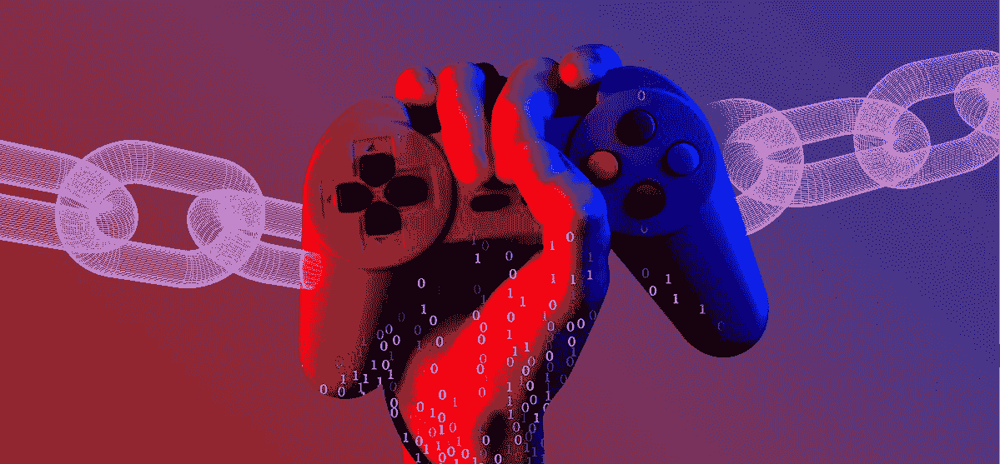

## 我们的带电源的示例 Web3 游戏–演示

与大多数 dapps 一样，在我们的示例 Web3 游戏中，我们将 NFT 转换为游戏中的物品，从身份验证开始:

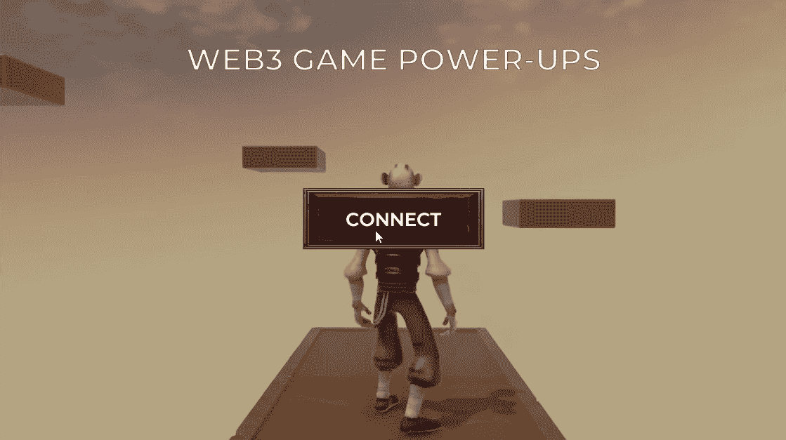

因此，用户需要首先点击“连接”按钮。单击按钮后，我们的示例游戏显示一个二维码。因此，玩家可以使用他们最喜欢的移动 Web3 钱包，例如 MetaMask，继续进行:

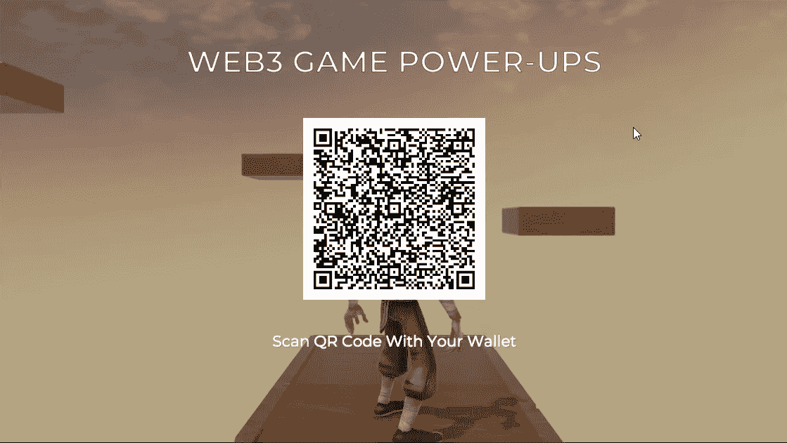

一旦玩家扫描代码，他们还需要在钱包中确认他们的身份验证:

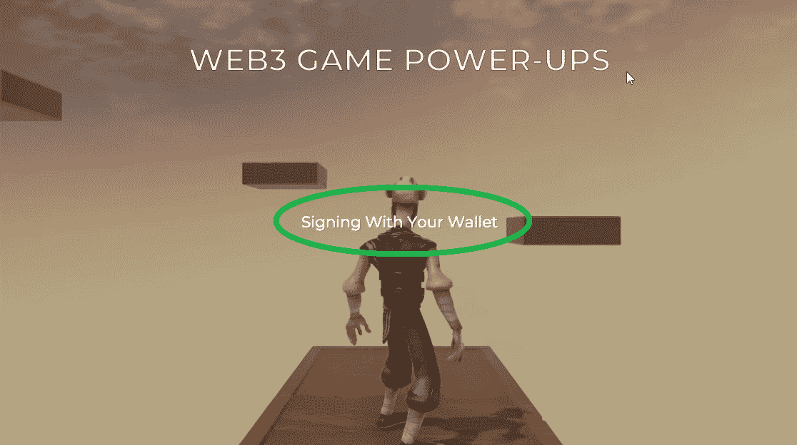

然后，他们终于可以控制游戏角色。而且，从上面的截图可以看到，角色前面有一些平台。我们的目标是跳到这些平台上。然而，在正常状态下，角色没有足够的力量进行跳跃:

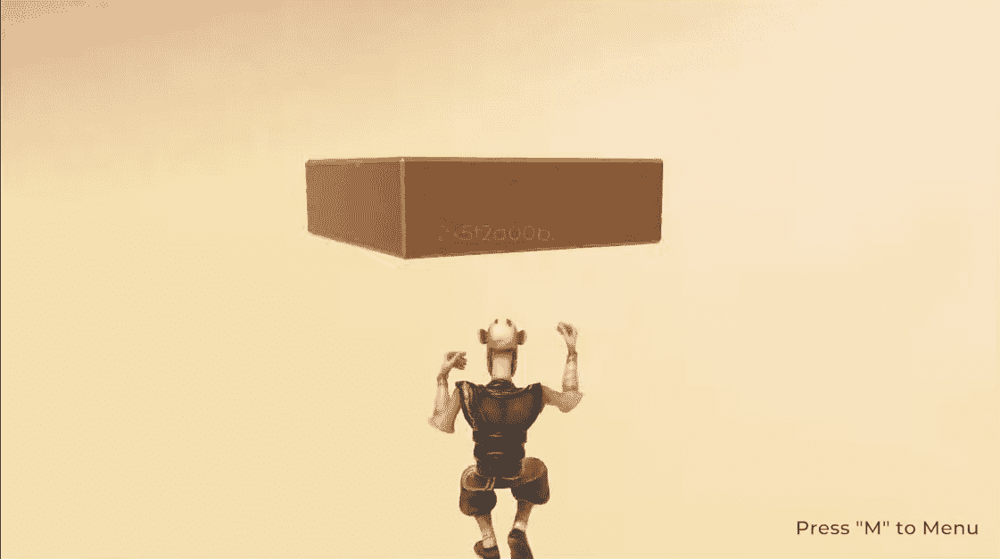

所以，这就是电源发挥作用的地方。如果你玩过超级马里奥，你就会知道能量有多棒。

### 将 NFT 转化为游戏中的物品——链上加电

在这一点上，玩家可以点击“M”，在那里他们有一个电源。然而，这不是常规的加电，在我们的例子中，这是一次 NFT。这是一个 NFT，我们将把它转换成游戏中的资产。进入菜单后，玩家需要点击启动项目:

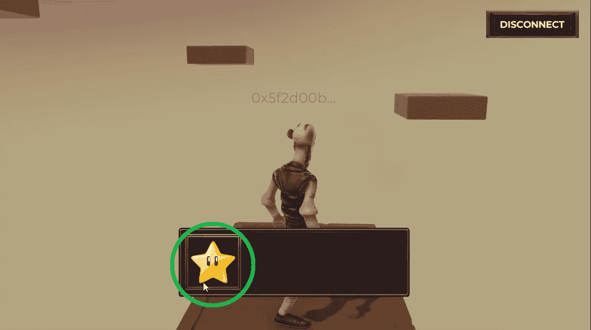

此外，由于该物品是一个 NFT，点击后，玩家还需要使用他们的钱包来确认链上交易:

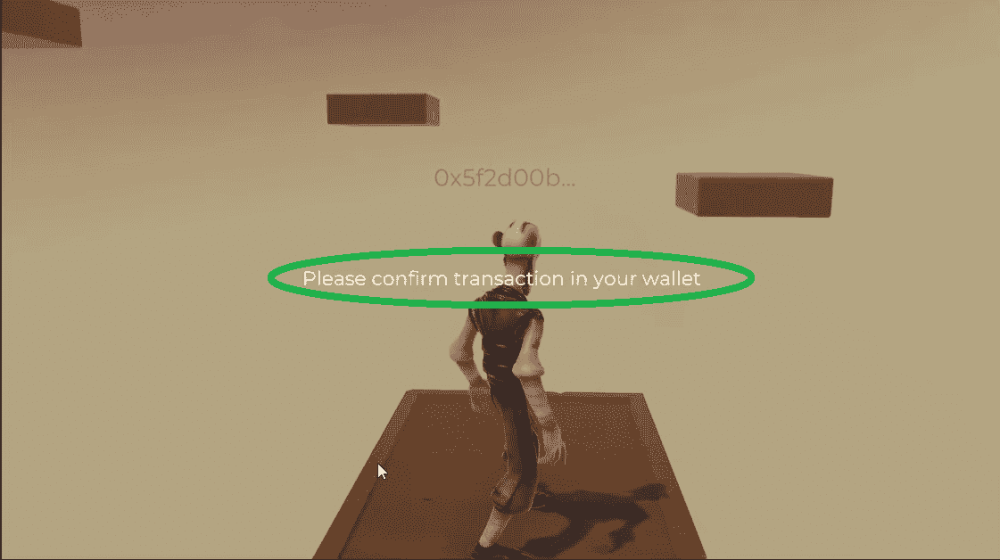

在这个交易中，我们将 NFT 转换为游戏中的物品。一旦玩家确认上述交易，他们的角色将自动升级 12 秒:

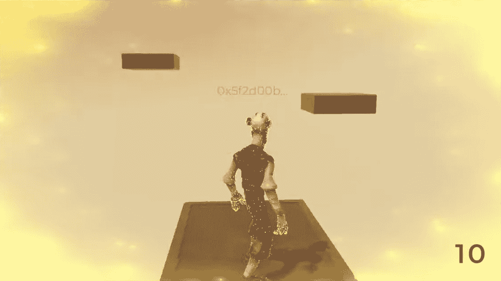

此外，正如您在上面的图像中看到的，我们的示例游戏也有一些视觉效果，这表明已经应用了加电。此外，右下角有一个计数器，显示上电剩余的秒数。因此，这是玩家必须在平台之间跳跃的时间。因此，熟练的玩家可以一路到达顶端，这就是我们示例游戏的目标:

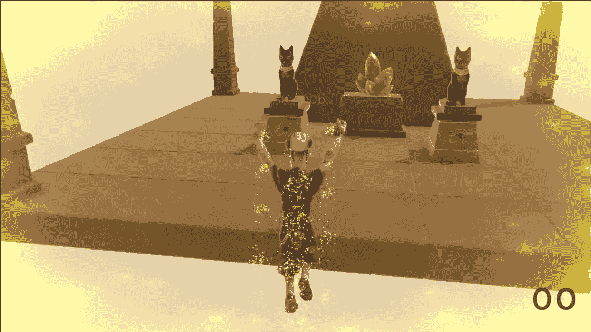

当然，在我们的示例游戏中我们可以包含更多的特性。然而，本教程的目的是教你如何将 NFT 转换成游戏中的物品。并且，上述特征涵盖了该方面。因此，如果您觉得我们的示例 dapp 有趣，请务必卷起袖子创建自己的实例。

# 如何将 NFT 转化为游戏中的物品，包括团结、头盔和道德

在接下来的部分中，我们将分六个阶段处理今天的示例项目。首先，我们将查看项目结构，为您提供一个更广阔的视野，然后再关注具体的特性。其次，我们将向您展示如何完成初始 Moralis 设置。这是你获得道德 dapp 证书的地方，这将是你使用 Web3 功能的途径。第三，我们将向您展示如何使用 Hardhat 来部署一个相当简单的 ERC721 契约。然后，我们将使用我们的“NFT 联合铸币机”铸造一个 NFT 样板。接下来，您将学习如何在 Unity 中获得 NFT 属性。最后，我们将向您展示如何使用这些属性作为动力。

### 项目结构概述

从访问我们项目的 GitHub 页面开始，在这里您可以克隆代码或下载 ZIP 文件:

接下来，打开您的 Unity hub，打开包含项目的文件夹，然后打开项目:

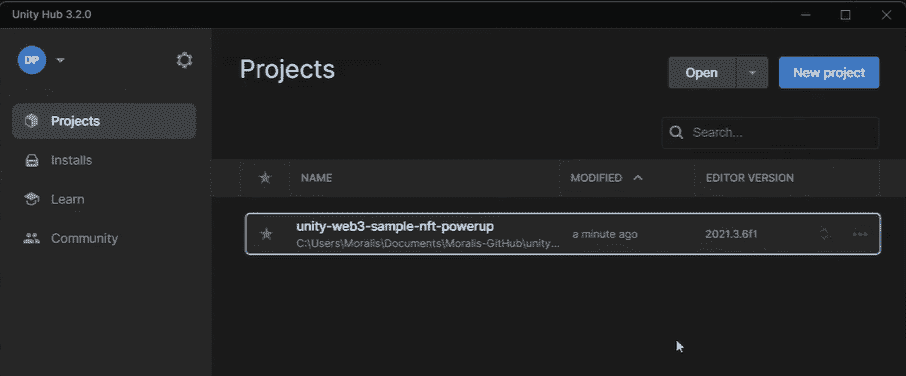

当您打开项目时，默认情况下您会看到“道德网站 3 设置”窗口。您现在可以关闭该窗口，因为我们将首先查看项目的结构:

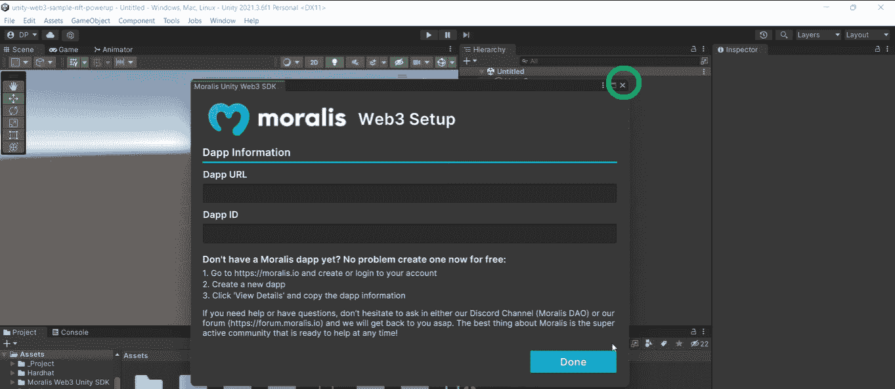

*注* *:更详细的项目结构概述，使用文章底部的视频，从 5:15 开始。这也是你学习更多关于开机时特效的地方(如上面演示中所展示的)。*

在“_Project”文件夹中，是这个示例 Web3 游戏中涉及的所有资产。这也是您可以找到“场景”文件夹的地方:

此外，在“场景”文件夹中，您会找到“游戏”场景。打开它:

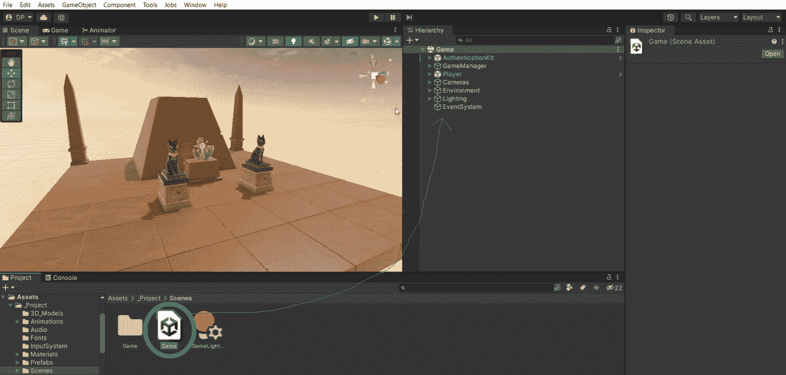

查看“游戏”场景层次，可以看到“AuthenticationKit”在上面。后者负责 Web3 认证。接下来是“游戏管理器”，其中我们使用一个状态机来遍历所有游戏状态:

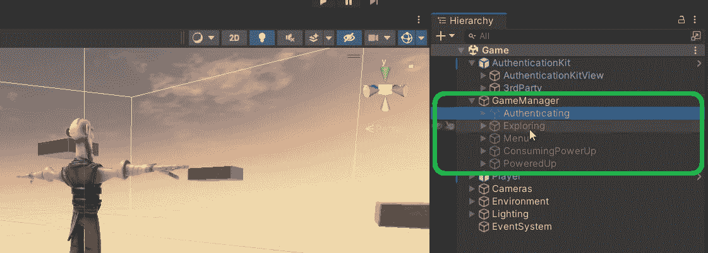

正如你在上面的截图中看到的，一旦玩家用他们的钱包认证，游戏就会激活“探索”游戏状态。当玩家按下“M”按钮时，他们激活“菜单”状态。此外，如果玩家点击该物品,“消耗能量”状态将接管一切。这是游戏获得 NFT 属性的地方。而且，一旦玩家确认交易，就会进入“PoweredUp”游戏状态。

## 初始道德和统一设置

既然您已经知道了我们的示例项目的要点，那么是时候完成初始设置了。因此，您需要创建您的 Moralis dapp，并将其凭证复制到 Unity 的“Moralis Web3 设置”窗口中。然而，由于我们关闭了上面的窗口，我们需要首先重新打开它:

“Moralis Web3 设置”窗口为您提供了简单的三步说明。不过，为了进一步帮助您，请遵循以下步骤:

1.  创建您的免费 Moralis 帐户或登录您现有的帐户:

2.  在您的 Moralis 管理区域内，您需要创建一个新的 dapp。您可以点击“创建新 Dapp”按钮来完成此操作:

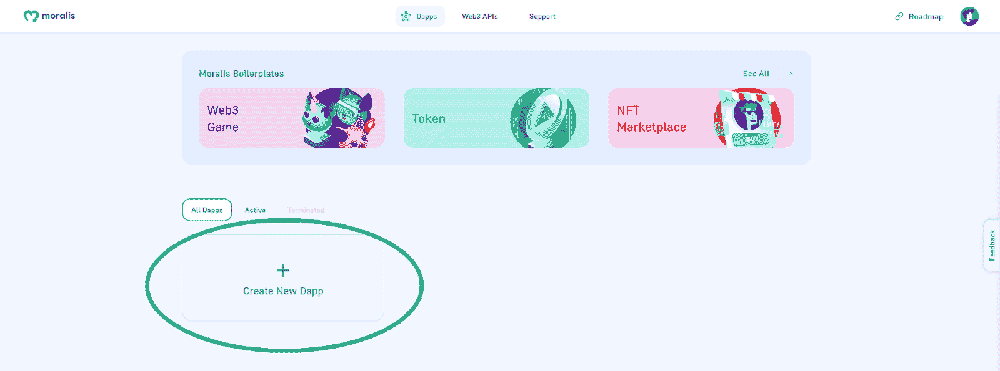

3.  在弹出窗口中，选择您的环境。在处理示例项目时，使用“Testnet”选项:

4.  接下来，您需要选择您想要关注的链。我们建议使用“多边形孟买”。要继续，请单击“继续”按钮:

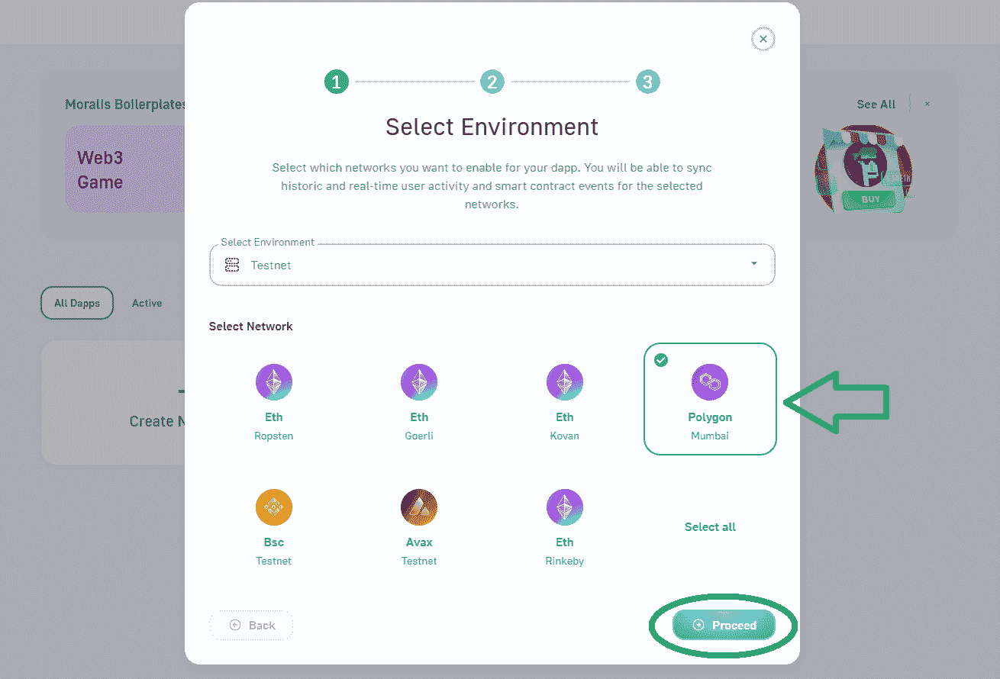

5.  现在您需要选择您的地区。您可以从给定选项中选择离您实际位置最近的城市:

6.  接下来，你要给你的 dapp 命名。这可以是你想要的任何东西。有了名称后，点击“创建您的 dapp”按钮旋转您的 Dapp:

7.  一旦您的 dapp 上线，您就可以通过“设置”按钮获得其凭证(URL 和 ID ):

8.  使用“复制”图标复制您的 dapp URL 和 ID:

9.  最后，将上面复制的凭证粘贴到 Unity 中，并单击“完成”:

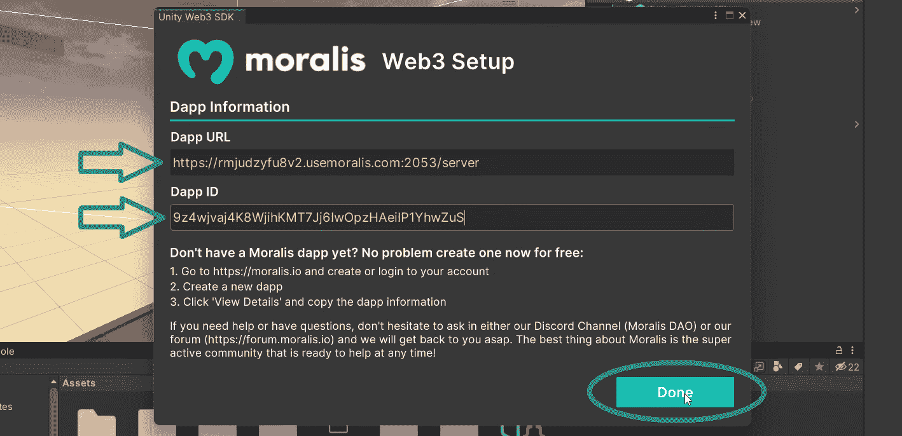

*完成初始设置后，是时候学习如何使用 Hardhat 部署智能合同了。*

## 使用 Hardhat 部署 ERC721 智能合同

至此，您已经知道智能合约负责制造 NFT。因此，如果我们想将 NFT 转换为游戏中的物品，我们需要部署一个智能合约。为了让您尽可能简单明了，我们创建了一组说明，涵盖了您需要完成的所有步骤。您可以在“资产>安全帽”中找到该文件:

除了说明，这也是你可以找到我们合同的地方(在“合同”文件夹里)。如果您想跟随我们的内部专家完成所有步骤，请使用下面的视频，从 12:28 开始。他将向您展示如何安装 Hardhat，创建一个新的 Hardhat 项目，以及如何对模板文件进行必要的调整。此外，您还将学习如何获取孟买网络 URL、您的 Polygonscan API 密钥和您的私钥(21:00)。您将需要“hardhat.config.js”文件中的这些详细信息。

此外，为了支付与部署智能合约相关的交易费用，您需要一些“测试”工具。幸运的是，您可以使用 Polygon 水龙头免费获得孟买网络的 MATIC(22:53)。一切就绪后，您将使用“npx hard hat run scripts/deploy . js–network Mumbai”命令部署您的智能合约。您的终端将为您提供您的智能合同地址，您可以使用 Polygonscan (testnet)使用该地址。在那里，您可以获得有关您的 ERC721 智能合约的所有详细信息，包括其 ABI (25:02)。

### 铸造一个 NFT 的例子

如前所述，我们将使用我们的 NFT 团结铸币机轻松铸造一个 NFT 的例子。有关如何使用这一有用工具的详细信息，请从 25:50 开始，使用我们的“ [mint a Unity NFT](https://moralis.io/how-to-mint-a-unity-nft/) ”指南或下面的视频。当然，还有其他方法来制造 NFTs 然而，使用我们的 minter dapp 非常简单。总而言之，你将得到一个具有“持续时间”和“运动”属性的 NFT:

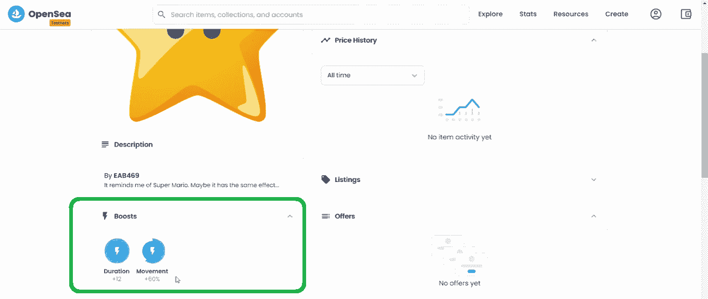

我们现在将在 Unity 中使用这些属性，给我们的游戏角色一个提升。因此，当谈到使用 NFT 作为电源时，NFT 属性起着重要作用。

## 将 NFT 转换为游戏中的物品–代码演练

如果你已经按照上面的说明做了，现在你已经准备好完成最后两个阶段了。因此，要将一个 NFT 转换成游戏中的物品，你需要先获得上面创造的 NFT 的属性。因此，返回到 Unity 中的“Unity Web3 样本 NFT 加电”项目。使用“游戏管理”并粘贴智能合同详情(33:51):

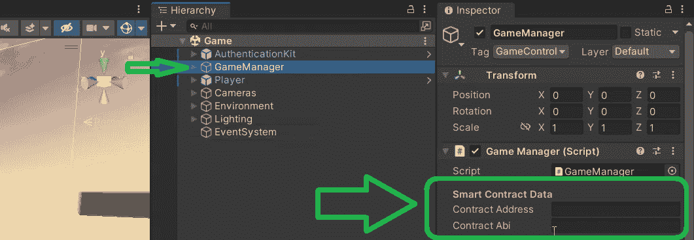

从 35:30 开始，您将有机会仔细查看“菜单”脚本。这是代码通过其他脚本获取和利用 NFT 属性的地方。此外，是“InventoryItem”脚本将 NFT 属性分配给游戏中的开机值。

### 使用 NFT 属性作为动力

要获得您的 NFT 的属性，您只需粘贴您的智能合同的详细信息。此外，您还有机会了解确保一切顺利运行的代码。然而，要使用 NFT 属性作为动力，我们需要将 NFT 转化为游戏中的物品。我们已经完成了上述转换的大部分。尽管我们仍然需要执行链上事务，这也将触发“GoToConsumingPowerUp”函数。

您可以在“ConsumingPowerUp”脚本(46:22)中找到详细信息，该脚本负责覆盖与我们的智能契约的交互。这就是“ExecuteConsiming”接收令牌 ID 并发挥作用的地方。多亏了 Moralis 的 SDK 和“ExecuteContractFunction”，一行代码就完成了大部分繁重的工作。此外，这也是我们从智能契约中调用“消费”函数的地方，它触发了正在讨论的 NFT 的燃烧。因此，玩家点击物品清单中的物品后发生的链上交易会烧掉令牌。因此，它也从菜单中删除该项目并激活“PoweredUp”游戏状态。因此，最终利用我们的 NFT 属性的是“PoweredUp”脚本。

*最后但同样重要的是，这是我们在文章中引用的视频教程:*

https://www.youtube.com/watch?v=OQrEqICa6mw

## 如何将 NFT 转换成游戏中的物品——总结

使用今天的示例项目，您有机会学习如何将 NFT 转换为游戏中的物品。您能够使用我们的示例项目非常容易地做到这一点。此外，您还有机会使用 Hardhat 来部署您自己的智能合同。这一部分相当重要，因为它使您能够了解让您向 NFT 添加属性甚至刻录 NFT 的功能。尽管如此，您也有机会了解了将 NFT 转换为游戏中物品的代码行。因此，您现在可以调整我们的示例项目来添加更多的特性，并使用其他 NFT 作为启动。当然，你也可以用那种 NFT 功能创建你自己的 Web3 游戏。

如果你喜欢这个示例项目，我们鼓励你访问 Moralis 的 [Web3 YouTube](https://www.youtube.com/c/MoralisWeb3) 频道和 Moralis 的 [Web3 博客](https://moralis.io/blog/)。这些网点提供了大量的教程和各种加密方面的详细解释。事实上，它们是可以免费帮助你成为 Web3 开发者的平台。然而，如果你想尽快成为全职加密员，那么你应该考虑采取更专业的方法。在这种情况下，报名参加[道德学院](https://academy.moralis.io/)可能是你的正确道路。**