# NFT 在线分析——如何探索 NFT 钱包

> 原文：<https://moralis.io/nft-on-chain-analysis-how-to-explore-nft-wallets/>

**2021 年是 NFTs (** [**不可替代代币**](https://moralis.io/non-fungible-tokens-explained-what-are-nfts/) **)的游戏规则改变者。当然，一些项目只是试图利用 NFTs 的流行。然而，2021 年看到了** [**NFT 公用事业**](https://moralis.io/nft-utility-exploring-nft-use-cases-in-2022/) **开始探索新的前沿。因此，对大多数人来说，很明显，非技术产业将继续存在，并可能重塑无数行业。因此，开发者已经知道 NFT 链分析将是必不可少的。虽然这听起来非常复杂，但我们向您保证这非常简单。有了正确的工具，你可以用很少的代码行做 NFT 链上分析。然后，你可以用各种方式利用这种技能。例如，您可以创建一个 NFT 鲸鱼观察者 dapp (** [**分散式应用程序**](https://moralis.io/decentralized-applications-explained-what-are-dapps/) **)，这正是我们在这里要关注的。**

接下来，我们将向您展示如何使用 [Moralis](https://moralis.io/) 轻松获取任何 NFT 系列的历史和实时连锁数据。此外，您还将了解如何轻松扫描与 NFT 系列相关的任何 Web3 钱包地址。此外，借助 NFT 链上分析，我们将向您展示如何围绕它创建一个整洁的 [Web3 前端](https://moralis.io/web3-frontend-everything-you-need-to-learn-about-building-dapp-frontends/)。就今天的示例项目而言，我们将重点关注月鸟 NFT 系列。但是，我们鼓励您至少对另外一个系列进行同样的练习。

在今天的“NFT 在线分析”课程中，我们将引导您完成以下几个阶段:

1.  设置道德标准
2.  设置 API 速率限制
3.  实施 NFT 链上分析
4.  节点 JS 服务器设置
5.  初始化 React 应用程序
6.  将 NFT 数据填充到 React 应用程序

我们将在视频教程的帮助下做到这一点，视频教程在本文末尾等着您。


## NFT 实时分析——NFT 鲸鱼观察者 Dapp 演示

然而，在我们深入研究第一阶段之前，我们想对我们完成的示例 dapp 做一个快速演示。这是我们示例 dapp 的初始屏幕:

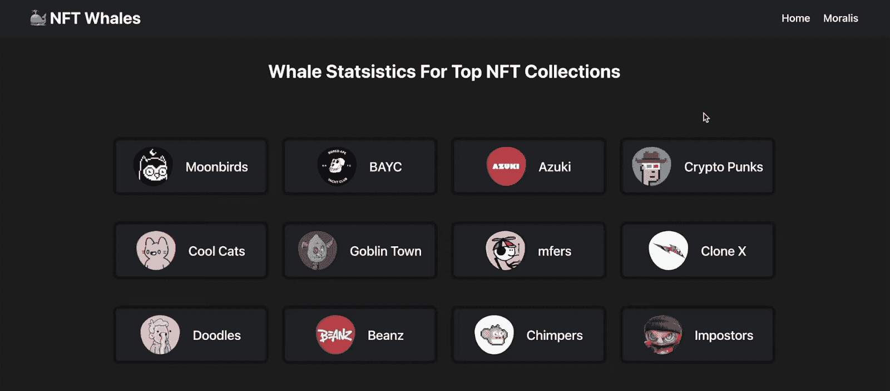

如果用户想探索上面列出的任何 NFT 收藏，他们需要点击它。

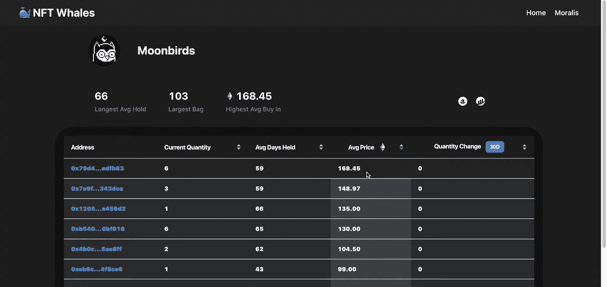

一旦进入 Moonbirds 页面，用户就可以探索后端执行的 NFT 链分析。正如你所看到的，我们设计了 dapp 在顶部显示一些有趣的数据。这些包括最长的平均持有时间、最大的袋子和最高的平均购买量。然后是包含所有细节的表格。在最左边，有所有拥有月鸟 NFT 的地址。接下来，我们的 dapp 包含“当前数量”列，它显示对应地址的当前月鸟 NFT 的数量。然后，我们有“平均持有天数”、“平均价格”和“数量变化”列。后者还为用户提供了选择他们感兴趣的时间段的方法。此外，每一列都有一个选项，可以根据该列的值以升序或降序排列表格。

此外，如蓝色所示，用户可以点击该地址查看特定地址的 NTF 链上分析:

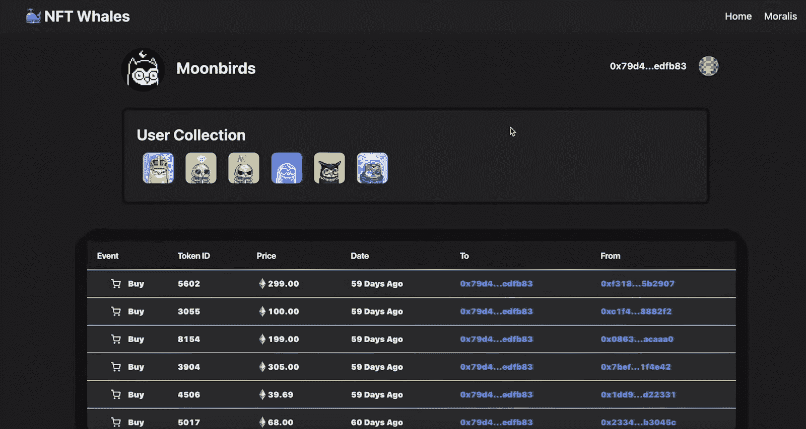

在特定的地址中，dapp 将该地址显示在与集合名称相同的行中，但在相反的一侧。接下来是“用户集合”部分，它显示给定地址的集合的所有 NFT 的缩略图。在底部，我们还有一个 NFT 链上分析表，包含该地址的活动。因此，它清楚地指示事件(购买或出售)、令牌 id、NFTs 的价格、日期以及交易中涉及的“到”和“从”地址。

# NFT 在链分析–示例项目

现在你知道了你将要建立一个多么令人惊奇的 dapp，你一定渴望卷起你的袖子。当然，我们想让事情尽可能简单，因此，你可以从 GitHub 克隆我们的[启动代码](https://github.com/IAmJaysWay/NFTWHALE-Starter)。

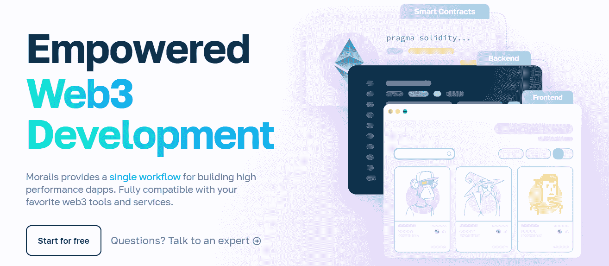

## 设置道德标准

以下是完成初始 Moralis 设置所需的步骤，这将使您能够使用 Moralis 的 SDK:

1.  首先，创建你的免费道德账户。进入 Moralis 的主页，点击“免费开始”按钮。但是，如果您已经有一个有效的帐户，只需登录到您的管理区:


2.  访问您的 Moralis 管理区后，您需要创建一个新的 Moralis dapp:


3.  然后，选择环境。对于大多数示例项目，您将使用 testnets 然而，今天我们对实时 NFT 项目感兴趣，所以请使用“Mainnet”:


4.  我们将关注以太坊主网。不过，由于 Moralis 的跨链互操作性，您可以选择多个链:


5.  对于地区，请选择离您最近的城市:


6.  最后，给你的 dapp 起个名字，点击“创建你的 Dapp”按钮:

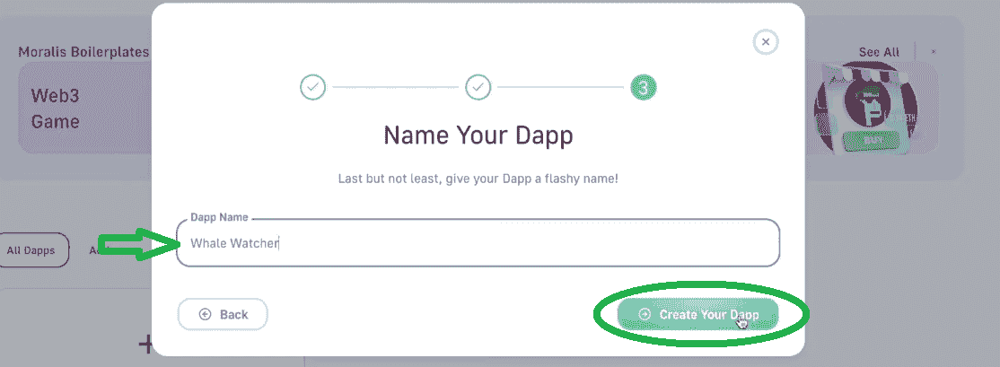

一旦您的 Moralis dapp 启动并运行，您可以通过“设置”按钮访问其详细信息和所有功能:


### Moralis 为 NFT 开发的 Web3 APIs。链式分析

在 dapp 的设置中，进入“Web3 APIs”选项卡。然后向下滚动到“令牌”部分。您会发现“/NFT/{ address }/transfers”API:

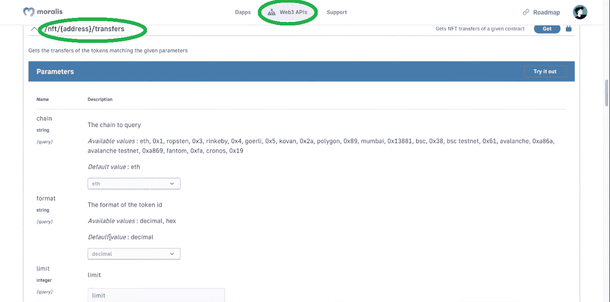

这个 API 获取给定合同的 NFT 转移。此外，这是我们今天的 NFT 外链分析主要关注的 API。由于这个 API 为我们提供了我们需要的所有数据，我们可以显著地限制我们需要进行的 API 调用的数量。

此外，查看上面的截图，我们可以看到“/NFT/{ address }/transfers”API 接受一些参数:

*   我们要查询的链(以太坊是默认选项)
*   我们感兴趣的智能合约的地址

然后，上面的 API 为我们提供了以下格式的结果:

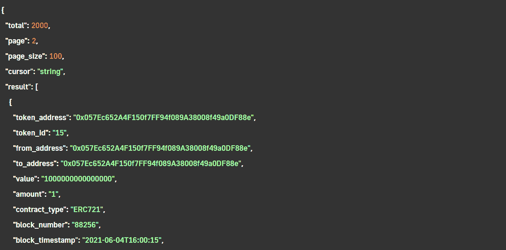

如您所见，它返回 2000 次传输，这是我们在前进过程中需要考虑的问题。此外，您可以看到它提供的关于该特定契约的令牌的所有细节。因此，我们可以执行 NFT 链上分析的基础上，所有这些数据与一些后端后处理。实际上，这个 API 为我们的示例 dapp(在上面的演示中展示)提供了我们需要的所有数据。

然而，由于以太坊上许多流行的 NFT 集合已经存在了很长时间，我们必须首先在我们的云函数中设置 API 速率限制。

### 设置 API 速率限制

*注* *:你可以在 Moralis 文档(Web3 API >速率限制)中了解更多关于速率限制的信息。*

这是我们将以下代码行复制到“cf”文件夹内的“cloud.js”文件中的位置(下面的视频，从 6:30 开始):

```
Moralis.settings.setAPIRateLimit({
  anonymous:10, authenticated:20, windowMs:60000
})
```

因此，为了避免限制，我们可以在“匿名”和“认证”值中添加两个零。接下来，我们需要通知我们的道德 dapp 我们正在使用这个云功能。因此，我们需要返回到 Moralis 管理区，点击“鲸鱼观察者”dapp 的“设置”按钮。然后，我们转到“云功能”部分:

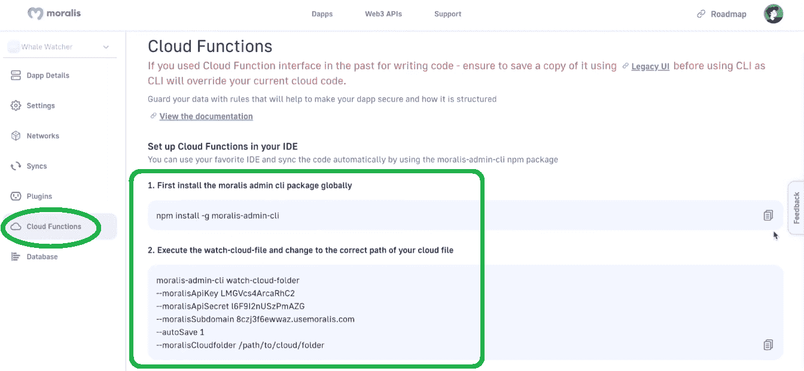

接下来，我们需要按照页面上的说明完成两个步骤。因此，我们使用终端窗口来安装 Moralis admin CLI 软件包:


然后，我们需要执行 watch-cloud-file，并将云文件夹更改为云文件的正确路径:


最后，终端会要求您选择保存云功能的模式和服务器:


如果您遵循了上述步骤，您就成功地更改了 API 比率限值。

## 实施 NFT 链上分析

正确设置 API 速率限制后，我们使用代码编辑器“cd”到“stats”文件夹:

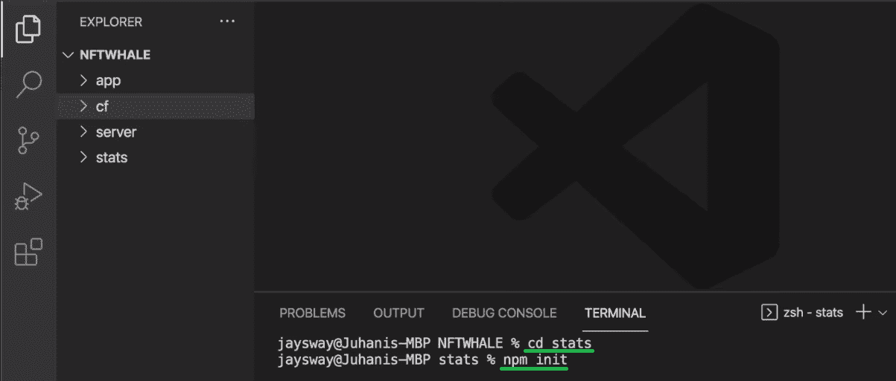

接下来，我们使用“npm init”命令并按几次“enter ”,这将在“stats”文件夹中生成一个新的“package.json”文件。然后，我们在同一个文件夹中创建“stats.js”文件:


这是我们将实现关于 NFT 链上分析的所有后端功能。但我们必须先安装一些包(“npm i moralis”和“NPM I fs”)(10:05)。安装好包后，我们已经准备好开始编写脚本了。*详细的编码教程，用下面的视频，10:30 开始。*

我们将首先和上面安装的软件包:

```
const Moralis = require("moralis/node");
const fs = require("fs");
```

然后，我们还需要添加我们的道德 dapps 的凭据:

```
const serverUrl ="xxx";
const appId="xxx";
```

要获得这些详细信息(替换“xxx”)，我们使用 dapp 的“设置”按钮，然后从“dapp 详细信息”选项卡中复制 dapp URL 和 dapp ID:

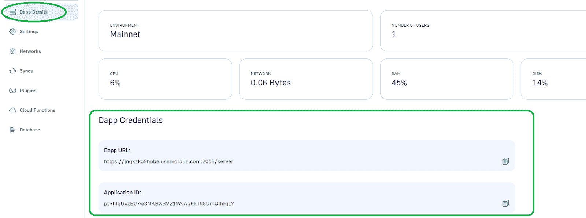

此外，我们还需要定义一个契约，我们希望将我们的 NFT 链分析集中在这个契约上。如前所述，我们将在此重点介绍月鸟系列:

```
const contractAddress = "0x23581767a106ae21c074b2276D25e5C3e136a68b"; //Moonbirds
```

当然，我们可以随时更改地址，专注于任何其他 NFT 收藏。

### 道德的力量——使用“getContractNFTTransfers”API

有了上面几行代码，我们也为使用“getAllOwners()”函数(11:39)做好了一切准备。这是我们初始化 Moralis ("Moralis.start ")和光标的地方。然后，我们将创建“owners”对象、response(“RES”)变量和“accountedTokens”数组。此外，我们将使用一个“do-while”循环来完成所有的传输。在这个循环中，我们将使用上面介绍的“getContractNFTTransfers”API。

此外，为了遍历 API 结果数组，我们将在“do-while”循环中创建一个“for”循环。这样，我们将遍历结果数组中的所有对象，并检查特定的令牌 ID 是否已经出现。接下来，从 17:21 开始，您将学习如何对“owners”对象进行字符串化，并使用“fs”包编写包含这些字符串的文件。

现在，我们已经在“stats.js”文件中设置了基本代码，我们可以运行“getAllOwners()”函数:


如你所见，我们的代码将遍历所有 312 页，并为我们保存所有与月鸟 NFT 系列相关的数据。结果，我们得到了“stats”文件夹中的“moonbirdsOwners.json”文件，该文件包含关于这些 NFT 所有者的所有详细信息:

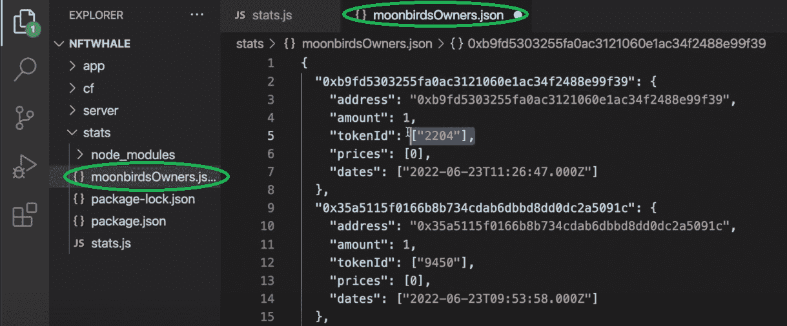

这就是 NFT 连锁分析的精髓。然而，在 20:00，你将学习如何添加有关 NFT 系列的其他细节。此外，您还将学习如何收集相关地址的所有历史数据。在这里您可以找到关于“dateToBlock”API 的信息。总而言之，您最终将得到“moonBirdsOwners.json”和“moonbirdsHistory.json”文件，其中包含了围绕它构建一个整洁的前端所需的所有数据。

### 节点 JS 服务器设置

从 34:42 开始，您将学习如何设置 Node JS 服务器。本质上，您将创建您的“index.js”文件，它将作为您的后端服务器。这将是本示例 dapp 前端部分的开始:


此外，为了显示之前创建的 JSON 文件，您将创建相应的 JS 文件。因此，您将把“moonbirdsOwners.js”和“moonbirdsHistory.js”文件添加到“服务器”文件夹中。

## Web3 UI:初始化 React 应用程序，并将 NFT 数据填充到 React 应用程序中

从 40:25 开始，您将获得一个关于演示中呈现的 UI 的快速代码演练。此外，如果您克隆了我们的代码，那么您已经在“app”文件夹中设置好了基础。接下来，您需要安装所有的依赖项并运行应用程序。因此，由于我们的样板，你已经有了一个很酷的界面。但是，收藏页面仍然是空的:

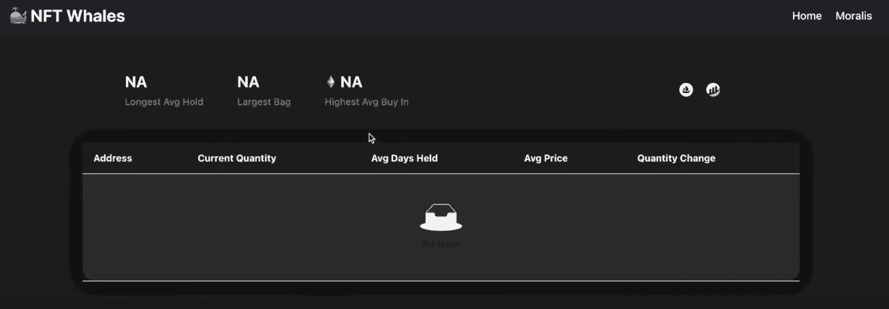

因此，您的最终任务是使用下面的视频教程(44:02)来填充 Moonbirds 集合:

https://www.youtube.com/watch?v=gATX0yYMFYA&t=184s

## NFT 连锁分析——如何探索 NFT 钱包——总结

利用今天的文章，你有机会创建自己的 NFT 鲸鱼观察者 dapp。因此，你学会了如何毫不费力地做 NFT 链分析。此外，由于这一壮举的核心需要后端编程，我们主要集中在这方面。然而，多亏了 Moralis，您能够用一个 API 获得所有的链上 NFT 数据。除了完成初始的 Moralis 设置之外，你还必须设置 API 速率限制。然后你实现了 NFT 数据处理。结果，所有的链上数据都整齐地排列在两个 JSON 文件中。最后，您有机会使用我们的样板文件并创建一个整洁的 Web3 UI，以用户友好的方式显示数据。

如果你喜欢这个示例项目，我们建议你访问[道德家的博客](https://moralis.io/blog/)和[道德家的 YouTube 频道](https://www.youtube.com/c/MoralisWeb3)。这两个渠道都提供了大量有价值的内容。从现场讲解到详细的区块链开发教程。因此，在这里你可以了解更多关于 dapp 开发、 [Web3 认证](https://moralis.io/authentication/)，以及如何成为一名区块链开发者。关于 Moralis 最伟大的事情是，它使你能够使用你的前端技能成为一名 Web3 开发者。因此，你可以利用你的 JavaScript 熟练程度开发杀手级应用程序，或者用 Unity 开发 Web3 游戏。

然而，如果你正在寻找一条通往全职加密的道路， [Moralis Academy](https://academy.moralis.io/) 可能是适合你的地方。这个在线教育平台提供大量专业的区块链发展课程。此外，它为您提供了个性化的学习路径、专家指导和最先进的社区之一。因此，它提供了一个神奇的酱弹射你在这个破坏性行业的职业生涯！