# Web3 博客 Dapp 创建指南

> 原文：<https://moralis.io/guide-to-creating-a-web3-blog-dapp/>

在这篇创建 Web3 博客 dapp(分散式应用程序)的指南中，我们将向你展示如何在创纪录的时间内创建并运行你自己的 Web3 博客 dapp。事实上，按照我们的说明和本指南末尾的视频教程，你可以在不到 70 分钟的时间里为 Web3 建立并运行一个博客 dapp。所以，如果这听起来很有趣，这些是你将要学习的步骤:

*   安装安全帽
*   创建、编译和部署 ERC-721 智能合同(Web3 合同)
*   在 React 中初始化一个项目并连接到 Moralis 的 SDK
*   利用 web3uikit 并启用 Web3 身份验证
*   使用 React 创建你的 Web3 博客 dapp 的前端:
    *   边栏
    *   博客列表(您的主页)
    *   博客页面
    *   发布页面
*   使用 IPFS 以分散的方式存储 NFT 的元数据
*   为 NFTs 启用铸造功能
*   掌握查询 NFTs 的终极 Web3 API

Medium 是最受欢迎的博客平台之一。因此，这个创建 Web3 博客 dapp 的指南将有效地指导你创建一个 [Web3 媒体](https://moralis.io/how-to-build-a-web3-medium-clone/)克隆的过程。在这个过程中，你将学会使用一些优秀的工具来帮助你[成为一名区块链开发者](https://moralis.io/how-to-become-a-blockchain-developer/)。既然我们决定以[不可替代代币](https://moralis.io/non-fungible-tokens-explained-what-are-nfts/) (NFTs)的形式发布我们的博文，我们也将涵盖[铸币](https://moralis.io/how-to-mint-nfts-full-tutorial-to-minting-an-nft/)。因此，我们将向您展示如何使用 ERC-721 合同。因此，你将学习[坚固性](https://moralis.io/solidity-explained-what-is-solidity/)的基础知识以及如何利用[安全帽](https://moralis.io/hardhat-explained-what-is-hardhat/)。就 [Web3 前端](https://moralis.io/web3-frontend-everything-you-need-to-learn-about-building-dapp-frontends/)而言，我们将向您展示您的 [JavaScript](https://moralis.io/javascript-explained-what-is-javascript/) 技能与 [React](https://moralis.io/react-explained-what-is-react/) 相结合是如何做到这一点的。

然而，最终的 Web3 开发平台将使我们能够把它们联系在一起。因此，我们将向你展示如何使用[道德规范](https://moralis.io/)。此外，您将看到 [Moralis 的 SDK](https://moralis.io/exploring-moralis-sdk-the-ultimate-web3-sdk/) 如何简化所有与区块链相关的后端需求。此外，使用 Moralis，您可以用简短的代码片段替换多行代码。而且，Moralis 不仅仅是最好的 [Web3 后端平台](https://moralis.io/exploring-the-best-web3-backend-platform/)；它还能帮助你创建一个伟大的 Web3 UI。

## 我们的 Web3 博客 Dapp 的演示

像大多数[去中心化应用](https://moralis.io/decentralized-applications-explained-what-are-dapps/)一样，我们的 Web3 博客 dapp 从 [Web3 认证](https://moralis.io/web3-authentication-the-full-guide/)开始:

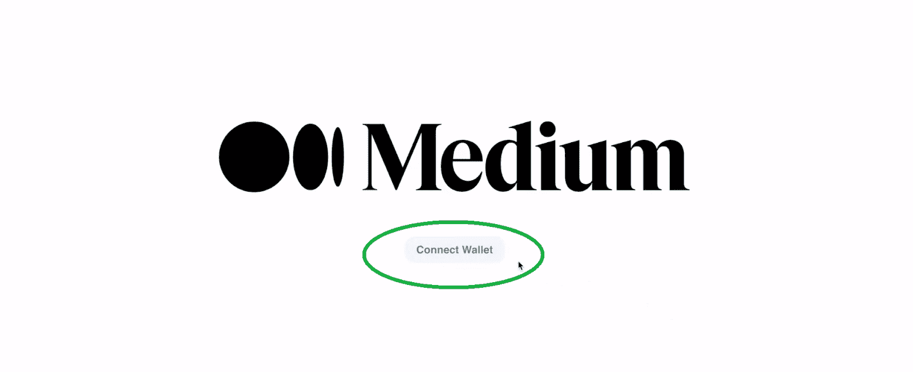

用户必须点击“连接钱包”按钮来选择他们喜欢的 [Web3 钱包](https://moralis.io/what-is-a-web3-wallet-web3-wallets-explained/)。然后，他们使用后者来执行 [Web3 登录](https://moralis.io/how-to-build-a-web3-login-in-5-steps/)。尽管有很多选择，[元掩码](https://moralis.io/metamask-explained-what-is-metamask/)仍然是大多数网络用户的首选。因此，为了这个演示，我们把重点放在用元掩码进行认证的[:](https://moralis.io/how-to-authenticate-with-metamask/)

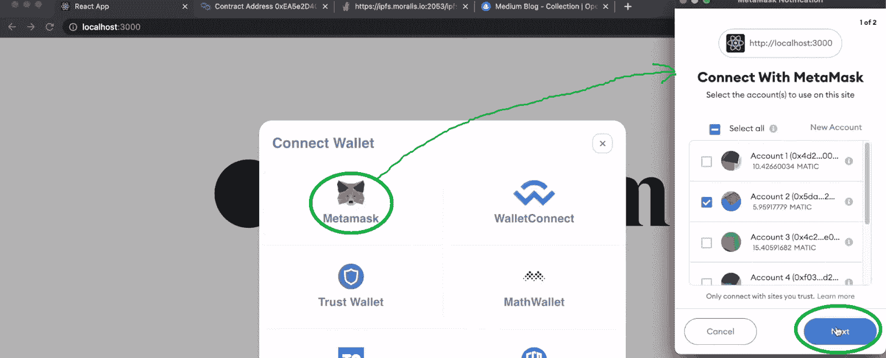

首先，用户需要选择一个他们希望使用的帐户。在他们点击“下一步”之后，他们终于可以完成身份验证:

点击元掩码扩展中的“连接”按钮后，用户将进入我们的 Web3 博客 dapp。更具体地说，它们出现在主页上:

上面的截图清楚地指出了三个部分:左侧栏、中间部分和右侧栏。左边栏是导航面板，按钮链接到我们的 Web3 博客 dapp 的不同页面。中间部分是显示当前页面的地方。在主页的情况下，您可以看到“推荐的博客”，其中列出了所有的博客帖子。最后但同样重要的是，右边栏提供了搜索栏和最新新闻。

此外，我们的 Web3 博客 dapp 中的博文是存储在 Polygon testnet (Mumbai)上的 NFT。此外，当用户想要阅读列出的博客时，他们需要点击它们。这将在中间部分打开选定的博客:

我们保持简单；每篇博文都包含一个标题和内容。当用户想要访问包含所有博客文章的页面时，他们需要点击“主页”图标。此外，我们的 Web3 博客还附带了一个页面，显示他们的博客文章:

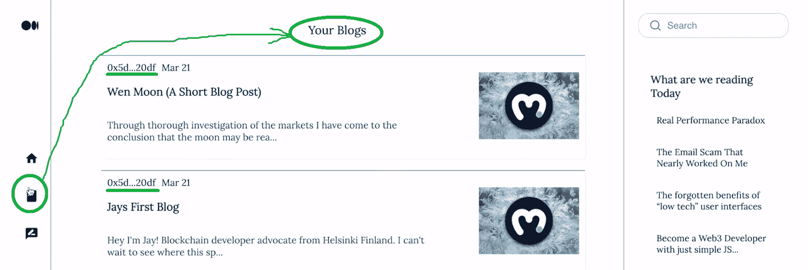

尽管如此，当用户想要创建新的博客文章时，他们需要点击“写”图标:

### 使用我们的 Web3 博客 Dapp 发布帖子

使用我们的 dapp 发布帖子很容易。首先，用户需要访问“写文章”页面。在这个页面上，他们需要输入文章的标题和内容。完成后，他们需要点击“发布”按钮:

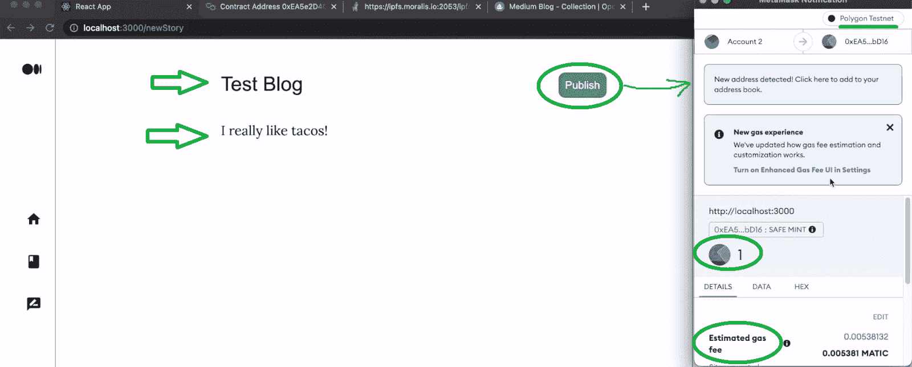

这就是 Web3 奇迹发生的地方。你可能记得我们的 dapp 需要将帖子转换成一个 [ERC-721 令牌](https://moralis.io/erc-721-token-standard-how-to-transfer-erc721-tokens/)。因此，用户需要确认铸币交易，这将花费他们 MATIC 加上汽油费:

我们的 Web3 博客 dapp 也让用户知道他们的交易成功了:

得益于区块链的透明性，用户可以进一步确认他们的博客帖子是否通过。例如，元掩码显示最新的事务:

此外，他们的帖子也应该列在“推荐博客”部分:

此外，用户还可以使用区块链扫描仪来确认网上交易的细节。由于我们的 dapp 在孟买测试网上，他们需要使用 PolygonScan(孟买):

尽管如此，用户也可以在 [NFT 市场](https://moralis.io/how-to-create-an-nft-marketplace/)上查看他们的帖子，比如 OpenSea:

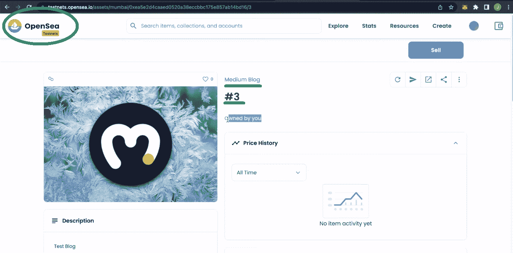

## 在不到 70 分钟的时间内创建一个 Web3 博客 Dapp

在看到我们创建了一个多么整洁的博客 dapp 之后，你一定渴望参与这个示例项目。幸运的是，你可以在不到 70 分钟的时间里建立并运行你自己的 Web3 博客 dapp。感谢我们的说明、截图和详细的视频教程，没有任何猜测。因此，你将毫不费力地完成以下几个阶段:

*   设置安全帽
*   创建、编译和部署 ERC-721 合同
*   初始化 React 项目并连接到 Moralis SDK
*   利用 [web3uikit](https://moralis.io/web3ui-kit-the-ultimate-web3-user-interface-kit/) 将 Web3 认证设置到位
*   使用 React 构建你的 Web3 博客 dapp 的前端:
    *   边栏
    *   博客列表(你的主页)
    *   博客页面
    *   博客发布页面
*   以分散的方式存储 NFT 的元数据(使用 [IPFS](https://moralis.io/what-is-ipfs-interplanetary-file-system/)
*   将铸造功能设置到位
*   利用最终的 [Web3 API](https://docs.moralis.io/moralis-dapp/web3-api) 来查询 NFTs

上面的列表可能看起来相当广泛；然而，记住大多数步骤可以在几分钟内完成。还有，你不会从零开始。我们的“[开始](https://github.com/IAmJaysWay/Medium-Start)和“[结束](https://github.com/IAmJaysWay/Medium-Final)代码可在 GitHub 上获得，以简化过程。

*注意:* *我们假设您将从“starter”代码开始。因此，这是我们参考的以下说明和视频教程所采用的路径。尽管如此，这也是你应该从本指南中获得最大收益的途径。*

### 安全帽入门

使用 Hardhat 只是编译、部署和验证智能合约的选项之一。例如， [Remix](https://moralis.io/remix-explained-what-is-remix/) 是另一个很好的工具。

首先，在您最喜欢的代码编辑器中打开一个新文件夹。正如你在下面的截图中看到的，我们使用 Visual Studio 代码(VSC)。接下来，通过在 VSC 的终端中键入“npm i -D hardhat”来安装 Hardhat:

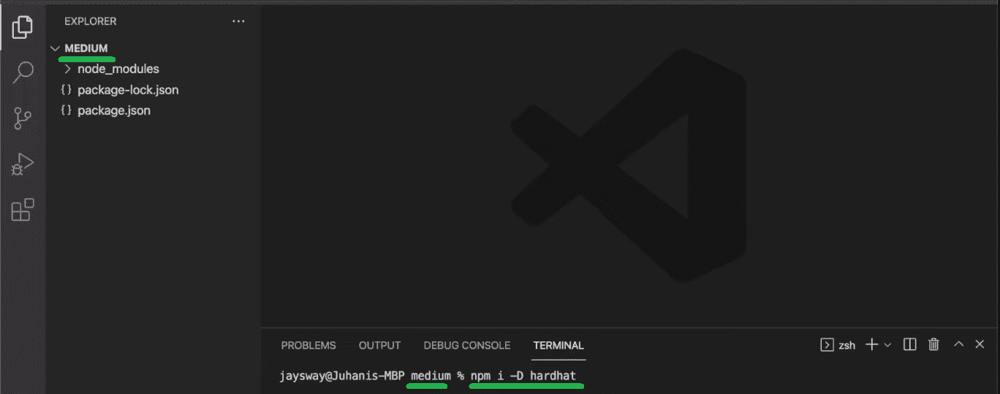

然后，您想要创建一个新的 Hardhat 项目。因此，输入" **npx hardhat** "命令。输入这个命令后，你需要点击“回车”四次。最后，您还需要安装适当的依赖项。以下命令将有助于您做到这一点:

*   从[open zeppelin](https://moralis.io/what-is-openzeppelin-the-ultimate-guide/):**NPM I @ open zeppelin/contracts**访问已验证的 [Web3 合同](https://moralis.io/what-are-web3-contracts-exploring-smart-contracts/)
*   上面会让你用的”。env" file: " **npm i -D dotenv** "
*   验证您的智能合同:"**NPM I-D @ nomic labs/hard hat-ethers can**"

## Web3 博客 Dapp 背后的智能合约

有了安全帽，你就可以创建你的 Web3 博客的智能合同。如需详细指导，请使用下面的视频，从 4:17 开始。从“Greeter.sol”开始，您将在这里学习如何使用 Hardhat 模板文件:

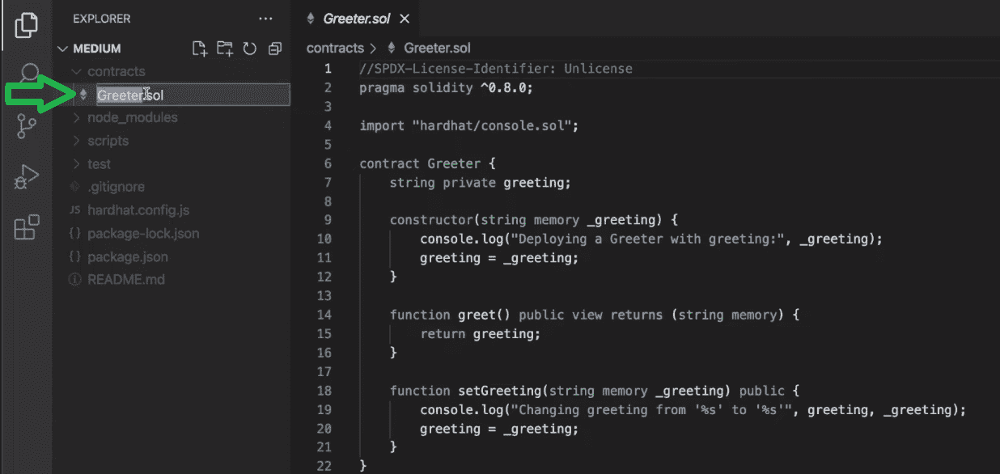

如果你愿意，你可以跟着视频手动写代码。不过也可以从 GitHub (" [Medium.sol](https://github.com/IAmJaysWay/Medium-Final/blob/main/smartcontract/Medium.sol) ")复制代码。

### 编译、部署和验证您的 Web3 合同

有了智能契约代码，就可以使用 Hardhat 来编译、部署和验证它。这个过程的细节在下面的视频里等着你，从 11:04 开始。您将继续使用 Hardhat 模板文件，尽可能轻松地完成工作:

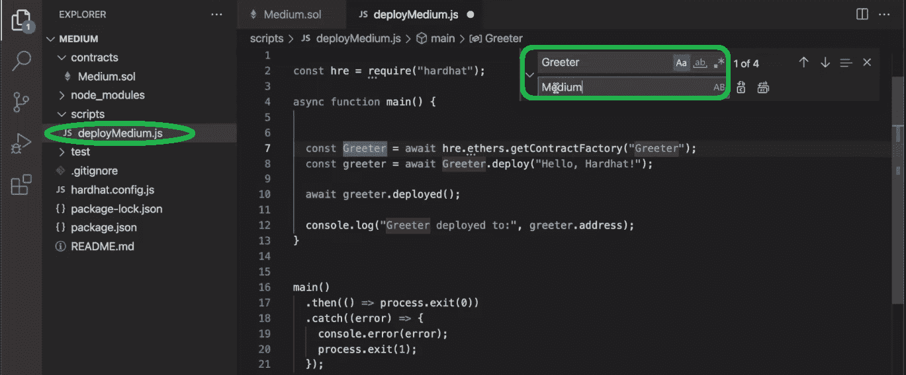

首先将“sample-script.js”文件重命名为“deployMedium.js”。然后，你将“迎宾员”和“迎宾员”替换为“中等”和“中等”。此外，您需要在“Medium.deploy”中添加一些参数:

接下来，从 12:31 开始，您将开始调整“hardhat.config.js”文件。后者将编译并验证您的智能合约。这也是您使用“的地方。env "参数:

要让上述市场变量发挥作用，你需要将它们储存在你的“中”。env "文件:

幸运的是，获取这些变量的值相对容易。但是，有适当的指导很有帮助(跳到 14:48)。关于“Polygon_Mumbai ”,我们推荐使用下面的“使用 Moralis 的新管理用户界面”部分。一旦设置好这些值，就可以编译、部署和验证您的 ERC-721 合同了。详情请见下方视频 16:40。

## 我们的 Web3 博客 Dapp 的前端

作为 Web3 开发人员，您希望确保前端是直观的。因此，它应该遵循 Web2 应用程序的例子。因此，我们可以利用 React。从下面视频教程的 22:04 开始，你将学习如何初始化一个 React 项目。这也是您需要用您的道德 dapp 的详细信息填充“index.js”文件的地方。同样，使用下面的“使用 Moralis 的新管理用户界面”部分获得更多指导。接下来，您将准备好输入“yarn start”命令并查看空的应用程序。然而，如果你正确地遵循了我们的指南，我们的 Web3 博客 dapp 的结构应该已经在那里了:

接下来，您将实现 Web3 身份验证(23:39)。这就是 Moralis 的 web3uikit 将事情变得极其简单的地方。因此，设置“连接钱包”按钮只需不到两分钟的时间。接下来，您将完成在演示中看到的所有页面:

*   25:24–边栏
*   29:36–博客列表(主页)
*   38:41–博客页面
*   44:53–发布博客页面

## 我们的 Web3 博客 Dapp 的后端

此时，您已经启动并运行了智能合约。后者是你的 Web3 博客 dapp 后端的重要组成部分。尽管如此，您仍然需要编写适当的代码，这将使用户能够与您的智能合约进行交互。此外，您需要在您的 ERC-721 合同和您的 React 应用程序之间建立一个链接。除此之外，您还需要一种以分散方式存储 NFTs(博客文章)元数据的方法。

因此，从 48:05 开始，我们的内部专家将向您展示如何自动将[上传到 IPFS](https://moralis.io/full-guide-how-to-upload-to-ipfs/) 。为此，您将创建“ [NewStory.js](https://github.com/IAmJaysWay/Medium-Final/blob/main/src/pages/NewStory.js) ”文件。此外，由于 Moralis 的 SDK 集成了 IPFS,“save file”代码片段将完成大部分工作。此外，从 53:35 开始，您将看到如何使用“NewStory.js”来创建“博客帖子”NFTs。要实现此功能，您需要获得您的合同的详细信息:

最后但同样重要的是，从 58:57 开始，您将利用 Moralis 的 Web3 API 来查询 NFT。因此，你可以填充你的 Web3 博客 dapp 的主页和“你的博客”页面。您将使用“ [homeAuth.js](https://github.com/IAmJaysWay/Medium-Final/blob/main/src/pages/HomeAuth.js) ”和“ [MyBlogs.js](https://github.com/IAmJaysWay/Medium-Final/blob/main/src/pages/MyBlogs.js) ”文件来涵盖 NFT 查询。在这两个文件中，您将创建“fetchAllNfts”函数。后者将使用“token.getNFTOwners”和“account.getNFTsForContract”挂钩。因此，您将毫不费力地获得所有的链上数据。

### 使用 Moralis 的新管理用户界面

道德最近切换到一个新的管理用户界面。因此，如果您愿意，您仍然可以切换到传统用户界面:

然而，我们鼓励你习惯新的用户界面。下面的说明将帮助你:

1.  [*创建您的免费道德家账户*](https://admin.moralis.io/register) *或* [*登录*](https://admin.moralis.io/login) *到您现有的账户，进入您的道德家管理区。*

2.  *创建新的 dapp:*

3.  *选择“测试网”:*

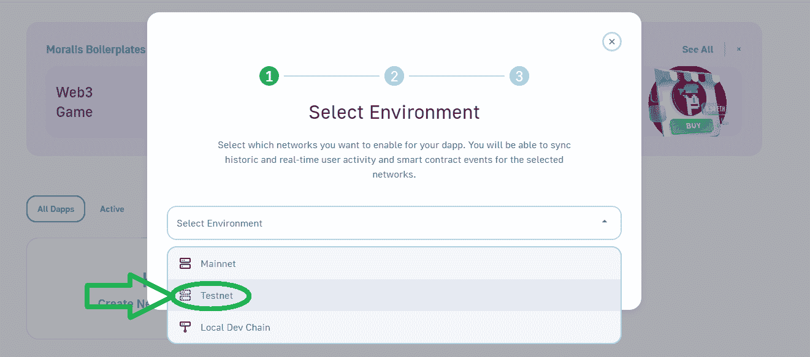

4.  *选择“多边形孟买”并点击“继续”按钮:*

5.  *选择离你最近的城市:*

6.  *为您的 dapp 命名，然后点击“创建您的 Dapp”:*

现在你的 dapp 已经启动并运行了，你可以获得孟买测试网的端点 *("Polygon_Mumbai" from "。env")* *和你的 dapp 的详细信息* *(你需要粘贴到“index.js”中的 URL 和 ID)**:*

*   ***如何获取端点*** *:*

1.  *点击新创建的 dapp 下的“设置”按钮:*

2.  *导航到右边栏的“链”标签，点击“多边形孟买”旁边的“设置”:*

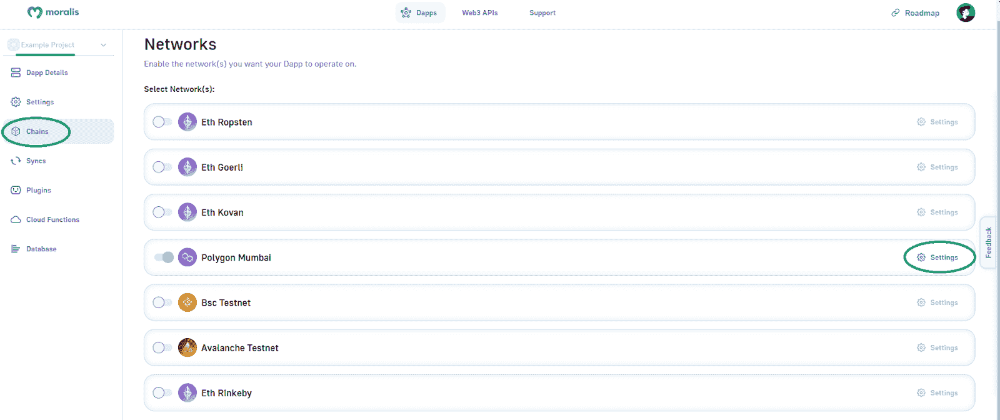

3.  *复制“孟买”下的网址:*

*   ***如何获取 Dapp ID 和网址*** *:*

1.  *点击新创建的 dapp 下的“设置”按钮:*

2.  *复制您的 dapp 的 URL 和应用程序 ID:*

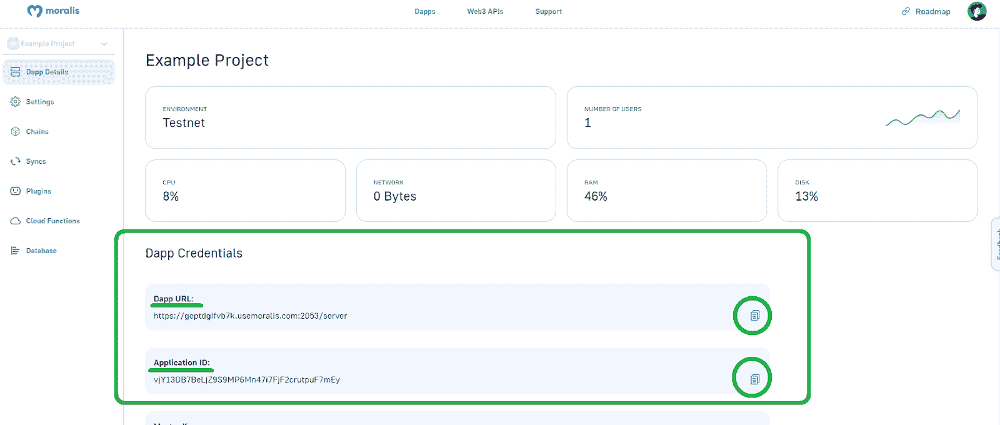

最后，这是视频教程，包含了创建你的 Web3 博客 dapp 所需的所有细节:

https://www.youtube.com/watch?v=8S8unFCq0fM

## 创建 Web3 博客 Dapp 指南-摘要

在这篇创建 Web3 博客 dapp 的指南中，你首先学习了如何创建 ERC-721 智能合同。接下来，您学习了如何使用 Hardhat 来编译、部署和验证智能契约。此外，您有机会看到 React 如何使您能够利用您的 JavaScript 熟练程度满足所有 Web3 前端需求。当然，Moralis 的 web3uikit 提供了几个额外的快捷方式，您也亲身体验过。最后，我们使用 Moralis 将它们联系在一起，这使您能够轻松地用简短的代码片段查询 NFT。

有了所有这些新技能，您就可以着手处理其他示例项目，从而获得额外的编程信心。因此，访问[道德博客](https://moralis.io/blog/)和[道德 YouTube 频道](https://www.youtube.com/c/MoralisWeb3)。那里的一些最新主题包括[多边形 dapp API](https://moralis.io/polygon-dapp-api-how-to-efficiently-create-polygon-dapps/) ，如何构建 [Web3 角色扮演游戏](https://moralis.io/how-to-build-a-web3-action-role-playing-game/)，如何创建[社交媒体 dapp](https://moralis.io/how-to-create-a-social-media-dapp/) ，探索最佳[币安 dapp API](https://moralis.io/binance-dapp-api-how-to-easily-build-projects-on-binance/) ，[以太坊 NFT API](https://moralis.io/what-is-an-ethereum-nft-api-ethereum-nft-apis-explained/) ，以及[多边形 NFT API](https://moralis.io/what-is-a-polygon-nft-api-polygon-nft-apis-explained/) 。此外，你可以深入研究[以太坊合并](https://moralis.io/ethereum-merge-what-is-ethereum-2-0-and-the-merge/)，如何[获得索拉纳 NFT 元数据](https://moralis.io/how-to-get-solana-nft-metadata/)，以及更多。因此，你可以通过这两个途径免费接受区块链教育。

然而，如果你想快速自信地成为 Web3 开发者，你应该考虑采取更专业的方法。因此，你可能想报名参加[道德学院](https://academy.moralis.io/)。除了顶尖的[区块链发展课程](https://academy.moralis.io/all-courses/)，这里也是你获得个性化学习路径、专家指导，并成为加密领域最先进社区之一的成员的地方。

