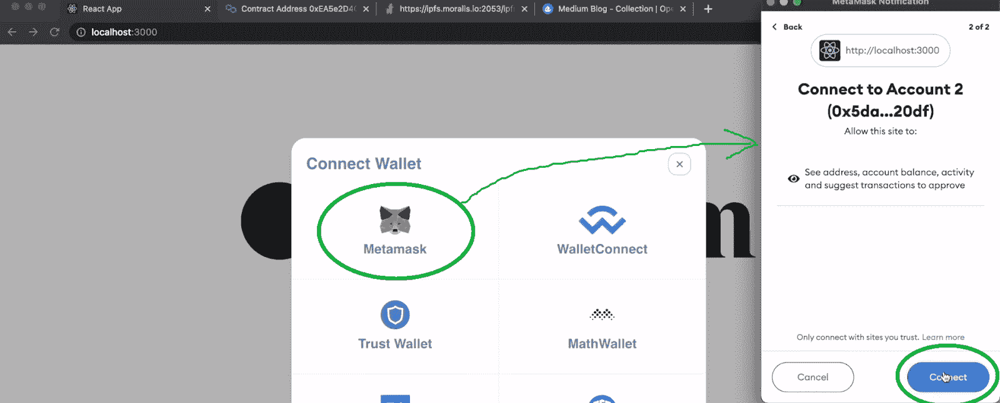
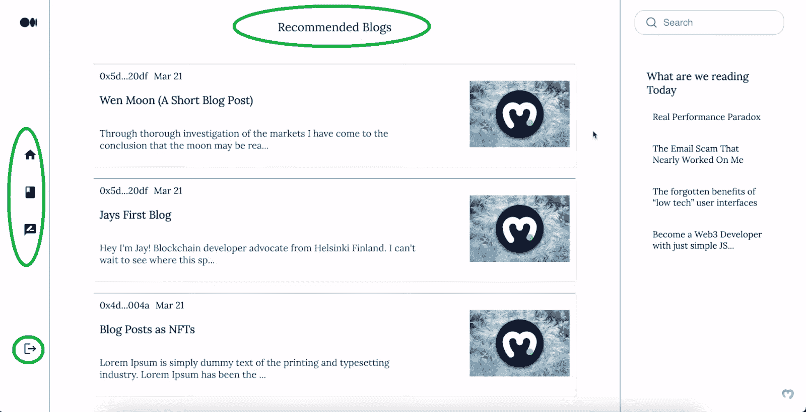
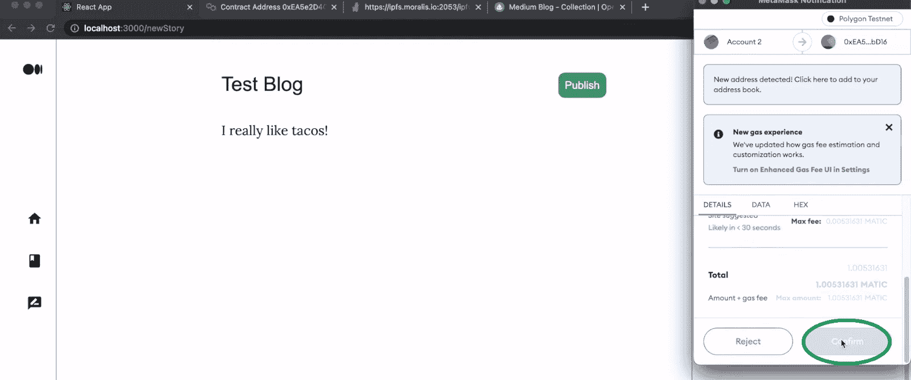
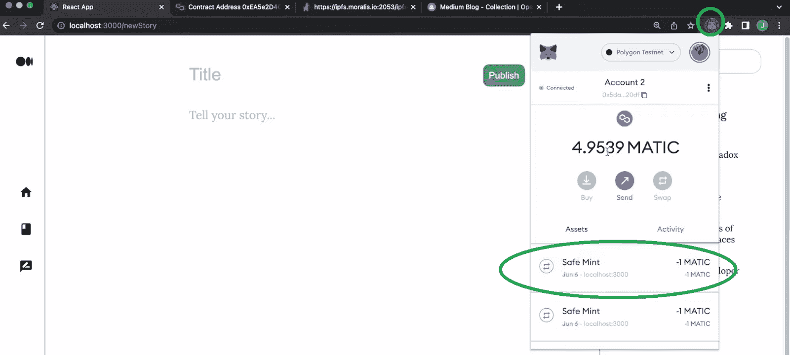
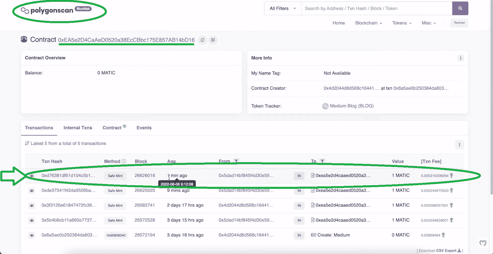
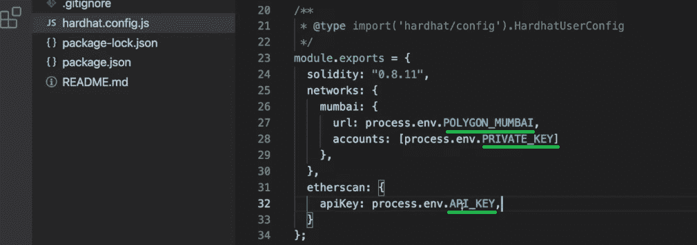
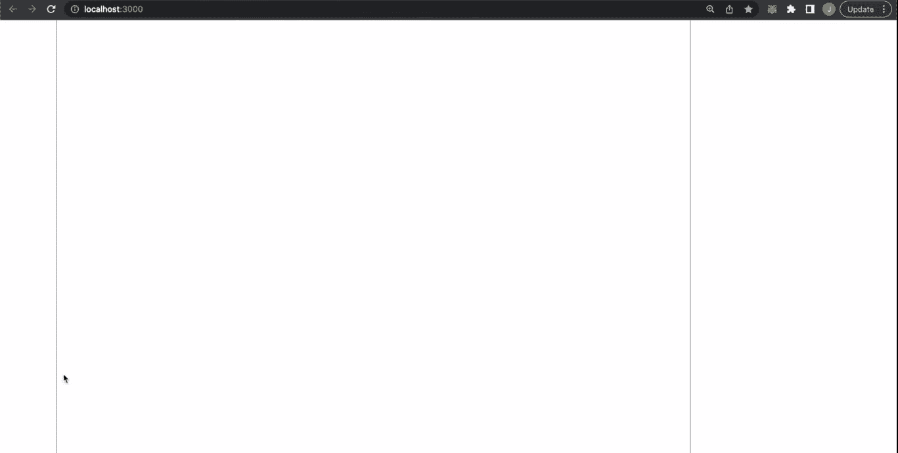
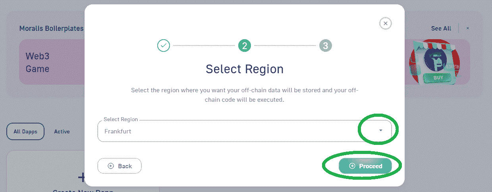
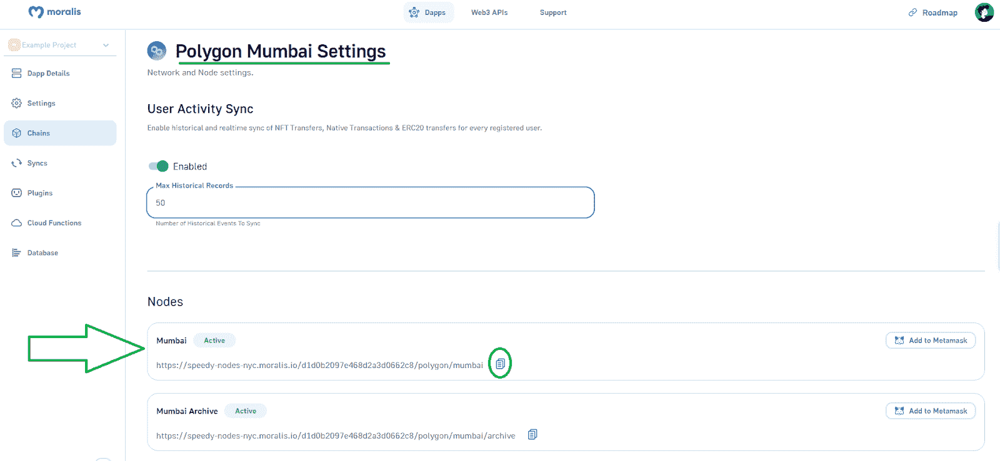

# 如何构建 Web3 中型克隆

> 原文：<https://moralis.io/how-to-build-a-web3-medium-clone/>

**Medium 是一个平台，读者可以在这里读到充满激情的内容创作者的励志思想和前瞻性想法。你很有可能在这个流行的平台上读过文章，也在那里发表过文章。然而，虽然媒体有其优点，但缺点之一是它的集中性。这不仅是 Medium 的情况，也是许多其他流行平台的情况。于是，程序员们开始创造去中心化的选项，比如一个 Web3 替代 Medium，一个** [**Web3 Twitter 克隆**](https://moralis.io/how-to-build-a-web3-twitter-clone/) **等等。如果你想探索如何构建一个 Web3 中型克隆，你会发现这个指南非常有益！**

这篇关于创建 Web3 中型克隆的教程将有利于那些决定通过采取可行的步骤来弄脏自己的手的人。如果您最终构建了一个 Web3 中型克隆，您将学习如何向区块链发布博客文章。发布的文章将采用 NFTs ( [不可替换令牌](https://moralis.io/non-fungible-tokens-explained-what-are-nfts/))的形式，这将使用智能合同来生成。因此，你将学习坚实的基础。此外，我们将向您展示如何使用 [Hardhat](https://moralis.io/hardhat-explained-what-is-hardhat/) 来轻松编译、部署和验证智能合约。您还将学习如何将 NFT 元数据上传到 [IPFS](https://moralis.io/what-is-ipfs-interplanetary-file-system/) 。另外，您将看到如何充分利用您的 [JavaScript](https://moralis.io/javascript-explained-what-is-javascript/) 技能，并使用 [React](https://moralis.io/react-explained-what-is-react/) 创建一个整洁的 [Web3 UI](https://moralis.io/web3-ui-how-to-create-a-great-dapp-ui/) 。最后，您将学习如何利用[Moralis](https://moralis.io/)——终极 [Web3](https://moralis.io/the-ultimate-guide-to-web3-what-is-web3/) 开发平台。因此，[在继续之前，创建你的免费道德账户](https://admin.moralis.io/register)。


## Web3 媒体演示

像大多数 Web3 应用程序一样，我们的 Web3 中型克隆也从 [Web3 认证](https://moralis.io/web3-authentication-the-full-guide/)开始:


通过点击“连接钱包”按钮，用户可以选择他们最喜欢的 [Web3 钱包](https://moralis.io/what-is-a-web3-wallet-web3-wallets-explained/)来完成他们的 [Web3 登录](https://moralis.io/how-to-build-a-web3-login-in-5-steps/)。由于[元掩码](https://moralis.io/metamask-explained-what-is-metamask/)仍然是最流行的加密钱包，我们的示例用户决定用元掩码进行[认证。因此，点击“元掩码”后，这个钱包的浏览器扩展会弹出来要求选择一个帐户:](https://moralis.io/how-to-authenticate-with-metamask/)


一旦用户选择一个帐户并单击“下一步”，他们需要通过单击“连接”按钮来完成身份验证:



然后，用户登陆我们的 Web3 介质克隆的主页:



看上面的截图，你可以看到我们的 Web3 的中型克隆有三个部分。边上有边栏，中间是“推荐博客”板块(主页)。这是展示最新博客的地方。这些博客是存储在 Polygon testnet(孟买)上的 NFT。因此，如果用户决定阅读其中一个博客，他们需要点击它。通过这样做，Web3 中型克隆在中央部分显示所选的帖子:


如上图所示，每篇博文都包含标题和内容。要返回主页(这里列出了所有博客文章)，用户需要点击左侧边栏中的“主页”图标。“主页”下方的图标将用户带到显示其博客文章的页面:


要创建新的博客文章，用户需要点击“写”图标:


现在，让我们看看使用我们的 Web3 Medium 克隆发布一篇博客文章是什么样子的。

### 使用 Web3 媒体发布帖子–演示延续

一旦用户进入“写文章”页面，他们就可以输入文章的标题和内容。然后，他们可以通过点击“发布”按钮来发布它:


然而，由于我们的 Web3 Medium 以 NFTs 的形式发布博客，用户还需要确认相关的链上交易。因此，MetaMask 提示符将显示详细信息(参见上面的截图)。因此，用户可以看到，他们需要支付一个 MATIC 加天然气费来发布他们的帖子。此外，如果他们同意所需的详细信息，他们需要向下滚动元掩码扩展并单击“确认”:



交易完成后，我们的中型克隆将返回以下消息:


我们还可以从几个方面确认上述交易是正确执行的。例如，用户可以利用他们的元掩码来查看他们的最新事务:



当然，他们也可以在主页上看到自己的最新帖子:


此外，对于那些想要额外确认的人，你也可以使用区块链扫描仪(在我们的例子中是多边形扫描仪):



尽管如此，由于我们的 Web3 Medium 的博客帖子是以 NFT 的形式出现的，所以您也可以在 OpenSea 上查看它们:


## 使用 Hardhat、React 和 Moralis 构建一个 Web3 中型克隆

在看到我们构建了一个多么优秀的 dapp 之后，您可能迫不及待地想要创建自己的 Web3 中型克隆实例。如果是这样，你应该留出大约 70 分钟。此外，除了我们的说明和截图，利用本文底部的视频。这也是本文中我们的时间戳指向的地方。尽管如此，如果您想快速轻松地构建一个 Web3 中型克隆，您需要完成以下步骤:

*   安装安全帽
*   创建、编译和部署您的 NFT 铸造智能合同
*   初始化一个 React 项目并连接到 [Moralis 的 SDK](https://moralis.io/exploring-moralis-sdk-the-ultimate-web3-sdk/)
*   设置 Web3 身份验证
*   使用 React 构建 dapp 的 [Web3 前端](https://moralis.io/web3-frontend-everything-you-need-to-learn-about-building-dapp-frontends/):
    *   创建边栏
    *   创建一个博客列表(你的主页)
    *   创建博客页面
    *   创建发布页面
*   [上传到 IPFS](https://moralis.io/full-guide-how-to-upload-to-ipfs/) (以分散的方式存储 NFTs 的元数据)
*   设置 Web3 中型克隆的铸造功能
*   使用终极 [Web3 API](https://docs.moralis.io/moralis-dapp/web3-api) 查询 NFTs

当然，你不必从头开始。您可以在 GitHub 上访问我们的“ [starter](https://github.com/IAmJaysWay/Medium-Start) 代码和我们的“ [final](https://github.com/IAmJaysWay/Medium-Final) 代码。

*注意* *:* *下面的指令和视频教程假设你从“starter”代码开始。毕竟，如果您想从这个示例项目中获得最大收益，这是您应该走的路。*

### 安装安全帽

*注意* *:如果你习惯于和* [*Remix*](https://moralis.io/remix-explained-what-is-remix/) *一起工作，你可以走那条路线，而不是用 Hardhat 部署你的智能合约。*

使用您喜欢的代码编辑器(我们使用 Visual Studio 代码[VSC])，打开一个新文件夹。然后，使用 VSC 的终端通过“npm i -D hardhat”命令安装 Hardhat:


接下来，使用“ **npx hardhat** ”命令创建一个新的 hardhat 项目。然后，使用终端并选择明显的选项来完成 Hardhat 设置。本质上，你需要点击“回车”四次。最后，您还需要安装所有依赖项:

*   "**NPM I @ openzeppelin/contracts**"使用 open zeppelin 的 Web3 合同模板
*   npm i -D dotenv “与”。将保存环境密钥的“env”文件
*   "**NPM I-D @ nomic labs/hard hat-ethers can**"验证您的智能合约

## Web3 中型智能合同

安装完所有依赖项后，您就可以创建 Web3 中型智能合同了(4:17)。首先，您将重命名智能合同模板(“Greeter.sol”):


接下来，您将编写适当的代码行。万一你还没准备好学习 Solidity 的基础知识，也可以从 GitHub (" [Medium.sol](https://github.com/IAmJaysWay/Medium-Final/blob/main/smartcontract/Medium.sol) ")复制代码。此时，您知道我们的 Web3 介质克隆需要能够获取元数据并将其转换为 NFTs。因此，您的智能合约将使用一份[721 合约](https://moralis.io/erc721-contract-exploring-erc721-smart-contracts/)铸造 [ERC-721 代币](https://moralis.io/erc-721-token-standard-how-to-transfer-erc721-tokens/)。

### 编译和部署您的 ERC-721 合同

准备好我们“中型”智能合约的实例后，您必须利用 Hardhat 来编译、部署和验证它(11:04)。这就是“sample-script.js”文件将使事情变得简单得多的地方。您将把它重命名为“deployMedium.js”，并用“Medium”和“Medium”替换“greeter”和“Greeter”:


您还将在内部添加适当的参数”。部署”:


然后，您将对“hardhat.config.js”文件(12:31)进行必要的调整。您将使用该文件来编译和验证您的智能合约。在文件的顶部，您将添加以下代码行:

```
require(“@nomiclabs/hardhat-etherscan”); 
	const dotenv=require(“dotenv”);

	dotenv.config();
```

您还需要调整文件底部的“module.exports ”:



上述市场变量是您将存储在“中的变量。env "文件:


当然，您还需要用适当的值填充上述变量。有关查找这些值的详细指导，请使用下面的视频，从 14:48 开始。就“多边形孟买”而言，您可以使用下面的“从道德开始-新的管理用户界面”部分。有了这些值，您就可以编译、部署和验证您的智能合同了(16:40)。一旦您的智能合同生效，您就可以开始使用 PolygonScan 与它交互(18:47)。然而，我们的目标是为此创建一个整洁的用户界面。因此，是时候为您的 Web3 Medium 克隆创建前端了。

## Web3 中型克隆前端

在构建 Web3 前端时，事情与 Web2 非常相似。当您专注于使用 React 时，您从初始化 React 项目开始(22:04)。如果你还没有克隆“启动”代码，你应该在这里克隆它。此外，在移动之前，请确保将您的 Moralis dapp 的详细信息粘贴到“index.js”文件中。*使用“从 Moralis 开始——新的管理用户界面”一节来获得关于新的管理用户界面的帮助。*然后，使用“yarn start ”(纱线开始)命令，您应该会看到空白画布上已经设置好了我们的 Web3 介质结构:



从 23:39 开始，您将首先处理 Web3 身份验证。使用 Moralis 的 [web3uikit](https://moralis.io/web3ui-kit-the-ultimate-web3-user-interface-kit/) ，你将在两分钟内准备好一个全功能的“连接钱包”按钮。接下来，您将创建两个侧栏(25:24)、博客列表(29:36)、博客页面(38:41)和“发布博客”页面(44:53)。

## Web3 中型克隆后端

你的 Web3 介质后端的一个关键方面是你的 ERC-721 智能合约，它已经开始运行。然而，为了确保您的 dapp 如上面演示的那样运行，您需要实现适当的代码。因此，请务必使用下面的视频教程来自动将元数据上传到 IPFS (48:05)。在这里您将使用" [NewStory.js](https://github.com/IAmJaysWay/Medium-Final/blob/main/src/pages/NewStory.js) "文件。由于 Moralis SDK 的强大功能，包括 IPFS 集成，“saveFile”将完成大部分繁重的工作。此外，有了元数据，您就可以使用您的智能契约将 web 媒体帖子制作成 NFTs (53:35)。在这里，我们的内部专家将向您展示如何使用 PolygonScan 获取您的合同详情:


最后，您还将学习如何使用 Moralis 的 Web3 API 来查询链上数据(58:57)。这就是你将如何填充你的中型克隆的主页和“你的博客”页面。您将使用“ [homeAuth.js](https://github.com/IAmJaysWay/Medium-Final/blob/main/src/pages/HomeAuth.js) ”和“ [MyBlogs.js](https://github.com/IAmJaysWay/Medium-Final/blob/main/src/pages/MyBlogs.js) ”文件。多亏了“fetchAllNfts”函数和“getNFTOwners”钩子，你可以毫不费力地访问所有你需要的链上信息。

### 从道德开始–新的管理用户界面

*注意:* *在下面的视频教程中，我们的内部专家使用了 Moralis admin 传统用户界面。因此，你可以跟随他的领导，切换到旧的用户界面:*


*然而，以下也是帮助您导航更新后的用户界面的说明:*

1.  [*登录*](https://admin.moralis.io/login) *到你的道德家管理区。如果你还没有创建你的免费道德账户，使用本文开头的链接。*

2.  *在您的道德管理面板中，创建一个新的 dapp:*


3.  *选择您的环境–使用“测试网”:*


4.  *选择“多边形孟买”并点击“继续”:*


5.  *选择离你最近的城市:*



6.  *命名您的 dapp，点击“创建您的 Dapp”按钮完成整个过程:*


*一旦您的 dapp 启动并运行，您就可以获得 Mumbai testnet 的端点和您的 dapp 的详细信息(URL 和 ID):*

*   ***接入端点*** *:*

1.  *为您新创建的 dapp 点击“设置”:*


2.  *选择右侧的“链条”，然后点击“多边形孟买”旁边的“设置”:*


3.  *复制孟买的端点:*



*   ***访问 Dapp ID 和 URL*** *:*

1.  *为您新创建的 dapp 点击“设置”:*


2.  *复制您的 dapp 的 URL 和 ID:*


这是我们上面提到的视频教程:

https://www.youtube.com/watch?v=8S8unFCq0fM

## 如何构建 Web3 中型克隆—摘要

按照我们的指导和上面的视频教程，你有机会构建你自己的 Web3 媒体克隆。您还学习了如何创建、编译、部署和验证 ERC-721 智能合同。此外，您还有机会通过创建一个用户友好的前端来更新您的反应技能。最重要的是，你学会了如何利用当前 [Web3 技术栈](https://moralis.io/exploring-the-web3-tech-stack-full-guide/)的顶峰——道德。因此，你现在有能力使用这个终极的 [Web3 后端平台](https://moralis.io/exploring-the-best-web3-backend-platform/)为你未来所有的 Web3 努力。

如果您喜欢今天的示例项目，我们鼓励您查看我们的其他“克隆”教程:

*   [Web3 网飞克隆](https://moralis.io/how-to-develop-a-web3-netflix-clone/)
*   [OpenSea 克隆](https://moralis.io/create-an-opensea-clone-build-an-nft-marketplace-like-opensea/)
*   [Uniswap DEX 克隆](https://moralis.io/build-a-uniswap-dex-clone-with-html-css-javascript-moralis-on-the-ethereum-network/)
*   [Web3 Spotify 克隆版](https://moralis.io/how-to-build-a-web3-spotify-clone/)
*   [比特币基地克隆](https://moralis.io/cloning-coinbase-wallet-how-to-create-a-coinbase-clone/)
*   [Web3 埃尔登环克隆](https://moralis.io/moralis-projects-web3-elden-ring-clone/)
*   [网站 3 的 Reddit 克隆](https://moralis.io/create-a-reddit-clone-for-web3-step-by-step-guide/)

请务必在 [Moralis YouTube 频道](https://www.youtube.com/c/MoralisWeb3)和 [Moralis 博客](https://moralis.io/blog/)上探索其他区块链发展话题。我们的一些最新文章包括构建一个 [Web3 角色扮演游戏](https://moralis.io/how-to-build-a-web3-action-role-playing-game/)，创建一个[社交媒体 dapp](https://moralis.io/how-to-create-a-social-media-dapp/) ，探索一个[币安 dapp API](https://moralis.io/binance-dapp-api-how-to-easily-build-projects-on-binance/) ，以太坊合并[，以太坊 NFT API](https://moralis.io/ethereum-merge-what-is-ethereum-2-0-and-the-merge/) ，以及多边形 NFT API[等等。尽管如此，你可能也想去看看道德学院。毕竟，这是快速自信地成为 Web3 开发者的最好地方之一。](https://moralis.io/what-is-a-polygon-nft-api-polygon-nft-apis-explained/)