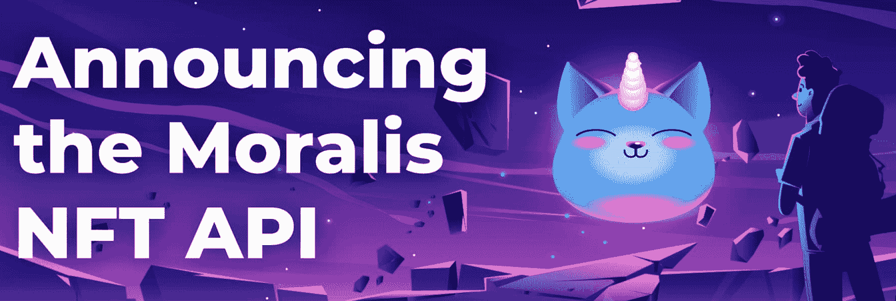

# 什么是以太坊 NFT API？–以太坊 NFT API 解释

> 原文：<https://moralis.io/what-is-an-ethereum-nft-api-ethereum-nft-apis-explained/>

即使你是 web 开发的新手，你也很可能熟悉以太坊网络。以太坊是最突出的区块链，用于 [**Web3**](https://moralis.io/the-ultimate-guide-to-web3-what-is-web3/) **开发，网络托管着一个重要的生态系统，包括**[**【dapps】**](https://moralis.io/decentralized-applications-explained-what-are-dapps/)**(分散应用)**[**DeFi**](https://moralis.io/what-is-defi-the-full-decentralized-finance-guide/)**协议，以及其他令人兴奋的项目，如 NFT(不可替换令牌)平台。随着市场的繁荣和利润的增加，NFT 相关项目的数量也在不断增加。然而，与区块链相关的编程可能相当棘手，利用开发工具使过程更加简化是有益的。在以太坊网络上与 NFT 相关的平台开发的情况下，一个这样的工具是以太坊 NFT API。**

API 在传统和 Web3 开发实践中都是必不可少的，因为它们促进了更无缝的开发者体验。因此，本文将深入探讨 API 的复杂性。在概述了 API 以及它们为什么有用之后，我们将继续探索它们在 NFTs 和以太坊区块链的上下文中是什么。因此，一旦你通读了这篇文章，你就有希望回答这个问题，“什么是以太坊 NFT API？”。

此外，本文还将探讨如何通过 [Moralis](https://moralis.io/) 获得以太坊 NFT API。Moralis 提供了一系列高级开发工具，如 [Moralis Speedy Nodes](https://moralis.io/speedy-nodes/) 、Moralis[Price API](https://moralis.io/introducing-the-moralis-price-api/)和 NFT API。Moralis 的 NFT API 与众多网络跨链兼容，以太坊是最知名的链之一。

因此，Moralis 确保了更加无缝的 web3 开发体验，允许您创建复杂的 dapps。例如，你可以轻松学习如何创建一个 NFT 市场。所以，如果你正在寻找进入[以太坊发展](https://moralis.io/ethereum-development-for-beginners/)的机会，现在就和 Moralis 签约吧！

### 以太坊是什么？

如果你对 Web3 开发领域有点熟悉，你可能听说过以太坊。然而，对于门外汉——以及需要提醒的人——我们将看看以太坊和网络需要什么。那么，事不宜迟，我们来回答这个问题，“[以太坊是什么？](https://moralis.io/full-guide-what-is-ethereum/)”。


以太坊是最著名的 blockend 开发网络，拥有先进的 dapps、 [ERC-20](https://moralis.io/erc20-exploring-the-erc-20-token-standard/) 和 [ERC-721](https://moralis.io/erc-721-token-standard-how-to-transfer-erc721-tokens/) 令牌以及其他有趣项目的庞大生态系统。此外，以太坊可通过 [Web3 契约](https://moralis.io/what-are-web3-contracts-exploring-smart-contracts/)进行编程，当满足预定条件时，它会执行特定的动作。此外，以太坊是第一个提供这种功能的区块链，吸引了很多用户。

以太坊拥有自己的编程语言 Solidity，用于构建兼容 EVM 和 T2 的智能合约。Solidity 被称为第一种“面向契约”的编程语言，通常用于为其他类似的网络创建契约。如果你对智能合同感兴趣，看看我们关于[如何创建智能合同](https://moralis.io/how-to-create-smart-contracts/)的文章。

ETH 是以太坊网络的本地货币，用户利用 ETH 支付区块链上的交易。每当有人在网络上执行一个动作，每笔交易都需要一笔油费。根据供应链上的交易数量，费用变化很大。然而，最近，随着越来越多的人涉足 Web3 领域，这些费用相对较高。因此，这突出了增加采用的对立双方。

这个问题部分源于网络当前使用的共识机制，即 PoW(工作证明)。以太坊选择转变为 PoS(利益相关证明)共识机制，以抵消高昂的天然气费用。这一策略有望使网络更容易被大众接受！

### 什么是以太坊 NFT？

在以太坊的上下文中，NFT 实质上是一个“生活”在以太坊区块链上的令牌。因此，更恰当的做法可能是仔细研究一下 NFT 以及这些令牌的特殊之处。

NFTs 或不可替换令牌，以及可替换令牌，是两种主要的令牌类型。“不可替代”一词通常用于描述具有独特属性的可模仿资产，如歌曲、房屋、艺术品等。NFT 的不变性使它们成为代表其他独特资产的理想选择，这就是为什么它们通常与数字艺术等资产联系在一起。NFT 本质上是一种独一无二的令牌，无法伪造或复制。


为了使这一点更清楚，我们可以强调我们提到的两种令牌类型之间的区别。可替换的令牌不是可模仿的，而是以可交换性为特征，并共享相同的属性。这意味着可替代资产是完全相同的，并且具有相同的价值。在加密行业，一个明显的例子是比特币。每枚硬币的价值与另一枚完全相同，这意味着两枚硬币可以交易而无需补偿。

所以，总结一下，以太坊 NFT 是一个存在于以太坊区块链的可模仿的代币。如果您对这些令牌有进一步的兴趣，我们强烈推荐您查看我们探索[动态 NFT](https://moralis.io/what-are-dynamic-nfts-the-ultimate-2022-guide/)和[分数 NFT](https://moralis.io/what-are-fractional-nfts-the-ultimate-2022-f-nft-guide/)的文章。这两种类型的非功能性测试可能很快就会流行起来，并带来一些令人兴奋的机会！此外，如果你想学习如何创建以太坊 NFT，请仔细看看我们的指南[如何创建自己的 NFT](https://moralis.io/how-to-create-your-own-nft-in-5-steps/) ！你还可以学习[如何铸造 10，000 枚 NFT](https://moralis.io/how-to-mint-10000-nfts-full-walkthrough/)来创造类似[crypto 朋克](https://opensea.io/collection/cryptopunks)的 NFT 收藏！

## 什么是 NFT 空气污染指数？

随着我们对以太坊网络和 NFTs 的记忆的更新，我们可以更深入地了解 API。API 代表“应用程序编程接口”，它们促进了两个软件之间的通信。正如你可能已经意识到的，它们在我们的日常生活中是必不可少的，例如，当你在手机上查看天气时，你会接触到 API。

当您与应用程序或 dapp 交互时，该软件会通过互联网将数据传输到服务器。接收信息的服务器需要解释数据，然后执行一系列操作，最终发送回响应。然后，响应由您的设备解释，并最终以可读的方式呈现给您。为了使这一过程成为可能，API 促进了这些交互，允许您的设备与服务器通信。


因此，API 传输或翻译指令，以便两个软件之间相互理解。通过这样做，API 可以确保在安全的开发环境中通过一致的查询功能交付进行可协调的编程。一个很好的类比是把 API 想象成餐馆里的菜单。菜单提供了一些你可以点的菜和每一道菜的描述。然后，你可以指定你喜欢什么菜，餐馆准备最终产品。类似地，API 提供了可供开发人员在 dapp 开发中使用的操作列表。

因此，在 NFTs 的上下文中，API 确保了前面提到的这些令牌的功能。因此，开发人员可以利用 NFT API 以一种更容易访问的方式获取关于 NFTs 的后端信息。现在，让我们继续看看什么是以太坊 NFT API，以及如何获得它！

## 什么是以太坊 NFT API？–介绍 Moralis 的 NFT API

Moralis 是首屈一指的 blockend 开发操作系统，作为该平台的一员，您将能够显著缩短开发时间。Moralis 提供了一系列优秀的开发工具，如 Moralis' [元宇宙 SDK](https://moralis.io/metaverse/) ，对 [IPFS](https://moralis.io/what-is-ipfs-interplanetary-file-system/) 的本地支持，以及 Moralis' [web3uikit](https://moralis.io/web3ui-kit-the-ultimate-web3-user-interface-kit/) 。这些与无限可扩展的后端基础设施相结合，使 blockend 开发成为一股热潮。

然而，在这一节中，我们将把注意力转向道德家的 [NFT API](https://moralis.io/nft-api/) ，因为这是获得以太坊 NFT API 的最佳方式。道德 NFT API 支持跨链兼容性，这意味着该 API 有助于在多个网络上实现更无缝的开发者体验。



受支持的网络之一当然是以太坊。因此，Moralis 的 NFT API 不仅是一个完美的以太坊 NFT API，而且它同时充当了[币安 NFT API](https://moralis.io/binance-nft-api-what-is-it-and-how-does-it-work/) 和多边形 NFT API。所以，如果你使用来自 Moralis 的工具，你将不会局限于一个网络，你可以创建跨链兼容的 dapps！

由于这种跨链兼容性，道德 NFT API 本质上是一个更先进的以太坊 NFT API，确保各种区块链网络和您的项目之间的通信。这允许你轻松地获取关于以太坊 NFTs 的后端信息。因此，通过利用道德 NFT API，你不需要担心建立自己的基础设施来实现这一功能。相反，你将有更多的时间分配给 Web3 开发过程中其他更重要的部分。

然而，作为一名开发者，这个“以太坊 NFT API”允许你获取什么类型的信息呢？在前面几节中，我们将提供三个例子，并仔细看看如何获得以太坊 NFT 传输数据、元数据和所有权数据！

### 获取以太坊 NFT 传送数据

当创建与 NFT 相关的项目时，访问不同类型的信息来跟踪 NFT 是有益的。我们首先要仔细研究的是如何使用以太坊 NFT API 来获取关于这些令牌的传输数据。

道德 NFT API 允许你跟踪令牌如何在以太坊区块链上移动，这在你构建 dapps 时会给你带来很大的好处。例如，您可以从特定的块号中搜索所有 NFT 转移。此外，您可以使用 API 来搜索基于钱包地址、NFT 合同地址甚至特定令牌的转账。此外，由于 Moralis 的 NFT API 支持跨链功能，这对于 Fantom、Avalanche 和 Polygon 等其他网络也是可能的。

例如，如果您希望 NFT 传输数据，可以使用以下命令:

```
const options = { chain: "", address: "",  limit: "" };
const transferNFT = await Moralis.Web3API.token.getNFTTransfer(options);
```

### 获取以太坊 NFT 元数据

NFT 通常附有所谓的元数据。一个例子是游戏中的物品，在令牌的元数据中指定了一些统计数据。因为 NFT 有元数据，所以方便地查询这些信息是非常有益的，这可以通过 Moralis 的 NFT API 来实现。有了 API，您不需要担心手动解析智能合同的繁琐的传统过程，因为 API 为您完成了大部分繁重的工作。

此外，该 API 还提供了搜索端点，允许您在 NFT 的元数据中直接搜索特定属性或描述。这些信息可以直接在你的 dapp 中使用，并使开发 NFT 项目变得非常容易！以下是使用道德 NFT API 获取元数据的方法:

```
const options = { address: "", chain: "" };
const metaData = await Moralis.Web3API.token.getNFTMetadata(options);
```

### 获取以太坊 NFT 所有权数据

我们要看的最后一个例子是所有权数据。准确的所有权数据在 NFT 开发中至关重要，使用以太坊 NFT API，可以轻松获取这些信息。一般来说，如果没有 API，您将需要建立自己的基础设施来促进所有权数据的获取。然而，通过 Moralis 的 NFT API，您可以“开箱即用”地获得这种功能，并且具有跨链兼容性。

因此，以太坊 NFT API 为您提供 NFT 所有权状态的相关和及时的信息。此外，通过几行简单的代码，您可以访问整个 NFT 收藏的所有所有者，就像我们前面提到的 CryptoPunks 一样。因此，如果您想要访问所有权数据，可以通过以下代码来实现:

```
const options = { address: "", chain: "" };
const nftOwners = await Moralis.Web3API.token.getNFTOwners(options);
```

此外，如果你想更深入地了解 API，你可以查看 GitHub 上的官方文档。这将提供更多关于以太坊 NFT API 功能和附加特性的深入信息！

## 以太坊 NFT API 解释–摘要

NFT 市场在 2022 年期间呈指数级增长，该行业正变得越来越有利可图。因此，开发与 NFT 相关的项目变得越来越流行。然而，创建 NFT 平台可能相当麻烦。因此，开发人员一直需要 NFT API，这正是 Moralis 介入的地方。

除了后端基础设施，Moralis 还提供了一系列开发工具，其中之一是 Moralis 的 NFT API。该 API 具有跨链兼容性，支持的网络之一是以太坊。因此，道德 NFT API 提供了以太坊 NFT API 的一切，允许您获取以太坊 NFT 传输数据、元数据和所有权数据等信息。


因此，使用这个以太坊 NFT API 使得以太坊开发变得更加容易，例如，你将能够轻松地[创建一个 OpenSea 克隆](https://moralis.io/create-an-opensea-clone-build-an-nft-marketplace-like-opensea/)！此外，与 NFT 相关的发展只是 Moralis 大放异彩的一个领域。该平台允许您创建其他类似的有趣项目。例如，你可以学习如何创建 [Web3 Spotify](https://moralis.io/how-to-build-a-web3-spotify-clone/) 、 [Web3 Twitter](https://moralis.io/how-to-build-a-web3-twitter-clone/) 和 [Web3 Amazon](https://moralis.io/how-to-build-a-web3-amazon-marketplace/) 的克隆。然而，这只是几个例子，你可以仔细看看 [Moralis 博客](https://moralis.io/blog/)以获得更多信息和你下一个 blockend 项目的灵感！

如果你想创建 NFT 平台，或者想专注于另一个领域，你应该[与 Moralis](https://admin.moralis.io/register) 签约。操作系统提供了 Web3 开发所需的一切，该平台允许您在几分钟内创建第一个 dapp！