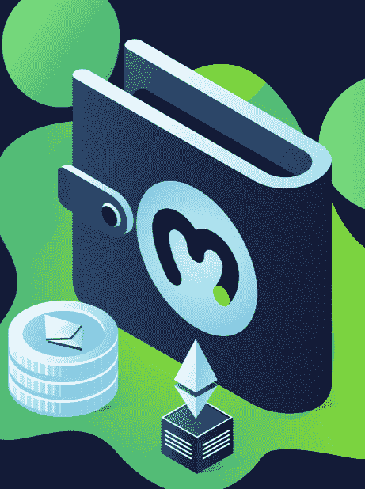
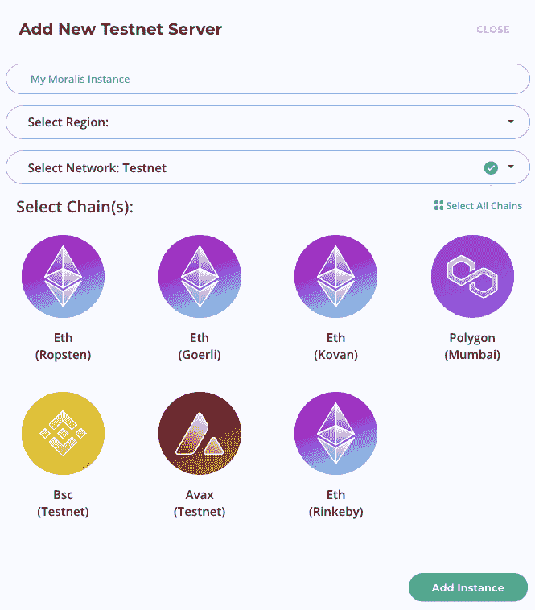
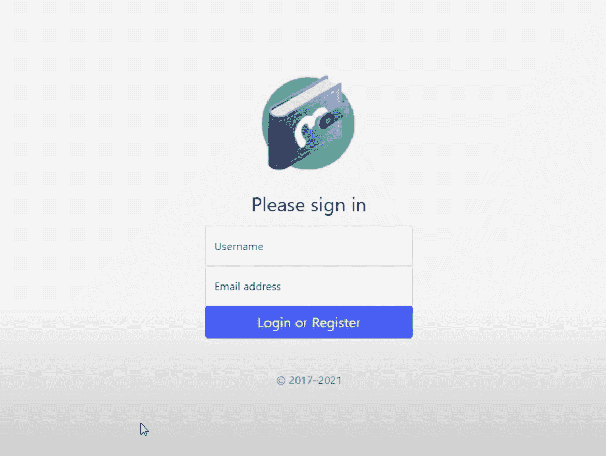
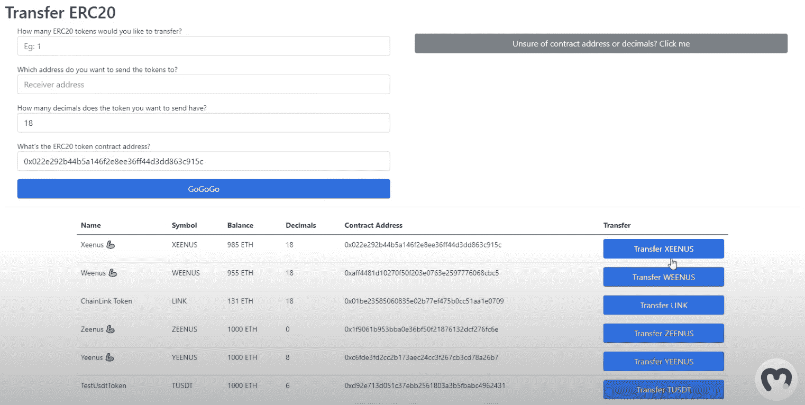

# 如何用 5 个步骤打造多链钱包

> 原文：<https://moralis.io/how-to-build-a-multi-chain-wallet-in-5-steps/>

在本教程中，我们将通过五个步骤说明如何使用 Moralis 操作系统构建多链钱包。我们将带你经历每一步；然而，如果你愿意，你可以通过访问下面的 GitHub 页面直接进入代码:

**完整的多链钱包文档—**[**https://github . com/ChrisMoralis/Moralis-Tutorials/tree/main/05% 20 创建% 20A % 20 web % 20 Wallet % 20-% 20 part % 201**](https://github.com/ChrisMoralis/Moralis-Tutorials/tree/main/05%20Creating%20A%20Web%20Wallet%20-%20part%201)

**Web3 正以惊人的速度增长，新的[dapp](https://moralis.io/decentralized-applications-explained-what-are-dapps/)、平台和其他令人兴奋的项目频繁涌现。然而，要访问并获得分散网络的全部好处，一个必要的工具是一个[网络 3 钱包](https://moralis.io/what-is-a-web3-wallet-web3-wallets-explained/)。这表明加密钱包不仅允许用户完全管理他们的加密资产，还可以充当与[web 3](https://moralis.io/the-ultimate-guide-to-web3-what-is-web3/)dapp 互动的网关。此外，还有大量不同的钱包可供选择，如信托钱包(币安的官方加密钱包)，比特币基地钱包，以及最重要的一个，MetaMask。作为 Web3 生态系统的重要组成部分，我们将在本文中用 [Moralis](https://moralis.io/) 分五步讲述构建多链钱包的过程。**

**该教程将被分解为五个简单的步骤，由于 Moralis 操作系统，我们将能够在十分钟内建立一个多链钱包。后端开发一直是区块链开发中最乏味的部分，但是当使用 Moralis 时，这个过程变得简单明了，因为系统完成了大部分繁重的工作。**

**此外，除了完全开发的后端基础设施，Moralis 还提供了一系列优秀的开发工具。你会发现 Moralis 的 [NFT API](https://moralis.io/ultimate-nft-api-exploring-moralis-nft-api/) 、[价格 API](https://moralis.io/introducing-the-moralis-price-api/) 、 [Moralis Speedy Nodes](https://moralis.io/speedy-nodes/) 等等工具。**

**所以，如果你有雄心进入 Web3 开发，成为一名区块链开发者，现在就和 Moralis 签约，开始你的区块链开发之旅吧！**

## **如何用 Moralis 五步打造多链钱包**

**在下面几节中，我们将把如何构建多链钱包的代码分解为五个步骤。结果将是一个 web 应用程序，用户可以用元掩码验证自己。一旦他们登录，就可以完全管理他们的加密资产。因此，用户将能够查看他们的交易历史以及他们的可互换代币和 NFT 余额。此外，我们还提供转移本地[以太坊](https://moralis.io/full-guide-what-is-ethereum/)以太和 [ERC-20 令牌](https://moralis.io/erc20-exploring-the-erc-20-token-standard/)的功能。**

**

我们无法在本教程中涵盖整个代码，因为它非常广泛。出于这个原因，我们将仔细看看这五个最重要的部分。此外，我们将重点关注允许用户直接通过我们的多链钱包转移代币和硬币的功能。因此，如果您还没有看过，请查看 GitHub 资源库中的完整代码，我们在本文中最初链接了这个资源库。

尽管如此，本教程将介绍如何构建多链钱包，分为以下五个步骤:

1.  创建 Moralis 服务器
2.  初始化道德和 SDK
3.  创建用户界面
4.  添加应用程序逻辑
5.  开发传递函数

通过查看这五个步骤，我们将提供代码的清晰概述，使我们能够轻松创建多链加密钱包。所以，让我们从创建一个 Moralis 服务器开始吧！

然而，如果你更喜欢看视频来教育自己，我们建议看看下面这个来自道德 YouTube 频道的视频。在下面的视频中，Moralis 的一名开发人员在不到十分钟的时间里带您完成了整个过程:

https://www.youtube.com/watch?v=zd0pBsmJI8s

## 步骤 1:如何构建多链钱包——创建 Moralis 服务器

如果你还没有，我们推荐的第一件事是你和 Moralis 签约。创建一个账户是免费的，你会发现拥有一个 Moralis 账户在很多情况下会很有帮助。事实上，作为 Moralis 的一员，你可以将所有未来 Web3 项目的平均开发时间减少 87%!

使用 Moralis 帐户，您可以通过点击管理面板顶部的“+创建新服务器”来创建服务器。当点击这个按钮时，你会看到三个选项:“Mainnet”、“Testnet”和“Local Devchain Server”。

在选择服务器时，您应该主要关注 dapp 的目的以及计划在哪里启动项目。因为这是一个教程，所以我们为这个指南选择了一个 testnet 服务器。如果您正在跟进，我们建议您也这样做。尽管如此，如果选择了其中一个选项，您将看到一个新窗口，您必须在其中输入名称，选择一个地区，然后选择网络。



一旦你完成了你的选择，剩下的就是点击底部的“添加实例”来创建服务器。服务器启动可能需要一段时间，但是您可以立即访问该实例。

## 步骤 2:如何构建多链钱包——初始化 Moralis 和 SDK

有了 Moralis 服务器，我们可以继续前进，仔细查看代码。但是，首先，如果您愿意，您可以访问 GitHub 库并在本地克隆项目。因此，当我们带你通过本教程的基本部分时，你将能够跟随。

因此，一旦您拥有了所有的文件，我们将从初始化 Moralis 开始。为此，您需要您的服务器 URL 和应用程序 ID。您可以通过单击在上一步中创建的服务器的“查看详细信息”按钮来找到此信息。


有了这两个元素，我们导航到" [main.js](https://github.com/ChrisMoralis/Moralis-Tutorials/blob/main/05%20Creating%20A%20Web%20Wallet%20-%20part%201/main.js) "文件。该文件包含使 dapp 正常运行的基本逻辑；然而，我们将在另一个步骤中回到这个问题。现在，我们将通过以下方式输入服务器 URL 和应用程序 ID 来初始化 Moralis:

```
Moralis.initialize("APP ID");
Moralis.serverURL = "SERVER URL";
```

初始化 Moralis 后，我们还将看看如何将 SDK 连接到 Moralis。为此，我们需要导航到“[dashboard.html](https://github.com/ChrisMoralis/Moralis-Tutorials/blob/main/05%20Creating%20A%20Web%20Wallet%20-%20part%201/dashboard.html)”文件。在第 17 行和第 18 行，我们将 SDK 连接到 Moralis，它在代码中看起来像这样:

```
  <script src="https://cdn.jsdelivr.net/npm/[email protected]/dist/web3.min.js"></script>
  <script src="https://npmcdn.com/[email protected]/dist/moralis.js"></script>
```

现在，随着 Moralis 的初始化和 SDK 与 Moralis 的连接，我们可以继续深入了解代码本身。首先，我们将深入 dapp 的 UI 代码！

## 步骤 3:如何构建多链钱包——创建用户界面

在这一部分，我们将看看我们的多链钱包 dapp 的 UI。我们不会深入研究代码，因为根据您的偏好，UI 可能会有很大的不同。然而，我们的 dapp 的 UI 由两个不同的部分组成:登录和仪表板页面。我们将在 GitHub 资源库的“[index.html](https://github.com/ChrisMoralis/Moralis-Tutorials/blob/main/05%20Creating%20A%20Web%20Wallet%20-%20part%201/index.html)”文件中找到登录页面的代码。为了说明代码的作用，我们将提供登录面板的屏幕截图:



登录页面的代码基于 Bootstrap 的登录模板，我们对其做了一些修改。因此，您可以简单地利用相同的模板并进行调整，以便 UI 满足您的需求。

第二个页面是仪表板，这个文件的代码可以在“dashboard.html”文件中找到。此外，这是用户界面的样子:


与登录页面一样，仪表板也是基于引导模板的。因此，您可以随意使用代码，并根据需要进行调整，以创建自己独特的仪表板。

大部分代码包含我们的多链钱包的字段和按钮，当我们在下面的步骤中添加 [JavaScript](https://moralis.io/javascript-explained-what-is-javascript/) 逻辑时，我们将不断地通过代码引用这些元素。

此外，如果你对 UI 开发有特别的兴趣，我们强烈推荐查看 [Moralis 的 Web3UI 工具包](https://moralis.io/web3ui-kit-the-ultimate-web3-user-interface-kit/)！

## 步骤 4:如何构建多链钱包——添加应用程序逻辑

接下来，我们有“main.js”文件，在这里我们可以找到我们的 wallet dapp 的大部分逻辑。该文件非常广泛，由几个基本函数组成，为项目提供必要的功能，确保应用程序按预期工作。因为它包含了相对较多的代码，所以我们不会遍历每一行。

相反，我们将把大部分注意力放在分析实现账户间转账所需的函数上。然而，还有其他重要的功能，举几个例子，我们有登录、呈现内容、隐藏内容、注销等功能。这些非常简单明了；尽管如此，为了举例说明，登录函数看起来是这样的:

```
login = async () => {
    await Moralis.Web3.authenticate()
    .then(async function (user) {
        let _username = document.getElementById('user-username').value;
        let _email = document.getElementById('user-email').value;
        if(_username != '' || _email != ''){
            if(_username != ''){user.set("name", _username);}
            if(_email != ''){user.set("email", _email);}
            await user.save();
        }
        window.location.href = "dashboard.html";
    })
}
```

这个功能的中心部分是“道德”。Web3.authenticate()”，这说明了使用 Moralis 的强大功能。这基本上是我们允许用户使用[元掩码](https://moralis.io/metamask-explained-what-is-metamask/)进行身份验证所需要的。如果没有操作系统，这将是一个非常繁琐的任务，并且需要大量的时间来完成。这是 Moralis 派上用场的一个例子，也是我们能够显著缩短所有区块链项目开发时间的众多原因之一。

## 第五步:如何构建多链钱包——转账功能

在本节中，我们将深入探讨允许我们发送 ETH 和 ERC-20 令牌的传递函数。我们将把这一部分分成两部分，因为有两个独立的函数，每个函数对应一种令牌类型。然而，由于我们使用了 Moralis,“如何构建多链钱包”教程的这一部分变得相对容易，因为我们可以访问“开箱即用”的函数。而且还有一个转移 [NFTs](https://moralis.io/non-fungible-tokens-explained-what-are-nfts/) 的附加功能，是空白的。如果你想增加这个功能，你可以自己开发。

但事不宜迟，让我们仔细看看用于转移 ETH 的函数！

### 传输以太网

我们要剖析的第一个函数是“transferETH”函数。该函数的完整代码如下所示:

```
transferETH = async () => {
    let _amount = String(document.querySelector('#amountOfETH').value);
    let _address = document.querySelector('#addressToReceive').value;

    const options = {type: "native", amount: Moralis.Units.ETH(_amount), receiver: _address}
    let result = await Moralis.transfer(options)
    alert(`transferring ${_amount} ETH to your requested address. Please allow some time to process your transaction.`);
}
```

我们本质上只需要“Moralis.transfer(options)”函数来传输 ETH。这是一行代码，用于在两个帐户之间转移 ETH。然而，如代码所示，这个函数接受一个对象形式的参数，在本例中，这个对象称为“选项”。因此，我们需要指定这个对象的属性。因此，我们首先定义令牌类型，将其设置为“native”。接下来，我们从用户的输入中获取金额，以及我们希望将 ETH 发送到的地址。

### 转让 ERC-20 代币

“transferERC20”函数稍微复杂一些；然而，正如前面的函数一样，我们基本上只需要一行代码，因为我们使用的是 Moralis。因此，实现该功能相对容易，这是整个函数的样子:

```
transferERC20 = async () => {
    let _amount = String(document.querySelector('#ERC20TransferAmount').value);
    let _decimals = String(document.querySelector('#ERC20TransferDecimals').value);
    let _address = String(document.querySelector('#ERC20TransferAddress').value);
    let _contract = String(document.querySelector('#ERC20TransferContract').value);

    const options = {type: "erc20", 
                    amount: Moralis.Units.Token(_amount, _decimals), 
                    receiver: _address,
                    contract_address: _contract}
    let result = await Moralis.transfer(options)    
    console.log(result);
}
```

首先，该函数用用户从 UI 输入的数据创建一堆变量。这些变量然后被用来创建“选项”对象。类型自动设置为“erc20”。接下来，代码根据用户界面的输入指定金额、小数位数和合同地址。

指定了“options”对象的所有这些参数后，我们可以在调用 Moralis 传递函数时将该对象作为参数传递。

### 获取合同地址和令牌小数

您可能已经注意到，这两个传递函数之间最显著的区别是，传递 ERC-20 令牌需要合约地址和令牌小数。找到这些信息并不困难；然而，这是一个我们可以避免的烦人的任务。因此，我们将仔细查看“getTransferERC20Balances()”函数，它允许我们从区块链中获取这些信息。通过这样做，我们还改善了用户体验，这是任何 dapp 的一个重要方面。



在上面的截图中，当有人试图转移代币时，您将看到我们 dapp 的用户界面示例。UI 要求用户输入金额、接收地址、代币小数和合同地址。

因此，“getTransferERC20Balances()”函数做的第一件事是检查用户的余额，以找出他们的钱包中有哪些可用的令牌。然后，我们使用这些信息创建一个包含正确信息的内容块，它与 dapp 的前端进行通信。这是你可以在截图下半部分看到的信息。现在，如果任何一个“转移…”按钮被启动，该功能将自动获取小数和合同地址。然后，它将为用户填充输入字段。

如果你进一步分析代码，你会注意到它是不完整的，只适用于区块链。但是，您可以利用相同的策略和结构来进一步扩展功能，使其与其他类似的链兼容。这意味着您现在拥有了构建多链钱包的所有必要工具。

现在，这就是如何用五个步骤建立一个多链钱包的教程！

## 如何通过 5 个步骤打造多链钱包——总结

如果你跟随本教程，你很可能已经注意到与道德的力量。已经开发的后端基础设施让我们只需五个简单的步骤就能创建一个多链钱包:

1.  创建 Moralis 服务器
2.  初始化道德和 SDK
3.  创建用户界面
4.  添加应用程序逻辑
5.  开发传递函数


然而，这只是众多项目中的一个，道德使区块链的发展变得更加容易。例如，有了[道德元宇宙 SDK](https://moralis.io/metaverse/) ，你将能够创建各种不同寻常的[元宇宙](https://moralis.io/what-is-the-metaverse-full-guide/)平台。例如，我们有关于[如何在 25 分钟内构建一个元宇宙游戏](https://moralis.io/how-to-build-a-metaverse-game-in-25-minutes/)、[构建一个元宇宙游戏智能契约](https://moralis.io/metaverse-smart-contract-how-to-build-a-metaverse-game-smart-contract/)、[构建一个中世纪元宇宙游戏](https://moralis.io/how-to-build-a-medieval-metaverse-game/)的指南，仅举几例。

此外，如果你是 Web3 开发领域的新手，一定要看看我们的文章:区块链开发的[最佳语言](https://moralis.io/best-languages-for-blockchain-development-full-tutorial/)、[为什么 Web3 很重要](https://moralis.io/why-is-web3-important-a-beginners-guide/)以及[初学者以太坊开发](https://moralis.io/ethereum-development-for-beginners/)。

希望这篇教程对你有所帮助，并激励你开始自己的开发之旅，成为一名区块链开发者。如果是的话，请随时[注册道德家](https://admin.moralis.io/register)并加入我们这个奇妙的社区吧！**