# 无气元宇宙互动——探索零费用 dApps

> 原文：<https://moralis.io/gasless-metaverse-interactions-exploring-zero-fee-dapps/>

如果你在高需求高峰期间使用过[](https://moralis.io/full-guide-what-is-ethereum/)****以太坊，你就会知道高昂的交易费用有多痛苦。然而，无汽油交易的引入使事情变得更加顺利。现在，随着元宇宙的不断扩张，你认为没有气体的元宇宙互动可能吗？还好答案是肯定的！因此，我们想向您展示为您的 dApps 实现无气体元宇宙交互是多么容易。而且，**[**【NFT】**](https://moralis.io/how-to-launch-an-nft-marketplace/)**[**Unity web 3**](https://moralis.io/unity-web3-beginners-guide-to-unity-web3-programming/)**游戏，以及其他**[**web 3**](https://moralis.io/the-ultimate-guide-to-web3-what-is-web3/)**应用都可以成为零费用 dApps。此外，这也是 OpenSea 已经开始引入的特性。因此，他们现在提供无汽油元宇宙交易，我们将在下面更仔细地研究。******

****接下来，你将有机会跟随我们的领导，承担一个简单的示例项目。因此，你将了解更多关于潜在的无气元宇宙以及如何在你的 dApps 中包含该功能。此外，您还将看到最终的 Web3 开发平台 [Moralis](https://moralis.io/) 如何让事情变得更加简单。这个“ [Firebase for crypto](https://moralis.io/firebase-for-crypto-the-best-blockchain-firebase-alternative/) ”平台使您能够通过简单地复制和粘贴代码片段来满足您的后端需求。除了道德，我们还将使用另外两个惊人的工具。为了编译和部署我们的智能合约，我们将使用 [Remix](https://moralis.io/remix-explained-what-is-remix/) 。此外，为了连接[以太坊测试网](https://moralis.io/ethereum-testnet-guide-connect-to-ethereum-testnets/)之一，我们将使用[元掩码](https://moralis.io/metamask-explained-what-is-metamask/)——最流行的 [Web3 钱包](https://moralis.io/what-is-a-web3-wallet-web3-wallets-explained/)。为了充分利用本文，我们鼓励您使用 [GitHub](https://github.com/DanielMoralisSamples/31_Gasless_Metaverse) 上提供的代码，并自己采取必要的行动。尽管如此，在继续之前，不要忘记[创建你的免费道德账户](https://admin.moralis.io/register)。****

****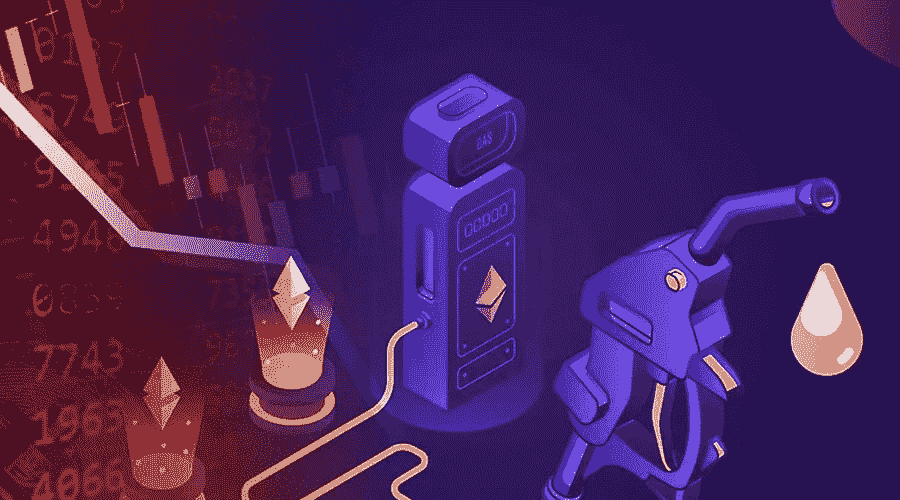

## OpenSea 的无气元宇宙启始

如前所述，让我们仔细看看 OpenSea 是如何为 NFT 创作者提供选择[懒薄荷 NFTs](https://moralis.io/how-to-lazy-mint-nfts/) 的。在这一点上，你可能知道所有链上的链上交易都有费用(称为“汽油”)，对吗？一些利益证明(PoS)连锁店已经提供了非常低的汽油费；然而，[以太坊的煤气费](https://moralis.io/ethereum-gas-fees-the-ultimate-2022-guide/)依然过高。从一个角度来看，我们可以看到这是一个很好的迹象，表明链是受欢迎的，被许多人使用。然而，这也是一个巨大的细微差别，尤其是对于预算紧张的用户来说。现在，让我们指出，不存在完全的[无气交易](https://moralis.io/gasless-transactions-exploring-gasless-transactions-on-ethereum/)。总有人要支付这些费用。因此，“无气”一词，即使是在谈论“无气元宇宙”时，也侧重于用户友好的解决方案。因此，开发团队或价值接受方可以支付费用。

那么，OpenSea 如何提供这种零费用的 dApps 解决方案呢？他们通过允许 NFT 的创造者和卖家创建列表或出售订单来实现这一点。这意味着实际交易在上市时并没有在链上执行。因此，此时不需要气体进料。也就是说，让我们以 NFT 为例，看看这个没有汽油的元宇宙方面是如何使用的。为此，我们将重点关注 OpenSea 的 testnet 版本，使用 Rinkeby testnet。

### 零费用 dApps——OpenSea 列表演示

这是我们 NFT 的例子:

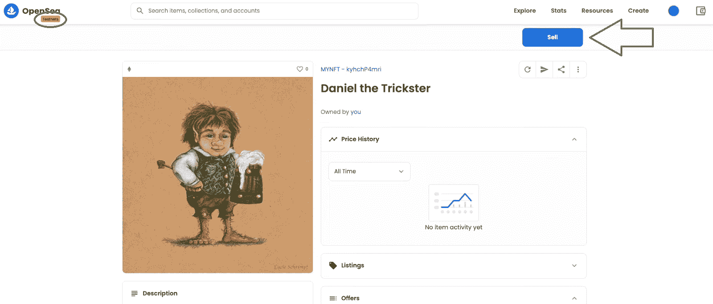

通过点击“出售”按钮，我们可以列出“丹尼尔骗子”NFT 没有任何汽油费。我们必须输入价格，然后点击“完成列表”按钮列出 NFT:

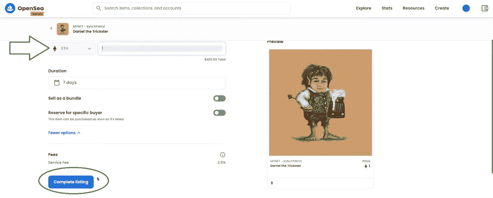

在我们点击“完成列表”按钮后，我们并没有执行链上交易。相反，一个链外的“交易”开始了。因此，参数化订单需要由创建者作为消息进行签名:

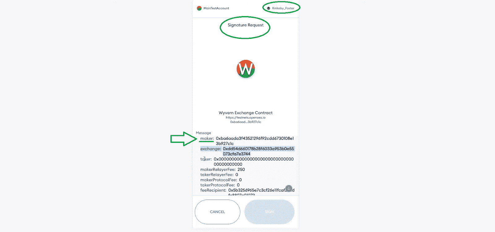

为了激活“签名”按钮，我们需要滚动消息。然后，我们可以点击“签名”并确认我们的列表:

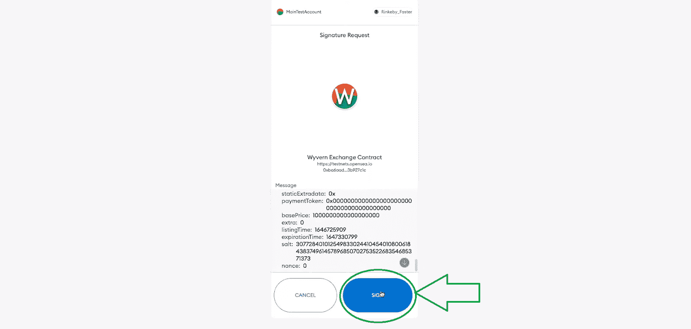

在签署上述消息后，您将看到这样的消息:

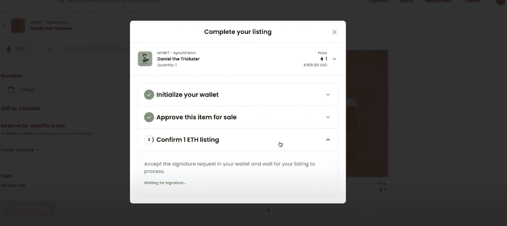

只有在我们的签名被确认时，上述消息才会短暂出现。签名一经确认，我们将收到一条消息，通知我们我们的 NFT 现已上市出售:

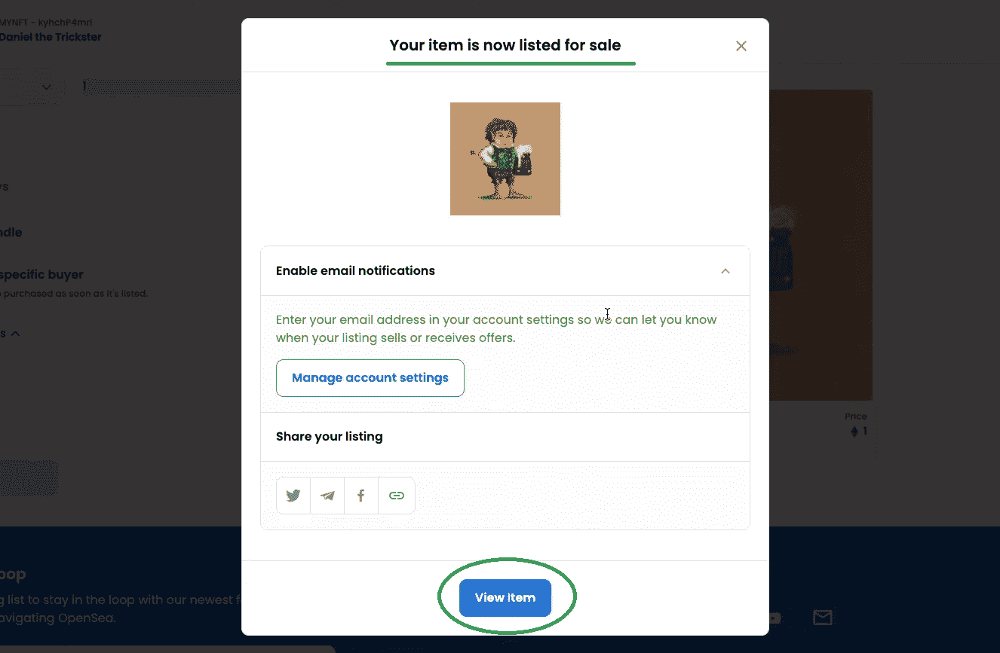

因此，我们在没有支付任何天然气费用的情况下，成功地将我们的示例 NFT 上市:

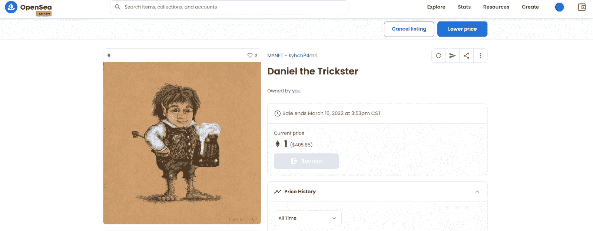

上述无气元宇宙交易的例子不是一个实际的交易。通过签署 MetaMask 的消息，我们只确认了潜在的未来事务的散列的创建。此外，如上所述，这个散列是离线存储的。此外，当有人购买这个 NFT 时，这个交易将会连锁进行。此外，在购买时，收到价值的买方将支付相关的气费。

### 零费用 dApps 潜力

其他零费用 dApps 也可以使用相同的“无气”方法。例如，我们可以在一个 Web3 游戏中实现这种策略。因此，让我们说，我们想授予一个游戏中的资产给一个玩家，这需要 NFT 铸币。然而，作为一个平台，你不希望把钱花在天然气上，如果你要考虑所有的参与者，这笔钱就会增加。因此，您可以使用类似于上面介绍的策略。这意味着你在后台生成一条消息，并用你控制下的一个账户签名。然后，最后，给用户发放优惠券。然后，用户兑现优惠券，自己支付燃气费。当然，我们不会把细节留给你自己去琢磨。相反，我们将向您展示如何用我们的无气元宇宙的例子做到这一点。

## 无气元宇宙互动-示例项目

如上所述，现在是时候向您展示如何创建零费用 dApps 了。因此，我们将创建一个脚本来生成消息哈希并对其进行签名。请注意，在你的游戏、元宇宙和其他 dApps 中，你通常会在后台实现这个功能。然而，为了这个教程，我们决定在前端做。背后的逻辑是一样的。这样，你会对过程本身有一个更清晰的了解。

我们还创建了一个智能合同模板，它能够验证签名并授予优惠券的内容。此外，由于我们将在前端这样做，我们也将创建一个简单的界面，用户可以要求他们的优惠券。因此，这是这个无气元宇宙互动例子的三个步骤:

1.  封面优惠券生成。
2.  部署我们的“零费用 dApps”智能合同。
3.  创建优惠券申领用户界面。

## 通过优惠券生成的无汽油元宇宙交易

如上所述，我们将使用虚拟优惠券作为推迟交易费用的方法。因此，我们需要生成优惠券。此外，每张优惠券都是我们特定有效负载的散列和我们的管理帐户对该有效负载的签名的组合。如前所述，您通常会在后端完成这项工作。

为了使事情尽可能清楚，让我们先看一下优惠券生成界面的预览:


看上面的截图，你可以看到我们尽可能的保持简单。有三个输入字段。首先，我们有“对象类型”。然后“特征”旁边有两个字段。左边的是“物品等级”，右边的是“伤害点数”。这些字段可以是您想要的任何内容，这在我们上面的示例条目中已经明确指出。一旦我们输入示例值，我们点击“授予”按钮，以生成一个无气元宇宙交易优惠券。正如上面的 OpenSea 演示一样，这将提示 MetaMask 请求签名:

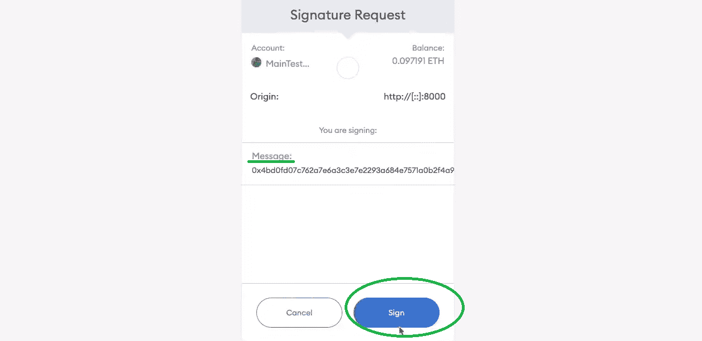

正如您在上面的图像中看到的，我们的消息只包含一个散列。当然，我们可以更有创意。点击“Sign”按钮后，我们的界面显示相同的散列:


### 零费用 dApps 的优惠券生成–代码演练

如果你有一些前端编程的经验，你可以想象我们的优惠券生成界面可以用一个简单的 HTML 文件覆盖。为此，我们创建了一个“[index.html](https://github.com/DanielMoralisSamples/31_Gasless_Metaverse/blob/master/frontend/index.html)”文件。而且，该逻辑被“ [logic.js](https://github.com/DanielMoralisSamples/31_Gasless_Metaverse/blob/master/frontend/static/logic.js) ”所覆盖。这两个文件都可以在 GitHub 上获得。

#### 零费用 dApps 的优惠券生成–代码演练–界面

我们想从 HTML 文件中指出的部分是“输入”参数行。这部分代码使我们能够输入参数，作为有效载荷的详细信息:

```
 <div class="input-group mb-2">
                        <span class="input-group-text">Type of Object</span>
                        <input id="objectType" type="text" class="form-control" placeholder="Input Type of Object">
                    </div>
                    <div class="input-group mb-2">
                        <span class="input-group-text">Characteristics</span>
                        <input id="objectRank" type="text" class="form-control" placeholder="Rank of Object ">
                        <input id="damagePoints" type="text" class="form-control" placeholder="Damage Points">
                        <button class="btn btn-secondary" id="grant" onclick="grantCoupon();">Grant</button>
                    </div>
```

#### 零费用 dApps 的优惠券生成–代码演练–逻辑

此外，如果我们现在关注逻辑部分，它从一个登录函数开始:

```
login();
const ethers = Moralis.web3Library

async function login(){
    Moralis.Web3.enableWeb3().then(async function (){
        const chainIdHex = await Moralis.switchNetwork("0x2A");
    });
}
```

上面初始化了 [Moralis 的 SDK](https://moralis.io/exploring-moralis-sdk-the-ultimate-web3-sdk/) ，它也为我们提供了一个 Web3 提供者。在我们的例子中，后者是醚。此外，“0x2A”将我们的网络默认为 Kovan testnet。此外，这行代码涵盖了我们逻辑的另一个重要部分:

```
const hash = ethers.utils.hashMessage(JSON.stringify(object));
```

创建了 [Ethers.js](https://moralis.io/web3-js-vs-ethers-js-guide-to-eth-javascript-libraries/) 对象后，我们也可以访问这个库并使用它的函数。此外，这个库使我们能够使用一个优秀的经过实战检验的消息散列函数。为了散列消息，我们需要字符串化我们的有效载荷。一旦散列正确，我们可以签署它。后者是通过使用一个或一组由您控制并能够保护的私钥来实现的。此外，我们的接口返回授予用户的签名优惠券。*记住，你通常会在后台完成这项工作。*

尽管如此，我们还应该指出，每个优惠券只不过是消息散列和签名的结合。通过分解优惠券，我们可以建立一个“验证智能合约”。后者将验证消息是由正确的帐户签名的。此外，如果是这种情况，它将触发特定的连锁行动。

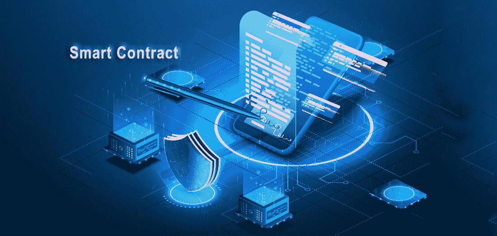

## 无气元宇宙交易的智能合约示例

Remix 是一个很好的在线工具，用于编译和部署智能合约。因此，我们建议您从“ [verify.sol](https://github.com/DanielMoralisSamples/31_Gasless_Metaverse/blob/master/contracts/verify.sol) ”文件中复制内容并粘贴到 Remix 中。此外，我们的智能契约的输入是散列消息和散列的签名。我们从优惠券上得到这些。有关我们的示例无气元宇宙智能合同的更多细节，请查看文章底部的视频(6:45)。在那里，您还将了解一个特殊的前缀，这是以太坊提供的一种安全措施。此外，您将了解“ecrecover”函数如何恢复谁是散列消息的签名者。当然，您还将了解如何编译和部署我们的示例智能合同。

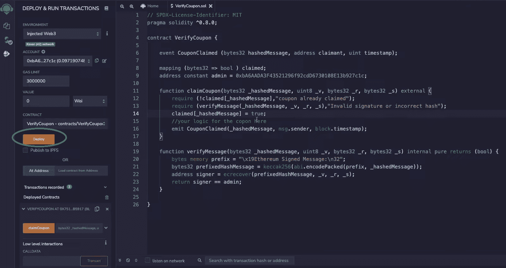

### 优惠券验证界面

我们示例项目的最后一部分围绕着验证生成的优惠券。我们必须再次指出，优惠券生成和优惠券兑现过程通常都是在后台完成的。

我们的示例界面如下所示:


它有一个输入字段，哈希必须粘贴到这个字段中。然后，我们必须单击“验证”按钮。此外，该部件的外观和功能包含在“[verify.html](https://github.com/DanielMoralisSamples/31_Gasless_Metaverse/blob/master/frontend/verify.html)”和“ [logic-verify.js](https://github.com/DanielMoralisSamples/31_Gasless_Metaverse/blob/master/frontend/static/logic-verify.js) ”文件中。同样，这两个文件都可以在 GitHub 上找到。此外，虽然 HTML 代码相对简单，但逻辑部分稍微复杂一些。然而，多亏了 Moralis，把它放在适当的位置还是很容易的。尽管如此，对于详细的代码演练，请参考下面的视频，从 10:40 开始。此外，这也是您将了解 Moralis“execute function”如何在“verify”函数中完成繁重工作的地方。

这是我们上面提到的视频:

https://www.youtube.com/watch?v=AQfjB4TxYtI

## 无气元宇宙互动——探索零费用 dApps——总结

在这一点上，你是一个真正的无气体元宇宙相互作用的半专家。首先，你现在知道，没有汽油费，区块链的交易就无法进行。然而，您还了解到事务的实际执行可以被推迟。这也是价值接受方支付燃气费的方式。此外，我们还向您展示了如何使用一个简单的界面和我们的智能合约示例来实现这一点。此外，我们已经在前端完成了无气元宇宙互动。因此，你有机会看到这一点，否则后端功能，关闭。尽管如此，有了上面的例子，你就可以使用这个概念并创建自己的零费用 dApps 了。

然而，如果您首先需要更多的 Web3 开发实践，请确保查看我们的其他示例项目。你可以在[道德网 YouTube 频道](https://www.youtube.com/c/MoralisWeb3)和[道德网博客](https://moralis.io/blog/)上找到这些。这两个渠道也是了解区块链发展不同方面的绝佳场所。例如，我们最近的一些话题包括[如何成为一名 Web3 开发者](https://moralis.io/how-to-become-a-web3-developer-full-guide/)，如何[推出一个白色标签的 NFT 市场](https://moralis.io/how-to-launch-a-white-label-nft-marketplace/)，如何将 [Unity 游戏与 Web3 登录](https://moralis.io/connecting-a-unity-game-with-web3-login/)，[元宇宙智能合约](https://moralis.io/metaverse-smart-contract-how-to-build-a-metaverse-game-smart-contract/)示例，如何[用 ReactJS 构建一个跨链 Zapper dApp】，如何构建一个](https://moralis.io/how-to-build-a-cross-chain-zapper-dapp-with-reactjs-using-moralis-api-and-serverless-real-time-transactions/) [Web3 MMORPG](https://moralis.io/build-a-web3-mmorpg-with-unity-in-10-minutes/) ，如何创建一个 [Web3 电子商务](https://moralis.io/web3-e-commerce-create-a-web3-e-commerce-platform-in-5-steps/)[例如，我们最近概述了如何通过几个简单的步骤构建一个 Spotify Web3 的克隆版本！](https://moralis.io/web3-e-commerce-create-a-web3-e-commerce-platform-in-5-steps/)

此外，你可能想超越免费的加密教育，更快地成为一名区块链开发者。如果是这样的话，你应该去看看[道德学院](https://academy.moralis.io/)。当然，这里是报名参加高质量[区块链发展课程](https://academy.moralis.io/all-courses)的地方。然而，更大的价值在于接受专家指导，令人惊叹的社区和个性化的学习路径，这是道德学院提供的！****