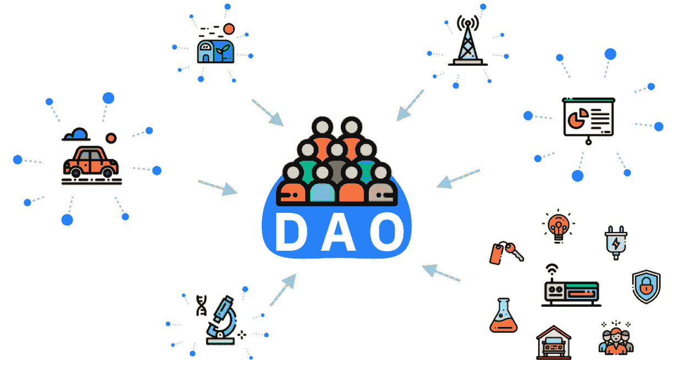
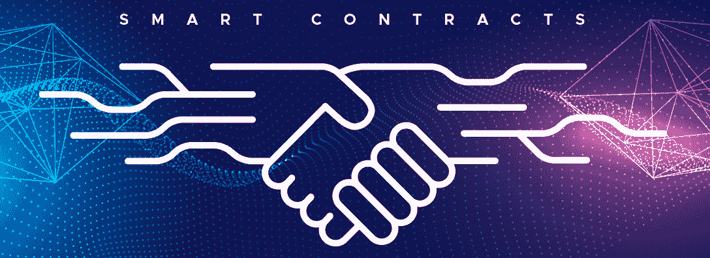
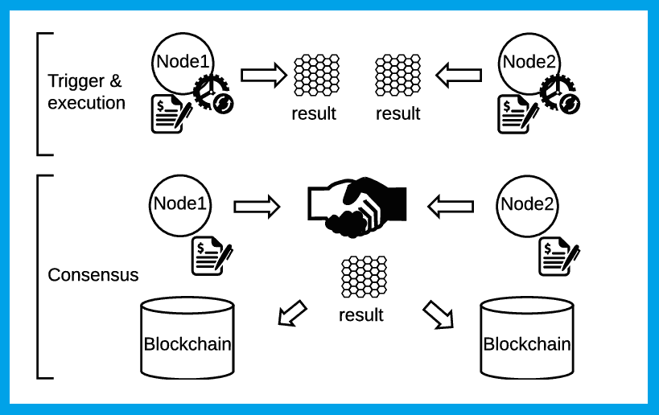
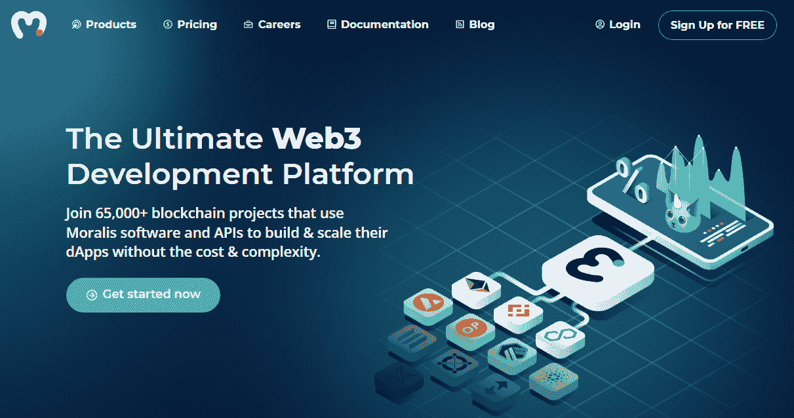
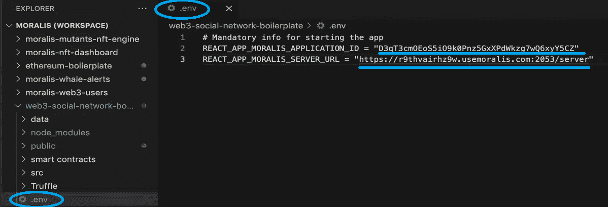
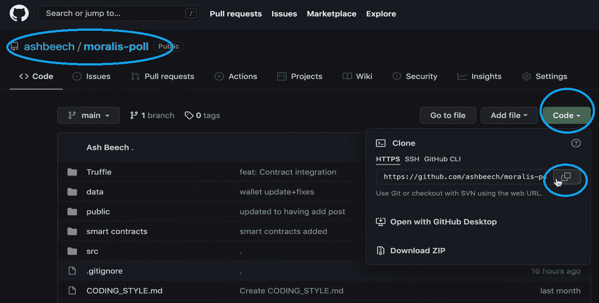
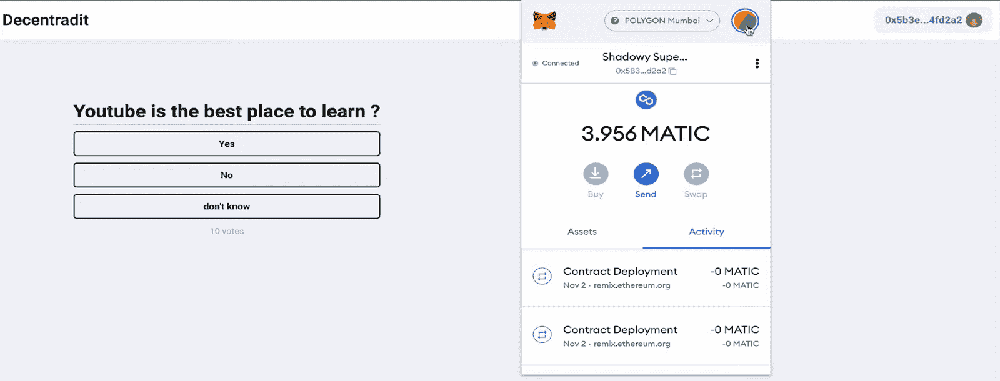

# DAO 智能合约示例–DAO 指南

> 原文：<https://moralis.io/dao-smart-contract-example-dao-guide/>

**得益于** [**以太坊**](https://moralis.io/full-guide-what-is-ethereum/) **，第一个可编程的区块链和无数智能合约的来源，程序员们现在想** [**学习以太坊开发**](https://moralis.io/ethereum-development-for-beginners/) **由于 Web3 的突出未来。开发课程的一部分是学习如何** [**创建智能合同**](https://moralis.io/how-to-create-smart-contracts/) **。对许多人来说，智能合同给生活带来了真正的去中心化。通过执行智能合同，我们可以为许多不同的用例自动执行公正、公平和其他规则。此外，这也是道将绝对的去中心化付诸实践的一个很好的例子。因此，作为开发人员，您应该仔细研究 DAO 智能合约示例，并将其实现到您的** [**Web3 应用**](https://moralis.io/metamask-for-developers-how-to-launch-web3-apps-with-metamask/) **中。然而，如何找到一个 DAO 智能契约的功能性和实用性的例子呢？幸运的是，您来对地方了，因为这篇 DAO 指南文章将为您提供这一点。**

当然，在我们查看前面提到的 DAO 示例的智能合约之前，我们将首先确保我们在 DAO 智能合约和 DAO 是什么的问题上达成一致。有了这些知识，我们将为您呈现一个相关的示例项目。后者将向您展示如何[创建一个 DAO](https://moralis.io/how-to-create-a-dao-in-10-minutes/) ，从而作为您未来 DAO 开发的 DAO 智能契约示例。此外，我们不会像许多区块链开发者那样，允许 RPC 节点的[限制阻碍他们的发展。相反，我们将使用终极的](https://moralis.io/exploring-the-limitations-of-rpc-nodes-and-the-solution-to-them/) [Web3](https://moralis.io/the-ultimate-guide-to-web3-what-is-web3/) 开发平台——[Moralis](https://moralis.io/)(又名 [Firebase for crypto](https://moralis.io/firebase-for-crypto-the-best-blockchain-firebase-alternative/) )。它将使我们能够从 [Moralis 文档](https://docs.moralis.io/)中复制并粘贴简短的代码片段。反过来，它将毫不费力地完成后端的繁重工作。事实上，通过使用我们的样板文件，您将能够在 10 分钟之内创建自己的 DAO。

## 什么是 DAO 智能合约？

智能合约是任何 DAO 的支柱，就像其他[智能合约](https://moralis.io/smart-contracts-explained-what-are-smart-contracts/)一样，DAO 智能合约确保自动化流程根据预定义的规则运行。因此，当满足特定的预定义条件时，它们会触发预定义的操作。*然而，要想从本节的剩余部分中获得最大的收益，只有在你理解了什么是道的情况下才能继续。如果你不确定，先看看下面的“什么是刀”一节。*

让我们快速比较一下 DAO 智能合约和最著名的智能合约之一——er C20 合约。它们确保根据预定义的 ERC20 协议创建和管理 ERC20 令牌。这包括合同地址、代币的总供应量、代币的名称和报价器、 [ERC20 转账](https://moralis.io/erc20-transfer-how-to-transfer-erc20-tokens/)细节等等。因此，必须满足特定的规则和功能。同样，DAO 智能契约有助于形式化 DAO 的规则。

当上述内容付诸使用时，有许多不同的选择。然而，一个很好的 DAO smart 契约示例是处理授权的风险投资。在这种情况下，他们将创建一个 DAO 智能契约，确保池、资金分配的投票，甚至资金分配都按照预定义的方式运行(符合规则)。此外，另一个 DAO 智能合约示例可以围绕一个慈善机构及其接受和支出捐款来发展。事实上，已经有各种各样的 Dao 在运行，还会有更多的 Dao 出现。因此，您真的不想错过学习如何使用我们的 DAO 智能契约示例的机会。

### 什么是刀？

分散自治组织(Dao)是由志同道合的成员组成的区块链团体。正如道中的“O”所暗示的，他们是某种组织。这些可以是企业、非营利组织、社区等等。然而，Dao 最重要的一点是，它们由成员集体所有和管理。此外，由于可编程区块链，以太坊是最受欢迎的选择，这可以有效和安全地完成。通过使用 DAO 智能契约(如上所述)，DAO 可以轻松地实施它们的规则、指南和功能。这样一来，决策就很容易受到提案和投票的控制。这确保了所有成员都有发言权。如果适用，国债是内置的 Dao。这样，没有其他成员的批准，任何人都无权动用一个组织的资金。因此，一切都是公开的，并与代码行保持一致。

考虑到这一点，您可以看到 Dao 可以为企业、政府和其他组织的“公正”组织做出巨大贡献。然而，你也看到了，一个 DAO 只和它的 smart 契约一样好。幸运的是，随着区块链变得越来越正常，代码通常会放在那里供每个人查看。就此而论，没有什么好笑的事情。

已经有相当多的 Dao 活着，我们可以期待更多的 Dao 在不久的将来重见天日。尤其是在涉及资金、金钱和敏感信息或决策的组织中，Dao 提供了一个很好的解决方案。通过自动执行规则，可以消除许多紧张和信任他人的需要。

## 查看 DAO 智能合约示例

现在，您已经知道了什么是 DAO 智能协定，什么是 DAO，是时候仔细看看我们的 DAO 智能协定示例了。它会让你在十分钟内创造出你自己的刀。在此过程中，您还将学习如何设置和使用 Moralis。后者是使区块链开发尽可能简单的不可或缺的工具。首先，它使前端开发人员能够精通 [JavaScript](https://moralis.io/javascript-explained-what-is-javascript/) 并能够使用[元掩码](https://moralis.io/metamask-explained-what-is-metamask/)来创建惊人的[dapp](https://moralis.io/decentralized-applications-explained-what-are-dapps/)(分散式应用程序)。此外，它还节省了大约 90%的后端编程时间。因此，与 Moralis 一起工作的开发人员可以快速交付工作产品，并且有多余的资源。这意味着专注于创造最佳用户体验，并为此花费更多时间。此外，正是后者决定了 dApp 的成功。

在接下来的部分中，我们将首先引导您完成初始设置过程。然后，您将能够使用我们的 DAO 智能契约示例来创建您自己的 DAO。听起来令人畏惧？不用担心；我们将为您提供该流程的概述。然而，更多的细节，我们将把你交给一个道德专家的视频教程。

此外，随着您继续进行下面的示例项目，您将有两种选择。你可以效仿道德专家的例子，从 [Web3 社交网络样板](https://github.com/ethereum-boilerplate/web3-social-network-boilerplate)开始。通过分叉和应用必要的调整，您可以创建一个 DAO。然而，你也可以克隆最终的代码，这也是由你在 GitHub 处理的。*该文件夹还包括我们的 DAO 智能合约示例(“。sol”文件)。*使用后者无疑是以创纪录的速度创建 DAO 函数(比如 poll)的最快方法。

## 使用 DAO 智能合约示例的初始设置

在下面的小节中，您将创建您的 Moralis 服务器，克隆我们完成的代码，并在代码中使用您的服务器的详细信息。

### 步骤 1:创建一个 Moralis 服务器

无论您想使用 Moralis 创建 DAO 还是任何其他 dApp，您都需要从创建 Moralis 服务器开始。以下是如何做到这一点:

1.  [**创建您的免费道德账户**](https://admin.moralis.io/register)——使用左边的链接进入注册页面。然后，输入您的电子邮件，创建您的密码，并单击将发送到您的电子邮件的确认链接。*不过，如果你已经有了一个 Moralis 账号，只需* [*登录*](https://admin.moralis.io/login) *到你的管理区即可。*

2.  [**创建 Moralis 服务器**](https://docs.moralis.io/moralis-server/getting-started/create-a-moralis-server)–登录 Moralis 管理区域后，导航至“服务器”选项卡(位于导航选项卡的左侧)。然后，点击右上角的“+创建新服务器”按钮，选择最适合您需求的网络类型(见下图)。*在示例项目的情况下，你通常要关注“Testnet 服务器”选项(* [*连接以太坊 Testnet*](https://moralis.io/ethereum-testnet-guide-connect-to-ethereum-testnets/)*)。在我们的示例项目中，我们将使用 Mumbai，它是 Polygon 的 testnet。然而，一旦你测试了你的 dApp，你就需要创建一个“Mainnet 服务器”来接触你的观众。*

当您继续操作时，会弹出一个窗口，要求您输入您的服务器名称(可以是您想要的任何名称)，选择您所在的地区、网络类型、链，并通过单击“添加实例”启动您的服务器:

3.  **访问服务器详细信息**–创建服务器后，您想要访问其详细信息。只需点击“查看详情”按钮:

因此，您需要的所有信息(主要是“服务器 URL”和“应用程序 ID”)将显示在一个新窗口中。在复制图标的帮助下，您可以(一个接一个)复制这些细节:

4.  **初始化道德规范** *(暂时跳过)*–填充您的编码文件(".env "文件(当使用我们的样板文件时)和 Moralis 服务器详细信息(应用程序 ID 和服务器 URL):

### 步骤 2:克隆我们的代码

如上所述，您可以派生出 Web3 社交网络样板文件并调整代码。然而，克隆我们的最终代码(“moralis-poll”)会更简单。所以，你要做的是:

1.  访问我们的 [GitHub](https://github.com/ashbeech/moralis-poll) 页面。

2.  进入“道德调查”页面后，点击“代码”按钮，然后点击“复制”图标，如下图所示:

3.  转到您的代码编辑器(我们更喜欢使用 Visual Studio 代码[VSC])并创建一个新的工作区。另外，你需要开一个新的终端。

4.  使用上面创建的工作空间，使用终端来克隆我们的代码。您可以输入“git clone ”,后跟上面复制的 URL:

5.  现在是时候完成第一步的子步骤“4”了。这意味着您需要将您的 Moralis 服务器的详细信息复制到。env”文件，该文件现在位于 VSC。*如果该文件仍被命名为“. env.example”，确保将其重命名为”。env”。*

6.  在您的终端中输入“npm install ”,然后点击“return”键安装所有依赖项。

7.  然后，使用您的终端进入“npm start”并点击“return”键来测试您的 Moralis 服务器的连接。

## DAO 智能合同示例项目

完成上面的初始设置后，您就可以仔细查看手头的示例项目了。此外，由于投票和民意测验是许多 Dao 的关键特性之一，我们的智能契约示例项目将关注这一方面。此外，我们将使用 Polygon 的孟买测试网。通过使用"[decoddit . sol](https://github.com/ashbeech/moralis-poll/blob/main/smart%20contracts/contracts/decentradit.sol)" DAO 智能契约，我们将创建一个简单的 DAO。它将包含一个 dApp，这将使登录用户([认证与元掩码](https://moralis.io/how-to-authenticate-with-metamask/))提交他们的投票。当然，只有满足所有必需条件的用户才能投票。

为了预览我们的 DAO(上面的截图)及其功能，请查看下面 3:50 的视频。在我们的例子中，只有拥有“play”标记的用户(我们在 testnet 上)才能访问投票。接下来，视频中的 Moralis 专家将向您展示如何访问您的 Moralis 仪表盘。这是所有链上数据(包括智能合约事件)被索引并供您使用的地方。尽管如此，一旦你准备好深入代码，跳到 6:41。这也是你将看到 [Moralis Web3 API](https://docs.moralis.io/moralis-server/web3-sdk/intro) 威力的地方。后者使您能够使用简短的代码片段来覆盖复杂的后端功能。

https://www.youtube.com/watch?v=S-yBqLWEtGw

## DAO 智能合约示例–DAO 指南–摘要

通过以上章节，您已经学习了很多关于 DAO、DAO 智能契约以及 Moralis 如何帮助您创建 DAO 的知识。此外，您现在知道了如何完成开发 dApps 的初始 Moralis 设置。尽管如此，您也有机会看到一位 Moralis 专家，他接手了一个 DAO smart contract 示例项目来创建一个简单的 poll dApp。如果你准备好进一步接受免费的 Web3 教育，一定要访问[道德博客](https://moralis.io/blog/)和[道德 YouTube 频道](https://www.youtube.com/c/MoralisWeb3)。在那里你可以找到大量高质量的文章和视频。例如，我们的一些最新主题向您展示了如何[将 mint 函数集成到 JS 接口](https://moralis.io/integrate-mint-function-to-js-interface-nft-development/)，如何[使用](https://moralis.io/how-to-index-the-blockchain-the-ultimate-guide/)[图替代](https://moralis.io/the-graph-alternative-for-smart-contract-indexing/)索引区块链，如何[开发 NFT 稀有度排名 dApp](https://moralis.io/how-to-develop-an-nft-rarity-ranking-dapp/) ，如何[连接到 Arbitrum 节点](https://moralis.io/full-guide-how-to-connect-to-arbitrum-nodes/)，如何[连接到雪崩节点](https://moralis.io/how-to-connect-to-avalanche-nodes/)，如何 [flash 贷款](https://moralis.io/how-do-flash-loans-work-full-walkthrough/)工作，如何[构建以太坊 dApp](https://moralis.io/how-to-build-ethereum-dapps-in-angular/)

此外，如果你渴望尽早成为一名区块链开发者，你可能需要采取更专业的方法。因此，考虑报名参加[道德学院](https://academy.moralis.io/)。除了访问各种特定区块链主题的最佳课程，您还可以加入最支持的社区。此外，你还会得到经验丰富的导师指导你走向成功。

