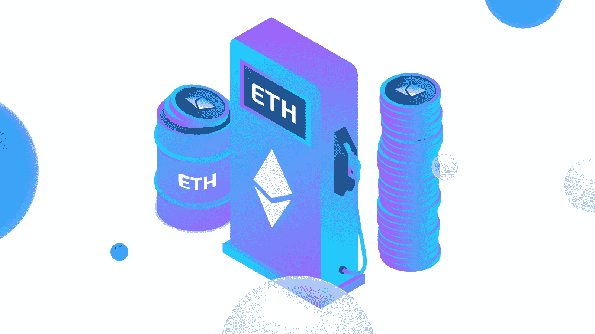
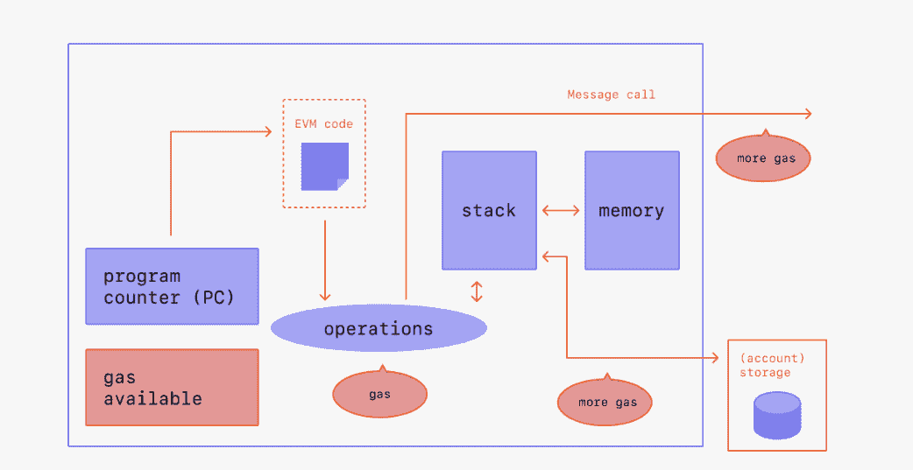
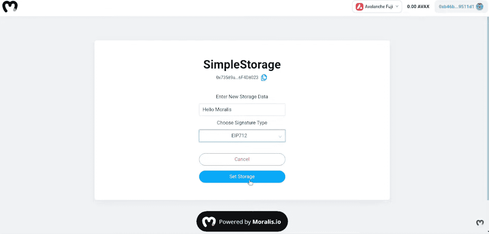
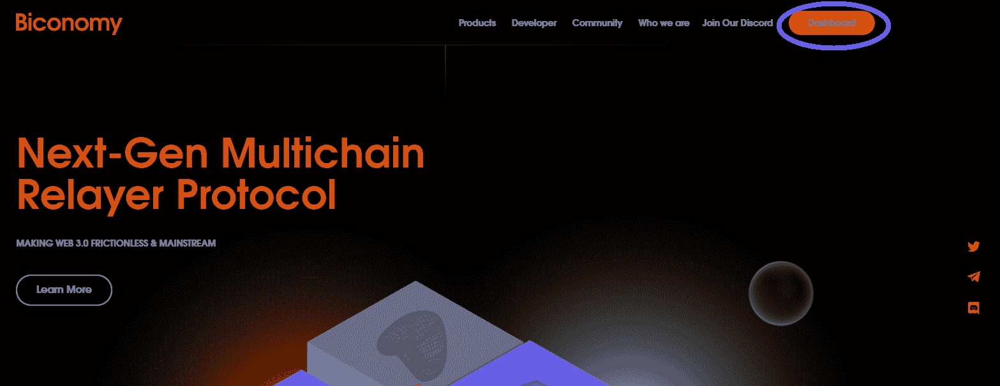

# 如何在以太坊上进行无气交易

> 原文：<https://moralis.io/how-to-do-gasless-transactions-on-ethereum/>

**如果你在过去两年里一直在** [**【以太坊】**](https://moralis.io/full-guide-what-is-ethereum/) **上执行交易，你很可能经历过高昂的油费。除非我们考虑 100 万美元交易的费用，其中高额的天然气费用是合理的，否则有一种更有利可图的方式可用——发送无气 ETH 交易。幸运的是，优秀的工具可以让你在以太坊和其他几个知名的**[**【EVM】**](https://moralis.io/evm-explained-what-is-ethereum-virtual-machine/)**】兼容的区块链上进行无汽油交易。事实上，作为本文所涵盖的示例项目的一部分，我们将使用名为“Fuji”的雪崩测试网来完成这项工作。然而，在以太坊链上开发时，您可以应用相同的原则。**

接下来，你将学习如何使用[Moralis](https://moralis.io/)ultimate[web 3](https://moralis.io/the-ultimate-guide-to-web3-what-is-web3/)开发平台在以太坊和 Avalanche 的 testnet 上进行无气体交易。此外，我们将使用“双经济”，这将是在我们的示例 dApp ( [分散式应用](https://moralis.io/decentralized-applications-explained-what-are-dapps/))中启用“发送无气以太网交易”功能的关键。如果你想从这篇文章中得到最大的收获，我们邀请你跟随我们的脚步，参与下面的示例项目。除了最终拥有自己的 dApp，在以太坊、 [Avalanche](https://moralis.io/how-to-build-avalanche-dapps-in-minutes/) 、[币安智能链](https://moralis.io/bsc-programming-guide-intro-to-binance-smart-chain-development-in-10-minutes/) (BSC)或 [Polygon](https://moralis.io/how-to-build-polygon-dapps-easily/) 上提供无汽油交易，您还将了解到其他细节，使您能够使用 Moralis 完成其他 Web3 开发任务。

因此，把这当成一张免费的入场券，让你更接近全职加密。你也可以通过报名参加[道德学院](https://academy.moralis.io/)的一些高质量课程来采取更专业的方法。

### 以太坊上的气体是什么？

在我们继续我们的示例项目之前，它将教你以太坊上的无气体交易，我们需要确保你理解基础知识。所以，除非你能回答“以太坊上的气体是什么？”如果有信心，请确保在继续下一步之前完成这一部分。

遵循“气体”一词的常见含义，以太坊上的气体也为某些东西提供燃料。具体来说，[智能合约](https://moralis.io/smart-contracts-explained-what-are-smart-contracts/)确切来说就是交易。以太坊是领先的可编程区块链，也是第一个具有该功能的。这使得开发人员能够在其基础上部署 dApps 和其他令牌。本质上，你需要汽油来支付所有的交易费用。因此，gas 是在以太坊上执行特定操作所需的计算工作的单位。此外，以太坊上的每个事务都需要计算资源来执行(以太坊仍在使用工作证明概念)。这意味着每笔交易都有相关费用。

交易费，或汽油，必须总是在本地硬币；在以太坊的情况下，这意味着需要 ETH 来完成交易。此外，由于费用是 eth 的一部分，所以它们被称为“Gwei”(也称为“纳米 ETH”)。另一方面，其他 EVM 兼容的连锁店使用股权证明的概念，这使得交易费用低得多。其中一个链是 Avalanche，这也是我们决定在它的 testnet 上开发我们的示例项目的原因。

此外，虽然这可能是显而易见的，但让我们也指出，“无气”意味着用户自己不支付交易费用。然而，由于费用是必不可少的，不支付费用就不能完成任何交易，开发商或 dApp 的所有者需要支付费用。

## 在以太坊上提供无汽油交易–示例项目

如上所述，现在是我们接手一个示例项目的时候了，在这个项目中，您将学习如何在以太坊和其他 EVM 兼容的连锁店上进行无气交易。此外，我们的项目将存在于雪崩富士测试网。首先，我们将预览我们将要构建的 dApp，它将使用户能够发送无气 ETH 事务。一旦你对我们任务的最终目标有了清晰的理解，我们将帮助你适当地设置事情。这包括创建您的道德服务器和双经济账户。然后，我们将把您交给 Moralis 的一位专家，他将带您浏览代码，并为您提供自己完成这个示例项目所需的指导。

### 发送无气以太网交易–dApp 预览示例

我们为这个项目创建的 dApp 非常简单；然而，它服务于目的，这意味着用户可以在 Avalanche 上发送无气交易。当然，同样的原理可以应用于以太坊上的一个测试网(参见我们的[以太坊测试网指南](https://moralis.io/ethereum-testnet-guide-connect-to-ethereum-testnets/))，以太坊的主网，或者任何其他 EVM 兼容的主网。

我们的示例 dApp 是一个简单的 storage Web3 应用程序，这意味着用户可以通过单击“编辑存储”按钮来存储字符串(见下图)。此外，由于我们是在区块链上，存储该字符串意味着执行一个事务，在我们的例子中，对用户来说是零费用的。

看上面的图片，你可以看到我们的例子 dApp 可以在不同的区块链之间切换(在我们的例子中是 testnets)。此外，它还为连接的用户显示本机令牌余额，并为连接的用户提供编辑存储的机会。

### 演示如何发送无气以太网交易

为了证明我们的示例 dApp 不向用户收取交易费用，让我们完成一个演示交易。具体来说，我们将使用包含零个 AVAX 令牌(Avalanche 上的本机令牌)的钱包来实现这一点。为此，我们单击“编辑存储”按钮。这使我们能够输入新的存储数据(在我们的例子中是一个字符串):

我们已经输入“Hello Moralis”作为新的存储数据。接下来，我们选择 EIP-712 签名选项(我们将在后面解释)，然后单击“设置存储”按钮。这提示[元掩码](https://moralis.io/metamask-explained-what-is-metamask/)进行确认:

这就完成了交易，而不需要用户支付汽油费。这是在双经济的帮助下实现的(见上图右上角)。这使得开发商能够进行设置，以便开发商或 dApp 所有者可以自动支付天然气费用。接下来，在以太坊或 Avalanche 上完成无气交易(在我们的例子中)后，我们得到新的存储状态:

## 在以太坊和其他 EVM 兼容的连锁店提供无汽油交易–初始设置

如前所述，我们将指导您完成初始设置，这包括几个步骤。首先，为了获得完整的后端功能，你需要创建免费的 Moralis 帐户。这使您能够创建您的 Moralis 服务器并访问 [Moralis 的 SDK](https://moralis.io/exploring-moralis-sdk-the-ultimate-web3-sdk/) ，包括 [Moralis Speedy Nodes](https://moralis.io/speedy-nodes/) 。此外，结合 Moralis，你还可以使用最终的 [Web3 样板](https://moralis.io/web3-boilerplate-beginners-guide-to-web3/)，它为你提供了许多在上面预览部分看到的组件。如果您想自己调整[以太坊样板](https://github.com/ethereum-boilerplate/ethereum-boilerplate)，可以随意克隆它的 GitHub 地址。然而，您可以通过使用我们的示例项目的[完成代码](https://github.com/YosephKS/moralis-biconomy-metatransactions)来获得额外的快捷方式，它也在 GitHub 上等着您(有关说明，请观看本文末尾 6:07 的视频)。

此外，如前所述，你还需要建立你的双经济账户。这将允许您在以太坊和其他 EVM 兼容的区块链上提供无汽油交易。幸运的是，这是一个简单的过程。尽管如此，您还需要一个代码编辑器(我们使用 Visual Studio Code [VSC])，您需要在其中安装包管理器(yarn 或 npm)和 [Truffle](https://moralis.io/truffle-explained-what-is-the-truffle-suite/) 的所有依赖项。

设置好之后，您将能够完成编码，获得您自己的上述 dApp 版本。更重要的是，这将使您的用户能够在以太坊、雪崩、多边形和 BSC 上完成无气交易。

### 创建 Moralis 服务器

创建 Moralis 服务器需要遵循以下步骤:

1.  [**创建您的道德家账户**](https://admin.moralis.io/register)——如果您还没有道德家账户，现在就创建一个。只需点击链接，输入您的电子邮件地址，并创建您的密码。不要忘记点击确认链接来确认您的电子邮件地址(您将收到一封电子邮件)。然而，如果你已经有一个有效的道德账户，只需[登录](https://admin.moralis.io/login)。

2.  [**创建一个 Moralis 服务器**](https://docs.moralis.io/moralis-server/getting-started/create-a-moralis-server)——只要你登录到你的 Moralis 账户，你就可以进入你的管理区。确保选择“服务器”选项卡。然后，点击右上角的“+创建新服务器”按钮(如下所示)。接下来，您需要从下拉菜单中选择最适合您需求的网络类型。*我们建议在处理示例项目时从“Testnet 服务器”选项开始。*

然后，您将看到一个弹出窗口，询问您服务器的详细信息。因此，输入您的服务器名称(可以是您想要的任何名称)，选择区域、网络、链，然后单击“添加实例”:

3.  **访问服务器详细信息**–您的服务器可能需要几分钟准备就绪。然而，一旦它启动并运行，您可以通过点击您的服务器名称旁边的“查看详细信息”来获得它的详细信息。您需要复制其中的一些细节(服务器 URL 和应用程序 ID)并将它们粘贴到您的代码文件中。这将让你获得 Moralis 的后端功能(见下图)。

4.  **初始化道德规范**–要初始化道德规范，您需要填充您的”。js“，”。html "，或"。env "(在使用[以太坊样板文件](https://moralis.io/ethereum-dapp-boilerplate-full-ethereum-react-boilerplate-tutorial/)的情况下)文件和 Moralis 服务器详细信息:

*注意* *:不要使用上图中的细节。相反，请确保使用您的特定服务器的详细信息。*

### 访问道德的快速节点

正如您将在下面的视频中看到的，您可以使用 Moralis Speedy Nodes 来部署智能合同。要使用这个功能，你需要在你的 Moralis 管理区选择“快速节点”标签。在那里，您可以点击所有支持链的“端点”。在我们的案例中，我们决定使用 Avalanche。因此，单击雪崩网络选项上的“端点”按钮:

单击雪崩网络的“端点”按钮后(其他链也是如此)，您将看到以下弹出窗口:

在那里，你只需点击你正在使用的网络旁边的“添加到元掩码”按钮。对于我们的例子，我们决定使用富士(雪崩测试网)。在我们示例项目的一些代码文件中，您需要使用地址中突出显示的部分:

### 建立生态学

如前所述，Biconomy 是一家值得信赖的货代公司，它将成为在以太坊和其他 EVM 兼容连锁店上为我们的用户提供无汽油交易的关键。因此，您需要创建您的双经济账户。因此，请访问 biconomy.io 并点击“仪表板”:

这将为您提供一个创建帐户的选项。只需输入您的详细信息，然后单击注册按钮:

一旦进入你的仪表板，你就可以设置你的“前进”。在这种情况下，您还需要确保有足够数量的本机令牌来支付所有用户的交易费用。

*注意* *:观看下一部分的视频，该视频将指导您正确设置“转发”(26:45)并获取您将添加到代码中的详细信息。请记住，此部分对于发送无气以太网交易至关重要。*

## 在以太坊和其他 EVM 兼容的连锁店进行无汽油交易–代码演练

一切设置妥当后，您就可以仔细查看发送 gasless ETH 事务所需的代码了。为此，请务必查看下面的视频，从 12:14 开始，Moralis 专家将首先向您展示用于在以太坊上进行无气交易的智能合约的细节。

*注意* *:万一你还没有克隆出最终代码，一定要看完 6:07 的视频，先完成那一步。*

通过观看视频，您还将了解如何使用逻辑文件部署智能合约的详细信息(21:35 的视频)。而且在 23:48 还可以看到如何使用“ShowTrace”，相当于 Etherscan 或者 [BscScan](https://moralis.io/exploring-bscscan-full-guide/) 进行雪崩。如果您还没有设置 Biconomy，请确保现在就设置(26:34 的视频)。接下来，从 30:05 开始，您将讨论代码的其余细节(“BiconomyProvider.js”、“index.js”、“App.js”、“index.jsx”和其他文件)，包括 Moralis 集成。此外，您将从 42:15 开始了解签名类型的详细信息(“个人”和“EIP-712”)。最后，您将看到示例 dApp 的运行情况(47:38 的视频)。

https://www.youtube.com/watch?v=r04x1YqnYLk

## 如何在以太坊进行无汽油交易——总结

如果您已经完成了设置，并按照上面视频提供的说明进行了操作，那么您现在就有了自己的 dApp，可以在以太坊、Avalanche、BSC 和 Polygon 上提供无气体交易。通过结合使用强大的工具，即 Moralis、Biconomy、Truffle 和 MetaMask，您可以为用户提供发送无气 ETH 事务的选项。此外，虽然您(作为一名开发人员或 dApp 的所有者)仍然需要支付交易费用，但是用户体验变得更加愉快。因此，在其他类型的 dApps 中实现这种功能肯定会在用户中给你加分。

此外，我们需要指出的是，这个项目不像我们的其他一些教程那样基础。因此，如果你发现它对你目前的水平来说太高级了，一定要学习如何建立你的第一个 dApp。然而，如果你已经准备好迎接更有趣的挑战，拓展你的区块链开发技能，一定要看看[道德博客](https://moralis.io/blog/)和[道德 YouTube 频道](https://www.youtube.com/c/MoralisWeb3)。我们的一些最新文章将向您展示如何[构建一个跨链桥](https://moralis.io/how-to-build-a-cross-chain-bridge/)，如何[构建一个预测市场 dApp](https://moralis.io/how-to-build-a-prediction-market-dapp/) ，如何[创建一个 DAO](https://moralis.io/how-to-create-a-dao-in-10-minutes/) ，如何[启动带有元掩码的 Web3 应用](https://moralis.io/metamask-for-developers-how-to-launch-web3-apps-with-metamask/)，如何[创建免费令牌](https://moralis.io/create-free-token-how-to-deploy-your-own-testnet-crypto-token-in-10-mins/)，如何[用短信获取 Web3 事件](https://moralis.io/get-web3-events-with-sms-messages/)，如何[在币安智能链上创建 NFT](https://moralis.io/create-nft-on-binance-smart-chain-full-guide/)，如何

