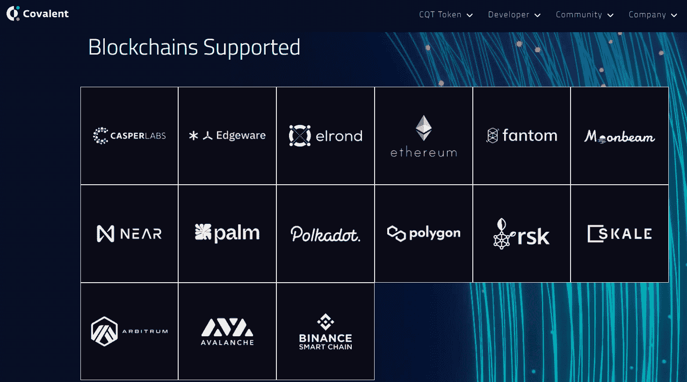
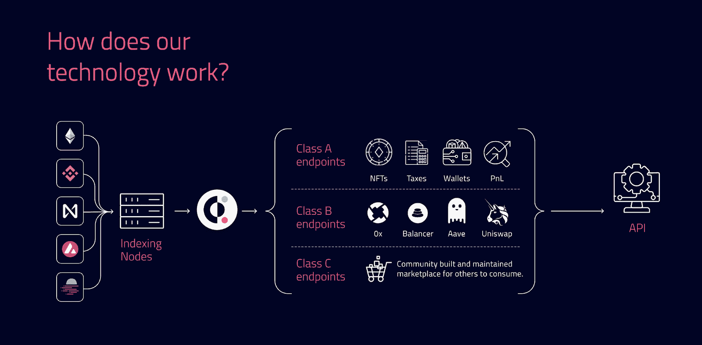
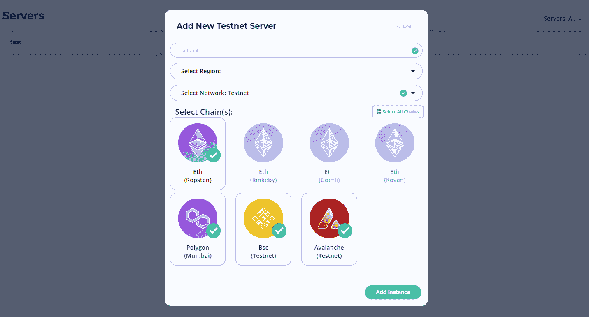
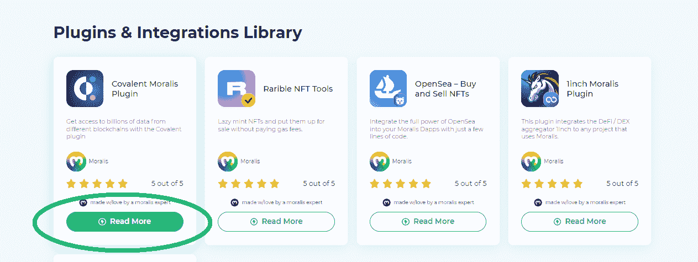
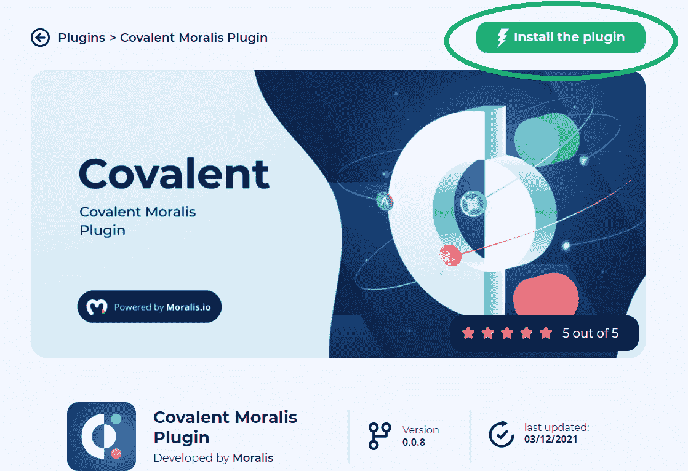
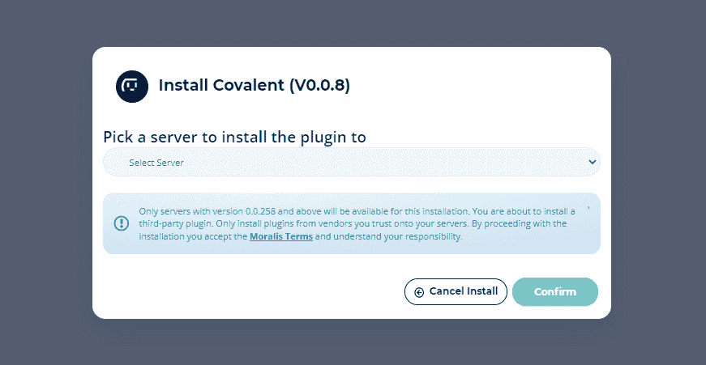
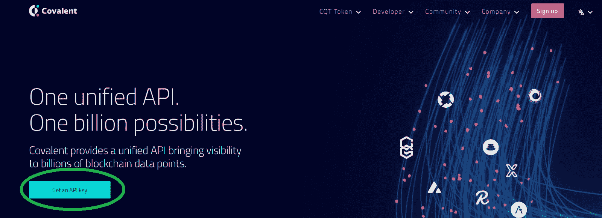
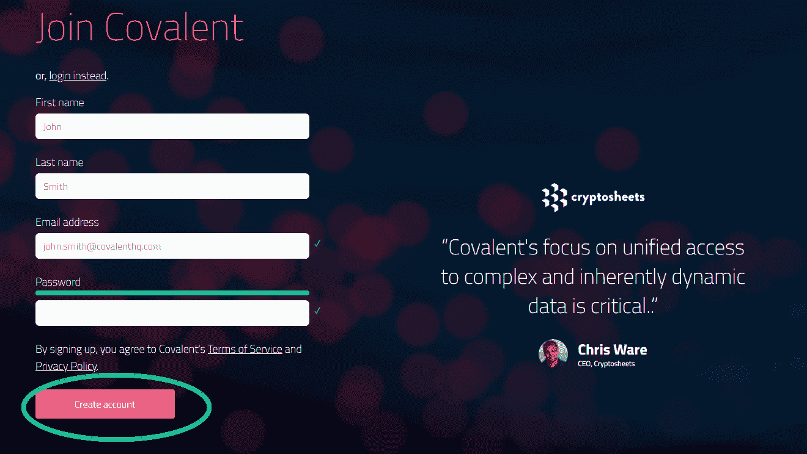
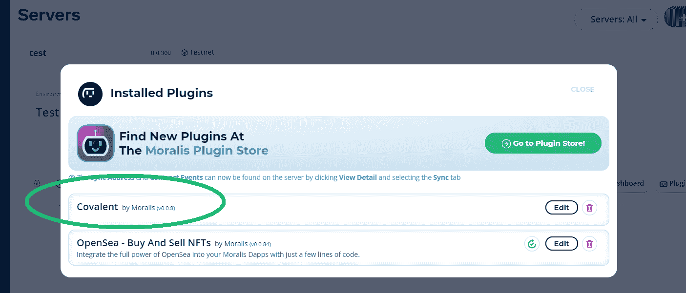

# 如何用共价 API 构建

> 原文：<https://moralis.io/how-to-build-with-the-covalent-api/>

**即使以太坊仍然是部署**[**【dApps】**](https://moralis.io/decentralized-applications-explained-what-are-dapps/)**[**NFTs**](https://moralis.io/non-fungible-tokens-explained-what-are-nfts/)**[**智能合约**](https://moralis.io/smart-contracts-explained-what-are-smart-contracts/) **的主导链条，但显然跨链互通是不可避免的，这一点共价已经认可。因此，共价的 API 使区块链开发者能够使用这个大规模聚合器共价收集的来自多个区块链网络的索引数据。此外，Moralis 现在为其用户提供共价 Moralis 插件，使程序员能够在构建 Web3 应用程序时使用共价 API。因此，许多想要学习如何使用共价 API 进行构建的开发人员应该密切关注，因为我们将深入探讨共价、道德、插件以及这些元素如何结合才能让您的工作经得起未来考验的主题。******

****此外， [Moralis](https://moralis.io/) ，被称为“ [Firebase for crypto](https://moralis.io/firebase-for-crypto-the-best-blockchain-firebase-alternative/) ”，是另一个在其 DNA 中具有跨链互操作性的优秀工具。这个终极的 [Web3](https://moralis.io/the-ultimate-guide-to-web3-what-is-web3/) 开发平台支持大多数主要的知名连锁店。此外， [Moralis 的 SDK](https://moralis.io/exploring-moralis-sdk-the-ultimate-web3-sdk/) 提供了你所需要的一切，用简短的代码片段完全覆盖区块链相关的后端需求。因此，每一个精通 JavaScript 的程序员都可以在几分钟内创建令人难以置信的多链 Web3 应用程序。****

****此外，由于共价 Moralis 插件，开发人员现在可以充分利用这两个跨链的可操作工具。此外，本文将向您展示如何快速、轻松地构建共价 API。接下来，你将学习如何安装[共价道德插件](https://moralis.io/plugins/covalent/)来开始。然后，我们还将了解一些特定的端点。然而，由于你们中的一些人可能第一次听说过共价，我们将从回答“什么是共价”这个问题开始在展示如何用共价 API 构建之前。****

### ****什么是共价？****

****不，我们不是在讨论共价键，所以不用担心；不会有化学讲座。相反，共价是一个优秀的加密项目，有一个清晰的愿景，区块链的未来将在多个链上。本质上，共价是一个大规模的数据聚合器，它帮助开发者访问区块链的网络数据。它支持许多领先的区块链网络，包括以太坊、Avalanche 和 Polygon(完整列表显示在下图中)。****

****

此外，共价转换成可操作的见解，否则难以访问的数千亿区块链数据点。通过“扫描”各种来源，包括链、智能合同、[节点](https://moralis.io/ethereum-rpc-nodes-what-they-are-and-why-you-shouldnt-use-them/)和多个数据源，共价收集了大量有价值的数据，并将其放在银盘上提供给开发人员。通过一个可访问的 API(共价 API)，开发人员可以访问所有这些索引数据。因此，它使开发者能够更好地监督区块链生态系统，并在其开发过程中更有效地分配资源。此外，由于共价 Moralis 插件，现在比以往任何时候都更容易用共价 API 来构建。



尽管如此，共价已经是许多流行的 DeFi 和 NFT 项目的“幕后”数据基础设施。幸运的是，通过使用 Moralis 及其共价插件，您可以创建自己的加密项目，而无需流汗或掏空口袋，并且您还可以绕过 RPC 节点的所有[限制。也就是说，您已经准备好学习如何使用共价 API 进行构建了。](https://moralis.io/exploring-the-limitations-of-rpc-nodes-and-the-solution-to-them/)

## 如何使用 Moralis 构建共价 API

如果您不熟悉 Moralis，让我们提醒您，它是开发人员为开发人员提供的终极 Web3 开发平台，目标是为区块链技术的采用做出贡献，如果使用得当，它可以让世界变得更加美好。也就是说，在开始使用共价 API 构建之前，您需要完成一些设置。我们将在下面的小节中介绍具体的步骤。


### 创建一个道德服务器

为了使用道德来构建共价 API，你需要安装共价道德插件；然而，要做到这一点，您必须首先创建您的 Moralis 服务器。下面是如何做的:

1.  [**创建您的道德家账户**](https://admin.moralis.io/register)——如果您还没有创建您的免费道德家账户，请务必现在就创建。只需点击上面的链接。然后，输入您的电子邮件地址，并创建您的密码(记得通过单击将发送到您的电子邮件地址的确认链接来确认您的电子邮件地址)。*如果您已经有了一个活跃的 Moralis 账户，* [*登录*](https://admin.moralis.io/login) *。*T12
    T14*T16】*
2.  [**创建一个 Moralis 服务器**](https://docs.moralis.io/moralis-server/getting-started/create-a-moralis-server)——一旦登录，你将进入你的 Moralis 管理区。单击“服务器”选项卡，然后单击右上角的“+创建新服务器”按钮(见下图)。接下来，您将选择网络类型(mainnet 或 testnet)。当处理示例项目时，我们建议选择“testnet 服务器”选项(参见我们的[以太坊 Testnet 指南](https://moralis.io/ethereum-testnet-guide-connect-to-ethereum-testnets/))。然而，一旦你准备好让全功能的 dApps 上线，你会想要选择“Mainnet 服务器”选项。


将出现一个弹出窗口，提示您输入服务器名称(可以是您想要的任何名称)，选择区域、网络类型和链。要启动服务器，请单击“添加实例”:



注意 *:创建好你的服务器后，你就可以安装共价 Moralis 插件了。然而，由于您很可能希望使用共价 API 进行构建，我们建议完成以下两个步骤来获得完整的 Moralis 功能。*

### 访问 Moralis 的 SDK 功能

创建好 Moralis 服务器后，您就可以通过将它与您的代码连接来使用 Moralis 的全部功能了。幸运的是，要做到这一点只需要两个简单的步骤:

1.  **访问服务器详情**–要访问您的服务器详情，请点击您的服务器名称旁边的“查看详情”。


接下来，将出现一个包含您需要的所有信息的弹出窗口:


2.  **初始化道德规范**–现在，填充您的”。js“，”。html”(如果您是从零开始)，或者。env”文件(如果您使用的是最终的 [Web3 样板文件](https://moralis.io/web3-boilerplate-beginners-guide-to-web3/))和 Moralis 服务器详细信息(应用程序 ID 和服务器 URL)来获得所需的由 Moralis 覆盖的后端功能。此外，在代码编辑器中这样做(我们通常使用 Visual Studio 代码):


*注意* *:确保您使用的是您特定服务器的详细信息，而不是上图中的***。**

## *如何使用共价 Moralis 插件构建共价 API*

*到目前为止，您已经知道了能够以最简单的方式构建共价 API 的关键是使用 Moralis。然而，为了给你的特定服务器“共价 API 访问”，你需要安装共价 Moralis 插件。此外，由于您已经创建了您的服务器(这是安装插件的先决条件)，添加插件将会很容易。只需按照以下步骤完成这部分设置过程。*

**   首先，点击 Moralis 服务器上的“插件”按钮。在接下来的步骤中，点击“转到插件商店！”按钮:*

*

2.  要安装共价道德插件，请点击“阅读更多”按钮选择该插件:



3.  现在，你终于可以选择安装选中的插件了。只需点击右上角的“安装插件”按钮:



4.  点击“安装插件”按钮后，您将被重定向到您的道德管理区，以完成插件的安装过程。这是您将看到的窗口:



5.  从下拉菜单中，选择您在上一小节中创建的服务器。然后，点击“确认”。因此，这是您应该看到的内容:


6.  如您所见，您需要获得一个共价 API 密钥。好在共价的官网上有这个。登录网站后，点击“获取 API 密钥”:



7.  输入您的信息，然后点击“创建帐户”按钮:



8.  单击确认电子邮件中的链接，并命名您的组织。然后你就能得到一个共价 API。复制粘贴到指定区域(第五步)。然后点击“安装”按钮。

成功完成安装后，您应该能够看到服务器插件中列出的共价插件(如下所示):



## 用共价 API 构建——探索端点

此时，您应该已经正确地设置好了一切，这意味着您已经准备好使用共价 API 进行构建了。我们在 [GitHub](https://github.com/MoralisWeb3/plugindocs/tree/main/covalent%20plugin) 以及共价道德插件的页面上提供了使用该功能的详细说明，包括端点。因此，一定要探究其中的细节。然而，为了让事情变得更简单，这里有一些端点:

*   **获取块**–使用链 ID 和块高度返回块。

```
interface GetBlockDto {
  chainId: number;
  blockHeight: string;
}

await Moralis.Plugins.covalent.getBlock(GetBlockDto);
```

*   **所有合同元数据**–使用链 ID，返回区块链上所有合同及其元数据的列表。

```
interface GetAllContractMetaDto {
  chainId: number;
  pageNumber?: number;
  pageSize?: number;
}

await Moralis.Plugins.covalent.getAllContractMetadata(GetAllContractMetaDto);
```

*   **获取区块高度**–使用链 ID、开始日期和结束日期，返回一个日期范围内特定链的所有区块高度。

```
interface GetBlockHeightsDto {
  chainId: number;
  blockHeight: string;
  startDate: string;
  endDate: string;
  pageNumber?: number;
  pageSize?: number;
}

await Moralis.Plugins.covalent.getBlockHeights(GetBlockHeightsDto);
```

*   **返回链**–返回所有链的列表。

```
interface GetChainsDto {}

await Moralis.Plugins.covalent.getChains(GetChainsDto);
```

*   **链状态**–返回所有链状态的列表。

```
interface GetChainStatusesDto {}

await Moralis.Plugins.covalent.getChainsStatuses(GetChainStatusesDto);
```

#### 令牌交易端点

*   **获取令牌持有者的变化**–使用链 ID 和钱包地址返回令牌持有者及其当前/历史余额的分页列表。

```
interface GetChangesInTokenHoldersDto {
  chainId: number;
  address: Address;
  startingBlock: string;
  endingBlock: string;
  pageNumber?: number;
  pageSize?: number;
  quoteCurrency?: string;
}

await Moralis.Plugins.covalent.getChangesInTokenHolerBetweenBlockHeights(GetChangesinTokenHoldersDto);
```

*   **地址**的 ERC-20 令牌交易–使用链 ID、用户地址和交易散列返回所有 ERC-20 令牌合约传输。

```
interface GetErc20TokenTransactionsForAddressDto {
  chainId: number;
  address: Address;
  tokenAddress: Address;
  quoteCurrency?: string;
  pageNumber?: number;
  pageSize?: number;
}

await Moralis.Plugins.covalent.getErc20TokenTransfersForAddress(GetErc20TokenTransactionsForAddressDto);
```

*   **一段时间内的历史投资组合价值**–使用链 ID 和钱包地址以 24 小时间隔时间戳返回过去 30 天的钱包价值。

```
interface GetHistoricalPortfolioValueOverTimeDto {
  chainId: number;
  address: Address;
  quoteCurrency?: string;
}

await Moralis.Plugins.covalent.getHistoricalPortfolioValueOverTime(GetHistoricalPortfolioValueOverTimeDto);
```

*   **通过约定地址获取日志事件**–使用链 ID 和约定地址，返回由特定智能约定发出的已解码日志事件的分页列表。

```
interface GetLogEventsByContractAddressDto {
  chainId: number;
  contractAddress: Address;
  startingBlock: string;
  endingBlock: string;
  pageNumber?: number;
  pageSize?: number;
}

await Moralis.Plugins.covalent.getLogEventsByContractAddress(GetLogEventsByContractAddressDto);
```

*   **按主题接收日志事件**–使用链 ID 和主题，返回已解码日志事件的分页列表。

```
interface GetLogEventsByTopicDto {
  chainId: number;
  topic: Topic;
  endBlock: string;
  secondaryTopic?: Topic;
  startBlock?: string;
  address?: Address;
  pageNumber?: number;
  pageSize?: number;
}

await Moralis.Plugins.covalent.getTokenHoldersByTopic(GetLogEventsByTopicDto);
```

#### 可替换和不可替换令牌端点

*   **合同**的 NFT 令牌 ID–使用链 ID 和合同地址返回区块链上 NFT 合同的所有令牌 ID 的列表。

```
interface GetNFTTokenIDsForContractDto {
  chainId: number;
  contractAddress: Address;
  pageNumber?: number;
  pageSize?: number;
}

await Moralis.Plugins.covalent.getNftTokenIdForContract(GetNFTTokenIDsForContractDto);
```

*   **获取合同**的 NFT 交易–使用链 ID、合同地址和令牌 ID，返回交易列表。

```
interface GetNFTTransactionsForContractDto {
  chainId: number;
  contractAddress: Address;
  tokenId: string;
  pageNumber?: number;
  pageSize?: number;
}

await Moralis.Plugins.covalent.getNftTransactionsForContract(GetNFTTransactionsForContractDto);
```

*   **契约**的 NFT 外部元数据–使用链 ID、契约地址和令牌 ID 获取并返回外部元数据。*它同时支持*[*【ERC】721*](https://moralis.io/erc-721-token-standard-how-to-transfer-erc721-tokens/)*和*[*【ERC】1155*](https://moralis.io/erc1155-exploring-the-erc-1155-token-standard/)*标准。*

```
interface GetNFTExternalMetaForContractDto {
  chainId: number;
  contractAddress: Address;
  tokenId: string;
}

await Moralis.Plugins.covalent.getNftExternalMetadataForContract(GetNFTExternalMetaForContractDto);
```

*   **获取地址**的代币余额–使用链 ID 和钱包地址返回当前代币余额及其现货价格。

```
interface GetTokenBalancesForAddressDto {
  chainId: number;
  address: Address;
  quoteCurrency?: string;
}

await Moralis.Plugins.covalent.getTokenBalancesForAddress(GetTokenBalancesForAddressDto);
```

*   **获取任意街区高度的令牌持有者**–使用链 ID 和钱包地址返回令牌持有者的分页列表。如果省略块高度，则使用最新的块。

```
interface GetBlockTokenHoldersDto {
  chainId: number;
  contractAddress: Address;
  blockHeight: string;
  pageNumber?: number;
  pageSize?: number;
  quoteCurrency?: string;
}

await Moralis.Plugins.covalent.getBlockTokenHolders(GetBlockTokenHoldersDto);
```

#### 更多事务端点

*   **获取事务**–使用链 ID 和事务散列返回事务数据及其解码的事件日志。

```
interface GetTransactionDto {
  chainId: number;
  transactionHash: TransactionHash;
}

await Moralis.Plugins.covalent.getTransaction(GetTransactionDto);
```

*   **获取地址**的交易–使用链 ID 和钱包地址返回所有交易及其解码的日志事件。

```
interface GetTransactionsForAddressDto {
  chainId: number;
  address: Address;
  quoteCurrency?: string;
  pageNumber?: number;
  pageSize?: number;
}

await Moralis.Plugins.covalent.getTransactionsForAddress(GetTransactionsForAddressDto);
```

## 构建共价 API 的时间到了

要使用共价 API 进行构建，您只需将上述任何端点复制并粘贴到您的代码中。当然，您需要首先完成本文中给出的所有设置步骤。此外，您还需要在代码中使用“ *Moralis.initPlugins()* ”来确保上面安装的插件被启动。

为了更好地理解手头的主题，我们建议从 3:48 开始观看下面的视频，其中 Moralis 专家将指导您完成设置。此外，他还将向您展示上述几个端点的运行情况。

https://www.youtube.com/watch?v=EdNH2A8TsUA

## 如何使用共价 API 构建——总结

在这一点上，你应该知道，共价是一个大规模的数据聚合器，通过使用共价 API，你可以访问各种链上的数据。此外，您还应该知道如何使用共价 API 进行构建。此外，您已经了解到，通过将 Moralis 的 SDK 与共价 Moralis 插件结合使用，您可以构建各种 dApps，还可以访问共价提供的所有数据。现在，这非常强大，因为它使您能够通过简单地复制和粘贴代码片段来开发跨链 dApps。

如果你需要一些额外的免费加密教育，一定要访问[道德的 YouTube 频道](https://www.youtube.com/c/MoralisWeb3)和[道德的博客](https://moralis.io/blog/)。在这两个网站上，您还可以找到无数的示例项目，这是获得一些想法和掌握 Moralis 提供的简单性的好方法。一些最新的主题向您展示了如何[构建跨链 dApp](https://moralis.io/how-to-build-cross-chain-dapps/)，如何[托管 dApp](https://moralis.io/how-to-host-a-dapp-dapp-hosting-explained/) ，如何[构建去中心化消息应用](https://moralis.io/build-a-decentralized-messaging-app-in-5-steps/)，如何[创建 OpenSea 克隆](https://moralis.io/create-an-opensea-clone-build-an-nft-marketplace-like-opensea/)，如何[在没有汽油费的情况下制作 NFTs](https://moralis.io/how-to-mint-nfts-without-gas-fees/)，以及更多。此外，如果你真的想成为全职加密员，我们鼓励你探索[道德学院](https://academy.moralis.io/)的课程！

*****