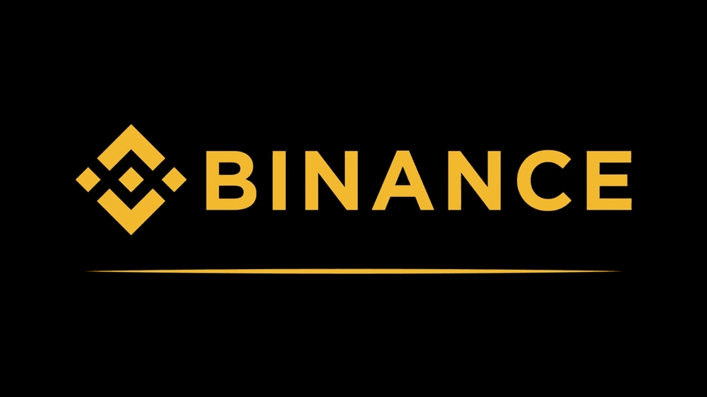
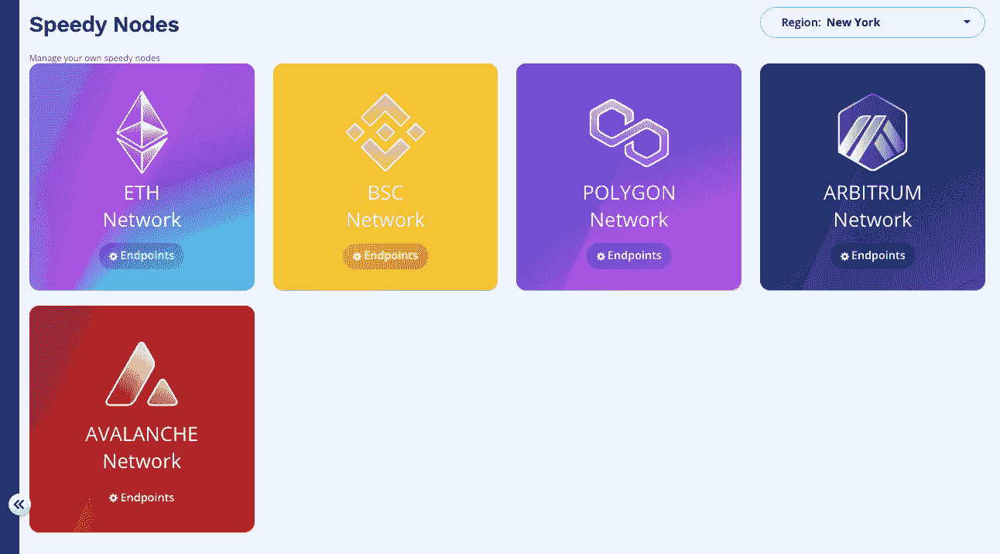
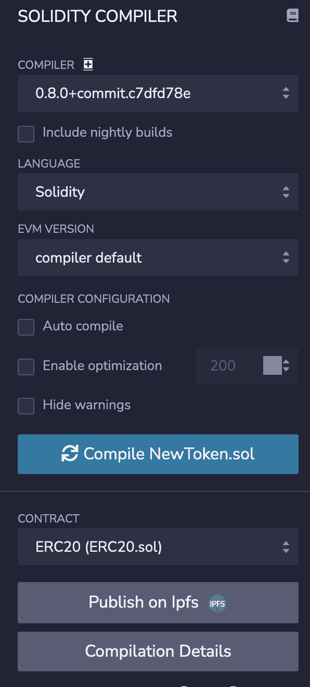
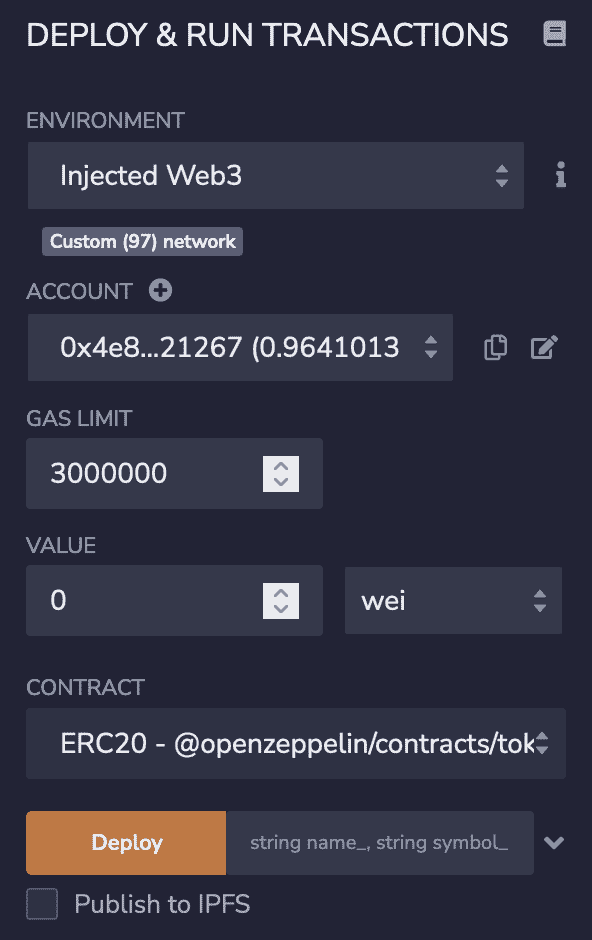
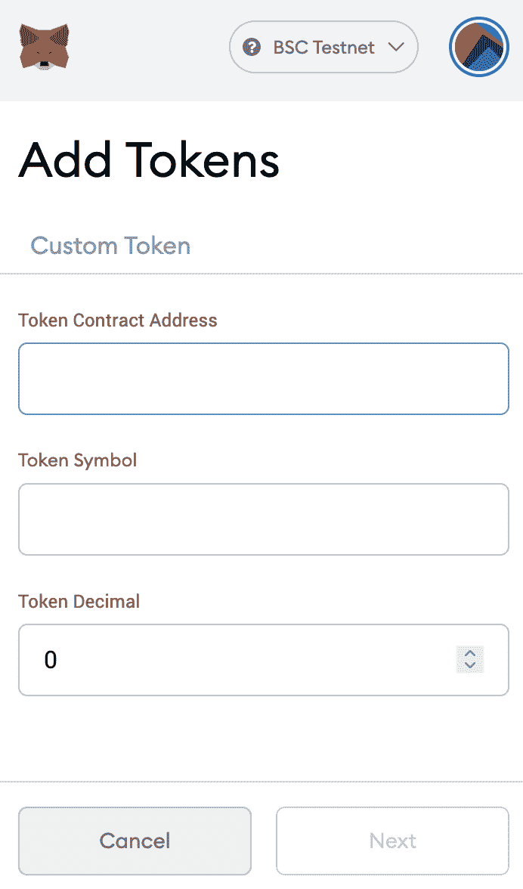

# BEP20 测试网–在 15 分钟内创建一个 BEP20 令牌

> 原文：<https://moralis.io/bep20-testnet-create-a-bep20-token-in-15-mins/>

代币是区块链技术最引人注目的表现形式之一。然而，不同类型的令牌可以有很大的不同——从[**NFT**](https://moralis.io/non-fungible-tokens-explained-what-are-nfts/)**(不可替换的令牌)到 ERC20、BEP20 或 BEP2 令牌等替代令牌。此外，尽管令牌是** [**Web3 开发**](https://moralis.io/how-to-build-decentralized-apps-dapps-quickly-and-easily/) **的动态特性，但它们实际上是相对容易创建的——至少使用适当的工具是如此。然而，这个过程对许多人来说仍然是一个谜，因此，我们将花时间深入探究创建令牌的过程。更具体地说，我们将在这篇文章中详细介绍如何在**[**Moralis**](https://moralis.io/)**的帮助下，在 15 分钟内在 BEP20 testnet 上创建 BEP20 令牌！**

借助 Moralis 及其强大的平台，我们可以在创纪录的时间内为币安智能链的 BEP20 testnet 创建一个 BEP20 令牌。此外，我们将在本指南中使用的 Moralis 的一个有价值的工具是 [Moralis Speedy Nodes](https://moralis.io/speedy-nodes/) 。这项服务为所有用户提供了市场上最快、最可靠的节点。此外，由于我们将在创建 BEP20 令牌并在 BSC BEP20 testnet 上启动它时使用 Moralis，您需要做的第一件事是[向 Moralis](https://admin.moralis.io/register) 注册。只需要几秒钟，加入是完全免费的！

此外，之前使用过 [Solidity](https://moralis.io/solidity-explained-what-is-solidity/) 、Remix 和 MetaMask 的经验将对本教程有所帮助。然而，当我们带您一步一步地完成创建 BEP20 令牌的完整过程时，这种体验并不是必须的。

# 如何在 BEP20 测试网上创建 BEP20 令牌

使用 Moralis 时，在 BEP20 testnet 上创建 BEP20 令牌是一个简单的过程。此外，作为一个平台用户，您甚至不需要成为一名开发人员来跟随并创建您自己的 BEP20 令牌，并且您将能够在大约 15 分钟内完成。因此，如果您有兴趣学习如何创建 BEP20 令牌，那么请继续阅读，我们将带您完成整个过程！

然而，在我们创建 BEP20 令牌本身之前，我们首先要让您更好地理解 BSC 和 BEP20 令牌标准。接下来，我们还将为将 BEP20 令牌部署到 BSC 的 testnet 做一些必要的准备。这些准备工作如下:

1.  获取 RPC 节点。
2.  将节点添加到元掩码。
3.  获取一些 BNB。

此外，完成这三项准备工作只需要几分钟，一旦完成，我们将立即开始编码 BEP20 令牌契约。此外，一旦我们完成合同，我们还将解释如何在 BSC 上将令牌部署到 BEP20 testnet。此外，如果你有兴趣了解更多关于 BSC 开发的知识，那么 [Moralis 的博客](https://moralis.io/blog/)为如何[创建 BSC 令牌](https://moralis.io/how-to-create-a-bsc-token-in-5-steps/)提供了很好的指导。此外，对于那些想了解 BSC 编程的人来说，可以看看下面这篇来自 Moralis 的文章，它涵盖了 [BSC 编程](https://moralis.io/bsc-programming-guide-intro-to-binance-smart-chain-development-in-10-minutes/)。

如果你更愿意观看令牌创建过程的视频，那么看看下面这个来自 [Moralis 的 YouTube 频道](https://www.youtube.com/channel/UCgWS9Q3P5AxCWyQLT2kQhBw)的视频，在那里我们从头创建了一个 BEP20 令牌:

https://www.youtube.com/watch?v=h4gQD7R1r94&t=3s

然而，让我们从深入了解什么是 BSC 和 BEP20 标准表示什么开始本教程。

### 币安智能链和 BEP20 代币

BSC 是“币安智能链”的缩写，BSC 是币安生态系统的两个组成部分之一。BSC 经常和原来的“币安链”混在一起；然而，它们是两回事。币安链于 2019 年首次推出，该链的首要功能是促进快速高效的交易。由于连锁店只专注于促进快速交易，它缺乏灵活性，这使得它不适合 Web3 的发展。



由于原来的链不适合更复杂的事务，币安通过引入更适合区块链编程的第二个链解决了这个问题。这意味着生态系统随着智能合约的引入而扩大。这意味着这两个链现在彼此平行运行，一个促进交易，另一个允许智能合约开发。

币安的生态系统利用了所谓的“双链”架构。这是一项重要的技术，因为它允许从一个链无缝转移到另一个链。这意味着用户可以方便地将他们的资金分配到需要的地方，使生态系统更加平稳地运行。

您可能以前偶然发现过 ERC20 标准，它是以太坊的可替换令牌标准。该标准用于管理代币，确保代币可以交易、设定初始金额等。

此外，由于 ERC20 是以太坊的标准，BEP20 和 BEP2 是币安生态系统的标准。BEP20 标准管理 BSC 令牌，因为 BEP2 是币安链的本地标准。此外，BEP20 标准与 ERC20 没有明显的不同，这意味着它们非常相似，只有微小的差异。

## 如何创建 BEP20 令牌:入门

现在我们更好地理解了 BSC 以及 BEP20 令牌是什么，我们可以在创建令牌本身之前查看必要的准备工作。因此，我们首先需要一个工作的 RPC 节点，因为我们需要将我们的[元掩码](https://moralis.io/metamask-explained-what-is-metamask/)网络更改为 BSC 的 testnet。遗憾的是，BSC 的 testnet 并不是 MetaMask 的默认网络之一；然而，这正是为什么我们需要道德的快速节点。


此外，在改变元掩码网络的同时，我们还必须为测试网获取一些 BNB，因为我们需要为向网络部署令牌支付费用。然而，当我们将合同部署到 BEP20 测试网时，免费获得 BNB 是可能的。

尽管如此，让我们仔细看看如何利用 Moralis 来获得一个全功能的 BSC testnet 节点！

### 获取 BEP20 测试网节点

因此，首先，我们需要一个节点将元掩码网络更改为 BSC 的 testnet。获取节点的最佳和最有效的方式是使用 Moralis 提供的快速节点服务。这将为您提供一些市场上最快、最可靠的节点，我们可以使用它们将 BEP20 令牌部署到 testnet。

如果你还没有，第一步是注册道德。一旦你有一个帐户，你可以导航到道德管理面板，然后点击“快速节点”标签。单击此选项卡将提供几个不同的选项供您选择，但由于我们正在构建 BEP20 令牌，您将需要选择“BSC 网络”。



要获得节点，您需要单击“端点”按钮，这将为您提供几个 URL。每个 URL 都是一个节点，因为我们要将令牌部署到 testnet，所以您只需继续复制 testnet URL，并保留它以供下一步使用，在下一步中，我们将[连接到 BSC 节点](https://moralis.io/how-to-connect-to-bsc-nodes/)。

### 更改元掩码网络

有了节点信息，下一步是导航到 MetaMask 接口，在这里我们将 BSC 的 BEP20 testnet 添加到我们的帐户。要更改网络，您只需点击界面顶部的“网络”选项卡。这将提供一个带有各种选项的下拉菜单。您会注意到，BSC 的 testnet 在默认情况下不会出现在那里。因此，我们将选择“Custom RPC”选项，因为这将允许我们使用之前获得的节点添加网络。


这将提供一个新窗口，您需要在其中添加以下信息:

*   网络名称:BSC Testnet
*   新的 RPC URL: " *输入道德快速节点 URL* "
*   链条编号:97
*   货币符号:BNB
*   区块浏览器网址:[https://testnet.bscscan.com](https://testnet.bscscan.com/)

填写完所有信息后，您只需点击“保存”，该网络将被添加到您的列表中。现在，剩下的就是确保您再次单击“网络”选项卡并选择“BSC Testnet”。

### 收购 BNB

接下来，我们将获得一些非常简单的 BNB。你所需要做的就是访问以下网站“[https://testnet.binance.org/faucet-smart](https://testnet.binance.org/faucet-smart)”。正如你所看到的，有一个输入框，你需要输入你的地址。要获取您的钱包地址，您可以返回元掩码界面，只需复制地址，您可以在“网络”选项卡下找到该地址。一旦你复制了地址，你需要把它粘贴到水龙头，并按下“给我 BNB”选项。

## 如何创建 BEP20 令牌

现在，随着所有准备工作的完成，我们可以继续前进，仔细看看我们如何实际创建一个 BEP20 令牌并在 BSC 的 testnet 上启动它。创建 BEP20 令牌是一个轻松的过程，它与创建 ERC20 令牌非常相似。出于这个原因，当我们为 BSC 的 BEP20 testnet 创建令牌时，我们可以使用几个在[以太坊开发](https://moralis.io/ultimate-guide-how-to-build-ethereum-dapps/)中使用的工具。

因此，举例来说，我们将使用可靠性来编码我们的合同。此外，我们还将使用 Remix 作为开发环境，并利用来自 [OpenZeppelin](https://openzeppelin.com/) 的模板。但是，我们可以通过创建新合同来开始这一过程。

### 创建合同文件

因此，由于我们在开发令牌契约时将使用 Remix，您首先需要访问 [Remix 网站](https://remix.ethereum.org/#optimize=false&runs=200&evmVersion=null&version=soljson-v0.8.7+commit.e28d00a7.js)。打开 web 应用程序后，您可以在界面左侧看到一个默认工作区。这将有一个已经开发的结构，如“合同”，“脚本”等文件夹。要创建新合同，您只需左键单击合同文件夹，然后选择“新建文件”。您可以随意命名该契约，但最好是与您将要创建的令牌相关的名称。

### OpenZeppelin

使用区块链和分散式系统的优势之一是能够复制粘贴代码。由于大多数软件是开源的，我们可以利用模板形式的已写代码。此外，该代码已经过测试，这意味着一切都按预期工作。


因此，我们将使用 OpenZeppelin 提供的令牌模板。由于 ERC20 和 BEP20 令牌相似，在本例中，我们将使用 ERC20 模板，因为它非常适合我们的令牌。现在，我们已经方便地从 OpenZeppelin 中获取了[模板，代码如下所示:](https://docs.openzeppelin.com/contracts/4.x/erc20)

```
// contracts/GLDToken.sol
// SPDX-License-Identifier: MIT
pragma solidity ^0.8.0;

import "@openzeppelin/contracts/token/ERC20/ERC20.sol";

contract GLDToken is ERC20 {
  constructor(uint256 initialSupply) ERC20("Gold", "GLD") {
    _mint(msg.sender, initialSupply);
  }
}
```

### 为合同编码

我们现在可以继续将代码复制并粘贴到我们的[智能契约](https://moralis.io/smart-contracts-explained-what-are-smart-contracts/)文件中。然而，我们不会让代码保持原样；我们需要做一些小的调整来根据我们的喜好定制代码。

我们代码中的第一个基本行是 pragma 行。这一行指定了我们正在使用的 Solidity 的版本，这在我们以后编译合同时非常重要。按照 pragma 行，我们导入适当的 OpenZeppelin 契约，令牌契约将从该契约继承。

在这之后，我们将契约本身引入到代码中，在模板的情况下，代码被命名为“GLDToken”。但是，我们可以继续将名称更改为我们喜欢的任何名称。在契约名称之后，我们还包含“is ERC20”，它指定我们的契约将从导入的 OpenZeppelin 包继承。

在契约的花括号中，有两个构造函数。对于第一个，我们可以删除“initialSupply”，将括号留空。第二个指定了令牌的名称和货币符号。因此，你可以把“黄金”和“GLD”改成你喜欢的任何名字。

在构造函数后面的花括号中，我们有“_mint()”函数。“msg.sender”意味着令牌将被给予部署契约的地址。沿着这条线，我们也有初始供应量，不幸的是，我们不能简单地在这里写一个数字，因为我们需要考虑小数。您可以删除“initialSupply”并将其替换为，例如，“100 * (10 ** uint256(decimals()))”。这意味着，一旦部署了契约，将铸造 100 个令牌。因此，您可以将“100”改为您想要铸造的代币数量。此外，下面是示例中的代码:

### 合同代码:

```
// contracts/GLDToken.sol
// SPDX-License-Identifier: MIT
pragma solidity ^0.8.0;

import "@openzeppelin/contracts/token/ERC20/ERC20.sol";

contract tokenName is ERC20 {
  constructor() ERC20("tokenName", "currencySymbol") {
    _mint(msg.sender, 100 * (10 ** uint256(decimals())));
  }
}
```

### 编译和部署合同

有了最终确定的代码，我们可以通过编译契约来继续这个过程。由于我们正在使用混音，这个过程变得相对容易。我们需要做的就是导航到 Remix 界面左上方的“Solidity 编译器”标签。

选项卡打开后，剩下的工作就是选择正确的编译器版本，它应该与 pragma 行中指定的版本相匹配。在此之后，您还需要确保选择了有效的文件，然后您可以单击“编译”按钮。



合同编译完成后，我们可以进入导航栏中“Solidity Compiler”下面的下一个选项卡。这是用于部署合同的选项卡，部署非常简单。您需要做的就是确保环境被选择为“Injected Web3 ”,并且元掩码被设置为正确的网络。然后，剩下的工作就是选择合同并单击“部署”按钮。



## 如何创建 BEP20 令牌:查看令牌

既然令牌已经部署到 BSC 的 testnet，我们可以继续将令牌添加到我们的元掩码钱包中。交易完成后，您可以点击钱包中的“活动”标签，这将为您呈现所有最新的活动。在这里，您将找到最新的事务，其中之一将是合同的部署。

然后，您可以单击该交易，这将打开一个更小的窗口，显示有关该事件的各种详细信息。从这里，您可以单击右上角的小箭头，这将带您到 testnet 的“ [BscScan](https://testnet.bscscan.com/) ”网站，在那里提供了更多信息。

从网站上的表格中，您需要复制“交互对象(to)”地址，然后返回元掩码。



回到界面后，您可以单击“Assets”选项卡，然后单击“Add Token”。现在，剩下的就是在第一个字段中输入地址，其他信息会自动填充。然后，您可以点击“下一步”，这将把令牌添加到您的钱包。

就是这样；您现在已经成功创建了一个新令牌，并将其添加到您自己的元掩码钱包中！

## 如何在 BEP20 测试网上创建 BEP20 令牌—摘要

借助 Moralis 的力量，我们能够在不到 15 分钟的时间内为 testnet 创建一个 BEP20 令牌。借助该平台的工具，我们将流程分为五个简单的步骤:

1.  做一些准备。
2.  创建一个混合合同文件。
3.  导入 OpenZeppelin 模板。
4.  编写合同代码。
5.  编译和部署合同。

通过遵循这五个步骤，我们创建了 BEP20 令牌，并轻松快速地将其添加到我们的 MetaMask 钱包中。因此，这展示了道德的力量；但是，这远远不是平台的极限。有了 Moralis，从[创建 DEX](https://moralis.io/how-to-create-a-dex-in-5-steps/) 到[构建 ETH dApps](https://moralis.io/how-to-build-eth-dapps-quickly/) 等等，一切都有可能实现！

此外，该平台提供了额外的有价值的开发工具，如 [Moralis Price API](https://moralis.io/introducing-the-moralis-price-api/) 、 [NFT API](https://moralis.io/announcing-the-moralis-nft-api/) 、对 [IPFS](https://moralis.io/what-is-ipfs-interplanetary-file-system/) 的本地支持等。因此，如果你想开发 dApps 或额外的代币，[马上向 Moralis](https://admin.moralis.io/register) 注册！注册是完全免费的，只需要几秒钟就可以开始 Web3 开发。