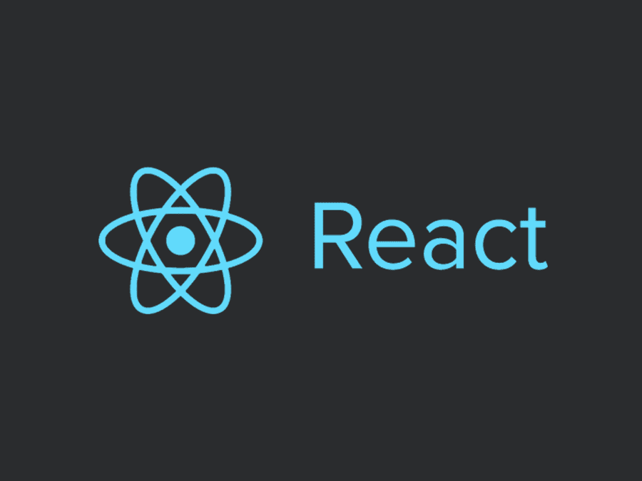
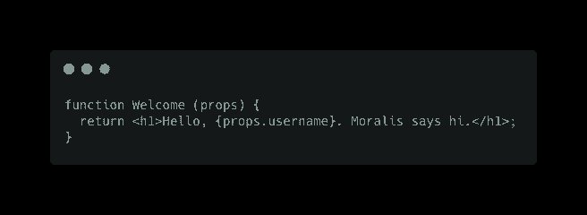
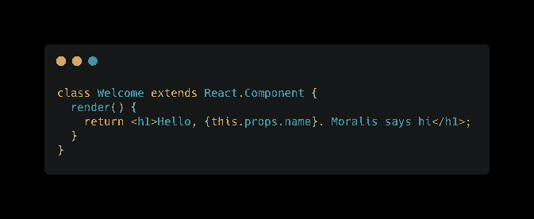
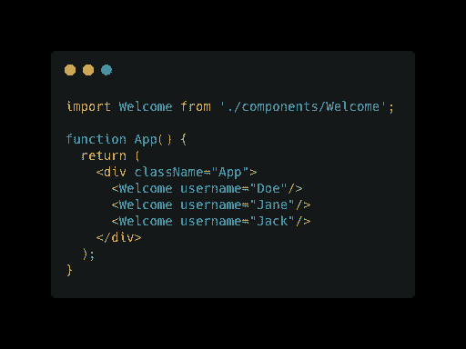

# React 解释——React 是什么？

> 原文：<https://moralis.io/react-explained-what-is-react/>

如果你的目标是开发下一代[**【web 3】**](https://moralis.io/the-ultimate-guide-to-web3-what-is-web3)**应用程序，并希望融入高效的用户界面，那么你可能听说过 React。说到构建用户界面，React 的 JavaScript 库是目前最流行的。然而，如果您刚刚开始您的开发之旅，那么了解什么是 React 及其各种用例将是一个好主意。因此，我们将通过回答诸如“什么是 React？”之类的问题，对 React 进行深入的概述。我们还将展示如何利用**[**Moralis**](http://moralis.io/)**及其强大的 Web3 平台来创建令人印象深刻的 Web3 应用程序。**

## 什么是反应？

那么，什么是反应呢？React(也称为 React.js)是一个开源的声明式 JavaScript UI 库，用于构建交互式用户界面。React 最初是由脸书创建的，它是一个预写 JavaScript 代码的集合，抽象出常规的 UI 过程，帮助开发人员专注于构建高效的 UI。要体验 React 的诸多好处，掌握一些基本的 JavaScript 知识是必要的。但是，您不需要成为 JavaScript 专家，因此无需担心。React.js 还使用一种叫做 JSX 的模板语言，将你的代码编译成普通的 JavaScript 函数。

React.js 是声明性的，这意味着它可以预测地使用我们的代码，并处理所有必要的 JavaScript DOM(文档对象模型)操作，以获得我们想要的结果。这使您能够创建大型、高效的应用程序，尤其是单页面应用程序(SPAs ),无需不必要的页面重载即可呈现数据更改。

为了实现这一点，React 提供了几个特性，使得创建有吸引力的用户界面变得简单而令人兴奋。这些特性使得它成为世界上最受欢迎的 UI 库。

## React.js 的主要特性

现在你可以回答一些基本问题了，比如“什么是反应？”，让我们看看一些重要的反应特性。一些最重要的特征是:

*   可重用组件。
*   单向数据流。
*   JSX。
*   虚拟 DOM。
*   React.js 状态管理。

下面的副标题将解释使用 React.js 构建快速、可伸缩的交互式用户界面的关键特性。因此，让我们深入研究这些特性，进一步扩展我们的 React 知识。

### 什么是可重用组件？

组件是 React.js 的强大功能之一，对 web 开发者很有吸引力。理解组件是回答“什么是反应？”。组件是独立于另一个元素的可重用代码块(因此称为可重用组件)。这意味着您可以将整个 UI 应用程序分成几个部分，每个部分表示为一个组件。

组件就像一个 JavaScript 函数，通过 props 接受数据输入，并执行“render()”函数来显示返回的元素。有两种类型的组件:函数组件和类组件。下面是同一命令在两种类型的组件中的呈现。

粗略地看一下就会发现两者之间的一些细微差别。但是，您一定注意到了类组件中的“render()”方法。class 组件是以前用于数据管理的唯一组件类型。

### 单向数据流

这是 React.js 刚问世时的鲜明特色之一。有了 React，数据以富有表现力的单向方向流动。它展示了一种树形层次结构格式，其中数据从顶层向下传递到子组件。这个特性意味着子组件不能更新数据，从而使您可以更广泛地控制应用程序。

让我们使用上一节中的“Welcome”组件作为例子。下面的代码片段展示了单向流如何使用 props 进行通信。

### JSX

JSX 是代表“JavaScript XML”的缩写。JSX 使您能够在创建 UI 元素时结合 HTML 标记和 JavaScript 函数逻辑。受 XML 语言的启发，它还强制标记的结束。除此之外，它还有标准，比如用“className”代替“class”，用“camelCase”命名函数。

尽管 React 可以在没有 JSX 的情况下运行，但它的使用赋予了这个库一种独特而优雅的风格。JSX 也可以作为开发人员构建 UI 时的视觉辅助工具。

### 虚拟 DOM

React 的强大特性之一是虚拟 DOM。它允许用户运行特定的更改，而无需每次都重新加载站点的 DOM。为了更好地理解这个特性是多么令人印象深刻，让我们看看 JavaScript 如何与 HTML DOM 交互。

HTML DOM 是一种分层的对象结构，它允许 JavaScript 等语言以编程方式操作 DOM 的结构和元素。有了 DOM，JavaScript 可以更新页面上所有的 HTML 和 CSS 元素和属性。每当 JavaScript 访问并更新 DOM 中的元素时，网页就会重新加载以反映 JavaScript 所做的新更改。现在，想象一下，如果您有一个大型应用程序，用户可以在其中进行一些更改，这将对 DOM 造成巨大的压力，导致计算能力使用增加和加载时间延长。

虚拟 DOM 通过创建实际 DOM 的副本来解决这个难题。每当应用程序发出请求时，它都会记录这些更改，并查看虚拟 DOM 中需要更新的特定部分，而无需重新加载整个站点的 DOM。这一过程可以加快加载速度，减少应用程序的资源消耗。

### React.js 状态管理

我们已经讨论了 React 如何使用虚拟 DOM 进行必要的更改。这些跨组件共享的数据更改会导致应用程序的“状态”发生变化。重要的是要知道这些变化可能发生在相关组件的生命周期中。

了解如何存储当前状态和跟踪数据变化对于交互式渲染应用程序至关重要。这就是所谓的“状态管理”，也是使用 React 时需要掌握的最重要的部分。

由于有效状态管理的重要性，开发最佳状态管理库受到了极大的关注。这些库中最流行的是 Redux。它通过创建一个存储各种数据状态的中央存储来工作，并允许组件访问这些更改。除了 Redux，还有反冲和 MobX。

然而，钩子的引入在很大程度上使得开发者有可能放弃这些状态管理库。钩子也使得维护一个状态成为可能，而不需要创建一个类组件。有一个“useState”钩子帮助功能组件管理状态*。*“use effect”钩子允许你执行关键的副作用，比如从 API 获取数据。还有其他的挂钩，如“useReducer”、“useContext”和“use memo”*。当你掌握了原始钩子后，你甚至可以制作定制钩子。*

为了充分利用 React 的强大功能，在开始构建应用程序之前，很好地掌握这些功能是非常重要的。

## React 是用来做什么的？

到目前为止，我们已经了解了什么是 React，以及使 React 在开发 Web2 和 Web3 应用程序中被广泛采用的许多特性。现在是时候看看 React 的一些常见用例了。

### 构建交互式 Web 用户界面

这就是 React 被创建的真正目的；使 web 开发人员能够开发组件，为应用程序面向用户的前端部分提供支持。React 基于 JavaScript 的强大功能，帮助您创建和重用基本的 UI 功能，如搜索栏、按钮、导航面板以及用户与之交互的许多其他 web 应用程序功能。React 的简单性和易用性使其成为最受欢迎的前端库，为世界上一些最大的网站提供支持。

### 构建移动应用程序

移动应用越来越成为我们与网络和世界其他地方互动的默认方式。脸书的开源项目“React Native”的引入完全改变了我们开发移动应用的方式。React Native 具有与 React 类似的功能，使已经了解 React 的开发者能够成为移动开发者。像 React 一样，React Native 已被广泛采用，是当今构建移动应用程序时最流行的工具之一。

### 游戏开发

React 的主要目的绝不是游戏开发。然而，开发人员已经在 React 中创建了一些功能，例如一个游戏引擎，它将帮助您使用 React 语法开发游戏。您可以使用 React 构建流行的游戏原型，如俄罗斯方块、口袋妖怪、不同的测验、象棋游戏和 RPG 游戏。你可以做的另一件令人印象深刻的事情是创建一个 [**NFT 游戏**](https://moralis.io/nft-game-development-how-to-build-an-nft-game-app-in-minutes/) ，这在使用 Moralis 时是可能的。

## React 与 JavaScript UI 框架

尽管它已经成为构建用户界面最流行的 JavaScript 库，但 Angular、Ionic、Svelte 和 Vue.js 等框架也获得了一定程度的采用。

这些框架中的许多在发布到市场后很快就出名了。然而，当构建大规模 web 和移动应用程序的时候，开发人员很快就因为 React 的卓越特性而放弃了它们。尽管许多人仍在使用提到的框架，但您可能已经意识到 React 保持着领先地位。

让我们看看 React 凌驾于其他 UI 库和框架之上的一些原因:

*   可重用性——React 为创建 ui 引入了可重用组件的概念，它极大地改变了我们构建用户界面的方式。虽然最近的框架如 Vue.js 已经集成了这一功能，但 React 的先发优势确保了它继续保持在顶部。
*   简单易学——与 AngularJS 等老框架相比，React 的流程更简单，也更容易学习。您只需要知道 HTML 和基本的 JavaScript，并且您已经在使用 React 构建应用程序的道路上走得很好了。
*   性能——react . js 在构建灵活高效的 web 和移动应用程序时非常有用。与普通的 JavaScript 或 jQuery 应用相比，虚拟 DOM 也提高了性能指标。

### 出色的开发人员体验

React.js 为开发者提供了最好的体验之一。这主要是因为脸书的支持及其巨大的资源。React.js 有丰富而深入的文档，它还与流行的开发人员生产力工具(如 ide 和自动化部署工具)广泛集成。“create-react-app”还可以帮助你用一个简单的命令在几秒钟内快速建立一个标准的应用程序。

此外，由于它的广泛采用，一个充满活力的社区发布了大量的第三方工具和模板，这将使您的工作更容易。

这些原因以及更多原因是 React 保持其第一的位置，甚至是新开发人员的首选。

## 2021 年学习 React.js 的最佳策略

在 Moralis，我们设计了两个简单的步骤来帮助你成为一名优秀的 React.js 开发者。

### 第一步:学习 React.js 基础知识

到目前为止，通过阅读本文，您已经理解了 React 需要什么以及它的独特特性和用例。简而言之，你现在可以轻松回答“什么是 React”了。如果你想更深入地了解 React.js 的基础知识，如 JSX 或国家管理，并学习如何使用 React，那么一定要参加在[伊万科技学院](https://academy.ivanontech.com/)开设的名为“ [React Web Development 101](https://academy.ivanontech.com/courses/react-web-development-101) ”的优秀课程——今天就报名吧！

### 步骤 2:构建项目

成为一名可靠的 React 开发人员的最快方法是构建项目。然而，不可能了解 React 生态系统的所有错综复杂之处。因此，巩固你所学的所有基础知识并帮助你获得更多技能的最好方法是将你所学的一切付诸实践。

如果你想成为一名 Web3 开发者，我们建议你学习和利用 Moralis。有了 Moralis，你可以快速构建 Web3 应用程序，创建 NFT 游戏，等等。Moralis 是一个 Web3 开发平台，提供开发、托管和扩展无服务器 Web3 应用所需的一切。你可以创建从 [BSC dApps](https://moralis.io/how-to-create-bsc-dapps-quickly/) 到[智能合约](https://moralis.io/how-to-create-smart-contracts/)的任何东西。可以用 Moralis 创建的 Web3 应用程序不胜枚举。

因此，在回答了“什么是 React”之后，你可能会问自己“React 是如何与 Moralis 一起工作的？”。嗯，你可以使用 React with Moralis 来轻松快速地构建大量优秀的 Web3 应用程序。有可重用的组件，以及为 Moralis 定制的 React 挂钩，可以帮助您轻松地与强大的 Moralis SDK 功能交互，在您的应用程序中显示 Web3 数据。此外，Moralis 提供了[丰富的文档](https://docs.moralis.io/)，向您展示如何在几秒钟内[轻松认证您的应用](https://docs.moralis.io/moralis-server/users/crypto-login)，以及许多其他功能。

使用 Moralis，您可以全力以赴地创建吸引人的交互式用户界面，同时轻松地将 Moralis 集成为您的后端服务。今天就开始使用道德创造惊人的 dApps 吧！

## 什么是反应？–总结

这篇文章已经相当广泛了。首先，我们向您介绍了什么是 React.js 库，回答了您可能会有的潜在问题，例如“什么是 React？”。此外，我们简要分析了使 React.js 成为构建 ui 时最受欢迎的选择的强大功能。此外，我们还讨论了 React 的一些日常用例，比如游戏开发。我们探索了想要与 React 竞争的 JavaScript 框架，但是我们强调了 React 擅长的领域，并帮助它确立了第一的位置。现在，您将能够自信地回答“什么是 React ”,并在构建 dApps 时使用 React。

最后，我们分享了一个有效的学习策略，它将帮助你成为一个熟练的使用 Moralis 的分散式应用程序的开发者。那么，你还在等什么？[今天就在 Moralis](https://admin.moralis.io/register) 注册，让我们来指导您的发展之旅！