# 向网站添加动态 Web3 身份验证

> 原文：<https://moralis.io/add-dynamic-web3-authentication-to-a-website/>

由于不同的用户有不同的偏好，将用户限制在单一或“静态”的 Web3 身份验证方法并不是最佳选择。最好给你的 dapps 配备“动态”Web3 认证，它提供了几个用户友好的选项。此外，使用多链解决方案也很重要。毕竟，在这个快速发展的行业中，你不想被束缚在某个特定的链条上。因此，您应该实现提供跨链互操作性的动态 Web3 身份验证解决方案。此外，通过实施动态多链钱包登录流程，您可以让您的 dapps 面向未来并扩大其覆盖范围。

不久以前，实现针对区块链的登录解决方案是相当复杂的。然而，在过去的几年里，Web3 技术已经取得了长足的进步。因此，当您使用正确的工具时，您现在可以在几分钟内实现动态 Web3 身份验证。就 Web3 认证而言， [Moralis 认证 API](https://moralis.io/authentication/) 是领先的解决方案。它使您能够用单行代码实现身份验证选项。因此，对于初学者和有经验的开发人员来说，这都是最直接的解决方案。Moralis 也是关于跨平台互操作性的。因此，您可以投入到区块链开发中，使用您的传统技能实现身份验证解决方案。此外，也就是说，您可以使用本文中的信息，而不是实现 dapp 的身份验证解决方案，您可以利用您的遗留技能并将其添加到网站中！

如果这听起来很有趣，并且你想了解更多，请确保[创建你的免费道德账户](https://admin.moralis.io/register)并跟随这篇文章！

[**Join Moralis Magazine**](https://moralis.io/joindiscord/)

## Web3 身份验证–它是什么？

Web3 认证是区块链技术引入的一种方法。此外，我们有时也将 Web3 身份验证称为 Web3 登录。此外，如果您想充分利用本文，理解 Web3 身份验证需要什么是很重要的。因此，让我们更深入一点，进一步探索什么是 Web3 身份验证。让我们从这张图片开始:

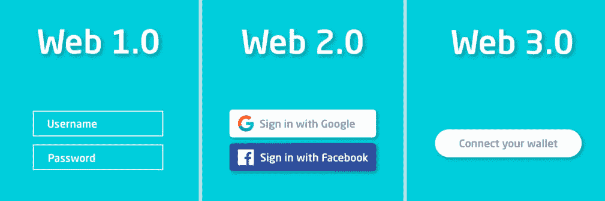

上图显示了“连接你的钱包”按钮，这是所有 Web3 认证方法的要点。因此，目标是让用户将他们的加密钱包连接到 dapps(分散应用程序)。然而，这个过程可以是直接的，也可以更微妙，如上图所示。

例如，想象一个以前从未听说过或使用过区块链钱包的用户现在想要使用 dapp。如果 dapp 提供“连接你的钱包”按钮，用户将不知道该做什么。因此，“间接”Web3 身份验证选项更适合新员工。这些方法使用前端所有传统用户都知道的电子邮件或社交登录。然而，在后端，他们仍然创建 Web3 钱包(加密地址)用于认证用户。

另一方面，有经验的 Web3 用户已经准备好了他们的钱包，正在寻找“连接你的钱包”按钮。因此，知道谁是你的用户很重要。但是，当目标用户的背景大相径庭时，最好使用动态 Web3 身份验证解决方案。

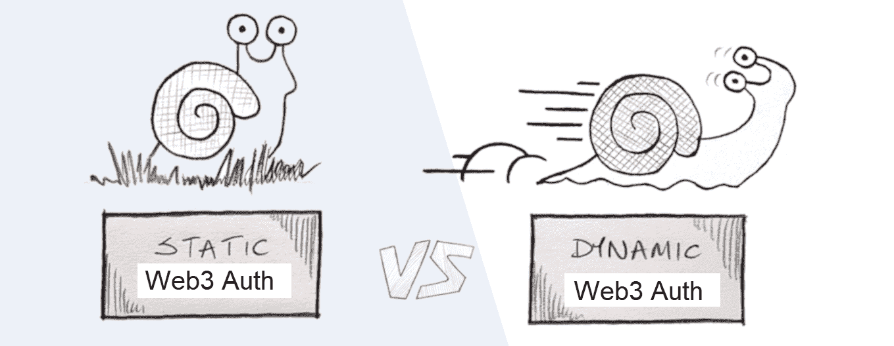

### Web3 的静态和动态身份验证

区分 Web3 的两种认证方法很重要。所以，在这个意义上，“静态”这个词指的是单一选项。这方面的一个例子是 dapp，它只为用户提供一种使用元掩码进行身份验证的方法。

另一方面，动态 Web3 身份验证指的是多选解决方案。当然，其中一个选项仍然可以是 MetaMask(毕竟，这是最受欢迎的 Web3 钱包)。然而，至少还有一个额外的选择。因此，这个 dapp 将提供其他流行的加密钱包，甚至可能提供一些上述“微妙的”Web3 认证方法。

此外，需要指出的是，不幸的是，静态 Web3 身份验证和动态 web 3 身份验证哪个更好并没有明确的答案。在大多数情况下，用户有不同的偏好，更动态的登录解决方案将更容易满足他们的需求。

## 使用动态 Web3 身份验证减轻入门负担

尽管 MetaMask 仍然是最受欢迎的区块链钱包，但也存在许多其他著名的选择，并且一些协议支持非常广泛的钱包。此外，如前所述，存在利用电子邮件或社交登录的“间接”身份验证解决方案。通过实现这些其他的动态认证解决方案，很明显，对于传统的 Web2 用户来说，Web3 的加入变得更加简单。

也就是说，让我们仔细看看一些最好的元蒙版替代方案。毕竟，根据定义，所有这些替代方案都提供动态 Web3 身份验证。此外，您可以使用 Moralis 的 Auth API 在几分钟内实现它们中的任何一个。此外，这是三个最受欢迎的选择:

*   WalletConnect
*   魔法。环
*   Web3Auth

此外，Moralis 还支持 RainbowKit 和比特币基地钱包认证方法。然而，我们将在本文的后面让您熟悉上面列出的解决方案。此外，正如您所想象的，这些解决方案中的每一个都有一些优点、缺点和特定的用例。因此，我们鼓励你自己进一步探索它们。

#### WalletConnect 概述

许多网站将 WalletConnect 称为应用程序或加密钱包。然而，事实上，它是一个开源协议。WalletConnect 的目的是在各种加密钱包和 dapps 之间建立连接。需要指出的是，该协议确保了应用程序、钱包或使用它的设备之间的安全连接。此外，WalletConnect 建立对称加密的连接。它通过两个对等体之间的共享密钥来实现这种加密。

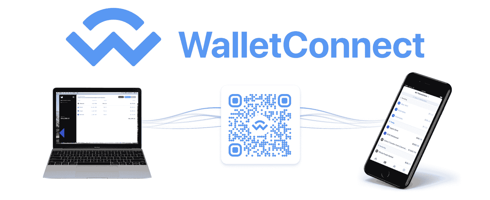

WalletConnect 的另一个优点是，默认情况下，它是一个动态的 Web3 身份验证解决方案。毕竟，它可以与 170 多个钱包一起使用，并定期添加新的选项。*欲了解最新详情，请访问 WalletConnect 官方网站:*

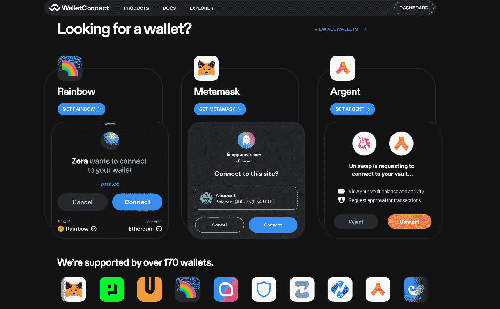

当 WalletConnect 作为验证选项实现时，它提供了两种方法。一方面，用户可以使用深层链接建立连接。另一方面，用户可以简单地扫描二维码。当然，这两种方式背后的原理是相同的——一个对等体(或 dapp)发送代码或链接，另一个对等体需要扫描或批准它。因此，通过将 WalletConnect 集成到 dapps 中，您可以为您的用户提供安全可靠的连接。尽管如此，值得指出的是，WalletConnect 要求用户在手机上安装一个受支持的钱包。因此，这种方法特别适合移动 Web3 用户。

#### 魔法。链接概述

魔法。Link 也称为 Magic，是由 Magic Labs 创建的一种动态 web 认证方法。Magic 的特别之处在于它提供无密码的 Web3 onboarding。因此，这个简洁的工具使开发人员能够实现 Web3 身份验证，而不需要用户了解 Web3。毕竟魔术创造钱包，管理钥匙。此外，Magic 支持通过电子邮件地址、社交账户或电话号码进行 Web3 身份验证。因此，它是 Web3 搭载 Web2 用户的一个很好的选择。

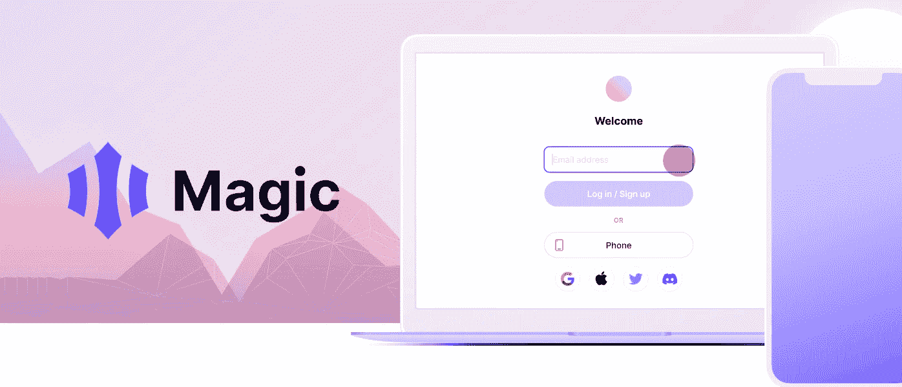

#### Web3Auth 概述

在许多方面，Web3Auth 与 Magic 非常相似，并且配备了最流行的 Web2 身份验证选项。因此，如果您想让用户轻松进入 Web3 领域，可以使用这个工具。此外，Web3Auth 还提供 fiat-to-crypto API，允许您的客户直接在您的 dapp 上购买有问题的链并与之交互。

最终，这种动态选择也消除了种子短语。相反，Web3Auth 利用了一种非托管的多因素认证方法。后者是保护用户私钥的一种安全且分散的方式。此外，Web3Auth 还兼容 OAuth 2.0，这意味着您可以通过单个 API 在后端验证用户。

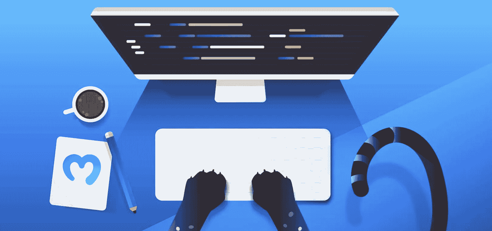

## 如何用 Web3Auth 添加动态 Web3 认证

如果您有兴趣将上述任何动态 Web3 身份验证解决方案添加到您的 dapps 中，您应该在 Moralis 文档中探索 [Web3 身份验证操作指南](https://docs.moralis.io/docs/web3-authentication)。其中还包括如何添加 Web3Auth 的详细步骤。这些指令的设计要求你首先[用 NextJS](https://moralis.io/how-to-connect-metamask-to-website-with-nextjs/) 将 MetaMask 连接到一个网站。因此，我们将更侧重于演示一个使用 Web3Auth 的示例 dapp。

因此，这里有一个示例 dapp 的屏幕截图，它通过 Web3Auth 提供动态 Web3 身份验证:

上图显示这一切都是从“使用 Web3Auth 登录”按钮开始的。用户点击该按钮后，会出现各种可供选择的登录选项:

上面截图的左侧显示了 Web3Auth 登录模块。如您所见，该模块提供了三个部分:“继续”、“电子邮件”和“外部钱包”。因此，用户可以轻松选择使用社交登录、电子邮件地址或加密钱包。例如，如果用户想连接他们的元掩码扩展，他们需要点击“连接钱包”按钮。此外，“继续”部分还包括“查看更多选项”按钮。点击该按钮，用户可以看到所有支持的社交登录选项:

### 使用 Web3Auth 的 Web3 社交登录示例

为了这个演示，让我们把重点放在与 Google 的认证上。虽然值得指出的是，基本上，当使用其他社交登录选项时，同样的原则也适用。因此，要通过谷歌认证，用户必须点击“继续”部分的谷歌图标:

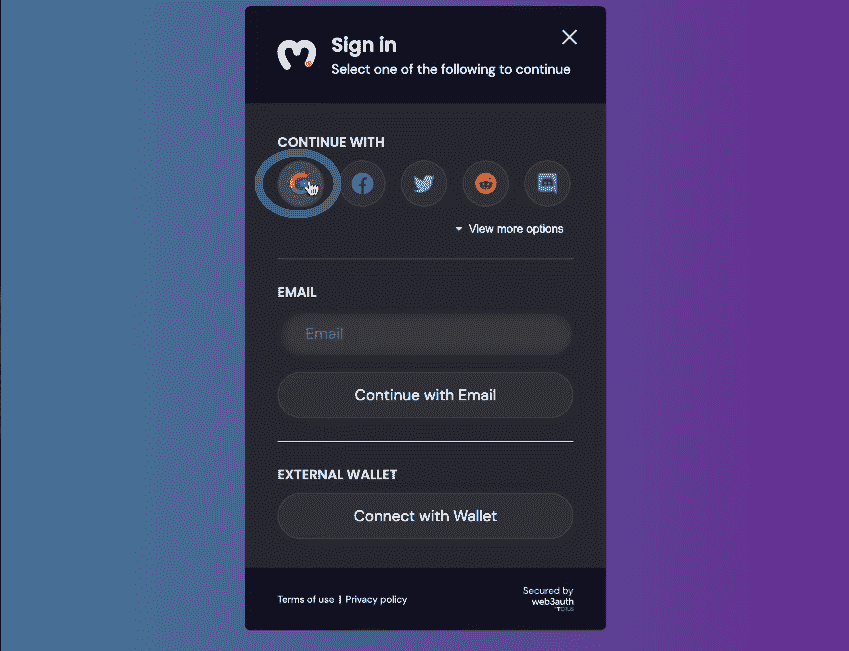

然后，用户需要选择一个谷歌账户:

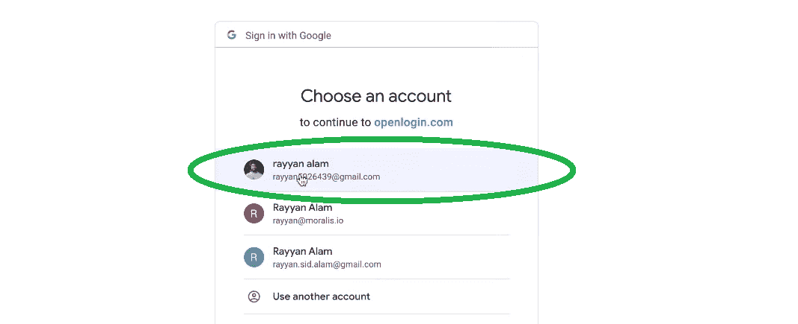

接下来，用户还有机会设置双因素身份认证(2FA):

我们将通过点击“也许下次”来关注跳过 2FA 的用户，这也结束了这个 Web3 认证过程。此外，通过完成上述步骤，用户还会收到可用于实际交易的加密地址:

上面截图中标记的钱包地址是自动创建的，并分配给用于登录的 Google 帐户。此外，如下图所示，这是一个功能齐全的地址，可以接收受支持的加密货币:

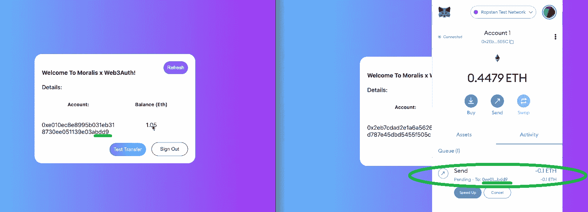

## Web3Auth 实现

如果您决定实现 Web3Auth，您将在 Moralis 文档中找到所需的代码。您还需要设置您的 Web3Auth 帐户。在这里，您可以获得自己的客户 ID。然后，您将使用该 ID 替换 Moralis 文档提供的代码中的“ *YOUR_CLIENT_ID* ”占位符。

尽管如此，您需要完成以下步骤来获得您的 Web3Auth 客户端 ID:

1.  访问 Web3Auth 官网，点击“免费注册”按钮:

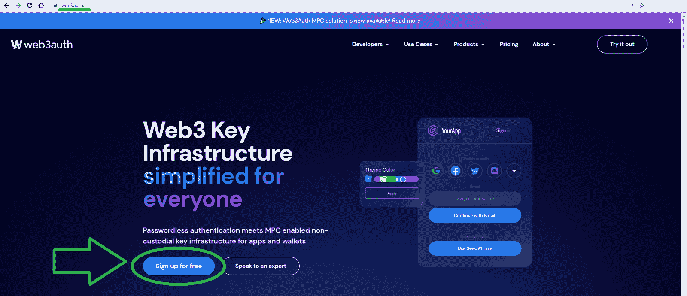

2.  在下一页，使用您的社交帐户或电子邮件地址创建您的帐户:

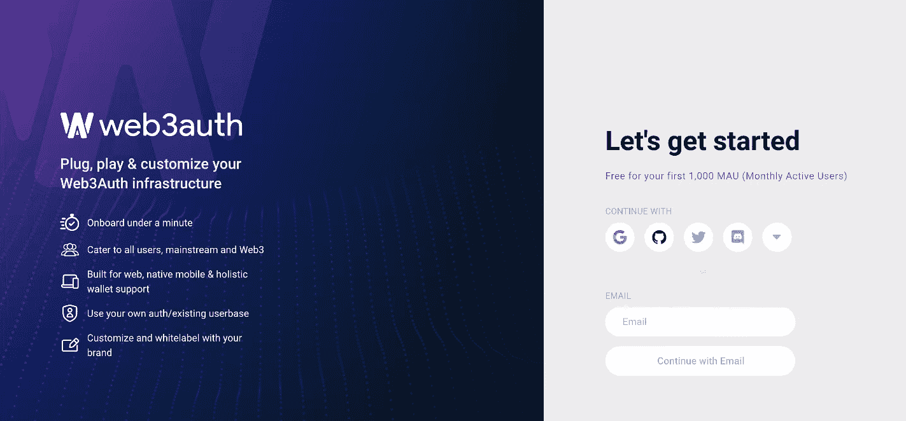

3.  您的 Web3Auth 帐户启动并运行后，您将能够访问您的仪表板。在那里，您需要转到“即插即用”部分:

4.  接下来，使用“创建项目”按钮。

5.  创建项目后，您将能够复制该项目的客户 ID:

6.  最后，用上面复制的 ID 替换“ *YOUR_CLIENT_ID* ”占位符:

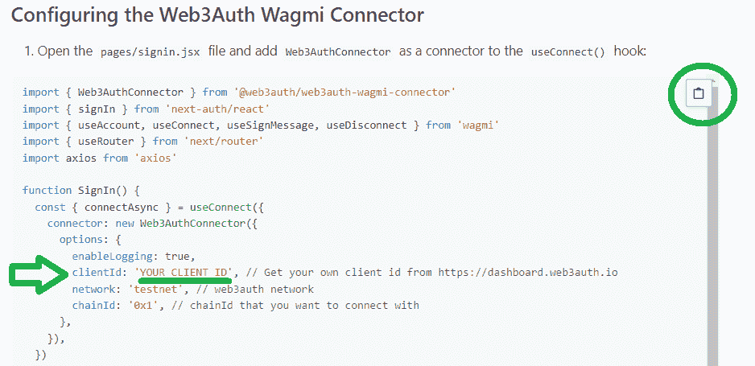

## 向网站添加动态 Web3 身份验证—摘要

我们在今天的文章中谈了相当多的内容。您探索了 Web3 身份验证和各种备选方案。此外，您现在知道 Web3 登录用于将用户连接到区块链。您还了解了静态和动态 Web3 身份验证，现在您知道后者只是意味着用户可以在两种或更多种不同的身份验证方法中进行选择。此外，您还发现 Moralis 的 Web3 身份验证 API 支持一些最流行的动态 Web3 身份验证解决方案。尽管如此，我们还是向您展示了一个使用 Web3Auth 的 dapp 的演示。最后但并非最不重要的是，如果您决定访问 Moralis 文档，您可以遵循说明并实现身份验证方法。另外，我们向您展示了如何获得您的 Web3Auth 客户端 ID。

如果这是您第一次听说和使用 Web3 身份验证解决方案，我们鼓励您深入了解。毕竟，每个 dapp 都需要有一个可靠的身份验证。因此，请务必在 Moralis 文档的“Web3 身份验证”类别中探索其他操作指南。我们也鼓励你使用[道德伦理 YouTube 频道](https://www.youtube.com/c/MoralisWeb3)和[道德伦理博客](https://moralis.io/blog/)作为你的指南。那里的一些最新主题将向您展示[构建 dapp 的最简单方法](https://moralis.io/the-easiest-way-to-build-dapps-3-step-tutorial-for-devs/)，如何[将 dapp 连接到 Cronos](https://moralis.io/cronos-development-connect-dapps-to-cronos/) ，如何[构建 BNB 链 dapp](https://moralis.io/bnb-chain-boilerplate-how-to-build-bnb-chain-dapps/)，如何[将 dapp 连接到以太坊网络](https://moralis.io/set-up-and-connect-a-dapp-to-the-ethereum-network/)，等等。

此外，你可能有兴趣去全职加密越早越好。在这种情况下，你应该通过在道德学院完成一些顶级的区块链发展课程来获得区块链认证。“[初学者密码](https://academy.moralis.io/courses/crypto-for-beginners)课程是一个很好的起点。