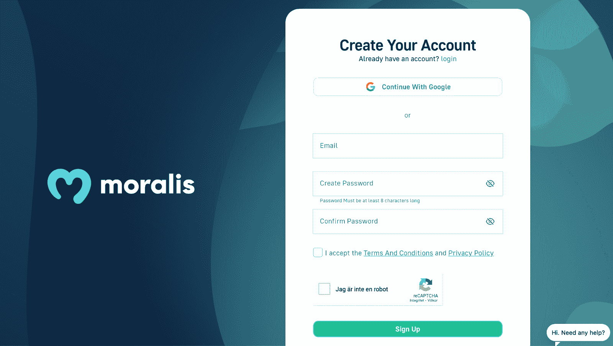
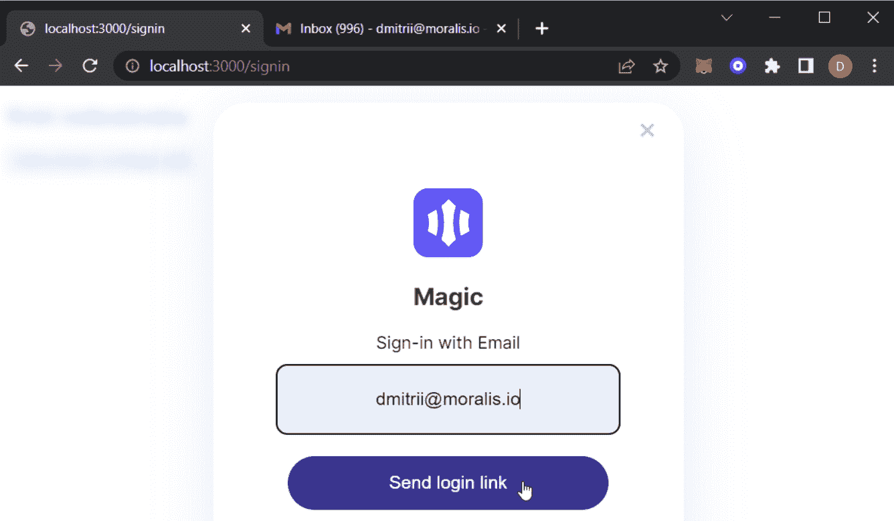

# 用魔法添加登录。通过 5 个步骤链接到你的 NextJS 项目

> 原文：<https://moralis.io/add-sign-in-with-magic-link-to-your-nextjs-project-in-5-steps/>

本文将演示如何使用 Magic 添加登录。链接五个简单的步骤。如果您想跳过这些步骤，直接进入代码，请查看下面的 GitHub 库。但是，repo 中的代码是用于元掩码身份验证的。因此，要用魔法添加签到。链接，您将需要在这里和那里做一些调整。此外，如果你对此有困难，请继续阅读我们对整个过程的解释！

**完整的认证 App 文档—**[**https://github . com/moralisweb 3/demo-apps/tree/main/nextjs _ moralis _ auth**](https://github.com/MoralisWeb3/demo-apps/tree/main/nextjs_moralis_auth)

**缺乏统一的识别系统是传统 Web2 应用和网站生态系统的一个问题。例如，用户必须跟踪不同平台的多次登录，这会对整个领域的用户体验产生负面影响。然而，在 Web3 空间中情况并非如此，因为存在用于普遍存在的标识层的现有基础设施。此外，用户可以使用他们的 [Web3 钱包](https://moralis.io/what-is-a-web3-wallet-web3-wallets-explained/)、 [Web3 身份](https://moralis.io/web3-identity-the-full-guide-to-authentication-identity-and-web3/)登录网站，甚至可以通过 Magic 等解决方案使用简单的电子邮件。此外，这是魔术的解决方案，我们将在本教程中直接关注。更具体地说，本文将说明如何使用 Magic 添加登录。链接使用[道德规范](https://moralis.io/)！**

**此外，我们使用 Moralis 的 [auth API](https://docs.moralis.io/reference/auth-api-overview) ，因为它使流程更容易访问。此外，API 允许我们使用单一代码片段添加身份验证机制，从而提供无缝的开发人员体验。此外，Moralis 的所有认证机制都是 T2 EIP-4361 T3 标准的实现。因此，Moralis Web3 认证与 Web2 和外链项目兼容。因此，这是 Moralis 弥合 Web2 和 Web3 之间差距的一种方式！**

**所以，如果你有雄心成为一名区块链开发者，并使用魔法登录。林克，马上加入道德家！**

## **什么是魔法。链接？**

**现在，让我们在深入研究之前先来探索一下魔法。简而言之，Magic 是一个面向开发人员的 SDK，它与应用程序集成，通过使用“magic links”来促进无密码的 Web3 身份验证和登录。这个策略类似于 Slack 和 Medium 使用的策略。此外，Magic 确保硬件安全、无密码登录和光速访问 20 多个区块链。此外，即使您有一个现有的身份验证解决方案，也只需几个代码片段就可以建立连接。**

**

Magic 的生态系统由 Magic Connect 和 Magic Auth 两个产品组成。前者是一个全球 Web3 钱包，利用标准的 Web3JS RPC 方法并结合神奇的功能。此外，这为钱包提供了广泛的功能。因此，它为 dapps 和其他项目的 Web3 生态系统提供了一站式服务。

Magic Auth 提供无密码和特定于应用程序的钱包认证基础架构。它是高度可定制的，可以用来代替标准的 Web2 认证机制。此外，您可以整合 20 多个区块链，为您的 dapps 创建无缝的入职培训。

神奇链接为用户和企业都提供了许多好处，包括:

*   **无缝认证**–Magic links 为用户提供了一种更便捷的登录方式。此外，它允许用户避免密码维护任务。这包括经常创建、存储和更新密码。反过来，神奇的链接可以有助于更引人注目的用户体验，使用户和企业受益。

*   **无密码漏洞**–由于神奇的链接消除了对密码的需求，它们也消除了密码漏洞。因此，这表明魔术链接提供了一个更安全的系统，更难篡改。

*   **简单的入职**–神奇的链接消除了注册过程中创建密码的需要，并提供了更快的入职流程。因此，您使用户能够更无缝地访问您的服务，并成为您的项目或 dapp 的一部分！

## 用魔法添加登录。使用 Moralis 链接 5 个步骤

对 Magic 有了更深刻的理解后，我们可以继续讨论本文的主题，说明如何使用 Magic.Link 添加登录。简而言之，Moralis 使得 [Web3 认证](https://moralis.io/authentication/)可访问，并且您可以用单个代码片段实现认证机制！

为了说明 Moralis 的可访问性，我们将创建一个简单的 NextJS 应用程序，用户可以在其中登录，而不需要帐户或密码。一旦他们验证了自己，他们就可以查看用户信息，如地址、配置文件 ID 和签名。此外，一旦用户通过身份验证，“ *next-auth* ”库将建立一个包含加密 JWT 的会话 cookie。此外，JWT 还包含地址、签名消息等信息。，它存储在用户的浏览器中。此外，这是一种在没有数据库的情况下存储用户信息的安全方式。此外，如果没有密钥，就不可能访问或更改这些数据。

尽管如此，为了使这个过程更容易理解，我们将向您展示如何用魔法添加登录。简单的五步链接:

1.  安装依赖项、库和 Magic Connector
2.  包装应用程序
3.  设置请求消息端点
4.  " *NextAuth"* 配置并创建一个登录页面
5.  创建用户页面

此外，为了让您更好地了解我们正在努力的方向，我们现在将展示两个屏幕截图:一个用于登录页面，一个用于用户页面:

**登录页面:**


**用户页面:**


在向您展示如何使用 Magic 添加登录之前。链接在我们开始之前，您需要满足一些先决条件。因此，在我们安装依赖项、库和 Magic Connector 之前，我们将在下一节中更深入地研究这些先决条件！

## 用魔法添加登录。链接–先决条件

本节将介绍一些在探索如何使用 Magic.Link 添加登录之前需要注意的准备工作。因此，如果你还没有，你需要从创建一个道德账户开始。此外，注册 Moralis 很容易，只需要几秒钟。此外，创建帐户是免费的！



此外，一旦您建立了一个 Moralis 帐户，您需要一个 IDE(集成开发环境)，在本教程中，我们将使用 Visual Studio 代码。然而，这真的没关系，如果您更喜欢使用其他软件，您可以自由地这样做。

最后，您需要设置一个 NextJS 应用程序。这个过程相对简单；但是，如果您需要帮助，您可以浏览“ [create-next-app](https://nextjs.org/docs/api-reference/create-next-app) ”文档。另外，你也可以跟着 Moralis [NextJS dapp](https://docs.moralis.io/docs/nextjs-dapp) 教程。此外，这两种方法都将向您展示如何从头开始建立一个 NextJS 应用程序。

现在，所有的先决条件都已建立，我们可以继续深入本教程的第一步，学习如何使用 Magic 添加登录。链接！

### 步骤 1:安装依赖项、库和 Magic Connector

因此，要开始这个简短的指南，您可以跟随我们向您展示如何安装依赖项、库和 Magic Connector。此外，我们将添加必要的环境变量。因此，让我们从如何使用 Moralis、NextAuth 和 Axios 安装依赖项开始。要安装这三个元素，您只需要下面的" *npm"* 代码:

```js
npm install moralis next-auth axios
```

此外，安装完依赖项后，我们需要添加一个特定的库。在这种情况下，我们将添加 wagmi。要安装该库，可以使用以下命令:

```js
npm install wagmi ethers
```

所以，随着 wagmi 的安装，我们可以添加神奇的连接器。此外，为 dapp 添加神奇身份验证的最简单方法是通过 wagmi，更具体地说，是以下输入:

```js
npm i @everipedia/wagmi-magic-connector
```

最后，您需要添加四个环境变量来完成第一步。此外，您需要将这些变量添加到应用程序根目录下的“. env.local”文件中。此外，这些是您需要添加的变量:

*   *APP _ DOMAIN*:RFC 4501 DNS authority。这将用于请求签名。
*   *MORALIS_API_KEY* :您可以通过您的 MORALIS 账户访问 API 密钥。
*   *NEXTAUTH_URL* :这将是你的应用地址。
*   *NEXTAUTH_SECRET* :加密用户 JWT 令牌的密钥。在这里随意生成一个拟合值:【https://generate-secret.now.sh/32】[。](https://generate-secret.now.sh/32)

为了说明它可能的样子，下面是一个“. env.local”文件的示例:

```js
APP_DOMAIN=amazing.finance
MORALIS_API_KEY=xxxx
NEXTAUTH_URL=http://localhost:3000
NEXTAUTH_SECRET=7197b3e8dbee5ea6274cab37245eec212
```

此时，我们将快速检查的最值得注意的变量是“ *NEXTAUTH_URL* ”。示例中设置为“[*http://localhost:3000*](http://localhost:3000/)”。这在开发应用程序时非常完美，因为它允许您在安全的本地环境中测试其功能。然后，一旦您计划启动一个项目，您应该将它更改为您的应用程序地址。

### 步骤 2:包装应用程序

因此，第一步完成后，下一步是使用“*WagmiConfig”*和“SessionProvider”包装应用程序。这个过程相对简单，首先，您需要创建一个新的“pages/_app.jsx”文件，然后添加以下内容:

```js
import { createClient, configureChains, defaultChains, WagmiConfig } from 'wagmi';
import { publicProvider } from 'wagmi/providers/public';
import { SessionProvider } from 'next-auth/react';

const { provider, webSocketProvider } = configureChains(defaultChains, [publicProvider()]);

const client = createClient({
  provider,
  webSocketProvider,
  autoConnect: true,
});

function MyApp({ Component, pageProps }) {
  return (
    <WagmiConfig client={client}>
      <SessionProvider session={pageProps.session} refetchInterval={0}>
        <Component {...pageProps} />
      </SessionProvider>
    </WagmiConfig>
  );
}

export default MyApp;
```

### 步骤 3:设置请求消息端点

现在您已经用“ *WagmiConfig* 和“*session provider”*包装了您的应用程序，您需要继续创建一个请求消息端点。简而言之，这个端点将负责向“*道德家发出请求。Auth”。*此外，端点将生成独特的消息，这些消息稍后将在客户端进行签名。

尽管如此，要添加这个请求消息端点，您必须创建一个 API“pages/API/auth/request-message . js”文件。文件设置完毕后，您可以继续添加以下内容:

```js
import Moralis from 'moralis';

const config = {
    domain: process.env.APP_DOMAIN,
    statement: 'Please sign this message to confirm your identity.',
    uri: process.env.NEXTAUTH_URL,
    timeout: 60,
};

export default async function handler(req, res) {
    const { address, chain, network } = req.body;

    await Moralis.start({ apiKey: process.env.MORALIS_API_KEY });

    try {
        const message = await Moralis.Auth.requestMessage({
            address,
            chain,
            network,
            ...config,
        });

        res.status(200).json(message);
    } catch (error) {
        res.status(400).json({ error });
        console.error(error);
    }
}
```

### 步骤 4: " *NextAuth* "配置并创建一个登录页面

第四步的第一部分是配置“ *NextAuth* ”。因此，您可以创建一个新的“pages/api/auth/[…nextauth]。js "文件，内容如下:

```js
import CredentialsProvider from 'next-auth/providers/credentials';
import NextAuth from 'next-auth';
import Moralis from 'moralis';

export default NextAuth({
    providers: [
        CredentialsProvider({
            name: 'MoralisAuth',
            credentials: {
                message: {
                    label: 'Message',
                    type: 'text',
                    placeholder: '0x0',
                },
                signature: {
                    label: 'Signature',
                    type: 'text',
                    placeholder: '0x0',
                },
            },
              async authorize(credentials) {
                try {
                  // "message" and "signature" are needed for authorisation
                  // we described them in "credentials" above
                  const { message, signature } = credentials;

                  await Moralis.start({ apiKey: process.env.MORALIS_API_KEY });

                  const { address, profileId } = (
                    await Moralis.Auth.verify({ message, signature, network: 'evm' })
                  ).raw;

                  const user = { address, profileId, signature };
                  // returning the user object and creating  a session
                  return user;
                } catch (e) {
                  console.error(e);
                  return null;
                }
              },
        }),
    ],
    // adding user info to the user session object
    callbacks: {
        async jwt({ token, user }) {
            user && (token.user = user);
            return token;
        },
        async session({ session, token }) {
            session.user = token.user;
            return session;
        },
    },
});
```

#### 设置登录页面

此外，第四步的第二部分是创建一个登录页面。这是用户访问应用程序时首先到达的地方，也是他们可以使用 Magic 登录的地方。因此，要创建这个页面，您必须向存储库添加一个新的“pages/signin.jsx”文件。有了该文件，您可以使用以下内容来创建页面:

```js
import { MagicConnector } from '@everipedia/wagmi-magic-connector'
import { signIn } from 'next-auth/react'
import { useAccount, useConnect, useSignMessage, useDisconnect } from 'wagmi'
import { useRouter } from 'next/router'
import axios from 'axios'

function SignIn() {
  const { connectAsync } = useConnect({
    connector: new MagicConnector({
      options: {
        apiKey: 'YOUR_MAGIC_LINK_API_KEY', //required
      },
    }),
  })
  const { disconnectAsync } = useDisconnect()
  const { isConnected } = useAccount()
  const { signMessageAsync } = useSignMessage()
  const { push } = useRouter()

  const handleAuth = async () => {
    if (isConnected) {
      await disconnectAsync()
    }

    const { account } = await connectAsync()
    const userData = { address: account, chain: '0x1', network: 'evm' }

    const { data } = await axios.post('/api/auth/request-message', userData, {
      headers: {
        'content-type': 'application/json',
      },
    })

    const message = data.message

    const signature = await signMessageAsync({ message })

    // redirect user after success authentication to '/user' page
    const { url } = await signIn('credentials', {
      message,
      signature,
      redirect: false,
      callbackUrl: '/user',
    })
    /**
     * instead of using signIn(..., redirect: "/user")
     * we get the url from callback and push it to the router to avoid page refreshing
     */
    push(url)
  }

  return (
    <div>
      <h3>Web3 Authentication</h3>
      <button onClick={() => handleAuth()}>Authenticate via Magic.Link</button>
    </div>
  )
}

export default SignIn
```

在这一步，您必须确保添加“ *MagicConnector* ”作为“ *useConnect()* ”挂钩的连接器。这样做指定 Magic 将是提供者，用户可以使用这个方法登录！

### 步骤 5:创建用户页面

最后，您需要创建一个页面，一旦用户通过身份验证，就会被引导到这个页面。因此，总结本教程的最后一部分，如何用魔法添加登录。链接，您需要创建一个新的“pages/user.jsx”文件，如下所示:

```js
import { getSession, signOut } from 'next-auth/react';

// gets a prop from getServerSideProps
function User({ user }) {
    return (
        <div>
            <h4>User session:</h4>
            <pre>{JSON.stringify(user, null, 2)}</pre>
            <button onClick={() => signOut({ redirect: '/signin' })}>Sign out</button>
        </div>
    );
}

export async function getServerSideProps(context) {
    const session = await getSession(context);

    // redirect if not authenticated
    if (!session) {
        return {
            redirect: {
                destination: '/signin',
                permanent: false,
            },
        };
    }

    return {
        props: { user: session.user },
    };
}

export default User;
```

恭喜你！如果您已经了解了这么多，您应该知道如何用魔法添加登录。链接！然而，在我们完成本文之前，我们还必须确保应用程序能够正常工作。因此，我们将在最后一节专门测试应用程序及其功能。

## 用魔法添加登录。链接–如何测试应用程序

因为您已经完成了关于如何使用 Magic 添加登录的所有五个步骤。链接，现在是测试一切正常工作的时候了。因此，要测试应用程序，首先需要通过以下命令启动 localhost 服务器:

```js
npm run dev
```

一旦本地主机服务器启动并运行，您就可以使用我们之前设置的地址启动应用程序:

[*http://localhost:3000/sign in*T3】](http://localhost:3000/signin)

应用程序一启动，您就可以点击“通过魔法认证”。链接”按钮:


这将提示魔术，你需要输入一个电子邮件地址:



该应用程序将发送一个链接到您的电子邮件。一旦你点击这个链接，它会将你重定向到用户页面。此外，如果这有效，您知道应用程序也有效。这进一步意味着你可以用魔法添加签到。链接所有未来的项目，并允许用户验证自己不需要密码！


但是，如果您对代码和本教程有疑问，请查看官方文档中关于使用 Magic.Link 添加登录的内容。

## 用魔法添加登录。链接-摘要

在本文中，您成功创建了一个简单的 NextJS 应用程序，并使用 Magic.Link 添加了登录功能。

1.  安装依赖项、库和 Magic Connector
2.  包装应用程序
3.  设置请求消息端点
4.  " *NextAuth* "配置和创建登录页面
5.  创建用户页面

由于 Moralis 的 Auth API，我们可以很容易地添加这个认证机制。此外，该 API 使 Web3 身份验证变得更加容易访问，并提供了几个选项。因此，当与道德家一起工作时，你并不局限于魔法。例如，查看我们的两个教程[如何使用 RainbowKit](https://moralis.io/how-to-add-a-sign-in-with-rainbowkit-to-your-project-in-5-steps/) 添加登录或添加 WalletConnect 身份验证。

此外，Web3 auth 只是 Moralis 平台大放异彩的领域之一。此外，你有可能快速实现 [Web3 同步](https://moralis.io/syncs/)或者通过 Moralis 创建 [Web3 webhooks](https://moralis.io/web3-webhooks-the-ultimate-guide-to-blockchain-webhooks/) 。Moralis 还提供对其他工具的访问，比如 T4 NFT API T5。此外，通过这个，您可以轻松地创建 NFTs 和 NFT 相关的项目！

所以，如果你想验证你的用户，实现 Web3 同步等等。，[马上报名道德家](https://admin.moralis.io/register)！创建帐户是免费的，你可以在几分钟内开始你的第一个项目！**