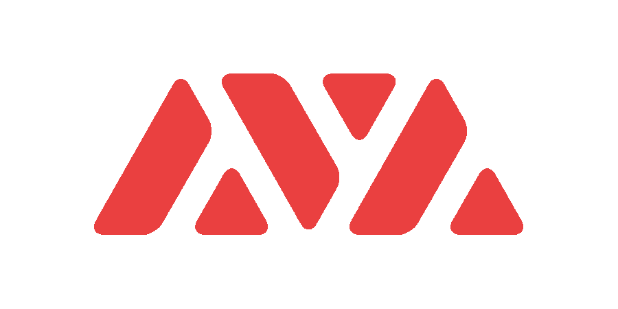
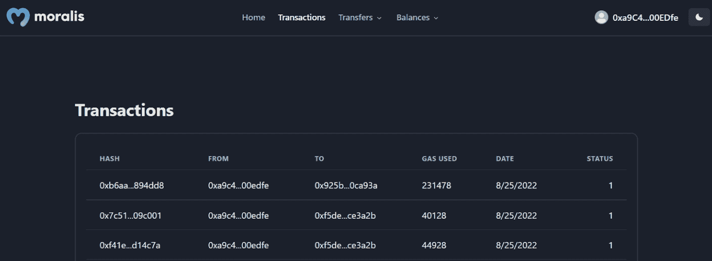

# 雪崩样板–构建雪崩 Dapps 的最快方法

> 原文：<https://moralis.io/avalanche-boilerplate-fastest-way-to-build-avalanche-dapps/>

**您是否对 Avalanche 开发感兴趣，并希望利用该平台构建复杂的 Avalanche dapps？如果是这样的话，你应该知道** [**道德规范**](http://moralis.io)**‘雪崩样板——结合平台的企业级**[**web 3 API**](https://moralis.io/web3-apis-exploring-the-top-5-blockchain-apis/)**——提供了创建雪崩 dapps 的最快和最容易的方法！如果您对此感兴趣，请加入我们的教程，因为我们提供了使用 Avalanche 样板构建 dapps 的完整分解。**

在演示如何构建 Avalanche dapps 之前，我们将首先探索 Avalanche 网络和 Moralis 以太坊样板的复杂性。接下来，我们将直接进入教程，并说明如何使用 Moralis 的 Avalanche 样板文件构建 Avalanche dapps。因此，如果你正在寻找既高效又有效地开发 Avalanche dapps，加入我们，学习你需要知道的关于立即启动你的第一个项目的所有知识！

此外，您希望在哪个网络上构建项目并不重要。当你选择使用道德，你将能够节省宝贵的资源和时间。要了解更多关于 Moralis 的功能，我们强烈建议您查看一些 Moralis 最著名的工具。例如，了解更多关于 [Web3 Streams API](https://moralis.io/streams/) ，允许您将[链上数据](https://moralis.io/on-chain-data-the-ultimate-guide-to-understanding-and-accessing-on-chain-data/)直接传输到任何后端！因此，如果您想获得更无缝的开发体验，请立即注册 Moralis！

## 什么是雪崩？雪崩解释道

Avalanche 是构建 dapps 的最重要的以太坊替代方案之一，它是 Web3 应用程序的可编程智能合约平台。该平台旨在解决以太坊的拥堵问题，重点是交易速度和成本。

Avalanche 背后的组织是艾娃实验室，他们表示他们已经在行业内建立了更快的“时间终结”智能合同平台。因此，网络为构建快速、低成本的应用程序提供了极好的机会。更重要的是，Avalanche 是 EVM 兼容的，允许你构建与 Solidity 兼容的 dapps。

以下是雪崩的一些主要特征:

*   **速度**–Avalanche 利用一种新颖的共识协议，可以在不到一秒的时间内连续确认交易。
*   **安全性**–网络可以确保强大的安全保障，超过一些替代网络实施的 51%标准。
*   **可扩展性**–Avalanche 每秒能够处理 4，500 个事务(TPS)。
*   **可持续性**–网络使用 PoS(利害关系证明)共识机制，而不是 PoW(工作证明)。这通常是一个更经济的选择。
*   **私人/公共区块链**–Avalanche 允许你创建自己的区块链，无论是公共的还是私人的。

尽管如此，本文还是简要介绍了 Avalanche 和该网络的一些最重要的功能。随着对 Avalanche 网络的更好理解，我们将在下一节探索 Moralis 的 Avalanche 样板文件。让我们首先介绍一下样板文件的一些主要特征，以说明您正在努力实现的目标！

## 你在朝什么方向努力？–探索道德的雪崩样板

如果你想跳过教程，直接进入 Avalanche 样板代码，你可以找到下面的链接。然而，一旦你点击这个链接或进一步检查它，你会很快注意到它被称为“以太坊-样板”，这可能会令人困惑，因为你正在着手建立雪崩 dapps。然而，该模板是 EVM 兼容的，并且同样适用于雪崩网络！

**雪崩样板文件——**[**https://github . com/以太坊-样板/以太坊-样板**](https://github.com/ethereum-boilerplate/ethereum-boilerplate)

然而，您将要基于 Moralis 的 Avalanche 样板文件创建的 dapp 将具有以下登录页面:

在 dapp 的顶部，您会发现四个选项卡:“主页”、“交易”、“转账”和“余额”。这些标签将包含关于用户的 Web3 钱包的各种信息。但是，在进一步浏览这些选项卡之前，用户必须通过点击“连接钱包”来验证他们的 [Web3 身份](https://moralis.io/web3-identity-the-full-guide-to-authentication-identity-and-web3/):

点击这个按钮将提示他们的元掩码钱包和他们签署一个消息。一旦消息被签名，dapp 将自动向各个选项卡添加信息。因此，例如，如果用户点击“交易”，它将在表格中显示单个用户的交易历史:

此外，“转账”和“余额”选项卡具有下拉菜单。这些菜单允许用户在令牌类型之间进行筛选。因此，例如，可以点击“余额”选项卡并选择“NFTs”选项:

如果用户这样做，它将整齐地显示他们钱包中包含的所有 NFT:

此外，同样的原则也适用于“Transfers”选项卡。然而，这涵盖了 Avalanche 样板文件的基本特性，包括获取链上数据、 [Web3 认证](https://moralis.io/authentication/)等功能。对你将要努力的目标有了更深刻的认识后，是时候开始用 Moralis 的 Avalanche 样板创建 dapps 了。

## 如何用 Avalanche 样板文件创建 Dapps

在接下来的部分中，本文将说明如何用 Avalanche 样板文件创建 dapps。首先，我们将向您展示如何创建一个 Moralis 帐户，因为这是本教程所必需的。一旦你有一个帐户，我们将向你展示如何克隆 Avalanche 样板到你的本地目录。有了项目的副本，我们将涵盖必要的配置，使 dapp 按预期工作。最后，作为教程的结束，我们将演示如何启动 Avalanche dapp！

此外，如果你更喜欢观看 YouTube 视频来学习，请查看下面来自 [Moralis 的 YouTube](https://www.youtube.com/c/MoralisWeb3) 频道的剪辑。在视频教程中，Moralis 开发人员从头到尾向您介绍了整个过程:

[https://www.youtube.com/embed/Bb5Pc--kyAY?feature=oembed](https://www.youtube.com/embed/Bb5Pc--kyAY?feature=oembed)

然而，上面的视频并没有涵盖使样板文件适用于雪崩网络的所有配置。如果你需要这方面的帮助，请跟随我们开始教程，向你展示如何创建一个道德帐户！

### 创建道德账户

在克隆 Avalanche 样板文件之前，我们将关注一个基本的先决条件:创建一个 Moralis 帐户。创建您的帐户很容易，只需几秒钟。因此，您可以点击 Moralis 网站顶部的“[免费开始](https://admin.moralis.io/register)”按钮:

点击此按钮将打开以下页面，您需要输入电子邮件地址，创建新密码，点击“我接受…”框，然后点击“注册”:

结果，您现在有了一个 Moralis 帐户，我们将在“*配置环境变量*”部分进一步解释为什么您首先需要一个帐户。然而，让我们仔细看看如何将 Avalanche 样板文件克隆到您的本地目录！

### 克隆雪崩样板解释道

可以通过打开自己的 IDE(集成开发环境)来进步。本教程将说明如何建立一个雪崩 dapp 与 Visual Studio 代码(VSC)。请记住，如果您选择另一个选项，请注意在这个过程中可能偶尔会有细微的差别。此外，打开 IDE 后，为项目创建一个新文件夹。

接下来，使用“*中的链接，你正在朝着什么目标努力？…* ”部分，并打开 Avalanche 样板文件的 GitHub 存储库。在那里，您需要通过点击“代码”然后点击“复制”按钮来复制回购 URL:

有了 URL，导航回您的 IDE 并打开一个新的终端。如果你像我们一样，决定使用 VSC，你可以点击界面顶部的“终端”并点击“新终端”:

打开新终端后，您可以使用存储库 URL 并运行以下命令(确保您位于之前设置的文件夹位置):

*git 克隆“样板 _ URL”*

然后，您可以通过在终端中输入以下内容来导航到项目的文件夹:

*cd 以太坊-样板文件*

如果您做的一切都是正确的，那么在您的本地设备上应该有一个与此类似的结构:

### 配置环境变量

现在您已经将项目放在了本地目录中，您需要对代码进行一些调整。相应地，继续打开“. env.local.example”并将其重命名为“. env.local”，删除“.”。例”放在最后。默认情况下，该文件将实现以下代码:

*APP_CHAIN_ID=0x1*

*APP _ DOMAIN = ether eum . boilerplate*

*MORALIS_API_KEY= #获取您的密钥 https://admin.moralis.io/account/profile*

*next auth _ SECRET = # Linux:` OpenSSL rand-hex 32 `或者去 https://generate-secret.now.sh/64*

*next auth _ URL = http://localhost:3000 #生产替换*

上面你需要配置的第一个变量是“ *APP_CHAIN_ID* ”，初始设置为“ *0x1* ”。这是以太坊网络的链 ID。因此，您将需要改变这一点，以适应雪崩。因此，继续将该值更改为 Avalanche 的 ID:“*0xa 86 a*”。

接下来，您需要将一个 API 键添加到" *MORALIS_API_KEY* "变量中，这就是您的 MORALIS 帐户的用途。要获取密钥，请登录 Moralis，点击“帐户”，导航至“密钥”选项卡，并复制“Web3 API 密钥”:

在那里，设置“ *MORALIS_API_KEY* ”等于您刚才复制的值。最后，您必须向变量“ *NEXTAUTH_SECRET* 添加一个密钥。使用以下链接创建一个可以输入到代码中的值:“【https://generate-secret.now.sh/32】*”。*

*这就是可变配置；但是，我们很快就需要提到“ *NEXTAUTH_URL* ”。该变量默认设置为“ *http://localhost:3000* ”。这将允许您在本地主机上运行 Avalanche dapp。但是，一旦您计划启动 dapp 并使其公开可用，您就必须将该值更改为 dapp 的 URL。尽管如此，您可以暂时保持不变！*

*下面的代码片段是文件最终版本的示例:*

**APP_CHAIN_ID=0xa86a**

**APP _ DOMAIN = ether eum . boilerplate**

**MORALIS _ API _ KEY = " YOUR _ API _ KEY "**

**next auth _ SECRET = b8e 786967d 7 bcbc 0 f 920d 35 bcc 3 f 891 c**

**next auth _ URL = http://localhost:3000**

### *如何启动雪崩 Dapp*

*在本教程的最后一部分，我们将演示如何启动 Avalanche dapp。您需要做的第一件事是安装几个依赖项，这相当容易。现在，根据您使用的是" *yarn* 还是" *npm* "命令，打开一个新的终端并输入以下命令之一:*

**npm i**

**纱线**

*接下来，剩下的工作就是使用以下命令之一在本地主机上运行应用程序:*

**npm 运行开发**

**纱线运行开发**

*就是这样！现在，您应该能够使用您在上一节中设置的 URL 来访问和测试应用程序了:“[*http://localhost:3000*](http://localhost:3000/)”。*

*此外，如果您在此过程中遇到任何障碍，您可以加入 Moralis Discord 频道，从我们才华横溢的社区工程师那里获得帮助！此外，查看之前的视频或使用前一节的 GitHub 链接收听 Avalanche 样板的官方文档也可能有所帮助。*

*此外，如果你觉得这个教程很有帮助，并想为其他网络开发 dapps，你可以在 Moralis 的 [Web3 博客](https://moralis.io/blog/)找到额外的指南。例如，你可以学习如何通过三个步骤[构建一个多边形 dapp](https://moralis.io/how-to-build-a-polygon-dapp-in-3-steps/) ！*

## *Avalanche 样板文件–摘要*

*本文演示了如何通过创建一个 Moralis 帐户、克隆 Moralis 的 Avalanche 样板文件、配置环境变量和启动 dapp 来轻松创建一个简单的 Avalanche dapp。此外，感谢 Moralis，你能够在几分钟内创建一个雪崩 dapp！*

*

按照上面的各种说明，用户可以使用他们的 Web3 钱包登录应用程序。一旦登录，他们将能够访问有关其钱包的信息，如交易历史、余额等。因此，Avalanche 样板支持大多数 dapps 实现的一些重要的基本特性。这表明模板作为任何应用程序的准系统都是非常优秀的。你现在需要做的就是添加更多的功能或删除那些你认为不必要的功能！

如果你觉得这篇文章有价值，可以考虑在 Moralis 查看更多优秀的内容。例如，如果你对游戏感兴趣，博客会提供一些令人惊叹的 Web3 游戏内容，比如如何[将 PlayFab 与 Web3](https://moralis.io/how-to-connect-playfab-with-web3-using-azure-functions/) 连接起来，或者[构建一个 Web3 FIFA 克隆版](https://moralis.io/how-to-build-a-web3-fifa-clone/)。

然而，你可能对 NFT 开发比游戏更感兴趣。如果是这样的话，Moralis 还是第一选择！借助 Moralis 的 [NFT API](https://moralis.io/nft-api/) ，您现在能够轻松获取 NFT 的在线数据，并在创纪录的时间内构建 NFT 项目。例如，看看我们的指南如何[轻松建造索拉纳 NFT 探索者](https://moralis.io/how-to-build-a-solana-nft-explorer/)！

此外，无论你想涉足 Web3 开发的哪个领域，你都应该[与 Moralis](https://admin.moralis.io/register) 签约。创建你的道德帐户是完全免费的，只需要几秒钟！*