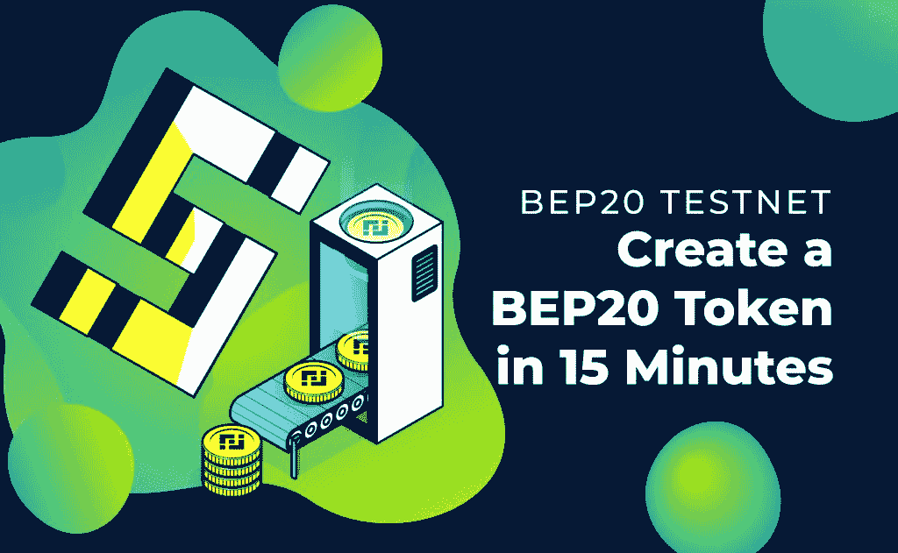
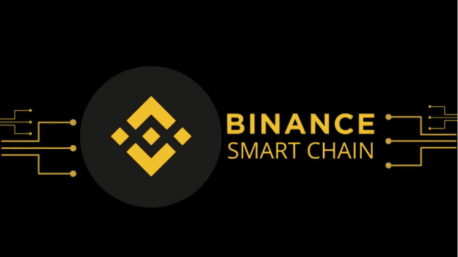
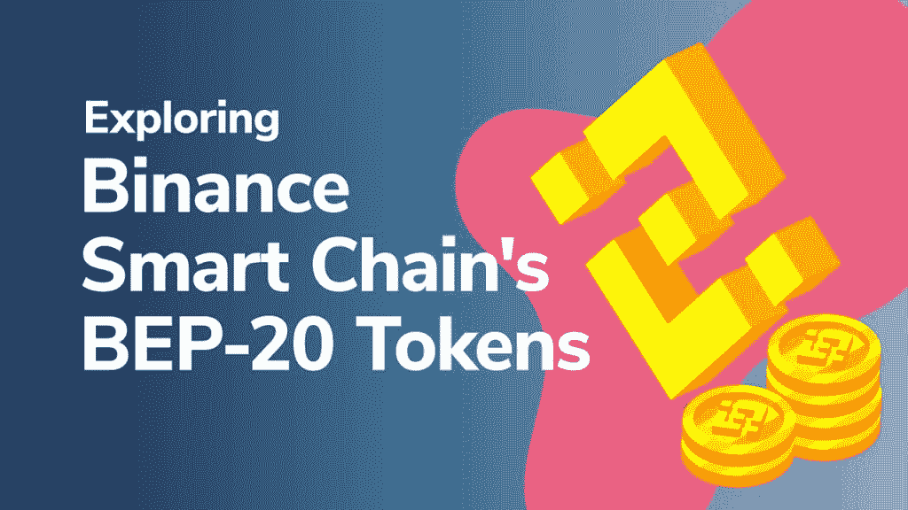
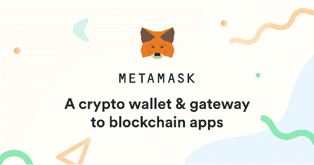
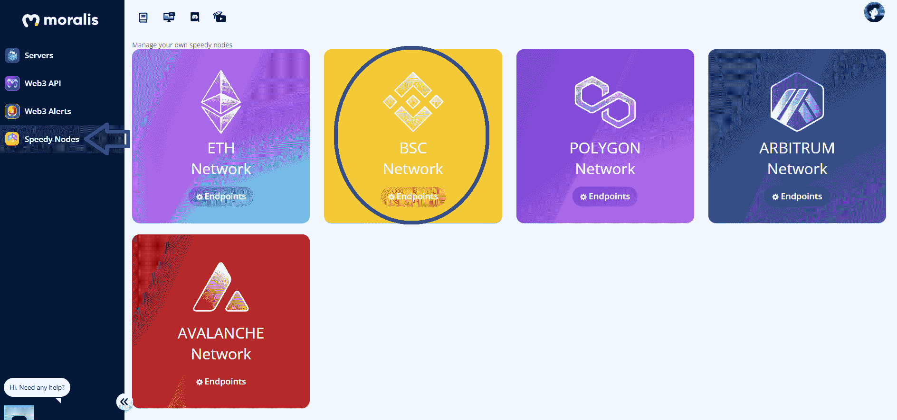
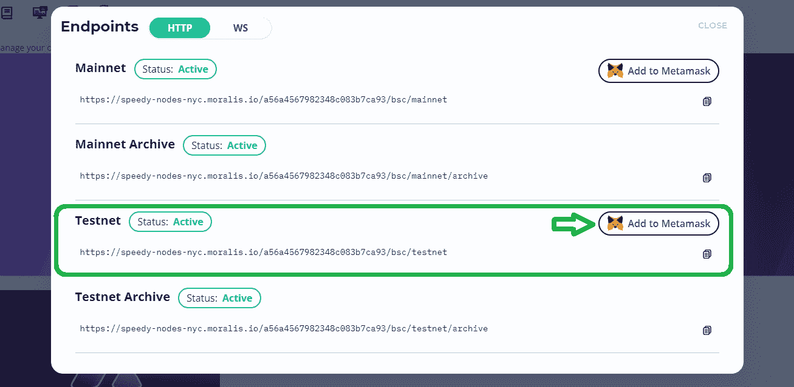
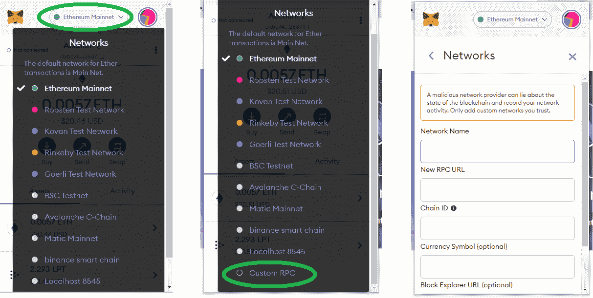
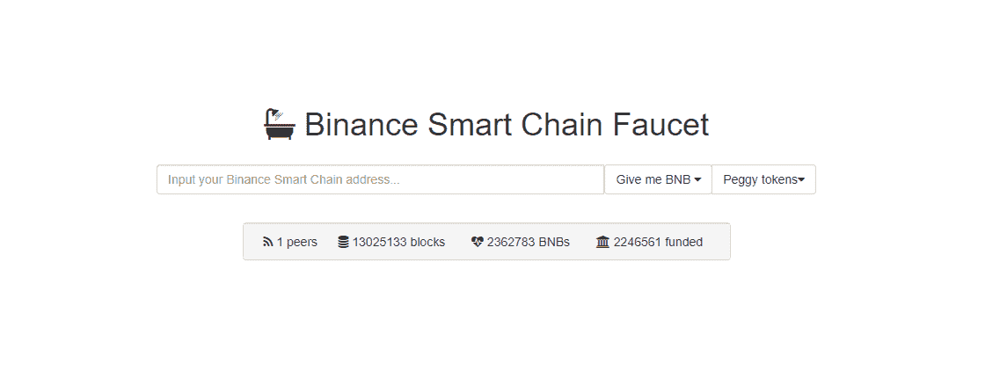
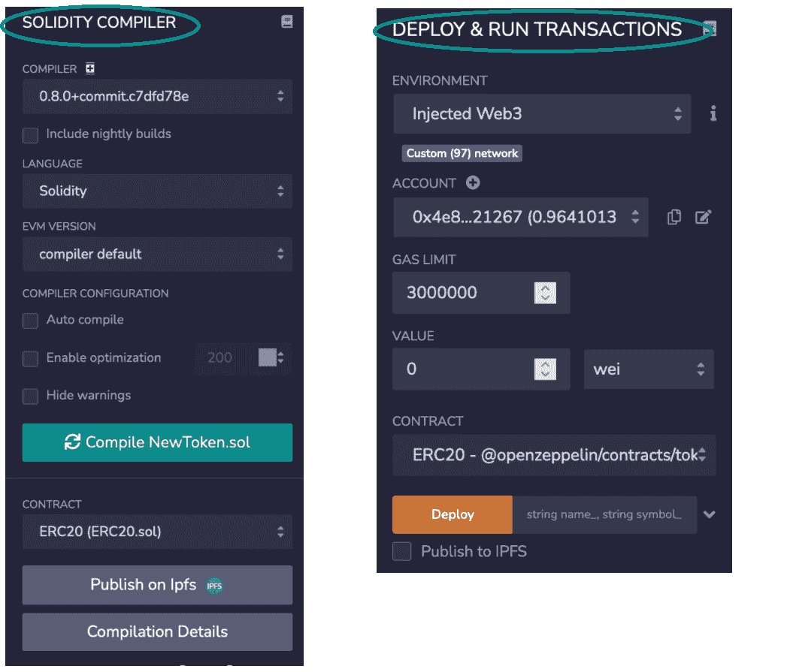

# BEP20 令牌开发—完整指南

> 原文：<https://moralis.io/bep20-token-development-full-guide/>

**你可能知道[以太坊](https://moralis.io/full-guide-what-is-ethereum/)的可编程区块链在[分散应用](https://moralis.io/decentralized-applications-explained-what-are-dapps/) (dApps)和令牌开发方面处于领先地位。然而，就其目前的工作证明(PoW)验证解决方案和拥塞而言，您也知道以太坊附带了高额的燃气费。因此，开发者正在寻找其他令牌开发链，其中币安智能链最受关注。此外，程序员发现 BEP20 令牌开发是一个很好的选择，因为他们的令牌吸引了更多的用户，因为 BEP20 令牌的交易费用更合理。然而，尽管有些人认为 BEP20 令牌开发具有挑战性，但合适的工具允许任何人轻松开发 BEP20 令牌。因此，请跟随我们向您展示 [Moralis](https://moralis.io/) 及其终极 [Web3](https://moralis.io/the-ultimate-guide-to-web3-what-is-web3/) 开发平台如何让 BEP20 令牌开发变得轻而易举。**

通过[创建您的免费 Moralis](https://admin.moralis.io/register) 帐户，您将能够按照我们的分步指南进行操作，并且[在几分钟内创建您的 BEP20 令牌](https://moralis.io/bep20-testnet-create-a-bep20-token-in-15-mins/)。然而，在我们通过创建一个示例项目来深入我们的教程之前，我们需要覆盖关于 BEP20 令牌的基础知识，包括 BEP20 和 BEP2 标准以及币安智能链和币安链之间的差异。

## **BEP 20 令牌开发基础**

尽管 BSC 很受欢迎，并被许多其他 Web3 项目使用，但它仍然不是每个人都知道的东西。然而，加密领域的大多数人都熟悉币安交易所。除此之外，币安是币安智能链的幕后支持者，该智能链首先支持所有可能的 BEP20 令牌开发。因此，让我们看看 BSC 和[币安智能连锁发展](https://moralis.io/bsc-programming-guide-intro-to-binance-smart-chain-development-in-10-minutes/)。

### **币安连锁还是币安智能连锁(BSC)？**

正如“币安智能链”中的“币安”一词所表明的，币安领先交易所背后的团队是我们要感谢的人，因为他们将这个有用的链带入了生活。现在，这个链条可能不像我们希望的那样分散。然而，根据区块链的三元悖论，通过牺牲去中心化，你可以提高安全性和可伸缩性。这正是 BSC 背后的开发人员在 2020 年脱离以太坊的区块链并创建 BSC 时所追求的。

此外，你应该知道币安连锁和币安智能连锁不是一回事。前者是币安创建的原始链，完全专注于存储交换交易。因此，它无法在那个特定的区块链上托管智能合约和所有复杂的交易。因此，开发商想出了一个解决方案，并创建了一个新的链-币安智能链。

此外，还要记住，两个链现在相互平行运行，各自服务于其主要目的——币安链促进交易，而 BSC 处理[智能合约](https://moralis.io/smart-contracts-explained-what-are-smart-contracts/)开发。此外，币安的生态系统使用了所谓的“双链”架构。后者支持两个链之间的无缝传输。因此，将资金从币安链分配到 BSC，反之亦然，是一个轻松顺利的过程。此外，这两个链共享同一个本地令牌，即 BNB。

如果您现在考虑到 BEP20 令牌开发需要使用智能契约这一事实，您就会明白我们将在示例项目中使用 BSC。

### **什么是 BEP20 代币？**

如果你熟悉 ERC20 令牌，理解什么是 [BEP20](https://academy.ivanontech.com/blog/exploring-binance-smart-chain-and-the-bep-20-token) 令牌是没有问题的。BEP20 是 BSC 在以太坊上的 ERC20 版本，但有一些小的不同，因为 BSC 是以太坊的一个分支，所以它基本上提供相同的功能。此外，BEP20 是 BSC 上可替换令牌的标准，它对令牌进行监管，包括保证令牌可交易、可设定初始数量等。

此外，请记住，BEP20 是 BSC 的令牌标准，而 BEP2 是币安链的令牌标准。此外，BSC 上还有针对 NFTs 的 BEP721 标准，它遵循以太坊的 ERC721 标准。记住， [NFT 编程](https://moralis.io/nft-programming-for-beginners/)最简单的方法是使用 Moralis 的即插即用 [NFT API](https://moralis.io/ultimate-nft-api-exploring-moralis-nft-api/) 。

此外，以下是一些著名的 BEP20 令牌:

*   BUSD
*   蛋糕
*   希腊字母的第一个字母
*   安全月
*   SXP
*   WBNB
*   合杀威杀虫剂
*   汉堡包

# **使用 Moralis 开发 BEP20 令牌**

我们将深入探讨使用 Moralis 进行 BEP20 令牌开发，因为它提供了在 BSC 上创建和部署令牌的最简单快捷的方法。要跟进，请确保[登录您的道德账户](https://admin.moralis.io/login)。如果你还没有账户，现在就花时间[注册你的免费账户](https://admin.moralis.io/register)。

此外，请记住，还有其他方法可以开发 BEP20 令牌；然而，我们将关注最快和最简单的方法。因此，除了 Moralis，我们将使用各种工具，如 [MetaMask](https://moralis.io/metamask-explained-what-is-metamask/) 、 [Remix](https://moralis.io/remix-explained-what-is-remix/) 和 OpenZeppelin。

## **BEP20 令牌开发准备**

现在您的 Moralis 帐户已经准备好了，我们可以继续初始设置过程和必要的步骤，使我们的 BEP20 令牌开发成为可能。这些步骤包括获得元掩码帐户并将其连接到 BSC 的网络，这将需要获得一个 BSC 节点——Moralis 使这变得容易，Moralis 是 BSC 的 [Infura。幸运的是，](https://moralis.io/infura-bsc-alternatives-the-best-alternative-to-infura-for-bsc/) [Moralis Speedy Nodes](https://moralis.io/speedy-nodes/) 大大简化了事情，本质上这是[连接到 BSC nodes](https://moralis.io/how-to-connect-to-bsc-nodes/) 的最佳方式。

### **BSC 主网络 vs 测试网络**

在我们查看连接到 BEP20 节点所需的确切步骤之前，我们必须告诉您有关 BSC 的 testnet 的信息。您可能已经知道，所有区块链网络基本上都有一个主网和各种测试网，BSC 也不例外。testnets 的伟大之处在于，它们使您能够测试您的智能合约和 dApps，而无需花费真正的资金。因此，我们总是建议从 BSC 的 testnet 上的 BEP20 令牌开发开始(这是我们在这里要关注的)。此外，请记住，当您使用 BSC 的 mainnet 时，实际步骤本质上是相同的。

唯一的关键区别是，BEP20 测试网上的 BEP20 令牌开发包括使用 BNB 硬币龙头，它提供免费的 BNB 硬币。然而，在 mainnet 上开发 BEP20 需要你获得真正的 BNB 硬币，你可以在任何一个集中交易所(CEX)获得。

### **获取元掩码**

我们将使用这个流行的加密钱包来上传您的新 BSC 令牌，并在发布时访问它们。获取元掩码很简单，钱包是免费的，可以从 [https://metamask.io](https://metamask.io/) 下载。首先，下载 MetaMask 浏览器插件，然后完成安装。此外，请确保将恢复单词存储在安全的地方。

### **连接到 BEP20 节点**

作为 BEP20 令牌开发准备工作的一部分，我们需要连接到一个 testnet 节点。因为我们将在 BSC 的 testnet 上创建我们的 BEP20 令牌，所以我们需要为币安智能链获取一个 testnet 节点。下面是获取 testnet 节点所需的步骤:

1.  登录您的 Moralis 帐户，访问您的 Moralis 管理面板。
2.  单击左侧菜单中的“Speedy Nodes”选项卡。这将为您提供几个网络选项(如下图所示)。
3.  由于我们即将承担 BEP20 令牌开发，您需要选择 BSC 的网络。您可以通过单击“BSC 网络”下的“端点”按钮来完成此操作。这将打开一个包含几个 URL 的弹出窗口，这些 URL 代表节点。

4.  当我们查看 testnet BEP20 令牌开发时，单击“testnet”旁边的“添加到元掩码”按钮:

*在使用*[*web socket*](https://moralis.io/websockets-explained-what-is-websocket/)*(WS)的情况下，“添加到元蒙版”按钮不会显示。这意味着你必须手动完成这个部分*。关于如何实现这一点的说明可在下面找到。

#### **如何更改元掩码网络**

Moralis 还为包括 BSC 节点在内的所有 Moralis 快速节点提供了 [WebSocket 支持](https://moralis.io/launching-websocket-support-for-all-moralis-speedy-nodes/)。如果您正在使用 WebSocket，您需要将 BSC 的 testnet 网络添加到 MetaMask，并手动切换到它。

要更改网络，您需要单击界面顶部的“网络”选项卡。将出现一个包含各种选项的下拉菜单(具体选项取决于您之前是否添加了其他网络)。然后选择“自定义 RPC”选项:

新窗口打开后，您需要添加以下信息:

*   **网络名称** : BSC Testnet
*   **新的 RPC URL** :“输入道德快速节点 URL”
*   **链条 ID** : 97
*   **货币符号** : BNB
*   **拦截浏览器网址**:https://testnet.bscscan.com

只需点击“保存”即可完成该过程。现在，您已经成功地将 BSC 的 testnet 网络添加到元掩码中。剩下的就是通过“网络”选项卡选择“BSC Testnet”。

### **让 BNB 推动交易**

如果我们使用 BSC 的 mainnet，我们需要得到真正的 BNB 硬币。然而，由于我们正在使用 testnet，我们可以使用免费的 BNB。要获得这些“游戏”资金，请访问[https://testnet.binance.org/faucet-smart](https://testnet.binance.org/faucet-smart)。进入网站后，在输入栏中输入您的元掩码钱包地址(单击元掩码界面顶部的“帐户”选项以复制地址)。点击“给我 BNB”按钮完成该过程。

## **BEP20 令牌开发–令牌创建**

通过完成上面的简单任务，我们已经为实际的令牌创建过程做好了一切准备。幸运的是，有额外的快捷方式可用。如您所知，BEP20 令牌遵循与 ERC20 标准相同的原则；因此，相同的工具可以用于 BEP20 令牌开发。此外，在线提供了针对 ERC20 和 BEP20 令牌的代码模板。使用这些，我们不必从头开始创建任何东西，但我们可以简单地对现有的和测试过的代码进行一些简单的调整。以下是我们将用来完成 BEP20 令牌开发的工具:

*   **Solidity**–我们将使用 [Solidity](https://moralis.io/solidity-explained-what-is-solidity/) (一种以太坊编程语言)对我们的智能合约进行编码，以便使用现有的 ERC20 智能合约模板。
*   **Remix**–我们将使用一个名为 Remix 的在线开发环境。
*   OpenZeppelin–我们将使用 open zeppelin 获得一个代码模板，只需进行最小的调整。

### **创建和启动 BEP20 令牌的步骤概述**

1.  **用 Remix** 创建一个合同文件——一旦进入 Remix 的官方网站，你就可以在界面左侧访问这个应用的默认工作区。只需左键单击“合同”文件夹，然后选择“新建文件”。您可以随意命名该文件。
2.  **使用 OpenZeppelin** 提供的令牌模板——我们将使用 OpenZeppelin 提供的经过测试的 [ERC20 智能合约模板。](https://docs.openzeppelin.com/contracts/4.x/erc20)
3.  **编写智能合同**–我们需要对模板代码进行必要的更改。这包括以下内容:
    *   将当前的标记名(“GLDToken”)更改为您想要的名称。
    *   从第一个构造函数中移除“uint256 initialSupply”(位于花括号内)。
    *   将当前的货币符号(股票代号“GLD”)和名称(“黄金”)更改为您想要的任何名称。
    *   在“_mint()”函数内，可以去掉“initialSupply”，用你想要的初始供应量的编号代替；但是，你不能简单地输入数字。例如，您可以键入:“100 * (10 ** uint256(decimals()))”，这意味着一旦部署合同，将生成 100 个令牌。

以下是之前(模板)和之后(应用的更改)的代码示例:

4.  **编译并部署合同**–在 Remix 中导航到顶部导航栏中的“Solidity Compiler”选项卡。然后选择正确的编译器版本(匹配上面代码中的 pragma 行)并选择有效的文件。点击“编译”按钮完成这一步。现在，转到“部署&运行事务”选项卡，选择“注入的 Web3”环境，并确保您的元掩码设置为正确的网络。

5.  **查看元掩码**中的令牌–单击“资产”选项卡，然后单击“添加令牌”。在这里，添加令牌的详细信息(地址)。你可以从 [BscScan](https://moralis.io/exploring-bscscan-full-guide/) (testnet)获得后者，你可以通过点击“Activity”选项卡，点击最近的交易，然后点击右上角的小箭头，直接从 MetaMask 访问后者。

### **BEP20 令牌开发-详细视频说明**

除了上面介绍的说明，我们建议观看我们的视频，其中 Moralis 的专家将带您一步一步地完成整个过程。通过看着他的肩膀，你将能够轻松地完成所有的编码步骤。此外，如果您已经完成了上面 BEP20 令牌开发准备部分中的步骤，请随意跳到视频中的 5:00 时间戳。

https://youtu.be/h4gQD7R1r94

## **BEP20 令牌开发-总结**

在今天的“BEP20 令牌开发”文章中，我们已经讨论了很多内容。此时，您知道 BEP20 令牌是币安智能链上遵循 BEP20 标准的可替换令牌，而 BEP 20 标准又遵循以太坊上的 ERC20 标准。您还了解了适用于币安链的 BEP2 标准。此外，您现在已经知道，当使用适当的工具时，BEP20 令牌开发变成了一个简单的过程。因此，即使是基本的编程技能也足以在几分钟内创建和部署您的 BEP20 令牌。此外，通过使用 Moralis 快速节点，您可以避免复杂的节点设置过程。最后，您将看到创建 BEP20 令牌需要完成的五个步骤:

1.  做简单的准备。
2.  创建一个再混合合同文件。
3.  导入 OpenZeppelin 模板。
4.  编写合同代码(对模板代码进行简单的调整)。
5.  编译和部署合同。

如果使用 Moralis 进行 BEP20 令牌开发似乎令人印象深刻，那么这只是开始触及 Moralis 所能提供的皮毛。其令人印象深刻的 [Web3 SDK](https://moralis.io/exploring-moralis-sdk-the-ultimate-web3-sdk/) 包括了全范围的[API](https://moralis.io/introducing-the-moralis-web3-api-v2/)(例如[制作 NFT 的最佳 API](https://moralis.io/best-api-to-mint-nfts-full-guide/))、对 [IPFS](https://moralis.io/what-is-ipfs-interplanetary-file-system/) 的原生支持、业界最好的[文档之一](https://docs.moralis.io/)等等。因此，当使用 Moralis 时，以太坊、币安[、Polygon](https://moralis.io/how-to-build-polygon-dapps-easily/) 和其他知名链上的 Web3 [开发就变成了所有关于前端的事情。此外，在](https://moralis.io/ethereum-development-for-beginners/) [Moralis 的博客](https://moralis.io/blog/)和 [Moralis 的 YouTube 频道](https://www.youtube.com/c/MoralisWeb3)上，我们制作了解释区块链发展各个方面的有用内容，并承担示例项目来帮助您提高 Web3 开发技能。因此，请务必保持关注，并从今天开始着手各种 Web3 项目！