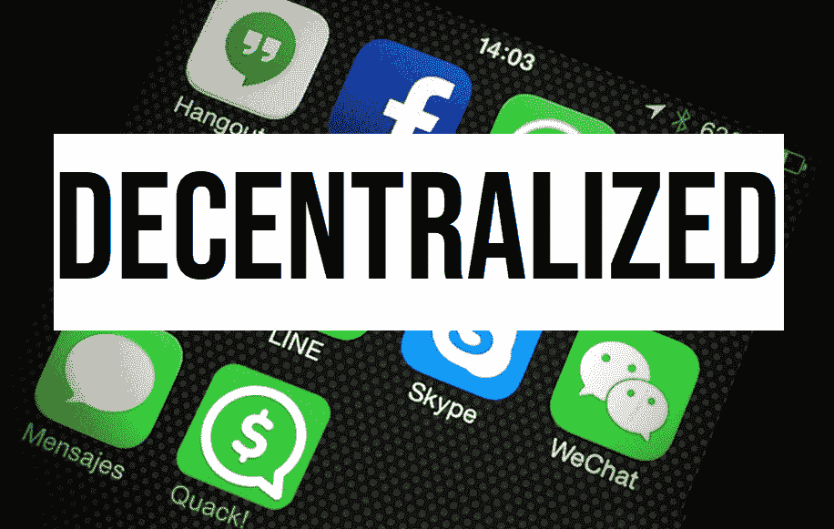
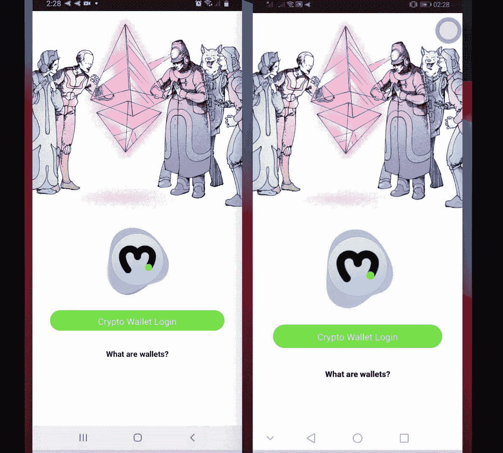
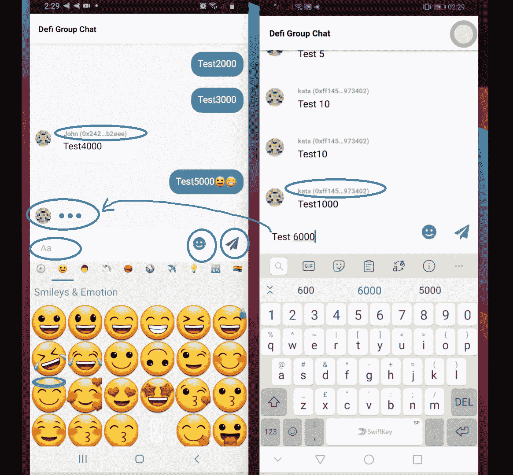
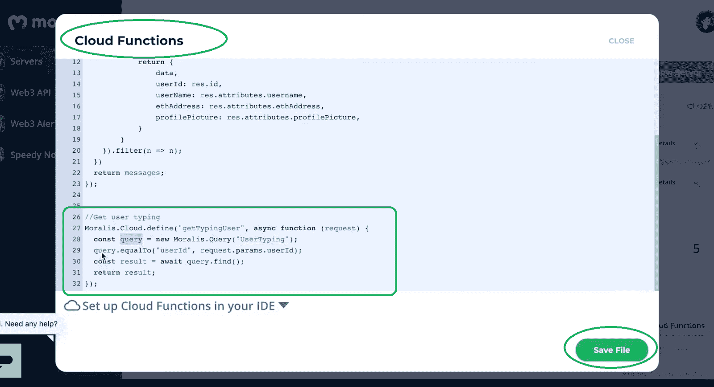

# 用 5 个步骤构建一个分散的消息应用程序

> 原文：<https://moralis.io/build-a-decentralized-messaging-app-in-5-steps/>

**无论我们使用的是 Web2 还是 Web3 应用程序，无缝通信功能都是关键要素。然而，在过去几年中，我们已经提高了对集中式社交媒体应用程序和消息应用程序上用户数据利用的认识。此外，直到 2015 年，我们还没有合适的工具来创建一个体面的分散式消息应用程序，以减轻用户对隐私问题的担忧。幸运的是，第一个可编程区块链——**[**以太坊**](https://moralis.io/full-guide-what-is-ethereum/) **的诞生，为开发者解决这一问题开辟了机会。六年过去了，我们现在已经有了几个可靠的可编程链，区块链开发者可以在这些链上构建分散的消息应用。在本文中，我们将仔细研究这一过程，并向您展示如何用 Moralis 的五个步骤构建一个去中心化的消息应用程序。**

此外，不久前，构建[分散应用](https://moralis.io/decentralized-applications-explained-what-are-dapps/) (dApps)的唯一方法是直接处理 [RPC 节点](https://moralis.io/ethereum-rpc-nodes-what-they-are-and-why-you-shouldnt-use-them/)。然而，事情已经有了显著的进展，我们现在有非凡的工具来帮助开发人员克服 RPC 节点的所有[限制。因此，在终极](https://moralis.io/exploring-the-limitations-of-rpc-nodes-and-the-solution-to-them/) [Web3](https://moralis.io/the-ultimate-guide-to-web3-what-is-web3/) 开发平台—[Moralis](https://moralis.io/)的帮助下，您现在可以在几分钟内创建 web dApps 和移动 dapp。多亏了 [Moralis 的 SDK](https://moralis.io/exploring-moralis-sdk-the-ultimate-web3-sdk/) 和两个令人难以置信的样板:终极 [Web3 样板](https://moralis.io/web3-boilerplate-beginners-guide-to-web3/)和[以太坊移动样板](https://moralis.io/ethereum-mobile-boilerplate-full-guide-to-ethereum-for-mobile/)。此外，我们将很快使用其中的一个来构建一个分散的消息应用程序。此外，Moralis(又名 [Firebase for crypto](https://moralis.io/firebase-for-crypto-the-best-blockchain-firebase-alternative/) )的设计具有跨链互操作性；因此，它使您能够跨多个链部署 dApps，从而使您的开发经得起未来的考验。因此，如果你准备好学习如何充分利用 Moralis 并创建自己的分散式消息应用程序，让我们直接进入以下部分。



## 分散式消息应用预览

在我们开始“构建您自己的分散式消息应用程序”之前，我们想向您展示我们的分散式消息应用程序的完成版本。此外，由于这是一个为区块链开发的完全初学者设计的示例项目，我们尽可能保持简单。然而，尽管简单，我们确保我们的分散式消息应用程序包含了所有基本功能，并且看起来非常整洁。

### 用户登录

和大多数集中式应用一样，“登录”的能力对于分散式应用来说也很正常。然而，我们可以使用加密钱包(如 MetaMask)来代替电子邮件和密码。我们的分散式消息应用通过最好的移动[以太坊认证](https://moralis.io/ethereum-authentication-full-tutorial-to-ethereum-login-programming/)解决方案之一—[wallet connect](https://moralis.io/what-is-walletconnect-the-ultimate-walletconnect-guide/)覆盖了这一特性。通过点击我们的消息应用程序的“加密钱包登录”按钮(见下面的截图)，用户的钱包应用程序会提示用户确认身份验证。



### 我们的分散式消息应用程序的功能

成功登录后，用户会立即被定向到聊天窗口。在那里，他们可以阅读和发送文本和表情符号。我们为相应的按钮使用表情符号和纸飞机图标来表示这些动作。一旦用户点击纸飞机图标，他们就发送在他们的设备上输入的文本和表情符号。而且，下面两个移动设备的截图也向你展示了“打字”功能。这意味着我们确保了我们的分散式消息应用程序也能检测到其他用户何时在打字。它用三个不同步闪烁的点来模拟。此外，您还可以在发送的消息旁边看到用户的姓名及其钱包地址(用于验证的地址)。但是，如果消息是由当前用户发送的，则消息会有不同的颜色，并且上面没有姓名或地址。



上面的解释，结合截图，清楚地描绘了我们将要创造的东西。而且，你可以看到 dApp 相当简单(如前所述)；然而，它还集成了当今大多数消息应用程序的所有核心功能。考虑到最终目标，是时候采取五个步骤来构建你自己版本的分散式消息应用程序了。

## 用 Moralis 的 5 个步骤构建一个去中心化的消息应用

如前所述，是时候进行一个示例项目了，它将使您能够通过五个步骤构建自己的分散式消息传递应用程序。当然，为了给你分解事情，我们把这五个主要步骤分成了简单的子步骤，你可以随着我们的进展来完成。通过这样做，您将了解如何使用以太坊移动样板并添加必要的功能，以实现一个分散的消息传递应用程序。这是我们需要完成的五个步骤:

1.  **道德设置**
2.  **以太坊移动样板快速入门和初始代码调整**
3.  **添加发送功能**
4.  **启用已发送信息的显示**
5.  **增加“打字”功能**

前两步将指导您完成设置过程，以便 Moralis 能够满足您的后端需求，并且您不必从头开始构建 dApp。相反，您将能够使用样板文件的移动 dApp，它已经提供了一个干净的接口和认证功能。在我们开始第一步之前，让我们也提一下 Moralis 和 Ethereum mobile boilerplate 的结合使您能够同时创建 Android 和 iOS 应用程序。后者使这一强大的组合成为终极[以太坊 iOS 开发套件](https://moralis.io/the-ultimate-ethereum-ios-dev-kit/)。


### 步骤 1:创建 Moralis 服务器

通过创建 Moralis 服务器，您可以获得其完整的后端功能。而且，这一步也是使用以太坊移动样板必不可少的。以下是您需要遵循的步骤:

1.  [**创建一个免费的 Moralis 账户**](https://admin.moralis.io/register)——点击该链接，您将通过输入您的电子邮件和密码来创建您的免费账户。您还需要通过单击发送给您的电子邮件中的确认链接来确认您的帐户。然而，如果你已经创建了你的道德账户，只需[登录](https://admin.moralis.io/login)。

[**创建一个 Moralis 服务器**](https://docs.moralis.io/moralis-server/getting-started/create-a-moralis-server)–进入 Moralis 管理区域后，选择“服务器”选项卡(如下图所示)。接下来，单击右上角的“+创建新服务器”按钮，并从下拉菜单中选择网络类型。当处理示例项目时，我们建议选择“Testnet 服务器”选项(查看我们的[以太坊 testnet](https://moralis.io/ethereum-testnet-guide-connect-to-ethereum-testnets/) 指南)。然而，当你想让你的 Web3 应用上线时，你需要选择“Mainnet 服务器”。


选择网络类型后，将出现另一个弹出窗口。在那里，您需要输入服务器的名称，选择区域、网络和链。然后，单击“添加实例”启动您的服务器。 *T2】*


3.  **访问服务器详细信息**–现在您的服务器已经启动，您可以通过服务器名称旁边的“查看详细信息”按钮来访问其详细信息:


然后复制您的应用程序 ID 和服务器 URL:


**初始化道德规范**–*注意:进入下一步，稍后完成此步骤。*一旦您克隆了以太坊移动样板文件，您将会在。env”文件，以获得 Moralis 的 SDK 提供的全部后端功能。


*注意**:Do****NOT****使用上图中的细节；请粘贴您的特定服务器的详细信息。*

### 第二步:移动样板快速入门

如前所述，道德和我们的移动 dApp 样板都是关于简单和速度。因此，开始使用这两种工具非常简单。此外，现在您已经准备好了 Moralis 服务器，是时候完成下面的快速入门部分了:


#### 样板快速入门演练

你们大多数人会发现自己完成上面显示的步骤很简单；然而，为了避免任何不必要的混乱，让我们来指导您完成这个过程。

1.  克隆或派生以太坊移动样板。您可以在样板文件的 GitHub 页面上单击 GitHub URL 旁边的复制图标:


2.  接下来，打开你的代码编辑器(我们通常使用 Visual Studio 代码[VSC])。然后，打开一个新终端，将复制的 URL 粘贴到终端的命令行中:


3.  现在是全球安装“expo CLI”的时候了。您可以通过在终端中键入“ ***”来完成此操作。同样，从 GitHub 复制代码，然后粘贴到终端:***


4.  在代码编辑器中找到“. env.example”文件，并将其重命名为”。env”。然后，用您的 Moralis 服务器的 URL 和应用程序 ID 填充这个文件(第一步的第四个子步骤):


5.  将 Moralis 服务器的详细信息粘贴到指定区域后，您需要安装所有的依赖项。虽然，因为你很可能已经在这个文件夹中，你可以跳过"*CD ether eum-react-native-boilerplate*命令。因此，继续执行以下命令–在终端中键入或粘贴“*纱线安装”*:


6.  至此，您已经为运行样板 dApp 做好了一切准备。由于您为此需要使用的实际命令取决于您正在使用的操作系统，因此请确保做出相应的选择:

*   **网**:纱网
*   **iOS** :纱线 iOS
*   **安卓**:纱安卓

为了这个“用五个步骤构建一个去中心化的消息应用”项目，我们将关注 Android。因此，使用“yarn android”命令运行 dApp。


#### 对样板代码进行调整

“ [App.tsx](https://github.com/ethereum-boilerplate/web3-chat-app-react-native/blob/master/frontend/App.tsx) ”文件是编写应用程序结构代码的地方。因此，我们需要在这个文件中创建一个适当的导航容器:

```js
function App(): JSX.Element {
  const connector = useWalletConnect();
  const {
    authenticate,
    authError,
    isAuthenticating,
    isAuthenticated,
    logout,
    Moralis,
  } = useMoralis();

  return (
    <NavigationContainer>
      <Stack.Navigator initialRouteName="SplashScreen">
        {/* SplashScreen which will come once for 5 Seconds */}
        <Stack.Screen
          name="SplashScreen"
          component={SplashScreen}
          // Hiding header for Splash Screen
          options={{ headerShown: false }}
        />
          <Stack.Screen
            name="Auth"
            component={CryptoAuth}
            options={{ headerShown: false }}
          />
          <Stack.Screen
            name="Home"
            component={Home}
            options={{ headerTitle: (props) => <Header /> }}
          />
      </Stack.Navigator>
    </NavigationContainer>
  );
}
```

另一个值得一提的文件是“ [CryptoAuth.js](https://github.com/ethereum-boilerplate/web3-chat-app-react-native/blob/master/frontend/Components/CryptoAuth.js) ”。在其他细节中，它包含“handleCryptoLogin”函数。这是我们需要应用各种调整的地方，以便聊天窗口将在用户登录后显示。这是您需要关注的代码部分:

```js
  const handleCryptoLogin = () => {
    authenticate({ connector })
      .then(() => {
        if (authError) {
          setErrortext(authError.message);
          setVisible(true);
        } else {
          if (isAuthenticated) {
            navigation.replace("Home");
          }
        }
      })
      .catch(() => {});
  };

  useEffect(() => {
    isAuthenticated && navigation.replace("Home");
  },[isAuthenticated])
```

## 使用 Moralis 构建分散式消息应用程序–步骤 3、4 和 5

通过完成前两个步骤，您已经准备好承担构建分散式消息传递应用程序所需的实际编码工作。此外，请记住，虽然创建自己的 Moralis 服务器是用 Moralis 创建 dApps 的重要部分，但使用样板文件不是。因此，如果你是一个熟练的本地开发者，喜欢从头开始构建你的分散式消息应用，请随意。

然而，由于我们的以太坊移动样板 dApp 是一个引人注目的快捷方式，我们建议您将其作为一个起点。然后，应用调整并添加额外的代码以获得期望的结果——这是我们采用的方法。

尽管如此，为了进一步简化这个示例项目，我们在 [GitHub](https://github.com/ethereum-boilerplate/web3-chat-app-react-native) 提供了完整的分散式消息应用程序代码。因此，在我们执行第三步到第五步时，请使用这段代码。当然，通过详细比较样板代码和最终代码，您可以随意探索应用于样板 dApp 的细节和变化。然而，我们将把重点放在我们完成的分散式消息应用程序向前发展所需的代码行上。

### 步骤 3:添加发送功能

在“ [Chat.js](https://github.com/ethereum-boilerplate/web3-chat-app-react-native/blob/master/frontend/Components/Chat/Chat.js) ”文件中，我们涵盖了我们的分散式消息应用程序的所有上述功能。此外，为了正确处理消息，我们将使用 Moralis 的数据库，它随每个 Moralis 服务器提供。以下是您访问它的方式:


进入仪表板后，创建一个名为“Messages”的新类，用于存储消息:


在 Moralis 仪表板中准备好这个特殊的类后，您可以使用下面几行代码正确地处理消息:

```js
  const newMessage = new Moralis.Object("Messages");
  const newUserTyping = new Moralis.Object("UserTyping");
```

上面两行代码用于“sendMessage”函数。后者确保消息保存在“messages”类的右列中:

```js
  const sendMessage = () => {
    newMessage.set('userId', currentUserId);
    newMessage.set('message', message);
    newMessage.save();
  }
```

这意味着我们现在已经确保所有用户发送的所有消息都存储在您的仪表板中。

### 步骤 4:启用已发送邮件的显示

接下来，我们需要添加代码，以便在我们的分散式消息应用程序中显示消息。为此，我们使用 Moralis 的云功能选项，该选项也适用于每台 Moralis 服务器:


上图中显示的云函数使我们能够使用“getAllMessages”函数在消息应用程序中显示消息:

```js
  const getAllMessages = async () => {
    const result = await Moralis.Cloud.run("getAllMessages");
    setMessages(result)
  }
```

此外，我们使用“subscribeToMessages”功能来确保应用程序中显示的所有消息实时更新:

```js
  const subscribeToMessages = async () => {
    let query = new Moralis.Query('Messages');
    let subscription = await query.subscribe();
    subscription.on('create', notifyOnCreate);
  }

  const notifyOnCreate = (result) => {
    setUpdated(result)
  }
```

本质上，上面的函数为用户订阅了我们的 Moralis 数据库(之前创建的)中的“Messages”类。

### 步骤 5:添加“键入”功能

“打字”功能决不是必不可少的；然而，它提供了一种很好的感觉，因为知道其他用户什么时候在打字很好。因此，我们需要跟踪用户的输入，并在聊天中将其动画化。为了设置这个功能，我们使用与前两步相同的 Moralis 工具。首先，您需要创建一个名为“UserTyping”的新类:


接下来，继续创建另一个云函数，它将帮助我们填充数据库:



此外，按照“subscribeToMessages”示例，我们创建了“subscribeToTyping”函数。后者将确保在我们数据库的指定列中检测并正确标记打字:

```js
const subscribeToTyping = async () => {
    let query = new Moralis.Query('UserTyping');
    let subscription = await query.subscribe();
    subscription.on('create', notifyOnType);
    subscription.on('update', notifyOnType);
  }

  const notifyOnType = async (result) => {
    setOtherUserTyping(result)
  }
```

此外，我们还需要两个额外的函数来获得我们想要的功能——“onChangeText”和“Type”函数:

```js
  const onChangeText = (message) => {
    setMessage(message);
    Type(currentUserId);
  }

  const Type = async (userId) => {
    const params = { userId: userId };
    const result = await Moralis.Cloud.run("getTypingUser", params);

    if (result.length > 0) {
      result[0].set('isTyping', true);
      result[0].save();
    } else {
      newUserTyping.set('userId', userId);
      newUserTyping.set('isTyping', true);
      newUserTyping.save();
    }
  }
```

此外，我们的代码需要能够检测用户何时停止输入。为此，我们使用“停止键入”功能:

```js
  const stopTyping = () => {
    if (otherUserTyping && otherUserTyping.attributes.isTyping) {
      otherUserTyping.set('isTyping', false);
      otherUserTyping.save();
    }
  }

  useEffect(() => {
    setTimeout(() => {
      stopTyping();
    }, 5000)
  }, [otherUserTyping]);
```

*注意* *:正确理解上述功能可能会有挑战性。因此，我们鼓励您查看“Chat.js”文件的完整代码。*

此外，如果你更喜欢看视频，我们建议看一下 Moralis 的一位专家，他会采取贯穿本文的步骤:

https://www.youtube.com/watch?v=5HIsa26LnYY

## 通过 5 个步骤构建分散式消息传递应用程序——总结

如果你已经正确地遵循了上面提供的说明，现在你已经有了自己的分散式消息应用程序。通过完成以下五个步骤，您不仅创建了一个有用的 dApp 示例，还了解了 Moralis 如何让精通 JavaScript 的开发人员变得简单易行。

以下是构建分散式消息应用程序必须完成的五个步骤:

1.  **道德规范设置。**
2.  以太坊移动样板快速启动和初始代码调整。
3.  **增加发送功能。**
4.  **显示已发送的信息。**
5.  **增加“打字”功能。**

如果你对这里的示例项目感兴趣，我们鼓励你访问[道德的 YouTube 频道](https://www.youtube.com/c/MoralisWeb3)和[道德的博客](https://moralis.io/blog/)。后者也是了解区块链发展各种概念的好地方。例如，我们的一些最新文章向您展示了如何[创建一个 OpenSea 克隆](https://moralis.io/create-an-opensea-clone-build-an-nft-marketplace-like-opensea/)，如何[在没有汽油费的情况下创建 NFT](https://moralis.io/how-to-mint-nfts-without-gas-fees/)，如何[为 Web3 创建一个 Reddit 克隆](https://moralis.io/create-a-reddit-clone-for-web3-step-by-step-guide/)，如何[用一行代码发送以太坊交易](https://moralis.io/ethereum-send-transaction-basics-send-ethereum-with-one-line-of-code/)，如何[创建懒惰的 NFT](https://moralis.io/how-to-lazy-mint-nfts/)，等等。

另一方面，如果你还不知道 JavaScript，我们建议你报名参加 Moralis Academy 的 [2021 区块链开发者 JavaScript 编程](https://academy.moralis.io/courses/javascript-programming-for-blockchain-developers)课程。这样，您将学习这种实用的通用语言，以及如何在加密领域中最好地使用它。此外，一定要去看看[道德学院](https://academy.moralis.io/)的其他有价值的课程。他们将为你提供全职加密所需的知识。

