# 使用元掩码创建 Web3 Firebase 登录

> 原文：<https://moralis.io/create-a-web3-firebase-login-with-metamask/>

**无论您着手创建什么类型的 Web3 项目，大多数 dapps(分散式应用程序)需要的一个核心功能是基于区块链的认证** **解决方案的** [**集成。此外，将您的 Web3 身份验证流程与后端服务(例如 Firebase)集成在一起非常有益，可以有效地存储用户信息。考虑到这一点，您是否知道**](https://moralis.io/blockchain-based-authentication-how-to-integrate/)[**Moralis**](https://moralis.io)**提供了使用 MetaMask 创建 Web3 Firebase 登录的最简便方法？如果您对此感兴趣，请继续学习，因为本教程从头到尾涵盖了使用元掩码添加 Web3 Firebase 登录的过程！**

该指南通过向您展示如何设置一个简单的 React 应用程序来说明整个过程，在该应用程序中，用户可以使用他们的元掩码钱包进行登录。此外，由于有了 [Moralis 的 Auth 扩展](https://docs.moralis.io/docs/nodejs-demo-firebase-auth-ext)，您可以立即使用 MetaMask 创建 Firebase 登录。此外，该过程可以分为以下几个部分:

1.  设置 Firebase
2.  启动 Firebase CLI
3.  设置 Moralis 的授权扩展
4.  部署扩展
5.  创建 React 应用程序

此外，如果你想了解更多关于 Web3 认证的知识，请查看 Moralis 的 [Web3 认证 API](https://moralis.io/authentication/) 。这个优秀的工具是 Moralis 提供的众多企业级[web 3 API](https://moralis.io/web3-apis-exploring-the-top-5-blockchain-apis/)中的一个。使用这个工具，您可以轻松地添加几个身份验证机制。例如，学会使用 RainbowKit 在几分钟内[添加签到！](https://moralis.io/how-to-add-a-sign-in-with-rainbowkit-to-your-project-in-5-steps/)

然而，无论你想创建什么类型的区块链相关项目，[与 Moralis](https://admin.moralis.io/register) 签约，用优秀的开发工具更快更智能地构建 Web2 和 Web3 开发之间的桥梁！

## 你在朝什么方向努力？–添加带元掩码的 Firebase 登录

如前所述，本教程演示了如何使用元掩码创建 Web3 Firebase 登录。为了说明这个过程，我们将向您展示如何创建一个简单的 React 应用程序，您可以在其中使用您的 [Web3 wallet](https://moralis.io/what-is-a-web3-wallet-web3-wallets-explained/) 登录。此外，这是登录页面的外观:

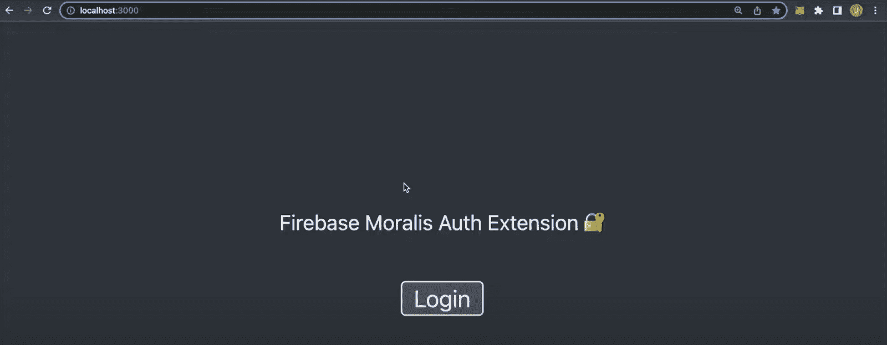

一旦你点击“登录”按钮，它应该提示你的元掩码钱包，假设你已经安装了浏览器扩展:

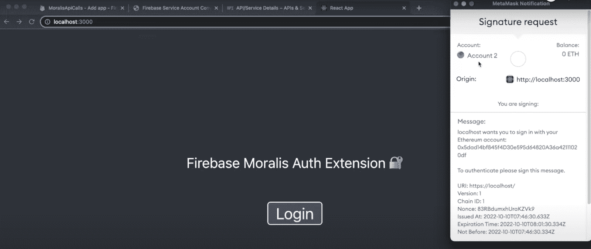

当您签署邮件并验证自己时，应用程序将显示一个用户 ID:

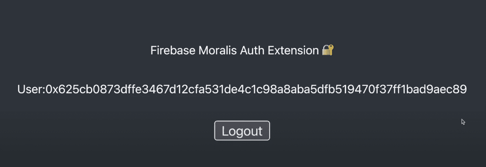

除此之外，该应用程序将在“身份验证”选项卡下向 Firebase 添加一个具有相同 ID 的新用户:


然后，您可以将此功能与其他 Firebase 服务(如数据库)集成。如果这听起来很有趣，并且您想学习如何使用 MetaMask 创建 Web3 Firebase 登录，请加入我们，因为下面的部分将一步一步地介绍整个过程！

## 添加带元掩码的 Firebase 登录–完整的分解

有了更好的想法，现在是时候进入本教程的中心部分，向您展示如何使用 MetaMask 创建 Web3 Firebase 登录。在这篇简短的指南中，我们将使用 Moralis 的 Auth 扩展，让您可以立即完成本文的任务！


由于 Moralis 的可访问性，您将能够通过设置 Firebase、启动 Firebase CLI、设置 Moralis 的 Auth 扩展、部署扩展以及创建一个简单的 React 应用程序来实现这一惊人的特性。此外，为了使本教程更容易理解，本指南将根据我们前面介绍的步骤分成不同的部分！

现在，如果你是一个视频学习者，请仔细看看下面的 [Moralis YouTube](https://www.youtube.com/channel/UCgWS9Q3P5AxCWyQLT2kQhBw) 视频，它更详细地概述了使用 MetaMask 创建 Web3 Firebase 登录的过程:

[https://www.youtube.com/embed/2HLxYYmZp94?start=370&feature=oembed](https://www.youtube.com/embed/2HLxYYmZp94?start=370&feature=oembed)

尽管如此，让我们通过仔细研究如何设置 Firebase 来开始本教程！

### 1.设置 Firebase

要开始本“*使用 MetaMask* 创建 Web3 Firebase 登录”教程，您必须首先设置 Firebase。如果您还没有，请浏览 Firebase 网站并单击“开始”按钮:

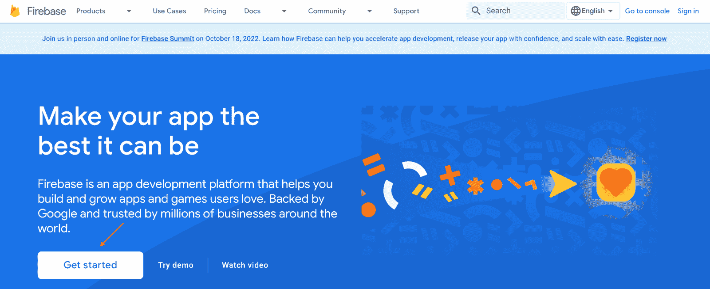

单击上面的按钮，您可以创建一个帐户，登录后，使用下面的按钮创建一个新项目，并按照说明进行操作:


一旦你创建了你的项目，你将到达 Firebase 管理面板。从这里开始，您必须做的第一件事是更改计费计划。Firebase 项目默认包含“星火计划”；但是，你想从“星火计划”切换到“Blaze”。相应地，点击底部的“升级”按钮并选择“火焰”:

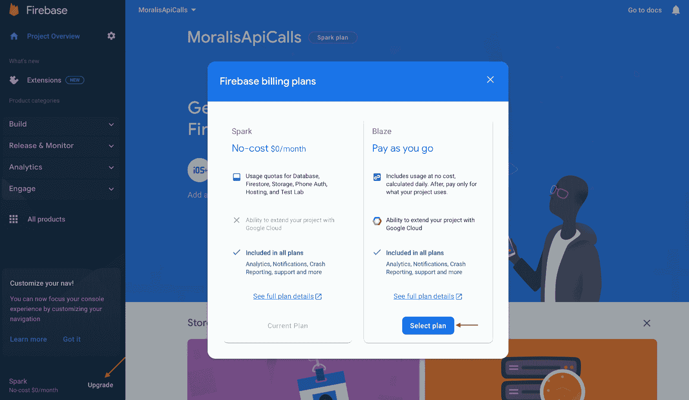

此外，您会很快注意到“Blaze”是一个“随用随付”的计费计划。然而，你仍然有一个免费的限制，只有当你的应用程序获得大量的牵引力时才会被收费，在教程中你现在不必担心。

接下来，点击 Firebase 管理面板左侧的“构建”选项卡，按“验证”，然后点击“开始”:


最后，单击管理面板顶部的齿轮，按“项目设置”，选择“服务帐户”选项卡，并生成一个新的私钥:

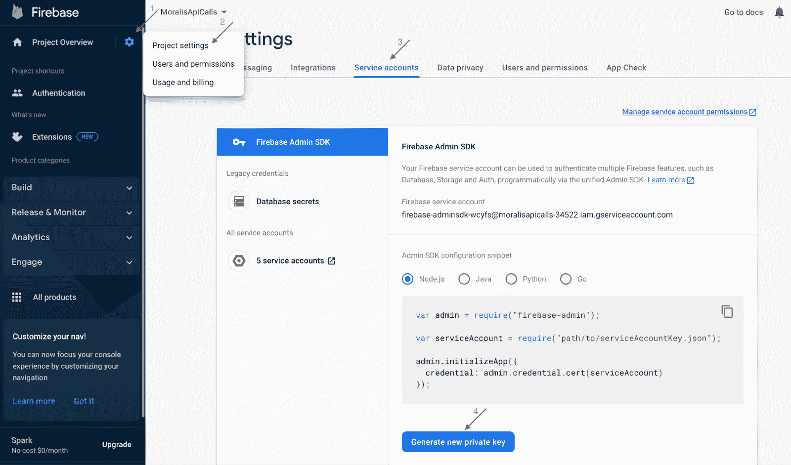

生成新的私钥会将文件下载到您的设备上。然后，您可以将该文件的内容粘贴到 Moralis 的 [Firebase 服务帐户转换器](https://moralisweb3.github.io/firebase-extensions/service-account-converter/)中，并接收使用 MetaMask 设置 Firebase 登录所需的必要扩展参数:

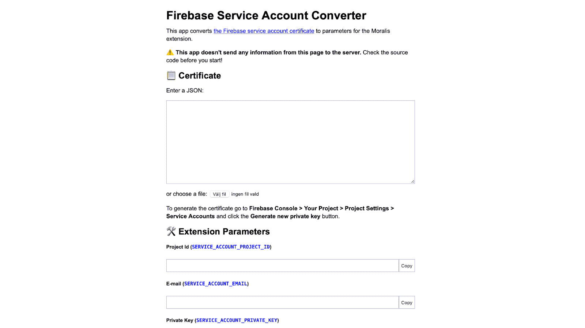

这涵盖了 Firebase 的初步设置和本“*使用 MetaMask 创建 Web3 Firebase 登录*”教程的第一部分。以下部分将说明如何设置 Firebase CLI(命令行界面)！

### 2.启动 Firebase CLI

在项目中实现带有元掩码的 Firebase 登录的下一步是安装 Firebase CLI。为此，请打开一个 IDE(集成开发环境)并设置一个新的文件夹/存储库。我们在这个 [Web3 Firebase 认证](https://moralis.io/web3-firebase-authentication-create-a-web3-sign-in-with-moralis/)教程中使用 VSC (Visual Studio 代码)。如果您选择另一种方法，请注意工作流程可能会有所不同。

IDE 打开后，您必须启动一个新的终端。如果您和我们一样使用 VSC，请点击顶部的“终端”选项卡，然后点击“新终端”:


在终端打开的情况下，通过在终端中输入以下命令，确保在本地计算机上安装 Firebase 工具:

**对于 macOS:**

```js
sudo npm install -g firebase-tools
```

**对于 Windows:**

```js
npm install -g firebase-tools
```

接下来，使用下面的命令登录 Firebase:

```js
firebase login
```

登录后，通过在终端中运行以下命令来启动 Firebase 项目:

```js
firebase init hosting
```

从这里，您可以选择一个现有的项目，该项目应该与您在上一节中设置的 Firebase 项目相对应:


然后，您可以选择要用作您的公共目录的内容，在这种情况下，您可以输入以下内容并按 enter 键:

```js
frontend/build
```

最后，对于“配置为…”这两个选项，选择“否”和“设置自动构件…？”问题:


这就是 Firebase CLI 的安装过程！如果您遵循并执行了正确的命令，那么现在您的本地目录中应该有一个与此类似的结构:


### 3.设置 Firebase 身份验证扩展

现在是时候设置 Moralis 的 Firebase Auth 扩展了，因为这就是如何添加带有 MetaMask 的 Web3 Firebase 登录。因此，直接跳回终端并运行以下命令:

```js
firebase ext:install moralis/moralis-auth
```

对于第一个提示，选择“是”，选择“爱荷华…”选项，并选择将您的秘密存储在“Google Cloud Secret Manager”上:


一旦您选择了“Google Cloud Secret Manager”选项，可能会导致类似下图所示的错误:


如果您遇到此问题，请访问终端中的链接，它会将您带到如下所示的页面:


在那里，您需要通过单击“禁用 API”来禁用和重新启用 API:


这将带您进入“Secret Manager API”页面，您可以在其中启用 API:


现在，等几分钟。然后，通过再次从上面向终端输入命令来重复该过程:

```js
firebase ext:install moralis/moralis-auth
```

这一次，它应该不会导致错误。相反，您现在需要输入您的 Moralis API 密钥:


因此，如果您还没有，请确保立即[设置您的道德账户](https://admin.moralis.io/register)。有了自己的帐户，您可以通过登录 Moralis，点击“account”选项卡，点击“Keys ”,最后复制 Web3 API 密钥来获取 API 密钥:


输入 API 键并按回车键后，您需要添加一个网站 URL。在这种情况下，输入以下内容:

```js
https://localhost
```

从那里，终端将提示您输入“服务帐户的项目 ID ”,您可以从 Moralis 的 Firebase 服务帐户转换器中获得该 ID:

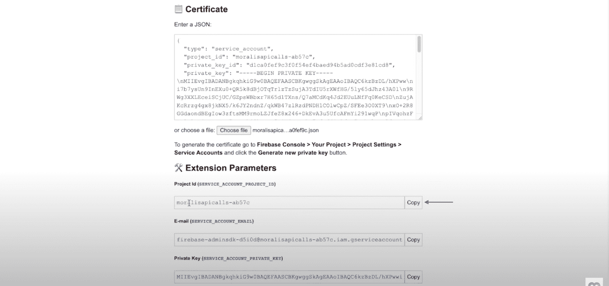

最后，终端将询问“服务帐户的电子邮件”和“服务帐户的私钥”，您可以从 Firebase 服务帐户转换器获得:

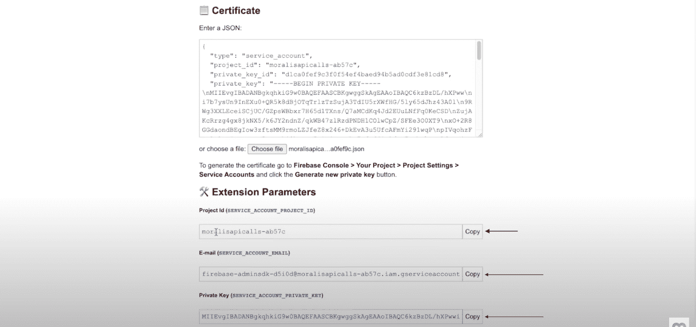

### 4.部署扩展

本节将向您展示如何部署 Moralis Auth 扩展。因此，要部署扩展，请在终端中输入以下命令:

```js
firebase deploy --only extensions
```

一旦你运行上面的命令，它会提示一些问题，你可以选择“是”。此外，这可能需要几分钟时间；然而，不用担心；扩展将很快部署。

如果一切都部署成功，您现在应该能够在 Firebase 管理面板中找到 Moralis Auth 扩展。要进行检查，请单击“构建”选项卡，然后单击“扩展”:

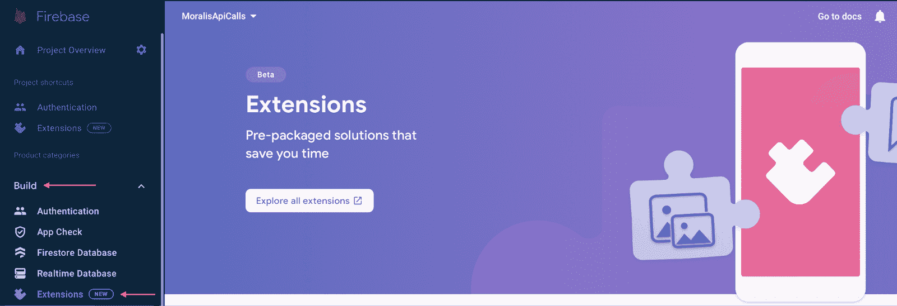

现在，有了 Moralis Auth 扩展供您使用，您必须使用 React 应用程序进行尝试。因此，下一节将更深入地探讨如何创建应用程序，并测试一切是否按预期运行。

### 5.创建应用程序

如果您仔细查看您的本地目录，您会注意到“前端/构建”文件夹。这最初包含两个文件；然而，我们希望用 React 应用程序来代替它们。在这种情况下，我们将使用一个已经准备好的模板，您可以在下面找到该项目的完整代码:

**完整的 React App 文档—**[**https://github . com/moralisweb 3/YouTube-tutorials/tree/main/firebaseautextension**](https://github.com/MoralisWeb3/youtube-tutorials/tree/main/FirebaseAuthExtension)

**从上面的存储库中复制所有文件，并将它们实现到“前端”文件夹中。因此，您的 IDE 现在应该如下所示:**

**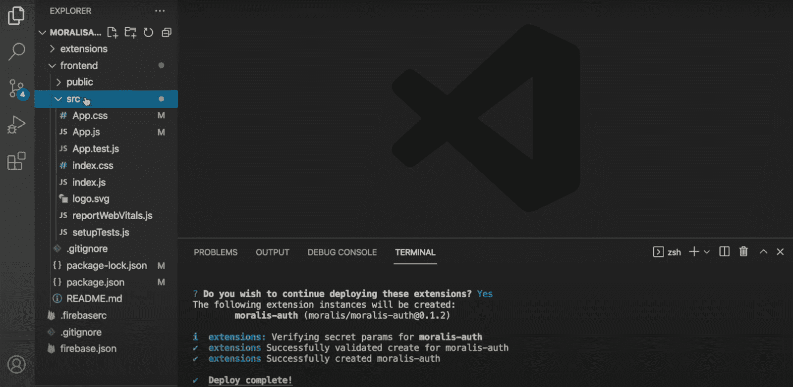

在那里，您需要做的就是将您的 Firebase 配置添加到第八行的“src/App.js”文件中，在那里您会找到“ *firebaseConfig* 对象。要获取配置，请在浏览器中进入 Firebase 管理面板，点击“项目概述”，然后设置一个 web 应用程序:

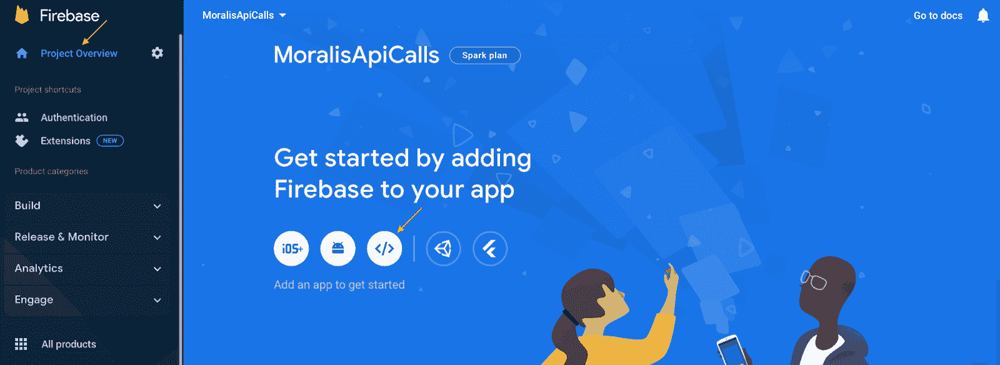

在那里，输入一个名字并点击“注册应用程序”，这将把你带到注册过程的第二阶段“添加 Firebase SDK”。它看起来像这样，您可以继续复制“firebaseConfig”对象中的所有内容:


剩下的工作就是将这些信息粘贴到本地目录的" *firebaseConfig* "对象中。接下来，再次进入终端，使用以下命令将“cd”放入“frontend”文件夹:

```js
cd frontend
```

使用以下命令安装所有必需的依赖项:

```js
npm i
```

最后，您现在应该能够使用以下命令在本地运行应用程序:

```js
npm run start
```

现在，您应该能够访问“ *localhost:3000* ”上的应用程序了。本教程到此为止！现在，您将能够为所有未来的项目创建一个带有元掩码的 Web3 Firebase 登录！

如果你在教程中遇到了麻烦，请查看之前的视频或加入 Moralis 的 Discord 频道，并向我们才华横溢的社区工程师寻求帮助！

## 摘要–使用元掩码创建一个 Web3 Firebase 登录

您知道吗，Moralis 提供了用 MetaMask 创建 Firebase 登录的最简单的方法。如果没有，您应该知道 Moralis Auth 扩展允许您创建一个 React 应用程序，用户只需五个简单的步骤就可以使用他们的元掩码钱包登录:

1.  设置 Firebase
2.  启动 Firebase CLI
3.  设置 Moralis 的授权扩展
4.  部署扩展
5.  创建 React 应用程序

按照上面的步骤，用户可以在应用程序中用他们的 Web3 钱包登录。此外，由于 Firebase 的集成，该应用程序可以生成用户 id，并允许您在应用程序的后端存储有价值的用户信息！

如果你从这篇文章中学到了一些东西，并想提高你的 Web3 熟练程度，请点击 Moralis [Web3 博客](https://moralis.io/blog/)查看更多内容。例如，通过学习如何使用 [Firebase 作为 Web3](https://moralis.io/how-to-use-firebase-as-a-proxy-api-for-web3/) 的代理 API，查看其他 Firebase 集成。此外，您还可以探索 Web3 开发的其他领域，如智能合约开发。如果你对此感兴趣，我们向你推荐如何[撰写索拉纳智能合约](https://moralis.io/how-to-write-a-solana-smart-contract/)的指南！

因此，[如果你想用 MetaMask 创建一个 Firebase 登录，请立即注册 Moralis](https://admin.moralis.io/register) 。加入平台是完全免费的，所以你没有什么损失！**