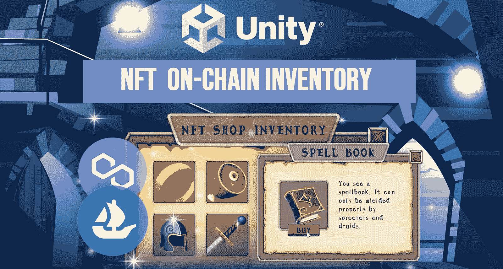
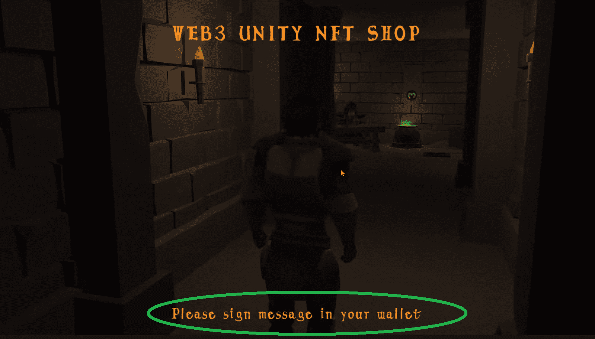
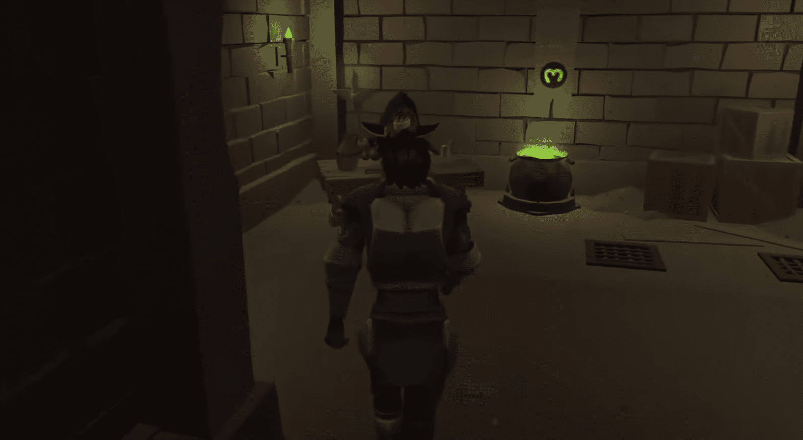
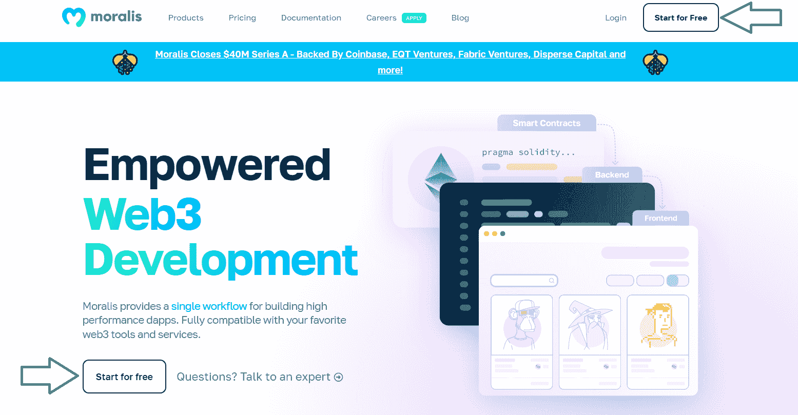
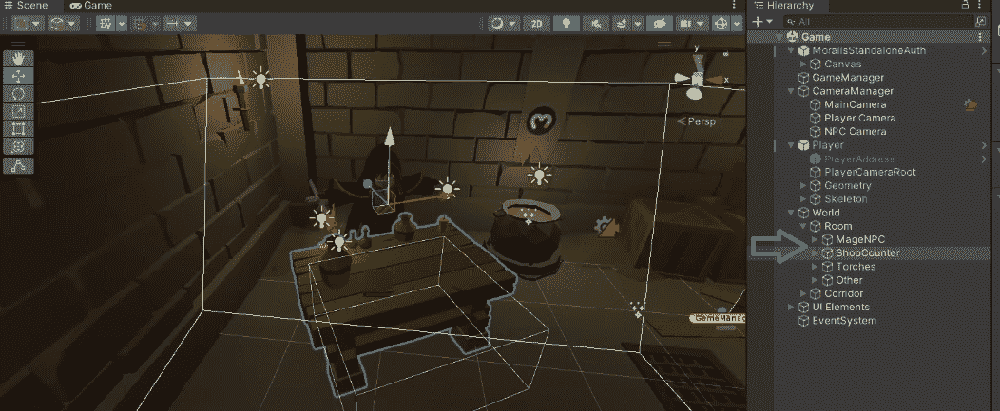
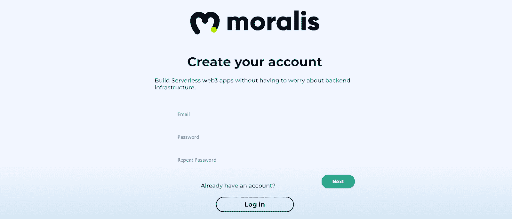
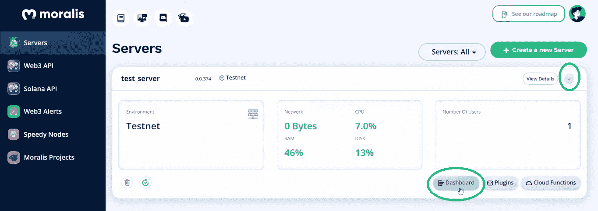
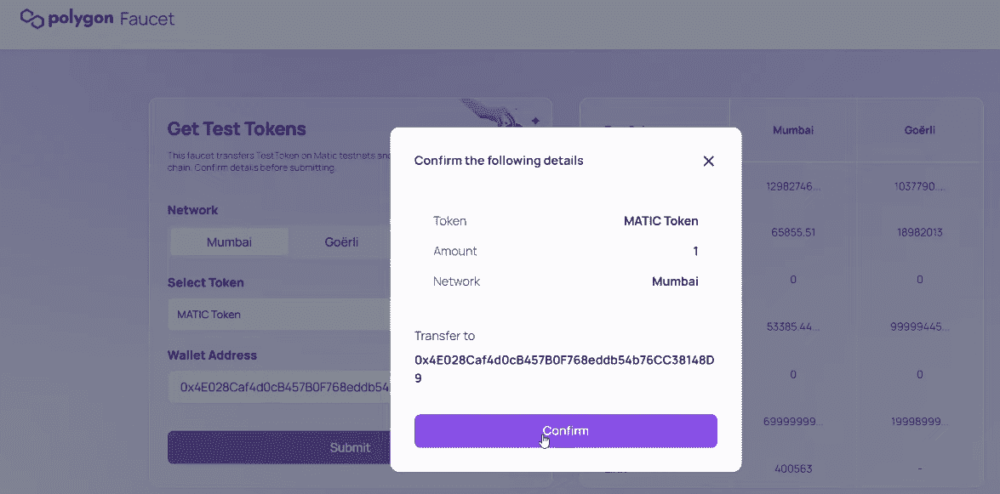
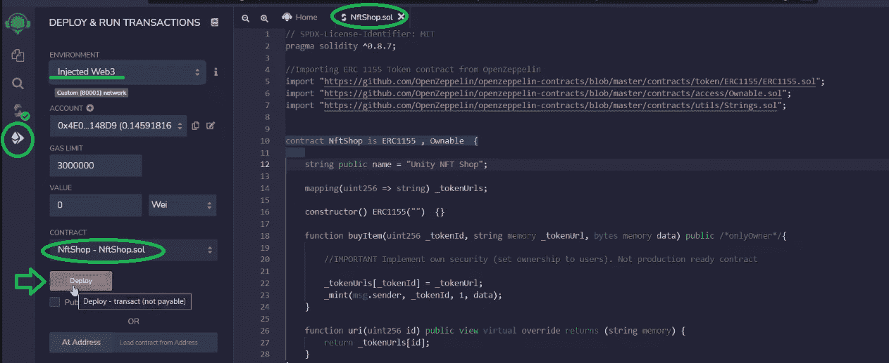

# 为游戏创建 NFT 连锁库存系统

> 原文：<https://moralis.io/create-an-nft-on-chain-inventory-system-for-gaming/>

有一段时间，程序员努力在他们的区块链游戏中实现某些功能和元素。具体来说，与网络链同步的编程元素，例如 NFTs 的链上库存( [**不可替代令牌**](https://moralis.io/non-fungible-tokens-explained-what-are-nfts/) **)。然而，由于 Moralis 及其** [**文档**](https://docs.moralis.io/introduction/readme) **，开发者现在只需几行代码就可以轻松实现 Web3 组件。例如，开发人员可以快速轻松地创建一个 NFT 在线游戏库存系统，并进而将他们的**[**GameFi**](https://moralis.io/gamefi-tutorial-how-to-create-a-gamefi-game/)**和**[**play-to-earn(P2E)**](https://moralis.io/what-is-gamefi-and-play-to-earn-p2e/)**项目提升到下一个级别。如果这听起来很有趣，请继续阅读并密切关注本教程中的内容，我们将探索如何为 Web3 游戏创建一个 NFT 连锁库存系统！**

随着我们向前发展，我们将承担一个示例项目，我们将创建一个简单的 [Unity Web3](https://moralis.io/unity-web3-beginners-guide-to-unity-web3-programming/) 游戏。此外，您将能够使用您的 Unity 熟练程度来创建一个 NFT 连锁库存系统。当然，Unity 会处理前端。然而，对于后端，我们将使用[实度](https://moralis.io/solidity-explained-what-is-solidity/)、[混音](https://moralis.io/remix-explained-what-is-remix/)和[道德](https://moralis.io/)将它们结合在一起。前两个工具将使我们能够创建和部署适当的[智能契约](https://moralis.io/smart-contracts-explained-what-are-smart-contracts/)。尽管为了[索引区块链](https://moralis.io/how-to-index-the-blockchain-the-ultimate-guide/)，这将是我们 NFT 连锁库存系统的核心，我们将使用 Moralis。这个用于加密的操作系统是当前 Web3 技术栈的巅峰，也是 Web3 后端平台的终极。这是一个在几分钟内创建[分散应用](https://moralis.io/decentralized-applications-explained-what-are-dapps/) (dapps)的单一工作流工具。幸运的是，你可以用一个[免费的道德账号](https://admin.moralis.io/register)获得[道德的 SDK](https://moralis.io/exploring-moralis-sdk-the-ultimate-web3-sdk/) 和[道德的元宇宙 SDK](https://moralis.io/metaverse/) 的力量。

## 在链库存系统示例–演示

我们希望在邀请您卷起袖子创建 NFT 连锁库存系统之前，您能看到最终结果。毕竟，我们的示例 Web3 游戏的演示将使您能够决定是否要构建自己版本的这个优秀的 dapp。

由于 [Web3 认证](https://moralis.io/web3-authentication-the-full-guide/)是通往加密领域的门户，我们游戏的初始屏幕巧妙地涵盖了这一方面:

通过使用他们的 [Web3 钱包](https://moralis.io/what-is-a-web3-wallet-web3-wallets-explained/)扫描上面的二维码，玩家可以完成一次 [Web3 登录](https://moralis.io/how-to-build-a-web3-login-in-5-steps/)。由于[元掩码](https://moralis.io/metamask-explained-what-is-metamask/)是最流行的加密钱包，让我们假设一个示例玩家决定用元掩码进行[认证。因此，玩家需要点击钱包内的“签名”按钮来确认其登录:](https://moralis.io/how-to-authenticate-with-metamask/)

成功认证后，玩家可以在我们的 3D 环境中移动他的头像。因此，玩家可以走到柜台，使他能够[购买游戏中的 NFTs】:](https://moralis.io/build-a-marketplace-to-buy-nfts-in-game/)

当玩家离卖家足够近的时候，就可以和店铺互动了。因此，玩家可以查看可以添加到他的 NFT 连锁库存中的物品(游戏内 NFT ):

### 预制的链上库存–购买游戏中的 NFT

看上面的截图，你可以看到目前 NFT 商店的库存提供六种商品。此外，玩家可以通过点击查看可用项目的详细信息。假设示例玩家点击“剑”:

正如你在上面的截图中看到的，玩家可以通过点击查看物品的名称和描述。此外，玩家可以使用与物品图像重叠的“购买”按钮来购买物品。当用户决定点击购买按钮时，就会触发一连串的事件。首先，游戏的后端创建项目的元数据。后者被保存到 [IPFS](https://moralis.io/what-is-ipfs-interplanetary-file-system/) 。然后，游戏通知玩家确认交易。为此，他必须使用他的 Web3 钱包并确认交易:

购买该商品后，它将不再出现在 NFT 商店的库存中:

### 玩家的链上库存和在 OpenSea 上查看 NFTs

另一方面，玩家的 NFT 链库存现在显示剑。如果玩家想要查看他们获得的 NFTs，用户需要点击“I”键:

上面的截图显示了玩家的链上库存——“剑”的形象。然而，为了向您展示这不仅仅是一个图像，而是一个真实的 NFT，我们的示例游戏包含了另一个特性。如果玩家点击物品清单中的一件物品，就会在 OpenSea 中打开 NFT 的详细信息:

## 使用 Unity and Moralis 创建您的 NFT 连锁库存系统–示例项目

我们已经到了你有机会动手制作上述 Web3 游戏实例的时候了。如果你记得的话，我们将使用 Moralis，反过来，避免 RPC 节点的[限制。此外，您还应该知道，Moralis 完全是关于跨链和跨平台的互操作性。因此，您可以对不同的链使用相同的代码，并使用您喜欢的平台。然而，随着我们的发展，我们将专注于 Unity 和 Polygon 在孟买的测试网。尽管如此，使用简介中的“免费道德账户”链接创建您的免费道德账户。要获得更多支持来构建这样的示例项目，请加入](https://moralis.io/exploring-the-limitations-of-rpc-nodes-and-the-solution-to-them/) [Moralis 项目](https://moralis.io/projects/)。通过这样做，你也有机会获得一些特殊的道德技能。

下面是即将到来的部分和步骤的概述:

1.  确保您理解这个示例项目的结构。
2.  帮助你开始学习道德。
3.  准备您的预制 NFT 链库存。
4.  部署我们的智能合同。
5.  将我们的元数据和图像从链外数据转移到链上库存——打造 NFT。
6.  支持查看 NFT 在线库存。

***注:*** *从鸟瞰的角度，我们将在下面的章节中来看上述六个步骤。我们鼓励您使用本文末尾的视频了解更多详细信息。此外，整个代码，包括 Unity 资产和预置，在我们项目的* [*GitHub*](https://github.com/MoralisWeb3/youtube-tutorials/tree/main/unity/unity-web3-nft-shop) *仓库等着你。*

### 我们的 Unity 项目结构

来自 Moralis 的 Unity 专家将首先在下面的视频中向您介绍我们项目的结构，从 4:25 开始。他将向您展示如何浏览文件夹以及定位资产和脚本。后者大部分可以在“_Project”中找到:

如果你正在寻找“游戏”场景，你可以在“场景”文件夹中找到它。顾名思义，第三方资产位于“第三方”文件夹中。然后，您还将了解我们游戏链上库存系统的层级结构(5:37):

就 Web3 认证而言，一旦你将 Moralis SDK 连接到 Unity,“moralisstandalone auth”预置将会完成任务。要触发适当的事件和处理游戏阶段，你必须使用“游戏管理器”。要正确处理游戏中的相机，您可以使用“cameraManager”。幸运的是，Unity Cinemachine 让事情变得非常简单，并提供了多种高级选项。浏览层次结构的其余部分，您将了解关于“世界”、“事件系统”、“UI 元素”和“玩家”资产的更多信息。其中，“世界”将向您展示我们游戏的视觉细节:

看上面的截图，你可以看到 NFT 商店柜台的对撞机。后者在触发“NFT 商店库存”屏幕时起着重要作用。因此，它是我们的连锁库存系统的重要组成部分。位于“UI 元素”中的“商店库存”和“玩家库存”资产使玩家能够与游戏互动。尽管如此，你也将有机会学习更多关于“GameInputAction”资产(新的游戏输入系统)的知识。

### 道德入门

开始使用 Moralis 非常容易。首先，你需要创建你的免费道德账户，你可能已经完成了。因此，你可以简单地[登录](https://admin.moralis.io/login)到你的道德管理区。接下来，单击“+创建新服务器”。当然，你可以使用下面的视频教程，从 10:00 开始，进行更多的动手指导。

由于这是一个示例项目，请确保选择“Testnet Server”选项。然后，输入服务器的详细信息。而且，选择 Polygon 的 testnet(孟买)(见下图)。您可以使用“添加实例”按钮启动服务器:

一旦您的服务器启动并运行，您可以使用“查看详细信息”按钮来访问其详细信息:

然后，您需要使用您的服务器的详细信息，并将它们粘贴到 Unity 中:

这是您粘贴服务器 URL 和应用程序 ID 的界面:

## 准备您的预制 NFT 连锁库存

妥善管理店铺物品是我们 NFT 连锁库存系统的核心。从 12:30 开始，您将获得“ShopInventory”脚本的代码演练。因此，您将熟悉如何从 Moralis 仪表板(数据库)中查询数据:

Moralis 仪表板中的主角是“ItemData”类。它包含项目名称、描述和图像 URL 的列。这些信息组成了我们的 NFTs 的元数据。尽管如此，从 15:10 开始，您将看到创建自己的“ItemData”类是多么容易。

### 部署我们的智能合同

此时，您已经有了自己的运行在 Mumbai testnet 上的 Moralis 服务器。但是，除非您以前使用过元掩码与该网络进行交互，否则您的元掩码扩展中没有它。幸运的是，你可以通过 [Moralis Speedy Nodes](https://moralis.io/speedy-nodes/) 点击一个按钮来做到这一点:

*此外，您需要一些“玩法”MATIC 来部署我们智能合同的实例。幸运的是，有* [*孟买 testnet 水龙头*](https://moralis.io/mumbai-testnet-faucet-how-to-get-free-testnet-matic-tokens/) *可以帮你解决这个问题。更多详情，请使用以下视频，从 30:21 开始:*

此时，您应该将元掩码扩展连接到 Mumbai。此外，你的钱包里有一些“游戏”硬币。因此，你可以打开混音。然后，只需复制“ [ShopContract](https://github.com/MoralisWeb3/youtube-tutorials/blob/main/unity/unity-web3-nft-shop/Assets/_Project/ShopContract.txt) ”代码，粘贴到 Remix 中即可。*如果你想了解更多关于智能合约代码的细节，请观看下面 31:13 开始的* *视频。*此外，我们必须指出，这份合同侧重于 [ERC-1155 令牌标准](https://moralis.io/erc1155-exploring-the-erc-1155-token-standard/)，这往往是游戏内非功能性游戏的最佳选择。尽管在某些情况下， [ERC-721 令牌标准](https://moralis.io/erc-721-token-standard-how-to-transfer-erc721-tokens/)可能更合适。最后，要部署您的智能合约，请使用“注入的 Web3”环境:

## 从非连锁库存到连锁库存——铸造非连锁库存

回想上面的演示，你可能记得玩家通过点击“购买”按钮来铸造我们的游戏内 NFT。你可能还记得玩家需要使用他们的 Web3 钱包来确认交易。为了在 Unity 中设置这个功能，我们使用了“ShopItem”脚本。从 36:45 开始，您可以获得该脚本的更详细的代码演练。简而言之，当玩家从 NFT 商店的库存中选择任何特定的物品时，就会触发“ActivateItemPanel”事件处理程序。然后，当玩家点击“购买”按钮时，后者触发“购买物品”功能:

上述序列是[将游戏资产铸造为 NFT](https://moralis.io/how-to-mint-game-assets-as-nfts/)的关键。我们强烈建议您使用下面的视频并详细查看脚本。因此，您将看到 Moralis 的 SDK 的强大之处，它只使用简短的代码片段来完成大部分繁重的工作。此外，使用道德 IPFS 集成，您可以毫不费力地为您的 NFT 创建元数据(JSON 文件)。当玩家[通过上面部署的智能契约制造 NFT](https://moralis.io/how-to-mint-nfts-full-tutorial-to-minting-an-nft/)时，代码访问这些 JSON 文件。

### 查看 NFT 在链库存

现在，您几乎完全理解了我们示例的游戏在线库存系统是如何工作的。剩下要做的就是玩家如何在游戏中和 OpenSea (49:46)上访问他们的库存。这就是“PlayerInventory”涵盖功能背后的逻辑的地方。“LoadPurchadedItems”方法使游戏能够获得玩家的 NFT。同样的方法可以确保我们的游戏正确显示玩家库存中获得的 NFT。另一方面，要在 OpenSea 上显示 NFT，可以使用“CheckNftOnOpenSea”方法。这就是你依赖 Unity 的“openURL”方法的地方。

https://www.youtube.com/watch?v=RRvUWx0AivI

## 为游戏创建 NFT 连锁库存系统–总结

今天，您第一次有机会体验我们的 NFT 在线库存系统演示。你看到了我们可以使用 Unity 来创建我们的 Web3 游戏。此外，您有机会克隆我们的代码并创建您的实例。此外，使用我们的概述和上面的视频教程，您有机会获得对幕后代码的正确理解。此外，您还与 Moralis 和 Remix 进行了互动，它们是突出的工具，可以为您节省大量时间。

尽管如此，如果你喜欢这个示例项目，我们邀请你访问[道德博客](https://moralis.io/blog/)和[道德 YouTube 频道](https://www.youtube.com/c/MoralisWeb3)。这些网站提供大量免费内容，可以帮助你[成为一名 Web3 开发者](https://moralis.io/how-to-become-a-web3-developer-full-guide/)。例如，一些最新的主题包括构建一个[去中心化 Twitter](https://moralis.io/2022-guide-to-building-a-decentralized-twitter/) 的指南，一个 [EIP 1559 示例](https://moralis.io/eip-1559-example-what-is-eip-1559/)，[分数 NFTs](https://moralis.io/what-are-fractional-nfts-the-ultimate-2022-f-nft-guide/) ，构建一个[去中心化自治组织(DAO)](https://moralis.io/how-to-build-a-decentralized-autonomous-organization-dao/) ，一个 [SPL 与 ERC20 令牌](https://moralis.io/spl-vs-erc20-tokens-comparing-solana-and-ethereum-tokens/)的比较，构建一个[索拉纳令牌仪表板](https://moralis.io/how-to-build-a-solana-token-dashboard/)，如何[创建你自己的元宇宙](https://moralis.io/how-to-create-your-own-metaverse/)，如何创建一个[BNB NFT](https://moralis.io/how-to-create-a-bnb-nft/)

然而，如果你决心尽早成为一名区块链开发者，你需要考虑采取更专业的方法。这就是[道德学院](https://academy.moralis.io/)可能是你一直在寻找的答案。这个在线学院提供的不仅仅是顶级的[区块链发展课程](https://academy.moralis.io/all-courses/)。道德学院是获得个性化学习路径、专家指导和 Web3 行业中最先进和最受欢迎的社区之一的会员资格的地方。