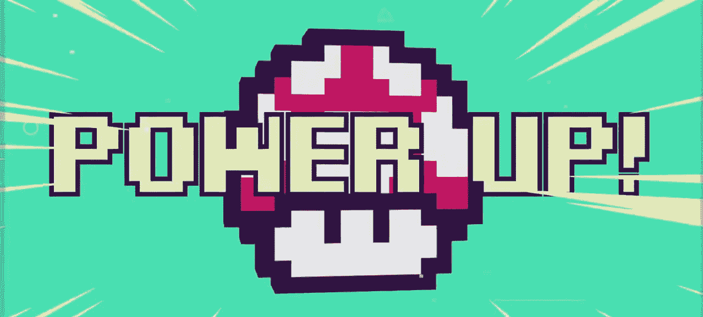
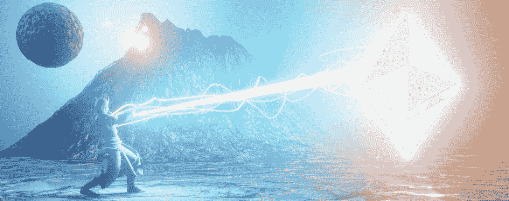
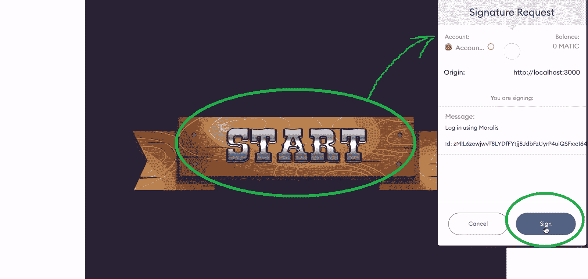
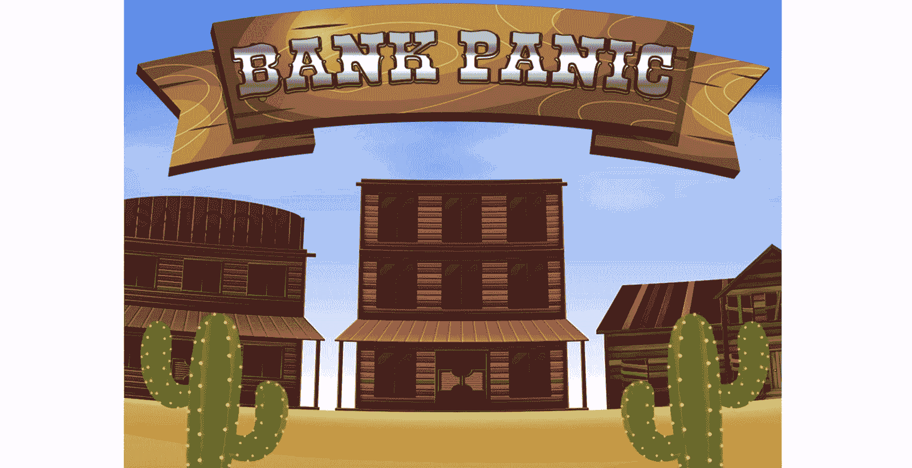
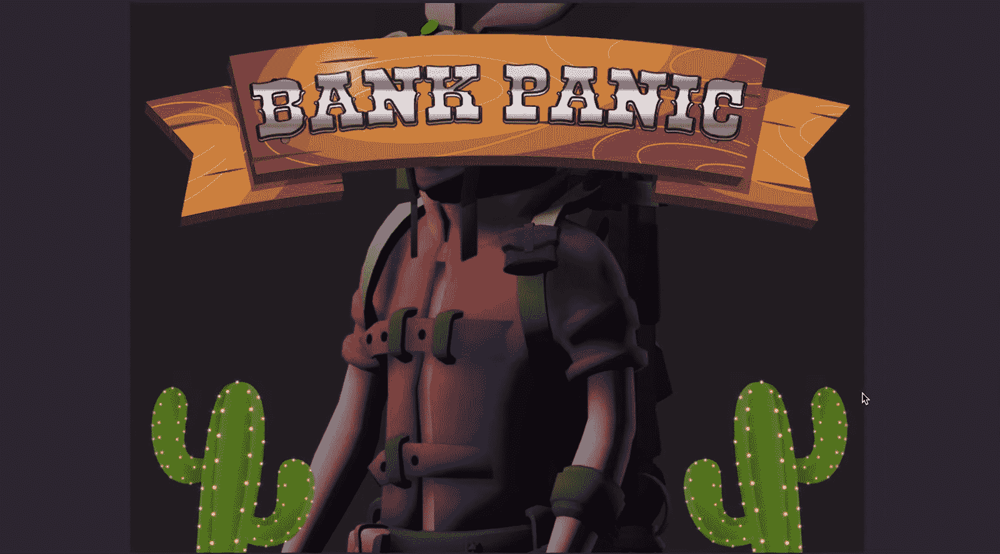
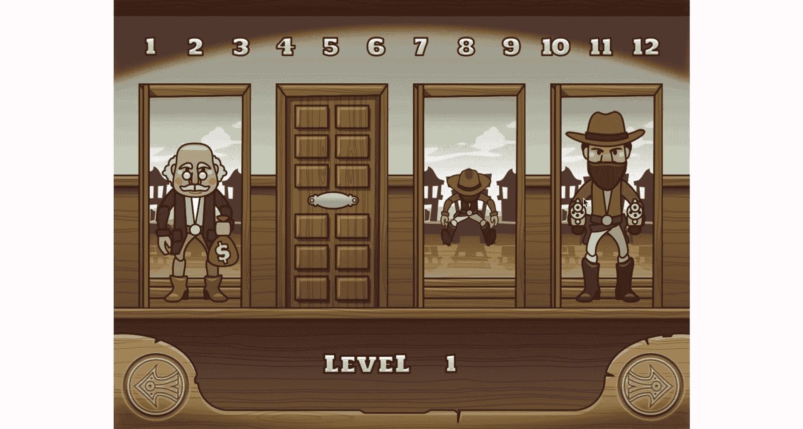
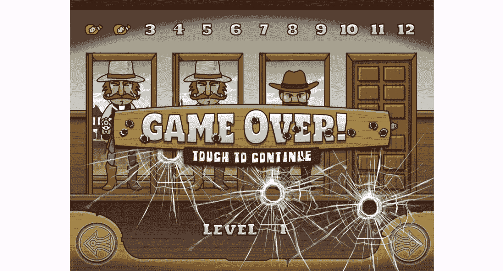

# 在 9 分钟内开发一个带有 NFT 电源的 Web3 游戏

> 原文：<https://moralis.io/develop-a-web3-game-with-nft-power-ups-in-9-minutes/>

你玩过多少次没有电源或额外能力的电子游戏？可能没有。游戏中的加电可以深化游戏体验，说实话，谁不喜欢一点点的提升呢？此外，随着 GameFi、[**【P2E】**](https://moralis.io/what-is-gamefi-and-play-to-earn-p2e/)**型号和** [**NFTs**](https://moralis.io/non-fungible-tokens-explained-what-are-nfts/) **用作游戏内资产，使用不可替换代币的 Web3 游戏变得越来越流行。因此，能够用 NFTs 和 NFT 电源开发一个 Web3 游戏是每个程序员都应该掌握的技能。在这里，我们将重点放在两个工具上，我们将利用它们来快速轻松地开发一个带有 NFT 电源的 Web3 游戏。通过遵循本文末尾的说明并观看视频，您将能够通过为 Web3 游戏实现加电来将您的** [**NFT 编程**](https://moralis.io/nft-programming-for-beginners/) **技能提升到一个新的水平！**

接下来，我们将向您展示如何在不到 10 分钟的时间内将 NFT 增强功能添加到 Web3 游戏中。此外，本文将演示如何向我们现有的 [2D Web3 游戏](https://moralis.io/how-to-build-a-2d-web3-game-full-guide%ef%bf%bc/)示例添加一个相对简单的 NFT 功能。因此，我们建议在继续之前从这个例子开始。这个示例项目的目的是作为一个概念的证明。然后，就看你的了，让事情更上一层楼，给你的游戏增加 NFT 的能量。就我们的例子而言，我们通过利用 Phaser 和 [Moralis](https://moralis.io/) 创建了一个简单的游戏。因此，我们能够使用现有的 2D 游戏，并把它变成一个 Web3 游戏。通过增加 [Web3 认证](https://moralis.io/web3-authentication-the-full-guide/)，用户可以[使用 MetaMask](https://moralis.io/how-to-authenticate-with-metamask/) 进行认证。然而，我们今天将应用必要的调整来实现 NFT 实用程序！



## 什么是 NFT 电源？

在我们看我们的 dapp ( [分散应用](https://moralis.io/decentralized-applications-explained-what-are-dapps/))演示之前，让我们确保我们都跟上了基础知识的速度。那么，什么是 NFT 电源？现在，您可能已经听说过上电和 NFT。此外，如果你是一个游戏玩家，开机对你来说并不陌生。然而，为了以防万一，让我们提醒你，游戏中的电源是给游戏中的角色增加暂时的好处或额外能力的对象。根据定义，电源是由游戏机制自动应用的。最明显的例子就是超级马里奥的蘑菇。

另一方面，有游戏物品，玩家可以收集，然后在任何时候使用。后者可能有暂时或永久的好处。然而，在现实中，游戏项目和开机之间的界限往往是模糊的。尽管如此，如果我们现在添加不可替换的令牌，这仅仅意味着上电由这种加密资产来表示。因此，我们可以谈论 NFT 电源。



## 使用 Phaser 和 Moralis 开发一个带有 NFT 电源的 Web3 游戏

如前所述，我们的示例项目将把 NFT 的能量加入到我们的示例 2D Web3 游戏中。因此，我们建议首先从该部分开始，以获得完整的图片。你可以点击本文开头的“2D Web3 游戏”链接。然而，由于我们在 [GitHub](https://github.com/ashbeech/moralis-phaser-demo) 上提供了完整的代码，你也可以跳过第一部分。但是，在我们关注使 NFT 电源正常工作的代码演练之前，让我们先看一下我们的演示。

### NFT 电源启动运行–演示

我们添加了 NFT 能量的示例游戏通过用“开始”按钮问候玩家开始:


这一次，我们只让拥有 [Web3 钱包](https://moralis.io/what-is-a-web3-wallet-web3-wallets-explained/)地址的用户能够登录[web 3](https://moralis.io/how-to-build-a-web3-login-in-5-steps/)。反过来，没有特定 NFTs 的用户也无法登录。是的，这是我们的 NFT 电源的例子-它使用户能够访问游戏。其实这是它的第一部分；当你继续前进的时候，你会学到第二部分。

### 我们的 Web3 游戏登录示例

*注意* *:下面的演示集中在拥有正确的 NFTs 的用户身上。*

首先，用户需要点击“开始”按钮。这将提示他们的元掩码扩展，他们需要使用这些扩展来签署“使用 Moralis 登录”消息:



用户必须点击他们的[元掩码](https://moralis.io/metamask-explained-what-is-metamask/)扩展中的“Sign”按钮才能继续。因此，他们完成了对我们的示例游戏的登录。

*注意* *:* 实现 Web3 认证有多种方式，Moralis 让事情变得相当简单。对于 web dapps，元掩码集成是最佳选择。然而， [WalletConnect](https://moralis.io/what-is-walletconnect-the-ultimate-walletconnect-guide/) 往往是移动 dapps 的首选。此外，Moralis 还提供其他登录解决方案，可以帮助您提高 [Web3 用户登录](https://moralis.io/how-to-boost-web3-user-onboarding-success-rates/)的成功率。通过使用 [Web3 社交登录](https://moralis.io/web3-social-login-sign-in-dapp-users-with-google-email-or-twitter/)或 [Web3 电子邮件认证](https://moralis.io/how-to-do-web3-authentication-via-email/)，你可以向普通人提供他们熟悉的登录方法。

在我们将 NFT 能量加入游戏之前，用户成功登录后会进入游戏的主菜单屏幕:



然而，我们决定添加另一个 NFT 功能(上面提到的第二部分)。因此，用户不必登陆上述主菜单屏幕，而是可以查看他们的 NFT:



正如你在上面看到的，我们的例子非常简单，我们使用了一个完全随机的 NFT。然而，它清楚地告诉你如何使用 NFT 电源。当用户点击 NFT 时，他们可以进入“银行恐慌”游戏。

#### 我们的 Web3 游戏与 NFT 电源的目标

下面是我们的示例游戏的样子:



此外，“游戏的目的”是尽可能快地用枪射击(点击)牛仔(强盗)。否则，匪徒会射杀玩家。而且我们游戏里也有带着钱袋子的角色(见上面截图)。玩家不应该拍这些角色。此外，你可以在游戏屏幕的顶部看到数字。这些数字表示玩家完成关卡需要收集的钱袋。然而，如上所述，如果任何一个强盗向玩家开枪，游戏就结束了:



正如你所看到的，即使是这样一个简单的 2D 游戏也有很多游戏中的物体。因此，有许多潜在的 NFT 应用成为可能。例如，我们可以用 NFT 能量给强盗特殊的枪或者让钱袋变大，等等。一旦你掌握了这个概念，你就可以随心所欲地发挥创造力。

## 带 NFT 电源的 Web3 游戏–代码演练

我们建议使用上面的“GitHub”链接克隆代码，以使事情尽可能简单。然后，使用您最喜欢的代码编辑器或 IDE 来访问代码。我们更喜欢使用 Visual Studio 代码(VSC)，你会在下面的截图中看到。因此，要了解示例 Web3 游戏的要点，请打开“ [App.jsx](https://github.com/ashbeech/moralis-phaser-demo/blob/main/src/App.jsx) ”和“ [MainMenu.js](https://github.com/ashbeech/moralis-phaser-demo/blob/main/src/scenes/MainMenu.js) ”文件:


为了让你看得更清楚，Moralis 的一位专家用注释标记了所有适用于“NFT 增强”的代码行。此外，我们现在来关注一下“App.jsx”文件。

注意:再次提醒你，如果你还没有完成之前教程中的“ [2D Web3 游戏](https://moralis.io/how-to-build-a-2d-web3-game-full-guide%ef%bf%bc/)”示例，我们建议你在继续之前先完成。

### 代码演练——“app . jsx”文件

使用以下代码行，我们导入 NFT 组件:

```js
  useNFTBalances,
} from "react-moralis";
```

接下来，我们需要声明一个函数，它将允许我们轻松地从用户的钱包中获取 NFT:

```js
  const { getNFTBalances } = useNFTBalances();
```

然后，我们需要定义一个游戏认为有效的合同地址(我们可以添加多个地址),授予玩家访问权限:

```js
const check_address = "0x…";
```

您必须输入有效的“NFT 集合”合同地址，而不是“0x…”。此外，您还需要定义区块链的 ID。在我们的示例游戏中，我们使用 Polygon 的 testnet (Mumbai):

```js
const network_chain_id = "0x13881";
```

我们还必须检查用户的余额，以查看他们是否有与上述合同地址匹配的令牌:

```js
  const checkNFTBalance = async (__user) => {
    let valid = false;
    await getNFTBalances({
      params: {
        chain: network_chain_id,
      },
    })
      .then(function (_data) {
        console.log(_data);
        // check for matching results in user's wallet
        if (!_data || _data?.result.length === 0) {
          // no NFTs returned = false
          console.log("Nope");
          authEvents.dispatch({ type: AUTH, player: null });
          logout();
          console.log("User logged-out");
        } else {
          valid = _data.result.some(
            (elem) => elem.token_address === check_address
          );
          // TODO: More elegantly handle failure to sign in.
          if (valid) {
            // valid NFT to allow access found
            console.log("ACCESS GRANTED", valid);
            // pass NFT data onto processor funcs
            compileNFT(__user, _data.result);
          } else {
            // no valid NFT in possesion of user
            // print access denied feedback
            console.log("ACCESS DENIED: No Valid NFT");
          }
        }
      })
      .catch(function (error) {
        console.log(error);
      });
    return valid;
  };
```

#### “App.jsx”文件–使元数据可呈现

我们还需要让游戏中的数据可以渲染。这部分代码将会解决这个问题:

```js
  const nftMetadata = [];
  const findNFTMetadata = async (___data) => {
    let p = 0;
    for (let i = 0; i < ___data.length; i++) {
      console.log(___data[i].token_address);
      if (___data[i].token_address === check_address) {
        console.log(___data[i].token_uri);
        nftMetadata[p] = ___data[i].token_uri;
        p++;
      }
    }
  };

  let demoNFTimageURL = "";
  const getJSON = async (_metadata) => {
    try {
      // grab remote json file (likely IPFS)
      await axios.get(_metadata).then((res) => {
        console.log("Initial Image URL:", res.data?.image);
        // set URL
        demoNFTimageURL = res.data?.image;
        // if already is a moralis ipfs link, then skip further processing
        if (demoNFTimageURL.match("moralis")) {
        } else {
          let imageSplit = res.data?.image.split("/");
          console.log("IMAGE CID:", res.data?.image.split("/"));
          // FYI the file's CID can also be displayed from any other IPFS node URL prefix e.g. https://ipfs.io/ipfs/CID/xxx.png
          demoNFTimageURL =
            "https://ipfs.moralis.io:2053/ipfs/" +
            imageSplit[2] +
            "/" +
            imageSplit[3];
        }
      });
    } catch (error) {
      console.error(error);
    }
  };
```

此外，我们还希望正确处理 NFTs 的元数据，以定位可渲染的图像数据。因此，我们的[反应](https://moralis.io/react-explained-what-is-react/)和我们的相位器组件将能够正确通信:

```js
  const compileNFT = async (___user, __data) => {
    await findNFTMetadata(__data);
    await getJSON(nftMetadata[0]);
    console.log("Final NFT Image URL:", demoNFTimageURL);

    if (demoNFTimageURL === "") {
    } else {
      nftEvents.dispatch({ type: LOAD_NFT, nft: demoNFTimageURL });
      startGame(___user, demoNFTimageURL);
    }
  };
```

上面几行代码还检查相关元数据是否有效。此外，有效的 NFT 持有者可以玩这个游戏。因此，我们的代码必须通过与 Phaser 组件通信来改变 Phaser 中的场景。这是在“MainMenu.js”文件中完成的。

### 代码演练——“main menu . js”文件

如上所述，我们使用“MainMenu.js”来改变游戏场景。因此，我们需要在“constructor()”函数中添加以下代码行:

```js
   emitter.on("LOAD_NFT", (event) => {
      console.log("NFT:", event.nft);
      valid_nft_image = event.nft;
    });
```

此外，我们需要遵循 Phaser 加载图像的方式:

```js
  preload() {
    // set identifier as 'validnft' for image url
    this.load.image("validnft", valid_nft_image);
  }
```

此外，一旦创建了主菜单的场景，我们希望在我们的 Web3 游戏示例中显示相关的 NFT。因此，我们在“create()”函数中添加以下代码行:

```js
    this.add.image(512, 384, "validnft");
```

最后，现在你已经确保你的代码准备好了，你可以使用“npm start”命令来运行我们的 Web3 游戏的 NFT 电源。此外，下面的视频将带您更详细地了解整个代码演练:

https://www.youtube.com/watch?v=D-KW4_FgYj0

上面的视频基本上是我们对一个评论的回答，该评论询问如何使用 Moralis 来验证用户是否拥有特定的 NFT，然后在 Phaser 游戏中加载这些 NFT:


## 在 9 分钟内开发一个带 NFT 电源的 Web3 游戏——总结

至此，你知道了什么是 NFT 能量，以及如何在你的 Web3 游戏中使用它们。通过介绍一个简单的 2D Web3 示例游戏，您已经看到了如何使用 [Moralis 的 SDK](https://moralis.io/exploring-moralis-sdk-the-ultimate-web3-sdk/) 和 Phaser 组件来实现这一点。在此过程中，您还能够更新对 Web3 身份验证方法的理解。利用这里获得的知识和技能，我们鼓励你着手自己的 Web3 游戏开发。因此，让我们提醒您一下[道德元宇宙 SDK](https://moralis.io/metaverse/) 。后者使你能够使用 Unity 创建各种各样的 Web3 3D 游戏。因此，你可以[开发一个元宇宙](https://moralis.io/how-to-build-a-metaverse-game-in-25-minutes/)或 [GameFi](https://moralis.io/gamefi-tutorial-how-to-create-a-gamefi-game/) 游戏，甚至是一个 [Web3 MMORPG](https://moralis.io/build-a-web3-mmorpg-with-unity-in-10-minutes/) 。如果您对此感兴趣，请务必查看我们的 [Unity Web3 编程](https://moralis.io/unity-web3-beginners-guide-to-unity-web3-programming/)初学者指南。

然而，如果你想探索区块链发展的其他方面，一定要访问 [Moralis 博客](https://moralis.io/blog/)和 [Moralis YouTube 频道](https://www.youtube.com/c/MoralisWeb3)。这两个出口都提供了大量高质量的内容，是免费加密教育的重要资源。一些最新的主题包括关于 [DeFi staking](https://moralis.io/what-is-defi-staking-full-guide/) 的完整指南，如何[与 Web3 数据库](https://moralis.io/how-to-communicate-with-a-web3-database-from-unity/)，[为什么 Web3 很重要](https://moralis.io/why-is-web3-important-a-beginners-guide/)，如何[降低固体气体成本](https://moralis.io/how-to-reduce-solidity-gas-costs-full-guide/)，如何[创建以太坊 NFT](https://moralis.io/how-to-create-an-ethereum-nft-full-guide/) 等等。

另一方面，你可能想尽快进入 Web3。如果是这样，你需要考虑采取更专业的方法。因此，报名参加[道德学院](https://academy.moralis.io/)可能是你的正确道路。除了顶尖的区块链发展[课程](https://academy.moralis.io/all-courses)，你还将获得个性化的学习路径和专家指导。然而，最大的价值正以加密领域中最先进和最支持的社区之一的形式等待着你。所以，马上加入道德和道德学院[成为一名 Web3 开发者](https://moralis.io/how-to-become-a-web3-developer-full-guide/)！