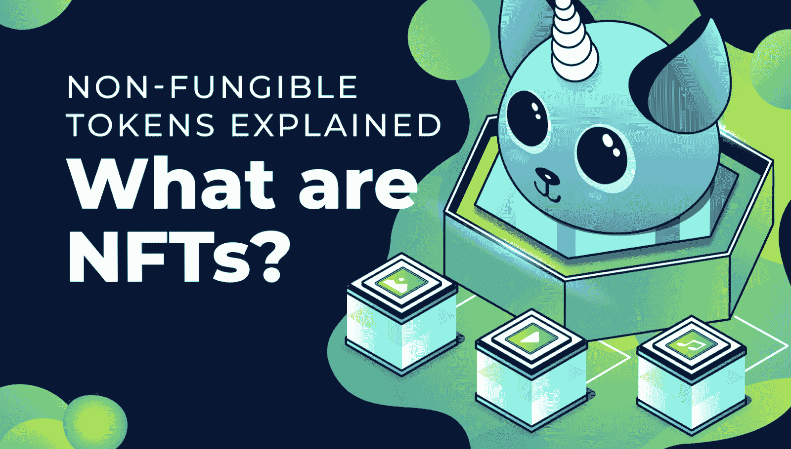
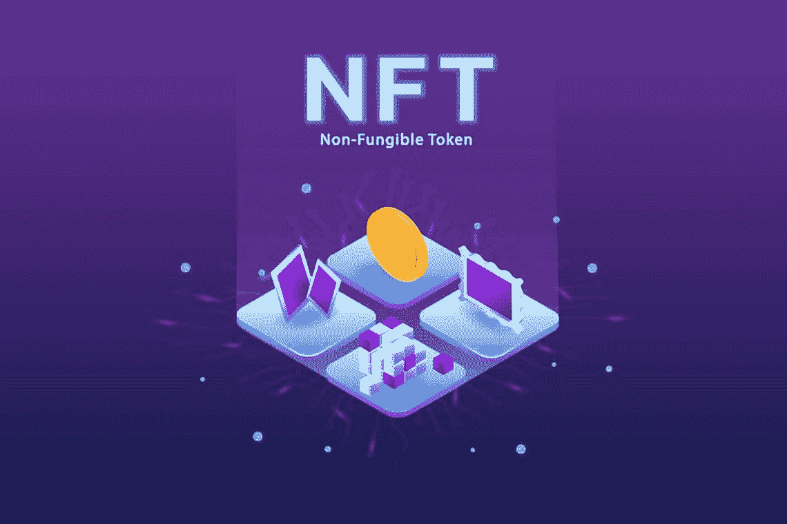
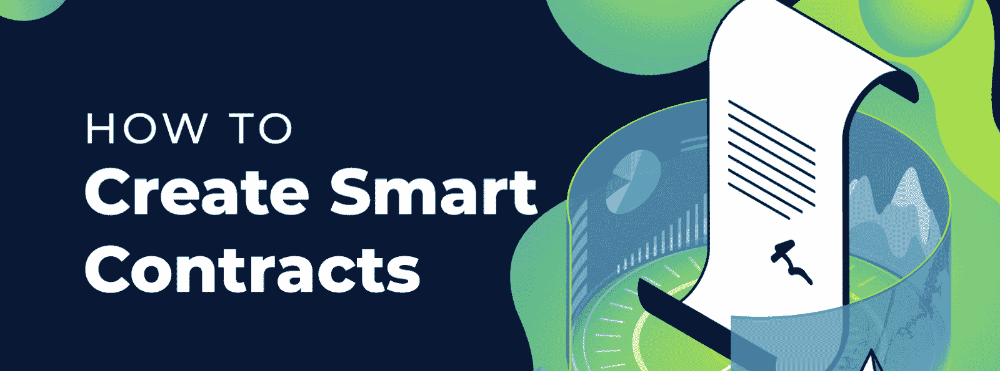
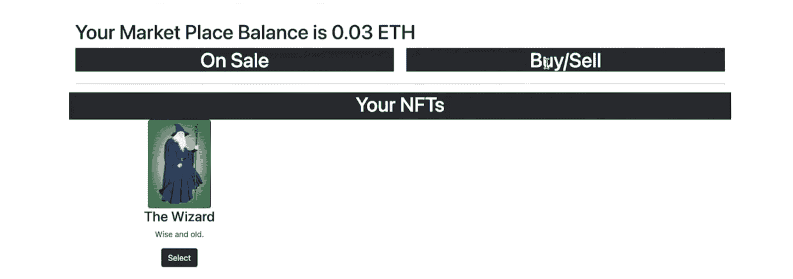

# 发展您自己的 NFT 市场——逐步指南

> 原文：<https://moralis.io/develop-your-own-nft-marketplace-step-by-step-guide/>

不可替换的代币，或称[**NFT**](https://moralis.io/non-fungible-tokens-explained-what-are-nfts/)**，本质上是数字收藏品，在过去几年里越来越受欢迎。不仅市场上 NFT 的数量大幅增长，而且其中一些以荒谬的价格出售。随着它们变得越来越受欢迎，了解它们如何工作以及如何获得这些令牌变得越来越迫切。此外，上市、拍卖和出售非关税壁垒，都可以通过 NFT 市场。如果你已经熟悉** [**如何创建自己的 NFT**](https://moralis.io/how-to-create-your-own-nft-in-5-steps/) **，那么你甚至可能已经有一个准备出售了。因此，在这个分步指南中，您将会更喜欢了解创建不可替代代币市场的过程。因此，请跟随这篇文章，让我们更深入地了解如何利用** [**道德规范**](https://moralis.io/?utm_source=blog&utm_medium=post&utm_campaign=Want%2520the%2520Latest%2520in%2520%253Cspan%253EBlockchain%2520Development%253F%253C%252Fspan%253E) **开发自己的 NFT 市场。**

Moralis 是 Web3 开发的头号操作系统，使 T2 区块链开发变得更加容易。有了 Moralis，我们可以快速开发一个 NFT 市场，而平台的工具使这在大约 20 分钟内成为可能。Moralis 平台的众多优势之一是所有用户都可以使用无限可扩展的后端基础设施。这使您可以避免区块链开发中最紧迫的任务，以便您可以专注于创建智能合同和令人信服的用户体验。

Moralis 提供了大量的 Web3 工具来帮助各种开发项目。例如，用户可以立即获得对 [IPFS](https://moralis.io/what-is-ipfs-interplanetary-file-system/) 、[道德利斯快速节点](https://moralis.io/speedy-nodes/?utm_source=blog&utm_medium=post&utm_campaign=What%2520is%2520IPFS%2520%28InterPlanetary%2520File%2520System%29%253F)、道德利斯[价格 API](https://moralis.io/introducing-the-moralis-price-api/) 和 [NFT API](https://moralis.io/ultimate-nft-api-exploring-moralis-nft-api/) 等的原生支持。例如，Moralis 是 BSC 的首选 [Infura，是 Avalanche](https://moralis.io/infura-bsc-alternatives-the-best-alternative-to-infura-for-bsc/) 的首选 [Infura。](https://moralis.io/infura-for-avalanche-exploring-infura-avalanche-alternatives/)

此外，[注册 Moralis](https://admin.moralis.io/register) 完全免费，只需几秒钟。所以，如果你想成为一名 dApp 开发者，那就马上加入这个平台，你的第一个区块链项目很快就会启动！

### 不可替换令牌—什么是 NFT？

NFT 是“不可替代令牌”的缩写，顾名思义，它们是一种令牌。此外，在加密领域，存在两种不同的主要类型的令牌，不可替换的和可替换的令牌。因此，要理解这两者是什么，我们必须发现术语“可替代的”是什么意思。



可互换是描述可互换资产的传统经济术语。因此，可以将可替代资产的一个单位与另一个单位进行交换，因为它们的类型和价值相同。这里的一个例子是美元，它是一种可替代资产，因为特定数量的美元等于另一组相同数量的美元。此外，在加密行业内，像[以太坊](https://moralis.io/full-guide-what-is-ethereum/)和比特币这样的货币被认为是可替代的代币。这意味着一个比特币等于另一个比特币，因为它们具有相同的价值。本质上，这表明当涉及到金钱时，可替代性的概念是至关重要的。

此外，不可替代资产，因此，资产不遵循同样的原则。这意味着 NFT 是不可互换的令牌，因为它们具有唯一的属性。为了举例说明什么是不可替代资产，我们可以拿房子做例子。所有的房子都是独一无二的，这意味着不可能从一个房子换到另一个房子，因为它们有不同的价值和特点。

因为 NFT 是不可替换的，所以由于它们的独特性，它们是表示资产的理想选择。因此，它们是数字收藏品，可以代表独特的物理或数字资产的所有权。

NFT 存在于区块链上，其中每个块都受到加密技术的保护，这意味着块一旦形成就不可能改变。因此，这种分布式公共分类账确保了谁拥有这些资产的直接记录。

## 什么是 NFT 市场？

现在我们对 NFTs 有了更好的了解，下一步是发现我们可以在哪里购买和出售这些数字收藏品。一种交易 NFT 的方式是通过 NFT 市场。本质上，NFT 市场只是一个平台或网站，以获取和销售非功能性交易；就这么简单。然而，这种平台的其他功能可能是显示、存储、甚至创建新的 NFT。因此，有大量的功能使得非功能性交易变得更加容易。



在使用 NFT 市场之前，你通常需要准备一些东西。首先，你需要一个钱包，比如 [MetaMask](https://moralis.io/metamask-explained-what-is-metamask/) 。MetaMask 是市场上排名第一的加密钱包，它是以太坊广泛的 [dApps](https://moralis.io/decentralized-applications-explained-what-are-dapps/) 生态系统的门户。其次，在许多情况下，你还需要一些加密货币来支付非功能性交易。最后，您可能还需要为市场创建一个帐户。这通常相对容易，如果你已经有一个 MetaMask 钱包，只需要几秒钟。

已经有一些成熟的市场，其中最受欢迎的有 [OpenSea](https://opensea.io/) 、 [Rarible](https://rarible.com/) 、[super Rarible](https://superrare.com/)、 [Foundation](https://foundation.app/) 等等。在这些平台上，你可以购买代表几乎任何东西所有权的 NFT。因此，这些平台出售代表从数字/虚拟到物理资产的一切事物的代币。

# 如何用 5 个步骤发展你自己的 NFT 市场

随着对如何销售数字收藏品和什么是 NFT 市场有了更好的理解，我们可以仔细看看如何开发你自己的 NFT 市场 dApp。由于我们与 Moralis 合作，因此只需通过以下五个步骤就可以做到:

1.  创建一个道德服务器
2.  设置智能合同
3.  创建一个 HTML 文件
4.  为 dApp 创建逻辑
5.  设置订阅

由于 Moralis 提供了一个已经托管的后端基础设施，这个过程变得相对简单。然而，当涉及到 Solidity 和 [JavaScript](https://moralis.io/javascript-explained-what-is-javascript/) 时，具有预先开发知识是有利的，因为这些是我们在创建 NFT 市场时将使用的[区块链开发语言](https://moralis.io/best-languages-for-blockchain-development-full-tutorial/)。

此外，如果你更喜欢观看解释这一过程的视频，那么请收听来自[道德 YouTube 频道](https://www.youtube.com/channel/UCgWS9Q3P5AxCWyQLT2kQhBw)的以下片段。在这里，您会发现 Moralis 的一名开发人员正在深入研究如何开发您自己的 NFT 市场的完整过程:

https://www.youtube.com/watch?v=EMOYpgl5S1w

### 第一步:开发你自己的 NFT 市场——创建一个道德服务器

创建一个可以交易数字收藏品的 NFT 市场的第一步是建立一个道德服务器。为此，如果您还没有，您需要创建一个 Moralis 帐户。创建一个帐户很容易，一旦登录，我们可以启动一个新的 Moralis 实例。

要开始这个过程，你需要点击管理面板右上角的按钮，上面写着“+创建一个新服务器”。这将提供一系列选项供您选择，这应该取决于您希望在哪个链和网络上构建 dApp。但是，一旦单击了其中一个选项，就会出现一个新窗口，您需要在其中输入服务器名称，选择一个区域，然后选择您所选择的网络。


完成选择后，您可以点击左下角的“添加实例”按钮来启动服务器。这可能需要几秒钟，但不要担心；服务器将立即启动并运行。

服务器启动并运行后，可以采取许多不同的操作。例如，对于这个 dApp，我们为管理市场的智能合约添加了一些同步事件(我们将在下一步中讨论合约)。其中一个事件是“监听器”,每当有人向市场添加新产品时，它都会“监听”。此外，每当产品关闭时，还有第二个“监听”的事件。这些监听器持续活跃，以确保 dApp/marketplace 知道何时有人出售 NFT 或何时用户购买代币。此外，它们还会填充您的 Moralis 服务器的数据库。

### 第二步:开发你自己的 NFT 市场——创建一份智能合同

随着 Moralis 实例的启动和运行，我们可以构建运行市场的智能契约。我们将使用 [Solidity](https://moralis.io/solidity-explained-what-is-solidity/) 的编程语言来编写这份合同，这是[智能合同开发](https://moralis.io/how-to-create-smart-contracts/)的理想语言。



首先，契约由以下四个事件组成:“OfferingPlaced()”、“OfferingClosed()”、“balance retracted()”和“OperatorChanged()”。一旦用户在市场上执行某个操作，这些事件就会被触发。例如，每当操作员发出要约时，就会触发“OfferingPlaced()”事件。此外，您可以在下面的 GitHub 页面上找到完整的代码:“ [market_place.sol](https://github.com/DanielMoralisSamples/25_NFT_MARKET_PLACE/blob/master/contracts/market_place.sol) ”。

智能合约的另一个重要方面是允许市场 dApp 代表用户进行 NFT 交易。正如我们将在契约的“placeOffering()”函数中看到的，要求“操作者”执行该函数。在这种情况下，它将是一个受信任的运营商，也就是我们正在构建的 dApp。

此外，联系人还包括六个简单的功能:

*   **place offering()**–这是提供产品的功能，它允许 dApp 代表用户提供产品。
*   **close ffering()**–这是当有人在市场上购买 NFT 时的功能。在这里，一旦支付了价格，另一个交易被发送到合同以转移 NFT。
*   **withdraw balance()**–这只是从市场 dApp 中提取余额。
*   **change operator()**–允许我们更改运算符的功能。
*   **viewoffering NFT()**–此功能允许我们查看市场参与者的产品。
*   **view balances()**–最后，我们可以查看参与者在市场中的余额。

### 第三步:开发你自己的 NFT 市场——创建一个 HTML 文件

有了智能契约，我们可以创建一个 HTML 文件来构建 dApp 的内容。我们不会涉及太多的细节，因为在这个文件中没有发生太多的事情，用户界面(UI)将是非常基本的。然而，这就是 dApps 的用户界面:



如您所见，如果您检查代码，我们有一些标题、几个按钮和一些输入字段。然而，这只是你自己的 NFT 市场看起来有多简单的一个基本例子，但是你可以根据自己的喜好改变布局。

因此，我们将简单地为您提供以下 GitHub 资源库的链接，供您仔细查看:“[index.html](https://github.com/DanielMoralisSamples/25_NFT_MARKET_PLACE/blob/master/index.html)”。

### 第四步:发展你自己的 NFT 市场——为 dApp 创造逻辑

在我们的 dApp 的逻辑部分中发生的第一件事是使用元掩码对用户进行认证。一旦对用户进行了身份验证，就可以查询关于他们的 NFT 和令牌余额的信息。用户登录后，立即触发三个函数，它们填充 NFTs、产品和余额。此外，在这些函数之后是三个订阅；但是，我们将在下一步中讨论这些问题。

#### popularenfts_)

首先，我们有“populateNFTs()”函数，它看起来是这样的:

```
async function populateNFTs(){
    const localNFTs = await getNFTs().then(function (data){
        let nftDisplays = getNFTObjects(data);
        displayUserNFTs(nftDisplays);
    });
}
```

这个函数等待“getNFTs()”函数，我们用它来查询用户钱包中的 NFT 余额。该信息将通过附加功能向用户显示 NFTs。这基本上就是该函数所做的事情，也是显示令牌所需的一切。

#### 大众优惠 _)

接下来，我们有“populateOfferings()”函数:

```
async function populateOfferings(){
    let offeringArray = await getOfferings();
    let offerings = await getOfferingObjects(offeringArray);
    displayOfferings(offerings);
}
```

这与“populateNTFs()”函数非常相似。首先，向 Moralis 服务器查询当前市场上存在的所有产品。第二，我们显示类似于前一个函数的“产品”。

还需要注意的是，这个函数与前面创建的智能合约密切相关。此功能跟踪 dApp 代表用户向智能合同提供的服务。

#### 人口余额()

最后，我们有最后一个在用户认证后触发的函数，它是“populateBalance()”。这个函数只是查询用户钱包的余额，然后在 dApp 中显示信息。因此，该函数如下所示:

```
async function populateBalance(){
    const presentBalance = await getBalance(ethereum.selectedAddress);
    const formatedBalance = "Your Market Place Balance is " + Moralis.Units.FromWei(presentBalance) + " ETH"
    document.getElementById("balance").innerHTML = formatedBalance;
}
```

### 选择 NFTs

我们使用前面的函数来填充数据，并在用户通过 MetaMask 验证后显示给用户。然而，我们也需要一些功能来执行网站的行动。首先，我们需要一个函数来选择数字收藏品，这个函数是这样的:

```
async function selectNFT(nftObject){
    const nftId = nftObject.parentElement.id;
    let nft = window.nftArray.find(object => object.object_id == nftId);
    const nftDisplay = `<div id="${nft.object_id}" class="text-center">
                            
                            <h3>${nft.name}</h3>
                            <p>${nft.description}</p>
                            <div id="sellActions">
                                <input id="price" type="text" class="form-control mb-2" placeholder="Price"> 
                                <button id="sellButton"class="btn btn-dark btn-lg btn-block mb-2" id="sell" 
                                onclick="offerNFT(this);">Offer for Sale</button>
                            </div>
                        </div>`
    document.getElementById("featured_nft").innerHTML = nftDisplay;
    nftOffered = await isNFTOffered(nft.token_address,nft.token_id);
    if (nftOffered){
        document.getElementById("sellActions").remove();
    }
}
```

该功能仅允许用户选择一个 NFT，并将其显示在 dApp 的特定区域。一旦选择了 NFT，用户将能够执行任务，其中之一是向市场提供数字收藏品。

### 提供 NFTs

这是一个允许用户在市场上提供和销售数字收藏品的功能:

```
async function offerNFT(context){
    let nftId = context.parentElement.parentElement.id;
    let nft = window.nftArray.find(object => object.object_id == nftId);
    const price = document.getElementById("price").value;
    const contract = nft.token_address;
    const tokenId = nft.token_id;
    context.setAttribute("disabled",null);
    const approval = await approveMarketPlace(contract, tokenId);
    const tx_approval = `<p> Approval transaction ${approval}</p>`
    context.parentElement.innerHTML = tx_approval;
    const offering = await placeOffering(contract,tokenId, price);
    console.log(offering)
}
```

该功能由两部分组成，一部分用于放置产品，另一部分用于批准市场。这是必要的，因为这是允许 dApp 代表用户进行交易的地方。

一旦市场被批准，则向市场提供附加价格。然而，当提供产品时，调用的不是智能合同，而是 Moralis 云功能。这样做的原因是 dApp 需要一个私钥来代表用户进行交易，我们不想在 dApp 的前端显示这个密钥。

### 购买 NFT

最后一个函数是“buyNFT()”函数，它允许用户在市场上购买这些数字收藏品。这非常简单，只要用户从 UI 中单击按钮，该函数就会调用另外两个函数。

```
async function buyNFT(context){
    const offeringId = context.parentElement.parentElement.id;
    let offering = window.offeringArray.find(object => object.offeringId == offeringId);
    const price = Moralis.Units.ETH(offering.price);
    const priceHexString = BigInt(price).toString(16);
    closedOffering = await closeOffering(offeringId,priceHexString);
    const tx_closeOffering = `<p> Buying transaction ${closedOffering}</p>`;
    context.parentElement.innerHTML = tx_closeOffering;
}
```

然而，我们已经涵盖了所有主要功能的基础，但是对于完整的 dApp 还有更多。如果你有兴趣了解更多，那么查看一下 [GitHub 库](https://github.com/DanielMoralisSamples/25_NFT_MARKET_PLACE)，在那里你会找到 NFT 市场的完整代码。在存储库中，您可以看到连接到的附加函数，例如“buyNFT()”函数。

### 第五步:开发你自己的 NFT 市场——设置订阅

最后，我们还有 dApp 的三个“订阅”功能。这些功能非常重要，因为每当市场上发生数字收藏品交易时，它们都允许我们为我们的用户实时地持续更新 dApp。例如,“subscribeOfferings()”函数如下所示:

```
async function subscribeOfferings(){
    let query = new Moralis.Query("PlacedOfferings");
    subscriptionAlerts = await query.subscribe();
    subscriptionAlerts.on('create', (object) => {
        cleanOfferings();
        populateOfferings();
    });
}
```

每当有新产品被添加到 Moralis 服务器的数据库中时，该功能都会进行监听。然后，它将清除产品并再次填充新的产品。在与道德家合作时，没必要比这更复杂。此外，其他 subscribe 函数的工作方式类似，您可以再次在 GitHub 存储库中找到它们。

## 发展您自己的 NFT 市场–分步指南–总结

这就是如何发展你自己的 NFT 市场的教程。我们能够创建一个功能齐全的市场，只需五个简单的步骤就可以买卖数字收藏品。如果您已经跟随，您现在将直接了解 Moralis 平台的威力。没有其他平台能让你在几分钟内创建一个 NFT 市场。然而，这并不是平台的全部。Moralis 提供了许多额外的指南，如[如何建立 ETH dApps](https://moralis.io/how-to-build-eth-dapps-quickly/) 或[如何转移 ERC-721 令牌](https://moralis.io/erc-721-token-standard-how-to-transfer-erc721-tokens/)。此外，Moralis 博客为完全初学者提供了许多指南。这将让你掌握 [ERC721](https://moralis.io/erc-721-token-standard-how-to-transfer-erc721-tokens/) 、 [ERC1155](https://moralis.io/erc1155-exploring-the-erc-1155-token-standard/) 、 [BEP20](https://moralis.io/what-is-bep20-full-binance-smart-chain-token-guide/) ，如何用 React Native 创建[移动以太坊应用](https://moralis.io/create-mobile-ethereum-dapp-with-react-native-template/)，或者了解 Moralis 的综合[以太坊 dApp 样板](https://moralis.io/ethereum-dapp-boilerplate-full-ethereum-react-boilerplate-tutorial/)。

所以，如果你想成为区块链的开发者，那么请确保 T2 马上和道德家签约。注册是完全免费的，你将能够在创纪录的时间内成为一名 dApp 开发者！