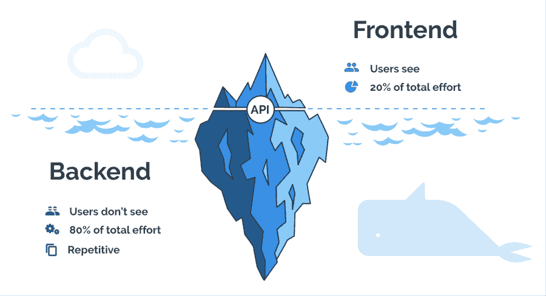
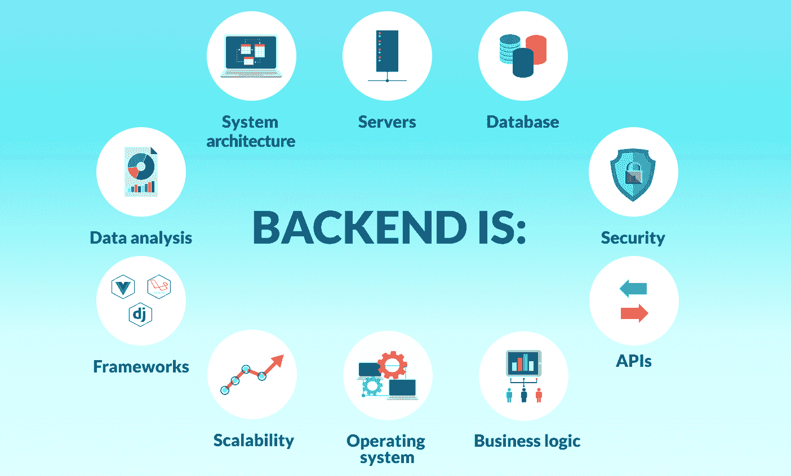
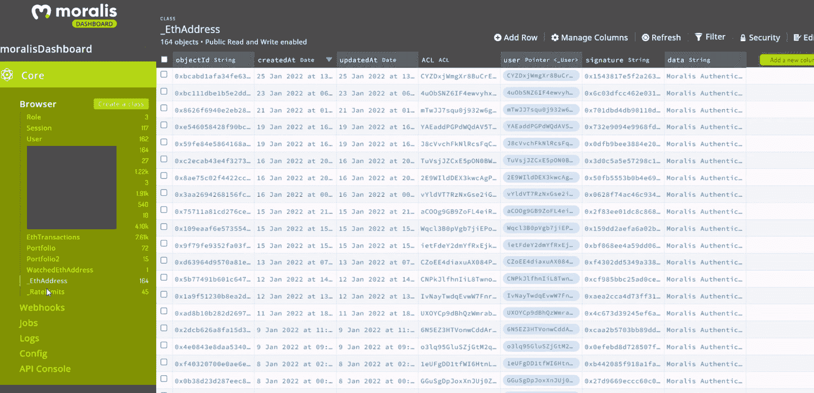
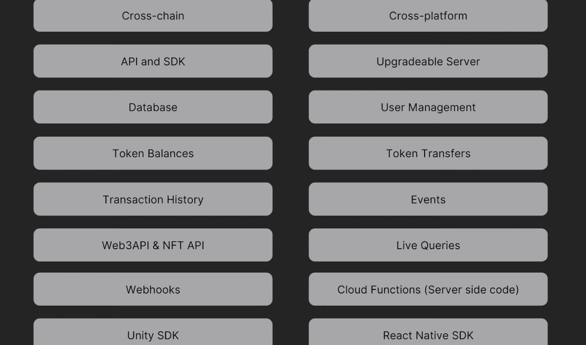
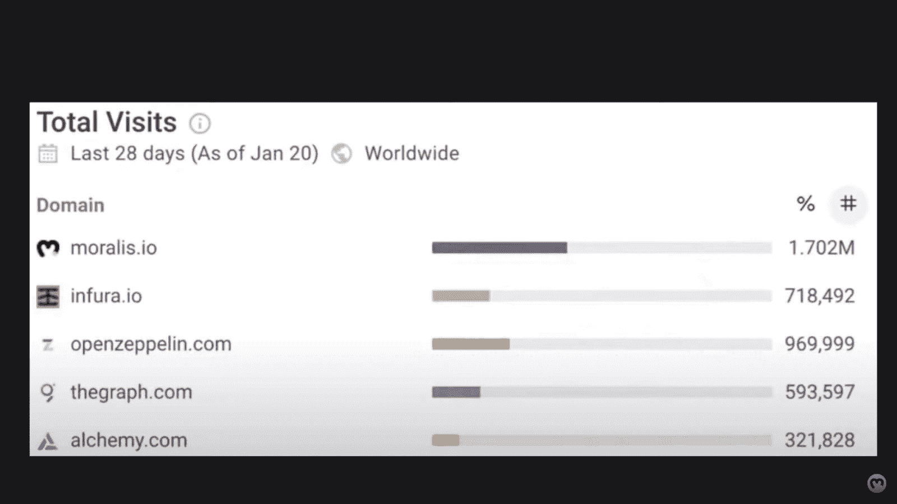
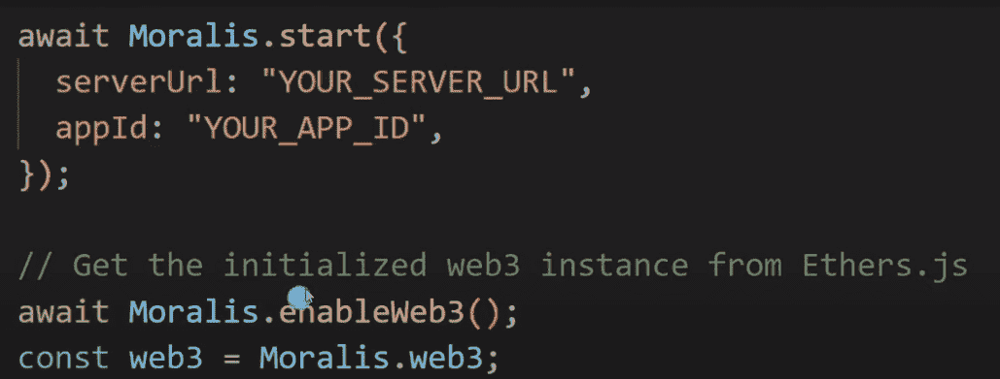

# 探索最好的 Web3 后端平台

> 原文：<https://moralis.io/exploring-the-best-web3-backend-platform/>

**自从第一个可编程区块链(** [**【以太坊】**](https://moralis.io/full-guide-what-is-ethereum/) **)诞生以来，对 Web3 后端和前端开发者的需求一直在飙升。反过来，许多程序员希望抓住机会，通过成为 Web3 开发人员来保证他们的职业生涯。然而，许多有抱负的区块链开发者发现 Web3 的后端令人望而生畏。因此，如果有一个可以简化后端编程的 Web3 平台，岂不是非常有益？如果有的话，你将能够把你所有的努力、时间和资源投入到创造一个非凡的前端上。此外，您可以避免从头开始构建 dApp 的后端。幸运的是，这正是最好的 Web3 后端平台所提供的。**

不久前，在以太坊上构建的唯一方法是运行自己的 [RPC 节点](https://moralis.io/ethereum-rpc-nodes-what-they-are-and-why-you-shouldnt-use-them/)。此外，你必须从头开始构建一切。甚至像 [Web3 认证](https://moralis.io/web3-authentication-the-full-guide/)这样的基本功能也可能需要数周才能开发出来。这不仅非常耗时，而且还迫使开发人员处理 RPC 节点的所有[限制。现在，快进到 2022 年，你有一个相当令人印象深刻的](https://moralis.io/exploring-the-limitations-of-rpc-nodes-and-the-solution-to-them/) [Web3 技术堆栈](https://moralis.io/exploring-the-web3-tech-stack-full-guide/)供你使用。首先，有许多著名的可编程链可供选择。另外，许多著名的 API 和[节点提供者](https://moralis.io/infura-alternatives-and-blockchain-node-providers/)也使事情变得更容易。然而，这些并不是领先的 Web3 后端解决方案。真正的 Web3 后端捷径来自最好的 Web3 后端平台—[Moralis](https://moralis.io/)。

## 什么是后端？

后端，也称为服务器端，是指所有在客户端(用户)看不到的情况下运行的功能。虽然用户只对前端感兴趣，但通常是后端承担所有繁重的工作。

你可能听说过 LAMP 和 MEAN 等后端技术栈。前者包括 Linux，Apache MySQL，PHP，后者包括 MongoDB，Express，Angular，NodeJS。此外，任何后端的一个重要部分是数据库。

数据库用于存储和组织信息，并作为持久存储。通过 CRUD 功能，数据库可以添加、读取、更新和删除数据。此外，请注意，有各种类型的数据库。更重要的是，对于今天的讨论，请记住区块链也是一种特定类型的数据库。它们是公共的、不可变的、只附加的数据库。

因此，总结一下:后端是应用程序(或其他操作)的一部分，用户无法访问它来使应用程序运行。

## 你为什么需要一个 Web3 后端？

现在我们都知道后端是什么，区块链本质上是一种特殊类型的数据库，你可能已经意识到为什么你需要一个 Web3 后端，对吗？嗯，为了确保我们都在同一页上，让我们详细说明一下。如果区块链是数据库，如果数据库是后端的重要组成部分，那么根据定义，没有 Web3 后端，我们无法与区块链互动。这意味着即使是最简单的 dApp 或 Web3 应用程序也需要一个合适的后端。此外，你的后端越好，你的 dApp 运行就越流畅。此外，具有高质量后端的 dApp 还将提供更多功能。因此，它不会限制前端。然而，一定要记住，不是所有的后端都一样好。

例如，直接与区块链或者甚至与 RPC 节点通信是非常有限的。这两层都相当原始。相当于建网站的时候和 CPU 沟通。你能想象吗？这就是 API 发挥作用的地方。此外，实际上有相当多的可靠和有信誉的 Web3 API 提供者可用(见下面的列表)。

我们的一些顶级 Web3 后端 API 精选:

*   道德
*   共价的
*   图表
*   快速笔记
*   魔力
*   bigquery
*   肖像学

然而，看看遗留系统，我们可以看到平台是最容易创建应用程序的首选工具。Firebase、Azure 和 Amazon Web Service (AWS)是 Web2 开发的无价工具。因此，我们可以在 Web3 开发中期待相同的模式。现在，虽然一些节点和 API 提供商试图将自己定位为 Web3 开发平台，但他们缺乏真正被称为平台的功能范围。然而，有了一个充满奉献和爱心的开发团队，Moralis 成功地成为了最终的 Web3 后端平台。

# 最佳 Web3 后端平台——遇见道德

至此，您知道平台是创建应用程序的终极捷径。怎么会？嗯，他们为你承担了大部分与后端相关的繁重工作。然而，有些人比其他人更好。例如，有一个平台可以让你简单地复制和粘贴简短的代码片段，甚至包括最先进的后端功能。这正是 Moralis 所提供的，也是 Moralis 如何帮助开发人员将平均 dApp 开发时间减少了 80%以上。因此，它的昵称“ [Firebase for crypto](https://moralis.io/firebase-for-crypto-the-best-blockchain-firebase-alternative/) ”，被公认为 Web3 后端编程的首选和最佳平台。

接下来，我们将介绍 best Web3 后端平台的主要功能，并向您展示如何轻松入门。与传统平台一样，您的第一步是创建一个免费的 Moralis 帐户。通过这样做，你可以获得所有需要的工具来[快速简单地构建去中心化的应用](https://moralis.io/how-to-build-decentralized-apps-dapps-quickly-and-easily/)。除了不断的改进，包括增加对新的可编程链的支持，Moralis 还听取用户的意见。因此，它现在根据社区的请求使用 ethers . js([web 3 . js vs ethers . js](https://moralis.io/web3-js-vs-ethers-js-guide-to-eth-javascript-libraries/))。此外， [Moralis Nitro](https://moralis.io/moralis-releases-moralis-nitro/) 也于本月发售。后者增加了许多高级功能，并显著提高了速度。

## 探索 Moralis 的 SDK

使用 JavaScript 库和[以太坊 API](https://moralis.io/ethereum-api-develop-ethereum-dapps-with-moralis/) 给你提供了很多选择。然而，这些都有一定的局限性。幸运的是，Moralis 使您能够轻松跨越这些限制。首先，跨链互操作性是 Moralis 提供无与伦比的优势的地方。由于 [Moralis 的 SDK](https://moralis.io/exploring-moralis-sdk-the-ultimate-web3-sdk/) 支持几个可编程的区块链，你可以让你的工作面向未来。通过为多个链创建 Moralis 服务器，您可以在所有支持的区块链上部署 dApps。此外，Moralis 使您能够有效地处理链上数据。

当您想要创建下一代应用程序时，您需要有一个合适的 Web3 后端供您使用。自己创建基础设施，可能需要几周或几个月的时间。此外，你需要一个完整的后端开发团队来维护它。因此，这显然不是最佳方式，尤其是如果你甚至不确定用户是否会喜欢你的前端。因此，使用现有的基础设施是有意义的。此外，由于节点和 API 提供者仍然有许多限制(两者都为您提供原始数据)，使用最好的 Web3 后端平台是最佳解决方案。它使您能够避免重新发明轮子，专注于真正重要的东西——用户体验。

### 道德的 Web3 武器库

道德使事情变得极其简单和实用。登录到您的帐户后，您可以执行以下所有操作以及更多操作:

*   只需点击几下鼠标即可启动您的服务器。
*   启动你自己的数据库。
*   自动获得终极 API。
*   自动获取同步选项。
*   编写服务器端代码的能力。
*   访问实时事件、触发器和网络挂钩([同步和索引智能合同](https://moralis.io/sync-and-index-smart-contract-events-full-guide/))。
*   一种存储所有实时链上数据的简洁方法(在 Moralis 的仪表板中:[索引区块链](https://moralis.io/how-to-index-the-blockchain-the-ultimate-guide/))。

以下是最能描述道德的关键特征列表:

因此，请确保加入其他使用 Moralis 的开发人员，使 Web3 开发变得简单:

## 如何开始使用最好的 Web3 后端平台

在创建 dApps 时，您有两种选择。你可以使用终极的[以太坊 dApp 样板](https://moralis.io/ethereum-dapp-boilerplate-full-ethereum-react-boilerplate-tutorial/)或者 Moralis Web3 API 来从头构建 dApp。无论哪种方式，您都需要完成初始设置。为了让您尽可能简单明了，我们将它分成了两部分。

### Moralis 初始设置-第 1 部分

1.  [**创建您的 Moralis 账户**](https://admin.moralis.io/register)——使用左边的链接进入注册页面。在那里，您可以通过输入您的电子邮件地址和创建您的密码来创建您的免费帐户。不要忘记确认您的帐户(点击发送到您电子邮件的确认链接)。另一方面，如果你已经有一个有效的道德账户，只需[登录](https://admin.moralis.io/login)。
2.  **创建新服务器**–成功登录您的 Moralis 管理区域后，导航至导航选项卡左侧的“服务器”选项。在那里，点击右上角的“+创建新服务器”。接下来，从下拉菜单中选择最适合您需求的网络类型(见下图)。*使用“测试网服务器”选项(* [*连接以太网测试网*](https://moralis.io/ethereum-testnet-guide-connect-to-ethereum-testnets/) *)往往是处理示例项目时的最佳选择。*

选择服务器类型后，您将看到一个弹出窗口，询问服务器的详细信息。因此，输入您的服务器名称，并选择您的地区、网络和链:

最后，单击“添加实例”按钮启动服务器。*请注意，服务器启动可能需要一些时间。*

### Moralis 初始设置-第 2 部分

3.  **访问服务器详细信息**–创建完 Moralis 服务器后，您可以点击服务器名称旁边的“查看详细信息”按钮来访问其详细信息:

详细信息将显示在新的弹出窗口中。复制图标用于复制有问题的详细信息:

4.  **初始化 Moralis**–为了初始化 Moralis 并访问其 SDK 的全部功能，包括 Web3 API，您需要填充您的编码文件。如果你是从零开始，这将是一个”。html“，”。jsx”，或者”。js”文件。然而，如果你使用的是最实用的 [Web3 样板文件](https://moralis.io/web3-boilerplate-beginners-guide-to-web3/)，你将需要填充。env "文件。这是您复制和粘贴 Moralis 服务器详细信息(应用程序 ID 和服务器 URL)的地方:
    1.  使用最终的 Web3 样板文件:

2.  从头开始构建 dApps(“。js "文件):

*注意* *:确保使用你的服务器的细节和* ***而不是*** *上图中的细节。*

接下来，我们鼓励您尽快使用上述说明并创建您的第一个 dApp。因此，你会熟悉新获得的武器库的使用。然而，如果你不知道从哪里开始，我们建议你在[道德 YouTube 频道](https://www.youtube.com/c/MoralisWeb3)和[道德博客](https://moralis.io/blog/)上寻求指导。这两个出口提供了无数的例子项目。因此，你可以跟随 Moralis 专家创建不同的有趣的 dApps 示例。此外，我们的内容也是一个伟大的方式来继续你的免费区块链教育。例如，我们的一些最新话题涵盖了 [Web3 游戏化](https://moralis.io/web3-gamification-creating-a-coinmarketcap-diamonds-dapp/)、 [NFT 游戏角色](https://moralis.io/nft-game-characters-how-to-mint-in-game-nft-characters/)、[如何铸造 10，000 个 NFT](https://moralis.io/how-to-mint-10000-nfts-full-walkthrough/)、 [Web3 数据科学](https://moralis.io/web3-data-science-importing-on-chain-events/)、[顶级区块链 API](https://moralis.io/alchemy-alternatives-top-blockchain-apis/)、 [ERC721 智能合约](https://moralis.io/erc721-contract-exploring-erc721-smart-contracts/)、[可升级智能合约](https://moralis.io/what-are-upgradable-smart-contracts-full-guide/)，如何[获得 OpenSea API 密钥](https://moralis.io/get-an-opensea-api-key-in-2022-full-guide/)等等。

## 探索最佳的 Web3 后端平台–总结

在这篇文章中，我们已经涉及了相当多的内容。如果你是一名 Web2 前端开发人员，并且希望[成为一名区块链开发人员](https://moralis.io/how-to-become-a-blockchain-developer/)，在这一点上你一定非常兴奋。知道有一个 Web3 后端平台可以让您使用 JavaScript 技能创建跨链可操作的 dApps 是非常了不起的。通过创建你的免费 Moralis 帐户和启动你的服务器，你就可以开始使用最好的 Web3 后端平台了。然后你可以从零开始，甚至通过使用[以太坊样板](https://github.com/ethereum-boilerplate/ethereum-boilerplate)进一步减少你的开发时间。此外，既然你知道你自己不需要担心 Web3 后端，确保把你的“A-game”带到前端。

如前所述，请随意使用我们的文章和视频作为指导。然而，如果你有兴趣采取更专业的方法，我们建议你报名参加[道德学院](https://academy.moralis.io/)。有一个强大的进步社区和专家导师结合高质量的专业课程，你应该马上去全职加密。如果你经验不足，你可能想从[课程](https://academy.moralis.io/all-courses/)开始，比如“[初学者加密](https://academy.moralis.io/courses/crypto-for-beginners/)或“[使用 JavaScript 构建索引](https://academy.moralis.io/courses/javascript-programming-for-blockchain-developers)”。另一方面，如果你已经掌握了基础知识，一定要专注于更高级的课程。既然如此，你不妨报读“[以太坊 dApp 编程](https://academy.moralis.io/courses/ethereum-dapp-programming)”或“[区块链商业大师班](https://academy.moralis.io/courses/blockchain-business-masterclass)”。

