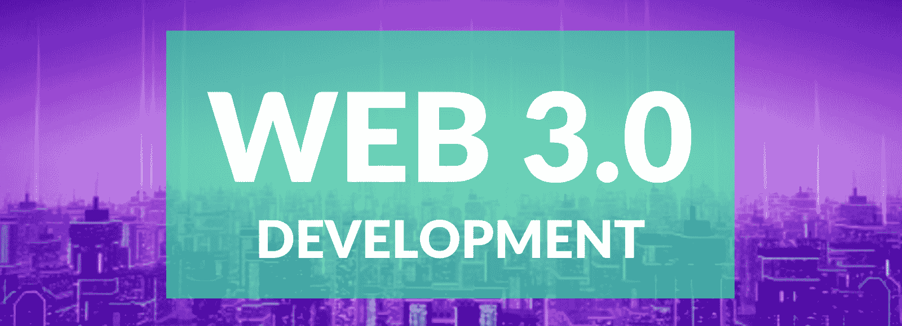
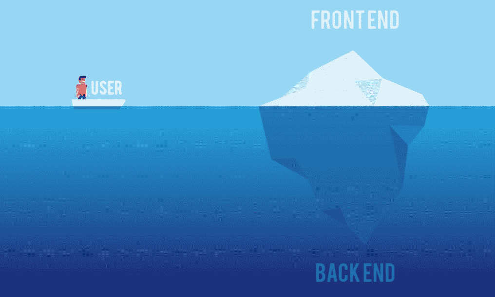
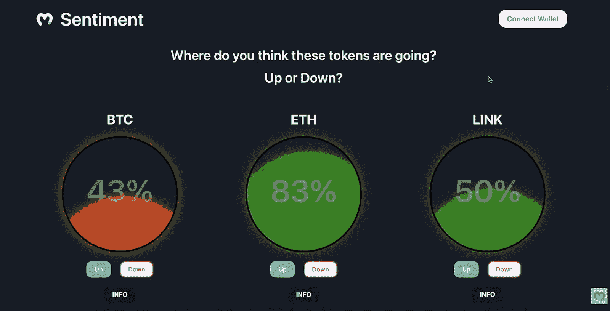
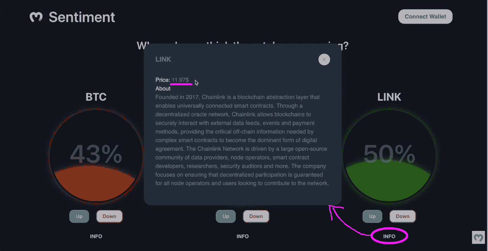
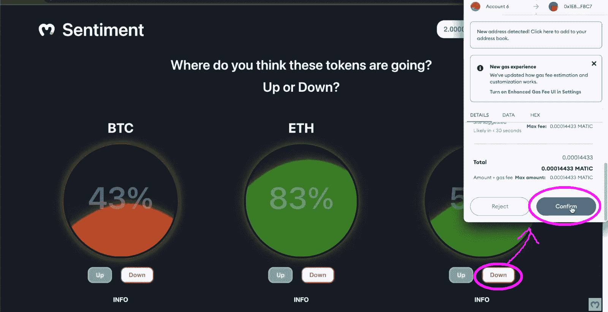
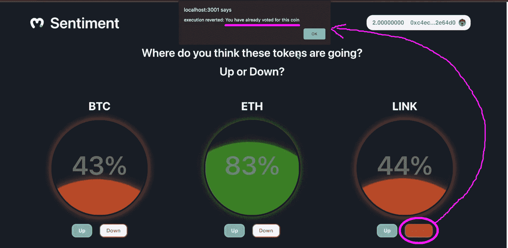
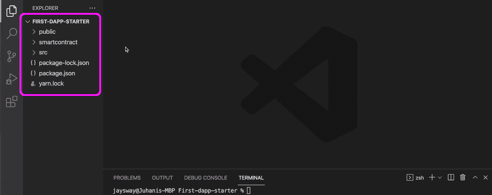
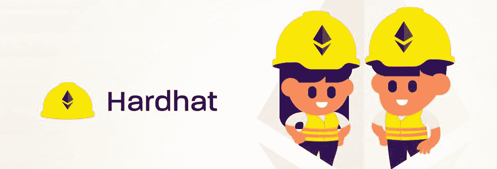
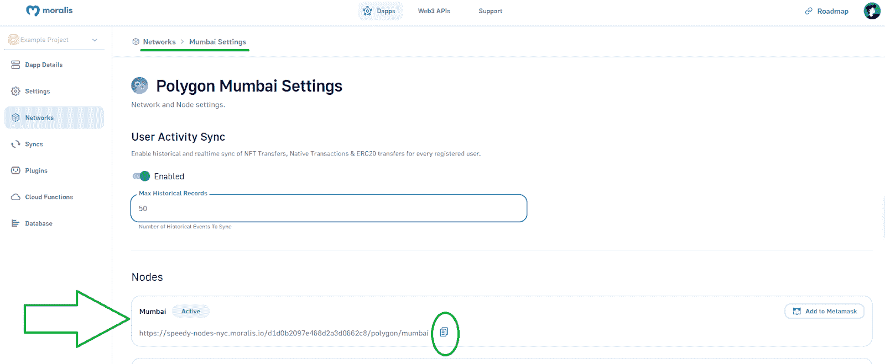
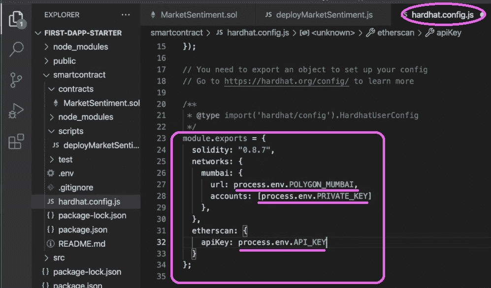

# 全栈 Web3 开发——构建 Web3 项目的终极指南

> 原文：<https://moralis.io/full-stack-web3-development-the-ultimate-guide-to-building-web3-projects/>

虽然市场波动会引起恐慌，但它为 Web3 的发展提供了极好的条件。因此，如果你是加密新手，我们强烈建议你学习全栈 Web3 开发。或者，如果你是一个经验丰富的程序员，想要磨练你的开发技能，尝试通过构建 Web3 项目来推出下一代 dapps 是一个不错的选择。无论你的立场如何，这篇文章都将大有裨益。通过跟随我们的教程，你将直接体验全栈 Web3 开发。还有，你会熟悉一些不可思议的工具，包括 [**React**](https://moralis.io/react-explained-what-is-react/) **，**[**hard hat**](https://moralis.io/hardhat-explained-what-is-hardhat/)**，以及**[**Moralis**](https://moralis.io/)**。**

在我们给你机会卷起袖子之前，我们将确保我们都在同一页上。因此，我们将从回答“什么是全栈 Web3 开发？”开始我们的指南问题。我们还将看看使 Moralis [成为最好的 Web3 后端平台](https://moralis.io/exploring-the-best-web3-backend-platform/)的一些关键点。因此，您可以决定是否要将这个“ [Firebase for crypto](https://moralis.io/firebase-for-crypto-the-best-blockchain-firebase-alternative/) ”平台用于您的项目。然后，我们将注意力转移到这里的示例项目。但是，我们将首先快速演示我们的示例 dapp，而不是立即构建。这样，您将能够决定是否想要亲自参与我们的全栈 Web3 开发壮举。当然，如果你已经掌握了基本知识，可以自由地[创建你的免费道德账户](https://admin.moralis.io/register)并开始建设！

## 什么是全栈 Web3 开发？

当谈到 [Web3](https://moralis.io/the-ultimate-guide-to-web3-what-is-web3/) 开发时，事情遵循 [Web2](https://moralis.io/what-is-web2-and-web3-explaining-web3/) 和所有现有软件的既定模式。因此，我们仍然谈论服务器端(后端)和用户端(前端)。因此，全栈 Web3 开发包括 [Web3 前端](https://moralis.io/web3-frontend-everything-you-need-to-learn-about-building-dapp-frontends/)和 Web3 后端开发。就 Web3 UI 而言，去中心化的互联网并不是重新发明轮子。当然，有 Web3 独有的功能和选项；然而，接口通常旨在遵循已建立的线路。这也意味着你可以利用你现有的前端技能进行 Web3 开发。

另一方面，当涉及到 Web3 后端时，有一个相当大的不同。正如你可能知道的，可编程区块链是这个新网络的核心，以太坊处于领先地位。这些分布式账本支持[智能合约](https://moralis.io/smart-contracts-explained-what-are-smart-contracts/)，它们是[去中心化应用](https://moralis.io/decentralized-applications-explained-what-are-dapps/) (dapps)的大脑。也就是说，Web3 后端要求你[同步和索引智能合约事件](https://moralis.io/sync-and-index-smart-contract-events-full-guide/)。如果你以前尝试过给区块链编索引，你就会知道这相当麻烦。如果你以一种过时的方式去做，尤其是通过独立运行[以太坊 RPC 节点](https://moralis.io/ethereum-rpc-nodes-what-they-are-and-why-you-shouldnt-use-them/)来做。这是一种保证会遇到 RPC 节点的所有限制的方法，并花费数周甚至数月来建立所需的基础设施。

幸运的是， [Web3 技术栈](https://moralis.io/exploring-the-web3-tech-stack-full-guide/)近年来已经取得了长足的进步。如果你想知道“如何让 T2 在 2022 年进入 Web3 答案在于使用 Moralis——最终的 Web3 开发平台！有了它的平台，利用您的 JavaScript 熟练程度和 Web3 基础知识，您可以成为一名全栈 Web3 开发专家！

### 遇见道德家

Moralis 提供了构建高性能 dapps 的单一工作流程。因此，该平台使您能够在一个地方涵盖整个堆栈 Web3 开发。Moralis 的 Web3 工作流分为四个阶段，涵盖了从认证用户和监控历史和实时交易到强大的跨平台 SDK 和跨链 [Web3 API](https://docs.moralis.io/moralis-dapp/web3-api) 的所有内容。

由于 [Web3 认证](https://moralis.io/web3-authentication-the-full-guide/)是所有 dapps 的起点，Moralis 使您能够用一行代码实现它。因此，用户可以使用任何他们喜欢的 [Web3 钱包](https://moralis.io/what-is-a-web3-wallet-web3-wallets-explained/)，例如 [MetaMask](https://moralis.io/metamask-explained-what-is-metamask/) ，来执行 [Web3 登录](https://moralis.io/how-to-build-a-web3-login-in-5-steps/)。此外，Moralis 支持传统登录方法，包括通过电子邮件进行的 [Web3 身份验证](https://moralis.io/how-to-do-web3-authentication-via-email/)和 [Web3 社交登录](https://moralis.io/web3-social-login-sign-in-dapp-users-with-google-email-or-twitter/)。由于大多数用户都熟悉这些认证方法，他们可以帮助您[提升 Web3 用户的参与度](https://moralis.io/how-to-boost-web3-user-onboarding-success-rates/)。另一方面，对于更懂加密的用户来说，使用元掩码进行认证的选项仍然是最受欢迎的选择。

一旦用户通过身份验证，Moralis 的监控功能使您能够毫不费力地监控他们的转账、交易、铸币、刻录和所有其他与您的 dapp 相关的操作。此外， [Moralis 的 SDK](https://moralis.io/exploring-moralis-sdk-the-ultimate-web3-sdk/) 有多种形式:网络 SDK、游戏 SDK 和后端 SDK。这样，你就可以在你喜欢的平台上使用道德的力量。尽管如此，由于 Moralis 的跨链互操作性，您永远不会被任何特定的链所束缚。因此，您的工作是面向未来的。另外，Moralis 提供了与它的[插件](https://moralis.io/plugins/)生态系统的无限集成。因此，如果您还没有这样做，请确保创建您的免费 Moralis 帐户并处理我们的示例项目！

## 全栈 Web3 开发–我们的示例 Dapp 的演示

下面是我们的示例 dapp 前端的截图:

正如你所看到的，你将得到[建立一个秘密情绪 dapp](https://moralis.io/how-to-create-a-crypto-sentiment-dapp/) 。这个 dapp 有一个简单干净的设计，结合了直观的用户界面。没有我们的解释，你可能会知道如何使用它。此外，我们的 dapp 还有一些动画方面，这意味着视频教程可以更加生动。为此，请使用本文末尾的视频(0:19)。

如果你再看一下上面的截图，你可以看到泡泡里面的百分比值。这些值反映了选民对特定加密货币的看法，正如气泡上方的标记所示。对于大多数选民预计价格会上涨的产品,“液体”会变成绿色。相反，当数字低于百分之五十时，“液体”变成红色。此外，在我们的情感 dapp 中有四种类型的按钮:“向上”、“向下”、“信息”和“连接钱包”。多亏了 Moralis 的 [web3uikit](https://moralis.io/web3ui-kit-the-ultimate-web3-user-interface-kit/) ，快速设置这些按钮变得很容易。

通过点击“信息”按钮，我们的 dapp 显示“关于”信息和该股票的当前价格:

就投票而言，只有经过身份验证的用户才能参与:

要登录，用户需要点击“连接钱包”:

接下来，他们需要选择他们的首选钱包(例如元掩码):

最后，经过身份验证的用户可以投票。由于投票是链上事件，用户需要确认相关交易:

这个 dapp 背后的 [Web3 契约](https://moralis.io/what-are-web3-contracts-exploring-smart-contracts/)也确保每个用户对每个股票只投一次票:

## 全栈 Web3 开发教程

看了上面的演示后，您可以看到这个简单的示例 dapp 包含了几个前端和后端元素。因此，这是展示全栈 Web3 开发的一些关键方面的绝佳选择。接下来，您将会:

*   使用 Hardhat 创建、编译和部署智能合同。
*   使用 React 和 Moralis 的 web3uikit 创建一个整洁的 Web3 前端。
*   同步和索引智能合同事件。

请注意，您不必从头开始这个示例项目。相反，你可以使用我们的[起始码](https://github.com/MoralisWeb3/youtube-tutorials/tree/main/FirstDapp-Starter)，它在 GitHub 上等着你。此外，在接下来的部分中，我们将重点帮助您完成初始设置。此外，我们将尽最大努力为您提供一个完整的栈 Web3 开发过程的清晰概述。然而，关于这个示例项目的具体阶段的更多细节，我们将参考您可以在本文底部找到的视频教程。

*注意* *:如果你很急，只是想测试我们的例子 dapp 或者探索代码，用我们的* [最终代码](https://github.com/MoralisWeb3/youtube-tutorials/tree/main/FirsrDapp-Final) *代替。*

## 全栈 Web3 开发教程–初始设置

克隆我们的起始代码后，您应该会看到 Visual Studio 代码(VSC)中的以下项目结构:

接下来，您需要完成一些初始的安全帽设置(4:16)。您将从“ *cd smartcontract* ”命令开始，该命令将带您进入“smartcontract”文件夹。在那里，您将使用“ *npm i -D hardhat* ”命令安装 Hardhat:

然后，输入“ *npx hardhat* ”创建一个新的 hardhat 项目。该命令将提示一系列设置问题。因为顶部的选项是你需要选择的，你只需要按几次“回车”键:

一旦您的新 Hardhat 项目准备就绪，您将在“smartcontract”文件夹中看到一些附加元素:

为了完成安装，您还需要安装两个依赖项。因此，输入这两个命令:

*   " *npm i -D dotenv*
*   "*NPM I-D @ nomic labs/hard hat-ethers can*"

## 使用 Hardhat 创建、编译和部署智能合同

准备好 Hardhat 项目后，是时候创建自己的智能合同了(5:35)。在我们内部专家的带领下，你将在几分钟内准备好你的合同，即使你没有任何技能。一个小提示是，通过使用 [OpenZeppelin](https://moralis.io/what-is-openzeppelin-the-ultimate-guide/) 上提供的经过验证的模板，你可以避免从头开始创建智能合同。

*注意* *:您还可以使用其他工具来部署智能合同。例如，* [混音](https://moralis.io/remix-explained-what-is-remix/) *就是一个很好的选择。因此，可以随意使用该 IDE 来部署"*[market 情操. sol](https://github.com/MoralisWeb3/youtube-tutorials/blob/main/FirsrDapp-Final/src/smartcontract/MarketSentiment.sol) *"智能契约。*

有了智能合约代码，您将需要调整“sample-script.js”文件，以便它将您的智能合约部署到 Mumbai (Polygon 的 testnet)。在下面的视频中，从 16:58 开始，您将学习如何确保代码与您的”。sol "文件的名称。接下来，您将关注“hardhat.config.js”文件(18:05)。这也是你创造自己的地方”。env "文件。您将使用后者来存储以下重要变量:

*   PolygonScan 的 API 密钥

*   孟买的终点
*   您的元掩码私钥

### 获取环境变量

您将在免费 PolygonScan 帐户的仪表板中获得您的 PolygonScan API 密钥(19:08):

然而，就孟买测试网的端点而言，你可以使用[Moralis Speedy Nodes](https://moralis.io/speedy-nodes/)(19:53)。

*注意* *:我们的内部专家在视频教程中使用的是以前版本的 Moralis admin UI。这取决于这篇文章发表多久了，但是你仍然可以在你的 Moralis 管理区切换到遗留 UI:*

然而，新的用户界面非常直观。从创建新的 dapp 开始:

然后，选择环境:

接下来，选择孟买连锁店并点击“继续”:

第二步，选择离你最近的城市:

要完成设置，请命名您的 dapp 并点击“创建您的 Dapp”:

一旦您的 dapp 上线，您需要点击“设置”按钮:

然后，进入“网络”选项卡，点击“多边形孟买”的“设置”:

最后，复制孟买的端点:

对于第三个环境变量(私钥)，使用您的元掩码(20:48):

既然你已经知道了如何获得所有三个环境变量，那么获得你的。env "文件就绪:

在编译您的智能合约之前，您必须在“hardhat.config.js”中实现一些最终的调整:

在 22:38，视频将最终引导您完成编译、部署和验证您的智能合约的步骤。这也将结束这个全栈 Web3 开发教程的第一部分。

## 我们的全栈 Web3 开发教程的前端部分

你的下一站将是前台。从 29:01 开始，您将学习如何使用 React 创建 UI，如上面的演示所示。然后，从 30:03 开始，你将学习如何创建你的单页 dapp 的页眉。接下来，您将添加硬币组件(32:26)。最后，在 38:23，您将实现投票按钮。

要将我们全栈 Web3 开发的前端部分带回家，您需要获得您的 Moralis dapp 证书。使用与上面相同的指令获得 Mumbai 的端点。但是，不要转到“网络”选项卡，而是停留在“Dapp 详细信息”选项卡上。然后，将您的 dapp URL 和应用 ID 复制并粘贴到“index.js”文件中:

现在，您将能够使用强大的 Moralis Web3 API 来实现信息模型(41:26)，包括令牌价格。

## 我们的全栈 Web3 开发教程的后端部分

从 50:30 开始，你将开始解决最后一块拼图。在这里，您将了解如何将 React 应用程序连接到智能合同。由于 Moralis 的“同步”功能和 Moralis 的数据库，您可以毫不费力地做到这一点:

一旦您设置了新的同步，Moralis 数据库将自动进行索引。因此，所有链上的数据都将由您处理。反过来，你的情绪 dapp 会反映当前的状态！

最后，这是我们在整个全栈 Web3 开发教程中一直引用的视频教程:

https://www.youtube.com/watch?v=MI_Se26Sfmo

## 全栈 Web3 开发–构建 Web3 项目的终极指南–摘要

在本文中，您了解了什么是全栈 Web3 开发。接下来，你熟悉了道德和我们的榜样情感 dapp。然后，您有机会卷起袖子完成我们的示例项目。因此，您能够实现全栈 Web3 开发的所有部分。其中包括:

*   部署智能合同
*   建立一个引人注目和用户友好的前端
*   索引区块链

使用 Hardhat、React 和 Moralis，您可以在大约一个小时内完成所有三个主要阶段。

如果你喜欢这个指南，我们鼓励你访问[道德伦理 YouTube 频道](https://www.youtube.com/c/MoralisWeb3)和[道德伦理博客](https://moralis.io/blog/)。这两个网站都有许多区块链开发教程和其他加密文章。你可以用它们来了解 [Web3 游戏设计](https://moralis.io/web3-game-design-explaining-the-web3-game-design-process/)、[不可替换令牌](https://moralis.io/non-fungible-tokens-explained-what-are-nfts/) (NFTs)、 [Unity Web3 编程](https://moralis.io/unity-web3-beginners-guide-to-unity-web3-programming/4)等等。此外，一些最新的话题集中在一个 [AR 元宇宙 NFT](https://moralis.io/how-to-create-an-ar-metaverse-nft-mystery-box/) 神秘盒子、 [Web3 增强现实](https://moralis.io/how-to-build-a-web3-augmented-reality-nft-loot-box/)、一个[以太坊 dapp API](https://moralis.io/what-is-an-ethereum-dapp-api-build-ethereum-dapps-easily/) 、一个 [Web3 博客 dapp](https://moralis.io/guide-to-creating-a-web3-blog-dapp/) ( [Web3 媒体](https://moralis.io/how-to-build-a-web3-medium-clone/))以及[以太坊合并](https://moralis.io/ethereum-merge-what-is-ethereum-2-0-and-the-merge/)。最终，拥有大量高质量的内容，这两个出口可能会支持你的免费和持续的加密教育。然而，如果你渴望[快速而自信地成为一名区块链开发者](https://moralis.io/how-to-become-a-blockchain-developer/)，那么[道德学院](https://academy.moralis.io/)可能就是你要去的地方！