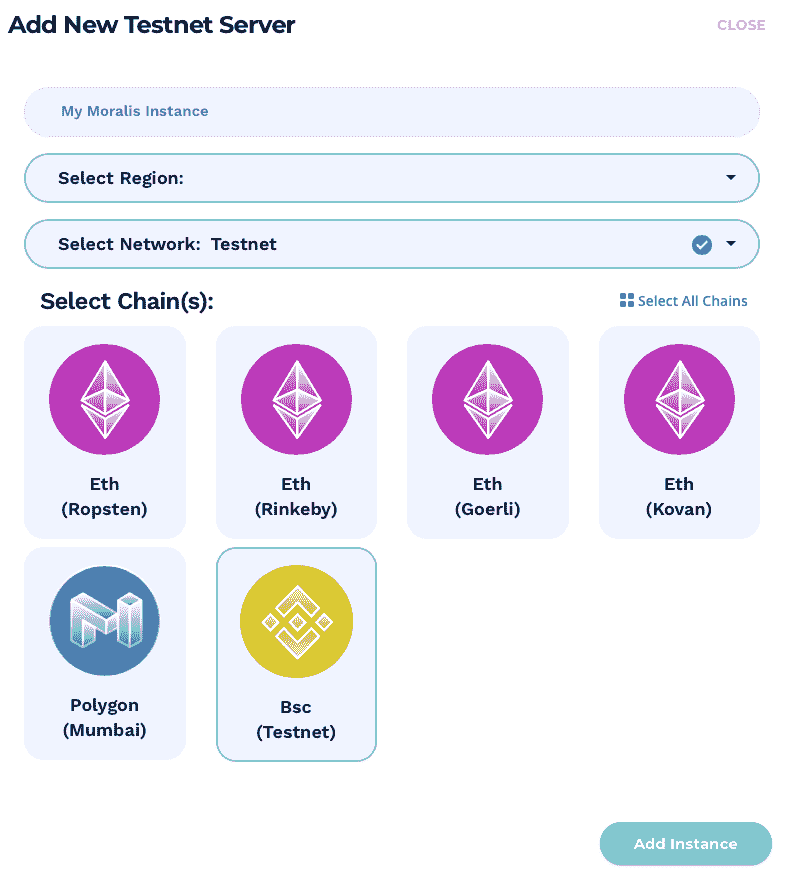
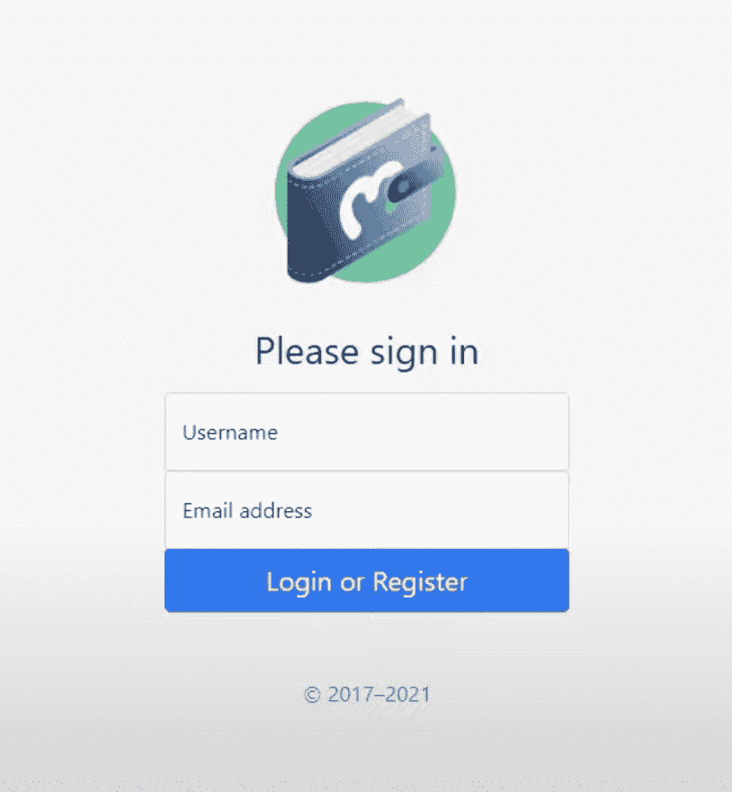
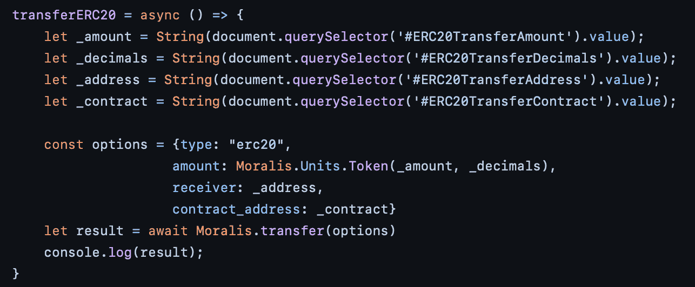
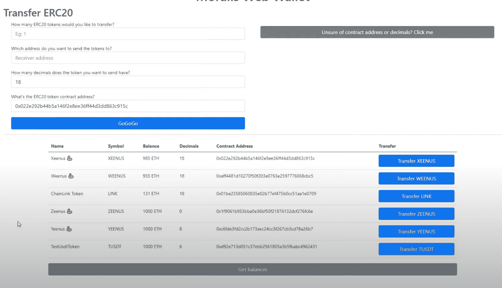

# 如何用 4 个步骤建立一个加密钱包

> 原文：<https://moralis.io/how-to-build-a-crypto-wallet-in-4-steps/>

Web3 开发者会知道新的[**【dApps】**](https://moralis.io/decentralized-applications-explained-what-are-dapps/)**(去中心化应用)和 Web 应用是如何频繁地涌现出来的。这方面的一个例子是加密钱包，这里有太多的选择。这是可以理解的，因为加密钱包对于任何参与加密的人来说都是必不可少的元素。事实上，有数百种替代方案，如比特币基地、币安，当然还有 MetaMask。这些钱包允许用户有效地管理他们的加密资产。此外，随着越来越多的主流采用 crypto，它们越来越受欢迎，我们将在本文中进一步研究如何使用终极** [**Web3 开发**](https://moralis.io/how-to-build-decentralized-apps-dapps-quickly-and-easily/) **平台—** [**道德**](https://moralis.io/) **构建一个加密钱包。**

从传统的角度来看，dApp 开发最紧迫的问题之一一直是后端开发。这是 [Web3](https://moralis.io/the-ultimate-guide-to-web3-what-is-web3/) 的开发与 Web2 的开发显著不同的地方。因此，Web3 后端管理很困难，需要资源和时间。然而，这就是 Moralis 作为开发 dApps 的首要中间件出现的原因。该平台提供了一个随时可用、即插即用的后端基础设施，允许开发人员专注于[创建最高标准的智能合同](https://moralis.io/how-to-create-smart-contracts/)，并专注于前端开发。

此外，该平台还提供了一系列优秀的开发工具，如 [Moralis 的快速节点](https://moralis.io/speedy-nodes/)，跨链兼容性，以及对 [IPFS](https://moralis.io/what-is-ipfs-interplanetary-file-system/) 的原生支持。这意味着为 Moralis 用户提供了部署和开发 dApps 所需的一切。

所以，如果你想从事 Web3 开发，注册 Moralis 是一个合理的选择。这将使你可以立即访问所有的平台工具，并有可能利用已经开发的后端结构！

# 如何用 4 个步骤建立一个加密钱包

在接下来的几节中，我们将仔细看看如何从头开始构建一个加密钱包。我们将创建一个 web 应用程序，用户可以使用[元掩码](https://moralis.io/metamask-explained-what-is-metamask/)登录并验证自己。

登录后，他们将能够查看自己的交易、余额和 NFT。此外，我们将增加转移以太网和 ERC-20 令牌的能力。因此，这个加密钱包将为用户提供直接通过我们的应用程序全面管理其加密资产所需的工具。

然而，浏览这个应用程序的所有代码有点不必要，而且会花很长时间。出于这个原因，我们决定将我们的大部分注意力集中在仔细研究使用户能够直接通过钱包转移硬币和代币的功能上。尽管如此，我们仍然会提供完整应用程序的概述，您可以通过仔细查看这个 web 应用程序的 [GitHub 存储库](https://github.com/ChrisMoralis/Moralis-Tutorials/tree/main/05%20Creating%20A%20Web%20Wallet%20-%20part%201)来进行补充。在这个目录中，您会发现从 HTML 文件到包含所有特性逻辑的 JavaScript 文件的所有内容。

因此，我们将如何构建加密钱包的过程分为四个不同的步骤:

1.  创建一个道德服务器
2.  用 HTML 构建内容
3.  添加 JavaScript 逻辑
4.  添加传递函数

遵循这四个步骤将使我们大致了解完成这个加密钱包需要什么。因此，让我们通过创建我们自己的 Moralis 服务器来开始本教程。

此外，如果你更想看这个过程的视频教程，那么仔细看看这个来自道德 YouTube 频道的视频:

https://www.youtube.com/watch?v=zd0pBsmJI8s

## 步骤 1:如何构建加密钱包——创建一个 Moralis 服务器

因为我们将在整篇文章中与 Moralis 合作，所以我们需要做的第一件事就是注册这个平台。这只需要几秒钟，作为用户，我们可以开始设置我们自己的服务器。

要启动一个新实例，我们必须在登录 Moralis 后点击“+创建新应用”按钮。你可以在界面的右上方找到这个按钮，一旦按下，它会为我们提供一个下拉菜单。

菜单将包含三种不同的选择；然而，你选择哪一个并不重要；所有选项将带你到一个新的窗口，你需要输入一个名称，选择一个地区，然后选择网络。我们为这个例子选择了一个 testnet 服务器，但是这个决定应该基于 dApp 的目的。

输入所有信息后，剩下的就是点击右下角的“添加实例”按钮来启动服务器。然而，这可能需要一段时间，但不用担心；服务器将在几分钟内完成。

## 步骤 2:如何构建加密钱包——用 HTML 构建内容

创建我们自己的加密钱包时，我们需要做的第二件事是为我们的 web 内容设置正确的结构。这可以通过 HTML 代码来完成，在这个例子中，我们有两个不同的文件；一个用于登录页面，一个用于仪表板本身。因此，登录页面一旦完成，看起来将如下所示:

这个特定页面的代码可以在 GitHub 资源库的“[index.html](https://github.com/ChrisMoralis/Moralis-Tutorials/blob/main/05%20Creating%20A%20Web%20Wallet%20-%20part%201/index.html)”文件中找到。该文件中的代码基于我们用来构建的简单引导登录模板。没有比这更复杂的了，您可以使用相同的模板，并根据自己的需要进行一些修改。

接下来，我们还有加密钱包的仪表板页面，如下所示:

仪表板的代码也可以在 [Moralis GitHub](https://github.com/ChrisMoralis/Moralis-Tutorials/blob/main/05%20Creating%20A%20Web%20Wallet%20-%20part%201/dashboard.html) 中找到，就像“index.html”文件一样，它也是基于引导模板的。然而，该文件中值得注意的一个关键元素是，我们将 SDK 连接到 Moralis，如下所示:

此外，该代码的大部分是我们的加密钱包的字段和按钮，这些是我们稍后在编写 JavaScript 代码时将引用的元素。此外，在文件的底部，我们还发现一些重要的代码实现了一些 JavaScript 文件，使模板正常工作。

## 步骤 3:如何构建加密钱包——JavaScript 逻辑

接下来，我们有一个包含应用程序逻辑的 [JavaScript](https://moralis.io/javascript-explained-what-is-javascript/) 文件。在这个文件中，我们有一堆不同的函数，使我们的钱包按预期工作。我们不会仔细阅读每一行代码，因为有很多内容需要理解。如前所述，我们将重点介绍实现账户间转账所需的功能。然而，要获得完整的概述和完整的文件，您可以再次访问 [GitHub 库](https://github.com/ChrisMoralis/Moralis-Tutorials/blob/main/05%20Creating%20A%20Web%20Wallet%20-%20part%201/main.js)。

我们要做的第一件事是初始化 Moralis。这基本上将我们的项目连接到我们在第一步中创建的 Moralis 服务器。要将两者联系在一起，我们需要实现以下代码行:

如您所见，我们需要应用 ID 和服务器 URL。我们可以通过点击 Moralis 管理面板中“Servers”选项卡下的“View Details”按钮从我们的服务器获取这些元素。我们需要做的就是将这两个元素复制并粘贴到我们的代码中来实现它们。

除此之外，我们还有一些登录、注销、呈现内容、隐藏内容等基本功能。这些都是非常简单的功能，很容易实现。例如，登录功能如下所示:

在这种情况下，所有真正必要的是“道德”。Web3.authenticate()"行，因为我们使用了 Moralis。如果没有这个平台，这个任务会复杂得多，这只是 Moralis 派上用场的一个例子。

## 步骤 4:如何建立一个加密钱包-转移功能

在这个加密钱包中，我们有几个不同的功能来转移令牌。例如，我们有一个函数用于发送 ETH，一个用于 ERC-20 令牌，一个用于 [NFTs](https://moralis.io/non-fungible-tokens-explained-what-are-nfts/) 。由于我们正在与 Moralis 合作，因此可以轻松添加这些功能，因为该平台提供了一些“开箱即用”的功能。

### 传输以太网

首先，我们有一个发送 ETH 的函数，看起来像这样:

我们基本上只需要“Moralis.transfer(options)”函数，这是一行代码，用于将 ETH 从一个帐户转移到另一个帐户。然而，正如您从代码中看到的，这个函数以对象的形式接受一个参数。因此，在调用这个函数之前，我们指定“选项”对象的属性。例如，我们首先确定令牌的类型，在本例中是“本地”，然后是用户输入的数量，最后是 ETH 应该发送到的地址。

### 转让 ERC-20 代币

转移 ERC-20 代币的功能稍微复杂一些；然而，就像传输 ETH 一样，只需要一行代码就可以实现这个特性。这个函数看起来是这样的:

该函数做的第一件事是用从用户输入中获取的信息创建变量。然后，通过将变量作为属性，使用这些信息来创建对象。首先，类型自动设置为“erc20”，然后使用用户输入实现金额和小数。在这之后，代码简单地添加接收者和合同地址。

一旦我们有了所有这些信息，我们就可以在调用传递函数时简单地将对象“options”作为参数传递。

### " getTransferERC20Balances()"函数

正如您所注意到的，在发送 ERC-20 代币时，有必要包括合同地址和小数。找到这些信息并不难，但这仍然是一项可以避免的烦人任务。为了改善应用程序的用户体验，我们还将创建一个函数，允许我们直接从区块链获取这些信息。

上面的打印屏幕向您展示了转移令牌的 UI。如您所见，该界面提示用户输入金额、他们希望将代币转移到哪个地址、小数以及合同地址。

“getTransferERC20Balances()”函数做的第一件事是检查用户余额，找出他们的元掩码帐户中有哪些令牌可用。有了余额，这些函数会检查每个令牌，用来自区块链的正确信息创建一个内容块，然后直接将其发送到应用程序的前端。这是用户在输入字段下可以获得的信息。

如果用户单击这些按钮中的任何一个，该函数会自动获取该特定令牌的小数和地址，并自动为用户填充这些字段。

此外，如果您仔细查看 GitHub 存储库中的代码，您会发现代码是不完整的。这样做的原因是，我们只添加了功能来获取区块链林克比的信息。但是，您可以很容易地使用相同的结构来扩展功能，使其与其他链兼容。

这就是本教程和传递函数的内容。然而，正如我们之前提到的，这并没有涵盖使钱包工作所需的所有代码，但是您可以在 Moralis GitHub 页面上找到完整的代码。

## 如何用 4 个步骤建立一个加密钱包

使用 Moralis 平台，构建加密钱包的过程相对容易。我们可以利用已经开发的后端基础设施来建立一个服务器，并使用 Moralis SDK 来使这个过程更容易访问。事实上，我们可以通过四个简单的步骤来构建一个加密钱包:

1.  创建一个道德服务器
2.  用 HTML 构建内容
3.  添加 JavaScript 逻辑
4.  创建传递函数

此外，道德的可能性是无穷的，例如，你可以在几分钟内轻松地[构建 ETH dApps](https://moralis.io/how-to-build-eth-dapps-quickly/) 或[创建多边形令牌](https://moralis.io/how-to-create-a-polygon-token/)。所有这些可访问性主要来自于 Moralis 的基础设施以及该平台的许多工具。例如，作为用户，你可以访问[价格 API](https://moralis.io/introducing-the-moralis-price-api/) 、[道德 SDK](https://moralis.io/exploring-moralis-sdk-the-ultimate-web3-sdk/) 、NFT API 等。此外，请务必查看强大的 [Moralis 插件](https://moralis.io/introducing-moralis-plugins/)，它们可以帮助您加速 dApp 开发。例如，你可以使用 Moralis 插件用几行代码为你的 dApps 创建一个 fiat onramp ！

此外，该网站还有一个每天发布新内容的[博客](https://moralis.io/blog/?utm_source=blog&utm_medium=post&utm_campaign=Want%2520the%2520Latest%2520in%2520%253Cspan%253EBlockchain%2520Development%253F%253C%252Fspan%253E)。阅读这些内容可能会让你成为一名更好的区块链开发者，并激发你的下一个项目。例如，你可以阅读更多关于[如何给 dApps](https://moralis.io/how-to-add-fiat-gateway-to-dapps/) 添加菲亚特 Onramp 网关或者[以太坊初学者开发](https://moralis.io/ethereum-development-for-beginners/)的内容。

如果你想成为一名 Web3 开发者，第一步是[注册 Moralis](https://admin.moralis.io/register) 。这只需要几分钟的时间，它将为您提供对所有平台工具的即时访问。报名完全免费，不要犹豫；你没什么可失去的！