# 如何建立分散的社交媒体档案

> 原文：<https://moralis.io/how-to-build-a-decentralized-social-media-profile/>

随着社交媒体的诞生，人们互动、交流和展示自己的方式发生了变化。因此，人们越来越意识到这些平台对日常生活的影响有多大，随着集中式社交媒体巨头的用户成为隐私泄露的受害者，人们开始将注意力转向分散式社交媒体档案占主导地位的区块链。然而，由于 Web3 仅仅处于起步阶段，许多人不熟悉如何建立一个分散的社交媒体档案。幸运的是，通过 Moralis 和 Lens Protocol，你可以在 20 分钟内创建一个分散的社交媒体档案。请跟随我们探索如何实现这一目标的步骤！

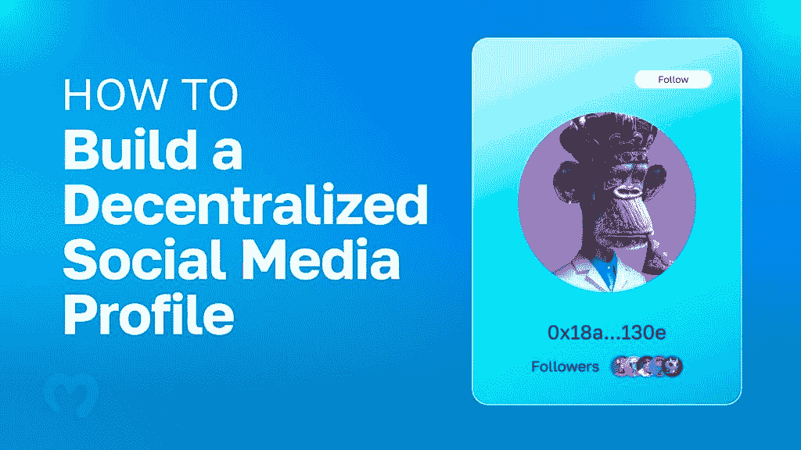

如果你接受今天的挑战，你将学会如何使用 NextJS 创建一个奇妙的社交媒体 [dapp](https://moralis.io/decentralized-applications-explained-what-are-dapps/) 。在这个过程中，您将学习如何使用最终的企业级 Web3 API 提供者——Moralis——来获取链上数据。当然，您还将学习如何使用 Lens Protocol——一个可组合和分散的社交图。本质上，Lens Protocol 是一个以分散方式存储社交媒体数据的后端解决方案。这个优秀的工具使你能够建立一个分散的社交媒体档案，并让用户拥有他们的数据和内容。此外，由于用户可以拥有自己的社交媒体元素，他们可以进一步利用它们。例如，他们可以向追随者收取费用或向他们提供奖励，如独特的 NFT([不可替代代币](https://moralis.io/non-fungible-tokens-explained-what-are-nfts/))。

因此，如果你相信去中心化的未来和拥有自己内容的权利，[创建你的免费道德账户](https://admin.moralis.io/register)并跟随我们。我们将从我们完成的分散式社交媒体简介的快速演示开始。因此，你会从今天的教程中知道期待什么。

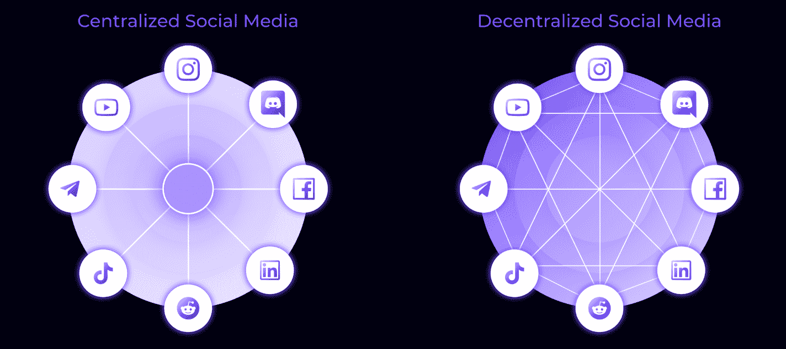

## 我们的分散式社交媒体简介演示

这是我们的示例社交媒体 dapp 的初始屏幕:

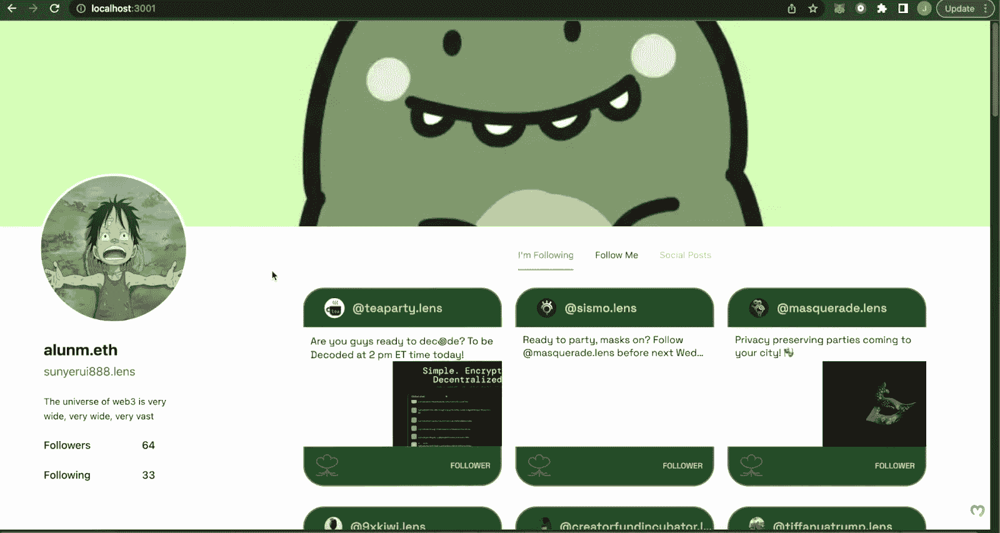

如你所见，我们在某种程度上“模仿”了 Twitter。在每个个人资料页面的顶部，您会看到一个横幅。下面是横幅左下角的个人资料图片。个人资料图片下方是手头个人资料的一些细节。这是我们的 dapp 显示用户名、“镜头”地址、状态和关注者数量的地方。

上面的截图代表了我们在选择“我在关注”页面时的 dapp。此页面显示“alunm.eth”关注的简档的动画 NFT。然而，假设一个示例用户想要遵循“alunm.eth”配置文件。在这种情况下，他们需要转到“关注我”选项卡，然后单击“关注我”按钮。通过关注此个人资料，关注者会收到一个“精美”的 NFT(显示在屏幕的右下角):

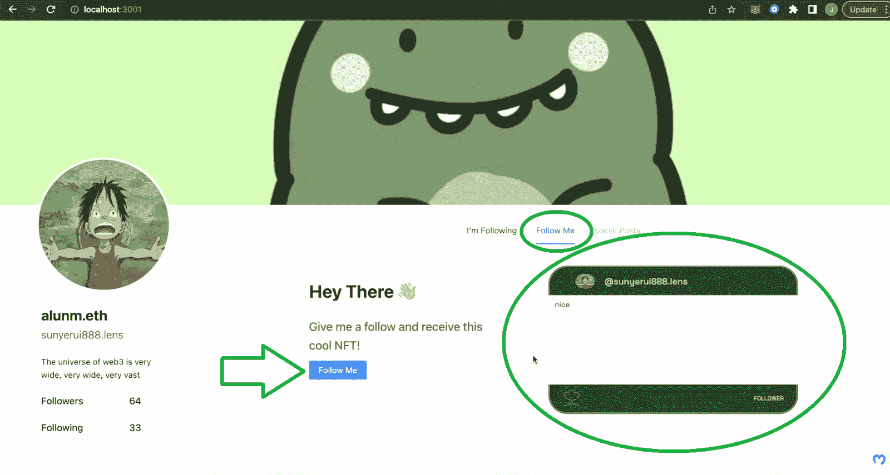

当用户点击“跟我来”按钮时，他们的元掩码扩展就会弹出。此外，它要求他们确认交易并支付相关的燃气费。

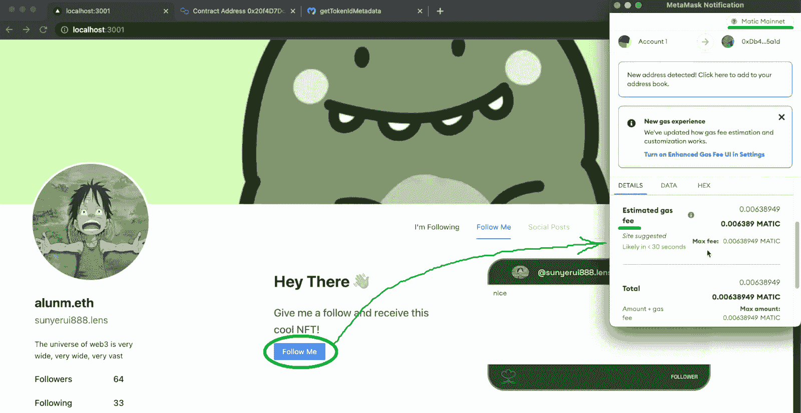

一旦他们确认了交易,“漂亮的”NFT 就已经发到他们的钱包里了。因此，他们可以使用 NFT 平台，如 OpenSea，来查看他们的新“追随者”NFT:

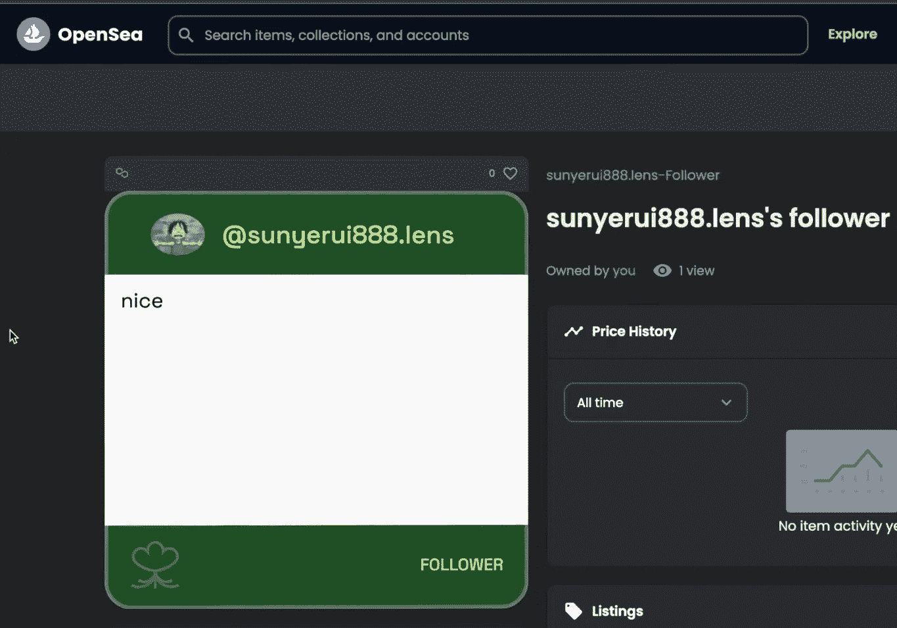

如果你认为我们的例子 dapp 很酷，跳到下一节。在那里，您将开始构建自己的分散式社交媒体档案 dapp 实例。为了使事情尽可能简单，我们将为您提供可以克隆的起始代码。尽管如此，你也可以使用[完成代码](https://github.com/IAmJaysWay/lens/blob/main/web3profile/pages/index.js),并简单地使用我们的教程作为代码演练。

## 使用 Lens Protocol 和 Moralis 建立分散的社交媒体档案

如上所述，我们的说明假设您从克隆" [web3profile-starter](https://github.com/IAmJaysWay/lens-starter/tree/main/web3profile-starter) "代码开始，该代码在 GitHub 上等待您。因此，请务必先访问该库并获取我们的代码:


接下来，在您喜欢的代码编辑器中打开项目。为了更加方便，我们建议您跟随我们的脚步，使用 Visual Studio 代码(VSC)。使用 VSC 的终端，您需要使用“ *npm i* ”命令安装所有依赖项:

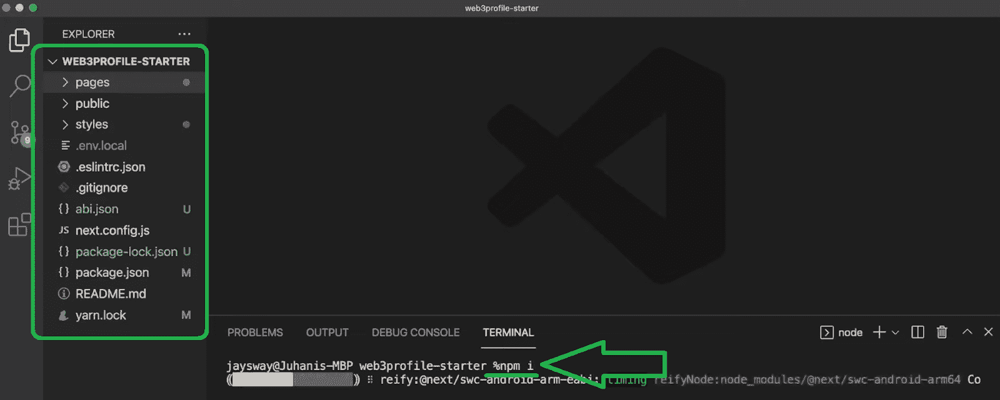

安装完所有依赖项后，您可以使用“ *npm run dev* ”命令来运行本地服务器。然后，您可以使用您的浏览器查看我们的社交媒体 dapp 的初始状态。此外，这是你应该看到的:

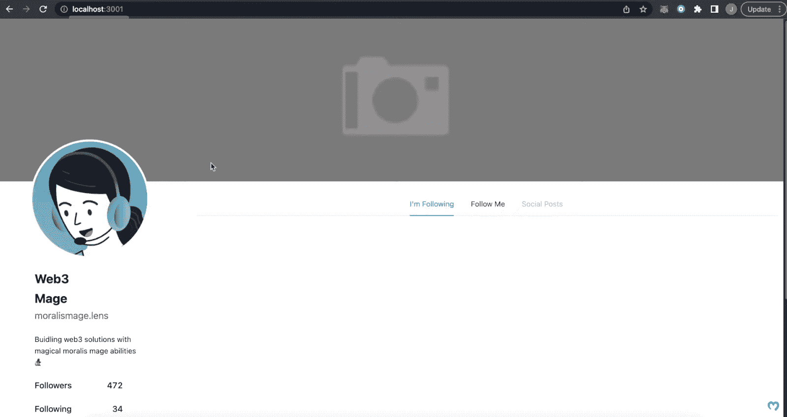

看着上面的截图，你会注意到我们的代码提供了你需要的布局。此外，它还包括横幅模板、默认配置文件图像和默认配置文件详细信息。该布局还包括“我正在关注”、“关注我”和“社交帖子”选项卡。

因此，这是您关注实现 Web3 功能的完美起点。此外，如前所述，我们将使用 Lens 协议来涵盖分散的社交媒体档案功能。此外，Moralis 将帮助我们用单行代码获取所有我们需要的链上数据。


### 如何使用 Lens 协议建立分散的社交媒体档案

我们将使用 Lens API 来构建一个分散的社交媒体档案。此外，根据 Lens 协议文档，我们必须首先确保可以从我们的 dapp 进行查询。因为我们将使用 URQL，所以我们需要专注于安装和使用 GraphQL 客户端:

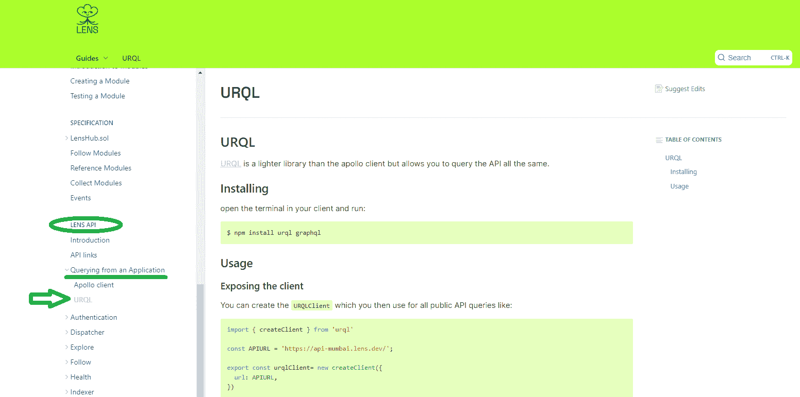

因此，我们需要遵循 Lens 的医生提供的说明，我们会做好准备。我们可以复制“公开客户端”部分的内容。然后我们返回 VSC，在“pages/api”文件夹中创建“lensCalls.js”文件。在该文件中，我们粘贴复制的代码:

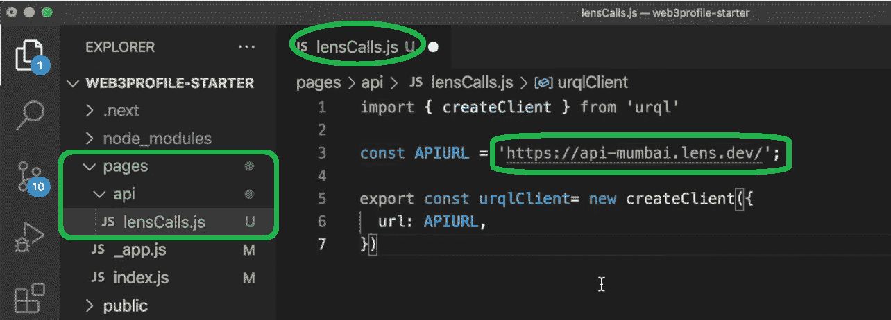

如上图所示，复制的代码集中在多边形 testnet (Mumbai)上。然而，如果你回忆我们的演示，你知道我们的 dapp 运行在多边形 mainnet(Matic mainnet)上。因此，我们需要相应地更改上面标记的“ *HTTPS* ”。因此，我们返回到 Lens 的文档并复制该地址。我们可以在“API 链接”部分找到它:


有了正确的地址后，我们想把重点放在查询档案上。因此，我们使用镜头文档的“获取配置文件”部分。在那里我们可以找到查询概要文件所需的代码。然后，我们简单地复制它:

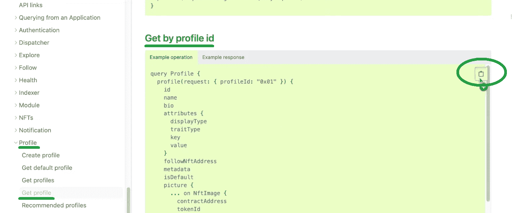

接下来，我们返回到“lensCalls.js”文件。在那里，我们必须首先使用这行代码导出我们的查询:

```js
Export const Profile= ‘

‘
```

然后，我们将复制的“ *Get by profile id* ”代码行粘贴到上面的单引号中。此外，复制的代码集中在“ *0x01* ”配置文件 ID 上。因此，我们需要知道我们想要关注的其他概要文件的 ID。例如，让我们将配置文件 ID 更改为“ *0x09* ”:


### 我们 Dapp 的前端

打开“index.js”文件，它覆盖了我们的 dapp 的前端，就像在初始阶段演示的那样。要获取一个实际的分散式社交媒体档案，我们需要添加适当的代码。因此，向下滚动到“index.js”文件的底部，并使用以下代码行:

```js
export async function getServerSideProps() {
  const response = await client.query(Profile).toPromise();
```

但是，要实现上述查询功能，我们还需要导入“ *urqlClient* ”和“ *Profile* ”。因此，我们将这一行代码添加到“index.js”文件的顶部:

```js
import { client, Profile } from "./api/lensCalls";
```

然后，我们还可以在“ *getServerSideProps* ”函数中添加一个适当的“ *return* ”:

```js
  return {
    props: { profile: response?.data.profile, nftArray: nftArray, myNFT: myNFT },
  };
```

此外，为了获得上面的返回，我们需要将“ *profile* 添加到我们的“ *Home* 组件中，为了方便起见，我们还需要记录它:


上面几行代码为我们提供了特定用户 ID 的所有细节。因此，我们现在可以填充 dapp 前端的必要字段。因此，我们需要通过替换默认值来调整“Home”组件的内容。

首先，我们通过用“*{ profile . cover picture . original . URL }*”替换“ *src* ”旁边的当前地址来替换默认横幅。要了解更多细节，请使用下面的视频，从 8:50 开始。

此外，我们使用“*{ profile . picture . original . URL }*”对个人资料图像进行同样的操作。然后，对用户名、句柄和个人信息进行同样的操作。这里我们用“ *{profile.name}* ”、“ *{profile.handle}* ”、“ *{profile.bio}* ”来代替默认值。最后，我们还必须确保“追随者”和“关注者”的数量得到适当填充。因此，我们将默认值替换为“*{ profile . stats . total followers }*”和“*{ profile . stats . total following }*”。以下是“ *0x09* ”的结果:

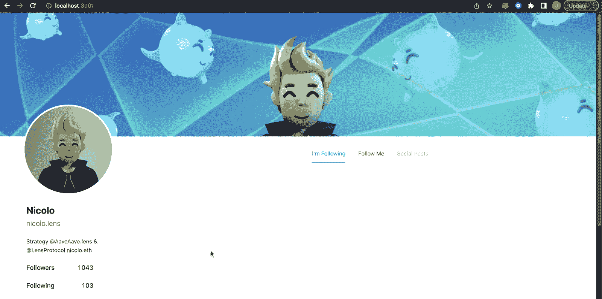

## 将分散的社交媒体档案 Dapp 提升到一个新的水平

查看上面的截图，您可以看到，通过上面实现的调整，我们的 dapp 收集并填充了所有用户的详细信息。但是，您也可以看到“我正在关注”页面仍然是空的。这是因为我们的 dapp 没有获取用户的 NFT。幸运的是，用户对象中获取的详细信息包括用户的钱包地址(9:55):

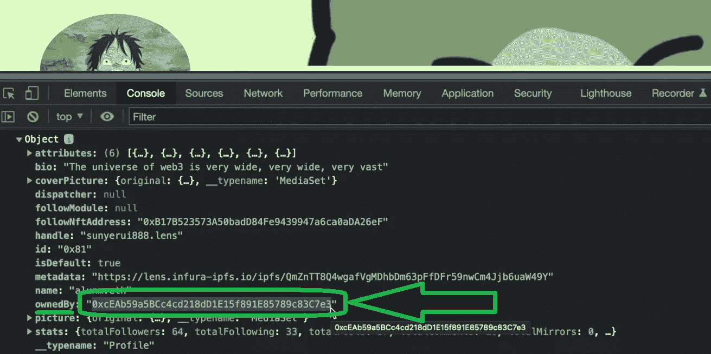

因此，我们可以使用 Moralis 的 Web3 API 来使用该地址并获取它拥有的所有 NFT。为了获得这种能力，你必须完成初始道德设置。

### 获取您的 Moralis Web3 API 密钥

如果你还没有创建你的免费道德账户，现在就创建吧。您可以使用简介中的“创建您的免费 Moralis 帐户”链接或访问 Moralis 主页。一旦您的 Moralis 帐户启动并运行，您就可以访问您的 Moralis 仪表板。这是您将在侧边菜单中看到“Web3 APIs”选项卡的地方:


点击上述菜单选项后，您将进入“Web3 APIs”页面。在那里，您可以使用“复制”图标获取您的 Moralis Web3 API 密钥:


最后，返回 VSC，将上面复制的键粘贴到“. env.local.example”文件中。尽管如此，还要确保将“. env.local.example”重命名为“env.local”:


### 进行道德 API 调用

现在您已经有了您的 Moralis Web3 API，您可以跟随我们开始进行 Moralis API 调用。为此，我们需要返回到“index.js”文件，首先导入 Moralis SDK。因此，我们在文件顶部添加了以下代码行:

```js
import Moralis from "moralis";
```

然后，我们向下滚动到“ *getServerSideProps* ”函数。在该函数中，我们将重点关注在“*return*”(11:04)上方添加 API 调用。然而，我们首先初始化道德:

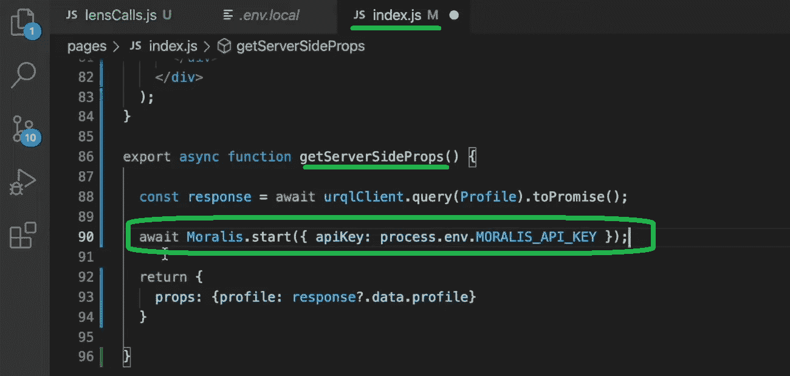

接下来，我们简单地使用 Moralis 文档来看看它为查询帐户的 NFT 提供了什么样的最佳解决方案。我们发现" *getNFTs* "端点将会完成这个任务。这个端点只需要一个地址和一个链。幸运的是，我们有这两个参数——上面的“ *ownedBy* 地址和多边形 mainnet 链 ID(“*0x 89”*)。因此，我们只是从 Moralis 文档中复制代码行，并用适当的值替换这两个参数:


### 仅显示镜头协议 NFTs

接下来，我们希望在“我在关注”页面上仅显示镜头协议 NFTs。因此，我们需要实现能够进行适当过滤的代码行。对于详细的演练，使用下面的视频，从 12:10 开始。最终，这些是我们使用的代码行:

```js
  let nftArray = [];
  let nfts = balances?.data.result;

  for (let i = 0; i < nfts.length; i++) {
    if (nfts[i].metadata !== null) {
      if (
        "animation_url" in JSON.parse(nfts[i].metadata) &&
        JSON.parse(nfts[i].metadata).animation_url !== null &&
        JSON.parse(nfts[i].metadata).animation_url.includes(".lens") 
      ) {
        nftArray.push(JSON.parse(nfts[i].metadata).animation_url);
      }
    }
  }
```

此外，我们还必须在“*家*”成分中添加“ *nftArray* ”。

接下来，我们还希望在“关注我”页面上显示 NFTs 用户通过关注该帐户获得的信息。这里我们将使用"*getTokenMetadata*" Moralis API 端点(14:16):

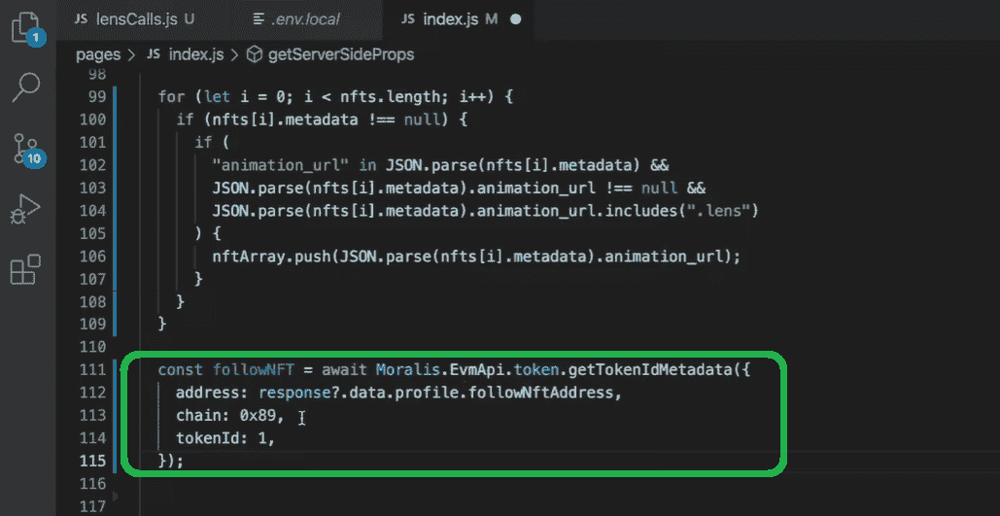

有关如何演示“跟我来”NFTs 的详细信息，请观看下面的视频(15:27)。

最后但同样重要的是，您还需要激活“跟我来”按钮。在这里，我们将把您交给我们内部专家的得力助手。他将在下面的视频(16:17)中指导你完成建立去中心化社交媒体档案 dapp 的最后阶段。

https://www.youtube.com/watch?v=Nn6N7IJKcgE

## 如何建立分散的社交媒体档案——总结

我们在今天的文章中谈了相当多的内容。然而，如果你跟随我们的领导和上面的视频，你有机会在不到 20 分钟的时间里创建你自己的分散式社交媒体档案 dapp。当然，这是可能的，因为你不必从零开始。取而代之的是，你使用了我们的起始代码，并且只是加入了 Web3 的后端功能。由于 Moralis 和 Lens Protocol 的文件，后者很简单。在此过程中，您还获得了 Moralis Web3 API 密匙，它使您能够访问最终的 Web3 API。此外，您使用了“ *getNFTs* ”和“ *getTokenMetadata* ”。

如果你喜欢今天的教程，你应该探索一下 YouTube 频道和 Web3 的[道德博客](https://moralis.io/blog/)。那里的教程从最基础的到更高级的都有。因此，你可以选择适合你目前技能的。然而，感谢 Moralis，你所需要的就是你的 Web2 开发技能。此外，由于 Moralis 完全是关于跨平台的互操作性，您可以利用熟悉的工具加入 Web3 革命。ReactJS、NextJS、Firebase、Supabase、Unity 和其他平台可以成为你开始创建杀手级应用的入场券。还值得指出的是，Moralis 支持所有领先的可编程链。因此，您可以让您的 dapps 适应未来。

最后但并非最不重要的，你可能也想去全职加密尽快。这就是道德学院能够发挥作用的地方。通过成为区块链认证，你将大大增加你的机会，在任何时候登陆一个优秀的加密工作。

