# 如何构建一个 Web3 动作角色扮演游戏

> 原文：<https://moralis.io/how-to-build-a-web3-action-role-playing-game/>

**在构建一款 Web3 角色扮演游戏时，开发者有许多 [Web3 游戏设计](https://moralis.io/web3-game-design-explaining-the-web3-game-design-process/)** **的因素要考虑。** [**NFT 效用**](https://moralis.io/nft-utility-exploring-nft-use-cases-in-2022/) **应该如何实现，游戏是否应该围绕** [**GameFi 和 play-to-earn(P2E)**](https://moralis.io/what-is-gamefi-and-play-to-earn-p2e/)**概念？不管怎样，在为 Web3 制作角色扮演游戏时，抓住用户的注意力是最重要的方面之一。一个人怎样才能用 Web3 的功能构建一个如此吸引人的游戏呢？通过使用 Moralis！在本文中，我们将引导您完成一个由 Moralis 的 Unity 专家开发的示例项目。通过跟随，您将有机会使用我们的代码并开发您自己版本的杀手级 dapp(******)。那么，你准备好探索如何构建一个 Web3 动作角色扮演游戏的过程了吗？我们开始吧！****

**接下来，我们将向您展示如何使用 Unity 技能创建一个 Web3 角色扮演游戏。如果你熟悉 Web2，那么从 [Web2 到 Web3](https://moralis.io/what-is-web2-and-web3-explaining-web3/) 的转换是完全不费力的，这要感谢[Moralis 规范](https://moralis.io/)。这个“ [Firebase for crypto](https://moralis.io/firebase-for-crypto-the-best-blockchain-firebase-alternative/) ”操作系统是最终的 [Web3 后端平台](https://moralis.io/exploring-the-best-web3-backend-platform/)。然而， [Moralis 的 SDK](https://moralis.io/exploring-moralis-sdk-the-ultimate-web3-sdk/) 提供的不仅仅是一个 [Web3 API](https://docs.moralis.io/moralis-dapp/web3-api) 。例如，使用 Moralis 的 [web3uikit](https://moralis.io/web3ui-kit-the-ultimate-web3-user-interface-kit/) ，你可以创建一个伟大的 [Web3 UI](https://moralis.io/web3-ui-how-to-create-a-great-dapp-ui/) 。此外，通过其“同步”功能和数据库，您可以[同步和索引智能合约事件](https://moralis.io/sync-and-index-smart-contract-events-full-guide/) ( [索引区块链](https://moralis.io/how-to-index-the-blockchain-the-ultimate-guide/))。此外，多亏了 Moralis，你只需要一行代码就可以实现各种类型的 [Web3 认证](https://moralis.io/web3-authentication-the-full-guide/)。在这里，您还将学习如何使用 [Hardhat](https://moralis.io/hardhat-explained-what-is-hardhat/) 来编译、部署和验证[智能合约](https://moralis.io/smart-contracts-explained-what-are-smart-contracts/)。因此，如果你渴望构建你自己的 Web3 角色扮演游戏实例，请务必现在就[创建你的免费 Moralis 账户](https://admin.moralis.io/register)！**

**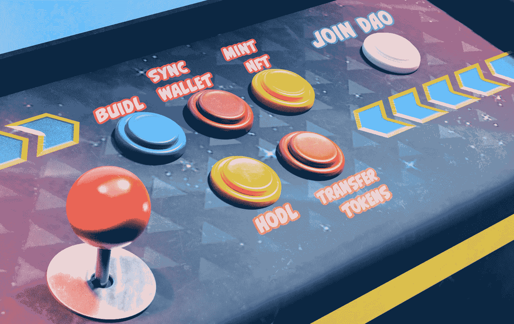

## 我们的 Web3 角色扮演游戏演示

在我们给你机会动手之前，我们想确保你知道我们的角色扮演 Web3 游戏项目会带来什么。因此，让我们先快速演示一下我们的 Web3 角色扮演游戏。这也将帮助您决定是否要创建自己的 dapp 实例。

我们的 Web3 RPG 游戏从“连接”按钮开始:

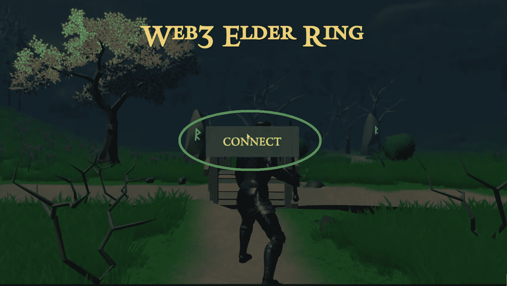

一旦用户点击上面的按钮，就会出现一个二维码。相应地，用户可以使用他们的 [Web3 钱包](https://moralis.io/what-is-a-web3-wallet-web3-wallets-explained/)来完成 [Web3 登录](https://moralis.io/how-to-build-a-web3-login-in-5-steps/)过程:

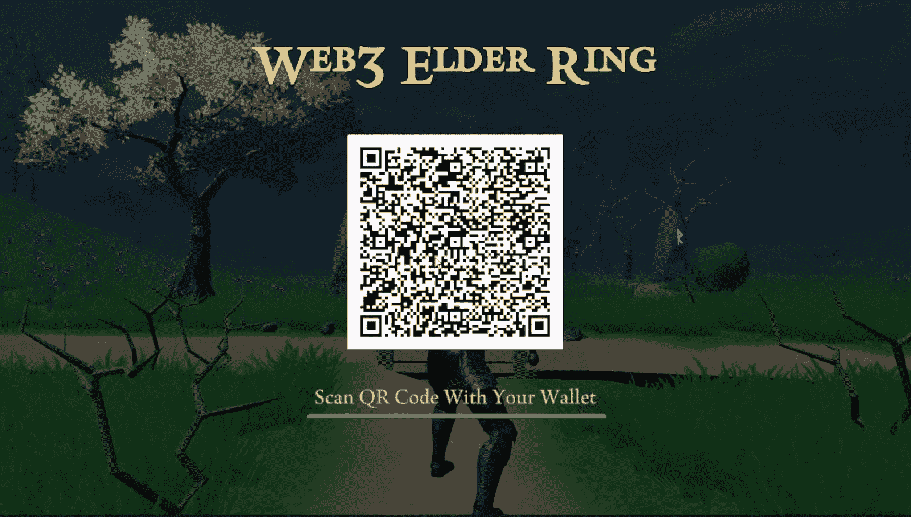

在用户用他们的移动加密钱包(例如 MetaMask)扫描 QR 码之后，游戏指示他们需要签署确认:

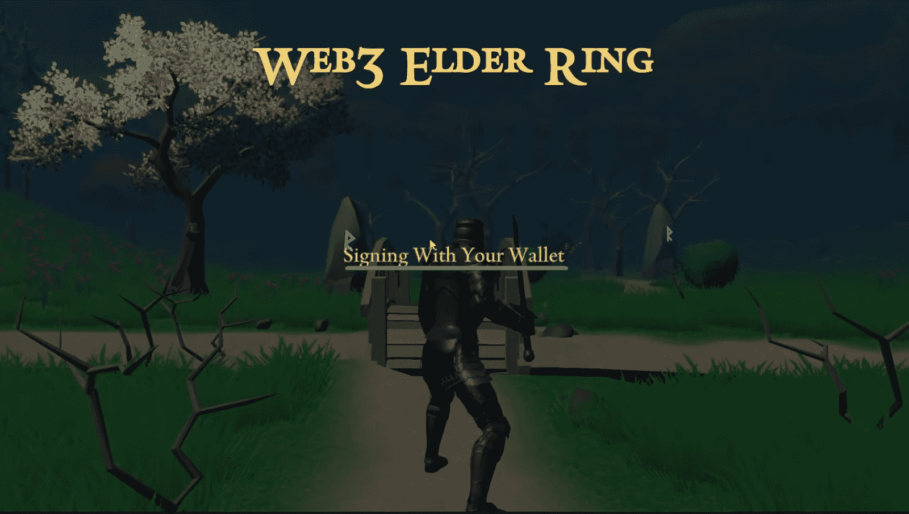

一旦用户[通过 MetaMask](https://moralis.io/how-to-authenticate-with-metamask/) 或另一个 Web3 钱包的认证，他们就可以控制角色。例如，他们可以跑向老板并发起战斗:

当角色进入 boss 的领域时，角色和 boss 的生命值都会出现在屏幕上:

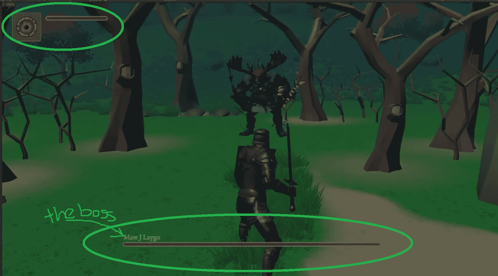

一旦玩家成功杀死老板，玩家可以收集一些物品并获得经验点，这些经验点将会出现:

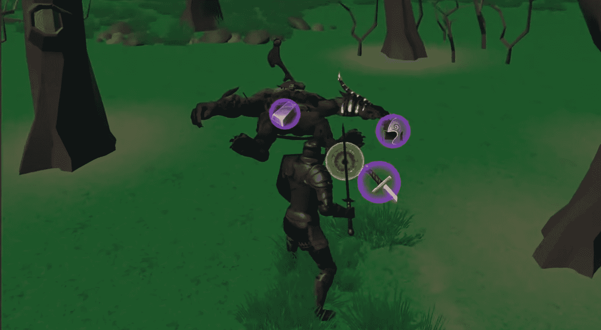

而且物品有紫色光环，经验点有黄色光环。此外，由于这是一个 Web3 游戏，我们已经确保项目和经验点都是链上资产。因此，如果玩家想收集他们，他们必须确认链上交易。如果是这样，他们首先需要按“P”:

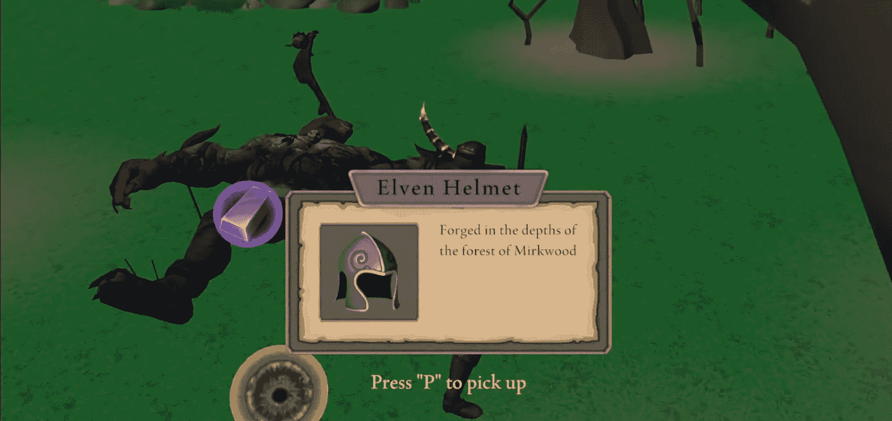

接下来，他们需要使用他们的移动钱包(用于登录的钱包)来确认交易:

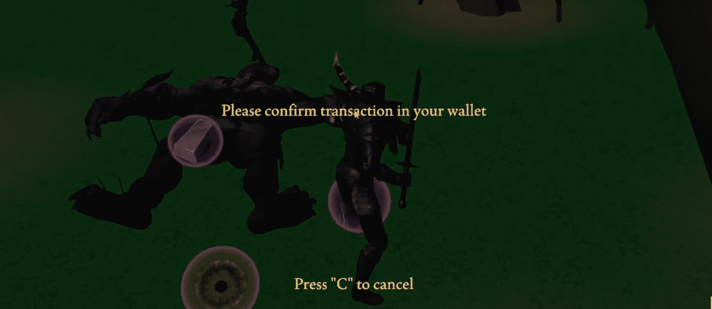

当然，他们可以对所有其他物品和经验值进行同样的操作:

尽管如此，一旦玩家收集了物品和经验值，他们就可以在物品清单中看到它们:

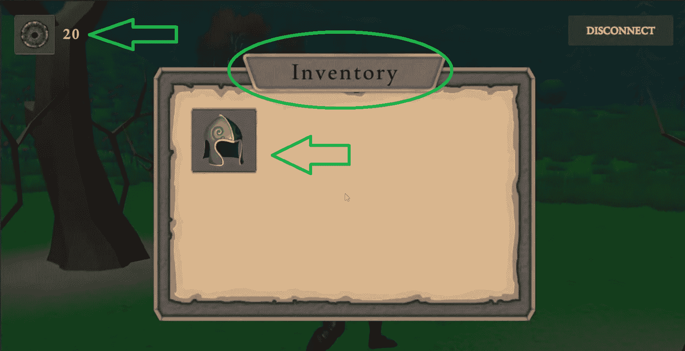

## 用团结、Moralis 和安全帽制作一个 Web3 角色扮演游戏

在向您展示如何创建自己的 Web3 角色扮演游戏实例时，我们将了解以下主要步骤:

1.  免费资产概述–我们的游戏中使用了许多免费资产。因此，我们想告诉你在哪里你可以自己得到它们。
2.  **初始 Moralis 设置**–要获得登录 Web3 的凭证并使用 Moralis 的功能，您需要[创建一个 Moralis dapp](https://docs.moralis.io/moralis-dapp/getting-started/create-a-moralis-dapp) 。然后，您需要将您的服务器 URL 和应用 ID 复制到 Unity 中。
3.  掠夺系统设置–在这里你将学习如何丢弃游戏物品和符文(经验值)。
4.  **智能合同**–您将学习如何使用 Hardhat 部署智能合同。我们将用一个 [ERC-20 契约](https://moralis.io/what-are-erc20-contracts-full-erc20-contract-guide/)来代表经验值，用一个 [ERC-721 契约](https://moralis.io/erc721-contract-exploring-erc721-smart-contracts/)来代表游戏内物品。
5.  **铸造物品和符文**——在这里你将学习如何将 [ERC-20](https://moralis.io/erc20-exploring-the-erc-20-token-standard/) 和 [ERC-721](https://moralis.io/erc-721-token-standard-how-to-transfer-erc721-tokens/) 令牌标准应用到我们的 Web3 角色扮演游戏中。
6.  **检索链上数据**–最后，我们将向您展示如何使用 Moralis 仪表板获取关于已制造令牌的链上信息。

当然，我们的 Web3 角色扮演游戏还有更多的内容；然而，我们在这里将关注 Web3 的功能。此外，我们将快速介绍上面列出的步骤的某些部分，并参考下面附加的视频教程，您可以使用它来深入了解。

### 自由资产概览

我们使用“Mixamo”角色来创建我们的游戏角色:

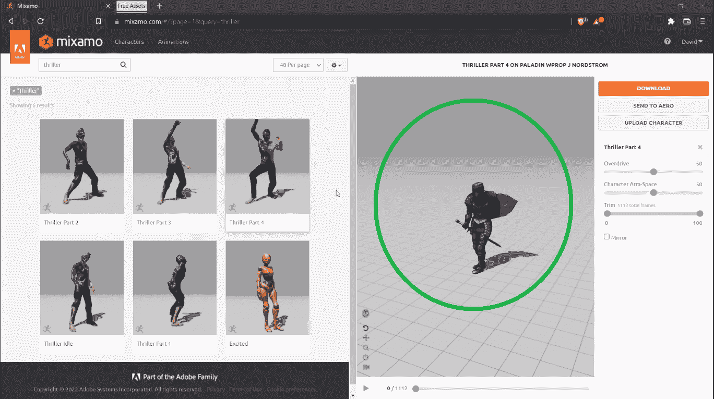

此外，我们还使用了 Unity 资产商店中的几项免费资产:

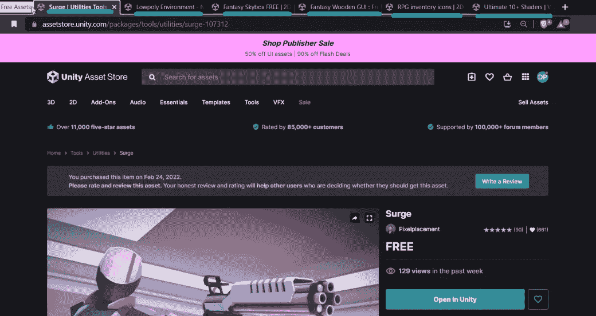

当然，你可以在这个项目的 [GitHub](https://github.com/MoralisWeb3/unity-web3-sample-elden-ring) 页面上找到我们的 Web3 角色扮演游戏中使用的所有资源。

## 初始 Moralis 设置–下载我们的项目并开始

首先，确保下载我们的项目。使用上面的“GitHub”链接并下载 ZIP 文件:

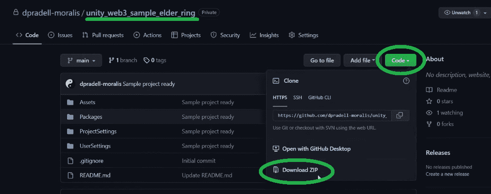

另一方面，你也可以克隆代码。然后，用 Unity 打开项目，它会显示“Moralis Web3 设置”屏幕:

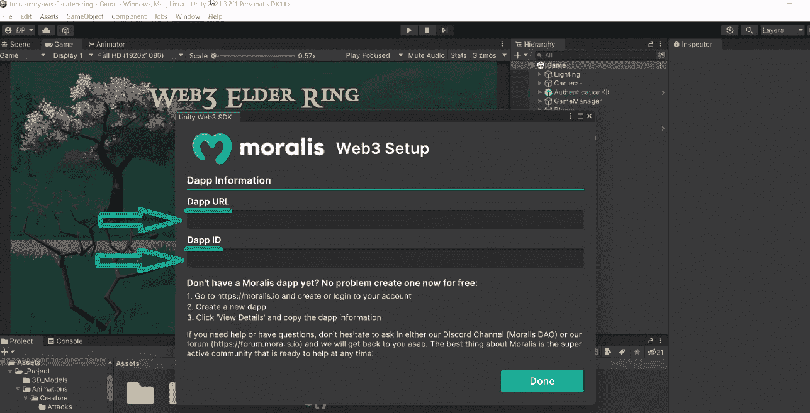

此外，上面的屏幕为您提供了如何获取 dapp 的 URL 和 ID 的说明。您必须[登录](https://admin.moralis.io/login)到您的 Moralis 管理区(如果您还没有登录，请登录)。然后，您需要通过单击“创建新服务器”按钮来创建新服务器:

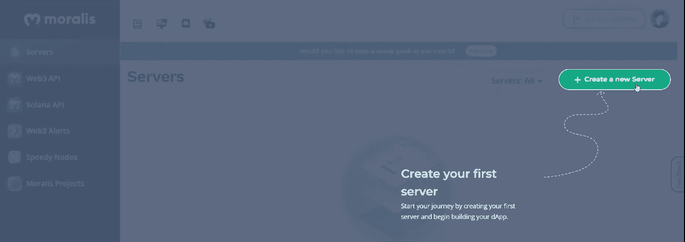

此外，由于这是一个示例项目，请确保使用“Testnet 服务器”选项:

接下来，输入您的服务器名称，可以是您想要的任何名称。然后选择离你最近的城市和你想关注的连锁店。我们建议使用多边形测试网(孟买)。最后，单击“添加实例”按钮启动您的服务器:

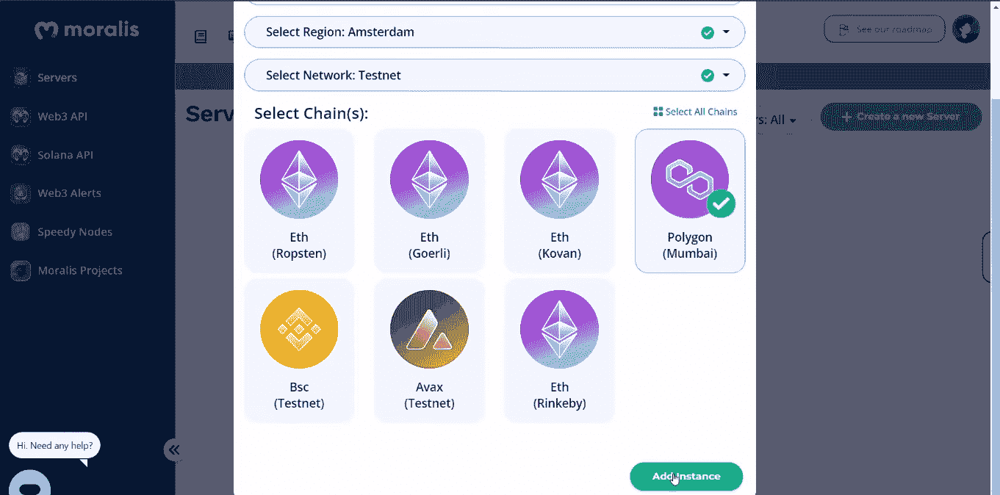

服务器启动并运行后，您将能够访问需要粘贴到 Unity 中的详细信息:

然后将上面复制的详细信息粘贴到 Unity 中，并单击“完成”:

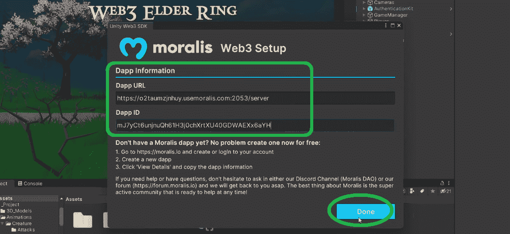

*注意* *:如果您不小心关闭了“Moralis Web3 设置”窗口，您可以通过“窗口> Moralis > Web3 Unity SDK >打开 Web3 设置”进行访问:*

## 抢劫系统设置

首先导航到“游戏”场景:

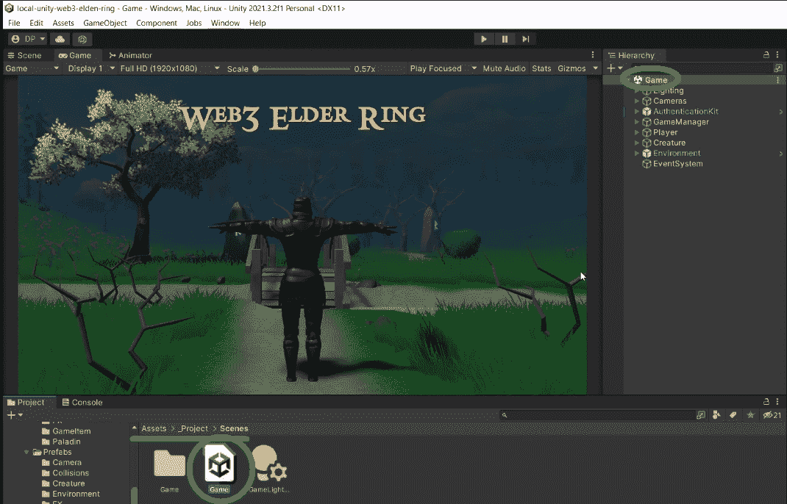

这是我们的 Web3 角色扮演游戏的唯一屏幕，也是所有动作发生的地方。例如，“AuthenticationKit”负责上面演示中介绍的 Web3 身份验证。你可以用下面的视频了解更多细节，从 8:00 开始。在这里，您还将了解如何在 Unity 中运行我们的 dapp 实例。由于您尚未部署我们智能合约的实例，游戏的某些功能将无法运行。但是，您已经可以使用移动加密钱包登录，然后移动角色。

你会在 10:07 的视频中了解到更多关于“GameManager”的内容，它是听“AuthenticationKit”的。您还将了解到我们使用了第三方资产(Surge)来实现状态机。因此，我们可以将我们的“游戏管理器”转换成一个状态机。因此，后者具有我们的 Web3 角色扮演游戏所经历的多个状态:

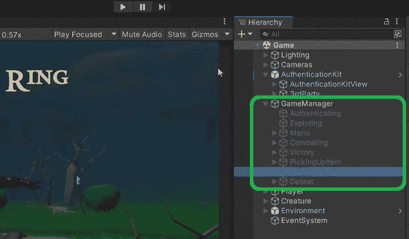

这种方法使事情变得非常简单，因为您可以向任何包含的状态添加代码。使用“ChangeState”函数使状态之间的转换变得非常简单。就 Web3 的功能而言,“胜利”状态开始发挥作用。关于“胜利”脚本的详细代码演练，请使用下面的视频(14:35)。一旦 boss 被打败，这个状态就被激活。在他被打败后，他会掉落物品和经验值，这是我们决定放在链子上的。当然，我们需要一种方法来填充这些物品和符文。幸运的是，我们可以使用 Moralis 仪表板(数据库)来存储这些资产。然后我们使用“PopulateItemFromDB”和“PopulateRunes”函数，它们包含 Moralis 的方法，使查询变得非常容易。

### 你的 Web3 角色扮演游戏数据库

通过创建 Moralis 服务器，您已经准备好了数据库。这是访问它的方法:

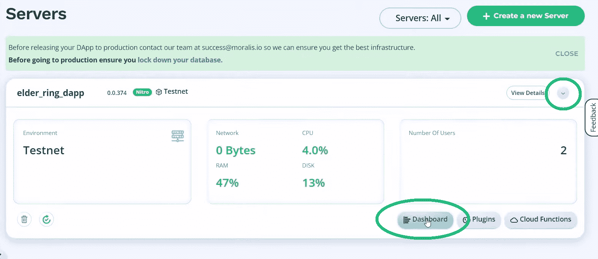

然后，使用下面的视频(16:15)，您需要在您的 Moralis 仪表板中创建一个新类:

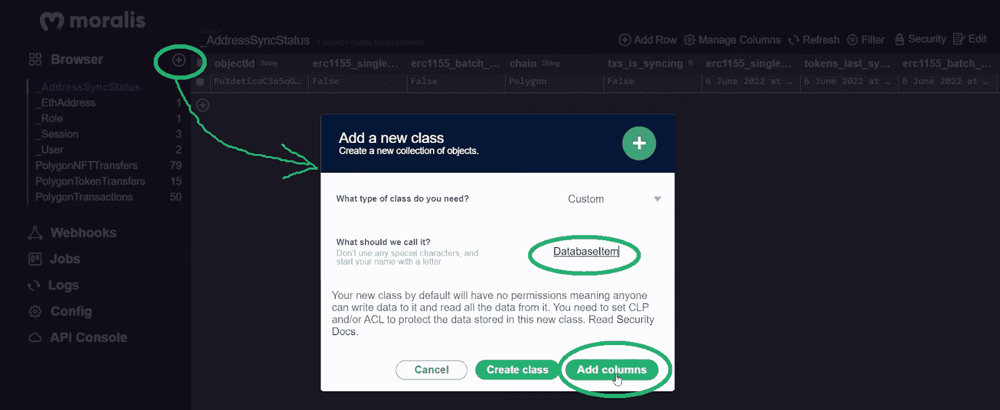

接下来，您需要[将 Unity 资产上传到 IPFS](https://moralis.io/how-to-upload-unity-assets-to-ipfs/) 。不过，你可以使用[快捷方式，我们已经上传到](https://github.com/MoralisWeb3/unity-web3-sample-elden-ring/tree/main/Assets/_Project/IPFS) [IPFS](https://moralis.io/what-is-ipfs-interplanetary-file-system/) 的项目。因此，您可以简单地复制这些 URL 并粘贴到您的新类中(17:45)。通过完成这些步骤，你将拥有“精灵头盔”、“卡林之剑”和“铁锭”。这意味着，如果您再次运行您的 Web3 角色扮演游戏实例并成功击败老板，这些项目将会出现:

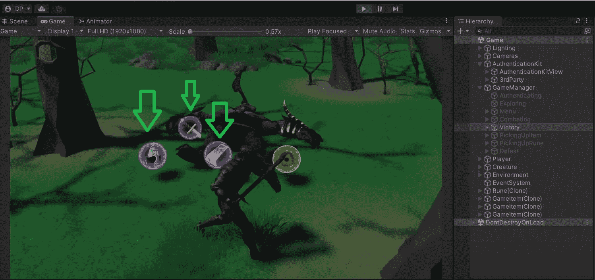

*注:* *我们决定通过将所有与符文相关的数据本地化来为你简化事情。因此，你不需要在游戏的这个方面使用你的数据库。*

## 智能合同获得连锁网络 3 角色扮演游戏项目

为了让“PickingUpItem”和“PickingUpRune”状态发挥作用，您需要部署适当的智能契约。幸运的是，你不需要成为一个[坚实度](https://moralis.io/solidity-explained-what-is-solidity/)专家来做到这一点。像 [OpenZeppelin](https://moralis.io/what-is-openzeppelin-the-ultimate-guide/) 这样的平台为你提供经过验证的智能合同模板。然后你可以使用 [Remix](https://moralis.io/remix-explained-what-is-remix/) 或 Hardhat 来部署这些合同。现在，为了进一步简化，您可以复制我们的智能合同("[smart contracts](https://github.com/MoralisWeb3/unity-web3-sample-elden-ring/tree/main/Assets/_Project/SmartContracts))。此外，如前所述，我们将使用 Hardhat 来做到这一点。*详细说明，用下面的视频，23:11 开始。*此外，您需要的所有命令都在“ [instructions.txt](https://github.com/MoralisWeb3/unity-web3-sample-elden-ring/blob/main/Assets/_Project/SmartContracts/INSTRUCTIONS.txt) ”文件中提供。

一旦成功安装了 Hardhat 和所有依赖项，就可以复制“ [GameItem](https://github.com/MoralisWeb3/unity-web3-sample-elden-ring/blob/main/Assets/_Project/SmartContracts/ERC-721/GameItem.txt) 契约的代码了。然后，您将能够使用“Greeter.sol”模板文件(26:28)。接下来，您将对“sample-script.js”文件进行一些小的调整。在这里，您还将了解如何使用 Hardhat 来验证使用 PolygonScan API 密钥的智能合同:

此外，您还将使用 Moralis Speedy Nodes 来获取孟买端点:

*注意* *:要部署您的智能合约，您需要一些“play”MATIC。幸运的是，你可以使用* [*孟买测试网龙头*](https://moralis.io/mumbai-testnet-faucet-how-to-get-free-testnet-matic-tokens/) *来实现这个目的。*

成功应用所有调整后，您将能够编译、部署和验证“GameItem”契约的实例。因此，你可以在 PolygonScan 上看到它的细节。然后，你需要将你的合同地址和 ABI 复制到 Unity 的“GameManager”脚本中(36:56):

接下来，您将为第二个智能契约(" [Rune](https://github.com/MoralisWeb3/unity-web3-sample-elden-ring/blob/main/Assets/_Project/SmartContracts/ERC-20/Rune.txt) ")重复上述过程，该契约涵盖了与经验点数相关的交易。

### 铸造物品和符文作为 ERC 令牌

在成功部署您的两个 [Web3 合同](https://moralis.io/what-are-web3-contracts-exploring-smart-contracts/)之后，您的 Web3 角色扮演游戏实例就完全正常了。现在，仔细看看“PickingUpItem”和“PickingUpRune”脚本如何执行创建过程是有益的。因此，请务必观看下面的视频，从 42:00 开始，观看详细的代码演练。本质上，“Moralis。ExecuteContractFunction”在两个脚本中都完成了大部分繁重的工作。

### 检索链上数据

如果你还记得上面的演示，你就知道一旦玩家收集了物品和经验值，他们的物品清单就会显示这些元素。因此，如果你有兴趣了解我们的示例 Web3 角色扮演游戏如何涵盖这一方面，请跳到 45:51。在那里，您将看到“Menu”脚本如何处理令牌余额。再次感谢 Moralis，短短几行代码就完成了任务。

最后，这是我们在整篇文章中引用的视频:

https://www.youtube.com/watch?v=Yrx-tu704Ys

## 如何构建 Web3 动作角色扮演游戏——总结

如果你完成了我们的旅程，你知道如何建立一个 Web3 角色扮演游戏。我们从快速演示我们的游戏示例开始。然后，我们把重点放在了与 Web3 相关的方面。因此，你有机会跟随我们的领导，创建自己的优秀 Web3 动作角色扮演游戏实例。在这个过程中，您学习了如何通过创建您的 Moralis 服务器和使用它的凭证来连接 Unity 和 Moralis SDK。您还学习了如何利用 Moralis 仪表板。此外，您还学习了如何使用 Hardhat 来处理智能合约。希望您成功部署了我们的智能合同实例。如果是这样，你得到了你的合同地址和 ABI，你把它们粘贴在“游戏经理”脚本中。后者给了你的新游戏完整的功能。此外，您还有机会了解更多关于幕后运行的代码。

如果你喜欢这个教程，我们鼓励你去探索一下[Moralis YouTube 频道](https://www.youtube.com/c/MoralisWeb3)和[Moralis 博客](https://moralis.io/blog/)。在那里，你会找到大量的其他教程。如果团结是你的主要焦点，你可以学习[建立一个游戏内团结 NFT 商店](https://moralis.io/moralis-projects-build-an-in-game-unity-nft-shop/)，做[区块链游戏交易](https://moralis.io/how-to-do-blockchain-game-transactions-with-unity/)，或者建立一个 [Web3 MMORPG](https://moralis.io/build-a-web3-mmorpg-with-unity-in-10-minutes/) 。然而，还有许多其他的话题你可以深入研究。例如，我们的一些最新文章涵盖了[以太坊 NFT API](https://moralis.io/what-is-an-ethereum-nft-api-ethereum-nft-apis-explained/)、[多边形 NFT API](https://moralis.io/what-is-a-polygon-nft-api-polygon-nft-apis-explained/)、币安 NFT API[和索拉纳 NFT API](https://moralis.io/binance-nft-api-what-is-it-and-how-does-it-work/) 。此外，我们还向您展示如何[创造数以千计的 NFT 游戏资产](https://moralis.io/how-to-mint-thousands-of-nft-game-assets/)、[获得索拉纳 NFT 元数据](https://moralis.io/how-to-get-solana-nft-metadata/)，如何[上传 Web3 Unity 元数据](https://moralis.io/uploading-web3-unity-metadata/)，以及您需要了解的关于 [Web3 前端](https://moralis.io/web3-frontend-everything-you-need-to-learn-about-building-dapp-frontends/)和 [blockend 开发](https://moralis.io/blockend-development-what-is-it-and-how-to-become-a-blockend-developer/)的一切。然而，如果你渴望[快速而自信地成为一名区块链开发者](https://moralis.io/how-to-become-a-blockchain-developer/)，你可能想要报名参加[Moralis 学院](https://academy.moralis.io/)。**