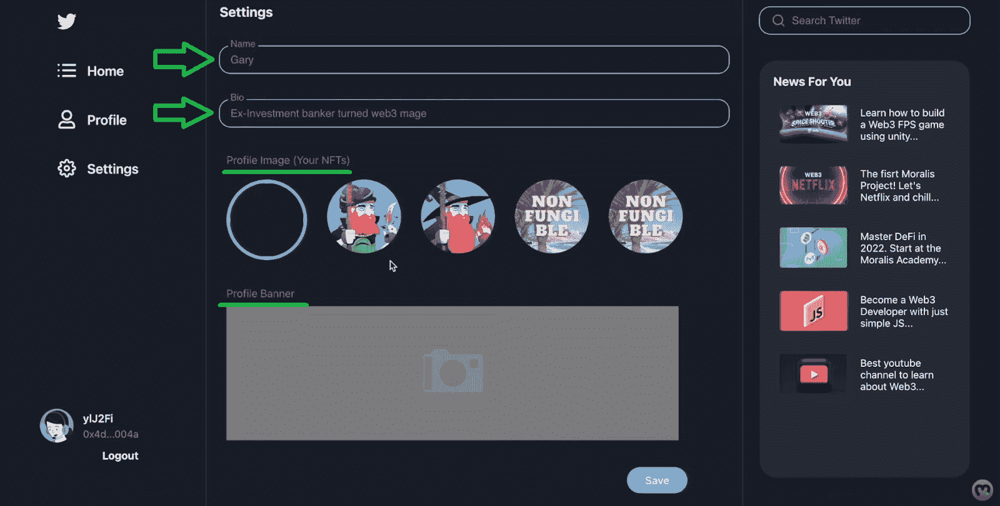
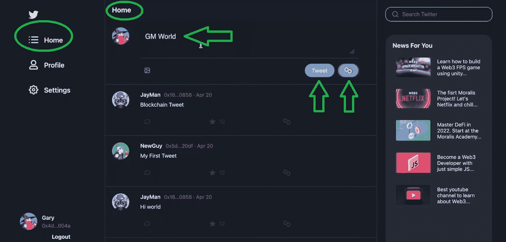
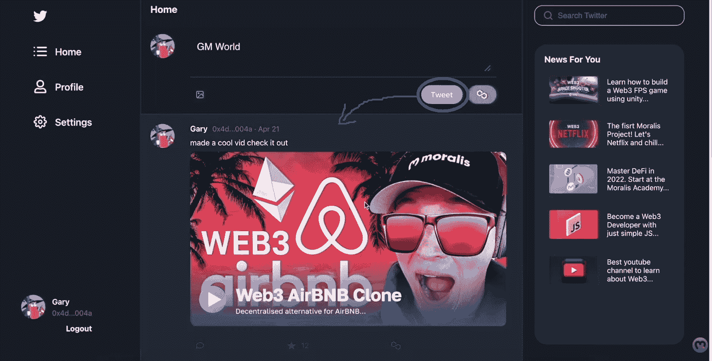
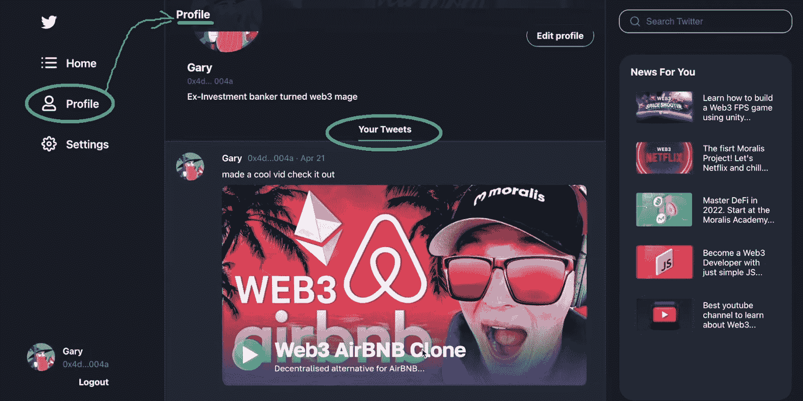
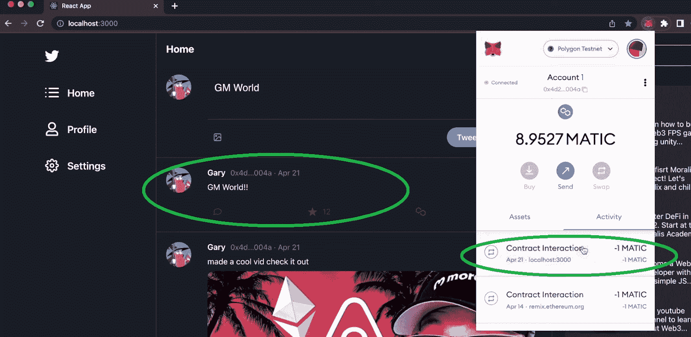
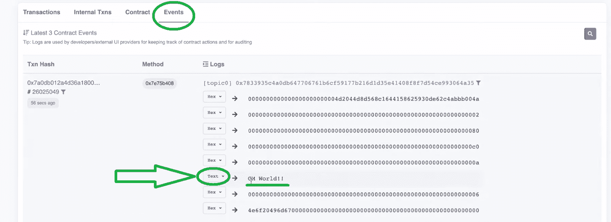
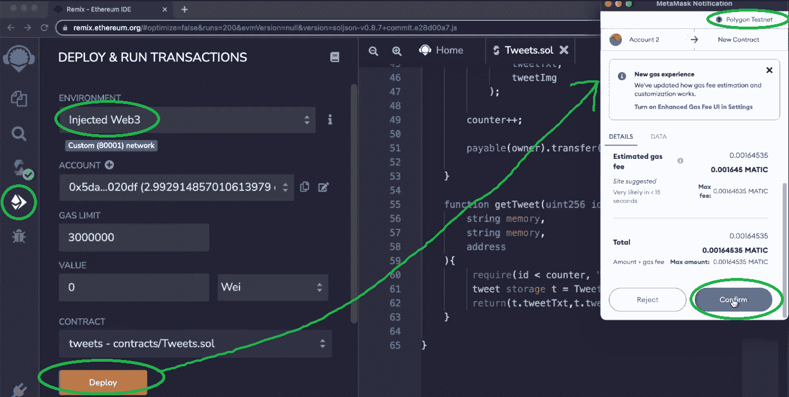
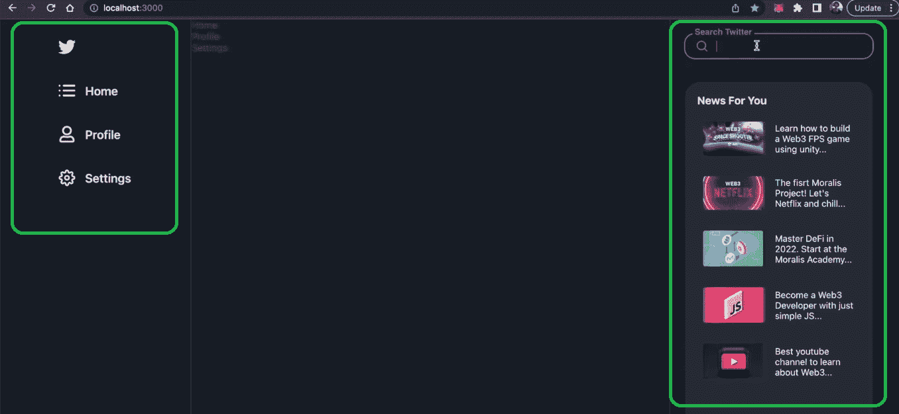
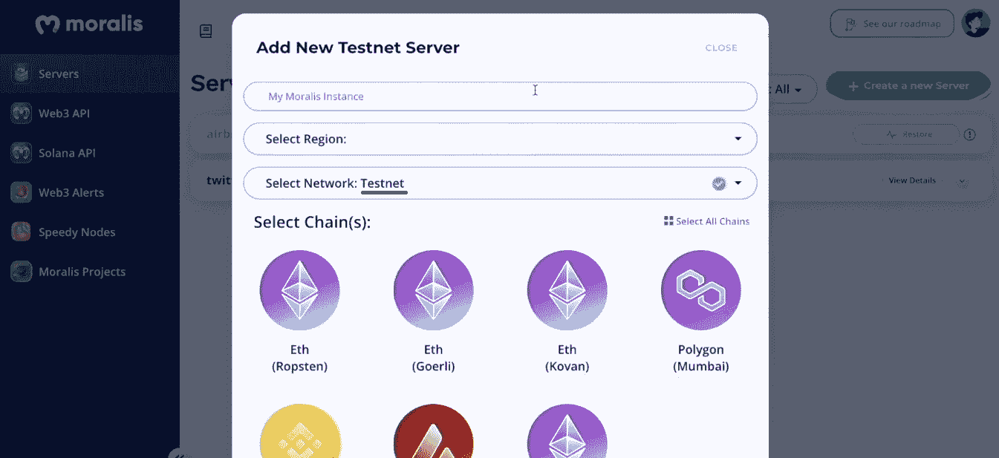

# 如何构建一个 Web3 Twitter 克隆

> 原文：<https://moralis.io/how-to-build-a-web3-twitter-clone/>

对于加密领域的用户来说，Twitter 一直是最受欢迎的社交媒体平台之一。然而，加密用户意识到，Twitter 的分散版本将非常有益，因为它将消除 Twitter 的集中平台的负面影响。因此，我们决定建立一个 Web3 Twitter 的克隆。通过创建和推出一个具有 Web3 功能的 Twitter 克隆，这样一个平台可以容纳区块链理工大学提供的许多优点，并可以为用户提供真正的去中心化。虽然这个任务听起来很麻烦，但是当使用正确的工具时，您会惊奇地发现这个过程是多么简单。此外，使用合适的工具，你可以在不到一小时三十分钟的时间内准备好一个 Web3 Twitter 替代品。因此，请密切关注我们在本文中探索如何使用诸如 [**道德**](http://moralis.io/) **和** [**混音**](https://moralis.io/remix-explained-what-is-remix/) **等工具来构建 Web3 Twitter 克隆！**

接下来，我们将首先仔细看看我们的示例 Web3 Twitter 克隆的演示。这样，你就会知道接下来会发生什么。因此，这也将帮助你决定是否要卷起袖子跟随我们的领导。此外，那些决定建立自己的 Web3 Twitter 替代品的人将会使用他们的[反应](https://moralis.io/react-explained-what-is-react/)技能。此外，我们将从创建和部署一个[智能契约](https://moralis.io/smart-contracts-explained-what-are-smart-contracts/)开始。这就是我们将使用[实度](https://moralis.io/solidity-explained-what-is-solidity/)和混音的地方。然后，我们将关注使用 React 和 [JavaScript](https://moralis.io/javascript-explained-what-is-javascript/) 设置前端。我们将创建侧栏，主页，个人资料和设置页面。接下来，随着我们集成道德 SDK，事情会变得有趣起来。因此，我们将开始轻松整合 [Web3](https://moralis.io/the-ultimate-guide-to-web3-what-is-web3/) 功能。因此，在继续之前，请务必[创建您的免费道德账户](https://admin.moralis.io/register)。

## 我们的 Web3 Twitter 克隆–演示

这是用户在开始使用我们的 Twitter 克隆时看到的:

与所有 dapps(去中心化应用)一样，用户必须首先使用 [Web3 钱包](https://moralis.io/what-is-a-web3-wallet-web3-wallets-explained/)完成 [Web3 认证](https://moralis.io/web3-authentication-the-full-guide/)。因此，通过点击上面的“连接钱包”按钮，用户可以选择他们喜欢的 [Web3 登录](https://moralis.io/how-to-build-a-web3-login-in-5-steps/)工具:

出于演示的目的，让我们假设一个示例用户选择使用元掩码进行认证[。因此，点击](https://moralis.io/how-to-authenticate-with-metamask/)[元掩码](https://moralis.io/metamask-explained-what-is-metamask/)图标后，这个加密钱包的扩展会弹出并请求签名。一旦用户点击“签名”按钮，他们就会登陆我们的 Web3 Twitter 主页:

因为示例用户是第一次登录，所以他们有一个默认的用户图标。然而，他们已经可以在主页 feed 上看到一些推文。因此，他们可以转到“个人资料”选项卡，然后按“编辑个人资料”按钮来个性化他们的帐户:

正如你在下面的截图中看到的，用户可以输入他们的姓名和简历。他们也有机会使用他们的任何 NFT([不可替换令牌](https://moralis.io/non-fungible-tokens-explained-what-are-nfts/))作为他们的个人资料图像。*当然，这只适用于存储在联网钱包中的非功能性钱包。*最后，用户还可以上传图片，通过点击“个人资料横幅”下方的灰色区域来个性化他们的横幅:

完成设置步骤并点击上面的“保存”按钮后，用户已成功个性化其帐户:

### 在我们的 Web3 Twitter 克隆版中发布推文

当用户想发微博时，他们需要使用“主页”标签:

接下来，他们需要输入一些文本(显示“GM World”)。使用“图片”图标，用户还可以在他们的推文中添加图片。最后，他们有两个选择——他们可以做一条普通的推文，或者将推文保存在区块链上。在我们的例子中，我们使用的是 Polygon 的 Mumbai testnet，我们可以通过查看 Polygon 图标看到这一点。我们先来看看常规推文。点击“tweet”按钮后，新的 tweet 几乎立即出现在 Tweet 线程中:

一旦用户发布了推文，他们就可以在个人资料选项卡的“您的推文”部分看到他们的推文:

另一方面，如果用户想在区块链上发布推文，他们需要使用“多边形”按钮:

这样，他们的 Web3 钱包会提示他们确认交易。因此，用户需要通过支付汽油费和一笔费用来确认将推文保存在区块链上(one MATIC):

一旦确认的交易得到处理，它们的链上 tweet 就会出现在 tweet 线程中:

为了向您展示上面的推文保存在孟买区块链上，让我们使用 PolygonScan (testnet)。在这里，我们可以看到上面智能合同地址的一个自动交易:

此外，如果我们现在使用“Events”选项卡，将示例事务的“Hex”转换为“Text ”,我们甚至可以看到示例 tweets 内容:

我们的 Web3 Twitter 克隆演示到此结束。希望你能看到 dapp 这个例子有多不可思议。因此，当我们继续建造它的时候，你准备好弄脏你的手并且加入我们。我们开始吧！

## 用 React、Moralis 和 Remix 构建一个 Web3 Twitter 克隆

正如在简介中提到的，我们的示例 Web3 应用程序有几个方面。我们将使用 React 作为我们构建的前端。然后，是我们的“推特”智能合约，我们将使用 Remix 和 Solidity。最后是后端，我们将使用终极的 [Web3 后端平台](https://moralis.io/exploring-the-best-web3-backend-platform/)——Moralis。这个“ [Firebase for crypto](https://moralis.io/firebase-for-crypto-the-best-blockchain-firebase-alternative/) ”操作系统将使我们能够[索引区块链](https://moralis.io/how-to-index-the-blockchain-the-ultimate-guide/)和[同步以及索引智能合约事件](https://moralis.io/sync-and-index-smart-contract-events-full-guide/)。我们将使用 Moralis dashboard(数据库)来完成这项工作，当您创建 Moralis 服务器时，就可以使用它了。幸运的是，你可以用你的免费道德账户做到这一点。因此，如果您还没有创建，请使用本文前面提到的链接！

***注:*** *继续向前，我们将开始查阅一个视频教程，你可以在本文底部找到。在该视频中，Moralis 专家将详细指导您完成所有步骤，所以请在观看时密切关注。此外，为了使过程尽可能简单和顺利，请确保克隆我们的代码。你有两个选择:你可以用我们的首发或者我们的* [*终码*](https://github.com/MoralisWeb3/youtube-tutorials/tree/main/Twitter-Start) *。如果你很着急，用后者。但是，如果您想充分利用这个示例项目，我们鼓励您克隆* [*起始代码*](https://github.com/MoralisWeb3/youtube-tutorials/tree/main/Twitter-Starter) *。*

## Web3 Twitter 智能合约

如果你看了上面的演示，你会知道有一个智能合同，允许 Twitter 克隆的用户在链上发布推文。我们将通过创建智能合同来开始我们的示例项目(下面 4:42 的视频)。因此，确保打开 Remix 并创建一个名为" [tweets.sol](https://github.com/MoralisWeb3/youtube-tutorials/blob/main/Twitter-Start/src/tweets.sol) "的新文件:

您将从添加“pragma”行开始，然后是我们的示例智能契约的细节。你可以使用下面的视频教程手动输入代码，或者使用上面的“tweets.sol”链接，将代码复制粘贴到 Remix 中。一旦智能合约准备就绪，您需要编译它。幸运的是，Remix 使这变得非常简单(15:51):

成功编译智能合同后，您需要部署它:

在点击“部署”按钮之前，选择“注入的 Web3”环境。此外，确保您的元掩码扩展连接到 Mumbai testnet。一旦您的智能合同被部署，您将能够复制它的地址，您可以在 PolygonScan 上使用它:

## Twitter 克隆前端

既然你的“Twitter 克隆”智能合约已经准备好了，是时候为我们的 Web3 Twitter 构建一个合适的 UI 了。如上所述，我们将使用 React 创建我们的前端。但是，我们也将使用 [web3uikit](https://moralis.io/web3ui-kit-the-ultimate-web3-user-interface-kit/) 作为额外的快捷方式。如需详细的分步指南，请从 20:15 开始观看下面的视频。首先，您将涵盖初始设置，从克隆代码和安装所有依赖项开始:

***注:*** *通过上面的截图可以看出，我们使用的是 Visual Studio Code (VSC)，我们首选的代码编辑器。请随意使用相同的代码编辑器或您喜欢的替代方法。*

完成初始前端设置后，您将开始构建您的 Web3 Twitter 克隆的侧栏(22:41)。在这里，使用“侧边栏”组件将使事情变得简单得多。因此，你将在不到十分钟的时间内准备好如上所述的边栏:

接下来，你将着手创建主页(31:44)。为此，您将使用“Home.js”文件，在该文件中，您将确保所有的逻辑都设置正确。这也是你将直接看到 web3uikit 项目的威力的地方。因此，你可以快速地添加文本区域、图标和按钮，而不用担心流汗。此外，您将学习如何使上传图像功能非常整洁。设置好“tweeting”区域后，您将专注于使用“TweetInFeed.js”文件创建您的 tweet feed。然后，为了完成你的 Web3 Twitter 的前端，你还将添加“个人资料”页面(46:41)和“设置”页面(49:53)。

## Web3 Twitter 后端

现在你的前端已经准备好了，是时候给你的 Web3 Twitter 添加 Web3 功能了(57:29)。正如你已经知道的，你可以毫不费力地用 Moralis 做到这一点。所以，你需要[登录](https://admin.moralis.io/login)你的免费道德账户。在你的道德管理区，你需要[创建一个道德服务器](https://docs.moralis.io/moralis-dapp/getting-started/create-a-moralis-dapp#2.-create-a-moralis-server) (57:46):

一旦您的服务器启动并运行，您将能够获得它的详细信息(服务器 URL 和应用程序 ID):

您需要将上述详细信息粘贴到“index.js”文件中，以获得 Moralis 的功能:

有了初始的 Moralis 设置，您将把 Web3 身份验证添加到您的 Web3 Twitter 克隆中。您将使用“App.js”文件来完成此操作。此外，web3uikit 将再次使事情变得更加简单。因此，你将在几秒钟内准备好一个有吸引力的“连接钱包”按钮。尽管如此，当使用“isAuthenticated”时，您将开始看到 Moralis SDK 的威力。

### 处理链上和链下数据——Moralis Dashboard

接下来，您将熟悉 Moralis 仪表盘(1:00:59)。后者将使您能够[存储链外数据](https://moralis.io/how-to-store-off-chain-data-unity-web3-database/)以及链上数据:

你将首先关注“Settings.js”以及如何[上传到 IPFS](https://moralis.io/full-guide-how-to-upload-to-ipfs/) 。反过来，你有办法以分散的方式保存用户想要发推的图片文件。这就是当您着手创建“saveEdits”异步函数时,“useMoralis”方法将帮助您的地方。后者将由设置页面上的“保存”按钮触发。此外，您还将使用“useMoralisWeb3Api”方法来利用“useEffect”，该方法将通过“getNFTs”获取用户的 NFTs。因此，他们将能够使用这些 NFT 作为他们的个人资料图片。最后但同样重要的是，您将学习如何设置在区块链上保存推文的选项。从 1:12:40 开始，您将学习如何通过 Moralis dashboard 的“Tweets”类实现这个不可变的 Web3 特性。

https://www.youtube.com/watch?v=HrlpTJD_CF0

## 如何构建 Web3 Twitter 克隆版——总结

如果你卷起袖子采取行动，你现在就有了自己的 Web3 Twitter 克隆版，并在孟买测试网上运行。在这个过程中，您更新了 React 技能，并学习了如何使用 Solidity 和 Remix 创建一个简单的智能合同。你遇到了 Web3 开发的终极捷径——Moralis。因此，您能够创建您的 Moralis 服务器，这使您能够访问 Moralis SDK，包括它的数据库。最后，您使用这个数据库来索引区块链。

如果您喜欢这个示例项目，我们建议查看我们的其他“克隆”指南。其中包括构建一个 [Uniswap DEX 克隆](https://moralis.io/build-a-uniswap-dex-clone-with-html-css-javascript-moralis-on-the-ethereum-network/)、 [Web3 Airbnb 克隆](https://moralis.io/moralis-projects-learn-to-build-a-web3-airbnb-clone/)、 [Web3 网飞克隆](https://moralis.io/how-to-develop-a-web3-netflix-clone/)、 [Web3 Spotify 克隆](https://moralis.io/how-to-build-a-web3-spotify-clone/)、[比特币基地克隆](https://moralis.io/cloning-coinbase-wallet-how-to-create-a-coinbase-clone/)、 [OpenSea 克隆](https://moralis.io/create-an-opensea-clone-build-an-nft-marketplace-like-opensea/)，以及一个用于 Web3 的 [Reddit 克隆。此外，这些教程可以在](https://moralis.io/create-a-reddit-clone-for-web3-step-by-step-guide/) [Moralis YouTube 频道](https://www.youtube.com/c/MoralisWeb3)和 [Moralis 博客](https://moralis.io/blog/)上免费获得。除了这些稍微高级一些的教程，这两个网站还提供了无数其他更简单的示例项目和主题。例如，一些最新的文章集中在 [SPL vs ERC20 代币](https://moralis.io/spl-vs-erc20-tokens-comparing-solana-and-ethereum-tokens/)，一个[索拉纳代币仪表板](https://moralis.io/how-to-build-a-solana-token-dashboard/)，如何[创建你自己的元宇宙](https://moralis.io/how-to-create-your-own-metaverse/)，如何[创建一个 BNB NFT](https://moralis.io/how-to-create-a-bnb-nft/) ，[动态 NFT](https://moralis.io/what-are-dynamic-nfts-the-ultimate-2022-guide/)，[分数 NFT](https://moralis.io/what-are-fractional-nfts-the-ultimate-2022-f-nft-guide/)，[基于 NFT 的会员资格](https://moralis.io/what-are-nft-based-memberships-full-guide/)，如何建立一个[玩赚(P2E)游戏智能合约](https://moralis.io/how-to-build-a-play-to-earn-p2e-game-smart-contract/)

如果你想快速自信地成为一名 Web3 开发者，就去看看 T2 的道德学院吧。道德学院是排名第一的区块链在线教育套件，提供顶级的[区块链发展课程](https://academy.moralis.io/all-courses)。此外，你可以获得个性化的学习路径和专家指导，并成为一个了不起的社区的一部分。最终，你可以在创纪录的时间内成为区块链认证！

