# 如何在 Angular 中构建以太坊 dApps

> 原文：<https://moralis.io/how-to-build-ethereum-dapps-in-angular/>

随着区块链技术被大量采用，在 Angular 等框架中构建以太坊 dApps 变得越来越流行。对一些人来说，从 Web2 过渡到 Web3 可能看起来令人生畏。然而，通过利用 Moralis 及其 SDK，区块链开发成为一个简单的过程。因此，您可以实现 Angular 的框架，并在创建分散式应用程序时使用 Moralis。因此，如果你想用一个优秀的框架开发一个以太坊 dApp，你会喜欢这个简短的教程，因为你会发现如何用 Angular 构建以太坊 dApp。

在我们开始展示如何在 Moralis 上使用 Angular 框架之前，你应该从注册 Moralis 开始。创建一个 Moralis 帐户是免费的，它提供了从 Moralis 文档中复制和粘贴的 JavaScript 代码片段，帮助您根据自己的喜好为 dApp 创建后端基础设施。因此，使用 Moralis 可以节省数月的 dApp 编码和技术准备时间。

## **什么是棱角分明？**

[Angular](https://moralis.io/angular-explained-what-is-angular/) 是一个可扩展的开源 web 应用框架。它为以太坊 dApp 开发提供了许多优势。此外，Angular 提供了一个涵盖众多特性的库。因此，dapp 的编码过程变得明显更快和简单，并且它使您能够为您的 dapp 创建高质量的前端 ui。

要更深入地解释什么是角形，一定要看看我们之前的文章“[角形解释-什么是角形？](https://moralis.io/angular-explained-what-is-angular/)”。

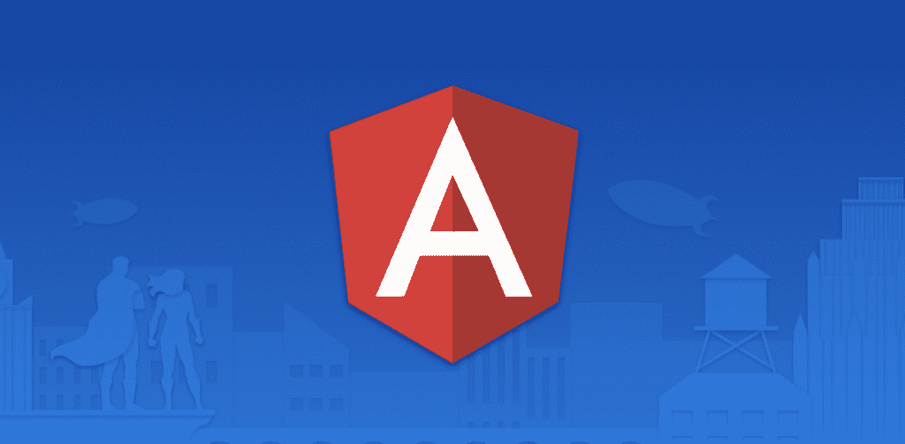

## **什么是以太坊角 dApps？**

区块链技术提供了优于传统应用的几个优势。当你使用 Angular 给你的以太坊 dApp 添加一个 UI 时，称它为“以太坊 Angular dApp”是安全的。这意味着您正在使用以太坊的区块链技术创建 dApp，其用户界面用 Angular 编码。

此外，Angular 提供的用户界面非常简单，大大减少了编码时间。Angular dApps 使用一种简单但功能强大的基于类型脚本的语言，这种语言比 JavaScript 提供了许多优势。Angular TypeScript 代码在运行时执行之前最终转换成 JavaScript。

### **以太坊区块链**

以太坊是一个区块链，它的加密货币叫做以太。它的优势在于将数据存储在区块链上，不可能被篡改或黑客攻击。此外，分散式应用程序(dApps)会利用这些数据。因此，分散的应用程序利用这些存储的数据，并利用区块链网络的力量。

然而，以太坊并不是唯一提供建造 dApps 的区块链。还有其他可用的链，如 Polygon、BSC、Avalanche 和 Fantom。Moralis 提供了对所有四个提到的区块链的全力支持；不过，预计很快会支持更多网络！

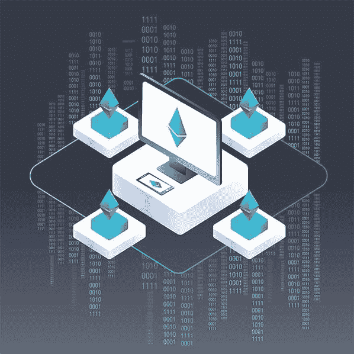

另一个可以帮助你在 Angular 中构建以太坊 dApps 的技术是 Moralis。Moralis 正迅速成为终极的 Web3 操作系统。当您使用 Moralis 时，dApp 开发过程变得更加简化和直接，因为该平台为您完成了所有繁重的工作。它为您提供了每个 dApp 都需要的后端基础设施。

因此，为您的 dApp 设置后端基础设施的持续时间减少到了几个小时。如果您试图在没有 Moralis 的情况下自己建立相同的后端功能，即使不需要几个月，也需要几个星期。

## 为什么使用 Moralis 作为你的以太坊 dApp 后端？

当你使用 Moralis 作为你的以太坊 dApp 后端时，你可以专注并花更多的时间来增强你的 dApp 用户会喜欢的前端。Moralis 还具有无限的可伸缩性，并提供跨链的互操作性。这意味着你可以在以太坊的网络上开始一个项目，然后转移到 BSC(币安智能链)。

你认为你可以在 Angular 中建立以太坊 dApps 来形成标题吗？或者，您是否希望摆弄那些可能会给人留下深刻印象的代码？

无论你的意图是什么，Moralis 是一个平台，可以帮助你快速开始，并在创纪录的时间内推出你的 dApp。

Moralis 的平台为您提供了样板代码，有助于开箱即用地集成 Angular 框架。该平台提供了几乎所有 dApps 后端都需要的几个特性。

Moralis 为您的 dApp 用户添加这些功能只需几个小时，而不是几个月。[加密登录](https://docs.moralis.io/moralis-server/users/crypto-login)可能会诱使你的用户搜索他们的交易、非功能性交易等信息。随着本文的深入，您将对此进行更多的探索。

你可以给用户提供一个 [DeFi 仪表板](https://moralis.io/how-to-create-a-defi-dashboard-in-5-steps/)，里面有所有 dApps 需要的不同种类的信息。换句话说，你不需要重新发明轮子来创造非凡的 dApps。

## **使用 Moralis SDK 构建以太坊 dApps in Angular**

注册 Moralis 后，您只需点击一下就可以创建一个 Moralis 服务器。此外，当您使用 Moralis 创建 dApps 时，设置服务器是必不可少的一部分。此外，利用 Moralis 在以太坊上开发 dApp 是一个简单的三步过程:

### **第一步:设置道德服务器**

首先，您必须创建一个免费的道德帐户，然后登录到您的道德帐户。登录后，点击 Moralis 管理面板右上角的“+创建新服务器”按钮，设置 Moralis 服务器。

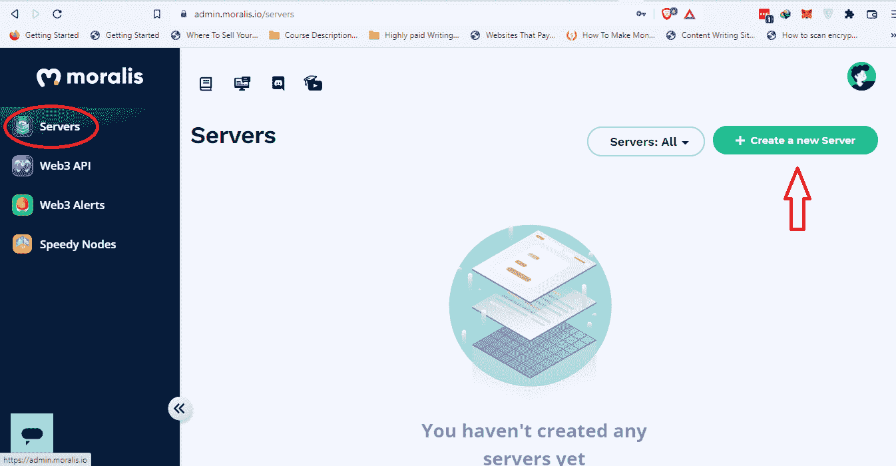

从下拉列表中，选择 mainnet(或您喜欢的选项)。三个下拉菜单选项要求您指定您希望 dApp 在哪个网络上运行。我们总是建议在第一次开始一个新项目时选择 testnet 选项。

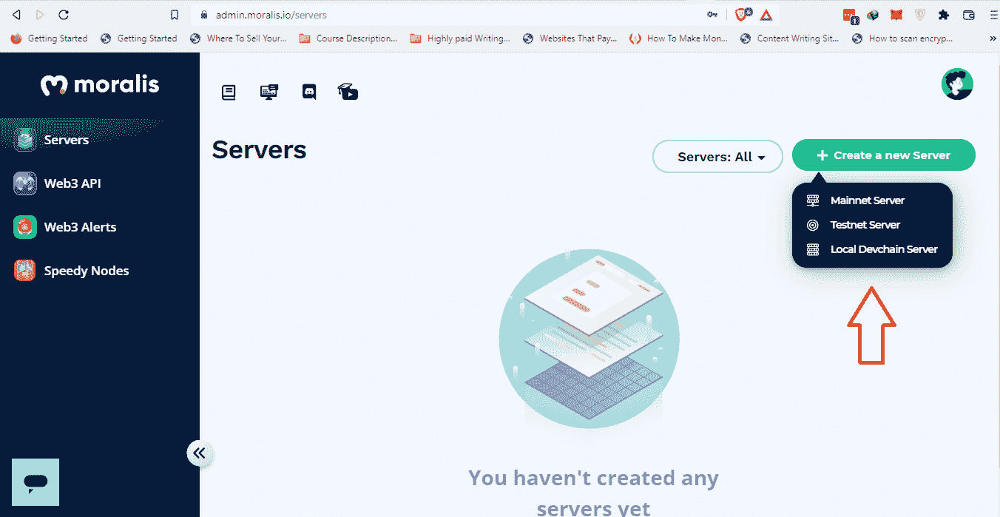

填写简表，在 Moralis 中创建服务器。

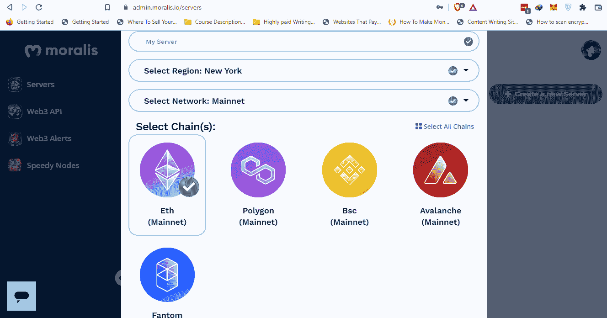

选择您将用于创建 dApp 的区块链网络。在这种情况下，我们将选择“Eth (Mainnet)”选项。您可以选择多个网络，因为 Moralis 是跨链兼容的。完成后，单击右下角的“添加实例”按钮。

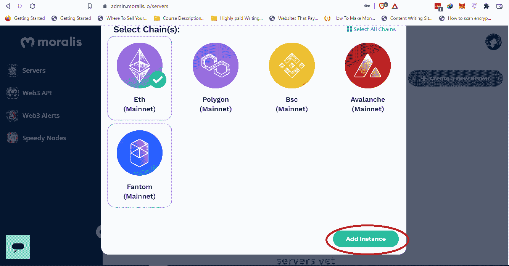

### **第二步:安装 Moralis SDK**

安装 Moralis 的 SDK 是小菜一碟。安装 Moralis SDK 的方法有很多；但是，我们将使用 npm(节点包管理器)来安装 Moralis SDK。

*注意:* *确保你已经安装了“node.js”。*

该命令如下所示:

```
npm install moralis
```

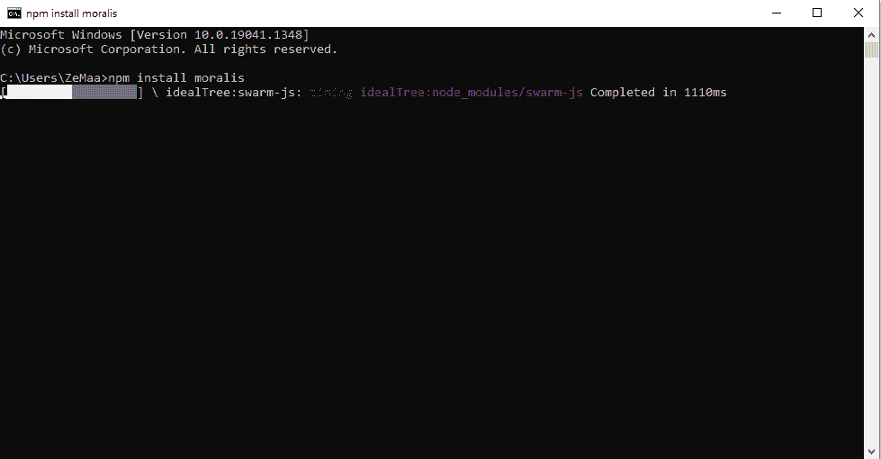

### **第三步:初始化道德规范**

最后一步是初始化 Moralis。这样做将使我们能够使用 Moralis 的特性和功能。为此，我们需要应用程序 ID 和服务器 URL。要获取此信息，请单击服务器上 Moralis 管理面板中的“查看详细信息”按钮。

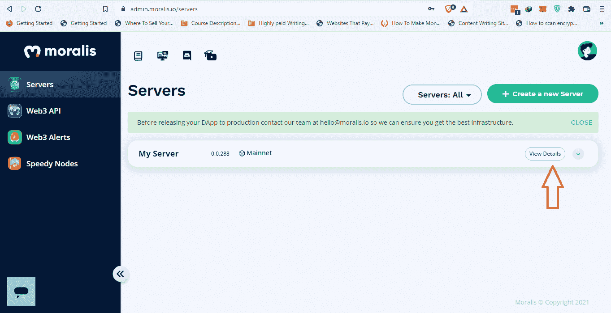

将打开以下弹出窗口，您将看到“服务器 URL”和“应用程序 ID”信息:


初始化 Moralis 服务器的代码如下:

```
/* Moralis init code */
1\. const serverUrl = "YOUR_SERVER_URL";
2\. const appId = "YOUR_APP_ID";
3\. Moralis.start({ serverUrl, appId });
```

现在，你可以看到我们已经为 dApp 打下了基础。

关于如何[连接 SDK](https://docs.moralis.io/moralis-server/getting-started/connect-the-sdk) 的更多信息，参见 [Moralis 的文档](https://docs.moralis.io/introduction/readme)。

## **用于构建以太坊 dApps 的 Moralis SDK 代码示例**

在 Moralis 服务器启动后初始化 [Moralis SDK](https://moralis.io/exploring-moralis-sdk-the-ultimate-web3-sdk/) 后，您可以开始使用 SDK。例如，如果您希望允许用户登录到您的 dApp，您需要复制粘贴两行代码，如下所示:

```
Moralis.Web3.authenticate().then(function(user){
console.log(user.get('ethAddress'))
})
```

Moralis 的强大之处在于，只要用户登录到 dApp，就可以从 Moralis 数据库服务器中获得用户信息。您不必承担设置数据库服务器的麻烦。当您使用 Moralis 快速构建 dApp 的后端时，Angular 框架将负责 dApp 的前端。

Moralis 的 SDK 是一个强大的工具箱，可以帮助您快速轻松地构建 dApps。在接下来的几节中，您将看到执行许多不同种类的操作是多么容易。

#### **获取交易:**

```
//get mainnet transactions for the current user
const transactions = await Moralis.Web3API.account.getTransactions();
```

“await”关键字将暂停程序执行。一旦获取用户帐户事务的承诺完成，代码执行将继续。

#### **获得自动/BNB 平衡:**

```
//get mainnet native balance for the current user
const balance = await Moralis.Web3API.account.getNativeBalance();
```

注意:您需要在“getNativeBalance”后面的括号中输入正确的值来获取 MATIC 或 BNB 平衡。更多信息，请查看 [Moralis 的文档](https://docs.moralis.io/moralis-server/web3-sdk/account#getnativebalance)。

在这段代码中，dApp 用户的本地余额被提取并存储在“balance”常量中。

#### **获取 ERC-20 余额:**

```
const balance = await Moralis.Web3API.account.getTokenBalance();
```

上述代码提供了对令牌余额的访问。

#### **获得 NFT 平衡:**

```
const userEthNFTs = await Moralis.Web3API.account.getNFTs();
```

上面的代码解释了一些常见的 Moralis 编程场景。您可以设计任何形式的查询，例如过滤、排序等等。在提到的 Moralis 代码示例中，最值得注意的是，如果您试图从头开始获得相同的功能(没有 Moralis 的工具、组件等)，将需要近一个月的时间，而我们只需几分钟就可以完成。这真实地展示了 Moralis SDK 的威力。

## **以太坊 Angular 样板代码，用于整合 Angular 和 Moralis**

要在 Moralis 中使用 Angular 框架，请从 GitHub 下载“demo-apps”文件夹。确保“demo-apps”文件夹包含“moralis-angular-app”文件夹。要从 GitHub 访问“demo-apps”文件夹，请访问以下链接:[https://github.com/MoralisWeb3/demo-apps](https://github.com/MoralisWeb3/demo-apps)。

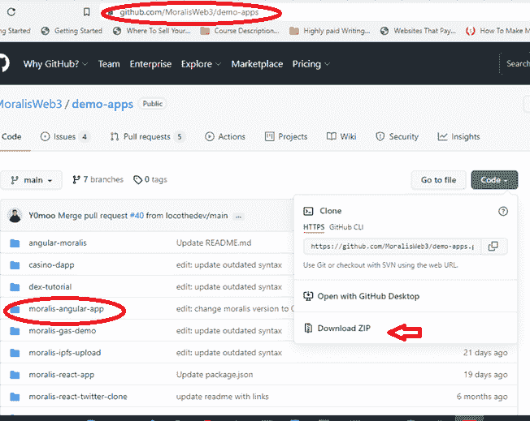

下载包含“moralis-angular-app”的“demo-apps”文件夹。在你喜欢的代码编辑器中打开“moralis-angular-app”文件夹。我们将使用微软 Visual Studio 代码(VSC)。

文件夹中的内容如下所示:

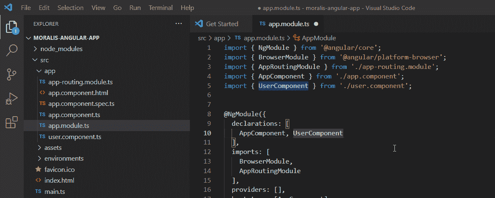

在 Visual Studio 代码中，从“终端”选项卡打开“终端”。

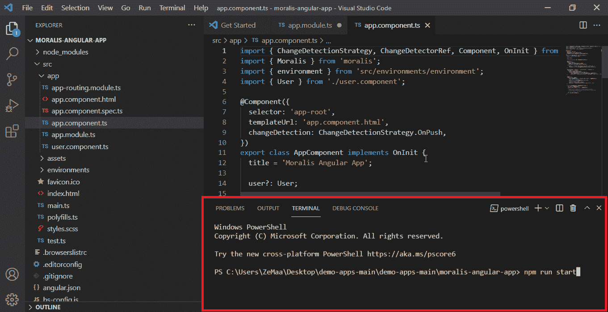

在命令行终端中运行以下命令:

```
npm run start
```

因此，它将在生产模式下推出“道德-角度-应用程序”。

在 Visual Studio 代码中，通过单击右下角的“+”按钮添加另一个终端选项卡。然后，运行以下命令:

```
npm run demo
```

该命令将在开发模式下运行“moralis-angular-app”。

### **角度开发模式登录**

最简单的登录方式是使用 MetaMask 或 WalletConnect。如前所述使用“moralis-angular-app”时，您会在 Visual Studio 代码的终端窗口中找到一个 URL。因此，打开该 URL。该 URL 将类似于以下内容:

*http://dev.localhost:5222/*

这里，URL 中的“dev”表示您处于开发模式。“localhost”表示该服务在您的本地计算机上运行，“5222”是端口号。您将看到一个类似的元掩码和 WalletConnect 登录屏幕，如下一节所示。唯一不同的是，在当前版本中，您处于开发模式。

这将允许您在 Angular 中使用 MetaMask 或 WalletConnect 登录，以将您的 dApp 连接到加密钱包。

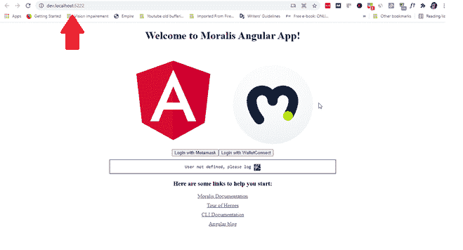

*注意:* *当你运行下面的命令时，你可能会得到一个错误消息，“你似乎不依赖于' @angular/core '和' rxjs '这是一个错误”。*

这些是提到的命令:

```
npm run start

npm run demo
```

如果发生这种情况，请运行以下命令:

```
npm install
```

该命令应该可以消除错误。

### **角度生产模式登录**

“moralis-angular-app”为您提供了使用 angular 登录 MetaMask 和 WallectConect 的能力。这两个是最受欢迎的加密钱包，连接到 dApps 以促进交易。所有的加密收入都从你的钱包里进出。

一旦您执行了“npm run start”命令，您需要在终端中向下滚动并找到类似如下的链接:

*http://localhost:4222/*

链接显示该服务运行在本地计算机上，“4222”是该服务的端口号。

您需要打开该链接，您应该会看到类似如下的页面:

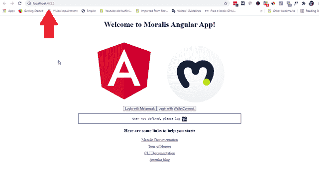

当你看到上面的页面时，点击“使用元掩码登录”，你将登录到你的元掩码帐户。请确保您的 web 浏览器中已经安装了元掩码浏览器扩展，并且您拥有元掩码帐户。

同样，当你点击“用 WalletConnect 登录”按钮时，你会看到一个二维码弹出。用您的移动设备扫描二维码，您将使用 WalletConnect 连接您的 dApp。

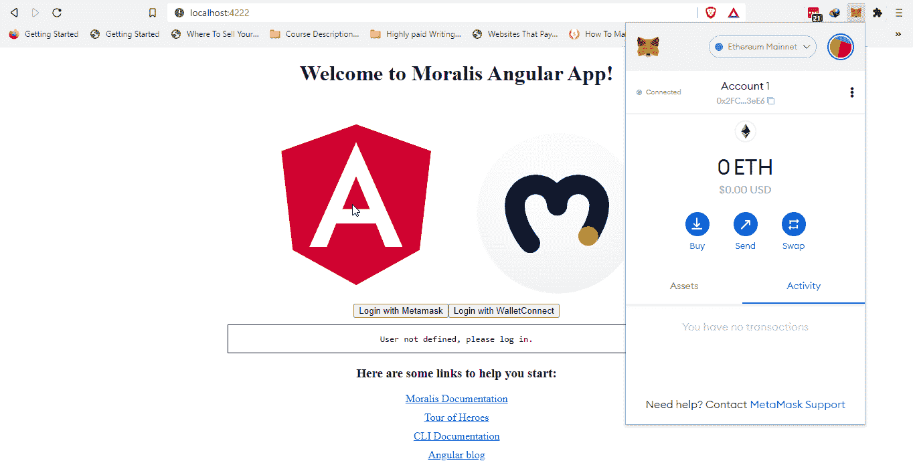

当您点击“使用元掩码登录”按钮并在元掩码扩展中登录时，您的 dApp 将与元掩码钱包连接。

同样，您可以通过单击“使用 WalletConnect 登录”按钮来连接 WalletConnect。

## **整合 Angular 和 Moralis 构建以太坊 dApps**

要将 Angular 与 Moralis 服务器集成，请访问“moralis-angular-app”中的“env.ts”文件。

像前面一样，输入服务器的值“appId”和“serverUrl”。

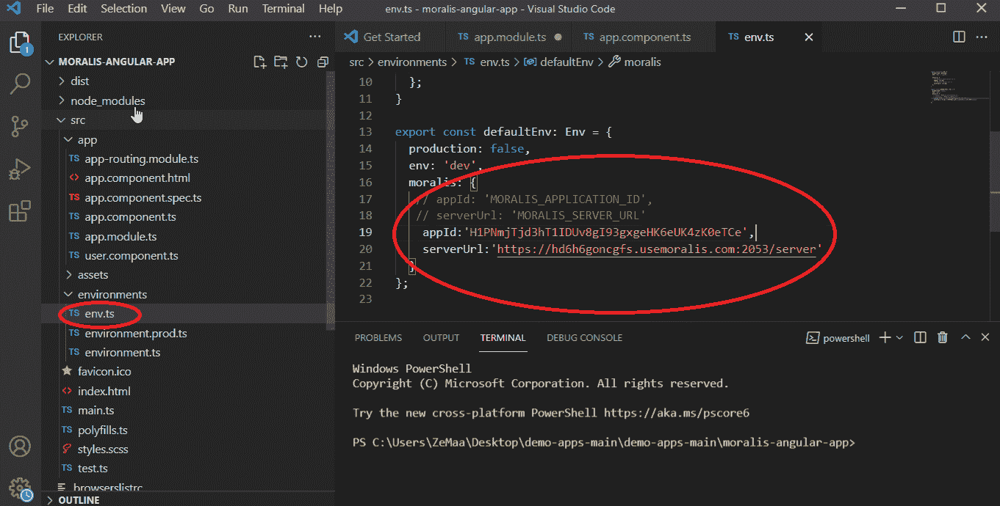

我们可以像前面一样获得服务器的详细信息。然后，我们可以复制粘贴服务器 URL 和应用程序 ID。因此，请访问您的 Moralis 账户，点击“查看详情”。您将看到以下弹出窗口:


将应用程序 ID 复制粘贴到 TypeScript 代码中的“appId:”字段，将服务器 URL 复制粘贴到“server URL”字段。

将 Angular 与 Moralis 集成后，运行“moralis-angular-app ”,并像以前一样浏览本地主机上的 URL。登录元掩码时，您将看到以下网页:

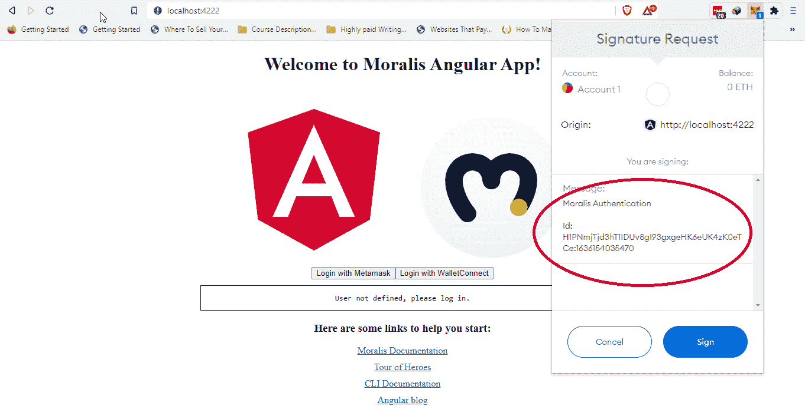

请注意，您获得了 Moralis 身份验证 ID。现在，您已经准备好在 Angular 中创建 dApp 的前端，Moralis 将覆盖您的后端，而无需构建您的服务器基础架构。因此，您可以为相同的功能节省数月的编码工作和费用。

从这里开始，你可以尽情发挥你的创造力，开发非凡的 dApps。关于你的 dApp 的进一步开发，你可以参考 Moralis 的[官方文档。](https://docs.moralis.io/introduction/readme)

## **如何在 Angular 中构建以太坊 dApps 的视觉辅助工具**

如果你更喜欢视频，并且想通过观看 YouTube 上的一段视频来探索本文中提到的所有细节，请务必查看 Moralis 的 YouTube 频道上的以下视频。因此，正如我们在本文中所讨论的那样，您将跟随 Moralis 的一位专家解释如何利用 Moralis 的棱角样板。

https://www.youtube.com/watch?v=3WU8ple4zsM

### **智能合约在坚固性上构筑以太坊在棱角性上**

当你构建以太坊 dApps 时，你必须了解 [Solidity](https://moralis.io/solidity-explained-what-is-solidity/) 的编程语言。Solidity 是 dApp 构建者开发[智能合约](https://moralis.io/smart-contracts-explained-what-are-smart-contracts/)的编程语言。

智能合约是存储在区块链上的程序，如以太坊，当正确的条件生效时，智能合约就会执行。智能合约可以被认为是组织代码、存储数据和编写所有编程逻辑的方式。

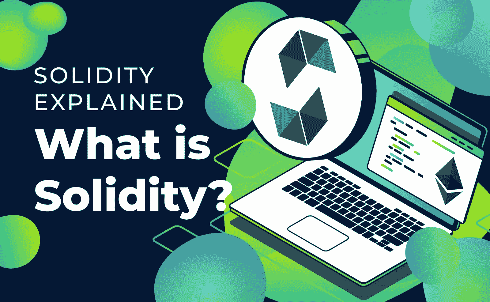

它是一种创建智能合约的高级语言，它的创建受到了 JavaScript、C++和 Python 的影响。智能合约在以太坊虚拟机(EVM)上运行，形成了以太坊区块链。

要创建智能契约，您需要利用 IDE(集成开发环境)，如 [Remix](https://moralis.io/remix-explained-what-is-remix/) 。你可以把 Remix 下载到你的电脑上，或者你可以在浏览器中使用它，然后在 Solidity 中开始编码。

稳健并不难学，它可以成为一个强有力的工具。

## **总结如何在 Angular 中构建以太坊 dApps**

在区块链行业中，没有比这更好的解决方案了，它可以让您为自己的服务器提供所有必要的服务，让您的 dApp 茁壮成长。Moralis 以易于使用的形式为您的 dApp 增加了巨大的价值，并为您节省了大量的时间和精力以及许多其他好处。因此，您可以专注于 dApp 的前端编码。

类似地，当 Angular 和 Moralis 集成发生时，它为您的前端提供了一个强大的解决方案。让你的 dApp 创建更快，你将享受到在 Angular 中构建以太坊 dApp 的所有其他好处，例如前端的单页编码和卓越的用户体验。

如果你想让你的区块链发展技能更上一层楼，一定要去看看道德学院。在道德学院，我们教区块链从零开始发展。如果你对此感兴趣，请报名参加我们的 [2021 区块链开发者 JavaScript 编程](https://academy.moralis.io/courses/javascript-programming-for-blockchain-developers)课程。然而，如果你已经认为自己是一个有经验的开发人员，并想接受学习如何编写智能合同的挑战，请查看我们的[以太坊智能合同编程 101](https://academy.moralis.io/courses/ethereum-smart-contract-programming-101) 课程。在那里，您将深入了解智能合约的全部内容。此外，您将能够构建和部署自己的以太坊智能合约。

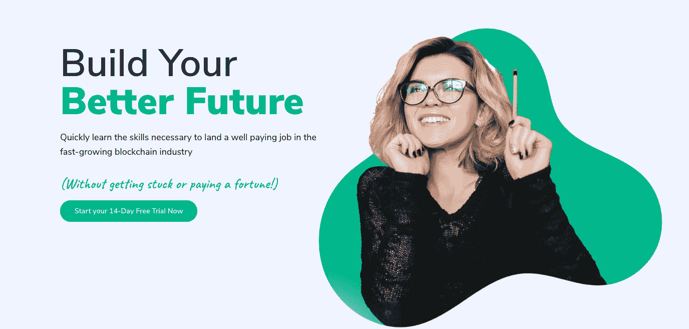