# 如何批量铸造 NFTs 批量铸造指南

> 原文：<https://moralis.io/how-to-bulk-mint-nfts-batch-minting-guide/>

**批量铸造**[**NFT**](https://moralis.io/non-fungible-tokens-explained-what-are-nfts/)**(不可替换的令牌)是开发者为了扩展他们的 NFT 应该知道如何做的一个基本特性，例如使用** [**的 NFT，ERC-1155 令牌标准**](https://moralis.io/erc1155-exploring-the-erc-1155-token-standard/) **。不是一次铸造一个 NFT，批量铸造 NFT 允许开发人员绕过一个耗时且有点昂贵的过程。因此，一次创建多个 NFT 在某些用例中非常有用，比如事件票。此外，还有许多其他的使用案例，比如** [**NFT 游戏**](https://moralis.io/what-are-nft-games-and-how-to-make-nft-games/) **、认证等等。此外，由于 NFT 收藏品现在风靡一时，在名人、运动员和密码爱好者中也越来越受欢迎，大多数开发人员都想学习如何批量制造 NFT。因此，这份批量铸造指南将为你提供适当的知识和工具，使你能够快速、轻松地批量铸造非功能性食品。**

如果你是密码领域的新手，单独批量制造 NFT 的想法可能会显得势不可挡。然而，我们向您保证，批量铸造 NFTs 比您想象的要简单得多。当然，有几个著名的 NFT 市场，OpenSea 是其中的佼佼者，在那里你可以很容易地制造 NFT。然而，像 OpenSea 这样的选项离分散化还很远，它们通常也不提供批量铸造功能。因此，您需要做一些编码来以分散的方式正确地完成这项工作。幸运的是，有强大的工具可以尽可能简化这个过程。此外，开发者中最重要的工具是[Moralis](https://moralis.io/)——终极 [Web3](https://moralis.io/the-ultimate-guide-to-web3-what-is-web3/) 开发平台。

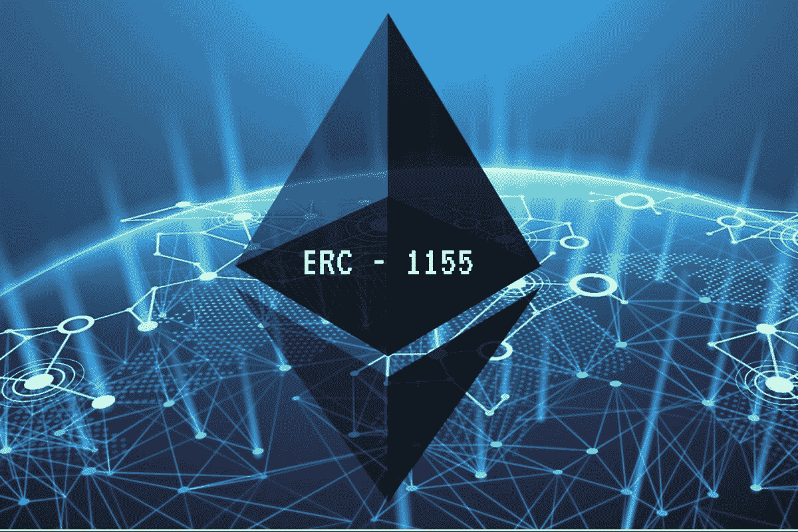

## 如何批量生产非功能性食品的基本知识

在本文中，我们将进行一个示例项目，向您展示如何使用 Moralis 和 [IPFS](https://moralis.io/what-is-ipfs-interplanetary-file-system/) 批量创建 NFTs 但是，在此之前，我们需要了解一些基础知识，以便让您快速掌握。了解什么是 NFT，什么是 NFT 铸币，什么是最流行的 NFT 标准，以及一些关于道德的基础知识将会在你前进的时候很好地为你服务。

*   [**什么是 NFT**](https://moralis.io/non-fungible-tokens-explained-what-are-nfts/)**？–**不可替换令牌(NFT)是一种特殊的加密令牌，拥有独特的功能。本质上，NFT 是存储在数字分类账中的唯一且不可互换的数据单位。

*   什么是 NFT 造币厂？–制造 NFT 是执行交易的过程，该交易将令牌的元数据存储在区块链上。此外，正是这一行动创造了 NFT。没有铸币，你只有数字文件和数据。
*   **ERC-721 和 ERC-1155 NFT 标准**—[ERC-721 令牌标准](https://moralis.io/erc-721-token-standard-how-to-transfer-erc721-tokens/)是 NFTs 的主要标准之一， [ERC-1155 令牌标准](https://moralis.io/erc1155-exploring-the-erc-1155-token-standard/)是一种新颖的多令牌标准(适合批量铸造)。
*   **什么是道德？–**Moralis 是整合了跨链互操作性的终极 Web3 开发平台。因此，它为大多数主要连锁店提供全面支持。此外， [Moralis 的 SDK](https://moralis.io/exploring-moralis-sdk-the-ultimate-web3-sdk/) 包含了最广泛的[以太坊 API](https://moralis.io/ethereum-api-develop-ethereum-dapps-with-moralis/) ，包括一个[终极 NFT API](https://moralis.io/ultimate-nft-api-exploring-moralis-nft-api/) 。此外，通过 [Moralis Speedy Nodes](https://moralis.io/speedy-nodes/) ，Moralis 还可以作为最可靠的[节点提供者](https://moralis.io/infura-alternatives-and-blockchain-node-providers/)之一，帮助您克服 RPC 节点的所有[限制。后者使其成为 BSC](https://moralis.io/exploring-the-limitations-of-rpc-nodes-and-the-solution-to-them/) 的最佳 [Infura 和雪崩](https://moralis.io/infura-bsc-alternatives-the-best-alternative-to-infura-for-bsc/)的最佳 [Infura。因此，如果你真的想学习如何以最快最简单的方式批量制造非功能性食物，请务必今天就](https://moralis.io/infura-for-avalanche-exploring-infura-avalanche-alternatives/)[创建你的免费道德账户](https://admin.moralis.io/register)！


## 如何批量制造 NFT–示例项目

我们相信学习新事物的最好方法是采取行动。因此，我们邀请您与我们一起承担以下示例项目。展望未来，我们将批量生产三种非功能性食品；然而，按照同样的原则，我们可以很容易地做几百个甚至几千个。如前所述，我们将使用 Moralis 来满足大部分后端需求。此外，我们将使用 [IPFS](https://moralis.io/full-guide-how-to-upload-to-ipfs/) 的分散文件存储解决方案。这将是无缝完成，因为道德提供与 IPFS 完全集成。此外，我们可以[上传文件夹到 IPFS](https://moralis.io/how-to-upload-folders-to-ipfs/) 的事实使我们能够批量上传文件(在我们的例子中，我们将上传 PNG 和 JSON 文件)。这也意味着所有文件将具有相同的哈希。此外，正是由于这个选项，我们将基本上能够批量制造非功能性食品。一旦我们以分散的方式上传了图像和元数据文件，我们将使用一个[智能契约](https://moralis.io/smart-contracts-explained-what-are-smart-contracts/)模板来批量创建 NFT。此外，我们还将向您展示如何在 OpenSea 上显示这些 NFT。

我们需要完成的步骤:

*   **批量上传 PNG 文件到 IPFS。**
*   **为我们的 NFT 生成包含元数据的 JSON 文件。**
*   **批量上传 JSON 文件到 IPFS。**
*   散装薄荷 NFTs。
*   在 OpenSea 上展示铸造的 NFT。

*注意* *:我们将从已经生成的 PNG 文件开始。对于这个示例项目，您可以随意使用任何类型的 PNG 或 JPEG 文件。此外，如果你对批量生成图像(NFT 收藏品的创意部分)感兴趣，请留下来，因为我们将在不久的将来介绍如何做到这一点。*

## 批量制作 NFT–将图像文件上传到 IPFS

我们将使用 Visual Studio Code (VSC)来编写和编辑代码。但是，您可以根据自己的喜好使用任何其他代码编辑器。请看下图，我们从一个包含 100 个 PNG 文件的文件夹开始:

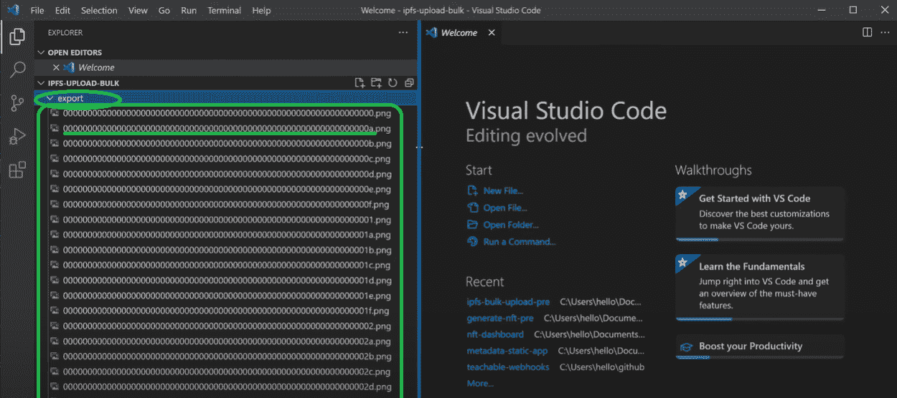

文件名包含 64 个字符。至于文件名，您可以随意使用。然而，我们使用 64 字符命名，因为这是 ERC-1155 NFTs 元数据的标准。这样，我们将能够在生成元数据时使用文件名。

为了将图片批量上传到 IPFS，我们将创建一个新的”。js”文件(“images.js”)。然而，我们必须首先确保我们的包管理器(我们使用 npm)安装了我们需要的所有工具。因此，首先打开终端(见下图)。接下来，在命令行中键入“ ***npm init*** ”。一旦执行完毕，输入“ ***npm install fs*** ”。然后通过键入“ ***npm 安装 axios*** ”来完成这一部分。

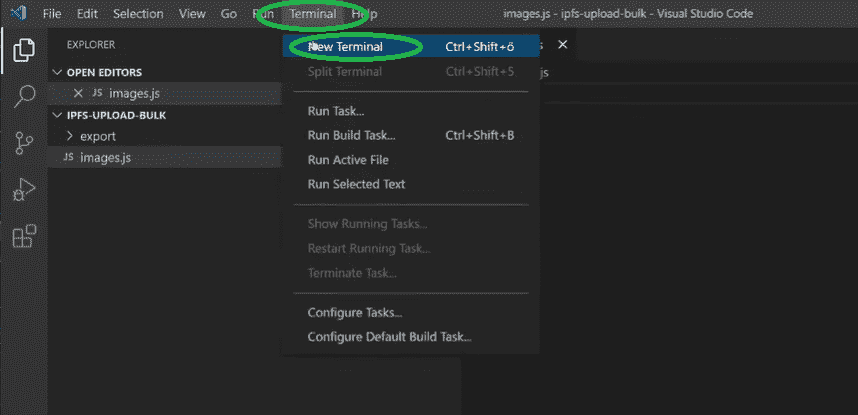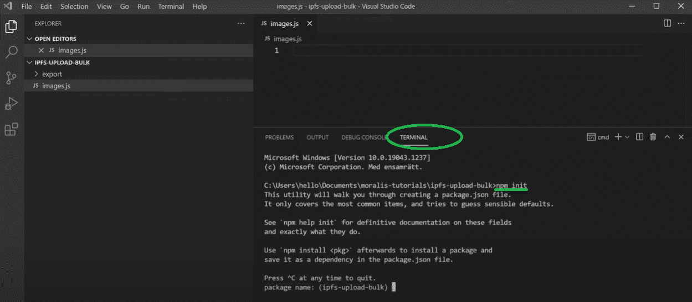

### 批量制作 NFT–将图像文件上传到 IPFS–代码演练

最后，我们已经准备好开始编写“images.js”文件中的代码(参见下面的实际代码)。在代码的顶部，我们导入上面安装的“npm 包”。接下来，我们希望我们的代码能够浏览图像。代码必须首先将图像从文件中读取到 JavaScript 的。为此，我们还需要将图像分配给一个数组(我们定义了两个数组，将在第三行和第四行中使用)。我们使用“for”循环继续(从第五行开始)。在循环中，我们确保代码将遍历图像文件并正确导出它们。这也是我们应用“paddedHex”的地方，它负责前面提到的 64 个字符的命名。

代码的最后一部分(以“ *Promise.all* ”开头)是道德的力量显露出来的地方。在这里，代码需要上传图像到 IPFS。幸运的是，Moralis 通过其端点“ ***”上传文件夹*** ”来完成这项繁重的工作，确保我们包含图像的文件夹被上传到 IPFS。

以下是“images.js”文件中的完整代码:

```js
let fs = require("fs");
let axios = require("axios");

let ipfsArray = [];
let promises = [];

for (let i = 0; i < 100; i++) {
    let paddedHex = ("0000000000000000000000000000000000000000000000000000000000000000" + i.toString(16)).substr("-64");

    promises.push(new Promise( (res, rej) => {
        fs.readFile(`${__dirname}/export/${paddedHex}.png`, (err, data) => {
            if(err) rej();
            ipfsArray.push({
                path: `images/${paddedHex}.png`,
                content: data.toString("base64")
            })
            res();
        })
    }))
}
Promise.all(promises).then( () => {
    axios.post("https://deep-index.moralis.io/api/v2/ipfs/uploadFolder", 
        ipfsArray,
        {
            headers: {
                "X-API-KEY": '',
                "Content-Type": "application/json",
                "accept": "application/json"
            }
        }
    ).then( (res) => {
        console.log(res.data);
    })
    .catch ( (error) => {
        console.log(error)
    })
})
```

### 道德端点和您的 API 密钥

查看代码的“Promise.all”部分，您可以看到您需要使用 Moralis 的 IPFS 端点，并在“X-API-KEY”后面的引号内插入您的 API 键。

以下是访问 Moralis 端点需要遵循的步骤:

1.  在 Moralis 的管理面板中，点击左侧菜单中的“ [Web3 API](https://docs.moralis.io/moralis-server/web3-sdk/intro) ”选项:

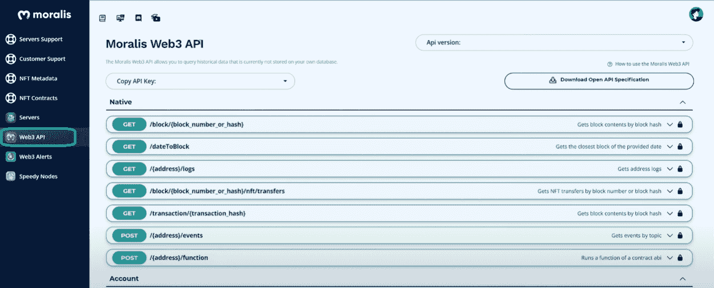

2.  向下滚动，直到找到“存储”部分。在顶部，你应该看到“***ipfs/upload folder***”端点。要查看详细信息，请单击它:


*注* *:你可以在* [*Moralis 的文档*](https://docs.moralis.io/) *中找到更多关于端点的细节。*

以下是获取 API 密钥需要遵循的步骤:

1.  再次访问你的道德管理面板中的“Web3 API”标签:

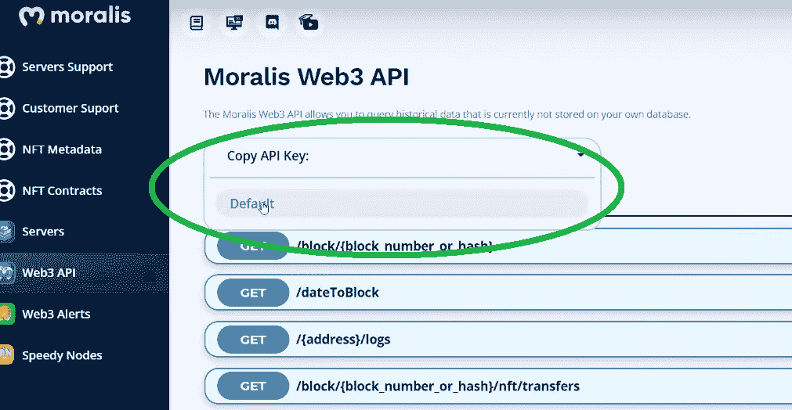

2.  首先，单击“复制 API 密钥”，然后单击“默认”。这将自动把你的 API 密匙复制到你的剪贴板上(右上角的消息将会确认这一点)。


*注意* *:要获得你的 API 密匙，你需要创建你的免费道德账户。如果你已经这样做了，点击* [*登录*](https://admin.moralis.io/login) *获取你的 API 密匙。*

一旦你复制了你的 API 密匙，把它插入到上面的代码中并保存文件。现在是运行代码的时候了，在终端中输入“ ***node image.js*** ”:


作为回报，您将获得刚刚上传到 IPFS 的所有图片的路径:

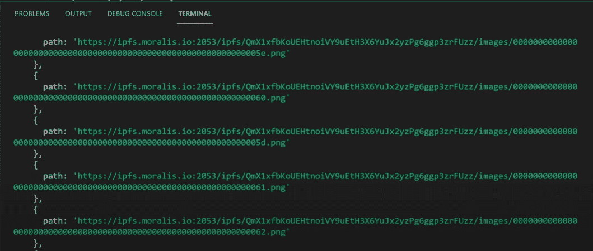

通过在浏览器中输入任何路径，您现在应该能够看到与该特定路径相关的图像。此外，如果您使用 Web3 浏览器，如“Brave”，您可以跳过“[https://ipfs.moralis.io:2053/ipfs/](https://ipfs.moralis.io:2053/ipfs/)”部分:


## 批量制作 NFT–生成和上传元数据文件

我们将覆盖这一部分类似于我们所做的图片。我们创造另一个”。js”文件(“metadata.js”)。由于许多相似之处，我们可以从“images.js”文件中复制并粘贴代码。负责上传到 IPFS 的那部分代码本质上是相同的。我们在“for”循环中应用了主要的更改，现在我们必须为我们的 ERC-1155 令牌添加一些细节(图像、名称和描述)。对于名称和描述，您可以随意使用。然而，要访问我们之前上传的图像，我们需要使用匹配散列(幸运的是，它对所有图像都是一样的)。

以下是“metadata.js”文件中的完整代码:

```js
let fs = require("fs");
let axios = require("axios");

let ipfsArray = [];

for (let i = 0; i < 100; i++) {
    let paddedHex = ("0000000000000000000000000000000000000000000000000000000000000000" + i.toString(16)).substr("-64");
    ipfsArray.push({
        path: `metadata/${paddedHex}.json`,
        content: {
            image: `ipfs://QmX1xfbKoUEHtnoiVY9uEtH3X6YuJx2yzPg6ggp3zrFUimg/${paddedHex}.png`,
            name: `My Youtube test NFT #${i}`,
            description: "Awesome NFT for my youtube video"
        }
    })
}
axios.post("https://deep-index.moralis.io/api/v2/ipfs/uploadFolder", 
    ipfsArray,
    {
        headers: {
            "X-API-KEY": 'wnFbJ8XSeI8Ym4uOBsBHQfoYSOXF31OxAxs6ohXchHo7D7qvoJ66Qetxll5jrA46',
            "Content-Type": "application/json",
            "accept": "application/json"
        }
    }
).then( (res) => {
    console.log(res.data);
})
.catch ( (error) => {
    console.log(error)
})
```

现在我们需要运行代码来执行到 IPFS 的批量上传。首先在终端的命令行中输入“ ***node metadata.js*** ”。现在我们可以看到，我们得到的是 JSON 文件，而不是 PNG 文件:

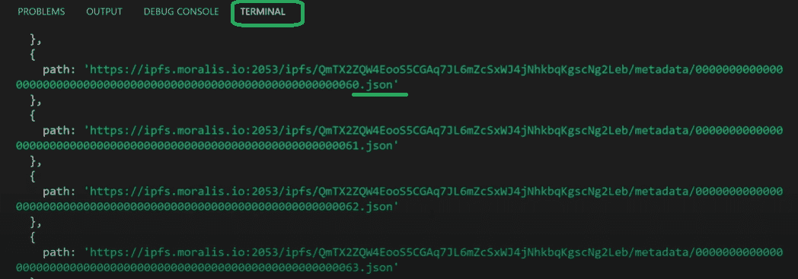

我们现在可以访问包含以下详细信息的 IPFS 路径数组:


您可以通过任何元数据路径查看上述详细信息。

由于批量上传，它们都具有相同的散列，这是 ERC-1155 令牌标准的要求之一。您将在下面的实际“批量铸造 NFT”步骤中看到这一点。

## 如何批量生产非功能性食品

到目前为止，我们所做的一切都只是一个准备，这将使我们能够批量制造 NFT。现在我们有了图像和元数据，当我们使用现在以分散方式保存在 IPFS 上的文件批量创建我们的 NFT 时，我们将使用它们。

对于实际的制作过程，我们将使用 [Remix](https://moralis.io/remix-explained-what-is-remix/) 。此外，我们将通过在 OpenZeppelin 上获取智能合约模板来跳过智能合约的创建(我们需要创建 NFT)。通过使用标准的 ERC-1155 智能合约，我们只需要进行一些小的调整。如下所示，我们要删除与红线交叉的线，同时我们必须对标有黄色的部分进行修改。黄线以上的部分必须替换为我们的 hash 和“/metadata”。此外，对于黄色圆形方块中的部分，我们需要添加额外的两个实例，以便创建三个 NFT。*如果我们要铸造所有 100 个 NFT，我们可以添加一个循环来覆盖它们，而不是手动添加 100 个实例。*

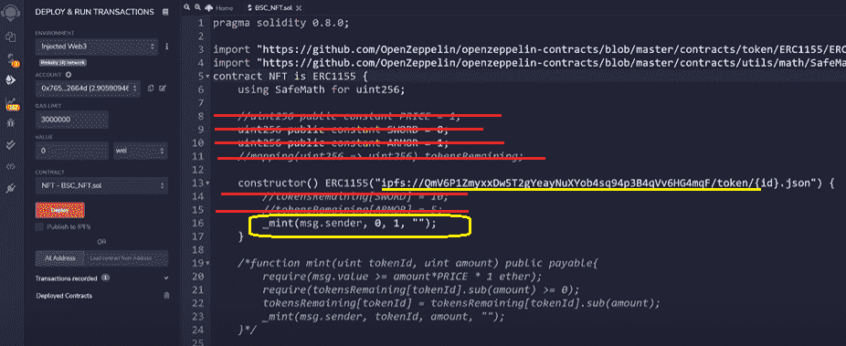

这就是我们剩下的:

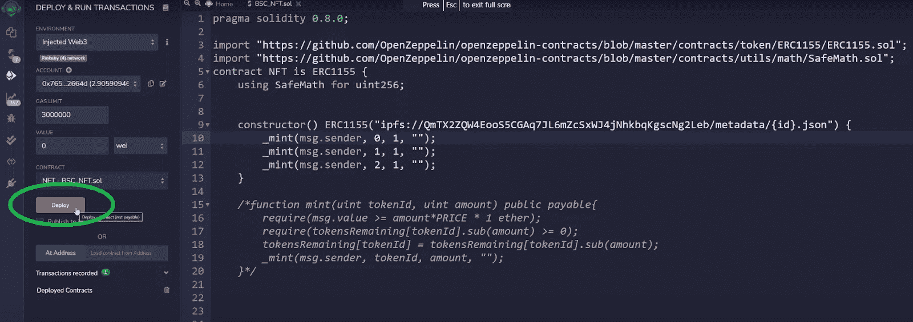

要执行交易(完成铸造部分)，您需要单击“部署”按钮。这将提示您的[元掩码](https://moralis.io/metamask-explained-what-is-metamask/)，您将使用它来确认交易。您可以点击“确认”按钮:

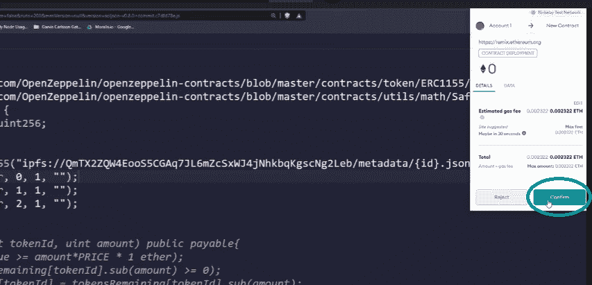

另外，请注意，我们使用了 Rinkeby testnet，但是您可以选择其他选项。但是，请注意您选择的选项，因为您需要相应地选择以在 OpenSea 上显示您的 NFTs。一旦创建了 NFT，您将会在 Remix 的“部署和运行事务”导航选项卡底部的“已部署合同”下看到 NFT 的地址。单击复制图标复制地址:


### 如何批量生产非功能性食品——在 OpenSea 上展示非功能性食品

由于 OpenSea 仍然是最受欢迎的 NFT 市场，在那里展示并列出你的 NFT 是有意义的。您可以通过访问“opensea.io/get-listed/”来完成此操作。一旦到了那里，您需要选择我们项目的阶段(因为我们在 testnet 上创建了 NFTs，所以我们选择了“在 testnet 上运行”选项):

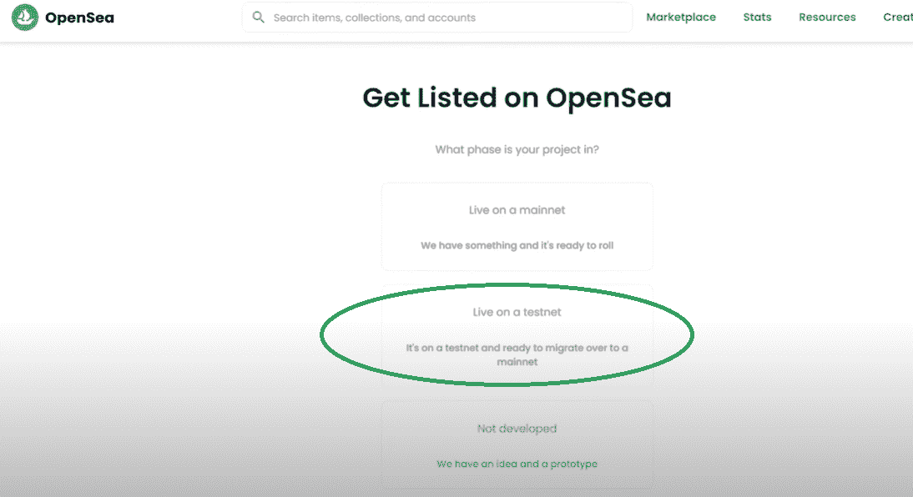

接下来，您要选择我们用于铸造的 testnet(在我们的例子中是 Rinkeby)，输入我们的 ERC-1155 合同地址(粘贴我们从 Remix 复制的内容)，然后单击“提交”按钮:


OpenSea 有时需要一段时间来处理您的请求。但是，如果您正确地遵循了上述步骤，您现在就可以在您的 OpenSea 仪表板上查看这三个新创建的 NFT。

## 如何批量铸造 NFT–批量铸造指南–摘要

现在你应该知道关于批量铸造 NFT 的所有基础知识。此外，如果您实际参与了这个示例项目，那么您现在知道如何以最小的努力批量创建 NFT。总而言之，一旦您将图像(或其他类型的文件)放在一个文件夹中，您基本上需要完成以下步骤:

*   批量上传图像文件到 IPFS。
*   为我们的 NFT 生成包含元数据的 JSON 文件。
*   批量上传 [JSON](https://moralis.io/json-explained-what-is-json-javascript-object-notation/) 文件到 IPFS。
*   散装薄荷 NFTs。
*   在 OpenSea 上显示铸造的 NFT。

使用 VSC、Moralis、MetaMask、Remix 和 OpenSea，你可以毫不费力地完成以上步骤。

此外，如果你在区块链的发展道路上寻找更多的灵感或指导，我们建议查看 [Moralis 的博客](https://moralis.io/blog/)和 [Moralis 的 YouTube 频道](https://www.youtube.com/c/MoralisWeb3)。在这两个网站上，您将能够找到大量高质量的内容，包括无数的示例项目。此外，如果你是一个完全的初学者，但希望[成为一名成功的区块链开发者](https://moralis.io/how-to-become-a-blockchain-developer/)，我们鼓励你报名参加[道德学院](https://academy.moralis.io/)的一门高质量课程。

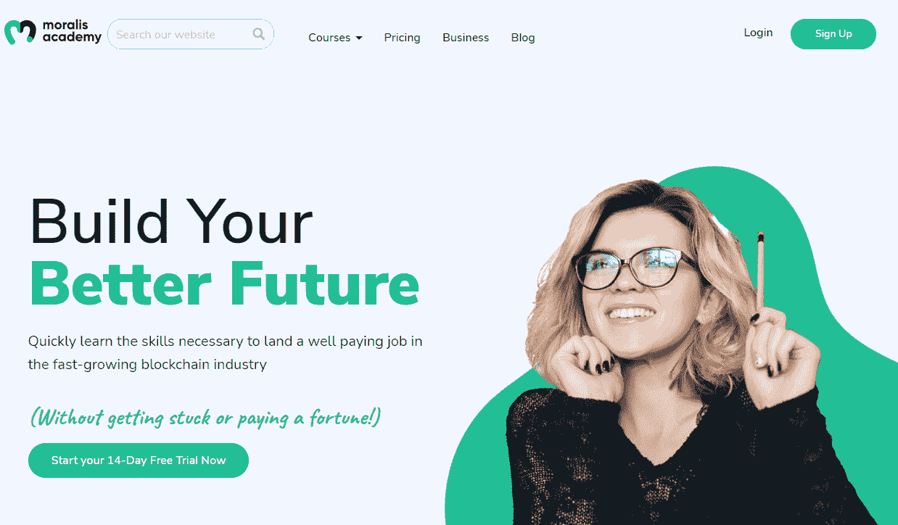