# 如何将 Unity 应用程序连接到 Web3 钱包

> 原文：<https://moralis.io/how-to-connect-a-unity-app-to-a-web3-wallet/>

在本文中，我们将向您展示如何将 Unity 应用程序连接到 Web3 钱包。但是，如果您想跳过教程，直接进入代码和项目库，请务必查看下面的 GitHub 页面:

**完整文档—**[**https://github . com/moralisweb 3/YouTube-教程/tree/main/unity-钱包-手机**](https://github.com/MoralisWeb3/youtube-tutorials/tree/main/unity-wallet-mobile)

为多个平台开发游戏和应用程序是一项艰巨的任务。因此，利用有可能使这个过程更容易实现的开发工具是合乎逻辑的。一个这样的工具是 [Unity](https://unity.com/) 。Unity 允许您快速开发适用于多种不同设备的跨平台应用程序。此外，当谈到区块链开发时，允许用户将他们的 [Web3 钱包](https://moralis.io/what-is-a-web3-wallet-web3-wallets-explained/)连接到 Unity 应用程序更有趣。这在传统上是一个复杂的过程；然而，使用 [Moralis](https://moralis.io/) ，我们可以在几分钟内完成。因此，我们将向您展示如何使用 Moralis 将 Unity 移动应用程序连接到 Web3 钱包！

从传统的角度来看，当有人想要将加密钱包连接到移动 [dApp](https://moralis.io/decentralized-applications-explained-what-are-dapps/) 时，这个过程非常繁琐，因为这个过程需要大量的后端区块链开发。有了 Moralis，这一点就迎刃而解了——让你不必重新发明轮子。Moralis 为所有用户提供了现成的后端基础设施，使得 [Web3 开发](https://moralis.io/how-to-build-decentrali%E2%80%A6)更加简单。因此，当使用 Moralis 操作系统时，您可以显著减少所有未来区块链项目的开发时间，平均减少 87%。

所以，如果你想成为一名区块链开发者，你旅程的第一步就是注册 Moralis。这将允许您更快地进入市场，并为您提供市场上最好的开发人员体验！此外，您将能够快速轻松地完成“将 Unity 应用程序连接到 Web3 wallet”任务！

## 如何将 Unity 应用程序连接到 Web3 钱包

在本文的这一部分，我们将深入探讨如何将 Unity 应用程序连接到 Web3 钱包。为了说明使用 Moralis 的强大功能，我们将创建一个简单的 Android Unity 应用程序，用户可以将他们的 [MetaMask](https://moralis.io/metamask-explained-what-is-metamask/) 钱包连接到该应用程序并签署一条消息。作为回报，该应用程序将显示一条成功消息以及用户的钱包地址。

现在，为了使教程更容易理解，我们将把如何将加密钱包连接到移动 dApp 的过程分解为以下五个步骤:

1.  开发前端用户界面。
2.  设置 Moralis 服务器。
3.  配置 Web3 wallet 连接。
4.  添加应用管理器脚本。
5.  微调用户界面。

此外，如果你对视频指南更感兴趣，可以看看下面这个来自道德 YouTube 频道的视频。在这里，您可以跟随我们的开发人员带领您完成整个过程:

https://www.youtube.com/watch?v=LSqCw3f3i9U

按照上面的视频进行操作，将使您更容易将 Unity 应用程序连接到 Web3 钱包。所以，事不宜迟，让我们通过创建一个 Unity 项目并开发我们应用程序的前端来开始这个过程吧！

## 步骤 1:如何将 Unity 应用程序连接到 Web3 钱包——开发前端 UI

你需要做的第一件事是下载 Unity 并安装 Unity Hub。此外，由于我们即将创建一个 Android 应用程序，需要做一些调整。为了让 Unity 适合 Android 开发，我们需要确保“构建设置”设置为 Android 平台。

因此，你需要做的第一件事就是安装 Android SDK。为此，您需要打开 Unity Hub，导航到“安装”选项卡，单击嵌齿轮，然后单击“添加模块”。然后你需要安装“Android 构建支持”并包含 Android SDK。

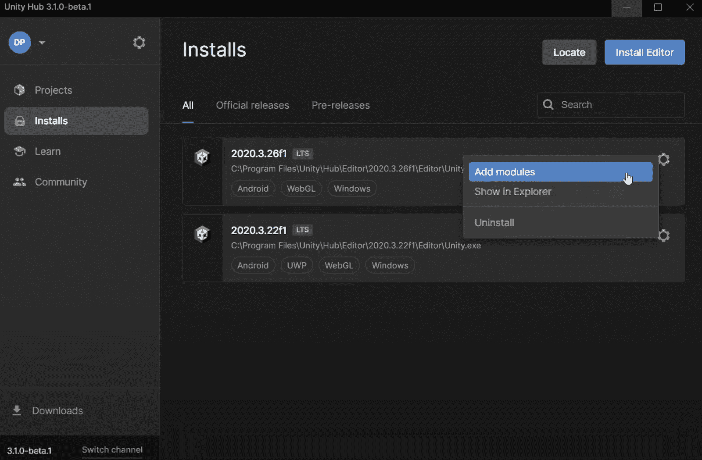

随着平台改为 Android，我们可以继续创建一个新的场景，我们将称为“主”。接下来，下一步是创建一个新的画布和面板并添加到“Main”中。在面板中，我们添加了一个按钮，命名为“ConnectButton”，以及一个“TextMeshPro”元素，命名为“WalletAddressText”。此外，我们还将在按钮上添加一个文本“连接到钱包”。

现在，这基本上是演示应用程序的用户界面。然而，用户界面应该基于你的喜好。因此，你可以自由地在 Unity 中玩耍，并把你的想法添加到你的应用程序的 UI 中，使它适合你的开发需求。然而，这基本上就是我们正在创建的应用程序的结构:

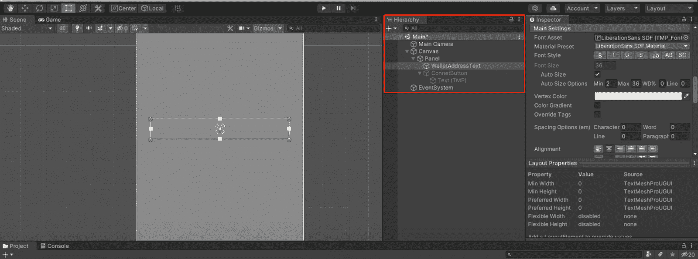

此外，如果您想了解更多关于加密领域的 UI(用户界面)开发的信息，我们建议您仔细看看 Moralis 的 [Web3UI kit](https://moralis.io/web3ui-kit-the-ultimate-web3-user-interface-kit/) 。现在，让我们继续我们的探索，通过设置 Moralis 服务器将 Unity 应用程序连接到 Web3 钱包！

## 步骤 2:如何将 Unity 应用程序连接到 Web3 钱包–设置 Moralis 服务器

一旦你对应用程序的用户界面感到满意，下一步就是下载道德元宇宙软件开发工具包。要做到这一点，你只需点击上一个链接，然后点击网页下方的“立即开始”按钮。然后你需要导航到“发布”，你可以在网页的右侧找到，最后下载 Unity 包。

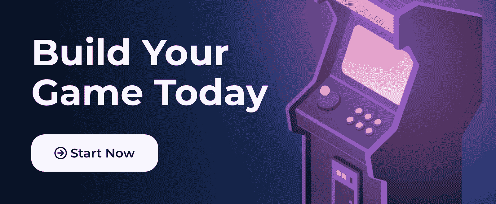

一旦你下载了 SDK，你可以把文件拖到 Unity 的“Assets”字段，这会提示你导入文件。导入文件后，您将可以访问包含所有道德元宇宙 SDK 元素的文件夹。

接下来，你要将“道德设置”元素添加到“主”场景中。这可以通过将文件拖放到场景的“层次”字段来实现。

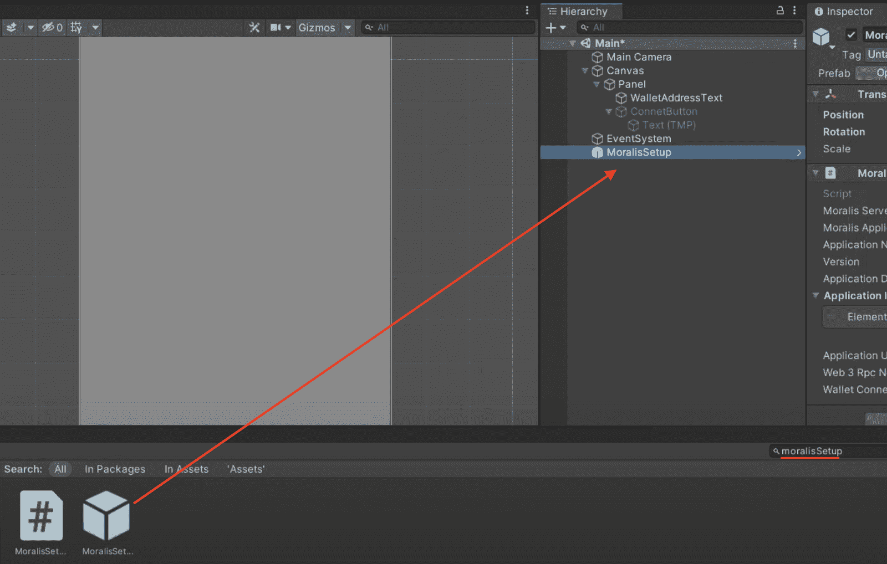

一旦“MoralisSetup”元素被合并到您的 Unity 项目中，您会注意到您需要添加一些信息。例如，您需要添加一个服务器 URL、应用程序 ID 和一个 Moralis Speedy 节点 URL。因此，你需要自己的道德服务器。

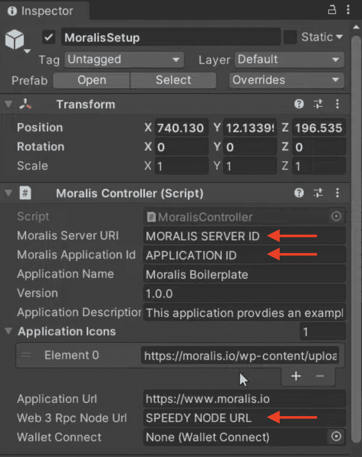

### 创建 Moralis 服务器并获取区块链节点

如果你还没有，下一步是创建一个道德账户。这是完全免费的，你可以在几秒钟内完成。一旦你有了自己的账户，你可以点击 Moralis 管理面板右上角的“创建新服务器”按钮来创建一个新的服务器。这将为您提供一个包含三个选项的下拉菜单。对于本教程，我们选择了“Testnet 服务器”。

一旦您选择了这个选项，一个新的窗口将会出现，您需要在这里添加一个服务器名称，选择一个区域，最后选择链。对于本教程，我们将选择“Eth (Ropsten)”替代。因此，如果您正在跟进，我们建议您也这样做。现在，剩下的就是点击右下角的“添加实例”按钮。

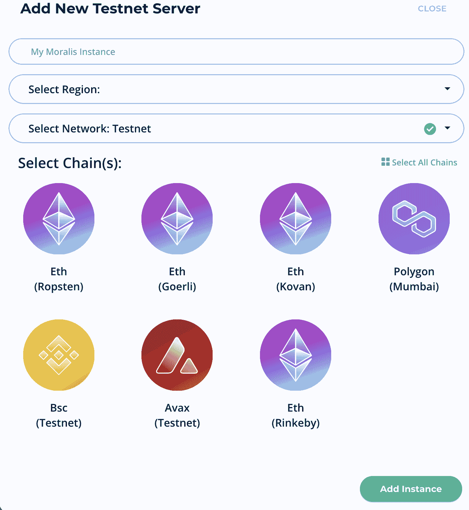

这将启动服务器，您可以通过单击相关服务器的“查看详细信息”按钮找到服务器 URL 和应用程序 ID。然后，您可以将这些信息复制粘贴到 Unity 的相应字段中。

这一步的最后一部分是获取区块链节点。要获得一个节点，你需要点击 Moralis 管理面板最左边的“ [Speedy Nodes](https://moralis.io/speedy-nodes/) ”标签。这会给你提供一堆人脉。由于我们在创建服务器时选择了“Eth (Ropsten)”，您可以点击[以太坊](https://moralis.io/full-guide-what-is-ethereum/)网络的“端点”按钮，复制 Ropsten URL，并将其粘贴到 Unity 中的适当字段。

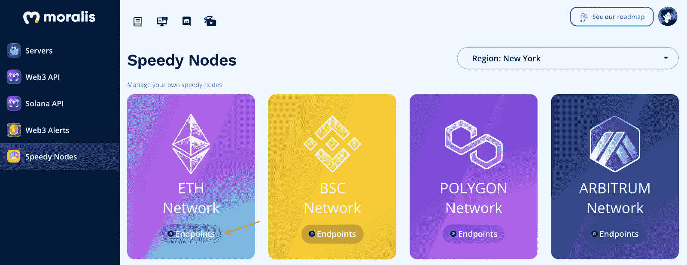

这就是设置 Moralis 服务器并成功连接到您的 Unity 项目的全部内容！

## 步骤 3:如何将加密钱包连接到移动 dApp–配置 Web3 钱包连接

现在您已经将 Moralis 服务器连接到应用程序，下一步是配置 Web3 wallet 连接。您需要将“WalletConnect”元素添加到您的“主”项目中。您可以再次简单地将组件拖放到“Hierarchy”字段中。

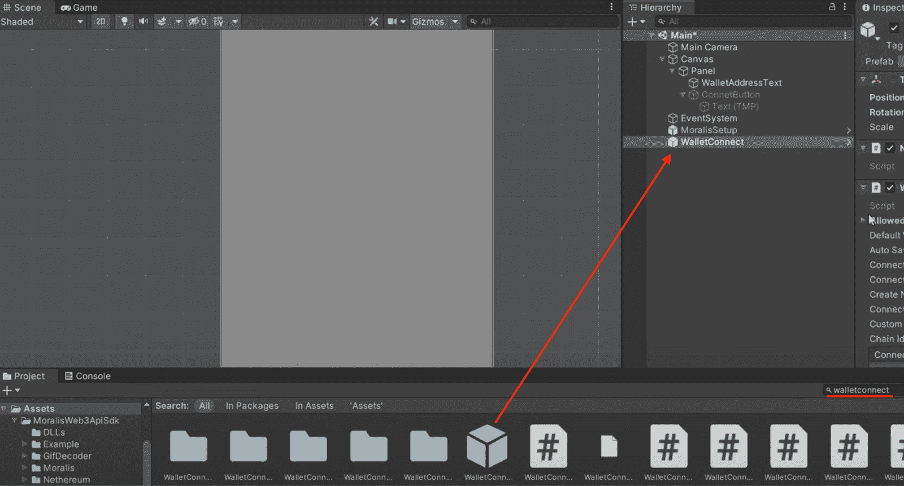

将元素添加到项目后，您需要进行一些调整。首先，你要选中“自动保存和恢复”和“启动时连接”选项。然后，您可以继续删除所有关联的事件。

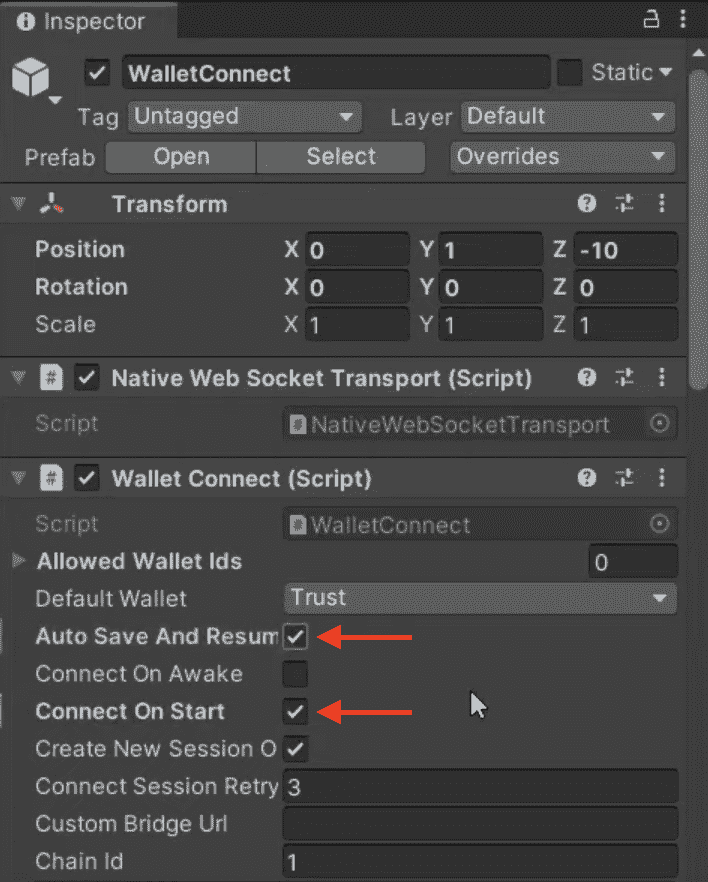

接下来，我们将激活我们在第一步中创建的“连接按钮”。激活按钮后，我们将添加一个“On Click()”事件，并将“WalletConnect”文件拖到显示“None (Object)”的字段中。然后你还需要点击“无功能”下拉菜单并选择“OpenDeepLink()”。因此，每当用户单击该按钮时，它将自动打开他们的 MetaMask 应用程序。

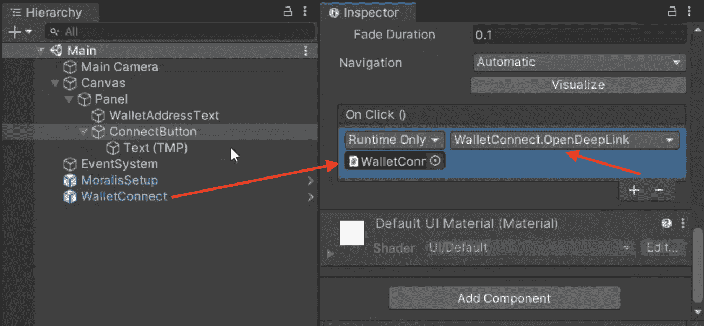

然而，我们也希望 MetaMask 处理所有返回的信息。因此，我们需要一个剧本。因此，我们将在接下来的部分向您展示如何添加脚本，并对代码进行一些修改，使其适合我们的应用程序。

## 步骤 4:如何将 Unity 应用程序连接到 Web3 钱包–添加应用程序管理器脚本

在这一步中，我们将添加一个管理应用程序的脚本。幸运的是，我们为您提供了一个已经准备好的脚本，名为“ [AppManager](https://github.com/MoralisWeb3/youtube-tutorials/blob/main/unity-wallet-mobile/Assets/Scripts/AppManager.cs) ”。因此，在我们开始之前，您可以访问 GitHub 资源库并下载脚本。接下来，我们将创建一个新的 Unity 对象，并将其命名为“AppManager”。然后，您可以导航到该对象，单击“添加组件”，并选择新下载的脚本。

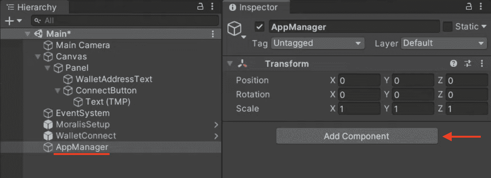

现在，如果您仔细查看实际代码，您会注意到一个字段部分。因此，我们需要添加每个字段/按钮，并将它们连接到我们的项目。要做到这一点，您只需将“道德设置”拖放到 Unity 的“道德控制器”字段，将“WalletConnect”拖放到“检查器”模块的“钱包连接”字段。之后，我们还将通过相同的过程将“ConnectButton”添加到“Connect Button”字段，并将“WalletAddressText”添加到“Wallet Address”字段。

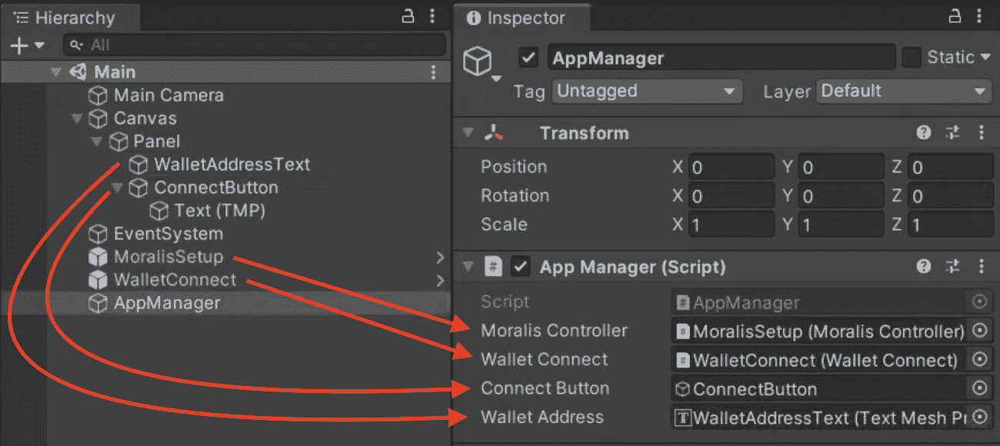

将字段连接到脚本后，我们还必须将“WalletConnectHandler()”函数添加到 Unity 中“WalletConnect”元素的“连接事件会话”中。因此，我们可以简单地将“AppManager”元素拖到“连接的事件会话”的“Missing (Object)”字段中。接下来，我们可以单击“无功能”下拉菜单，选择“WalletConnectHandler()”功能。

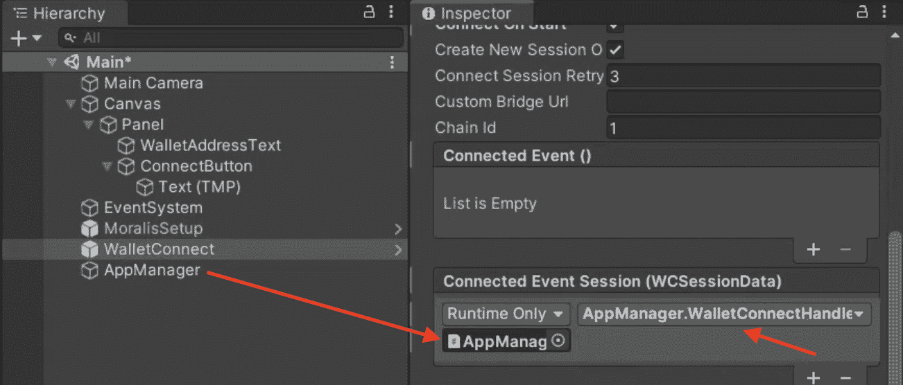

最后，第四步的最后一部分是向 Unity 应用程序添加“WalletConnectSessionEstablished()”函数。为此，我们可以添加一个“新会话连接”和一个“恢复会话连接”事件，通过上一段中描述的相同过程，调用“WalletConnectSessionEstablished()”。在 Unity 界面中会是这样的:

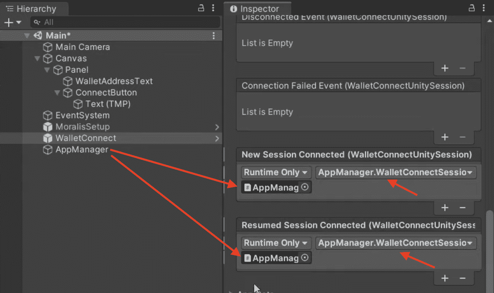

## 步骤 5:如何将加密钱包连接到移动 dApp–微调用户界面

在最后一步，我们将使用户界面更加友好。因此，您可以返回脚本并回到字段部分。您会注意到一个名为“infoText”的附加字段，我们还没有将它连接到我们的 Unity 场景，这是下一个议程。

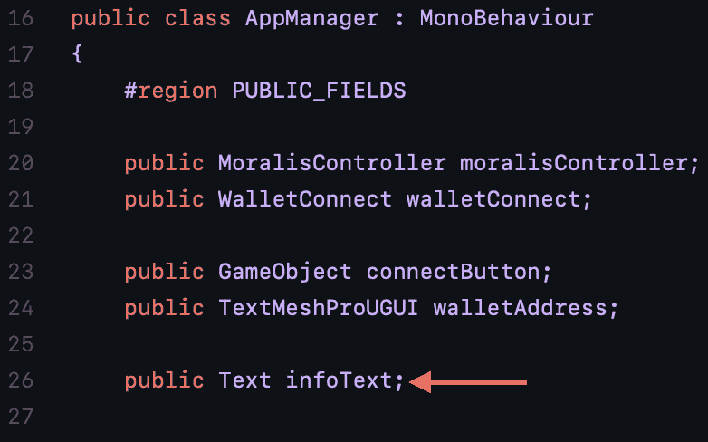

您可以返回 Unity，在“UI_Panel”中添加一个新文本(与“Panel”对象相同，只是名称不同)，并将其命名为“InfoText”。接下来，您可能需要做一些调整，以便元素适合您的应用程序的用户界面。然而，由于这可能会因您的偏好而有所不同，因此我们不会对此进行更深入的探讨。

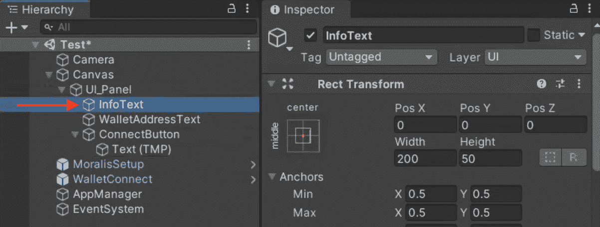

通过这个信息文本，我们希望显示一条消息，无论用户是否成功登录。此外，我们还希望通知用户他们的钱包是否成功连接，或者连接是否失败。为此，我们需要添加一个“Connected Event()”和一个“Disconnected Event()”来从脚本中调用“HandleWalletConnected()”和“HandleWalletDisconnected()”函数。因此，在 Unity 中会是这样的:

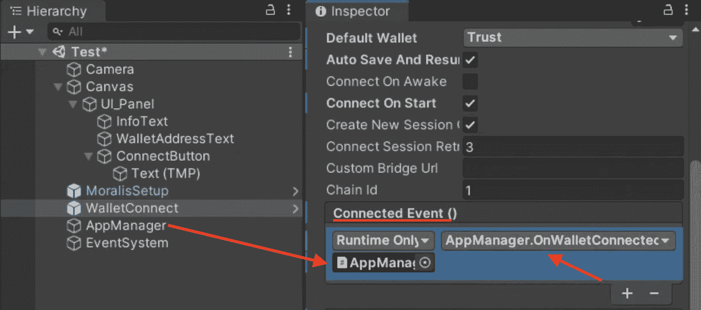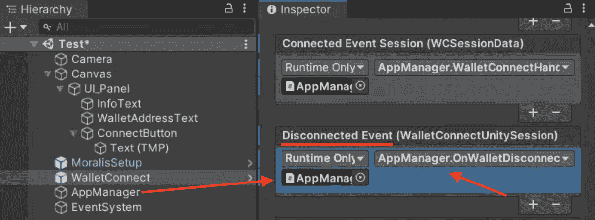

最后，我们需要做的最后一件事是将“InfoText”添加到我们的“AppManager”中，只需将该元素拖动到“Info Text”字段即可。

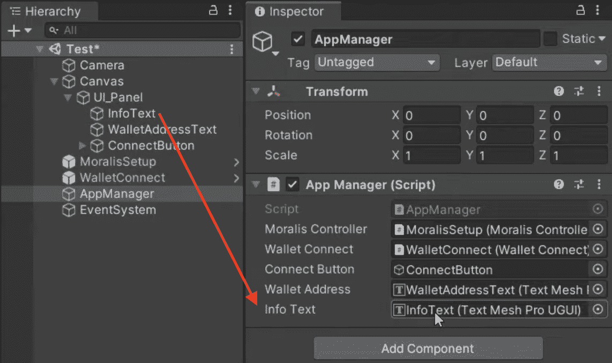

剩下的就是点击“构建设置”，添加场景，然后点击右下角的“构建并运行”按钮。这就是本教程的全部内容；如果你遵循了上面的五个步骤，你应该知道如何轻松地构建和连接一个 Unity 应用程序到一个 Web3 钱包！

此外，如果您想更仔细地查看整个代码和应用程序，您可以访问我们在本文开始部分链接的 GitHub 资源库。

## 如何将 Unity 应用程序连接到 Web3 钱包—摘要

使用 Moralis 操作系统时，将 Unity 应用程序连接到 Web3 钱包并不困难。Moralis 为您提供了已经开发的后端基础设施，使我们能够在几分钟内将加密钱包连接到移动 dApp。事实上，这可以通过以下五个步骤来实现:

1.  开发前端用户界面。
2.  设置 Moralis 服务器。
3.  配置 Web3 wallet 连接。
4.  添加应用管理器脚本。
5.  微调用户界面。

按照这个过程，您可以创建一个简单的演示应用程序，用户可以使用他们的 MetaMask wallet 进行身份验证并签署消息。因此，这清楚地表明了与道德家合作的力量。

此外，如果你对 Web3 开发有进一步的兴趣，那么可以去看看 Moralis 网站。访问该网站将允许您发现额外的开发工具，如 Moralis [NFT API](https://moralis.io/ultimate-nft-api-exploring-moralis-nft-api/) 、[价格 API](https://moralis.io/introducing-the-moralis-price-api/) 、系统对 [IPFS](https://moralis.io/what-is-ipfs-interplanetary-file-system/) 的原生支持等等。您还可以访问 [Moralis 博客](https://moralis.io/blog/)了解更多令人难以置信的内容，并阅读诸如“[如何创建 BNB 链令牌](https://moralis.io/how-to-create-a-bnb-chain-token-in-5-minutes/)”或“[如何创建 coinbase 克隆](https://moralis.io/cloning-coinbase-wallet-how-to-create-a-coinbase-clone/)”等主题的指南。

因此，如果你想成为一名更杰出的区块链开发者，现在就注册 Moralis ！创建一个帐户是免费的，它将帮助你在任何未来的 Web3 开发工作。