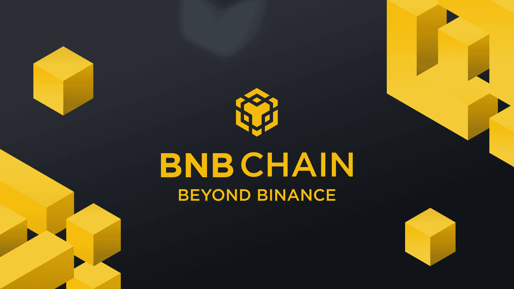
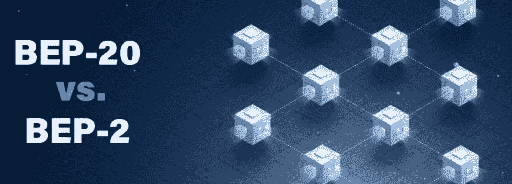
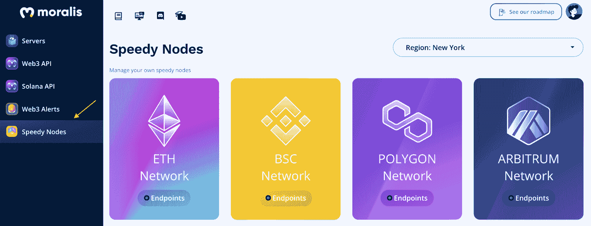
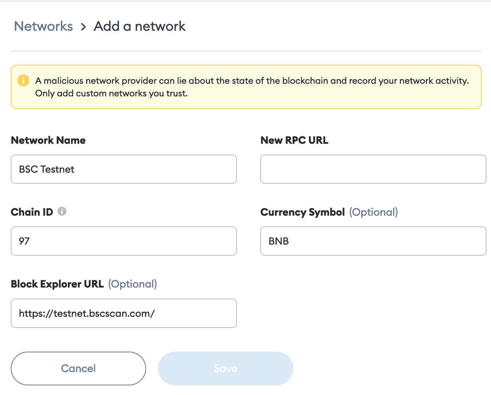
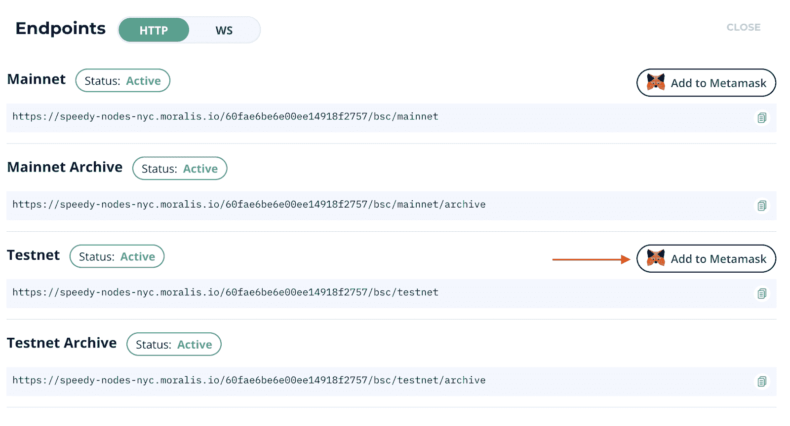
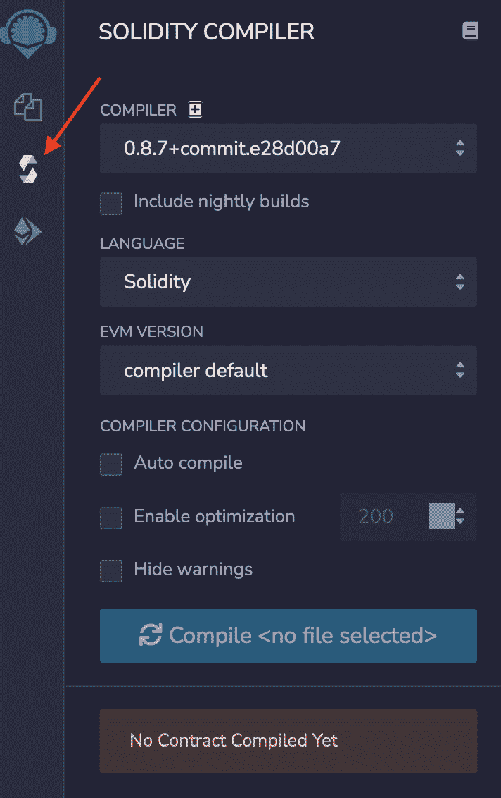
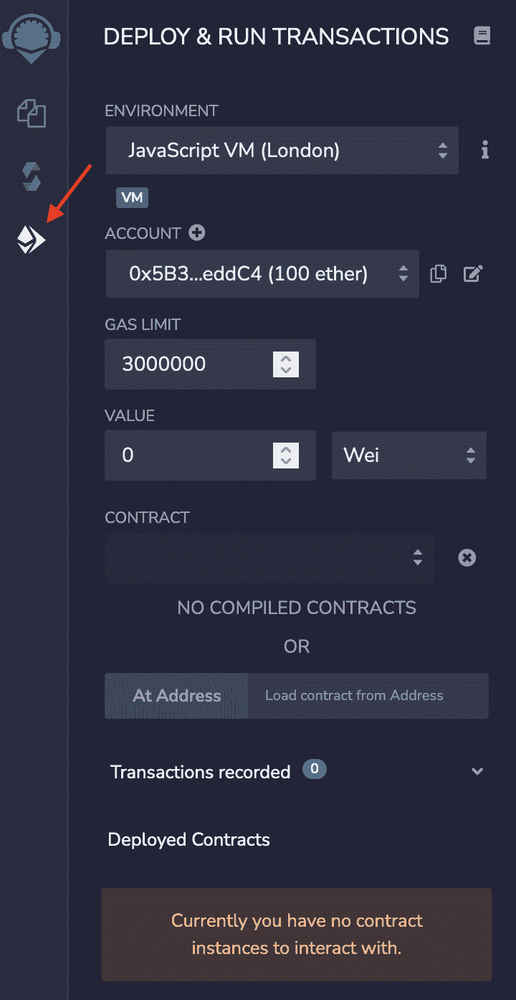
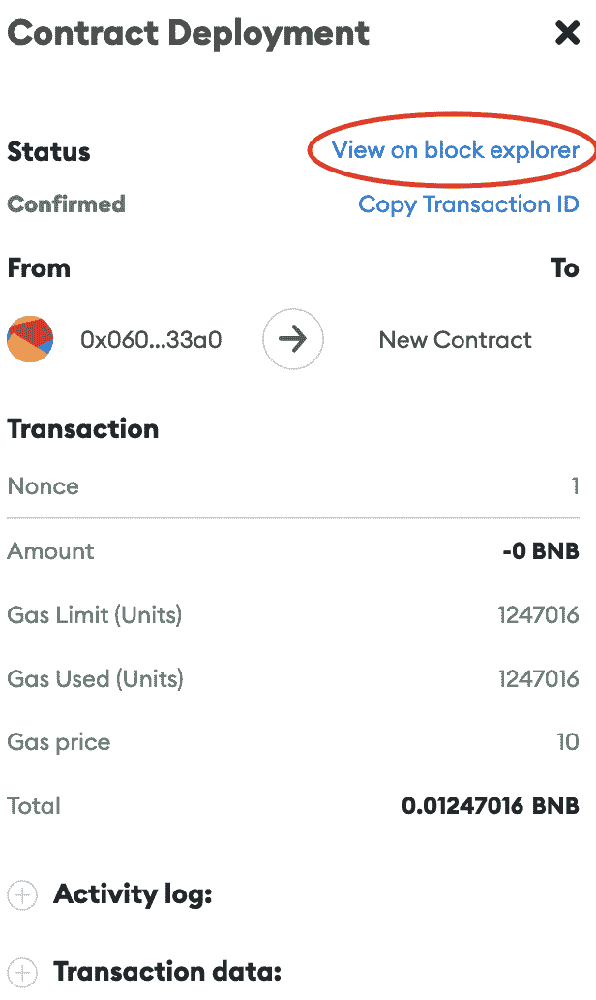

# 如何在 5 分钟内创建一个 BNB 链令牌

> 原文：<https://moralis.io/how-to-create-a-bnb-chain-token-in-5-minutes/>

**如果你熟悉 crypto 和**[**web 3**](https://moralis.io/the-ultimate-guide-to-web3-what-is-web3/)**space，你就知道币安的区块链网络曾经由两个独立的区块链组成:币安链和币安智能链(BSC)。然而，作为一个更大的生态系统的两个组成部分，币安最近发现是时候通过过渡和更名区块链到 BNB 链来强调区块链和 BNB 令牌之间的联系了。此外，重塑其区块链网络也有助于拉开 BNB 生态系统与币安品牌的距离，这一点我们稍后会谈到。为此，我们将在本文中进一步探索 BNB 链，并教你如何用**[**Moralis**](https://moralis.io/)**创建 BNB 链令牌。**

首先，我们将进一步了解币安连锁店，以及 BSC 最近更名为 BNB 连锁店。接下来，我们还将深入快速创建 BNB 链令牌的过程。事实上，在道德的帮助下，我们可以在几分钟内完成。token 开发的可访问性来源于系统提供的后端基础设施以及平台的一些必备开发工具，其中之一就是 [Moralis Speedy Nodes](https://moralis.io/speedy-nodes/) 。

Moralis 的快速节点服务提供了市场上最快、最可靠的区块链节点。此外，您不仅可以访问 BNB 链的节点，还可以访问其他类似的网络。因此，如果你有兴趣为其他网络开发令牌，请查看我们的指南[如何创建多边形令牌](https://moralis.io/how-to-create-a-polygon-token/)或[如何创建以太坊令牌](https://moralis.io/how-to-create-ethereum-tokens-in-4-steps/)。

所以，如果你想变得更加精通 Web3 开发，直接加入 Moralis 吧。如果你想[成为一名区块链开发者](https://moralis.io/how-to-become-a-blockchain-developer/)，这样做是最快最容易的途径！

### 什么是 BNB 链？

将币安的区块链网络更名为“BNB 链”的决定部分是为了突出生态系统的两个区块链和 BNB 令牌的互操作性，同时将其区块链网络与币安品牌拉开距离。这种转变背后的原因是 BNB 不仅仅是币安。BNB 代表“建设和建设”，它是 BNB 链的本土令牌。因此，token 和 BNB 连锁酒店是一个独立的生态系统，与币安不同。



这些区块链以前被称为币安链和币安智能链(BSC)。然而，随着向 BNB 连锁的过渡，币安连锁也过渡到了 BNB 灯塔连锁，BSC 过渡到了 BNB 智能连锁(仍缩写为“BSC”)。因此，BNB 链生态系统由两个独立的区块链组成。

两个区块链中的第一个是 BNB 信标链，在发射时被称为币安链。该链的主要目的是处理和验证 BNB 链生态系统内的分散交易。此外，他们设计了这个链条来承载生态系统的本地货币 BNB。然而，该链不具备促进智能合约的能力，智能合约之前限制了生态系统，并催生了 BSC。

BSC 与智能合同兼容，并与 BNB 灯塔连锁公司一起运营。因此，即使这些链是交织在一起的，它们仍然是分离的。这意味着他们有可能独立工作，例如，如果其中一个链离线。

在 BSC 上开发是一种相对类似于[以太坊](https://moralis.io/full-guide-what-is-ethereum/)区块链的体验。所以，如果你有以太坊的生态系统的经验，你将很有可能毫无困难地开发 BNB 智能链。这是因为 BSC 基本上利用了与以太坊相同的代码库，同时兼容 [EVM](https://moralis.io/evm-explained-what-is-ethereum-virtual-machine/) 。

### 什么是 BEP-20 代币？

随着对 BNB 链生态系统及其两个组成部分——BNB 信标链和 BSC——的更好理解，我们可以继续深入了解一下 [BEP-20](https://moralis.io/what-is-bep20-full-binance-smart-chain-token-guide/) 和 BEP-2 令牌标准。然而，在深入研究它们需要什么之前，我们首先需要理解为什么令牌标准需求存在。一旦我们这样做了，我们可以继续探索如何创建一个 BNB 链令牌。



在加密行业中，令牌是引人注目的功能，市场上有数千种不同的替代方案。因此，必须规范代币，确保它们具有相同的质量和特征。这提供了兼容性，意味着新令牌可以与现有的 dApps 和协议一起工作。因此，令牌标准是一种确保所有令牌实现最小接口的方法，使它们在一个完整的生态系统中兼容。

通过 BNB 链生态系统的“双链”架构实现的互操作性，原生 BNB 令牌推动了 BEP-20 和 BEP-2 令牌标准。那么，这两者到底有什么区别呢？

BEP-2 是 BNB 信标链的令牌标准；同时，BEP-20 管理 BSC 上的令牌。BEP-20 令牌标准经常与 ERC-20 进行比较，因为它们在许多方面非常相似。但是，必须知道它们是不同区块链的两个独立标准。事实上， [ERC-20](https://moralis.io/erc20-exploring-the-erc-20-token-standard/) 是以太坊区块链的标志标准。

因此，综上所述，在为 BNB 智能链创建加密货币令牌时，实施 BEP-20 令牌标准，而 BNB 信标链使用 BEP-2 标准。

## 如何在 BNB 链上创建令牌

创建一个 BNB 链令牌并不困难。事实上，有了 Moralis，我们可以在几分钟内完成。此外，你不必真的是一个开发者来创建一个 BNB 链令牌！因此，如果您有兴趣了解如何推出自己的令牌，那么请跟随我们的指导完成整个过程。

如果你有在以太网上创建代币的经验，你会对这个过程很熟悉。以太坊和 BNB 链令牌开发相对相似，因为您将使用相同的编程语言、工具和思维过程。因此，我们将利用 [Solidity](https://moralis.io/solidity-explained-what-is-solidity/) 作为编程语言。此外，我们将使用的工具是 Remix，这是一个 IDE(集成开发环境)，以及 [MetaMask](https://moralis.io/metamask-explained-what-is-metamask/) ，最大的加密货币钱包之一。

我们将把这个过程分成五个简单的步骤:

1.  寻找一个 OpenZeppelin 合同模板。
2.  创建合同文件。
3.  编写合同。
4.  编译令牌协定。
5.  部署合同。

由于这是一个关于如何创建 BNB 链令牌的教程，我们将为生态系统的 testnet 这样做。然而，如果你想在 BNB 连锁店的 mainnet 上推出一个代币，这个过程并没有太大的不同。

最后，如果你想看一个解释整个过程的视频，一定要看看这个来自 [Moralis YouTube](https://www.youtube.com/channel/UCgWS9Q3P5AxCWyQLT2kQhBw) 频道的视频:

https://www.youtube.com/watch?v=h4gQD7R1r94

## 如何创建 BNB 链令牌-先决条件

在学习如何创建 BNB 链令牌之前，我们需要注意几个先决条件。首先，我们需要创建一个元掩码帐户，因为这对我们与智能合约进行交互是必不可少的。除了收购 MetaMask 钱包，我们还必须将 BNB 链测试网络添加到我们的钱包中。最后，我们还将为 testnet 获取一些 BNB，这将允许我们支付向网络发送令牌的交易费用。所以，事不宜迟，让我们开始购买 MetaMask 钱包吧。


要获得你自己的 MetaMask 钱包，你首先需要访问他们的[官方网站](https://metamask.io/)并安装 MetaMask 作为你网络浏览器的扩展。有了扩展，你可以点击“开始”按钮，创建你的钱包。可以使用种子短语导入现有的钱包，也可以从头开始创建一个钱包。然而，这应该取决于您的偏好，所以我们不会进入任何进一步的设置过程的细节。

### 获取节点并更改元掩码网络

要将 BNB 链的 testnet 添加到您的元掩码钱包中，您首先需要的是一个区块链节点。获得节点的最快和最简单的方法是通过 Moralis。或者更具体地说，快速节点服务。此外，与道德快速节点，这是很容易访问区块链节点从几个不同的网络，如以太坊，BNB 链，多边形等。

因此，要获得 BNB 链节点，你将需要这个“如何创建 BNB 链令牌”教程，你需要做的第一件事是注册与道德。使用 Moralis 帐户，你可以登录并导航到管理面板最左边的“快速节点”标签。一旦你点击这个标签，一些不同的选择将出现，其中之一将是 BNB 连锁网络。要获取节点，您需要按“端点”按钮，这将为您提供 URL。这些 URL 是 BNB 链节点。



现在您已经有了自己的节点，有两种方法可以将网络添加到元掩码 wallet 中。您可以通过点击元掩码界面中的“添加网络”按钮来添加它。如果您选择这种替代方法，您将需要手动输入一些信息，它应该看起来像这样(新的 RPC URL 应该是快速的节点 URL):



第二种选择更加简单。您可能会注意到，当您单击“端点”按钮时，您可以选择单击“添加到元掩码”。你可以简单地点击这个按钮，它会提示你的 MetaMask 钱包，并自动添加 BNB 连锁网络。



### 获得一些 BNB 代币

随着 BNB 链测试网络添加到您的钱包，我们可以继续前进，并获得一些 BNB 代币。由于我们正在与测试网合作，我们可以通过水龙头免费获得测试网 BNB。所以，要得到 BNB，你可以访问下面的网站:

[https://testnet.binance.org/faucet-smart](https://testnet.binance.org/faucet-smart)

正如你在水龙头上看到的，你需要输入你的钱包地址。您将能够在元掩码界面的顶部找到您的地址。你可以复制这个地址，确保你选择了正确的网络，粘贴到水龙头，并点击“给我 BNB”按钮。这将需要几秒钟的时间，但你的 MetaMask 钱包中会立即收到一个 BNB。

## 如何创建 BNB 链令牌—创建令牌

现在，先决条件都已确定，是时候进入实际过程，学习如何创建 BNB 链令牌了。创建一个 BNB 链令牌是很容易的，因为这个过程非常类似于在以太网上启动一个 ERC-20 令牌。此外，由于我们使用的是成熟的令牌标准，如 BEP-20 和 ERC-20，因此大部分代码已经可供您使用。

但是，模板是通用的，可能需要做一些调整。尽管如此，让我们先来看看在哪里可以找到创建 BNB 链令牌的模板！

#### OpenZeppelin

去中心化和开源软件的一个主要便利是复制和粘贴代码的可能性，我们可以调整这些代码以适应我们的开发需求。因此，我们可以直接从 [OpenZeppelin](https://openzeppelin.com/) 获取令牌模板。


OpenZeppelin 是一个积累令牌标准的开源组织。此外，由于 BEP-20 标准本质上与以太坊的 ERC-20 令牌标准相同，因此可以利用 ERC-20 [模板](https://docs.openzeppelin.com/contracts/4.x/erc20)并进行一些调整以适应 BNB 链。因此，您可以在下一步创建合同时使用该模板。模板看起来是这样的:

```js
// contracts/GLDToken.sol
// SPDX-License-Identifier: MIT
pragma solidity ^0.8.0;

import "@openzeppelin/contracts/token/ERC20/ERC20.sol";

contract tokenName is ERC20 {
  constructor() ERC20("tokenName", "currencySymbol") {
// contracts/GLDToken.sol
// SPDX-License-Identifier: MIT
pragma solidity ^0.8.0;

import "@openzeppelin/contracts/token/ERC20/ERC20.sol";

contract GLDToken is ERC20 {
  constructor(uint256 initialSupply) ERC20("Gold", "GLD") {
    _mint(msg.sender, initialSupply);
  }
}
```

### 创建令牌合同

下一步是创建令牌契约本身。为此，我们将使用 Remix IDE。因此，让我们前往“[remix.ethereum.org](http://remix.ethereum.org/)”并创建一个新的合同文件。你需要做的就是右键点击界面左侧的“Contracts”文件夹，然后创建一个新文件。我们建议根据您将要称之为令牌的内容来命名契约。下一步是从 OpenZeppelin 复制模板代码，并将其粘贴到您的合同文件中。

### 编程您的 BNB 链令牌

一旦我们将代码粘贴到我们的合同中，我们需要做一些修改来定制合同以满足我们的需求。所以，让我们更深入地研究一下代码。这样做，我们将更接近我们的追求，学习如何创建一个 BNB 链令牌！

模板的第一行指定了我们在编译合同时将使用哪个版本的 Solidity，这被进一步称为“pragma 行”。代码的第二行是我们导入 OpenZeppelin 令牌契约的地方，这是我们的文件将继承的契约。

在这之后，我们实现契约本身，在模板的情况下，它被称为“GLDToken”。在这里，您可以根据自己的喜好自由定制合同。

在标记契约的花括号中，我们找到了两个构造函数。我们可以简单地删除第一个变量的“initialSupply”。第二个构造函数用于指定令牌的名称和符号。这意味着您可以自由地将它们更改为您喜欢的任何内容。

在构造函数后面的花括号中，有一个“_mint()”函数，用来铸造实际的标记。第一个参数“msg.sender”指定令牌发送到部署契约的 wallet 地址。第二个参数指定初始电源。此外，您还可以在这里删除变量“initialSupply”，并将其替换为“100 * (10 ** uint256(decimals()))”。这将铸造 100 枚代币，如果你想要更多，只需将“100”改为你想要的数字。

##### **合同示例**:

```js
// SPDX-License-Identifier: MIT
pragma solidity ^0.8.0;

// contracts/GLDToken.sol
// SPDX-License-Identifier: MIT
pragma solidity ^0.8.0;

import "@openzeppelin/contracts/token/ERC20/ERC20.sol";

contract tokenName is ERC20 {
  constructor() ERC20("tokenName", "currencySymbol") {
    _mint(msg.sender, 100 * (10 ** uint256(decimals())));
  }
}
```

### 编译令牌协定

随着 BEP-20 令牌[智能契约](https://moralis.io/smart-contracts-explained-what-are-smart-contracts/)的最终确定，下一步是编译契约。当我们选择使用 Remix 时，这个过程变得相对容易。要编译合同，你需要做的就是点击 Remix 界面左侧的“Solidity Compiler”标签。然后你需要选择正确的 Solidity 版本，它应该与合同中指定的版本相匹配，然后点击“编译”。



### 部署令牌协定

我们现在已经到达了探索的最后一步。因此，您可能已经意识到，当使用正确的工具时，创建 BNB 链令牌是非常容易的。那么，让我们看看我们的最后一步。

一旦契约编译成功，剩下的工作就是将契约部署到 BNB 链测试网。为此，您需要导航到“Solidity 编译器”下的“部署和运行事务”选项卡。在这里，你需要做一些选择。



首先，您需要确保您已经将环境设置为“Injected Web3 ”,并且您的元掩码网络是 BNB 链测试网。接下来，确保该帐户与您的元掩码具有相同的地址。最后，确保选择了正确的合同。如果是这样，您可以点击“部署”。

现在这就是如何创建 BNB 链令牌的过程！如果您跟随，您有希望能够开发、编译和部署您自己的 BNB 链令牌！在下一节中，我们将向您展示如何将令牌添加到元掩码钱包中。

## 如何创建 BNB 链令牌-查看 BNB 链令牌

将令牌合同部署到 BNB 链的 testnet 后，这个过程的最后一步是将令牌添加到我们的元掩码钱包中。交易完成后，您可以点击钱包中的“活动”标签。在那里你可以找到所有最新的交易。最后一笔交易应该是把你的合同部署到区块链。

如果您可以单击该交易，将会出现一个新窗口，显示有关该事件的各种详细信息。在这里，您可以通过点击“在块浏览器上查看”来访问“ [BscScan](https://testnet.bscscan.com/) ”网站。这会呈现一堆信息；但是，在这种情况下，我们感兴趣的是“交互对象”地址。您可以继续复制该地址，然后返回元掩码界面。



回到 MetaMask 后，您可以单击“Assets”选项卡，然后单击“Import Tokens”继续。这里你需要粘贴地址，剩下的信息应该会自动填写。现在只需点击“添加自定义令牌”，令牌就会添加到您的钱包中，并显示在“资产”选项卡下！

## 如何创建 BNB 链令牌——摘要

如果您遵循了本文中的指南，那么您现在应该很清楚如何使用 Moralis 操作系统在 BNB 链上启动令牌。此外，在 Moralis 的帮助下，我们能够通过几个先决条件和五个简单步骤创建 BNB 链令牌:

1.  寻找一个 OpenZeppelin 合同模板。
2.  创建合同文件。
3.  编写合同。
4.  编译令牌协定。
5.  部署合同。

更重要的是，你不需要任何开发经验来完成这个过程！因此，任何人都可以用道德创造一个 BNB 链令牌。

然而，如果你想了解更多关于 Web3 开发的知识，一定要看看 [Moralis 博客](https://moralis.io/blog/)。在这里你可以找到关于[如何构建 BSC dapp](https://moralis.io/how-to-build-bsc-dapps-easily/)、区块链开发的[最佳语言](https://moralis.io/best-languages-for-blockchain-development-full-tutorial/)以及[元宇宙](https://moralis.io/what-is-the-metaverse-full-guide/)的精彩文章。此外，您还可以从 Moralis 了解更多其他工具，如 [NFT API](https://moralis.io/ultimate-nft-api-exploring-moralis-nft-api/) 、[价格 API](https://moralis.io/introducing-the-moralis-price-api/) 、 [Web3UI 工具包](https://moralis.io/web3ui-kit-the-ultimate-web3-user-interface-kit/)等等！

所以，如果你有雄心将你的 Web3 开发游戏提升到一个新的水平，成为一名区块链开发者，[就和 Moralis](https://admin.moralis.io/register) 签约吧。创建一个帐户只需要几秒钟，你将获得该平台所有工具的全部访问权限！