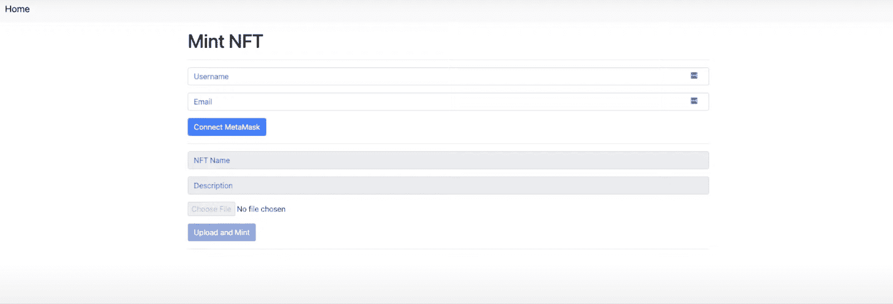

# 如何创建一个 ERC-721 NFT？

> 原文：<https://moralis.io/how-to-create-an-erc-721-nft/>

在本文中，我们将仔细研究如何创建一个 ERC-721 NFT。为此，我们将开发一款 NFT 造币 dApp。因此，如果您愿意，可以跳过教程，直接点击下面的 GitHub 库链接进入代码:

**全 NFT 明廷 dApp 文档——**[](https://github.com/DanielMoralisSamples/19_MINTNFT)

****NFT，或不可替代的代币，正在蓬勃发展，并日益成为一个普通人熟悉的概念。随着对这些令牌越来越关注，开发人员正在为 NFT 寻找创新和新的用例。NFT 目前用于游戏、数字所有权、虚拟世界、会员证明等领域。由于 NFT 已经成为 [Web3](https://moralis.io/the-ultimate-guide-to-web3-what-is-web3/) 最显著的特征之一，因此由令牌标准对其进行监管变得至关重要。此外，最流行的 NFT 令牌标准之一是 [ERC-721](https://moralis.io/erc-721-token-standard-how-to-transfer-erc721-tokens/) ，我们将在本文中深入探讨。因此，我们将仔细看看如何创建一个 ERC-721 NFT。****

****首先，我们将了解更多关于 ERC-721 令牌标准的内容，以便更深入地理解该标准所包含的内容。接下来，我们将进一步了解创建 ERC-721 NFT 的过程。为了实现这一点，我们将利用 [Moralis](https://moralis.io/) 操作系统来开发 ERC-721 NFT 铸币 [dApp](https://moralis.io/decentralized-applications-explained-what-are-dapps/) (分散应用)。****

****有了诸如 [Moralis 的 NFT API](https://moralis.io/ultimate-nft-api-exploring-moralis-nft-api/) 、[高速节点](https://moralis.io/speedy-nodes/)和系统的后端基础设施，我们将能够在几分钟内创建 dApp。因此，如果你想让[成为一名区块链开发商](https://moralis.io/how-to-become-a-blockchain-developer/)，现在就和 Moralis 签约吧，这样你就能为未来所有的区块链项目节省宝贵的时间！****

## ****什么是 ERC-721 非功能性测试？****

****代币是区块链行业的基本特征，通常分为两大类:可替代代币和不可替代代币( [NFTs](https://moralis.io/non-fungible-tokens-explained-what-are-nfts/) )。由于这些令牌是该领域的有力且重要的方面，因此某种形式的标准来规范它们是很重要的。这些标准(适用于 NFT 和可替换令牌)确保所有令牌在整个生态系统中兼容。****

****

为了说明这一点，我们将以[以太坊](https://moralis.io/full-guide-what-is-ethereum/)生态系统为例。在以太坊内， [ERC-20 令牌标准](https://moralis.io/erc20-exploring-the-erc-20-token-standard/)管理可替换的令牌；同时，ERC-721 标准在开发 NFTs 时被使用。此外，值得一提的是管理半可替代令牌的 [ERC-1155](https://moralis.io/erc1155-exploring-the-erc-1155-token-standard/) 令牌标准。这些不同的标准处理不同类型的令牌，确保所有兼容以太坊的令牌实现标准的最小接口，使它们在整个系统中兼容。

此外，ERC-20、ERC-721 和 ERC-1155 只是以太坊生态系统中监管标准的几个例子。其他系统有自己独特的标准，如 BNB 链的 BEP-20 或 BEP-2。

现在我们已经熟悉了一些最流行的标准，我们可以试着解释更多关于 ERC-721 NFTs 的内容。ERC-721 NFT 非常灵活，通常用于表示虚拟和物理资产的所有权。因此，它们有可能代表虚拟资产，如数字艺术、实物财产和负价值资产，如债务。

这表明 ERC-721 非功能性运输工具有许多使用案例，可用于几个经济部门。因此，了解它们的工作原理以及如何创建 ERC-721 令牌变得非常有趣。出于这个原因，在接下来的章节中，我们将指导您创建自己的 ERC-721 NFT。

## 如何创建 ERC-721 NFT

下面，我们将向您展示如何创建 ERC-721 NFT。然而，没有一种通用的方法来制造或铸造这些代币。事实上，有许多不同的方法，我们没有时间深入研究它们。我们将重点讨论如何通过利用 NFT 市场或使用 Moralis 创建 NFT 铸造 dApp 来创建 ERC-721 令牌。


第一种选择非常简单，因为您将使用像 OpenSea 或 Rarible 这样的知名 NFT 市场。因此，您不需要熟悉任何编码实践。然而，这也带来了一个缺点，因为您需要忽略这种工作方式的集中方面。

另一方面，如果你对去中心化方面感兴趣，精通一些 JavaScript，并了解 Web3 的基础知识，那么用 Moralis 创建一个 ERC-721 NFT 铸币 dApp 可能是更适合你的选择。

尽管如此，您选择哪一个选项并不重要，因为我们将带您了解这两个选项，以使这些过程尽可能易于理解。但事不宜迟，让我们先来看看如何利用一个已建立的 NFT 市场来创建一个 ERC-721 NFT！

## 如何在 OpenSea 上创建 ERC-721 NFT

第一种选择是使用著名的 NFT 市场创建 ERC-721 NFT。市场上有几个突出的选择，包括 SuperRare、Rarible，当然还有 OpenSea。

OpenSea 是最大的 NFT 市场，因此，我们将关注这个平台。如果您没有任何扎实的编码技能，并且希望轻松快速地创建一个 NFT，这是最好的选择。


因此，要使用 [OpenSea](https://opensea.io/) 创建 ERC-721 NFT，你需要做的第一件事就是访问他们的官方网站并点击“创建”按钮:


点击按钮后，OpenSea 会提示你连接钱包。它提供了各种选项；但是，我们建议使用元掩码，因为这是市场上最成熟的加密钱包。如果你对钱包不熟悉，一定要看看我们的文章，回答问题"[什么是元掩码？](https://moralis.io/metamask-explained-what-is-metamask/)”。

尽管如此，随着你的钱包连接，下一步是铸造你的 ERC-721 NFT。为此，您需要添加一个文件，并通过单击图像字段将其转换为 NFT。然而，这里您会注意到一些需要考虑的限制。你可以在网页上阅读更多关于规格的信息。

上传图片后，下一步是给你的 NFT 命名，也许添加描述，然后简单地点击页面底部的“创建”按钮，这将会创建你的 ERC-721 NFT。然而，重要的是要知道，以这种方式铸造 NFT 需要你支付汽油费。因此，有必要了解当前的汽油价格，因为它们可能非常昂贵。

## 如何创建一个 ERC-721 NFT 与道德

本文的这一部分将向您展示如何使用 Moralis 操作系统创建 ERC-721 NFT。与 OpenSea 不同，这将是一个更加分散的过程，您可以创建自己的 NFT 造币 dApp。为了让您了解我们的工作目标，这是 dApp 最终确定后的样子:



如果您是加密领域的新手，这可能看起来是一项令人生畏的任务。然而，由于你将与 Moralis 一起工作，你应该能够跟随很少或没有先前的 [Web3 开发](https://moralis.io/how-to-build-decentralized-apps-dapps-quickly-and-easily/)经验。不过，[扎实](https://moralis.io/solidity-explained-what-is-solidity/)和 [JavaScript](https://moralis.io/javascript-explained-what-is-javascript/) 的基础知识会有好处。

这是可能的，因为惊人的 [Moralis SDK](https://moralis.io/exploring-moralis-sdk-the-ultimate-web3-sdk/) (软件开发工具包)及其先进的 [Web3 API](https://docs.moralis.io/moralis-server/web3-sdk) 。此外，由于 Moralis 涵盖了所有繁琐的后端开发任务，您可以跳过大部分繁重的工作。因此，当与 Moralis 合作时，你可以在几分钟内创建一个 NFT 铸造 dApp。然而，为了使本教程更容易理解，我们将把这个过程分成以下三个步骤:

1.  初始化道德
2.  寻找智能合同
3.  创建 dApp

按照上述步骤，你将能够通过你的 NFT 铸造 dApp 轻松创建一个 ERC-721 NFT。然而，如果你想更深入地了解整个代码，请随意查看以下来自[道德 YouTube](https://www.youtube.com/c/moralisweb3) 频道的视频指南:

https://www.youtube.com/watch?v=WdQHnb_5m5Q

### 步骤 1:初始化道德

首先，你需要做的第一件事是创建一个道德账户。如果你还没有，你可以访问 Moralis 并完全免费注册！一旦你有了一个帐户，下一步就是创建你自己的道德服务器。你可以点击 Moralis 管理面板右上角的“+创建一个新服务器”并添加适当的信息。


本教程的剩余部分将围绕代码的一个简短突破，您可以在我们在简介中最初链接的 GitHub 资源库中找到它。从那里，您可以简单地克隆项目，并利用已经准备好的模板来创建您的 dApp。此外，如果您愿意，您可以定制代码，将您自己的想法添加到项目中。

一旦你有了自己的项目，你需要初始化 Moralis。为此，您将通过单击“查看详细信息”按钮从您的服务器获取服务器 URL 和应用程序 ID。然后，您可以通过填充" [logic.js](https://github.com/DanielMoralisSamples/19_MINTNFT/blob/master/app/static/js/logic.js) "文件并以下列方式实现 URL 和 ID 来继续操作:

```js
*moralis . initialize(" ")；//来自 moralis.io 的应用程序 ID*

```
Moralis.serverURL = ""; // Server URL from moralis.io
```js

步骤 2:寻找智能合同dApp 的另一个重要组成部分是智能合同。可以从头开始创建合同，也可以利用现有的合同。为了使这一过程更容易，我们决定为本教程提供一个已经准备好的智能合同。因此，有可能避免找到一个或编写自己的契约的繁琐任务。然而，如果你对创建[智能合同](https://moralis.io/smart-contracts-explained-what-are-smart-contracts/)感兴趣，请查看我们关于[如何创建智能合同](https://moralis.io/how-to-create-smart-contracts/)的指南。要实现协定，您需要在“logic.js”文件的代码的以下部分中，在引号之间输入协定地址:

```
const nft_contract_address = ""
/*
Available deployed contracts
Ethereum Rinkeby 0x0Fb6EF3505b9c52Ed39595433a21aF9B5FCc4431
Polygon Mumbai 0x351bbee7C6E9268A1BF741B098448477E08A0a53
BSC Testnet 0x88624DD1c725C6A95E223170fa99ddB22E1C6DDD
*/
```js

此外，如果您愿意，您可以在 GitHub 资源库中找到合同的代码。您可以点击下面的文件来仔细查看整个智能合约:" [nft_base.sol](https://github.com/DanielMoralisSamples/19_MINTNFT/blob/master/contract_base/contracts/nft_base.sol) "步骤 3:创建 dApp接下来，我们将仔细查看“logic.js”文件，dApp 的大部分基本代码都是在这个文件中分配的。更重要的是，我们将把注意力放在三个主要函数上:“login()”、“upload()”和“mintToken(_uri)”。然而，在深入研究这些函数之前，另一个重要的文件是“[index.html](https://github.com/DanielMoralisSamples/19_MINTNFT/blob/master/app/templates/index.html)”，我们需要提到它。这个文件包含了所有用于构建 dApp 内容的 HTML 代码。在这里您可以找到字段和按钮的代码。我们不会更详细地研究这个文件，因为 dApp 应该如何构造取决于您，这应该基于您的偏好。因此，让我们回到“logic.js ”,更仔细地看看“login()”函数。登录()三个主要函数中的第一个是“login()”，它允许用户使用元掩码验证自己。因此，一旦用户输入他们的用户名和电子邮件地址，他们就可以单击 UI 中的“连接元掩码”按钮进行身份验证。这是完整的功能:

```
async function login(){
  document.getElementById('submit').setAttribute("disabled", null);
  document.getElementById('username').setAttribute("disabled", null);
  document.getElementById('useremail').setAttribute("disabled", null);
  Moralis.Web3.authenticate().then(function (user) {
      user.set("name",document.getElementById('username').value);
      user.set("email",document.getElementById('useremail').value);
      user.save();
      document.getElementById("upload").removeAttribute("disabled");
      document.getElementById("file").removeAttribute("disabled");
      document.getElementById("name").removeAttribute("disabled");
      document.getElementById("description").removeAttribute("disabled");
  })
}
```js

上传()第二个功能是“upload()”，它确保输入到 dApp 中的文件用于创建一个 Moralis 对象，该对象又通过“上传”到 [IPFS](https://moralis.io/what-is-ipfs-interplanetary-file-system/) 。saveIPFS()" Moralis 函数。该对象的 URI 随后被用来创建一个元数据道德对象，这个元数据道德对象以 [JSON](https://moralis.io/json-explained-what-is-json-javascript-object-notation/) 格式被再次上传到 IPFS。最后，在调用“mintToken(_uri)”函数时，对象的 URI 作为参数传递。

```
async function upload(){
  const fileInput = document.getElementById("file");
  const data = fileInput.files[0];
  const imageFile = new Moralis.File(data.name, data);
  document.getElementById('upload').setAttribute("disabled", null);
  document.getElementById('file').setAttribute("disabled", null);
  document.getElementById('name').setAttribute("disabled", null);
  document.getElementById('description').setAttribute("disabled", null);
  await imageFile.saveIPFS();
  const imageURI = imageFile.ipfs();
  const metadata = {
    "name":document.getElementById("name").value,
    "description":document.getElementById("description").value,
    "image":imageURI
  }
  const metadataFile = new Moralis.File("metadata.json", {base64 : btoa(JSON.stringify(metadata))});
  await metadataFile.saveIPFS();
  const metadataURI = metadataFile.ipfs();
  const txt = await mintToken(metadataURI).then(notify)
}
```js

mintToken(_uri)最后一个函数是“mintToken(_uri)”，它实质上是铸造 ERC-721 NFT。该函数创建一个包含编码函数调用的新对象。然后将它与其他参数一起添加到“transactionParameters”对象中。然后，函数的最后一部分将事务发送到区块链，铸造令牌，并返回一个事务 ID 以确认 ERC-721 令牌已成功创建。因此，这是整个函数:

```
async function mintToken(_uri){
  const encodedFunction = web3.eth.abi.encodeFunctionCall({
    name: "mintToken",
    type: "function",
    inputs: [{
      type: 'string',
      name: 'tokenURI'
      }]
  }, [_uri]);

  const transactionParameters = {
    to: nft_contract_address,
    from: ethereum.selectedAddress,
    data: encodedFunction
  };
  const txt = await ethereum.request({
    method: 'eth_sendTransaction',
    params: [transactionParameters]
  });
  return txt
}
```js

现在就是这样！通过遵循本教程的三个步骤，你将能够通过你的 NFT minting dApp 连续创建 ERC-721 NFT。然而，如果你想更详细地了解整个代码，请向上滚动，仔细看看我们在文章前面链接的视频。这将为你提供大部分问题的答案。如何创建 ERC-721 NFT-总结这篇文章证明了通过使用已建立的 NFT 市场(如 OpenSea)或使用 Moralis 操作系统创建 NFT minting dApp 来创建 ERC-721 NFT 是可能的。我们将创建 dApp 的过程分为以下三个步骤: 1.  初始化道德 2.  寻找智能合同 3.  创建 dApp遵循这三个步骤，我们可以在几分钟内轻松地创建一个 NFT 造币厂 dApp。大多数可访问性源自 Moralis 的后端基础设施和操作系统的 SDK。因此，我们能够避免大多数复杂的后端开发，减轻我们的大部分工作量，让我们专注于应用程序的前端/UI。此外，如果你有兴趣学习更多关于 Web3 UI 开发的知识，一定要阅读我们关于 Moralis 的文章。然而，这只是 Moralis 为您提供更容易理解的区块链开发过程的众多实例之一。如果你想了解更多关于道德家的能力，请访问[道德家博客](https://moralis.io/blog/)。在这里你可以找到更多的文章，例如，[如何创建自己的 ERC-20 令牌](https://moralis.io/how-to-create-your-own-erc-20-token-in-10-minutes/)或[如何创建 BNB 链令牌](https://moralis.io/how-to-create-a-bnb-chain-token-in-5-minutes/)。所以，如果你想加速你的 Web3 开发之旅，[现在就注册 Moralis](https://admin.moralis.io/register) ！创建一个账户是免费的，你可以立即利用该平台的有用工具。    

```****