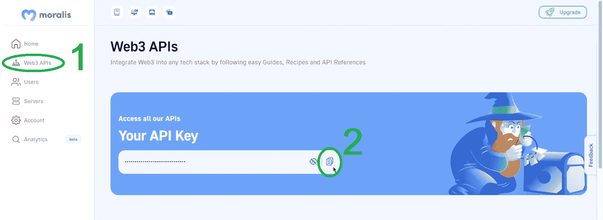
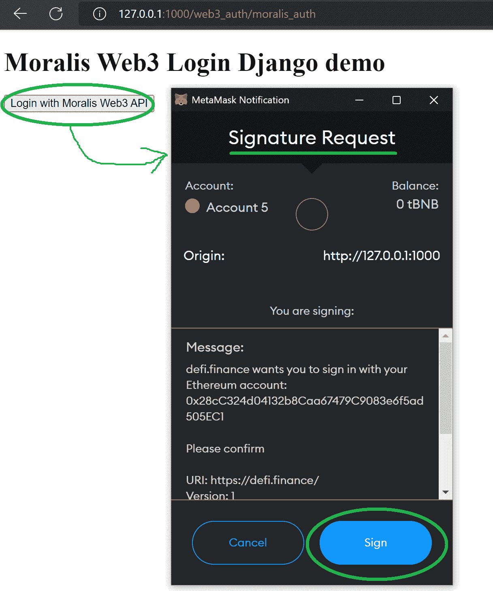
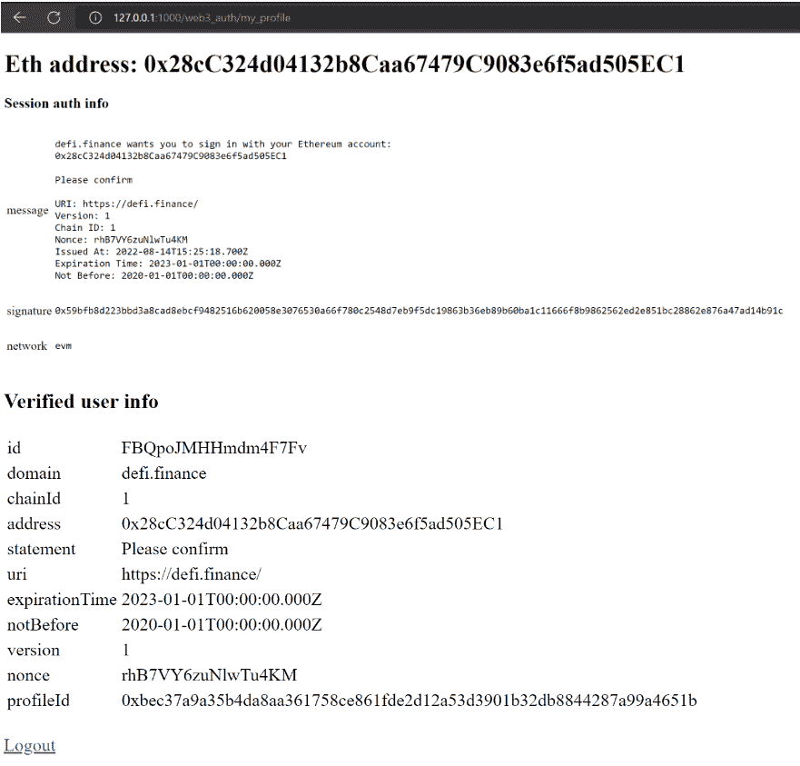
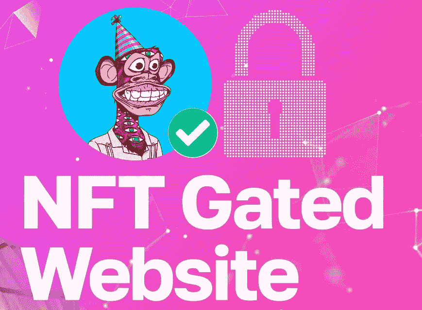
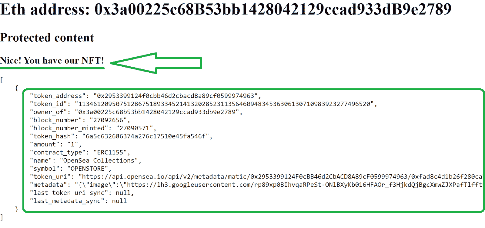
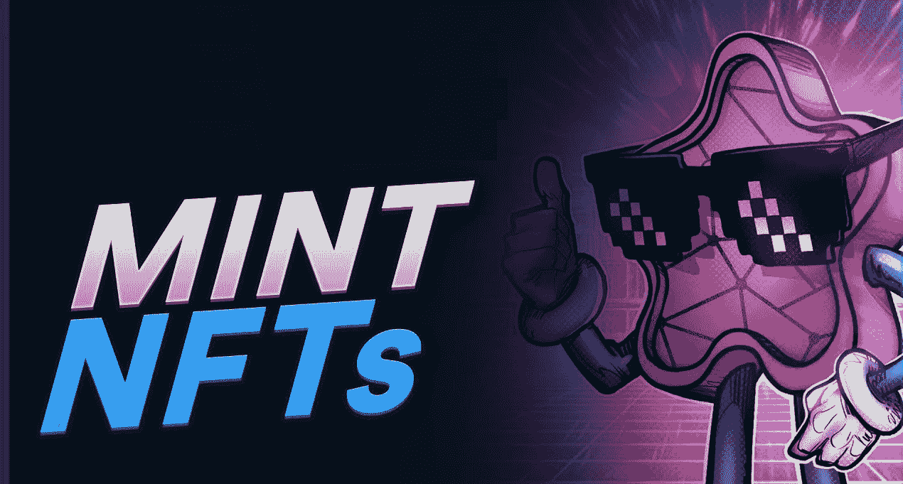

# 如何在姜戈创建一个 NFT 门控网站

> 原文：<https://moralis.io/how-to-create-an-nft-gated-website-in-django/>

NFT 彻底改变了所有权、票务、认证等。此外，原创者只能向持有特定 NFT(不可替换令牌)的人授予对网站内容的访问权。这种利用 NFTs 作为验证的“门控”网站或特定页面是开发人员在寻求采用区块链技术的网站中实施的独特验证方法之一。此外，如果你是一个开发者，想学习如何在 Django 创建一个 NFT 门控网站，那么这篇文章将非常有益。事实上，通过 Moralis SDK，在 Django 创建一个 NFT 门户网站变得非常简单。

如果你熟悉[最好的 Web3 技术栈](https://moralis.io/exploring-the-web3-tech-stack-full-guide/)，你就会知道 Moralis 是最终的 Web3 API 提供商。它为您提供了[企业级 web 3 API](http://moralis.io/)，包括 Moralis NFT API。此外，Moralis 完全是关于跨平台的互操作性。因此，您可以使用各种 Web2 开发平台和编程语言来加入 Web3 革命。此外，当用 Moralis 在 Django 创建 NFT 门控网站时，您可以专注于多个可编程链。毕竟，Moralis 也是跨链互通的。因此，你永远不会被任何特定的链所束缚，这保证了你的 dapps 经得起未来的考验。

因此，如果你渴望学习如何在姜戈创建一个 NFT 门户网站，[创建你的免费道德账户](https://admin.moralis.io/register)并跟随我们的领导。然而，在我们卷起袖子接受今天的挑战之前，让我们确保你们都知道 Django 是什么。


## 姜戈是什么？

Django 是一个免费的、开源的、基于 Python 的高级 web 框架。它遵循“模型-模板-视图”(MTV)架构模式，这个 web 框架鼓励快速开发和干净、实用的设计。此外，Django 旨在帮助开发者尽可能快地将应用从概念变为现实。此外，Django 非常安全。因此，它允许开发人员避免许多常见的安全错误。此外，该框架可以快速灵活地扩展。尽管如此，Django 软件基金会维护着 Django，该基金会是一个总部设在美国的独立 501 非盈利组织。


此外，要了解 Django 的更多信息，请访问 Django 的官方网站(“djangoproject.com”)。在这里，您可以浏览 Django 文档，探索如何开始使用这个基于 Python 的 web 框架。


## 创建一个 NFT 门控网站在姜戈与道德

今天的教程将教你如何只向拥有特定 NFTs 的认证用户显示受限页面的内容。因此，你需要一个包含 [Web3 认证](https://moralis.io/authentication/)的网站。如果您过去没有完成这一部分，请随意跳到“*在 Django* 的网站中添加 NFT 门控功能”部分。另一方面，请务必访问[道德文件](https://docs.moralis.io/docs/python-django-web3-auth)。在那里，您将学习如何向 Django 应用程序添加安全的 Web3 身份验证。本质上，您将学习创建一个全栈 Web3 身份验证流。此外，覆盖这一部分是在 Django 创建 NFT 门户网站的先决条件。

当然，使用我们的[最终代码](https://github.com/MoralisWeb3/demo-apps/tree/main/django_moralis_auth)模板可以节省很多时间，它在 GitHub 上等着你。为了简单地对你的 Django 应用程序实现 Web3 认证，你需要你的 Moralis 帐户。因此，如果您还没有这样做，请点击简介中的“创建您的免费道德账户”链接或访问道德的主页。您还需要安装 Python v3。尽管如此，一定要使用 Django 文档来获得 Django 基础知识。

Moralis 文档中的上述链接页面将指导您完成这个项目所需的所有步骤。首先，您将安装所有必需的依赖项。然后，您将创建一个新的 Django 项目(" *moralis_auth* ")和一个新的 Django 应用程序(" *web3_auth* ")。您还将学习如何运行数据库迁移，以及如何创建“超级用户”。接下来，您需要编辑“ *moralis_auth* ”项目设置。您可以通过将“ *web3_auth* ”添加到“ *settings.py* ”中已安装应用程序的列表中来实现这一点:


此外，你需要在新项目中包含新创建的应用程序的 URL:


最后，您将通过使用“ *urls.py* ”、“ *views.py* ”和模板来创建您的主“ *web3_auth* ”应用程序。

### 获取您的 Moralis Web3 API 密钥

“ *views.py* ”脚本的主要部分是“ *API_KEY* ”行代码。这是您需要粘贴 Moralis Web3 API 密钥的地方，使您能够使用 Moralis 的力量。幸运的是，一旦你进入了 Moralis 管理区域，获得这个密钥是非常简单的。您可以使用您的 Moralis 帐户凭证访问后者。然后，获得您的 Moralis Web3 API 密钥只需点击两下:



### 运行您的 Django Dapp

通过设置 API 键并创建“*login.html*和“*profile.html*”模板，您就可以开始运行 dapp 了。如果您已经遵循了 Moralis 文档，您应该能够在本地服务器上查看您的 dapp。它应该是这样的:


正如你在上面的图片中看到的，我们关注的是功能而不是设计。然而，我们鼓励你创建一个更吸引眼球的用户界面。此外，在您点击“使用 Moralis Web3 API 登录”按钮后，您的元掩码将弹出，要求您签署签名请求:



签署上述签名请求后，您将看到完整的个人资料页面:



当然，以上所有的细节都应该与你的 Web3 钱包的细节相匹配。

现在你知道了如何在 Django 中使用 Moralis Auth API，是时候我们把注意力集中在把上面的 dapp 转换成一个 NFT 门控网站了。



## 在 Django 网站上添加 NFT 门控功能

我们将向你展示如何创建一个基于上述 dapp 的 Django 门控网站。因此，确保你已经涵盖了这一部分。然后，您需要打开“ *views.py* 文件并添加一个新视图。跟随我们的脚步，将新的景观命名为“*保护区*”。下面是您需要添加到“ *views.py* ”的几行代码:

```js
def protected(request):
    eth_address = request.session.get(
        'verified_data', {}).get('address', None)
    nfts = []
    # this is the opensea contract address on polygon
    CONTRACT_ADDRESS = "0x2953399124f0cbb46d2cbacd8a89cf0599974963"
    WEB3_API_URL = 'https://deep-index.moralis.io/api/v2'
    REQUEST_URL = '%s/%s/nft?chain=polygon&token_addresses=%s' % (
        WEB3_API_URL,
        eth_address,
        CONTRACT_ADDRESS
        )

    x = requests.get(
        REQUEST_URL,
        headers={'X-API-KEY': API_KEY})
    print(json.loads(x.text))
    nfts = json.loads(x.text)['result']
    # show only 1 nft
    if nfts:
        nfts = json.dumps([nfts[0]], indent=4)
    print(eth_address)
    print(nfts)
    return render(
        request, 'protected.html',
        {'nfts': nfts})
```

如前所述，Moralis 支持多区块链。然而，正如你在上面的代码中看到的，我们决定把重点放在多边形链上。此外，查看上面的代码行，您可以看到“ *protected* ”视图从当前会话的用户提取地址。这样做之后，它发出一个 Web3 API 请求，以获取与该钱包地址的特定合同地址相关联的 NFTs。

### 创建“*protected.html*”模板

要在 Django 创建 NFT 门户网站，您必须添加一个新模板。因此，跟随我们的领导，添加一个名为“*protected.html*”的模板。然后用下面几行代码填充该模板:

```js
<!DOCTYPE html>
<html lang="en">
<head>
    <meta charset="UTF-8">
    <meta http-equiv="X-UA-Compatible" content="IE=edge">
    <meta name="viewport" content="width=device-width, initial-scale=1.0">
    <title>Moralis Django NFT Gated Demo Page</title>
</head>
<body>
    <div>

    
        <h1>Eth address: {{ user.username }}</h1>
        <h2>Protected content</h2>
        
          <h3>Nice! You have our NFT!</h3>
          <pre>
{{ nfts }}
          </pre>
        
          <h3>Sorry, you don't have our NFT!</h3>
        
        <br/>
        <a href="?next=">Logout</a>
    
        <a href=""> Login page </a>
    
    </div>

</body>
</html>
```

查看上面的代码行，您可以看到这个模板使用了" *if* "函数来提供两个不同的标题。如果用户有一个合适的 NFT，我们的 dapp 显示“*好看！你有我们的 NFT！*“航向。但是，如果用户没有所需的 NFT，我们的 dapp 会显示“*对不起，您没有我们的 NFT！*”标题。此外，当用户需要 NFT 时，我们的 dapp 还会显示 NFT 的详细信息。当我们看由 Django 和 Moralis 创建的 NFT 门户网站的演示时，你会看到这一点。

然而，在运行我们的示例 dapp 的实例之前，您还需要将下面一行代码添加到" *urls.py* "脚本中:

```js
path('protected', views.protected, name='protected'),
```

如您所见，上面的代码行只是一个到“*受保护的*视图的路径。

## 我们的例子 NFT 门控网站在姜戈-演示

将上述代码行添加到“ *views.py* ”和“ *urls.py* ”中，并准备好新模板，您就可以运行我们的示例 dapp 的实例了。当然，您的 dapp 的实际显示将取决于您是否拥有您按要求设置的 NFT(NFT 合同地址)。所以，如果你没有自己所需的 NFT，你会看到上表的*对不起，你没有我们的 NFT！*"标题:


另一方面，如果您拥有所需的 NFT，您将可以看到封闭内容:



### 进一步了解 NFT 门控网站

你可以想象，有无数的使用 NFT 门控网站的案例。最基本的例子包括向所需 NFTs 的所有者提供特定的内容。然而，你可以更进一步，允许普通用户访问禁止访问的 Web3 游戏或 dapps。此外，NFT 门控网站也可以用于在线活动，收集奖励，参加秘密在线聚会，等等。因此，你可以提供在姜戈为各种 NFT 项目创建一个 NFT 门控网站。

另一方面，你也可以创建自己的 NFT 项目。在这种情况下，你需要决定你想关注哪种非功能性测试。如果你决定用艺术形象来表现非艺术电影，你可以很容易地将这部分外包出去。或者，你可以和一个数码艺术家或者一个熟练的设计师合作。然而，就创建 NFTs 的技术部分而言，您的开发技能将会派上用场。您可能会惊讶，创建 NFT 并不那么困难。当然，这涉及到与[智能合同](https://moralis.io/smart-contracts-explained-what-are-smart-contracts/)的合作，但是你不必成为制造 NFT 的可靠性专家。多亏了一些优秀的工具，如 Remix、Hardhat 和 OpenZeppelin，您可以毫不费力地部署智能合约。尽管如此，你也可以专注于索拉纳区块链，在这种情况下，你可以使用 Metaplex 的 NFT 糖果机。



要了解更多关于在 EVM 兼容链或 Solana 上创建 NFT 的信息，请务必访问 [Moralis 博客](https://moralis.io/blog/)。在那里，你可以找到解释所有你需要知道的关于 NFTs 和 NFT 铸币的文章。当然，这也是找到如何创建不同标准的 NFT 的详细分步教程的地方。

## 如何在 Django 创建 NFT 门户网站-摘要

在今天的文章中，你有机会学习如何在 Django 创建一个 NFT 门控网站。我们首先确保你们都知道姜戈是什么。然后我们着重于创建一个简单的带有 Web3 身份验证的 Django 应用程序。此外，这也是我们对所需步骤进行适当概述的地方。然而，要了解更多细节，您需要使用 Moralis 文档。一旦你有了自己的 Django dapp 实例，你只需要调整" *views.py* "和" *urls.py* "脚本。此外，您还需要创建“【protected.html】”模板。一旦你在 Django 创建了你的 NFT 门户网站，你很有可能会尝试一下。最后但同样重要的是，我们还讨论了如何将 NFT 门控网站提升到一个新的水平。在其他有用的提示中，这是你发现如何制造 NFT 的地方。

如上所述，Moralis 博客是了解 NFT 公用事业和 NTF 发展的好地方。此外，这也是您可以探索 Web3 开发的其他方面的地方。结合 [Moralis YouTube 频道](https://www.youtube.com/c/MoralisWeb3)和 Moralis 文档，这些途径可以帮助你免费成为 Web3 开发者。然而，Web3 的开发不仅仅是在 Django 创建一个 NFT 门户网站。此外，由于 Moralis，您可以使用任何流行的遗留开发平台，毫不费力地创建一个杀手级 dapp。

同样值得指出的是，加密领域提供了无数的工作机会。因此，对全职加密感兴趣的人有很高的需求。然而，在寻求一个密码职业之前，你需要知道一些关于 Web3 和区块链理工大学的事情。这就是获得区块链道德学院认证可以帮助你更上一层楼的地方。