# 如何创建自己的元宇宙

> 原文：<https://moralis.io/how-to-create-your-own-metaverse/>

元宇宙激起了全球用户和大型科技公司的兴趣。因此，我们意识到 Web2 互联网时代正在过去，一个新时代的崛起正在逼近——[**【元宇宙】**](https://moralis.io/what-is-the-metaverse-full-guide/) **。随着元宇宙和 Web3 领域的出现，现在是时候深入这个新领域，学习如何创建自己的元宇宙了。会不会是你的虚拟景观吸引大众？谁知道我们每个人的未来会怎样，但有一件事是肯定的，命运偏爱勇敢的人！因此，我们强烈鼓励任何渴望成为区块链开发者的人跟随这篇文章，我们将向你展示如何创建你自己的元宇宙。**

当然，您可能已经猜到，创建元宇宙是一项高级任务。然而，这比你想象的要简单得多。当你使用正确的 [Web3 技术栈](https://moralis.io/exploring-the-web3-tech-stack-full-guide/)时，你可以用你的 [JavaScript](https://moralis.io/javascript-explained-what-is-javascript/) 或 Unity 技能创建你自己的元宇宙。此外，当使用 [Moralis SDK](https://moralis.io/exploring-moralis-sdk-the-ultimate-web3-sdk/) 时，您可以专注于前端，而这个“ [Firebase for crypto](https://moralis.io/firebase-for-crypto-the-best-blockchain-firebase-alternative/) ”平台涵盖了您的后端。同样，当使用最好的 Web3 后端平台时，你将节省大量的时间和资源。多亏了 [Moralis 的文档](https://docs.moralis.io/)，你可以轻松地复制并粘贴简短的代码片段来覆盖 [Web3](https://moralis.io/the-ultimate-guide-to-web3-what-is-web3/) 的功能。最重要的是，由于 [Moralis](https://moralis.io/) 完全是关于跨链和跨平台的互操作性，所以您有广泛的选择。因此，[创建你的免费道德账户](https://admin.moralis.io/register)并加入我们来处理我们的示例项目。


## 什么是元宇宙？

在我们向你展示如何创建你自己的元宇宙之前，我们需要了解一些基础知识。那么，什么是元宇宙呢？从最广泛的定义来看，元宇宙是一个人们可以通过电子设备访问的虚拟世界。当然，最先进的元宇宙将使完全沉浸，包括几个，如果不是所有的五个感官(想想准备好的玩家一)。然而，这项技术还不能让我们体验这种沉浸感。“元宇宙”一词目前主要集中在基于区块链技术的各种在线项目上。后者引入了非常受欢迎的权力下放方面。因此，它有能力让数字平台抵制审查。此外，它使用户能够真正拥有虚拟资产，他们可以自由交易。此外，总部位于区块链的 metaverses 还融入了数字经济(加密货币)，这有其自身的吸引力。

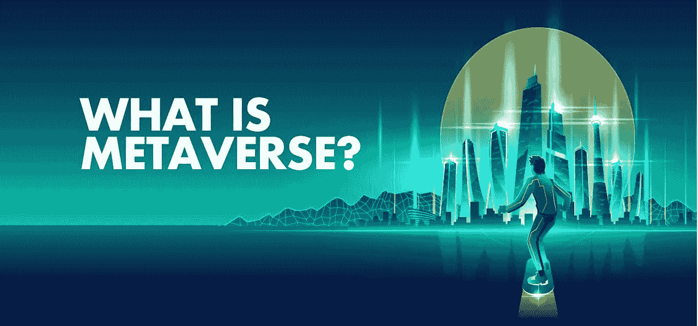

也就是说，基本上所有的 Web3 游戏( [GameFi 和 play-to-earn【P2E】](https://moralis.io/what-is-gamefi-and-play-to-earn-p2e/))都以这样或那样的方式被认为是 [Web3 元宇宙](https://moralis.io/web3-metaverse-how-do-web3-and-the-metaverse-fit-together/)。利用 NFTs 并允许用户在链上进行社交互动的平台也是如此。因此，并不是所有的元诗句都是 3D 的。因此，我们将创建一个简单的 2D 元宇宙前进。尽管如此，如果你想深入元宇宙，请阅读我们的“[什么是元宇宙？](https://moralis.io/what-is-the-metaverse-full-guide/)“文章！

## 创建您自己的元宇宙-示例项目

在我们卷起袖子开始编码之前，我们将看一下我们的元宇宙例子的演示。因此，你会对未来有一个清晰的认识。这也将有助于你决定是否要创建自己的这种元宇宙。演示结束后，我们将重点关注地图。后者是我们虚拟世界的一个非常重要的部分，也是我们元宇宙例子的核心。我们的下一步将是动画我们的地图，这将是我们探索的最广泛的一部分。成功制作地图动画后，我们将向您展示如何获取地块数据。接下来，我们将看看我们的智能合同。最后，我们将完成区块链整合，这是道德会使事情简单得多。

## 创建您自己的元宇宙–演示

既然一图胜千言，那就来看看我们元宇宙的截图吧:

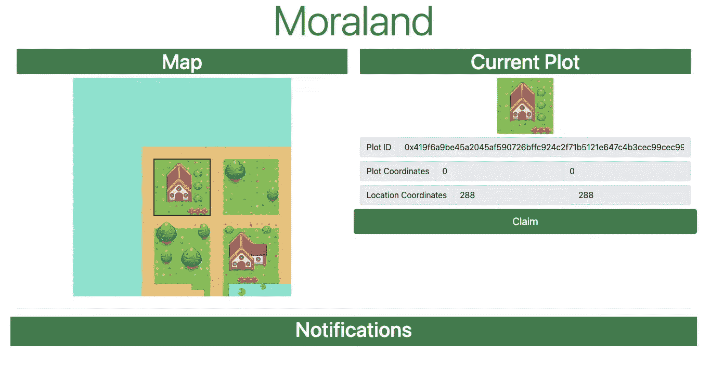

如你所见，我们将其命名为“Moraland”(Moralis land 的简称)。此外，我们决定让界面尽可能简单。就我们的地图而言，我们从口袋妖怪中汲取了灵感。我们的元宇宙界面有两个主要部分:地图和当前地块。该地图带有一个选择工具(黑色方块)，用户可以选择各种地块。此外，所选的图显示在“当前图”部分。后者包括选定地块的 ID、地块坐标和位置坐标。此外，还有“认领”按钮，用户可以认领选中的地块。当然，只有尚未被认领的地块才适用。因此，如果用户试图声明之前声明的地块，将出现“地块已分配”通知:

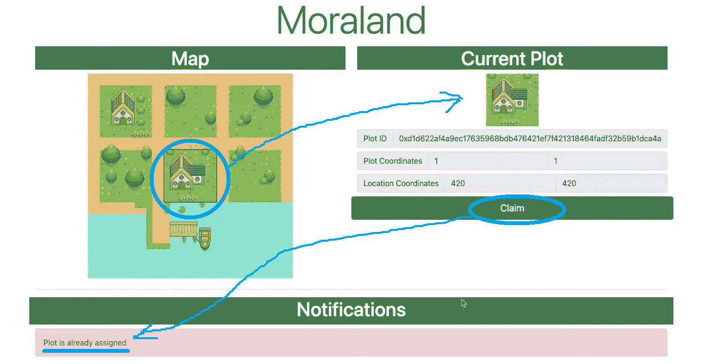

此外，某些地块，如水上地块，不能主张。选择此类图时,“索赔”按钮会自动禁用:

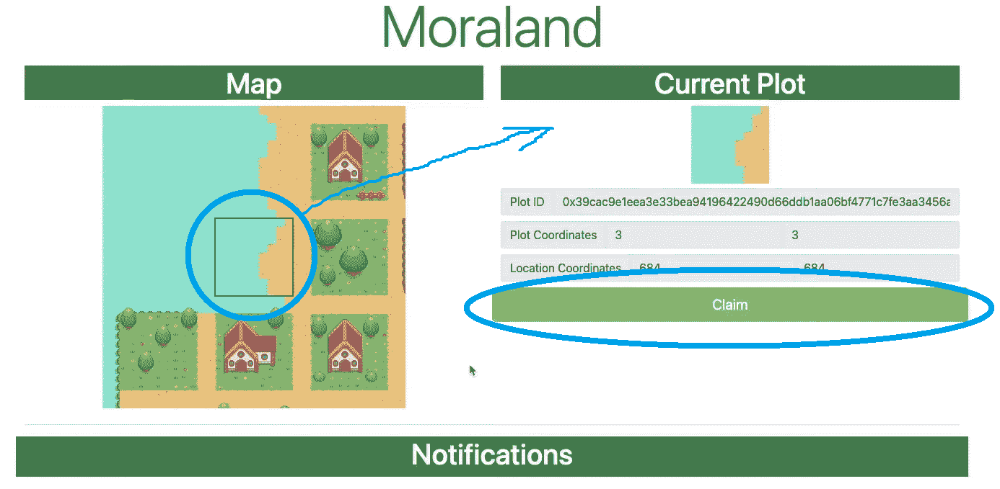

上面三个截图显示了我们的例子元宇宙的要点，这是所有关于虚拟土地。当然，这只是地图动画的前端，也是最棘手的部分。然而，使我们的应用程序成为简单元宇宙的东西隐藏在后端。这就是我们使用 Moralis SDK 和智能合约示例的地方。后者获取我们虚拟土地的地块，并将其转换为链上资产。因此，我们创建(或铸造)[不可替换的令牌](https://moralis.io/non-fungible-tokens-explained-what-are-nfts/) (NFTs)来表示地块，并且可以由用户拥有。因此，让我们也做一个快速演示，要求选定的情节。

### 在道德和法律上要求一块土地

那么，假设一个用户想要拥有这块沿海的土地:

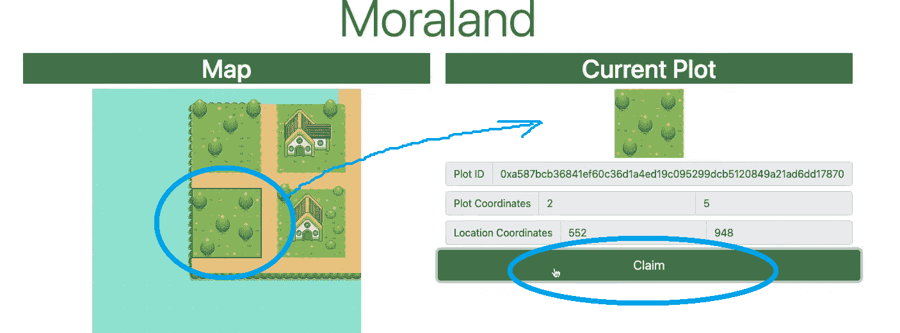

点击“认领”按钮后，他们的[元掩码](https://moralis.io/metamask-explained-what-is-metamask/)扩展提示他们确认交易:

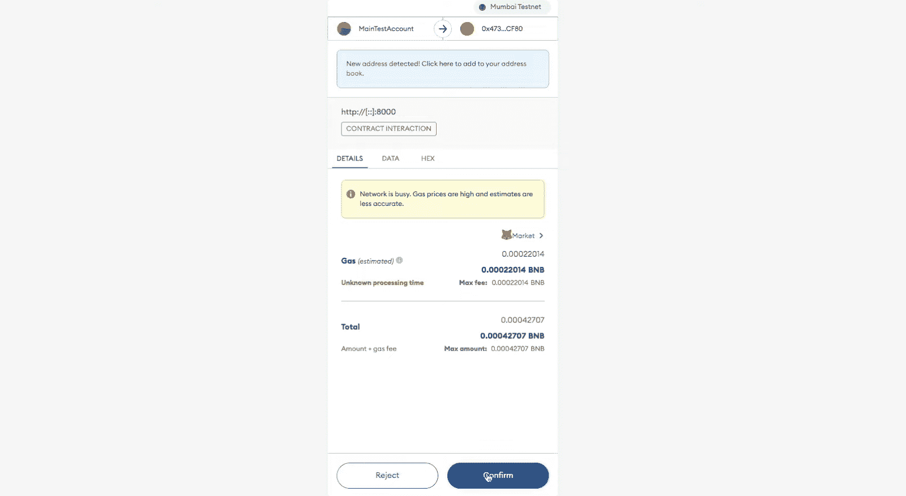

由于我们的地块没有相关成本，他们只需要支付交易费用。在他们完成交易后，“通知”部分将为他们提供一个交易散列:


他们可以使用交易散列来检查上述交易细节。此外，由于我们使用的是 Polygon 的 testnet (Mumbai ),因此我们可以使用 PolygonScan (Mumbai)进行测试:

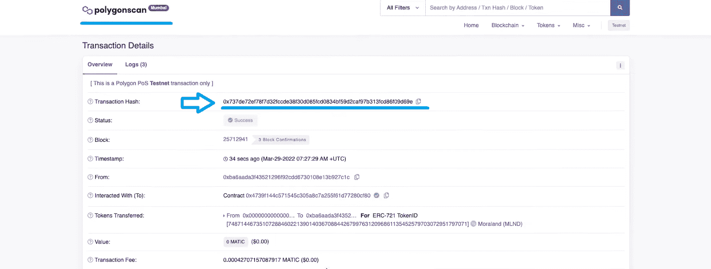

为了这个示例项目，我们允许用户直接要求地块。然而，我们可以更进一步，也包括定价，从而使用户能够出售土地。这些土地可以在使用者之间进行交易。我们还可以 [*构建一个 NFT 交易接口*](https://moralis.io/build-an-nft-trading-interface-full-guide/) *来实现。因此，我们强烈建议您探索这些额外的选项。然而，首先，使用下面的说明创建您自己的元宇宙。尽管如此，如果你是一个视频爱好者，一定要看看这篇文章末尾的视频。我们的示例元宇宙的演示从 0:46 开始。*

## 创建您自己的元宇宙–代码演练

接下来，你可以阅读/观看我们的教程，或者你可以自己采取行动。后者将使您能够创建自己的元宇宙。如果你决定卷起袖子，你有两个选择。你可以使用我们的[起始代码](https://github.com/MoralisWeb3/youtube-tutorials/tree/main/Metaverse-Starter)并自己实现必要的代码，或者你可以使用我们的[最终代码](https://github.com/DanielMoralisSamples/33_MetaverseLand)。后者将使您能够在几分钟内创建自己的元宇宙实例。尽管如此，这两个代码都在 GitHub 上等待着你。

下面是我们的示例项目在 Visual Studio 代码(VSC)中的文件夹结构:

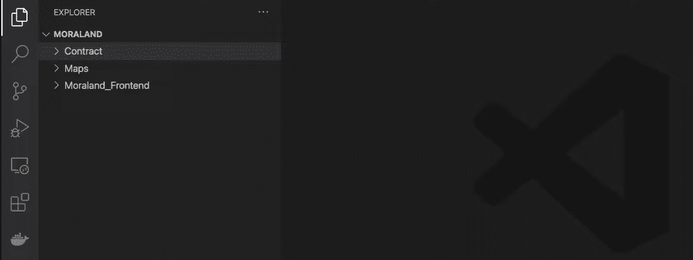

正如你在上面的截图中看到的，我们的“MORALAND”文件夹包括“Contract”、“Maps”和“Moraland_Frontend”文件夹。第一个包含智能合同，这将使我们能够铸造 NFT，并确保我们的地块成为链上资产。我们通过使用 OpenZeppelin 让事情变得尽可能简单。在那里，我们获得了一份 [ERC-721 合约](https://moralis.io/erc721-contract-exploring-erc721-smart-contracts/)，该合约经过验证，适合铸造 [ERC-721 代币](https://moralis.io/erc-721-token-standard-how-to-transfer-erc721-tokens/)。第二个文件夹包含了所有的细节，包括开源的 PNG 资产，它们构成了我们地图的图形。第三个文件夹是关于前端的，如上面的演示所示。

### 虚拟土地-创建和动画地图

处理地图可能相当有用；然而，这并不是我们的示例应用程序成为元宇宙的原因。因此，这不是我们想要重点关注的事情。相反，我们让您自己探索“地图”文件夹的细节。但是，请确保使用下面从 3:48 开始的视频来浏览有问题的文件夹:

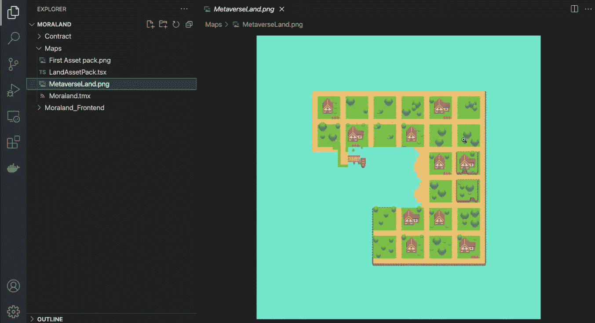

从 7:50 开始，你将开始揭开动画制作上图的奥秘。在这里，您将使用“Moraland_Frontend”文件夹中的“[index.html](https://github.com/DanielMoralisSamples/33_MetaverseLand/blob/master/Moraland_Frontend/index.html)”和“ [logic.js](https://github.com/DanielMoralisSamples/33_MetaverseLand/blob/master/Moraland_Frontend/static/js/logic.js) ”文件。此外，您的目标将是创建与上述演示相同的前端。

### 获取地块数据

成功制作地图动画后，您需要将绘图数据放入“当前绘图”部分。如果您还记得，绘图数据包括以下内容:

*   Plot ID
*   绘图坐标
*   位置坐标

您将通过以下代码行获得“logic.js”文件夹中的绘图数据(视频如下 45:16 所示):

```js
function setPlotData() {
    const plotID = ethers.utils.id(JSON.stringify(plotView));
    document.getElementById("plotX").value = plotView.plotX
    document.getElementById("plotY").value = plotView.plotY
    document.getElementById("locationX").value = plotView.locationX
    document.getElementById("locationY").value = plotView.locationY
    document.getElementById("plotID").value = plotID;
    isPlotAssignable(plotID);
}
```

这里，图 ID 是最重要的数据，您将使用 [Ethers.js 库](https://moralis.io/javascript-libraries-ethers-js-vs-web3-js/)对其进行“散列”。后者包含在道德中。这行代码授予对它的访问权限:

```js
const ethers = Moralis.web3Library;
```

此外，您还需要确保 animate 函数和“initializedMap()”函数包含“setPlotData()”。最后，您将添加确定哪些地块不可声明所需的代码(50:53)。

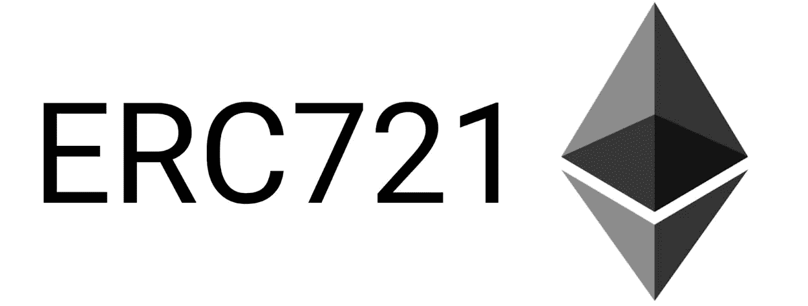

### ERC-721 智能合同

此时，您应该已经准备好了前端。因此，是时候将注意力转移到后端了。这就是我们的[元宇宙智能合同](https://moralis.io/metaverse-smart-contract-how-to-build-a-metaverse-game-smart-contract/)将发挥重要作用的地方(54:09)。您可以在 GitHub 上访问“ [Moraland.sol](https://github.com/DanielMoralisSamples/33_MetaverseLand/blob/master/Contract/Moraland.sol) ”智能合约。后者基本上是一个 ERC-721 合同样板。我们添加了独特的“分配”功能来正确处理我们的情节。此外，我们使用“exist”功能来检查当前图是否已经作为 NFT 存在。因此，我们能够确定所讨论的地块是否已经有人认领。此外，你可以复制代码并粘贴到[混音](https://moralis.io/remix-explained-what-is-remix/)中。在那里，您将能够将其部署到孟买测试网。

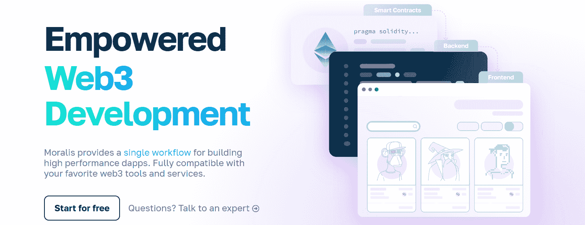

### 用道德创造你自己的元宇宙

使用 Moralis 非常简单。Moralis 让创建各种 dapp([去中心化应用](https://moralis.io/decentralized-applications-explained-what-are-dapps/))变得轻而易举，包括 metaverses。完成初始设置只需几分钟。因此，在创建你的免费 Moralis 账户后，你可以[登录](https://admin.moralis.io/login)到你的 Moralis 管理区，[创建你的 Moralis 服务器](https://docs.moralis.io/moralis-dapp/getting-started/create-a-moralis-dapp#2.-create-a-moralis-server) (57:36)。一旦您的服务器启动并运行，您就可以获得它的详细信息(服务器 URL 和应用程序 ID)。然后，将这些细节添加到“logic.js”文件的顶部:

```js
const serverUrl = "PASTE YOUR SERVER URL";
const appId = "PASTE YOUR  APP ID";
```

上面几行代码将使您能够访问 Moralis 的 SDK，但是您还需要包含一些其他的 Web3 常量:

```js
const contractAddress = ""; // your own contract
const contractABI = []; // your contract’s ABI
```

在部署上述合同之后，您可以从 Remix 复制上述两个合同细节(59:28)。接下来，你需要添加适当的 Web3 功能(1:01:05)。这样，您将覆盖 [Web3 认证](https://moralis.io/web3-authentication-the-full-guide/)，并使您的 dapp 能够与智能合约交互。因此，您将确保代表所要求地块的 NFT 得到铸造。这也是您将确保为先前申请的地块显示“地块已分配”通知的地方。

最后，这是我们在整篇文章中引用的视频教程:

https://www.youtube.com/watch?v=tJez2sd1sok

## 如何创建您自己的元宇宙–摘要

在“如何创建你自己的元宇宙”的探索中，我们已经涉及了相当多的领域。首先，你已经了解了什么是元宇宙。然后，您可以看到我们的元宇宙示例的演示。接下来，你有机会卷起袖子，创造你自己的元宇宙。在此过程中，您已经部署了自己的智能合约实例，并创建了自己的 Moralis 服务器。最终，你现在知道如何创建你自己的元宇宙了。所以，如果你喜欢这个例子项目，我们鼓励你访问[道德博客](https://moralis.io/blog/)和[道德 YouTube 频道](https://www.youtube.com/c/MoralisWeb3)。在那里，你会找到几个围绕元宇宙和 [NFT 实用程序](https://moralis.io/nft-utility-exploring-nft-use-cases-in-2022/)的教程。

这两个网站上还有许多其他教程可以帮助您探索整个加密领域。例如，如果你对 [Web3 游戏设计](https://moralis.io/web3-game-design-explaining-the-web3-game-design-process/)感兴趣，你需要看看我们的 [Unity Web3](https://moralis.io/unity-web3-beginners-guide-to-unity-web3-programming/) 项目。或者，也许你想学习如何构建一个 [Web3 Spotify](https://moralis.io/how-to-build-a-web3-spotify-clone/) 的克隆版本，一个 [Web3 网飞](https://moralis.io/how-to-develop-a-web3-netflix-clone/)的克隆版本，或者一个[web 3](https://moralis.io/create-a-reddit-clone-for-web3-step-by-step-guide/)的 Reddit 克隆版本。此外，您可能希望关注我们的最新主题和教程。这些说明了如何[创建一个 BNB NFT](https://moralis.io/how-to-create-a-bnb-nft/) ，什么是[分数 NFT](https://moralis.io/what-are-fractional-nfts-the-ultimate-2022-f-nft-guide/)，如何构建一个[即玩即赚(P2E)游戏智能合约](https://moralis.io/how-to-build-a-play-to-earn-p2e-game-smart-contract/)，什么是[基于 NFT 的会员资格](https://moralis.io/what-are-nft-based-memberships-full-guide/)，什么是[动态 NFT](https://moralis.io/what-are-dynamic-nfts-the-ultimate-2022-guide/)，如何构建一个 [Uniswap DEX 克隆](https://moralis.io/build-a-uniswap-dex-clone-with-html-css-javascript-moralis-on-the-ethereum-network/)，如何[获得区块链短信通知](https://moralis.io/how-to-get-blockchain-sms-notifications/)，以及如何添加一个

尽管如此，如果你想快速自信地成为一名 Web3 开发人员，可以考虑报名参加 T2 道德学院。除了顶级的[区块链发展课程](https://academy.moralis.io/all-courses)，你还将获得个性化的学习路径。然而，更大的价值在于专家指导和成为行业中最先进社区的一员。