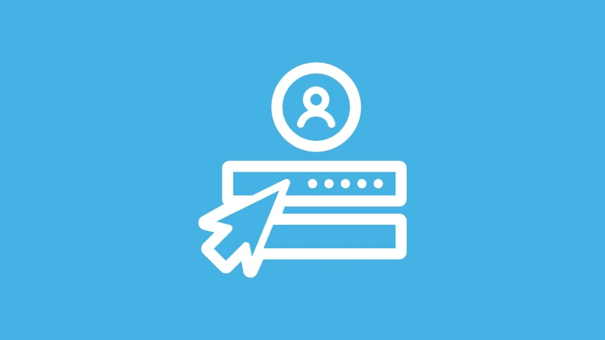
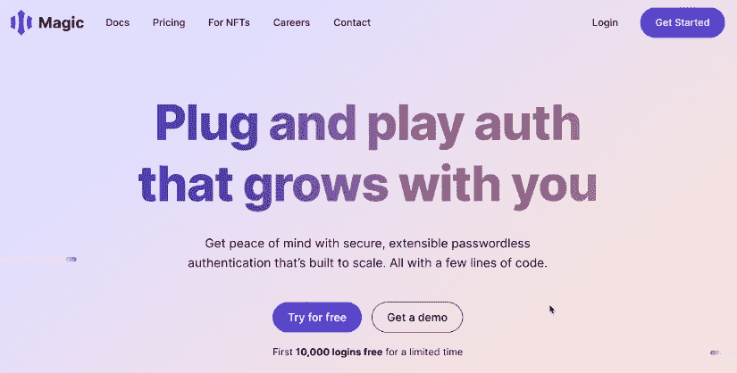
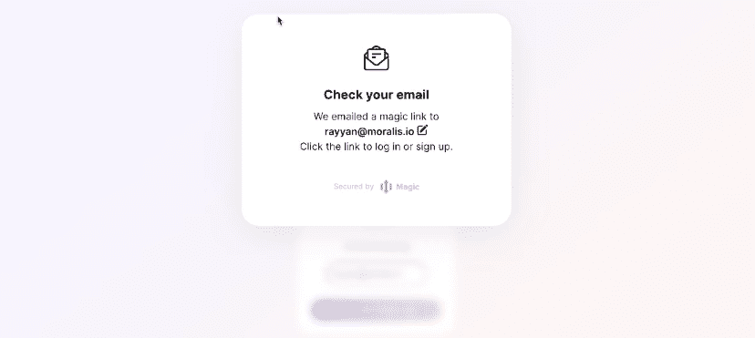
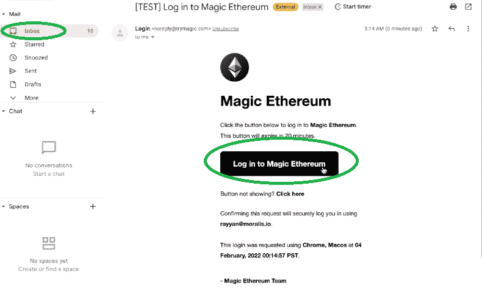
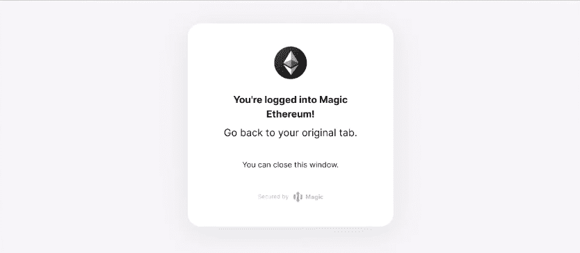
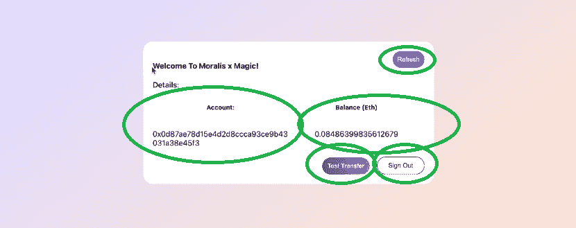
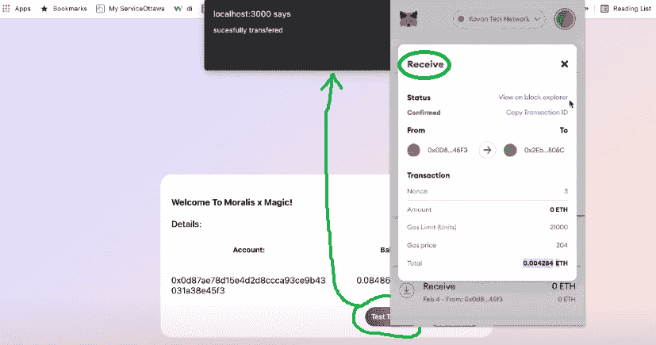
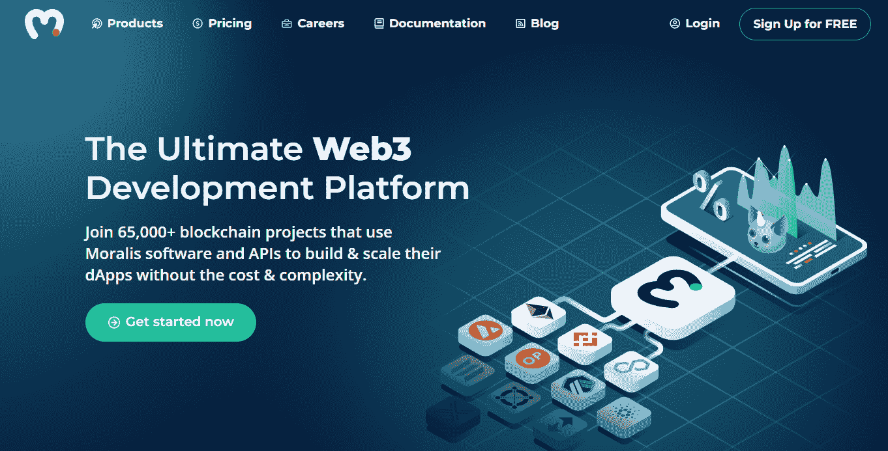

# 如何通过电子邮件进行 Web3 认证？

> 原文：<https://moralis.io/how-to-do-web3-authentication-via-email/>

将来自网络 2 空间的元素融入到 [**网络 3**](https://moralis.io/the-ultimate-guide-to-web3-what-is-web3/) **领域将非常有益。通过实现普通用户熟悉的功能，区块链的采用将会越来越快。Web2 用户熟悉的功能之一是电子邮件认证。但是，由于区块链** [**认证**](https://moralis.io/ethereum-authentication-full-tutorial-to-ethereum-login-programming/) **往往仅限于** [**Web3 钱包**](https://moralis.io/what-is-a-web3-wallet-web3-wallets-explained/) **，那么是否有可能通过电子邮件实现 Web3 认证呢？幸运的是，有一种无缝的方法可以为 Web3 进行电子邮件认证。此外，您可以使用适当的工具，通过电子邮件选项快速实现 Web3 登录。通过在 dApps 中实现这种身份验证方法，公众将更倾向于采用 Web3，因为他们将更愿意利用使用熟悉的身份验证功能的平台。**

接下来，您将了解使 Web3 通过电子邮件登录成为可能的工具的详细信息。这个特性的关键是最终的 Web3 开发平台——[Moralis](https://moralis.io/)，以及它的[集成 Magic](https://moralis.io/moralis-integrates-passwordless-authentication-from-magic/) (Magic Labs)。此外，我们将向您展示一个通过电子邮件进行 Web3 身份验证的演示。这样，你会看到事情一旦安排妥当是如何运作的。此外，我们还将承担一个示例项目。因此，我们将向您展示如何在您的 dApps ( [分散式应用](https://moralis.io/decentralized-applications-explained-what-are-dapps/))中实现这种登录方法。掌握了这一技能，你将能够在未来的所有 Web3 应用中使用这一用户友好的登录选项。此外，您将有机会为任何现有的使用 Moralis 构建的 dApps 启用电子邮件 Web3 登录。现在，如果这是你第一次接触 Moralis(又名 [Firebase for crypto](https://moralis.io/firebase-for-crypto-the-best-blockchain-firebase-alternative/) )，确保在继续之前[创建你的免费账户](https://admin.moralis.io/register)。



## 通过电子邮件进行 Web3 身份验证

如上所述，当使用电子邮件进行 Web3 登录时，Moralis 的魔法集成是一个发电站。这两种工具的结合使您能够在前端为用户提供一种熟悉的登录方法。此外，这些工具会在后端自动创建一个唯一的 Web3 钱包地址。后者使用户能够充分参与 Web3 所提供的一切。现在，全面掌握如何通过电子邮件功能进行 Web3 身份验证的最佳方式是看一个演示。



## 使用电子邮件进行 Web3 登录演示

出于演示的目的，我们创建了一个非常简单的登录页面:


从上面的图片中你可以看到，我们的登录页面有一个电子邮件地址输入框和一个登录按钮。你可能同意大多数普通用户会凭直觉知道输入他们的电子邮件地址并点击按钮，对吗？

单击按钮后，身份验证过程开始。后者包括几个自动化操作。首先，向用户显示一个弹出窗口:



该消息指示用户检查他们的电子邮件收件箱。因此，第二个自动化部分是向用户发送身份验证电子邮件。这封电子邮件可以完全定制；但是，默认情况下，您看到的是这样的内容:



如上面的屏幕截图所示，用户必须单击身份验证电子邮件中的登录按钮(链接)。单击该链接后，用户将登录并看到以下消息:



### 通过电子邮件成功进行 Web3 身份验证

按照上面弹出消息中的说明，用户需要返回到原来的选项卡。从现在开始，由您来创建自己选择的仪表板。因此，您可以决定登录用户可以看到什么。为了这个演示，我们决定显示用户的帐户地址和他们的余额。此外，我们还包括三个按钮:刷新、注销和一个用于执行测试转移的按钮:



上面这张截图的目的是向你展示这种使用电子邮件的 Web3 登录确实有效。如您所见，我们获得了执行所有类型的 Web3 功能所需的所有信息(地址和余额)。例如，我们可以轻松地转移资产。此外，为了证明发送资产是可能的，我们单击“Test Transfer”按钮。一条确认消息确认我们的操作:



上面的图像甚至向您展示了我们发送测试资产的 MetaMask 钱包。此外，Magic 甚至使我们能够避免处理种子词或密码，从而获得无缝的用户体验。因此，对于用户来说，事情可以像输入电子邮件地址和点击确认链接一样简单。

## 为什么要通过电子邮件实现 Web3 认证？

如果你使用过任何 Web3 应用程序，你很可能熟悉 [Web3 认证](https://moralis.io/web3-authentication-the-full-guide/)或 [Web3 登录](https://moralis.io/how-to-build-a-web3-login-in-5-steps/)。你知道它通常要求你使用热门钱包如 [MetaMask](https://moralis.io/metamask-explained-what-is-metamask/) 签署确认消息。虽然对于已经设置了钱包扩展的用户来说，这是一个简单的过程，但对于新手来说，这可能是一个相当艰巨的任务。因此，为用户提供一个他们完全熟悉的方法是有好处的。因此，您应该考虑在 dApps 中通过电子邮件提供 Web3 身份验证，以迎合 Web3 的新用户。



## 如何通过电子邮件进行 Web3 身份验证–分步概述

现在你已经知道了用电子邮件登录 Web3 对新用户来说有多实用，是时候看看如何实现它了。此外，如果您过去已经使用 Moralis 创建了 dApps，您可以通过电子邮件轻松实现 Web3 身份验证。在跟随我们的线索之后，我们建议您更深入地研究 [Moralis 的文档](https://docs.moralis.io/moralis-server/users/crypto-login/magic)。因此，以下是您需要遵循的步骤:

1.  通过访问官方 [Magic](https://magic.link/) 网站获取您的 Magic API 密钥。点击“开始”按钮，完成注册程序:


随着你的神奇帐户的创建，你将可以访问你的 API 密匙。

2.  接下来，您需要将 Magic SDK 添加到您的项目中。根据您的项目，您可以通过脚本(当您通过 CDN 导入 [Moralis 的 SDK](https://moralis.io/exploring-moralis-sdk-the-ultimate-web3-sdk/) 时)或通过 NPM(当您通过 NPM 导入 Moralis 的 SDK 时)来完成:
    1.  via CDN:***<script src = " https://auth . magic . link/SDK "></script>***
    2.  Via NPM: ***npm 安装 magic-sdk***

3.  使用以下代码行:

```js
const user = await Moralis.authenticate({ 
  provider: "magicLink",
  email: "[email protected]",
  apiKey: "pk_xxxxx",
  network: "kovan",
})
```

查看上面的代码行，您会发现它需要几个参数。如果你想使用魔法链接，“magicLink”是你需要在“provider”旁边使用的。在“电子邮件”旁边，您需要使用想要登录的用户的电子邮件地址。因此，您需要将该参数与电子邮件捕获字段连接起来。在“apiKey”旁边，粘贴您的神奇 API 密匙。最后，在“网络”旁边，你可以在主网([以太坊](https://moralis.io/full-guide-what-is-ethereum/))和[以太坊测试网](https://moralis.io/ethereum-testnet-guide-connect-to-ethereum-testnets/)中选择一个。

### 使用电子邮件登录 web 3–一个示例项目

*注意* *:为了便于理解，请确保使用为该示例项目提供的代码。这与上面演示中介绍的项目相同。我们的* [*GitHub*](https://github.com/MoralisWeb3/youtube-tutorials/tree/main/magic-auth-demo) *页面上有。*

如你所见，在使用 Moralis 时，在 dApps 中提供带有电子邮件的 Web3 登录非常简单。只需要以上三个步骤。现在让我们来看一个示例项目。如果您还没有这样做，请确保完成上一节中的前两步。接下来，使用“ [SignIn.js](https://github.com/MoralisWeb3/youtube-tutorials/blob/main/magic-auth-demo/Components/SignIn.js) ”文件，这是我们为了这个示例项目而创建的。这是我们需要实现上一节第三步中的代码行的地方:

```js
  const [email, setEmail] = useState("[email protected]");

  const handleCustomLogin = async () => {
    await authenticate({
      provider: "magicLink",
      email: email,
      apiKey: "",
      network: "kovan",
    });
  };
```

*注意* *:确保在“apiKey”旁边使用自己的魔法 API key。*

如果你是一个视频爱好者，你可以在 Moralis 的一个专家的肩膀上看着他实现上面的代码行。如果你对此感兴趣，请观看下面的视频，从 5:41 开始。

https://www.youtube.com/watch?v=gLJ4YejmG2E

## Moralis 通过电子邮件功能进行 Web3 认证

那些之前在 Moralis 的帮助下创建了非凡的 dApps 的人可以通过电子邮件(如上所述)立即实现 Web3 认证。但是，如果您是 Moralis 的新手，您首先需要完成一些基本的设置步骤。因此，让我们来引导您完成初始的 Moralis 设置。

### Moralis 初始设置-第 1 部分

1.  [**创建您的免费道德账户**](https://admin.moralis.io/register)——使用左边的链接进入注册页面。然后，通过输入您的电子邮件地址和创建您的密码来创建您的免费帐户。此外，请务必确认您的帐户(点击发送到您电子邮件的确认链接)。*不过，如果你已经有一个活跃的 Moralis 账户，只需* [*登录*](https://admin.moralis.io/login) *。*

2.  [**创建一个新的服务器**](https://docs.moralis.io/moralis-server/getting-started/create-a-moralis-server)–一旦您成功登录到您的 Moralis 管理区，进入“服务器”选项卡。在那里，单击右上角的“+创建新服务器”按钮。从出现的下拉菜单中，选择符合您需求的网络类型(见下图)。*当处理示例项目或您自己项目的早期阶段时，使用“Testnet 服务器”选项是最有意义的。*


选择服务器类型后，在新的弹出窗口中输入服务器的详细信息。您需要为您的服务器命名，然后选择您的区域、网络和链:


最后，您需要通过点击“添加实例”按钮来启动您的服务器。*请注意，服务器启动需要一些时间。*

### Moralis 初始设置-第 2 部分

3.  **访问服务器详情**–随着您的 Moralis 服务器的启动和运行，您可以使用大多数 Moralis 功能。除此之外，您还可以访问服务器的详细信息。为此，您需要单击服务器名称旁边的“查看详细信息”按钮:


点击“查看详情”后，一个新的弹出窗口将显示您的服务器 URL、应用 ID 等信息。*这也是您可以访问 Moralis“同步”功能的地方。*此外，您可以使用复制图标复制相关细节:


4.  初始化 Moralis–您现在需要初始化 Moralis 并释放其 SDK 的全部功能。这包括[终极 NFT API](https://moralis.io/ultimate-nft-api-exploring-moralis-nft-api/) 。因此，您需要用服务器的详细信息填充您的编码文件。当你从零开始构建你的 dApp 时，这将是一个”。html“，”。jsx”，或者”。js”文件。然而，通过使用最实用的 [Web3 样板文件](https://moralis.io/web3-boilerplate-beginners-guide-to-web3/)，你将会填充。env "文件。因此，复制并粘贴您的 Moralis 服务器的详细信息(应用程序 ID 和服务器 URL):
    1.  使用终极 Web3 样板文件时:


2.  从头开始创建 dApps 时(“。js "文件):


*注意**:Do****NOT****使用上图的细节。相反，请确保使用您的服务器的详细信息。*

### 使用电子邮件和您的 dApps 进行 Web3 登录

正如在初始 Moralis 设置序列的最后一步中提到的，在创建 dApps 时，您有两种选择。因此，你可以使用 [Moralis Web3 API](https://docs.moralis.io/moralis-server/web3-sdk/intro) 从头构建 dApp，或者使用终极[以太坊 dApp 样板](https://moralis.io/ethereum-dapp-boilerplate-full-ethereum-react-boilerplate-tutorial/)。这两种选择各有各的优点。例如，当从头开始时，您可以完全自由地创建一个独特的 UI。因此，当一个独特的外观是你的主要目标时，这就是你要走的路。

另一方面，在处理样板文件时，您可以使用具有用户就绪 UI 的组件。因此，后者使您能够在几分钟内拥有一个带有整洁 UI 的 dApp 并运行。因此，样板文件为你提供了阻力最小的路径。此外，当在尽可能短的时间内实现功能是您最关心的问题时，这是一条必由之路。如果这听起来很有趣，我们建议查看我们的[样板项目](https://docs.moralis.io/moralis-server/getting-started/boilerplate-projects)。


## 如何通过电子邮件进行 Web3 身份验证–总结

此时，你可能真的很激动。知道有一种方法可以让基本上对加密钱包一无所知的用户使用 Web3 应用程序是非常不可思议的。此外，将这一点与使用 Moralis 创建 dApps 的简单性结合起来，您就拥有了一个不错的兵工厂。

展望未来，我们鼓励你运用这种力量。如果你有自己的想法，无论如何，马上着手去做。然而，如果你需要一些练习和指导，确保使用[道德博客](https://moralis.io/blog/)和[道德 YouTube 频道](https://www.youtube.com/c/MoralisWeb3)。这两个出口都提供了许多示例项目和各种加密主题的精彩解释。例如，一些最新的话题围绕着 [React Native Web3 dev](https://moralis.io/react-native-web3-full-react-native-web3-dev-guide/) 、 [Web3 游戏化](https://moralis.io/web3-gamification-creating-a-coinmarketcap-diamonds-dapp/)、 [NFT 游戏人物](https://moralis.io/nft-game-characters-how-to-mint-in-game-nft-characters/)、[如何铸造 1 万个 NFT](https://moralis.io/how-to-mint-10000-nfts-full-walkthrough/)、 [Web3 数据科学](https://moralis.io/web3-data-science-importing-on-chain-events/)、终极 [Web3 UI 套件](https://moralis.io/web3ui-kit-the-ultimate-web3-user-interface-kit/)、 [ERC721 智能合约](https://moralis.io/erc721-contract-exploring-erc721-smart-contracts/)、[炼金术替代品](https://moralis.io/alchemy-alternatives-top-blockchain-apis/)、[可升级这种方法是最好的在线免费加密教育途径之一。](https://moralis.io/what-are-upgradable-smart-contracts-full-guide/)


然而，如果你对更专业的方法感兴趣，你需要考虑报名参加[道德学院](https://academy.moralis.io/)。通过这样做，你可以接触到无数的专业级区块链编程[课程](https://academy.moralis.io/all-courses)。最重要的是，你可以接触到最先进和最支持的社区之一。尽管如此，你会得到区块链专家的专业指导。因此，你应该[成为一名区块链开发者](https://moralis.io/how-to-become-a-blockchain-developer/)，并且马上成为全职加密员。