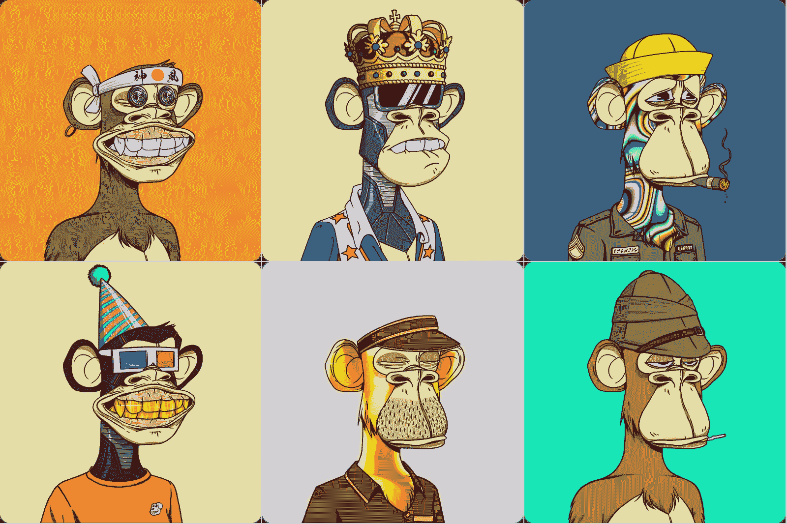
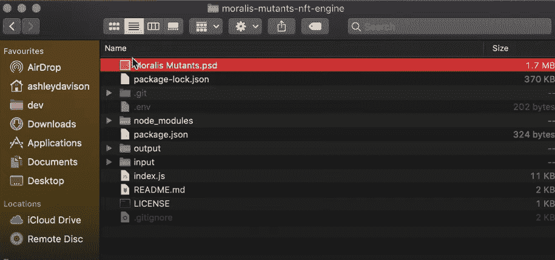
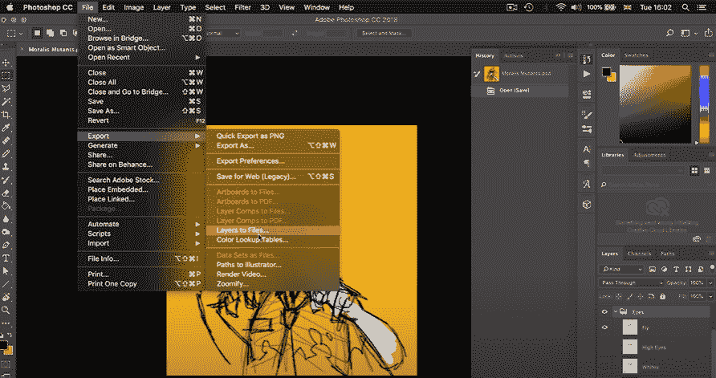
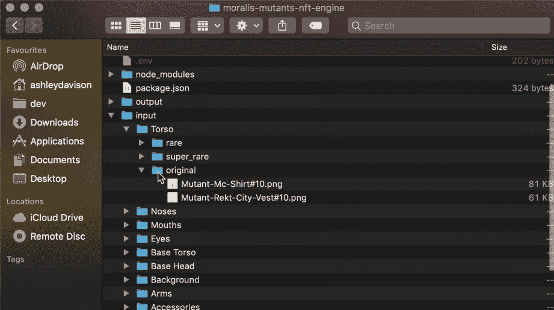
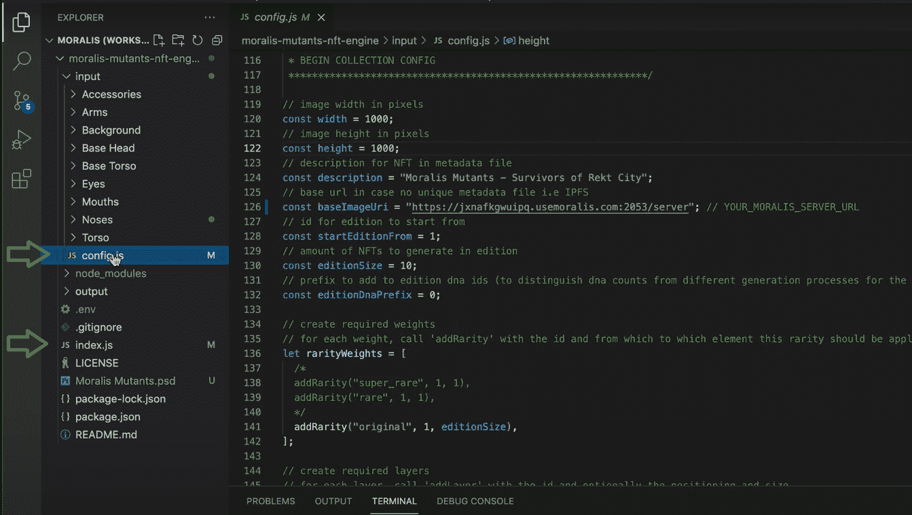
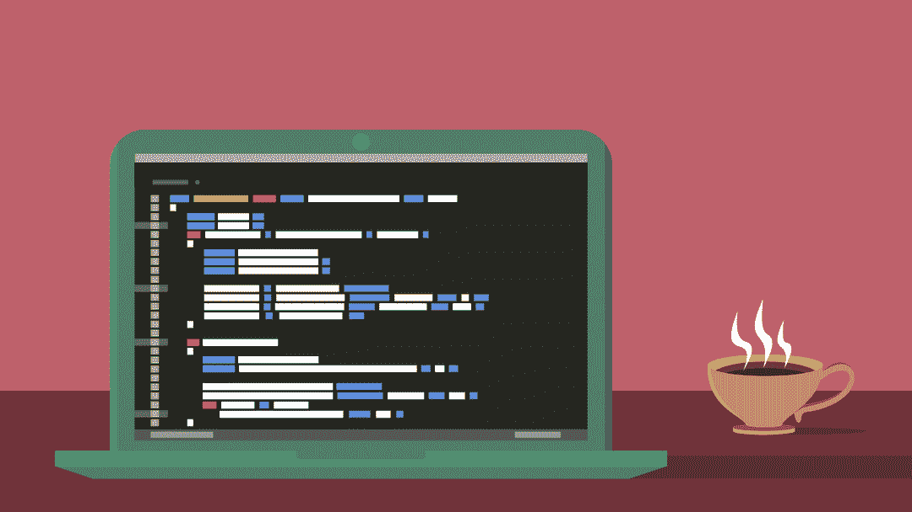
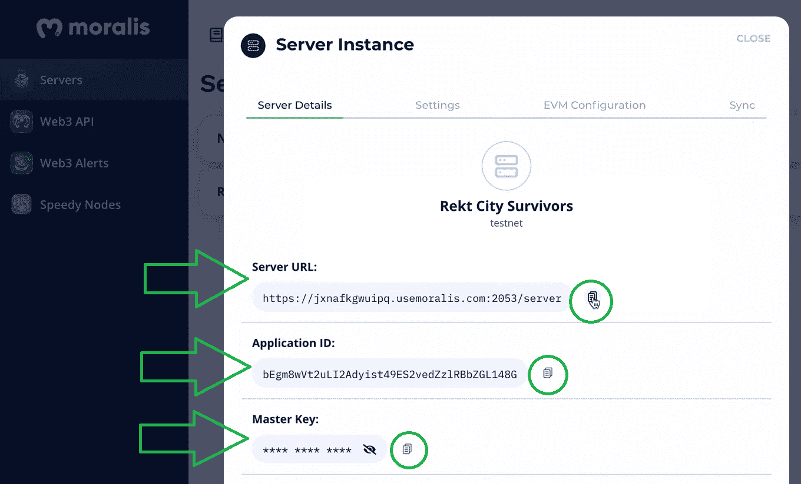
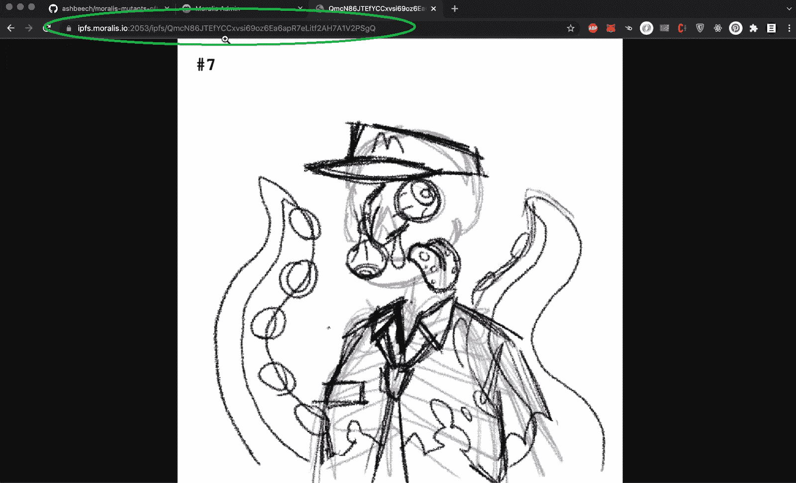
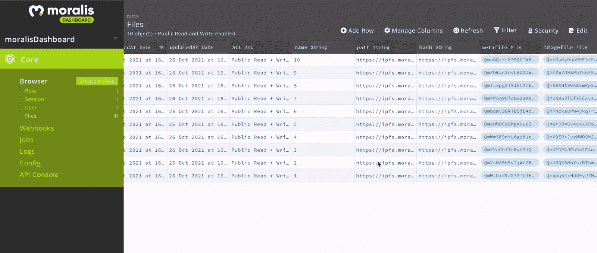

# 如何生成 NFTs–完整指南

> 原文：<https://moralis.io/how-to-generate-nfts-full-guide/>

无数的加密项目为他们的收藏产生了 [**NFTs**](https://moralis.io/non-fungible-tokens-explained-what-are-nfts/) **的作品，每个月都有新的 NFT 艺术藏品脱颖而出。此外，许多开发人员参与创建 NFT，这意味着他们使用计算机代码生成 NFT。因此，计算机生成了 NFT 个人的艺术作品，并给每幅 NFT 作品增加了随机性，这使得在许多人看来，收藏总体上更有价值。此外，虽然许多 NFT 在** [**以太坊**](https://moralis.io/full-guide-what-is-ethereum/) **的区块链上推出，但 NFT 令牌也在其他流行链上创建和部署，如** [**币安智能链**](https://moralis.io/bsc-programming-guide-intro-to-binance-smart-chain-development-in-10-minutes/) **(BSC)、索拉纳、** [**雪崩**](https://moralis.io/how-to-build-avalanche-dapps-in-minutes/) **等。然而，虽然一些开发人员可能认为生成 NFT 似乎很有挑战性，但是利用适当的工具(比如 Moralis)可以使这个过程变得简单明了。因此，我们将在本文中展示如何使用 Moralis 生成 NFT。**

随着 NFT 的出现和它们越来越受欢迎，学习 [NFT 令牌开发](https://moralis.io/nft-token-development-the-ultimate-guide/)对于每个想要[成为区块链开发者](https://moralis.io/how-to-become-a-blockchain-developer/)的程序员来说是必不可少的。此外，无论你是决定[创建你自己的 NFT](https://moralis.io/how-to-create-nfts-and-upload-to-opensea/)还是你的客户的，知道如何创建 NFT 将是非常有益的。虽然这个过程可能看起来很有挑战性，有些令人生畏，但有一个强大的工具唾手可得，让整个后端过程变得轻而易举——Moralis。感谢 [Moralis](https://moralis.io/) 终极 Web3 开发平台，你可以用一行代码[将文件夹上传到 IPFS](https://moralis.io/how-to-upload-folders-to-ipfs/) 。这样，你就可以分散地存储你的作品和元数据。之后你只需要用一个智能合约[铸币 NFTs](https://moralis.io/how-to-mint-nfts-full-tutorial-to-minting-an-nft/) 。所以，如果你真的想学习如何生成 NFT，现在就[创建你的免费道德账户](https://admin.moralis.io/register)。



## **如何生成 NFTs–示例项目**

如果你读过 [Moralis 的博客](https://moralis.io/blog/)的文章，或者看过 [Moralis 的 YouTube](https://www.youtube.com/c/MoralisWeb3) 频道的视频，那么你已经知道我们相信通过行动来学习。因此，我们倾向于承担示例项目，您可以跟随并创建自己的功能性 [dApp](https://moralis.io/decentralized-applications-explained-what-are-dapps/) 、令牌或 NFT(例如 [ERC721](https://moralis.io/erc-721-token-standard-how-to-transfer-erc721-tokens/) 或 [ERC1155](https://moralis.io/erc1155-exploring-the-erc-1155-token-standard/) NFT 令牌)。在今天的文章中，我们将重点向您展示如何生成 NFT。

我们的任务将是采取不同的组件或层(项目的艺术部分)，然后使用相对简单的代码来随机生成使用这些组件的 NFT。此外，我们的代码会自动将我们的“pre-NFT”及其元数据文件保存到一个分散的存储解决方案中。然而，你可能会问，“为什么是‘非功能性测试前’？”。因为要把它们变成非功能性食物，它们需要被铸造。*我们在此不涵盖“造币”过程；然而，在我们之前的一篇文章中，我们展示了如何* [*批量制造 NFTs*](https://moralis.io/how-to-bulk-mint-nfts-batch-minting-guide/) *。*

为了使这个过程尽可能简单，我们将使用这些有用且强大的工具:

*   Moralis 将覆盖大部分与区块链相关的后端部分。使用 [Moralis 的 SDK](https://moralis.io/exploring-moralis-sdk-the-ultimate-web3-sdk/) 和[终极 NFT API](https://moralis.io/ultimate-nft-api-exploring-moralis-nft-api/) ，我们可以在几分钟内完成原本需要几天甚至几周才能完成的部分。
*   Visual Studio 代码(VSC)–VSC 是我们更喜欢使用的代码编辑器。如果你是初学者，我们建议你也使用它。但是，如果您习惯于使用任何其他代码编辑器，请随意使用。
*   **Adobe Photoshop**–为了创建艺术组件，我们将使用这个流行的照片编辑工具和图像创建软件。同样，请随意使用任何其他类似的程序。

### **如何生成 NFTs 开始设想最终结果**

当创建任何类型的 NFT 时，知道您想要创建什么是很重要的。你最终的 NFT 会是什么样的？在我们的例子中，我们想要一个可以由计算机生成的集合。这意味着我们需要从有几个组件的艺术品开始，这些组件可以组合起来形成一个单元。

此外，由于万圣节季节，我们决定创造特殊种类的突变体或僵尸。所以，让我们来看看一些鼓舞人心的艺术作品:


看上面的图片，你可以看到每个图片有几个组成部分。有背景，裸体的变种人，服装，和某种帽子或头饰(或附件)。通过随机使用这些项目中的每一个，我们创建了一个 NFT 集合。

此外，我们需要确定是否有某个特定的成分或成分组合比其他成分更稀有。一旦我们转到代码，你会看到我们设置稀有。然而，为了生成这种类型的 NFT，我们需要从每个组件的 PNG 图像文件(它们有透明的背景)开始。


## **如何生成 NFTs 艺术部分**

要真正创作出艺术品，你需要与你的创意团队取得联系，或者外包一位艺术家来完成这一部分。如果你决定自己解决这个问题，我们建议你使用 Photoshop，在这里你可以将每个组件创建为一个单独的图层。你可以这样做:

1.  确定您需要创建的组件。
2.  画出每个组件。
3.  将每个图层导出为单独的 PNG 图像。

但是，如果您决定雇用艺术家，我们建议指示他们为您提供每个组件的单独 PNG 文件。在这种情况下，您将能够转移到编码部分，这将使您能够生成这些组件的不同组合。万一他们给你提供一个”。psd”文件，使用下面的步骤导出每个层作为一个单独的图像。

### **使用 Photoshop 生成 NFTs】**

*注意* *:如果你想专注于编码部分而跳过艺术创作过程，我们在* [*GitHub*](https://github.com/ashbeech/moralis-mutants-nft-engine) *(在“Moralis Mutants.psd”文件中)上为你创建了一个带有一些图层的示例艺术作品。此外，为了让您能够轻松地遵循我们的流程，我们强烈建议您将文件存储在您的计算机上。*



一旦你打开了”。psd”文件，您将能够看到为我们的示例项目创建的所有图层:


每个文件夹包含特定于该层的多个项目。我们的下一步是将每一层导出为单独的 PNG 图像。Photoshop 让这变得简单明了——在顶部导航栏中，转到“文件”、“导出”，然后是“图层到文件”:



一旦我们导出了突变角色的组件，我们需要将它们排列在文件夹中。此外，每种类型的组件都应该有自己的文件夹。此外，在每个“组件”文件夹中，项目应该被安排到文件夹中，以确定项目的稀有性(我们将在代码中引用这些文件夹)。在我们的例子中，我们使用“稀有”、“超级稀有”和“原创”，这意味着我们决定有三个稀有级别:



## **如何生成 NFTs 编码部分**

现在我们已经准备好了每个组件的 PNG 文件，我们也准备好实际生成 NFT 了。为此，我们将使用 [JavaScript](https://moralis.io/javascript-explained-what-is-javascript/) (JS)代码。此外，除了创建最终的图像文件，我们还想生成元数据文件(JSON 文件)。这是为代表我们的 NFT 的每个完整图像存储稀有性等内容的地方。我们将只在执行一个事务(mint NFTs)之后获得实际的 NFTs，它将把关于我们的图像文件和 JSON 文件的细节存储到区块链(我们已经在 Moralis 的博客上的一个单独的教程中对此进行了介绍)。

一旦你进入 VSC，首先打开终端:


此外，确保导入所有文件(从我们在 GitHub 的文件仓库)。然而，我们将把重点放在“config.js”和“index.js”文件上，因为它们将完成这项工作。



### **如何生成 NFTs 集合配置**

正如“config.js”文件的名称所示，我们将使用该文件来确定我们的收集引擎如何生成最终的图像文件。这包括图像大小、元数据描述、基本图像 URL、版本 ID、NFT 数量和其他详细信息。代码如下:

```
// image width in pixels
const width = 1000;
// image height in pixels
const height = 1000;
// description for NFT in metadata file
const description = "Moralis Mutants - Survivors of Rekt City";
// base url in case no unique metadata file i.e IPFS
const baseImageUri = "YOUR_MORALIS_SERVER_URL";
// id for edition to start from
const startEditionFrom = 1;
// amount of NFTs to generate in edition
const editionSize = 10;
// prefix to add to edition dna ids (to distinguish dna counts from different generation processes for the same collection)
const editionDnaPrefix = 0;

// create required weights
// for each weight, call 'addRarity' with the id and from which to which element this rarity should be applied
let rarityWeights = [
  /* 
  addRarity("super_rare", 1, 1),
  addRarity("rare", 1, 1),
  */
  addRarity("original", 1, editionSize),
];

// create required layers
// for each layer, call 'addLayer' with the id and optionally the positioning and size
// the id would be the name of the folder in your input directory, e.g. 'ball' for ./input/ball
const layers = [
  addLayer("Background", { x: 0, y: 0 }, { width: width, height: height }),
  addLayer("Base Torso"),
  addLayer("Base Head"),
  addLayer("Torso"),
  addLayer("Arms"),
  addLayer("Mouths"),
  addLayer("Eyes"),
  addLayer("Accessories"),
  addLayer("Noses"),
];

// provide any specific percentages that are required for a given layer and rarity level
// all provided options are used based on their percentage values to decide which layer to select from
addRarityPercentForLayer("original", "Eyes", {
  super_rare: 0,
  rare: 0,
  original: 100,
});

module.exports = {
  layers,
  width,
  height,
  description,
  baseImageUri,
  editionSize,
  startEditionFrom,
  rarityWeights,
};
```

上面的代码已经使用了 Moralis。因此，您需要[创建一个 Moralis 服务器](https://docs.moralis.io/moralis-server/getting-started/create-a-moralis-server)并在代码中使用该服务器的 URL。此外，请记住，所有的细节都可以调整，以满足您想要的结果。例如，我们将使用 1000×1000 像素的图像大小，总共十个完整的图像。然而，我们可以很容易地将后者改为一万。

上面代码中最重要的部分之一是我们如何给我们的作品分层。例如，如果我们将背景放在最上面，它将覆盖所有其他组件。因此，确保您正确地确定层以实现期望的结果是极其重要的。所以一定要小心，最底层的在上面。这是因为它将首先成为数组的一部分(在我们的例子中，背景在上面)。



### **如何生成 NFTs-NFT 引擎**

为了创建我们的 NFT 引擎，我们将使用“index.js”文件。这是我们的每个图像层文件和相应的元数据(JSON 文件)被编译的地方。这个引擎如何工作的细节并不重要，因为你可以简单地使用我们在 GitHub 提供的代码。但是，将文件正确链接到您的 Moralis 服务器详细信息是非常重要的。这些是我们用于该目的的代码行:

```
// Moralis creds
const appId = "YOUR_MORALIS_APP_ID";
const serverUrl = "YOUR_MORALIS_SERVER_URL";
const masterKey = "YOUR_MORALIS_MASTER_KEY"; // DO NOT DISPLAY IN PUBLIC DIR

Moralis.start({ serverUrl, appId, masterKey });
```

由于获取您的 Moralis 服务器的详细信息至关重要，请确保遵循 [Moralis 文档](https://docs.moralis.io/)中提供的说明。具体来说，您可以在“入门”部分找到这些内容。



*注意* *:我们必须指出，将您的主密钥放在公共文件中是* *而不是* *要走的路；但是，我们这样做是为了方便您。因此，确保* *而不是* *公开显示任何包含您的主密钥的文件。*

#### **如何使用 Moralis 的 IPFS 集成生成 NFT**

我们想要关注的“index.js”代码的另一部分是确保我们的文件保存到 [IPFS](https://moralis.io/full-guide-how-to-upload-to-ipfs/) 的代码行。通过使用这个存储选项，我们确保我们的项目具有真正的分散化。这也是道德家让事情变得简单和方便的地方。没有道德，这将是一个漫长而艰苦的过程；然而，使用这个强大的工具，我们用两行代码覆盖了它:

```
const file = new Moralis.File(filename, { base64: base64 });
const fileIpfs = await file.saveIPFS({ useMasterKey: true });
```

此外，我们定义了两个常量，这样我们就可以在代码的其他部分轻松使用我们保存到 [IPFS](https://moralis.io/what-is-ipfs-interplanetary-file-system/) 的文件:

```
const filePath = file.ipfs();
const fileHash = file.hash();
```

例如，我们将在 JSON 文件中使用“file . ipfs()”ID。此外，我们还使用 Moralis 与 IPFS 的集成来上传包含以下代码片段的 JSON 文件:

```
let _metaFile = await metaFile.saveIPFS({ useMasterKey: true });
```

上面几行代码使我们能够通过在 VSC 的终端输入“node index.js”命令，将生成的图像和元数据文件保存到 IPFS。


此外，为了这个示例项目的目的，我们还在您的计算机上添加了生成 NFT 或其最终作品的代码行。因此，在运行我们的 NFT 生成引擎之后，您可以在“output”文件夹中找到十个生成的 NFT。这样，您可以在本地看到结果。除了图像文件之外，每个图像还有元数据文件。此外，使用元数据文件中的 IPFS 路径，您可以在浏览器中查看您的文件:



#### **道德仪表板**

除了将我们的图像和元数据文件保存到 IPFS，我们还将生成的路径保存到我们的 Moralis dashboard(数据库)。因此，我们可以很容易地将它用于我们的“待造”NFT 的任何进一步应用。



我们通过将这些代码行添加到“index.js”文件中来完成上述任务:

```
const FileDatabase = new Moralis.Object("Files");
FileDatabase.set("name", _params.editionCount.toString());
FileDatabase.set("path", _params.filePath);
FileDatabase.set("hash", _params.filePath);
FileDatabase.set("imagefile", _params.file);
FileDatabase.set("metafile", metaFile);
await FileDatabase.save();
```

如您所见，我们使用草图来测试我们的 NFT 发电引擎。既然我们已经确认我们的代码运行顺利，我们可以投入更多的时间和资源来创建更精美的艺术品，然后在这些组件上运行代码，以制作我们的最终图像。

## **如何生成 NFTs–摘要**

如果您已经学习了上面的章节，您现在知道生成 NFT 是相当容易的。当然，你的 NFT 系列的质量和成功将由艺术品决定；然而，这可以很容易地外包出去。就 NFT 生成引擎而言，您只需要两个简单的 JavaScript 文件，Moralis 和一个代码编辑器。

然后，通过运行包含您的 Moralis 服务器详细信息的代码，您立即将生成的 NFT(它们的艺术和元数据部分)上传到 IPFS。剩下要做的就是铸造你的 NFT，并展示或列出它们。在这里，你可以选择使用公开可用的 NFT 市场(某种程度上是一种集中的选择)，或者你可以轻松地创建自己的 NFT 造币 dApp，也可以[创建一个 NFT 市场](https://moralis.io/how-to-create-an-nft-marketplace/)。幸运的是，通过使用 Moralis，您可以完全覆盖后端方面。因此，您可以专注于创造最佳的用户体验。

如果您对区块链开发很认真，Moralis 可以帮助您以创纪录的速度加快 dApps 的部署。此外，它还内置了跨链互操作性。这意味着当你用 Moralis 开发时，你是面向未来的。此外，Moralis 刚刚增加了对 React Native 的支持。因此，你也可以使用这个非凡的平台轻松创建[移动以太坊 dApps](https://moralis.io/create-mobile-ethereum-dapp-with-react-native-template/) 。

