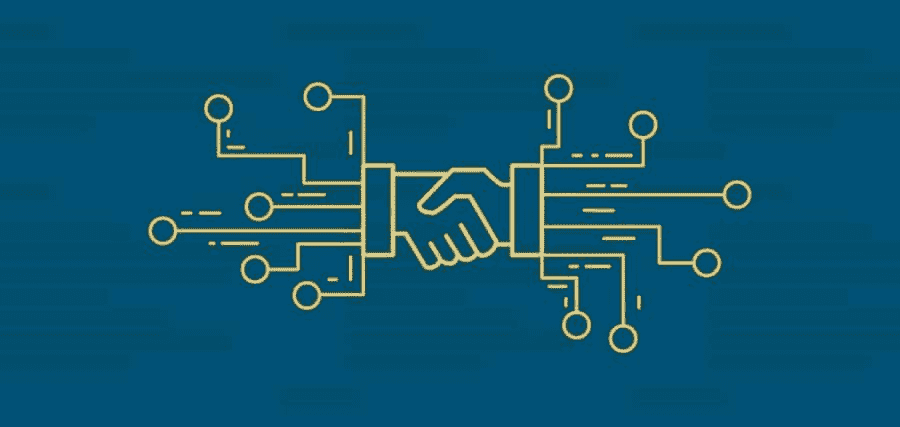
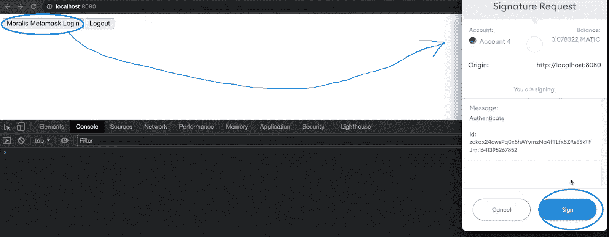
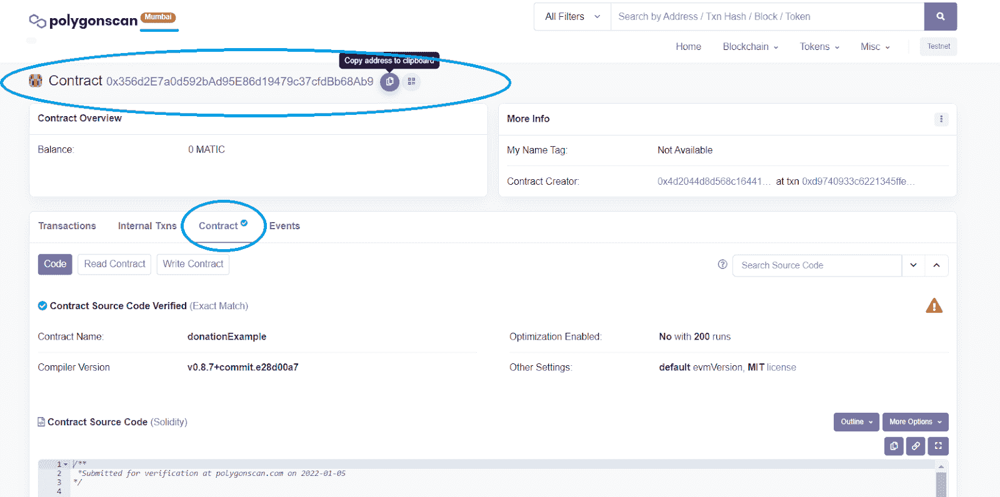
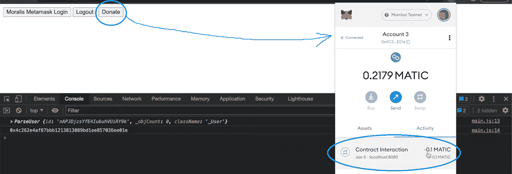

# 如何通过您的网站与智能合约交互

> 原文：<https://moralis.io/how-to-interact-with-smart-contracts-through-your-website/>

主流加密技术的采用还有一段时间。然而，事情确实在朝着那个方向发展。这真的会让你兴奋，因为我们正在进入 Web3 时代，开发者有无数的机会。最终，大多数网站都会加入某种区块链特色。可能只是为了 [**认证**](https://moralis.io/how-to-authenticate-with-metamask/) **用户或者让用户使用其加密货币完成交易。当然，细节将取决于一个网站的目的及其背后的业务。此外，基本上大多数网站都希望让用户通过网站与智能合约进行交互。然而，普通人可能永远不会知道智能合约在背后做着繁重的工作。因此，开发人员需要以无缝的方式实现这种交互。**

幸运的是，今天的文章将向您展示如何通过网站以一种轻松的方式与智能合约进行交互。后者可以通过使用终极 [Web3](https://moralis.io/the-ultimate-guide-to-web3-what-is-web3/) 开发平台 [Moralis](https://moralis.io/) 来实现。这个[的 crypto](https://moralis.io/firebase-for-crypto-the-best-blockchain-firebase-alternative/)Firebase 是任何有兴趣成为区块链开发者的精通 JavaScript 的前端开发者的圣地。此外，Moralis 不仅仅是 fura 替代品中的佼佼者。它为你配备了 [ultimate Web3 SDK](https://moralis.io/exploring-moralis-sdk-the-ultimate-web3-sdk/) ，包括最强大的 [Web3 API](https://docs.moralis.io/moralis-server/web3-sdk/intro) 。因此，它使您能够用简短的代码片段覆盖所有与区块链相关的后端需求。后者由 [Moralis 的文档](https://docs.moralis.io/)巧妙地提供。此外，Moralis 还通过提供全面的跨链互操作性来帮助您的工作经得起未来的考验。尽管如此，开始使用这个神奇的工具是完全免费的，所以请确保今天就[创建您的账户](https://admin.moralis.io/register)。


## 什么是智能合约？

在我们进一步了解如何通过网站与智能合约进行交互之前，让我们确保您都了解基本知识。那么，什么是[智能合约](https://moralis.io/smart-contracts-explained-what-are-smart-contracts/)？如果我们缩小一下，智能合约就是计算机程序。它们是运行在可编程区块链上的代码片段，比如[以太坊](https://moralis.io/full-guide-what-is-ethereum/)。当然，这是看待智能合约最简单也是最宽泛的方式。

但是让我们再深入一点。智能合约确保在满足特定的预定义条件时自动执行特定的预定义操作。因此有了“聪明”的称号。因此，它们是以安全的方式强化规则、指导方针甚至执行的好方法。这包含了高度的信任，使所有相关方不必担心规则被违反。然而，重要的是要记住，智能合约的性能取决于它背后的代码。

此外，请注意，有许多不同的针对特定方面的智能合约。【Solidity smart contracts 的用例基本上是没有限制的。然而，最受欢迎的合同类型之一是 [ERC20 合同](https://moralis.io/what-are-erc20-contracts-full-erc20-contract-guide/)。它们确保正确创建和处理 ERC20 令牌。此外，DAO 智能契约是每个分散自治组织的核心。如果您对创建 DAO 感兴趣，请务必查看我们的 DAO 智能契约示例。此外，我们建议你学习[如何创建智能合同](https://moralis.io/how-to-create-smart-contracts/)。



# 通过道德网站与智能合同互动

您知道吗，您可以创建具有相当高级功能的 [dApps](https://moralis.io/decentralized-applications-explained-what-are-dapps/) (分散式应用程序)，而无需创建自己的智能合约。在这种情况下，您可以围绕现有的智能合约构建功能。这就是我们将要做的，我们将仔细研究如何通过网站与智能合约进行交互。然而，即使您的项目要求创建智能合同，您也不必从头开始。相反，你可以在 [OpenZeppelin](https://moralis.io/what-is-openzeppelin-the-ultimate-guide/) 访问无数的开源智能合同。

接下来，我们将首先向您展示如何设置道德规范。完成初始设置后，您将能够使用 Moralis 通过网站与智能合约进行交互。接下来，我们将向您展示如何在 MATIC 中从头开始创建一个简单的 dApp 来支持捐赠。然而，我们也将为您呈现一个更快的替代方案，使用终极[以太坊 dApp 样板](https://moralis.io/ethereum-dapp-boilerplate-full-ethereum-react-boilerplate-tutorial/)。后者从一开始就为您提供了令人印象深刻的 UI。在这两种情况下，您都有机会创建自己的 dApp，并通过网站与智能合约进行交互。


### 初始道德系统设置-第 1 部分

无论您是从头开始还是使用最实用的 [Web3 样板文件](https://moralis.io/web3-boilerplate-beginners-guide-to-web3/)，您都需要完成 Moralis 设置。按照下面的步骤，你会很快准备好创建你的 dApps。以下是行动步骤:

1.  **创建你的免费道德账户**-如果你还没有创建你的免费道德账户，现在就创建吧。您可以使用简介末尾的链接，它会将您带到注册页面。在那里，输入您的电子邮件并创建您的密码。然后点击确认链接，确认链接将发送到您的电子邮件中。*另一方面，如果你已经有了一个道德家账户，只需简单地* [*登录*](https://admin.moralis.io/login) *到你的管理区。*

2.  [**创建 Moralis 服务器**](https://docs.moralis.io/moralis-server/getting-started/create-a-moralis-server)–在您的 Moralis 管理区域内，导航至“服务器”选项卡(在导航选项卡的左侧)。点击右上角的“+创建新服务器”按钮。从下拉菜单中选择最适合您需求的网络类型(见下图)。*在处理示例项目时，您通常会关注“Testnet 服务器”选项(* [*连接到以太坊测试网*](https://moralis.io/ethereum-testnet-guide-connect-to-ethereum-testnets/) *)。例如，我们将使用 Polygon 的 testnet Mumbai。不过，当你准备好向用户展示你的 dApps 时，你需要创建一个“Mainnet 服务器”来接触你的观众。*


接下来，一个弹出窗口将要求您输入您的服务器名称(这可以是您想要的任何名称)，选择您的地区、网络类型和链。最后，您可以通过单击“添加实例”来启动您的服务器:


*注意* *:因为你的服务器需要几分钟准备好，所以现在跳过下面第二部分的第三和第四步。一旦你有了你的，我们将回到道德体系的那一部分。js“文件或”。env "就绪*

### 初始道德标准设置-第 2 部分

3.  **访问服务器详情**–启动并运行您的服务器和您的”。js“或者”。env "文件准备好了，您想访问您的服务器的详细信息。只需点击“查看详情”按钮:


这样你就可以在一个新窗口中访问你需要的所有信息(主要是“服务器 URL”和“应用程序 ID”)。使用右侧的复制图标(一个接一个)复制这些详细信息:


4.  **初始化 Moralis**–为了最终获得 Moralis 的全部能力，它将覆盖您的后端需求，填充您的编码文件(".js“或者”。env ")以及应用程序 ID 和服务器 URL:
    *   从头开始时，通常会使用“.js”文件连接到一个初始化的 Moralis:


*   当使用 Web3 样板时，您将填充您的"。env "文件:


## 如何通过网站与智能合同交互——一个示例项目

如上所述，我们将指导您完成一个示例项目，在该项目中，我们将创建一个简单的 MATIC 捐赠 dApp。MATIC 是多边形的原生标记。我们将首先从零开始。这个选项非常适合学习如何快速启动自己的项目。当然，这需要你创建自己的 UI。然而，我们也将向您展示用干净醒目的 UI 创建 dApps 的最快方法。由于我们在 GitHub 上公开发布了终极以太坊样板，后者将成为可能。

### 创建 MATIC 捐赠 dApp–从零开始

我们将从一个普通的 JS(普通 JavaScript)项目开始。首先，我们将使用一个非常简单的 HTML 代码作为 dApp 的主干。下面是我们将要开始的 HTML 代码:

```js
<html>
     <head>
          <tittle>Vanilla Boilerplate</title>
          <script src=”https://cdn.jsdelivr.net/npm/[email protected]/dist/web3.min.js”></script>
          <script src=”https://unpkg.com/moralis/dist/moralis.js”></script> 
   </head>

     <body>
          <button id=”btn-login”>Moralis Metamask Login</button>
          <button id=”btn-logout”>Logout</button>
          <script type=”text/javascript” src=”./main.js”></script> 
   </body>
</html>
```

正如承诺的那样，你可以在下面的截图中看到这是一个非常简单和基本的 UI。除了 HTML 文件，我们还需要一个 JS 文件来覆盖 dApp 的后端功能。*这也是你完成“初始道德系统设置-第 2 部分”的第三和第四步的地方。*下面是我们在“main.js”文件中使用的代码:

```js
  /** Connect to Moralis server */
        const serverUrl = "https://xxxxx.yourserver.com:2053/server";
        const appId = "YOUR_APP_ID";
        Moralis.start({ serverUrl, appId });

        async function login() {
            let user = Moralis.User.current();
            if (!user) {
                try {
                    user = await Moralis.authenticate({ signingMessage: "Authenticate" })
                    console.log(user)
                    console.log(user.get('ethAddress'))
                } catch (error) {
                    console.log(error)
                }
            }
        }

        async function logOut() {
            await Moralis.User.logOut();
            console.log("logged out");
        }

        document.getElementById("btn-login").onclick = login;
        document.getElementById("btn-logout").onclick = logOut;
```

查看上面的代码，您已经可以看到 Moralis 提供的一些惊人的快捷方式。例如，只需使用“Moralis.authenticate ”,您就可以使用 Moralis 的元掩码集成登录用户。此外，注销用户是“道德”的一部分。User.logOut()"。

*注意* *:使用上述 JS 代码时，一定要使用你的服务器的详细资料。*

#### 从基础开始–预览

运行上面的代码时，我们可以看到当前的 dApp 在运行:



看上面的截图，你可以看到 UI 按照我们的代码有两个按钮。当我们单击“Moralis 元掩码登录”按钮时，元掩码扩展提示我们确认身份验证。

#### 是时候通过网站与智能合约互动了

下一步是添加合同集成，这将使我们能够使用登录的钱包进行自动捐赠。为了添加这个功能，让我们从在 HTML 代码中添加一个附加按钮开始:

```js
<button id=”btn-donate”>Donate</button>
```

上面一行代码将显示按钮；然而，为了给它分配功能，我们还必须调整我们的 JS 文件。我们需要添加“捐赠”功能，该功能包括与我们的[示例捐赠智能合同](https://mumbai.polygonscan.com/address/0x356d2E7a0d592bAd95E86d19479c37cfdBb68Ab9#code)相关的一些细节。*我们的示例项目是在孟买，因此，我们将在 testnet 上使用一个示例捐赠合同。此外，所有需要的细节都可以在 PolygonScan 上访问，这相当于以太扫描或*[*BSC 扫描*](https://moralis.io/exploring-bscscan-full-guide/) *:*



这里是我们“捐赠”功能的代码:

```js
 async function donate() {
        let options = {
          contractAddress: "0x356d2E7a0d592bAd95E86d19479c37cfdBb68Ab9",
          functionName: "newDonation",
          abi: [
            {
              inputs: [
                { internalType: "string", name: "note", type: "string" },
              ],
              name: "newDonation",
              outputs: [],
              stateMutability: "payable",
              type: "function",
            },
          ],
          Params: {
            Note: "Thanks for your work",
          },
          msgValue: Moralis.Units.ETH(0.1),
        };
        await Moralis.User.logOut();
        console.log("logged out");
      }
```

此外，我们需要通过添加“await Moralis.enableWeb3()”来启用 Web3 功能“登录”函数中的行(在“console.lo(use)上方)).我们还需要在底部添加以下代码行:

```js
document.getElementById("btn-donate").onclick = donate;
```

这是您通过网站与智能合约交互的方式。如果我们运行更新后的代码，我们会看到一切运行顺利:



*注* *:如果你是个比较喜欢视频的人，那就用文末的视频吧。关于使用普通 JS 从头开始构建我们的示例 dApp 的部分从 1:45 开始。*

### 创建捐赠 dApp–使用最终的 Web3 样板和 React

正如所承诺的，我们希望向您展示一种更快的方式，使您能够通过网站与智能合约进行交互。此外，这个快捷方式还为您提供了一个整洁的 UI 和几个额外的有用组件。下面是使用这种方法完成的 dApp 示例的预览:


如果您想要详细的指导设置“[以太坊-样板](https://github.com/ethereum-boilerplate/ethereum-boilerplate)”，请务必观看 9:20 开始的视频。Moralis 的专家将向您展示如何克隆代码，如何在代码编辑器中初始化所有实例，以及如何调整代码。这也是您可以填充。env "文件与您的道德的服务器细节。此外，从 14:13 开始，他还将向您展示如何添加通知用户捐款成功的消息:


这是我们上面提到的视频:

https://www.youtube.com/watch?v=7TKqLJd_aYI

## 如何通过网站与智能合同进行交互–摘要

如果您已经涵盖了以上所有部分，您现在应该知道如何通过网站最轻松地与智能合约进行交互。你知道，多亏了 Moralis，你可以通过使用它的终极 Web3 SDK 在几分钟内创建 dApps。后者使您能够用简短的代码片段满足所有后端需求。此外，您还看到了一个额外的快捷方式。最实用的 Web3 样板文件使您能够创建具有干净 UI 的 dApps。此外，它还配备了许多有用的组件。因此，只需克隆代码，您就可以拥有一个用户就绪的 dApp，它具有令人印象深刻的特性，并且可以立即运行。别忘了你的 dApp 可以跨多个链运行。


如果这个简单的教程启发了你，我们为你准备了更多。查看一下 [Moralis 的 YouTube 频道](https://www.youtube.com/c/MoralisWeb3)和 [Moralis 的博客](https://moralis.io/blog/)，在那里你会找到大量高质量的免费内容。从解释到所有加密领域的示例项目。例如，我们的一些最新文章向您展示了如何[将 mint 功能集成到 JS 接口](https://moralis.io/integrate-mint-function-to-js-interface-nft-development/)，如何[用](https://moralis.io/how-to-index-the-blockchain-the-ultimate-guide/)[智能合约索引](https://moralis.io/the-graph-alternative-for-smart-contract-indexing/)索引区块链，如何[转移 ERC20 令牌](https://moralis.io/erc20-transfer-how-to-transfer-erc20-tokens/)，如何开发一个 [NFT 稀有度](https://moralis.io/how-to-develop-an-nft-rarity-ranking-dapp/)排名 dApp，如何[闪贷](https://moralis.io/how-do-flash-loans-work-full-walkthrough/)工作，等等。然而，如果你想[尽快成为一名区块链开发者](https://moralis.io/how-to-become-a-blockchain-developer/)，我们建议你注册[道德学院](https://academy.moralis.io/)。除了高质量的课程，你还可以接触到热情支持的社区和专家导师。