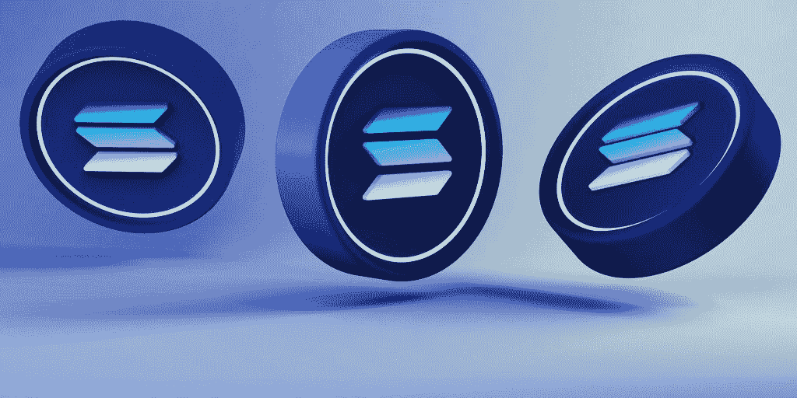

# 如何在 5 个步骤中铸造一枚硬币

> 原文：<https://moralis.io/how-to-mint-a-coin-on-solana-in-5-steps/>

你知道吗，用简单的五个步骤就可以在索拉纳上铸造一枚硬币。如果这听起来令人兴奋，并且您想进入 Solana token 开发，那么请遵循这个涵盖整个过程的分步指南。结合演示如何铸造索拉纳硬币，该指南将简要探讨索拉纳和 SPL 令牌标准的复杂性。因此，如果您想学习 Solana 令牌开发的基础知识，那么您来对地方了！

简而言之，你必须完成以下五个步骤才能在索拉纳上铸造一枚硬币:

1.  先决条件
2.  打造 Solana 钱包
3.  茄属簇构型
4.  获取测试网络解决方案
5.  在索拉纳上铸造一枚硬币

阅读本指南后，您将熟悉铸造 Solana 令牌以及 Solana 令牌开发的来龙去脉。反过来，您可能希望利用您的技能，构建更复杂的兼容 Solana 的 Web3 项目。如果是这样，你应该知道 [Moralis](https://moralis.io) 提供了构建 Solana 兼容的 dapps 的最容易的方法。Moralis 的一个突出的[Web3 API](https://moralis.io/web3-apis-exploring-the-top-5-blockchain-apis/)是 [Solana API](https://docs.moralis.io/reference/solana-api) ，允许你立刻创建 dapps 和其他 web 3 项目！

此外，有了 Moralis，你可以扩展到 Solana 网络之外。Moralis 的跨链能力使得为其他网络开发 dapps 成为可能。事实上，Moralis 提供了为多个不同网络构建 Web3 应用程序的最快方法。如果你对此感兴趣，我们推荐你去看看 Moralis 的[多边形样板](https://moralis.io/polygon-boilerplate-how-to-build-polygon-dapps/)或者 [Cronos 样板](https://moralis.io/cronos-boilerplate-how-to-create-cronos-dapps/)。

此外，无论你是否在寻找为其他网络创建 Solana 项目或 dapps，确保[与 Moralis](https://admin.moralis.io/register) 签约。通过 Moralis，您有机会利用 Web3 的强大功能和 Web2 的无缝开发体验！

## 索拉纳和 SPL 标准——铸造索拉纳硬币

在向您展示如何在 Solana 上铸造硬币之前，我们将从 Solana 和 SPL 令牌标准的复杂性入手，深入了解这一初始部分。

Solana 是一款可编程的开源区块链，强调速度和可伸缩性。这种专注使该网络能够以比竞争对手更低的成本快速促进和处理交易。Solana 的独特卖点之一是该网络实现了一种混合共识机制。索拉纳将更传统的 PoS(利害关系证明)共识与所谓的 PoH(历史证明)相结合。


PoH 本质上是网络给事务加上时间戳的一种方式。因此，Solana 不需要等待事务被放入块中，而是可以以并行方式处理事务，并在以后将它们添加到块中。得益于此，这意味着理论上索拉纳每秒可以处理数十万笔交易。

此外，索拉纳区块链的本地货币被称为索尔，这是一种所谓的 SPL 代币。此外，SPL 基本上就像 ERC 20、ERC 271 和 ERC 1155 之于区块链以太坊。因此，SPL 可以被视为索拉纳链的象征性标准。

但是，如果您熟悉以太坊令牌开发，您会知道 ERC-20 规范可替换令牌，ERC-721 处理 NFT。在 Solana 网络中，只有一个程序定义了 NFTs 和可替换令牌的通用实现。因此，索拉纳有一个规范这两种令牌类型的标准，称为 SPL。

现在，我们已经涵盖了索拉纳和 SPL 标准，是时候深入到以下部分，并说明如何铸造一枚硬币的索拉纳！

## 如何在索拉纳上铸造硬币——5 步分解

随着对索拉纳和 SPL 标准有了更深刻的理解，现在是时候更深入地研究这个“*如何在索拉纳*上铸造硬币”教程的中心部分了。此外，为了使这个过程更容易理解和简单明了，本文将其分为以下五个步骤:

1.  先决条件–安装 Rust、Solana CLI 和 SPL CLI。
2.  **创建 Solana Wallet**–设置 Solana 文件系统 Wallet。
3.  **Solana 集群配置**–进行配置以确保您在正确的网络或集群上。
4.  **获取 Testnet SOL**–获取测试 SOL 以在开发过程中使用。
5.  **在索拉纳上铸造一枚硬币**–使用 SPL CLI 创建一枚硬币，设置供应，然后铸造硬币。



按照上面的步骤，你可以马上在索拉纳上铸造一枚硬币！现在，如果您想创建 NFT，过程并没有太大的不同。因此，你将能够使用相同的基本原则来创建类似的索拉纳 NFT。此外，如果你对 Solana token 开发更感兴趣，请查看我们来自 Moralis 的关于如何[创建你自己的 Solana NFT](https://moralis.io/solana-nft-mint-tools-create-your-own-solana-nft/) 的指南。本文通过演示如何构建一个 NFT 造币工具，进一步涵盖了 Solana 令牌开发的复杂性！

尽管如此，让我们继续讨论在索拉纳上铸造硬币所需的先决条件，然后直接进入教程。

### 步骤 1:先决条件

因为 Rust 是 Solana token 开发的主要编程语言，所以这个关于如何在 Solana 上铸造硬币的五步教程的第一部分围绕着 Rust 的安装。所以，如果你还没有，让我们继续安装一些防锈工具！

如果您使用的是 macOS 或 Linux 设备，可以通过在终端中运行以下命令来安装 Rust:

```
curl https://sh.rustup.rs -sSf | sh
```

另一方面，如果你在 Windows 设备上，你可以下载并运行下面的代码:“[](https://win.rustup.rs/)*”。运行此命令将在控制台中启动安装。然而，无论您选择哪种方法，一旦安装过程完成，它将显示以下消息:*

*

第二个先决条件是安装 Solana CLI(命令行界面)。根据您使用的是 macOS/Linux 还是 Windows 设备，这里有两种方法可供您在终端中运行:

*   **对于 macOS/Linux:**

```
sh -c "$(curl -sSfL https://release.solana.com/v1.9.5/install)"
```

*   **对于 Windows:**

```
curl https://release.solana.com/v1.9.5/solana-install-init-x86_64-pc-windows-msvc.exe --output C:\solana-install-tmp\solana-install-init.exe --create-dirs
```

有了 Solana CLI，第一步的下一步是安装 SPL CLI。由于您先前安装了 Rust，您可以运行下面的" *cargo"* 命令来这样做:

```
cargo install spl-token-cli
```

*【货】*命令实质上是“*【NPM】*或“*【纱】*为锈。尽管如此，这涵盖了如何在索拉纳铸造硬币的教程的先决条件。以下步骤将说明如何设置一个索拉纳钱包！

### 第二步:创建一个索拉纳钱包

先决条件确定后，本节将说明如何设置 Solana 文件系统 wallet。文件系统钱包用于测试目的；但是，对于 Web3 项目的实际生产，并不推荐使用。

然而，要创建文件系统 Solana wallet，请在终端中输入并运行以下命令:

```
solana-keygen new --no-outfile
```

一旦你运行上面的命令，它应该立刻自动设置 Solana 钱包。为了确保一切正常，您可以输入以下命令来检查您的钱包余额:

```
solana balance
```

但是，由于您刚刚从头开始创建钱包，它应该显示“0 SOL”的余额。然而，在第四步中，我们将简要地向您展示如何向这个文件系统 Solana wallet 添加一些 testnet SOL。

### 步骤 3: Solana 集群配置

在将 testnet SOL 添加到您的 Solana wallet 之前，您必须确保您处于正确的网络或集群中。如果没有，您将需要对 Solana 集群进行配置。要检查当前群集配置，您可以运行以下命令:

```
solana config get
```

运行上面的命令应该会提供与下面类似的响应:


如图所示，我们当前连接到了 testnet。但是，您可以通过在终端中运行以下命令，将集群更改为另一个网络，例如 devnet:

```
solana config set --url https://api.devnet.solana.com
```

如果您决定更改群集配置，可以通过再次运行之前的命令来确保一切正常运行:

```
solana config get
```

这涵盖了在索拉纳上铸造硬币所需的第三步。现在，让我们进入本教程的下一步，探索如何获取 testnet SOL！

### 步骤 4:获取 Testnet Sol

如果你遵循了本教程的第二步，你就刚刚创建了你的 Solana 钱包。如果是这种情况，钱包的余额将是零，这是我们现在要改变的。教程的这一步演示了如何获取一些 testnet SOL 供您在开发过程中使用。

获取 testnet SOL 相对简单，您需要做的就是在终端中运行以下命令:

```
solana airdrop 1
```

一旦您运行该命令，它应该会添加一个 testnet SOL 到您的 Solana wallet 中。为了确保一切都正确执行和工作，您可以继续运行下面的命令来检查余额:

```
solana balance
```

当你将溶胶空投到钱包中时，它现在应该说“1 溶胶”而不是“0 溶胶”。这涵盖了在索拉纳上铸造硬币所需的第四步！在接下来的部分，文章探索了教程中最核心的部分——如何在索拉纳上铸造硬币！

### 第五步:在索拉纳上铸造一枚硬币

既然您已经完成了所有的先决条件，获得了一个带有 testnet SOL 的 Solana wallet，并且进行了适当的集群配置，那么是时候展示如何在 Solana 上铸造硬币了。因此，要使用 SPL CLI 创建 Solana 令牌，请运行以下命令:

```
spl-token create-token
```

运行上面的命令将创建令牌并提供令牌标识符:


最初，当您创建 Solana 令牌时，供应应该等于零。您可以通过使用令牌标识符运行以下命令来检查这一点:

```
spl-token supply <token-identifier>
```

由于初始供应量为零，您需要重新制造一个供应量。为此，您必须首先为令牌创建一个帐户。默认情况下，大多数 Solana 程序没有存储功能。因此，为了能够存储任何数据，您需要创建一个令牌帐户。创建帐户很容易；您只需在终端中使用令牌标识符运行以下命令:

```
spl-token create-account <token-identifier>
```

既然代币有了账户，就可以在索拉纳上铸造硬币了。您只需使用令牌标识符在终端中输入以下命令，并指定令牌数量:

```
spl-token mint <token-identifier> <token-amount>
```

运行上面的命令会将指定数量的 Solana 令牌存入您的钱包。此外，为了确保一切按预期运行，请通过在终端中输入以下命令来检查您钱包中特定令牌的令牌余额:

```
spl-token balance <token-identifier>
```

现在就是这样！你现在可以在索拉纳上铸造一枚硬币。此外，这是一个可替换的令牌，如果您想创建不可替换的令牌，过程并没有太大的不同！如果 NFT 的发展让你兴奋，看看 Moralis 的 [NFT API](https://moralis.io/nft-api/) 让你立刻创建复杂的 NFT 相关项目！

## 总结——如何在索拉纳铸造硬币

本文深入探讨了 Solana、SPL 令牌标准和 Solana 令牌开发的复杂性。更具体地说，指南的中心部分说明了如何在 Solana 上铸造硬币，只需五个步骤:

1.  先决条件
2.  打造 Solana 钱包
3.  茄属簇构型
4.  获取测试网络解决方案
5.  在索拉纳上铸造一枚硬币

按照上述步骤，任何人都可以在索拉纳上铸造一枚硬币。此外，尽管本文关注的是可替换令牌的开发，但是在创建 NFT 时也可以应用同样的原则。然而，如果你跟随教程，你现在将有希望拥有在索拉纳上铸造硬币所需的技能！

如果你觉得这个教程很有帮助，可以在 Moralis 的 [Web3 博客](https://moralis.io/blog/)上查看更多精彩的指南。例如，如果你对索拉纳特别感兴趣，我们建议查看我们关于[索拉纳智能合同建筑](https://moralis.io/solana-smart-contract-building/)或如何[建造索拉纳 NFT 探索者](https://moralis.io/how-to-build-a-solana-nft-explorer/)的指南。


然而，Moralis 并不局限于 Solana，您可以在 Web3 开发的几个方面使用 Moralis 的工具。例如，如果你想提高你的 Web3 开发能力，你应该看看最近发布的 Moralis [Web3 Streams API](https://moralis.io/streams/) 。这个工具允许你通过 webhooks 将区块链数据传输到你所有项目的后端。此外，该 API 支持多种网络，如以太坊、多边形、BNB 链、Fantom、Avalanche 等。

你是哪种类型的 Web3 开发者并不重要；[立即与 Moralis](https://admin.moralis.io/register) 签约，增强您的 Web3 开发能力！有了 Moralis，您可以通过利用 Moralis 的 API 更快更智能地构建，弥合 We2 和 Web3 之间的差距，从而充分释放区块链的力量！*