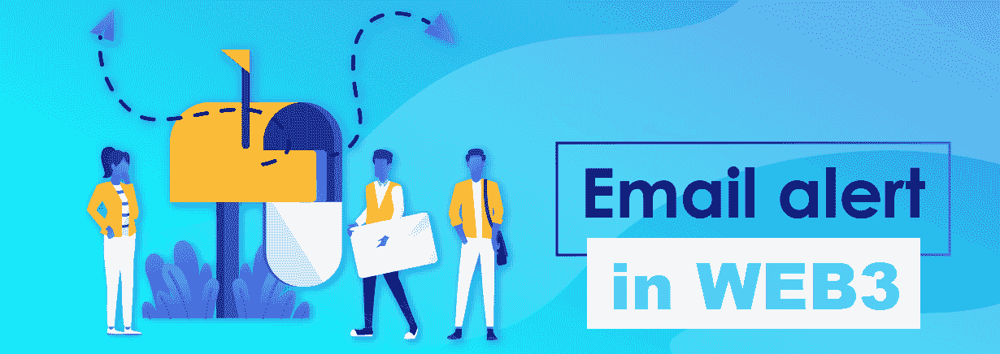
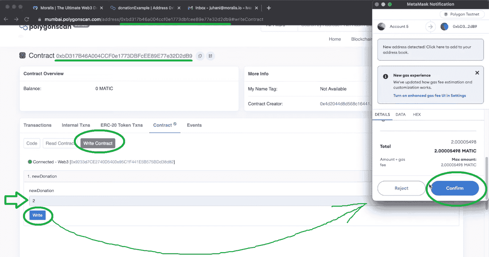
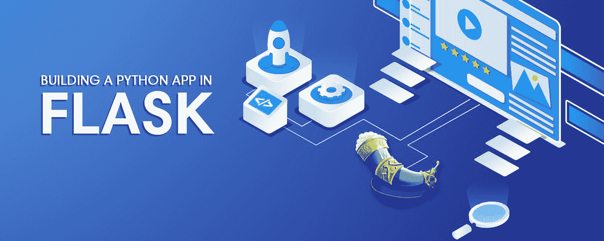
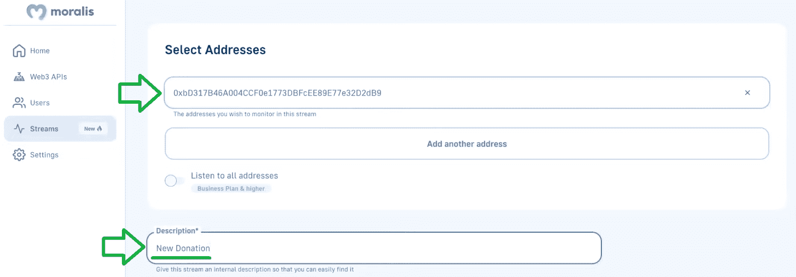

# 如何使用 Python 设置自动化的 Web3 通知电子邮件

> 原文：<https://moralis.io/how-to-set-up-automated-web3-notification-emails-with-python/>

如果你想知道如何设置自动化的 Web3 通知邮件，但需要帮助你知道从哪里开始，这篇文章就是为你准备的！即使您完全是区块链开发的初学者，我们也会帮助您迎头赶上。毕竟，我们将从解释 Python 和 Flask 是什么开始。一旦我们确保你们都跟上了速度，我们将进行一个示例项目，在那里你将有机会用 Python 和[**Web3 web hooks**](https://moralis.io/web3-webhooks-the-ultimate-guide-to-blockchain-webhooks/)**设置自动 web 3 通知电子邮件。**

[Moralis](https://moralis.io/) 是区块链 API 的最终 [Web3 提供商](https://moralis.io/web3-provider-why-blockchain-developers-should-use-one/)。因此，如果您想快速、轻松地创建分散式应用程序(dapps ),它是一个不可或缺的工具。此外，Moralis 的跨链互操作性使您能够创建多链 dapps。您只需要调整一行代码来定位另一个链。此外，Moralis 使您能够使用您熟悉的传统工具加入 Web3 革命。虽然在本文中我们将重点关注 Python 的使用，但 Moralis 支持所有领先的遗留开发平台、框架和语言。从本质上讲，Moralis 使您能够用 API 更快、更智能地构建 Web2 和 Web3 之间的开发鸿沟。

除了我们将用来设置自动化 Web3 通知电子邮件的 [Streams API](https://moralis.io/streams/) 之外，Moralis 还提供了全面的 Web3 APIs。这包括终极 [NFT API](https://moralis.io/nft-api/) 、 [Web3 Auth API](https://moralis.io/authentication/) 、 [Token API](https://moralis.io/token-api/) 等等。所以，创建你的[免费道德账户](https://admin.moralis.io/register)并跟随我们吧！

### Python 和 Flask 是什么？

Python 是一种清晰而强大的面向对象编程语言。在许多方面，将 Python 与其他几种编码语言进行比较是安全的。其中包括 Ruby、Scheme、Perl 和 Java。


值得指出的是，Python 不像 JavaScript 那样流行和广泛使用。然而，它仍然是领先的编程语言之一，Python 有着悠久的历史。毕竟，多亏了它的开发者吉多·范·罗苏姆，它在 1991 年首次出现。Python 的主要目标是让开发人员尽可能简单明了。根据了解和使用这种语言的人的意见，Python 相当容易入门、学习和使用。尽管如此，正如“*python.org*”所说，Python 是一种让你快速工作并更有效地集成系统的编程语言。

Flask 是一个 web 框架，一个让你轻松开发 web 应用的 Python 模块。此外，Flask 有一个小且易于扩展的内核。毕竟，它是一个不包含 ORM(对象关系管理器)或 ORM 相关特性的微框架。尽管如此，Flask 还是有很多优秀的特性。例如，它包括 URL 路由和模板引擎。此外，请注意，Flask 是一个 web 服务器网关接口(WSGI) web app 框架。此外，这个 Python 框架是由阿明·罗纳彻开发的，他领导着 Poocco——一个由国际 Python 爱好者组成的团队。因此，Flask 基于另外两个 Poocco 项目 Werkzeg WSGI 工具包和 Jinja2 模板引擎就不足为奇了。



## 使用 Python 和 Moralis 的 Streams API 设置自动化的 Web3 通知电子邮件–示例项目

现在你知道 Python 和 Flask 是什么了，是时候向你展示自动化的 Web3 通知电子邮件设置过程了。然而，我们认为，如果您首先看到使用 Python 和 Moralis 的最终结果，这才是公平的。因此，在演示如何设置自动化的 Web3 通知电子邮件之前，让我们快速演示一下我们的示例后端 dapp！

### 自动 Web3 通知电子邮件的设置–演示

为了演示自动 Web3 通知电子邮件的结果，我们将使用一个 Gmail 帐户、一个区块链浏览器(PolygonScan)和最流行的 Web3 钱包 MetaMask。

首先，让我们看看下面的屏幕截图，它展示了我们从一个空的电子邮件收件箱开始:


我们打开 PolygonScan(孟买测试网)浏览器，因为孟买是我们的智能合约所在的测试网。如您所知，区块链资源管理器还使您能够与部署的智能合约进行交互。因此，我们打开示例智能合同地址的页面，并在“合同”选项卡中选择“编写合同”选项:



然后，正如你在上面的截图中看到的，我们在“newDonation”字段中输入“2”(这可以是我们的余额可以支付的任何金额)，然后点击“Write”按钮。这个按钮触发我们的 MetaMask 扩展，它连接到多边形 Mumbai testnet。正如您在上面看到的，我们需要通过单击“确认”按钮来确认交易通知。在此操作之后，我们的终端通知我们已经发送了一封电子邮件:


当我们返回电子邮件收件箱时，我们可以看到“新捐赠”电子邮件:


最后，让我们也检查一下此示例通知电子邮件的详细信息:


查看上面的截图，您可以看到我们已经设置了自动的 Web3 通知电子邮件，其中包括捐赠者的钱包地址和他们以 MATIC(多边形链的本地货币)捐赠的金额。

如果您想为链上事件设置这种电子邮件通知自动化，请务必卷起袖子，跟随我们的领导完成下面的部分。

## 如何使用 Python 和 Moralis 的 Streams API 设置自动化的 Web3 通知电子邮件–分步教程

在今天文章的这一部分，我们将引导您完成以下四个阶段，您将有机会跟随我们的脚步:

1.  安装烧瓶
2.  Moralis 和 Streams API 的初始设置
3.  接收 Web3 Webhooks
4.  自动化电子邮件

我们将为您提供截图，帮助您正确完成上述四个阶段中的每一个。然而，在这篇文章的底部，你还可以找到一个详细的视频教程，教你如何设置自动化的 Web3 通知邮件。请注意，我们偶尔会提到该视频的特定时间戳。



### 安装烧瓶

为了清楚起见，我们鼓励你以我们为榜样，使用 Visual Studio 代码(VSC)。接下来，创建“自动邮件”文件夹，并在 VSC 中打开它。然后，您可以通过输入以下命令来启动 Python 虚拟环境:

```js
python3 -m venv venv
```

上述命令将在“automateEmails”文件夹中创建一个“venv”文件夹:


接下来，您需要运行以下命令行:

```js
Source venv/bin/activate
```

作为成功激活虚拟环境的确认，您应该会在终端中看到“ *(venv)* ”:


在虚拟环境运行的情况下，使用以下命令继续安装最新版本的“ *pip* ”:

```js
pip install --upgrade pip
```

接下来，是时候安装所有的依赖项了。因此，输入以下命令:

```js
pip install flask flask_cors 
```

安装完依赖项后，转到项目树并创建一个新的 Python 文件。请随意称呼它。然而，为了避免任何混淆，使用与我们相同的名称“backend.py”可能更安全:


然后，使用以下代码行导入一个示例 Flask 应用程序:

```js
from flask import Flask
from flask import request
from flask import jsonify
from flask_cors import CORS

app = Flask(__name__)
CORS(app)

@app.route('/streams', methods=["POST"])
def streams():

   return jsonify(success=True)

if __name__ == "__main__":
    app.run(host="127.0.0.1", port=3000, debug=True)
```

上面的模板代码包括一个端点，您可以将它用作 webhook URL。因此，您可以使用 Moralis 的 Streams API 将区块链事件作为 webhooks 发送到该端点。至此，您已经知道后者是设置自动化 Web3 通知电子邮件的关键。

### Moralis 和 Streams API 的初始设置

接下来，您需要添加适当的功能来处理您将从 Moralis 收到的 Web3 webhook。因此，您将在“ *@app.route* ”中添加大部分附加代码(见上文)。然而，首先，您需要完成初始的 Moralis 设置。因此，请确保你有你的道德帐户启动和运行。如果您还没有创建它，您可以使用开头所述的链接或点击 [Moralis 主页](http://moralis.io)上的“免费开始”按钮:


准备好您的 Moralis 帐户后，您就可以访问您的管理区了。在那里，您需要从侧面菜单中选择“Streams”选项卡。进入“流”页面后，您需要点击“新流”按钮:


在下一步中，您可以选择一个流模板或从头开始创建一个，这就是我们将要设置的自动化 Web3 通知电子邮件。因此，请确保点击“从头开始创建”按钮:


接下来，您需要输入相关智能合约的详细信息。当然，您可以使用任何您希望的智能合约。然而，为了这个示例项目，我们建议您关注上面介绍的“donationExample”智能契约(4:39)。你可以通过使用上面看到的 PolygonScan 页面获得关于这个智能合同的所有细节。在顶部，您需要粘贴合同的地址:



正如你在上面看到的，你还需要给你的流一个描述。然后，您还需要提供您的 webhook URL，添加一个标签，并选择 networks。有了所有的细节，你就可以点击“创建流”按钮了。更多细节，请看下面的视频，从 5:26 开始。

### 接收 Web3 Webhooks

创建了上面的流之后，你就可以开始自动接收 Web3 的 webhooks 了。要看到这一点，请确保按照下面的视频(9:12)和执行一个捐赠的例子。如果你想这样做，你需要一个 MetaMask 扩展和一些 test MATIC，你可以使用 Polygon 水龙头。本质上，您将执行与上述演示相同的步骤。

由于您尚未设置自动 Web3 通知电子邮件，因此您只能在终端中查看结果。然而，你会看到你得到了所有你需要的信息。因此，您只需要触发“电子邮件发送”，并在这些通知电子邮件中包含所需的详细信息(捐赠者的地址和捐赠金额)。

在视频的 11:57，您还可以学习如何在开发 dapp 的同时暂停您的流:


### 自动化电子邮件:自动 Web3 通知电子邮件的设置

为了完成今天教程的最后阶段，您需要重新关注“backend.py”脚本。首先，你需要在顶部导入“ *EmailMessage* ”、“ *ssl* ”和“ *smtlib* ”。接下来，您必须初始化一些关键变量。最终，“backend.py”的前十二行应该是这样的:

```js
from flask import Flask
from flask import request
from flask import jsonify
from flask_cors import CORS
from email.message import EmailMessage
import ssl
import smtplib

emailPass = ""
email = ""
emailReceiver = ""
subject="New Donation"
```

查看上面的代码行，您会发现需要在“email”和“emailReceiver”旁边提供您的电子邮件地址，如下所示:


当然，您可以向任何您想要的电子邮件地址(或地址列表)发送通知电子邮件。尽管如此，请务必从 13:13 开始观看下面的视频，并了解如何从 Gmail 获取您的“ *emailPass* ”。

最后，是时候在“ *@app.route* ”中添加必要的代码行了:

```js
@app.route('/streams', methods=["POST"])
def streams():

    if (request.json['confirmed']):
        return jsonify(success=True)

    details = request.json["txs"]

    for donation in details:

        amount = int(donation['value'])/1000000000000000000
        em = EmailMessage()
        em['From'] = email
        em['To'] = emailReceiver
        em['Subject'] = subject

        em.set_content(donation['fromAddress'] + " has just sent you " + str(amount) + " in MATIC!")

        context = ssl.create_default_context()

        with smtplib.SMTP_SSL('smtp.gmail.com', 465, context=context) as smtp:
            smtp.login(email, emailPass)
            smtp.sendmail(email, emailReceiver, em.as_string())

    print("Email Sent")

    return jsonify(success=True)
```

同样，我们建议您使用下面的视频进行更详细的代码演练。而且，你可以在 [GitHub](https://github.com/MoralisWeb3/youtube-tutorials/blob/main/automateEmails/backend.py) 上访问最终代码。最后但同样重要的是，这里的视频教程包含了成功设置自动化 Web3 通知电子邮件所需的所有详细信息:

[https://www.youtube.com/embed/PO34iuXZ7DA?feature=oembed](https://www.youtube.com/embed/PO34iuXZ7DA?feature=oembed)

## 如何使用 Python 设置自动化的 Web3 通知电子邮件–摘要

我们在今天的文章中谈了相当多的内容。从基础开始，我们回答了“什么是 Python 和 Flask？”问题。然后，我们直接进入设置自动化 Web3 通知电子邮件的过程。因此，您会看到，一旦执行了链上事务，就会发送一封电子邮件通知我们该链上事件。最后，我们还向您介绍了设置自动化 Web3 通知电子邮件所需完成的四个主要阶段。因此，您现在知道如何轻松监听智能合约事件，并确保这些事件触发通知电子邮件。

如果感兴趣，可以使用 [Web3 Python SDK 文档](https://docs.moralis.io/docs/your-first-dapp-python)，我们的[区块链开发视频](https://www.youtube.com/c/MoralisWeb3)，以及我们的[加密博客](https://moralis.io/blog/)来进一步扩展您对区块链开发的了解。这些渠道为您提供了无数的教程和区块链发展的话题。例如，一些最新的文章涵盖了 [Web3 Python](https://moralis.io/web3-python-python-web3-development-made-easy/) 开发、[区块链基础设施公司](https://moralis.io/blockchain-infrastructure-companies-how-to-choose-the-right-provider/)、[区块链基础设施即服务](https://moralis.io/what-is-blockchain-infrastructure-as-a-service/)等等。此外，博客还涵盖了新推出的区块链网络。随着新推出的区块链网络，许多人想知道是否会有另一家连锁店将以太坊挤出可编程区块链的排行榜。如果你是其中之一，看看我们的文章，探索[手掌网络](https://moralis.io/palm-blockchain-what-is-the-palm-network/)和以太坊的下一代 L2·区块链—[乐观主义](https://moralis.io/exploring-the-optimism-network-a-next-gen-l2-blockchain-for-ethereum/)。你也可以报名参加[道德学院](https://academy.moralis.io/)成为区块链认证。你可以从学院的区块链基础开始，或者专注于更高级的课程，比如[以太坊 dapp 编程](https://academy.moralis.io/courses/ethereum-dapp-programming)。