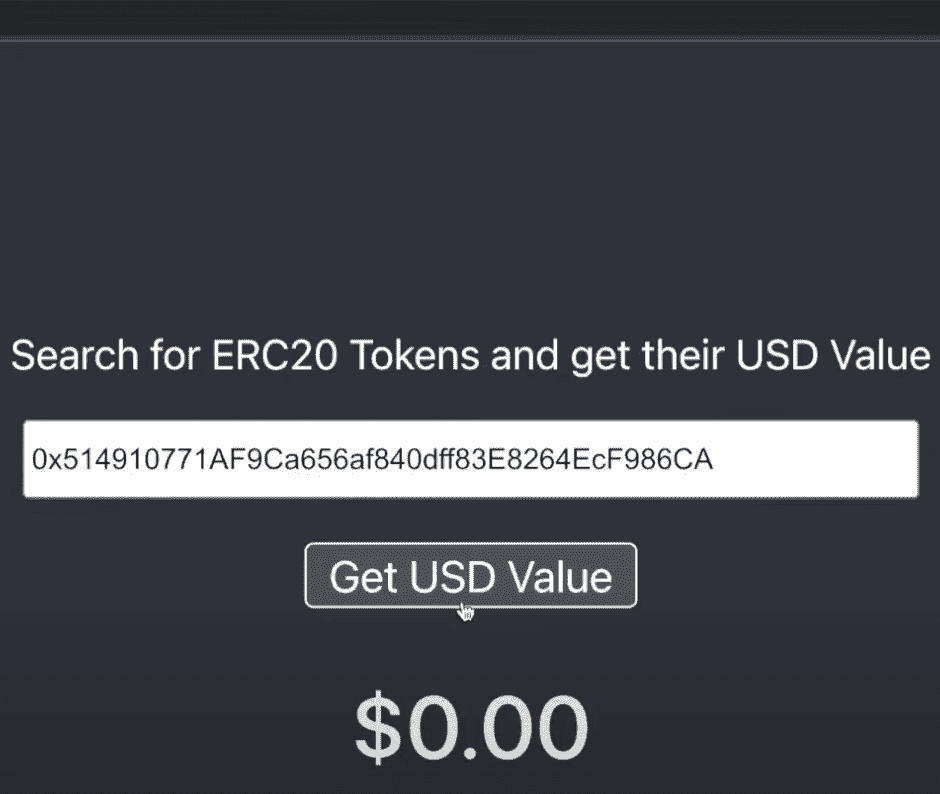
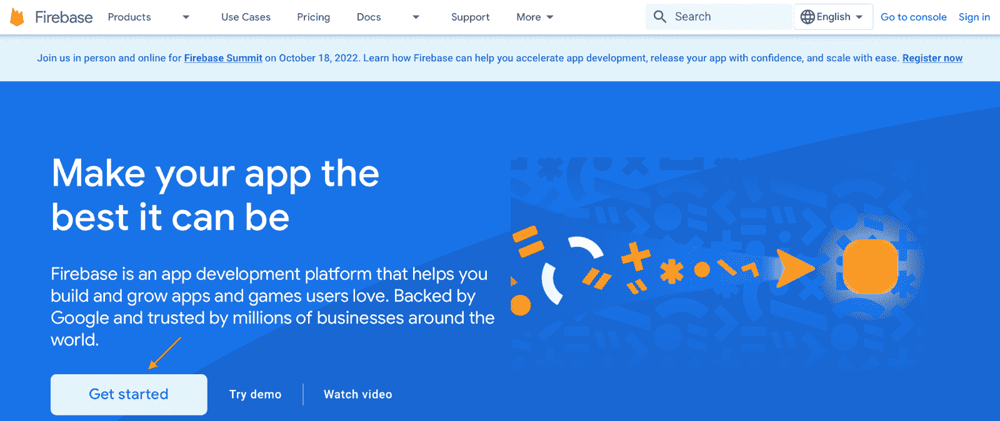
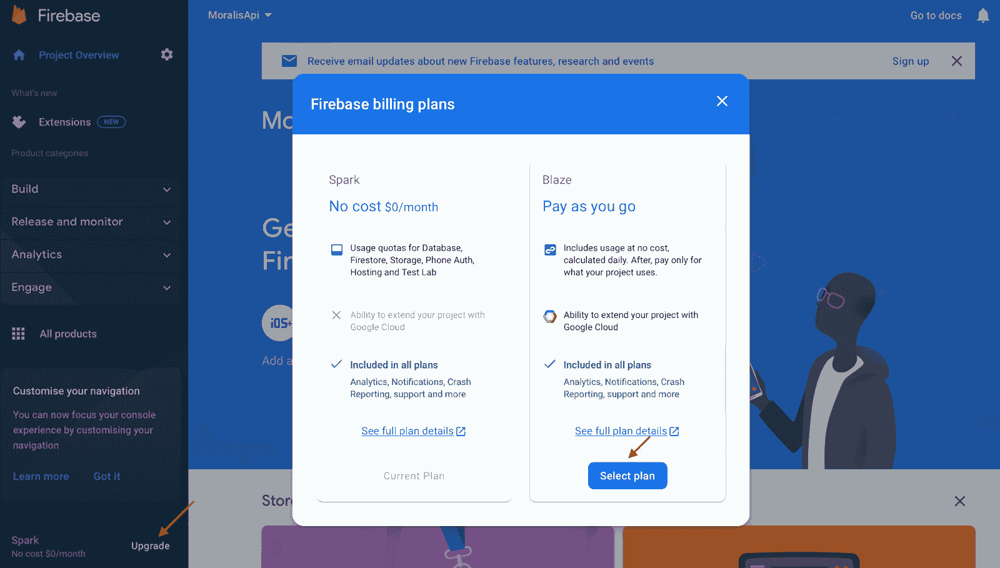
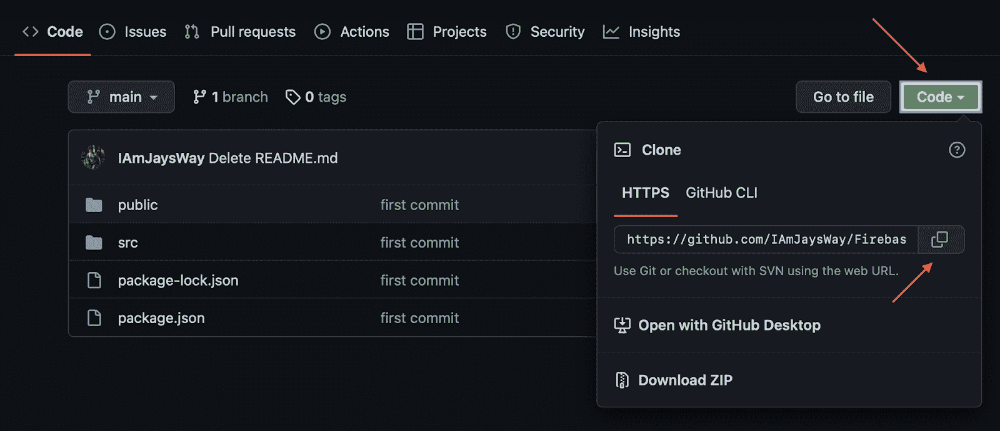

# 如何使用 Firebase 作为 Web3 的代理 API

> 原文：<https://moralis.io/how-to-use-firebase-as-a-proxy-api-for-web3/>

你知道吗，在与 [Moralis](https://moralis.io) 合作时，你可以很容易地使用 Firebase 作为 Web3 的代理 API。如果这听起来很有趣，请跟随我们演示如何创建 Firebase cloud 函数作为 Moralis Web3 API 调用的代理 API。以这种方式使用代理 API 允许您将 API 密钥安全地保存在 Firebase 后端服务器上。因此，您的应用程序的所有私钥都不会受到客户端应用程序的攻击。此外，它允许您在后端处理 API 调用，并且只返回用户请求的信息！

为了说明 API 功能以及如何使用 Firebase cloud 函数作为 Web3 的代理 API，我们将创建一个简单的 React dapp，用户可以在其中根据他们的合同地址查询令牌的美元价格。接下来，您将学习如何使用 Moralis 的" *getTokenPrice* "端点来创建 Firebase 云函数，该函数从以太坊网络获取链上数据。因此，如果您对此感兴趣，请跟随我们向您展示如何轻松地使用 Firebase 作为 Web3 的代理 API！

此外，如果你对 Moralis 的[web 3 API](https://moralis.io/web3-apis-exploring-the-top-5-blockchain-apis/)有进一步的兴趣，你可以，例如，查看一下 [NFT API](https://moralis.io/nft-api/) 。这个工具可以让你有效地建立与 NFT 相关的项目。如果 NFT 的发展让你兴奋，我们推荐看看这篇关于如何[建造索拉纳 NFT 探索者](https://moralis.io/how-to-build-a-solana-nft-explorer/)的文章！

尽管如此，[加入 Moralis](https://admin.moralis.io/register) 释放区块链的力量，用 API 构建更智能的 Web2 和 Web3。创建一个帐户是免费的，只需要几秒钟，所以你不会有任何损失！

## 什么是 Firebase？

Firebase 是一个应用程序开发平台，使您能够构建、发展、改进和维护用户喜欢的游戏和应用程序。该平台由谷歌的基础设施支持和构建，全球数百万企业使用 Firebase。


Firebase 提供的工具和特性涵盖了开发人员通常需要自己构建的大部分服务。这些工具和功能包括数据库、配置、认证、分析、文件存储、推送消息等。此外，这些服务托管在云中，Firebase 提供了巨大的扩展机会，几乎不需要开发人员付出任何努力。因此，通过该平台，可以避免“重新发明轮子”，并专注于创建更具吸引力的 dapp 体验。

那么，服务“托管在云中”到底意味着什么呢。在这种情况下，它表明 Firebase 的产品有完全由谷歌操作和维护的后端组件。此外，Firebase 提供的客户端 SDK 与这些后端服务交互，您不需要在项目和服务之间设置任何中间件。

总之，Firebase 通过提供广泛的工具包和各种服务，促进更无缝的开发者体验，使 dapp 和游戏开发更容易访问。因此，在使用 Firebase 时，可以避免多余的任务，您可以专注于为客户创造更高的价值。

有了对 Firebase 的更好理解，我们将利用前面的章节更深入地研究使用 Firebase 作为 Web3 的代理 API 的过程！

## 使用 Firebase 作为 Web3 的代理 API

对 Firebase 有了更深刻的理解后，现在是本教程的核心部分，我们将说明如何创建 Firebase 云函数作为 Moralis Web3 API 调用的代理 API。

使用 Firebase 作为 Web3 的代理 API 允许您在 Firebase 的后端服务器上安全地存储您的 Moralis API 密钥，同时提供在后端处理所有 Web3 API 响应的机会。反过来，您有机会简单地将用户查询的必要数据传递到应用程序的客户端。

为了演示如何使用 Firebase 来为 Web3 设置代理 API，本教程将介绍构建 React dapp 的必要步骤，React dapp 允许用户根据合同地址查询以美元表示的当前令牌价格。此外，这是 dapp 的 UI(用户界面)的外观:



在本例中，我们利用 Moralis 的" *getTokenPrice* "端点来创建一个云函数，该云函数可以直接从以太坊网络轻松获取所需的[链上数据](https://moralis.io/on-chain-data-the-ultimate-guide-to-understanding-and-accessing-on-chain-data/)。也就是说，Moralis 为 NFT、块、事务、余额等提供了大量不同的端点。因此，它不会限制您只能根据地址查询令牌价格。如果您继续学习，您将会了解到您可以将本指南中相同的基本原则用于其他端点。

此外，感谢 Moralis，您将能够立即为 Web3 创建这个代理 API！此外，如果你想看一段概述整个过程的视频，可以看看下面来自 [Moralis 的 YouTube](https://www.youtube.com/channel/UCgWS9Q3P5AxCWyQLT2kQhBw) 频道的视频:

https://www.youtube.com/watch?v=iSg7uq2ZWgM

然而，在向您展示如何为 Web3 设置代理 API 之前，您必须考虑几个先决条件，我们将在下一节中介绍它们！

### 先决条件–建立道德和煽动基础

在进入本教程的中心部分之前，您必须设置 Moralis 和 Firebase 的帐户，以及一个 Firebase 项目。因此，我们将很快涵盖这些先决条件，从建立自己的道德帐户开始！

创建 Moralis 帐户非常简单，只需点击 Moralis 网站右上角的“[免费开始](https://admin.moralis.io/register)”按钮:


在那里，你必须输入一个电子邮件地址，创建一个新的密码，检查“我接受…”按钮，并点击“注册”。更重要的是，你应该知道创建一个道德账户是完全免费的！

有了 Moralis 账户，你必须注册 Firebase 并创建一个新账户。因此，请浏览 Firebase 的网站并点击“开始”按钮:



这允许您使用现有的 Google 帐户登录或从头创建一个。登录后，您还需要通过点击“创建项目”来创建一个新项目:


在那里，遵循 Firebase 的说明，并根据您的开发需求选择选项。然而，一旦您创建了项目，您需要将计费计划从“Spark”更改为“Blaze”，这是确保云功能按预期工作所必需的。不过，要做到这一点，请点击左下角的“升级”并选择“火焰”:



这是一个“现收现付”的计划；然而，只有当你的请求数量达到一定数量时，谷歌才会开始收费。因此，对于本教程，测试应用程序很可能是免费的。

尽管如此，这涵盖了必要的先决条件。是时候向您展示如何使用 Firebase 作为 Web3 的代理 API 了！

## 克隆 React Dapp–为 Web3 创建代理 API

先决条件确定后，本“Firebase 作为 Web3 的代理 API”教程的第一部分围绕着将 React 应用程序存储库克隆到您的本地目录。因此，您必须首先打开一个 IDE(集成开发环境)并创建一个新文件夹。我们将使用 VSC (Visual Studio 代码)，并将文件夹命名为“FIREBASEMORALIS”。

从那里，继续从 GitHub 获取存储库 URL。您可以在下面找到回购的链接:

【Web3 文档代理 API-[**https://github . com/IAmJaysWay/FirebaseProxyFrontend/tree/main**](https://github.com/IAmJaysWay/FirebaseProxyFrontend/tree/main)

**打开 GitHub 存储库后，您可以通过点击绿色的“Code”按钮并复制存储库 URL 来获取 repo URL:**

**

接下来，导航回您的 IDE 并打开一个新的终端。如果您使用的是 VSC，请点击顶部的“终端”，然后点击“新终端”:


在那里，使用存储库 URL 输入下面的命令，然后按 enter 键。此外，请确保您位于先前创建的文件夹的位置:

```
git clone “REPOSITORY_URL”
```

一旦按下 enter 键，它就会自动将项目克隆到您的本地目录中，您应该会在 IDE 中找到“frontend”文件夹。本质上就是这样！现在，您应该已经拥有了 React 应用程序的全部代码，我们将使用这些代码来展示 API 功能！此外，下一节将向您展示如何初始化 Firebase 和创建云函数。

## 初始化 Firebase 并创建云函数来为 Web3 创建代理 API

本节将向您展示如何初始化 Firebase。为此，在 VSC 的终端中输入以下命令:

***对于 Mac:***

```
sudo npm i -g firebase-tools
```

***对于 Windows:***

```
npm i -g firebase-tools
```

运行该命令后，它会提示您输入密码。只要你输入密码，它就会初始化 Firebase。然后，一旦所有安装完成，您就可以使用以下命令登录 Firebase:

```
firebase login
```

如果您没有登录，此命令将自动打开您的 web 浏览器，允许您登录。登录后，就该初始化您在介绍先决条件时设置的项目了。因此，在终端中输入以下命令:

```
firebase init
```

当您运行上面的命令时，您会注意到您必须做出一些选择。首先，您需要选择 Firebase 功能，您可以选择“功能:…”作为替代，方法是使用箭头键导航，按空格键，最后按 enter:


接下来，您需要选择一个现有的项目，允许您选择在“先决条件”阶段设置 Firebase 时创建的项目:


然后，您可以将语言设置为 JavaScript:


接下来，您不必允许“ESLint ”,可以选择立即安装必要的依赖项:


这将初始化你的 IDE 中的所有东西，现在你应该有了 VSC 中的“函数文件夹”:


您可以通过在终端中输入以下命令来导航到该文件:

```
cd functions
```

在那里，通过输入以下命令安装 Moralis:

```
npm i moralis
```

接下来，打开“functions/index.js”文件，用以下内容替换所有代码:

```
const functions = require("firebase-functions");
const Moralis = require("moralis").default;
const { EvmChain } = require("@moralisweb3/evm-utils");

exports.getPrice = functions.https.onRequest(async (req, res) => {

    await Moralis.start(
        {
            apiKey: "Moralis API KEY"
        }
    );

    const address = req.query.address;

    const response = await Moralis.EvmApi.token.getTokenPrice({
        address: address,
        chain: EvmChain.ETHEREUM
    });

    const usd = response.raw.usdPrice;

    res.json({usd});

});

```

现在剩下的就是用您的 API 密钥替换第九行的“ *Moralis API 密钥*”。您可以通过登录 Moralis，点击“Account ”,选择“Keys”选项卡，然后复制 Web3 API 密钥来获取密钥:


### 
部署云功能

既然已经敲定了云功能，就该部署 Firebase 功能了。您可以通过在终端中输入以下命令来实现这一点:

```
firebase deploy --only functions
```

这应该开始将您的功能部署到您之前创建的 Firebase 项目上。这可能需要一些时间；然而，不用担心；该功能将立即展开。一旦部署过程结束，您应该能够在 Firebase 平台上找到这些功能:


部署功能到此为止！但是，您可能还想确保一切都按预期运行。因此，使用以下命令导航回您的 IDE 并跳转到“前端”文件夹:

```
cd..

cd frontend
```

接下来，通过在终端中输入以下内容来安装所有必要的依赖项:

```
npm i 
```

最后，使用以下输入启动应用程序:

```
npm run start
```

这将启动应用程序，允许您输入一个以太币令牌地址，并收到一个美元价格作为回报！

这就是本教程的全部内容！如果您在本指南中遇到了麻烦，请仔细看看之前的视频或加入 Moralis 的 Discord 频道，我们的社区工程师将能够帮助您解决大部分问题！

## 摘要–使用 Firebase 作为 Web3 的代理 API

本文展示了如何使用 Firebase 作为 Web3 的代理 API。这样，我们很快创建了一个 React dapp，用户可以在其中输入令牌地址并查询价格。这个 dapp 使用 Firebase cloud 函数作为所有 Moralis Web3 API 调用的代理 API。通过这个过程，可以在 Firebase 服务器上安全地存储您的私有 Web3 API 密钥。因此，它不太容易受到客户端的攻击。


如果你觉得这篇文章很有帮助，可以看看 [Web3 博客](https://moralis.io/blog/)上的其他道德内容。例如，检查我们的道德指南的 [BNB 连锁样板](https://moralis.io/bnb-chain-boilerplate-how-to-build-bnb-chain-dapps/)。样板文件可以让你立刻建立 BNB 连锁餐厅！此外，如果你对为其他网络开发 dapp 感兴趣，请查看我们的指南，该指南概括了构建 dapp 的一般过程:“[如何构建 Web3 应用](https://moralis.io/how-to-build-a-web3-app/)”。

所以，如果你想使用 Firebase 作为 Web3 的代理 API，或者想探索最快的方式来[构建 Web3 应用](https://moralis.io/fastest-way-to-build-a-web3-app/)，[现在就注册 Moralis](https://admin.moralis.io/register) ！创建一个帐户是免费的，只需要几秒钟！**