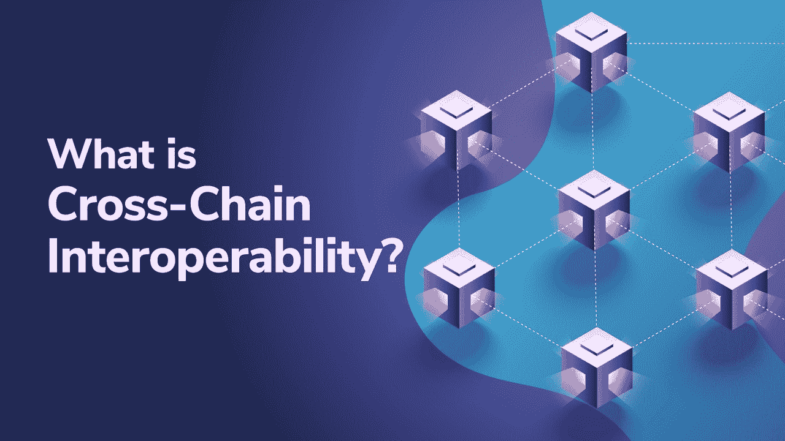
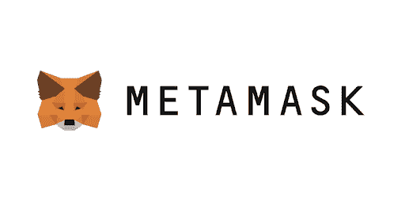
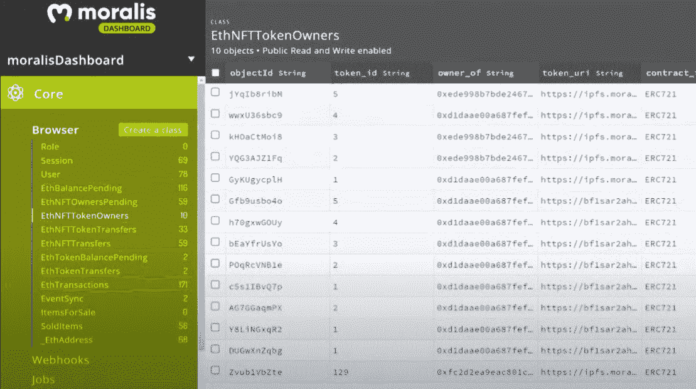

# 多边形 Dapp API——如何高效地创建多边形 Dapp

> 原文：<https://moralis.io/polygon-dapp-api-how-to-efficiently-create-polygon-dapps/>

**多边形网络(原名 Matic)已经成长为** [**Web3 开发**](https://moralis.io/how-to-build-decentralized-apps-dapps-quickly-and-easily/) **的主要网络之一。polygon——所谓的第二层以太坊扩展解决方案——作为以太坊拥塞问题的解决方案应运而生。随着** [**以太坊气费**](https://moralis.io/ethereum-gas-fees-the-ultimate-2022-guide/) **随着采用率的增加而暴涨，一些开发者将注意力转向 Polygon，转而开始在其网络上创建 dapps。随着对多边形开发越来越关注，编码人员发现需要多边形 dapp APIs 来使**[**web 3**](https://moralis.io/the-ultimate-guide-to-web3-what-is-web3/)**开发更容易实现。然而，到底什么是多边形 dapp API，它们是如何工作的？如果你继续阅读，你会在下面的章节中找到这些问题的答案。另外，您将发现如何使用 Moralis 的多边形 dapp API 创建多边形 dapp！**

为了快速启动这个简短的指南，我们将仔细看看多边形网络及其包含的内容。接下来，我们将深入探讨 API 以及它们在多边形网络环境中的作用。我们还将进一步了解如何通过 [Moralis](https://moralis.io/) 获得多边形 dapp API。最后，我们将演示 Moralis 的 Polygon dapp API 是如何工作的，并提供一些应用领域的例子。作为阅读的结果，您将获得一个多边形 dapp API 的全面概述！

除了提供 Polygon dapp API，Moralis 还提供强大的开发工具，如 [Moralis Speedy Nodes](https://moralis.io/speedy-nodes/) 、Moralis 的 [Price API](https://moralis.io/introducing-the-moralis-price-api/) 、对 [IPFS](https://moralis.io/what-is-ipfs-interplanetary-file-system/) 的本地支持等等。更重要的是，你可以完全免费注册道德！此外，在 Moralis 的博客上，你可以了解更多关于[为什么 Web3 很重要](https://moralis.io/why-is-web3-important-a-beginners-guide/)，区块链开发的[最佳语言](https://moralis.io/best-languages-for-blockchain-development-full-tutorial/)， [Web3 前端开发](https://moralis.io/web3-frontend-everything-you-need-to-learn-about-building-dapp-frontends/)等等。因此，如果你想成为一名区块链开发者，你来对地方了。

### 什么是多边形网络？

如果你想理解为什么最初会有对多边形网络的需求，一个好的起点是[以太坊](https://moralis.io/full-guide-what-is-ethereum/)。以太坊是区块链最突出的发展。然而，越来越多的采用是有代价的，因为网络正在经历拥塞问题。随着越来越多的人使用网络，交易成本已经上升到天文数字，使得在某些情况下开发 [dapps](https://moralis.io/decentralized-applications-explained-what-are-dapps/) 在经济上不可行。由于这个原因，出现了对可伸缩解决方案的需求，其中一个替代方案是 Polygon。


Polygon 是一个分散的以太坊扩展平台，是以太坊网络拥塞问题的潜在解决方案。Polygon 实现了一个经济上更可持续的开发平台，确保开发人员能够以更低的燃气成本创建 dapps，同时保持以太坊区块链的高级别安全性。

由于 Polygon 与以太坊密切相关，因此两个网络之间有许多相似之处，其中之一就是令牌标准。例如，Polygon 实现了与以太坊相同的令牌标准，这意味着 Polygon 使用熟悉的概念，如 [ERC-20](https://moralis.io/erc20-exploring-the-erc-20-token-standard/) 和 [ERC-721](https://moralis.io/erc-721-token-standard-how-to-transfer-erc721-tokens/) 。事实上，Polygon 的本机令牌——称为 MATIC——实现了 ERC-20 标准，这表明它与其他基于以太坊的加密货币兼容。此外，网络用户利用 MATIC 来管理 Polygon，同时支付相对较低的交易成本。

Polygon 明显偏离以太坊的一个领域是网络的共识机制。以太坊目前使用工作验证(PoW)机制；与此同时，Polygon 应用了 proof-of-stage(PoS ),这是一种更具可扩展性的替代方案。因此，这是多边形网络能够保持较低交易成本的原因之一。

## 什么是多边形 Dapp API？

对上述问题的快速回答是，Polygon dapp API 是一种在 Polygon 网络上实现更无缝的 dapp 开发体验的 API。因此，更合适的起点可能是更深入地研究 API 的复杂性，以完全理解这个概念的含义。那么，API 到底是什么？


每当你浏览互联网或与手机上的应用程序交互时，你都在接触一个 API。因此，API 对于互联网生态系统至关重要。此外，API 是“应用编程接口”的缩写，它们负责促进两个软件之间的通信。

无论何时使用设备，该软件都会连接到互联网，并将数据发送到服务器或数据库。接收端需要解释此信息，找到适当的响应，并将其发送回您的设备。一旦您的设备收到响应，它就需要解释数据，并以可读的方式向您显示信息。API 本质上是整个过程的中介。

API 基本上翻译一组指令，并确保在安全的开发环境中兼容编码。这是通过在查询时可靠地交付函数来实现的。从本质上讲，API 提供了更可靠和更易访问的开发人员体验，这正是 Polygon dapp API 为 Polygon 网络所做的事情。因此，在开发工作中使用 Polygon dapp API 是非常有益的。

此外，还有针对其他开发领域的附加 API。例如，你可以查看 Moralis 的 [NFT API](https://moralis.io/nft-api/) ，它是跨链兼容的。如果你对 NFT 编程感兴趣，看看我们解释什么是[多边形 NFT API](https://moralis.io/what-is-a-polygon-nft-api-polygon-nft-apis-explained/) 的指南！

## 为什么要用 Moralis 开发多边形 Dapps？–Moralis 的多边形 Dapp API

首先，在我们深入探讨 Moralis 之前，让我们仔细看看为什么首先应该开发 Polygon dapps。正如我们之前提到的，以太坊正面临着推高油价的拥堵问题。出于这个原因，开发以太坊 dapps 会变得很昂贵，并且很难扩展您的项目。然而，由于 Polygon 是以太坊的第二层扩展平台，网络可以以较低的成本促进交易。

此外，Polygon 是一个成熟的网络，大量开发人员正在构建兼容 Polygon 的 dapps。这表明该网络支持一个由经验丰富的开发人员组成的大型社区。所以，你应该开发 Polygon dapps 的两个主要原因是可伸缩性机会和已经存在的程序员社区。


尽管 Polygon 开发相当先进和容易，但是利用工具和平台使 Web3 开发更加无缝仍然是有益的。这就是 Moralis 作为区块链开发的首要操作系统的切入点。事实上，有了 Moralis，你的平均开发时间有可能减少 87%!

节省开发成本的能力主要源于 Moralis 为所有用户提供的已管理的后端基础设施，并结合了一套强大的开发工具，其中之一就是 Moralis 的 Web3 API。那么，Moralis 的 Web3 API 到底是什么？

### Moralis 的 Web3 API 解释

不管你想创建什么类型的 Web3 应用程序，在大多数情况下，它们都有一些共同的特性。以认证用户的能力为例，如果你[创建了一个 NFT 市场](https://moralis.io/how-to-create-an-nft-marketplace/)、 [DeFi](https://moralis.io/what-is-defi-the-full-decentralized-finance-guide/) 平台或者 [Web3 亚马逊市场](https://moralis.io/how-to-build-a-web3-amazon-marketplace/)，这是一个必要的功能。认证只是众多突出例子中的一个，但它说明了没有必要“重新发明轮子”。

这就是 Moralis Web3 API 的亮点，因为该接口提供了一组已经开发并经过实战检验的代码片段，允许开发人员用几行代码实现高级功能。因此，不需要建立复杂的后端基础设施来验证用户身份，只需两行代码就可以用 Moralis 来实现:

```js
Moralis.authenticate().then(function (user) {
    console.log(user.get(''))
})
```

此外，Moralis 的 Web3 API 是跨链兼容的，这意味着可以在多个网络上利用该工具进行开发。该 API 支持以太坊、BNB 链等网络，当然还有多边形。因此，将该工具称为多边形 dapp API 是合适的，因为它简化了多边形网络上的 dapp 开发。



然而，如果你对其他区块链如以太坊和 BNB 连锁店的 Web3 开发感兴趣，请查看我们关于什么是以太坊 API 和币安 dapp API 的文章。

尽管如此，为了更好地理解为什么 Moralis 的 Web3 API 是有帮助的，并且可以促进更无缝的开发人员体验，我们将更仔细地看一些例子，其中这个“多边形 dapp API”派上了用场！

## moralis Polygon Dapp API–它是如何工作的？

在接下来的几节中，我们将研究对用户进行身份验证时会发生什么，如何获取用户信息，以及如何发送资产。由于我们将使用 Moralis，这些过程变得明显更容易访问，我们只需要几个简单的命令。

此外，在接下来的章节中，我们将关注多边形网络。然而，由于 API 支持跨链兼容性，我们将要深入研究的函数和代码片段也同样适用于其他网络，如 BNB 链和以太坊。因此，即使你有雄心[创建 BSC dapp](https://moralis.io/how-to-create-bsc-dapps-quickly/)或想要[创建以太坊 dapp](https://moralis.io/how-to-create-an-ethereum-dapp-instantly/) ，请跟随 Moralis 的 Web3 API 的分解！

### 你的道德数据库

如果您注册了 Moralis，只需简单点击几下，您就可以快速设置自己的服务器。一旦您手头有了一台服务器，您将额外获得一个可以填充各种信息的数据库。每当用户[使用元掩码](https://moralis.io/how-to-authenticate-with-metamask/)进行身份验证时，数据库会自动填充有用的数据。



*默认为道德家。我们之前介绍的 authenticate()* 函数是[元掩码](https://moralis.io/metamask-explained-what-is-metamask/)。但是，您可以选择使用其他类似的替代方案。首先，你可以看看我们关于如何用 WalletConnect 连接用户的[指南。在移动 Web3 开发方面，WalletConnect](https://moralis.io/how-to-connect-users-with-walletconnect/) 非常出色。

尽管如此，一旦用户通过 meta mask——或任何其他替代方式——进行了身份验证，服务器的数据库将自动填充。数据库中的所有信息都会实时更新，让您能够访问最相关的供应链数据。在下面的屏幕截图中，您可以看到 Moralis 用户可以访问哪些类型的信息:



### 使用来自数据库的信息

既然您已经获得了关于您的 dapp 用户的关键信息，那么以一种可访问的方式获得这些信息是非常重要的。此外，当使用 Moralis 的 Polygon dapp API 时，查询关于我们的 dapp 用户的信息很容易。下面，我们将提供三个简短的代码片段示例来获取令牌余额和交易信息:

**获取用户的本地令牌余额:**

*   const balance =等待道德。web 3 API . account . getnative balance()；

**获取用户的代币余额:**

*   常数余额=等待道德。web 3 API . account . gettokenbalances()；

**获取用户的交易历史:**

*   const transaction = await Moralis。web 3 API . account . get transaction()；

这些只是 Moralis 的 Polygon dapp API 的几个例子，它们说明了查询这种类型的信息是多么容易。接下来，我们将仔细研究如何通过 Moralis Polygon dapp API 发送资产！

### 使用 Moralis 的多边形 Dapp API 发送资产

我们要深入了解的最后一个示例是发送资产。当创建一个 Web3 项目时，允许用户或你的 dapp 代表用户进行交易是很好的。使用 Polygon dapp API，发送多边形资产非常容易，只需几行代码就可以完成。首先，这是你如何使用 Moralis 的 Web3 API 发送 Polygon [NFTs](https://moralis.io/non-fungible-tokens-explained-what-are-nfts/) :

```js
// sending a token with token id = 1
const options = {
  type: "erc721",
  receiver: "0x..",
  contractAddress: "0xc02aaa39b223fe8d0a0e5c4f27ead9083c756cc2",
  tokenId: 1,
};
let transaction = await Moralis.transfer(options);
```

还可以转移其他类似的代币。例如，让我们仔细看看如何发送原生多边形和 ERC-20 令牌:

**发送本机令牌:**

```js
const options = {
  type: "native",
  amount: Moralis.Units.ETH("0.5"),
  receiver: "0x..",
};
let result = await Moralis.transfer(options);
```

**发送 BEP-20 令牌:**

```js
// sending 0.5 tokens with 18 decimals
const options = {
  type: "erc20",
  amount: Moralis.Units.Token("0.5", "18"),
  receiver: "0x..",
  contractAddress: "0x..",
};
let result = await Moralis.transfer(options);
```

然而，这些只是 Polygon dapp API 在开发 dapp 时如何有用的一些例子。要了解更多信息，请查看官方文档中关于 API 的更多细节。我们推荐看看[如何构建多边形 dapp](https://moralis.io/how-to-build-polygon-dapps-easily/)和[如何创建多边形令牌](https://moralis.io/how-to-create-a-polygon-token/)来获得使用这个工具的第一手经验！

## 多边形 Dapp API–摘要

以太坊的拥塞问题为其他更具可扩展性的解决方案和网络(如 Polygon)留下了空间。因此，最近开发多边形 dapps 变得越来越流行。这增加了对多边形 dapp API 的需求，因为它允许开发人员更无缝地创建 dapp。这就是 Moralis 进入画面的地方，以实现更容易访问的多边形 dapp 开发过程。

凭借 Moralis 的 Web3 API 的跨链兼容性，可以为多个不同的网络创建应用程序。其中一个选项是多边形网络。Moralis 的 Polygon dapp API 可以让您通过几行代码验证用户、获取用户信息和发送资产。因此，如果你想成为一名区块链开发者，那么 Moralis 可能就是适合你的操作系统！

更重要的是，这只是创建道德账户的众多理由之一。如果你想了解更多关于 Moralis 的信息，请随意浏览 Moralis 的博客。在这里你可以找到额外的内容，比如如何创建 [Web3 Spotify](https://moralis.io/how-to-build-a-web3-spotify-clone/) 和 [Web3 Twitter](https://moralis.io/how-to-build-a-web3-twitter-clone/) 的复制品。如果你想创建 Web3 项目，[注册 Moralis](https://admin.moralis.io/register) 并在几分钟内制作你的第一个 dapp！


你也应该去看看道德学院，在那里你可以磨练你的 Web3 开发技能。例如，报名参加“[区块链&比特币 101](https://academy.moralis.io/courses/blockchain-bitcoin-101) 课程，开始你的区块链认证之旅！