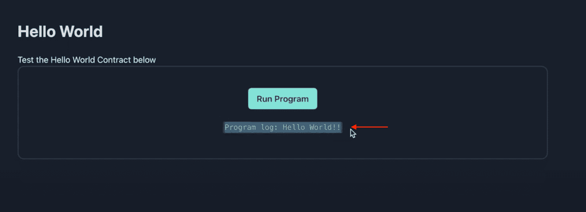
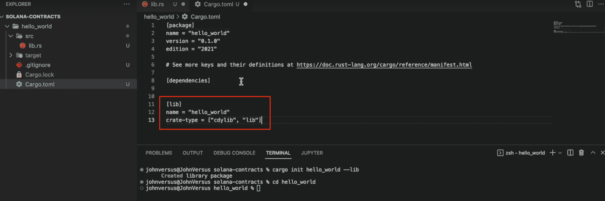

# 索拉纳智能合同建筑——简介

> 原文：<https://moralis.io/solana-smart-contract-building/>

您是否在为 Solana network 开发 dapps 或其他 Web3 项目？如果是这样，你就来对地方了，因为本教程将深入研究 Solana 智能合同构建，并演示如何创建自己的合同！除了编写一个实际的 Solana smart 契约，这个“ *Solana Smart 契约构建”*教程还将展示如何使用一个简单的测试应用程序来部署和调用契约。创建智能合同测试应用程序相对简单，这要归功于与 Solana 兼容的 [**Moralis**](https://moralis.io) **以太坊样板。您所需要做的就是克隆模板并进行一些简单的配置！**

设置 dapp 的可访问性部分源于 Moralis 的 [Web3 模板](https://moralis.io/web3-template-build-a-dapp-using-a-web3-website-template/)。然而，Moralis 不仅使你能够为以太坊和索拉纳开发项目，还提供了额外的样板文件。因此，如果你对开发其他网络的 dapps 感兴趣，你可以，例如，检查一下 [Avalanche 样板](https://moralis.io/avalanche-boilerplate-fastest-way-to-build-avalanche-dapps/)或 [Cronos 样板](https://moralis.io/cronos-boilerplate-how-to-create-cronos-dapps/)。多亏了样板文件和其他工具，Moralis 提供了为任何网络构建 Web3 应用程序的最快方法。

因此，如果你想写智能合同或构建 Web3 dapps，[现在就注册 Moralis](https://admin.moralis.io/register) 完全免费！

## 探索索拉纳网络

Solana 是一个开源的可编程区块链，专注于速度和可伸缩性，允许网络以低成本快速促进交易。此外，区块链的“可编程”特性表明索拉纳支持智能合约。索拉纳智能合约是在索拉纳区块链上运行的程序，它们是网络生态系统的重要组成部分，因为它们在网络参与者之间调解协议。因此，智能合约使开发者有可能构建复杂的 dapps(去中心化应用)和其他由 Solana 支持的 Web3 项目。

现在，在我们深入本文的主题之前，让我们更深入地探索一下 Solana 和网络的智能合约！

## 什么是索拉纳智能合约？

现在让我们回到基础。为了简化解释，我们将把概念(Solana 智能合约)分成两个部分:Solana 网络和智能合约，并从分别解释这些组件开始！

该网络背后的组织 Solana Labs 于 2017 年首次推出了 Solana 的可编程开源区块链。Solana 是可编程的这一事实意味着该网络具有智能合约的特性，允许开发人员构建由 Solana 区块链支持的 Web3 项目和 dapps。


Solana 实现了一种结合了 PoH(历史证明)和 PoS(利害关系证明)的混合共识机制。使用这两种机制使 Solana 能够保持较高的交易速度和最低的成本。此外，对速度和可伸缩性的强调使得 Solana 编程比一些竞争对手更快、更经济。

通过对 Solana 的快速介绍，我们现在将进一步了解智能合约。简而言之，智能合约——也被称为 [Web3 合约](https://moralis.io/what-are-web3-contracts-exploring-smart-contracts/)——是在区块链网络上构建和存储的程序。此外，智能合约具有预定义的条件和预定义的操作。因此，当这些条件满足时，契约中定义的操作会自动执行。基于这一点，它认为智能合约是自动化协议的完美选择，不需要不必要的中介从促进交易中提成。

因此，在索拉纳的上下文中，智能合约基本上是存储在索拉纳区块链上的程序！

随着对 Solana 智能合约有了更好的理解，现在是时候探索 Solana 智能合约构建的复杂性了。因此，下面几节将演示如何轻松构建一个 Solana 智能合同！

## Solana 智能合同构建–如何构建智能合同的逐步过程

在接下来的部分中，我们将深入研究 Solana 智能合约构建，并向您展示如何创建您自己的 Solana 智能合约。我们还将演示如何部署和调用合同。然而，要调用契约，您必须设置一个测试 dapp。为了使整个过程更容易理解，我们将把 Solana 智能合同构建过程分为以下三个步骤:

1.  **Rust 和 Solana CLI 设置**
2.  **编写并部署 Solana 智能合同**
3.  **创建测试应用**

遵循上面的三个步骤将允许您使用测试应用程序来创建、部署和调用 Solana smart contract。为了展示您的目标，这将是应用程序的登录页面:


如上图所示，你可以点击“运行程序”按钮。这将提示你的 Solana [Web3 钱包](https://moralis.io/what-is-a-web3-wallet-web3-wallets-explained/)，允许你签署一条消息并调用智能合约。一旦被调用，该应用程序将显示来自合同的数据日志，在本例中，这是一个“Hello World！!"消息:



然而，如果你喜欢看视频来学习而不是阅读，你可以看看下面的视频，它涵盖了前面提到的步骤。此外，如果您感兴趣，该片段还提供了更详细的应用程序代码分解！

[https://www.youtube.com/embed/cLuX5CvXLuY?feature=oembed](https://www.youtube.com/embed/cLuX5CvXLuY?feature=oembed)

### 步骤 1: Rust 和 Solana CLI 设置

首先，本教程关于 Solana 智能契约构建的第一步围绕着设置 Rust 和 Solana CLI。如果您已经熟悉这两个组件，可以跳过这一初始步骤，直接进入构建和部署 Solana smart 契约的过程。然而，如果你是锈病和茄病的新手，不用担心；本节提供了从 Rust 开始的设置过程的完整分解！

这个初始步骤的第一部分是打开一个 Unix 终端。在终端打开的情况下，您可以通过输入以下命令启动 Rust 的安装过程:

```
curl --proto '=https' --tlsv1.2 -sSf https://sh.rustup.rs | sh
```

只要您运行这个命令，终端就会显示一些安装选项。对于本教程，您希望通过输入“1”并按 enter 键来选择“默认”选项。您的终端应该是这样的:


一旦你选择了安装选项，它就会开始为你安装 Rust。安装完成后，第一步的下一步是安装 Solana CLI。要安装 CLI，请在终端中输入以下内容:

```
 sh -c "$(curl -sSfL https://release.solana.com/stable/install)"
```

运行上面的命令将安装 Solana CLI，当它完成时，您需要设置“env path”。这将显示在终端中，看起来应该是这样的:


设置好路径后，您现在需要使用以下两个命令设置一个新的本地文件系统和 Solana wallet 密钥对:

```
mkdir ~/my-solana-wallet
```

```
solana-keygen new --outfile ~/my-solana-wallet/my-keypair.json
```

有了本地的 Solana 钱包，是时候设定一个目标集群了。在这个实例中，我们将使用以下命令定位 devnet 集群:

```
solana config set --url https://api.devnet.solana.com
```

最后，一旦您指定了 devnet 集群，这最后一个命令将向您的钱包添加一些测试 SOL:

```
solana airdrop 1
```

### 步骤 2:编写和部署 Solana 智能合同

Rust 和 Solana CLI 都已设置好，是时候深入研究 Solana 智能合约构建了。因此，这一部分概述了编写和部署 Solana 智能合同的过程。此外，您必须首先打开您首选的 IDE 或“集成开发环境”才能这样做。

对于本教程，我们使用 VSC (Visual Studio 代码)。如果您使用另一个 IDE，请注意该过程可能偶尔会有所不同。然而，一旦 IDE 打开，下一步就是建立一个新的文件夹并打开一个新的终端。如果您使用的是 VSC，请点击顶部的“终端”选项卡，然后点击“新建终端”:


在终端打开的情况下，您可以通过在终端中运行以下命令，使用 Cargo 创建一个新项目:

```
cargo init hello_world --lib
```

运行上面的命令将在您的本地目录中建立一个新的货物库，其中包含您构建 Solana 智能合同所需的所有文件:


接下来，使用下面的命令导航到“hello_world”项目文件夹:

```
cd hello_world
```

接下来，您可以打开“Cargo.toml”文件，并在文件末尾添加以下代码片段:

```
[lib]
name = "hello_world"
crate-type = ["cdylib", "lib"]
```

它应该是这样的:



现在，在编写实际的合同之前，通过在终端中运行以下命令来添加 Solana 程序包:

```
cargo add solana_program
```

最后，现在是时候书写索拉纳智能合约本身了。为此，导航到“src/lib.rs”文件并删除所有代码。首先，通过将以下代码片段添加到文件中来导入 Solana 程序:

```
use solana_program::{
    account_info::AccountInfo,
    entrypoint,
    entrypoint::ProgramResult,
    pubkey::Pubkey,
    msg,
};
```

接下来，使用“*进程 _ 指令*函数指定“*入口点*”:

```
entrypoint!(process_instruction);
```

最后，添加“ *process_instruction* 函数:

```
pub fn process_instruction(
    program_id: &Pubkey,
    accounts: &[AccountInfo],
    instruction_data: &[u8]
) -> ProgramResult {

    msg!("Hello, world!");

    Ok(())
}
```

然而，这应该是“src/lib.rs”文件的最终版本:

```
use solana_program::{
    account_info::AccountInfo,
    entrypoint,
    entrypoint::ProgramResult,
    pubkey::Pubkey,
    msg,
};

entrypoint!(process_instruction);

pub fn process_instruction(
    program_id: &Pubkey,
    accounts: &[AccountInfo],
    instruction_data: &[u8]
) -> ProgramResult {

    msg!("Hello, world!");

    Ok(())
}
```

#### 部署合同

写好合同后，您可以通过在终端中输入以下命令并按 enter 键来构建 Solana 智能合同:

```
cargo build-bpf
```

最后，剩下的工作就是使用 Solana deploy 命令部署智能合约:

```
solana program deploy ./target/deploy/hello_world.so
```

一旦您运行该命令，它应该提供一个程序 ID 作为回报。请确保将此 ID 放在手边，因为您将在以下部分用到它:


这就结束了编写和部署契约的步骤！在下一节中，您将学习如何设置测试应用程序，从该应用程序中您可以调用 Solana 智能合同。反过来，它将允许您确保合同按预期工作！

### 步骤 3:创建测试应用程序

合同编写和部署完成后，是时候创建一个应用程序来调用和测试 Solana 智能合同了。为了使这个过程尽可能容易访问，您可以基于 Moralis 的以太坊样板文件克隆一个模板，这样您就可以立即构建应用程序了！

**Solana 智能合约测试 App—**[**https://github . com/johnvsnagendra/Solana-Smart-Contract-hello world**](https://github.com/johnvsnagendra/solana-smart-contract-helloWorld)

**要克隆测试应用程序，用上面的链接打开项目的 GitHub 存储库。从那里，点击“代码”按钮，并复制回购网址:**

**

接下来，再次打开 IDE，为项目创建一个新文件夹，并打开一个新终端。然后，您可以使用以下命令和存储库 URL 来克隆项目:

```
git clone “REPOSITORY_URL”
```

运行上面的命令会将项目克隆到您的本地设备上。但是，在启动和测试应用程序之前，您必须进行两项配置。首先，打开“. env.local.example”文件，并将文件重命名为“. env.local”。在这里，您必须将您的 Moralis Web3 API 密钥添加到变量" *MORALIS_API_KEY* "中。

如果您还没有，您必须创建一个 Moralis 帐户来获取密钥。要开始，请点击 Moralis 网站顶部的“免费开始”按钮，并按照说明进行操作:


登录后，导航到“Account”选项卡，单击“Keys ”,然后复制 Web3 API 密钥:


既然已经将 API 键添加到环境变量中，请打开“/src/components/templates/hello world/hello world . tsx”文件。然后，您可以向下滚动到第 19 行，添加您在部署合同时收到的计划 ID:


#### 称之为智能合同

添加 Moralis Web3 API 密钥和程序 ID 涵盖了代码的必要配置。现在，剩下的就是启动应用程序，调用智能契约，并确保一切按预期运行。

因此，您现在应该能够在浏览器中启动应用程序，单击“运行程序”按钮，并签署消息以运行智能合同。这应该返回“Hello World！!"消息:


如果测试应用程序返回消息，您就知道智能合约正常工作了！然而，如果你在这个过程中遇到了麻烦，看看我们之前链接的视频。您也可以加入 Moralis 的 Discord 频道，向我们才华横溢的社区工程师提出您可能有的任何问题！

## 总结 Solana 智能合同建筑

本文探讨了 Solana 智能合同构建的复杂性。因此，本文解释了如何编写、部署和测试 Solana 智能合同。此外，为了使过程更加简单，本教程分为以下三个步骤:

1.  Rust 和 Solana CLI 设置
2.  编写和部署 Solana 智能合同
3.  创建测试应用程序

本"*Solana Smart Contract Building "*指南的可访问性源自 Moralis。例如，借助 Moralis 的以太坊样板，您可以轻松设置测试应用程序。该模板利用了各种道德标准[web 3 API](https://moralis.io/web3-apis-exploring-the-top-5-blockchain-apis/)，包括 [Web3 认证 API](https://moralis.io/authentication/) 。这个 API 允许您轻松地将身份验证机制集成到任何 Web3 项目中。如果这听起来很有趣，你可以，例如，学习如何[添加比特币基地钱包登录功能](https://moralis.io/how-to-add-coinbase-wallet-login-functionality/)！

此外，如果你觉得这个指南很有帮助，请点击 Moralis 的 [Web3 博客](https://moralis.io/blog/)查看更多内容。例如，学习如何[建立一个索拉纳 NFT 探索者](https://moralis.io/how-to-build-a-solana-nft-explorer/)或[创造自己的索拉纳 NFT](https://moralis.io/solana-nft-mint-tools-create-your-own-solana-nft/) ！

然而，如果你想开发索拉纳项目或建立 dapps，这并不重要；Moralis 让所有的开发工作变得轻而易举！因此，[立即与 Moralis](https://admin.moralis.io/register) 签约，提高你未来发展努力的效率！**