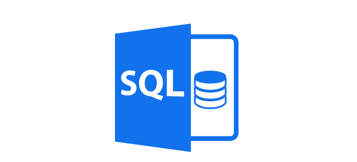
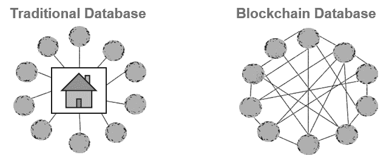
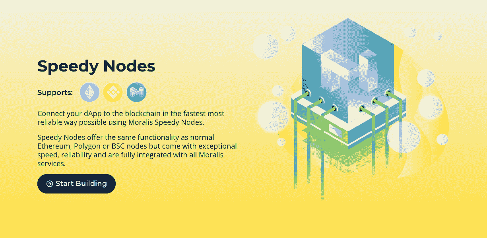
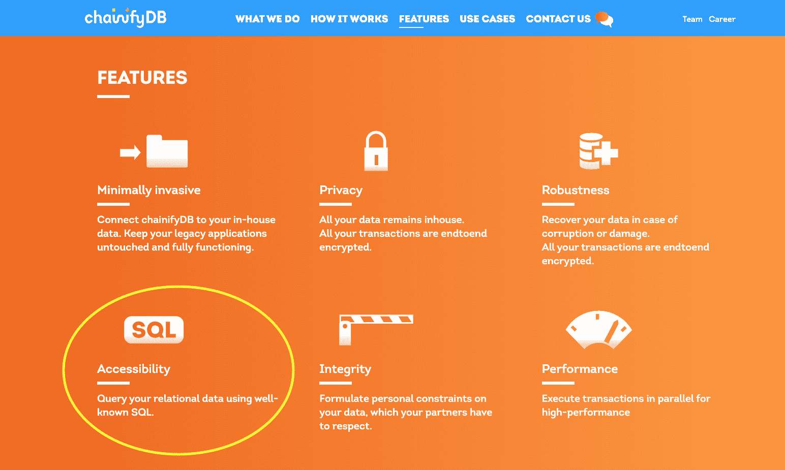
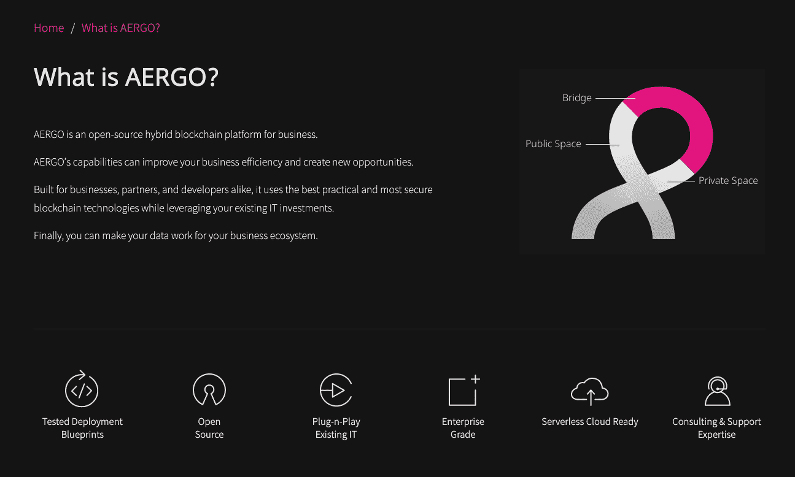

# 结构化查询语言(SQL)解释–什么是 SQL？

> 原文：<https://moralis.io/structured-query-language-sql-explained-what-is-sql/>

在学习数据库或者探索新的编程语言的过程中，你很可能会碰到“SQL”这个术语。有经验的开发人员可能已经知道什么是 SQL，并且可能已经在他们的数据库项目中广泛使用了它。刚刚开始编程之旅并希望了解更多关于构建、管理和从数据库中检索信息的初学者将从本指南中受益。如果你是新手，很好奇想找到“什么是 SQL？”那这篇文章就送给你了！

那么，什么是 SQL 呢？缩写代表“结构化查询语言”。查询语言是一种设计用来从数据库中检索特定信息的编程语言。能够输入一堆数据，建立一个数据库是一回事。然而，我们需要一种系统的方法来从所述数据库中请求回特定的数据，以便在我们需要时准确地获得我们需要的数据。否则，存储不可排序、不可管理、不可检索或功能无用的数据是没有意义的。SQL 简化了这个过程，它被称为“查询”。

SQL 是用来做什么的？如今，大多数公司已经将数据存储在大型数据库中。有各种各样的数据库类型，但是大多数都可以用 SQL 查询。理解 SQL 将帮助您掌握并无缝地使用关系数据库的广阔世界。如果你想找一份数据方面的工作，或者与公司的数据库或电子表格打交道，掌握 SQL 会让你受益匪浅。

您还会有兴趣了解保存数据库的方法不止一种。你可以创建一个集中的或者分散的。对于在 [dApps](https://moralis.io/decentralized-applications-explained-what-are-dapps/) 、区块链和 [Web3](https://moralis.io/the-ultimate-guide-to-web3-what-is-web3/) 上的分散式数据库应用程序来说，了解下一代工具如 [Moralis](https://moralis.io/) 可以加速这类尖端项目的开发是有帮助的。

## 什么是 SQL–基础知识

SQL，或结构化查询语言，读作字母 S-Q-L，或者“sequel”。它是我们用来与存储在关系或 SQL 类型数据库中的信息进行交互的语言。您也可以将其定义为关系数据库管理系统(RDBMSs)的标准语言。

我们需要对数据库或其中存储的信息采取的任何行动都可以通过 SQL 语法来实现。使用 SQL，您可以创建或更改数据库或表的结构。SQL 还可以帮助您存储、操作或检索表或数据库中的数据。

SQL 是一种 ISO(国际标准化组织)语言，在各个行业都有很高的需求。那些对区块链开发感兴趣的人会很高兴地知道，它是区块链行业中使用的最流行的语言之一，并且与 [Solidity](https://moralis.io/solidity-explained-what-is-solidity/) 、C 和 C++、JavaScript、Ruby、Python 和 Go 一起受到区块链项目的支持。

## 参加全面的区块链课程

要了解更多关于这些广泛使用的区块链编程语言，你可以访问科技学院网站上的 [Ivan。他们有关于](https://academy.ivanontech.com/all-courses)[区块链基础](https://academy.ivanontech.com/courses/blockchain-bitcoin-101)、[以太坊](https://academy.ivanontech.com/courses/ethereum-101)、[以太坊智能合约编程](https://academy.ivanontech.com/courses/ethereum-smart-contract-programming-101)、 [JavaScript](https://academy.ivanontech.com/courses/javascript-programming-for-blockchain-developers) 、[以太坊 dApp 开发](https://academy.ivanontech.com/courses/ethereum-dapp-programming)、 [DeFi](https://academy.ivanontech.com/courses/defi-101) 的优秀课程。这些将推进你的职业生涯，帮助你成为一名受欢迎的区块链开发人员，拿着高得多的薪水。

## 什么是 SQL:SQL 的历史

1973 年，IBM 开始基于 Edgar F. Codd(现在被称为“关系数据库之父”)在 1970 年发表的一篇关系模型论文研究关系数据库语言。这种新语言是对他们早期存储和检索数据的非关系方法的升级，称为“ISAM”和“VSAM”。虽然可以执行存储、删除和检索等基本操作，但一次只能对一条记录执行这些操作。最终，这种新出现的语言被命名为“SEQUEL”，后来被缩写成 SQL。Oracle 在 1979 年发布了 SQL 的第一个商业版本，该版本基于最初的 IBM 版本。

### 什么是 SQL:一种非过程化语言

为了理解什么是 SQL 并发现它的用例，我们需要更深入地了解编程语言是如何工作的。

SQL 是非过程化或声明性的查询语言。过程性语言要求你使用一系列指令或一步一步的过程来指定做什么和如何做，而非过程性语言只是要求你指定“做什么”部分，而不需要你指定“如何做”部分。

过程语言是命令驱动的，通过机器的状态工作。像 SQL 这样的非过程化语言是函数驱动的，通过数学函数工作。与过程语言不同，非过程语言的语义非常简单，可以返回任何值或数据类型。这两种类型都使用递归调用，但是过程语言在递归调用的基础上使用迭代循环。它们的程序也很大。另一方面，非过程化语言的程序较小，更适合于时间要求严格的应用程序。

过程语言的例子有 Fortran、COBOL、ALGOL、BASIC、C 和 Pascal。非过程化语言的列表包括 Prolog、Lisp，当然还有 SQL。

### 什么是 SQL:关系数据库

除了上述信息之外，您还需要对关系数据库有一个基本的了解。这样，你就能回答“什么是 SQL？”以及“SQL 是用来做什么的？”更彻底。

关系数据库是一种跨多个表存储相关信息的数据库。它允许您同时从多个表中查询或请求信息。

为了说明这一点，考虑一个想要跟踪其销售或客户信息的企业。一开始，Excel 电子表格看起来像是一个实用的想法。这种数据可以被分成列，隔离诸如下订单的日期、订单编号、客户的姓名、他们的地址和其他联系信息、应付金额等信息。随着您建立客户群和扩展业务，这样一个基本的数据库将变得庞大、不可管理和冗余。您将会遇到重复订单、重复数据输入的问题，这些问题会导致不必要的冗余，并占用超出许可范围的空间。总的来说，随着系统的建立，效率越来越低。

基本的数据输入系统也会遇到数据完整性的问题。您无法确定每个输入字段都被赋予了正确的数据类型，或者输入系统是否一致。

SQL 和关系数据库的引入是为了解决上述问题，并将数据库的可管理性提升到一个新的水平。

### SQL 是用来做什么的？

SQL 被世界上数百万开发人员使用，原因有很多。它提供了许多功能，包括:

*   如前所述，它允许用户访问、定义、操作和管理 RMDBSs 中的数据。
*   它允许用户创建和删除表和数据库，以及设置对表、视图和过程的权限。
*   在数据库中，用户可以创建各种函数，包括视图和存储过程函数。
*   它允许用户通过使用 SQL 模块、预编译器和库在其他语言中嵌入数据。

### 什么是 SQL:优势

除了学习 SQL 的用途之外，SQL 在程序员的技能组合中的重要性超越了简单的函数，可以总结如下:

*   很容易掌握。作为一种查询语言而不是编程语言，你可以更容易地掌握它，因为它的语法类似于逻辑英语句子。
*   它让您更好地理解数据集。
*   作为 ISO 标准语言，变化不大。一旦掌握了 SQL，就不用担心更新太多，也可以放心的掌握一门可以长期应用的技能。
*   比 Excel 好多了。与常规电子表格相比，使用 SQL，您可以处理更大(甚至是海量)的数据集。

## 什么是 SQL 命令和子语言

为了让您了解什么是 SQL 以及如何使用这种语言，您需要理解基本的 SQL 命令。与关系数据库交互所需的最基本的功能包括“创建”、“选择”、“插入”、“更新”、“删除”和“删除”。然而，还有更多命令，您将在下面看到。

为了执行其所有功能，SQL 根据其目的和性质将其命令分为几个子语言。

### 数据定义语言

这种分类包括“创建”、“更改”和“删除”。这种命令允许程序员创建和修改或更改数据库对象，包括表。

*   创建–启动数据库中的新表、表视图或其他对象。
*   ALTER–更改数据库中的当前对象。
*   DROP–移除或删除数据库中的表视图、整个表或对象。

### DML–数据操作语言

此分类下的命令用于存储和修改数据库中的数据。

*   SELECT–从一个或多个表中检索记录。
*   插入–在数据库中创建记录。
*   更新–修改记录。
*   删除–删除记录。

### DCL–数据控制语言

当您想要设置对数据库访问的控制时，可以使用 DCL 子语言。

*   授权–授予用户访问权限。
*   撤销–删除授予的权限。

### TCL–交易控制语言

这种分类允许您处理由 DML 命令完成的修改。

*   提交–结束当前事务，并允许您将此类事务期间所做的任何更改建立为永久更改。
*   回滚-是“提交”的对立面。它允许您结束一个事务，但是它将撤销在该事务期间发生的任何更改。

有了这些基本子分类和命令的概念，您现在就有了“什么是 SQL？”。您还对 SQL 及其用途有了更好的理解。

## 什么是 SQL:后续步骤

本文旨在介绍 SQL 的基本原理，并使您能够回答诸如“什么是 SQL？”以及“SQL 是用来做什么的？”。把它当作一个跳板，引导你在掌握数据库的道路上学习更复杂的学习材料。有了这些基础知识，你就可以从建立你的第一个数据库和下载必要的软件开始练习了，其中最流行的是“MySQL”。下载后，您可以继续掌握这些基本命令。

您可以通过跟随更深入的带有实际示例的在线教程来进一步学习。别忘了加入社区，找朋友或导师来简化你的学习过程。只要足够勤奋和练习，你很快就会精通 SQL！

## 区块链还是关系数据库？

几十年来，我们已经习惯了以集中的方式存储数据。大型跨国公司控制着世界上的海量数据，这给了它们巨大的商业优势。有了区块链，开发人员正在将数据转向去中心化。他们正在挑战集中式数据库的想法，或者至少为传统模式提供了一种新的可行的替代方案。

通过区块链技术，数据存储变得分散和非中介化，数据库的多个副本存储在世界各地的不同计算机上。我们不再受 Web2 数据库不透明、单一文化的束缚。区块链和 Web3 为我们提供了新的选择，并彻底改变了我们存储、托管、管理和访问数据的方式。

那么，我们应该选择区块链而不是传统的数据库吗？不一定。您需要根据您的目的、资源、功能和偏好来定制您的基础架构选择。区块链提供了一种健壮的、分散的、容错的方式来存储和访问数据。然而，关系数据库具有性能优势，更不用说在易于部署方面的明显优势，因为它们不需要运行以太坊和其他区块链所需的节点和后端基础设施。

您还需要考虑这些技术之间的重叠。智能合同作为关系数据库中的“存储过程”存在，两种类型的数据库可以在混合项目中一起使用。

### 选择您理想的数据库

如果你在做一个私人企业项目，你需要仔细评估你的选择。如果它不能从公开可用的数据和非中介化中受益，并且您的客户群相对较小且稳定，那么您应该考虑使用关系 SQL 数据库。

然而，如果你计划在[以太坊](https://moralis.io/how-to-create-ethereum-tokens-in-4-steps/)、[多边形](https://moralis.io/how-to-create-a-polygon-token/)、[币安智能链(BSC)](https://moralis.io/how-to-create-a-bsc-token-in-5-steps/) 或 [Arbitrum](https://moralis.io/how-to-create-an-arbitrum-token-in-6-steps/) 上构建一个包含令牌使用和创建的生态系统的去中心化应用，那么你将受益于在多层区块链结构上存储数据。如果您还评估了非中介化是否是您的构建中的一个关键特性，这将会有所帮助。

虽然关系数据库在性能上略胜区块链，但区块链提供了强大的大规模并行数据基础设施。要开始使用基于区块链的基础设施，您需要运行一个节点，并访问大量支持您的区块链后端的下一代 Web3 工具。因此，一定要去看看[道德快速节点](https://moralis.io/speedy-nodes/)。Moralis Speedy Nodes 消除了从零开始旋转节点的繁琐步骤，并提供了一种访问 Web3 区块链数据的方法，并使用 Moralis query 将它们集成到您的 dApp 开发中。

## 区块链开发中的 SQL

如前所述，区块链和关系数据库提供了特定的优势。这是理论上的。在实践中，选择往往不是非黑即白的。因为区块链没有查询能力，所以必须考虑最可行的途径:向传统数据库添加区块链特性。随着网络的增长和节点的增加，网络流量会成倍增加，而吞吐量、容量或延迟却没有相应的调整。这会引起各种各样的问题。作为一个解决方案，您可以创建一个多层基础结构，在该结构中，使用计算机接口或数据库接口处理数据，并由区块链提供支持。在区块链框架上使用传统接口的项目包括 Cassandra、ChainifyDB、CovenantSQL、Postchain、BigChainDB、Modex BCDB 等。

Aergo 是这种混合分层方法的另一个有趣的例子。它使用 SQL 智能合约创建一个平台，让企业在商业环境中编写和执行智能合约。

## 什么是道德质疑？

现在您已经了解了什么是 SQL 以及查询的重要性，您可能想要了解更多关于它们如何与区块链版本相关联的信息。如果你选择在 Moralis 上开发你的 Web3 应用，你会选择最便捷的途径通过[无服务器计算](https://moralis.io/serverless-explained-what-is-serverless-computing/?utm_source=blog&utm_medium=post&utm_campaign=Want%2520the%2520Latest%2520in%2520%253Cspan%253EBlockchain%2520Development%253F%253C%252Fspan%253E)来开发你的区块链项目。此外，您消除了与处理基于区块链的数据库和设置物理服务器相关的许多困难步骤和成本。除了为您提供快速设置节点的方法外，Moralis 还帮助您定义、管理和检索数据，并将其集成到您的 dApp 开发或任何其他区块链项目中。

[Moralis query](https://docs.moralis.io/moralis-server/database/queries) 是 Moralis 的用户友好语言，用于从 Moralis 服务器查询数据，无需购买自己的服务器即可实现无缝的 dApp 开发流程。要了解它是如何工作的，请点击这里查看四部分视频中的第一部分:

https://youtu.be/l0NvTvNxpQo

从上面的视频中，你将深入了解 Moralis 为 Web3 和 dApps 提供的广泛支持。Moralis 帮助您绕过所有繁琐或单调的后端基础设施设置和其他耗时的步骤。[为什么要用 Moralis](https://docs.moralis.io/) ？这是一个终极的 Web3 开发平台，它可以帮助你专注于创建一个令人惊讶的前端，这样你就可以尽快启动你的 dApp！