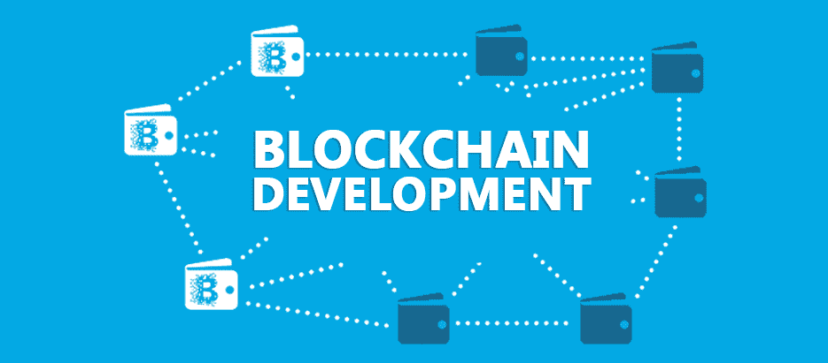

# 区块链技术堆栈终极指南

> 原文：<https://moralis.io/the-ultimate-blockchain-tech-stack-guide/>

你想开发区块链网络，还是想帮助 Web3 开发者开发工具？还是想专注于交付分散式应用(dapp)——用户可以与之交互的终端产品？每项任务都涉及关注区块链理工学院的不同层面。因此，了解区块链目前的技术状况是有益的，这样你就可以决定具体关注哪一层。

有不同的方法来打破目前区块链理工大学的堆栈。这完全取决于某人如何对可用的工具和解决方案进行分类。然而，我们更喜欢从五个层面来看待区块链开发的技术栈。接下来，我们将仔细研究这五层中的每一层，为您提供对每一层的清晰解释。通过将这些信息添加到您的知识库中，您将能够决定您希望将重点放在哪个层面上。现在，如果你来自遗留系统，并且精通 JavaScript (JS ),那么阻力最小的途径就是开始创建杀手级 dapps。毕竟，当你使用像 Moralis 这样的工具时，你的 JS 技能可以让你走得非常远。此外，你可以简单地创建一个[免费道德账户](https://admin.moralis.io/register)。也就是说，现在让我们来鸟瞰一下区块链理工大学的堆栈吧！

## 区块链开发者的技术堆栈指南

让我们仔细看看下面五个区块链理工大学堆栈层中的每一层。然而，在分别研究每一个之前，我们希望您对区块链的技术堆栈有一个全面的了解。下面的图像将是非常有益的:

从底部开始，上图显示了不同的可编程链，也称为第一层(L1)区块链。然而，第二层(L2)区块链也属于区块链开发者技术栈的第一层。此外，这些链充当了链上数据的网络、协议和数据库，这使得去中心化的互联网成为可能。

在区块链网络之上，我们有节点、API、Web3 和 Web2 开发工具和平台，最后，dapps(去中心化应用)在最顶端。这五层共同构成了区块链开发的当前技术堆栈。虽然，如果你想成为一个 dapp 开发者，你不需要担心所有这些层。此外，由于上面的图像是必不可少的，当我们继续讨论时，请记住它。

你认为以上五个层次中*最受*用户关注的是哪一个？如果你的答案是“dapps”，那你就对了。因此，一定要时刻记住这个重要的事实。毕竟，如果没有用户友好的 dapps，区块链理工大学就只是一项无人使用的技术。因此，知道如何创建 dapps 对 Web3 的生存至关重要。此外，我们必须尽可能高效地接触最终用户。

## 区块链开发的技术栈

有了上面的概述，你就可以更好地熟悉这五层中的每一层了。我们将从最底层开始，一步一步往上走。通过熟悉区块链开发者技术堆栈层，您将能够自信地采取下一步措施。

### 第 1 层:网络

是时候仔细看看区块链理工大学的第一层了。这一层使得区块链开发和 Web3 成为可能。没有它，我们就被困在集中式网络中。此外，以太坊仍然是可编程区块链中的王者，它仍然是最受欢迎的去中心化网络。毕竟，它是同类产品中的第一个，因此具有先发优势。尽管如此，以太坊的开始也导致了以太坊虚拟机(EVM)的形成。然而，你可能知道，以太坊高昂的交易费用和网络拥堵引发了其他连锁店的诞生。因此，我们现在有几个著名的替代品。

此外，区块链发展可以主要分为两类:EVM 兼容链和非 EVM 兼容链。顾名思义，以前的连锁店使用与以太坊相同的虚拟环境。因此，通过关注这些链，您可以使用大多数与以太坊相同的开发工具。另一方面，非 EVM 兼容链使用其原始虚拟环境。以下是这两种区块链的一些流行例子:

*   第一层区块链:
    *   **以太坊**——独创 EVM 智能合约平台
    *   **雪崩**–兼容 EVM 的 L1 区块链
    *   与 EVM 兼容的 L1 区块链
    *   **fantom**–EVM 兼容 L1 块链
    *   **BNB 链**–兼容 EVM 的 L1 区块链
    *   索拉纳–与 EVM 不兼容的 L1·区块链
    *   **靠近**–与 EVM 不兼容的 L1 区块链
    *   **流量**–与 EVM 不兼容的 L1 区块链

*   第二层区块链(下面列出的都是 EVM 兼容的):
    *   **多边形**–*以太坊侧链(L2 解)*
    *   **Arbitrum**–*L2·区块链使用乐观汇总和多轮欺诈证据*
    *   **乐观**–*L2·区块链使用乐观汇总和单轮欺诈证明*
    *   **Hermez**–A*ZK-roll up 以太坊 L2 网络由 Polygon* 管理

*注意* *:如果你想开发 dapps，关注那些能让你在链之间轻松切换的开发工具。*

### 第 2 层:节点

本质上，节点与同一链上的其他节点相连接。每个完整节点(也有其他类型)包含当前区块链状态的完整副本。此外，特定区块链网络中节点的总体分布决定了网络的分散层的级别。此外，运行节点也很重要，因为节点使您能够与区块链对话并访问其数据。此外，在这里使用 CPU 类比是有帮助的。在创建 Web2 应用程序时，您不需要与 CPU 交互。同样，不与区块链人直接互动也是有意义的。

然而，虽然从技术上讲任何人都可以运行一个节点，但这并不那么简单。在许多情况下，运行一个节点是一项全职工作，需要一个团队来进行维护、适当的备份等等。因此，期望每个 Web3 开发者运行他们自己的节点是愚蠢的。幸运的是，您不必这样做，因为已经存在几个专门的节点提供者。节点提供者是区块链开发者技术栈这一层的核心。此外，一些最受欢迎和最著名的节点提供商包括 Infura、Alchemy、Chainstack、Getblock、Pocket Network、QuickNode 和 RunNode。

不幸的是，一个节点只能专注于一个特定的链，无法覆盖加密令牌背后的多个智能契约。此外，一个节点只能为您提供来自区块链的原始数据。

### 第三层:API

除非您对计算机科学完全陌生，否则您会知道 API(应用程序编程接口)是用于构建和集成应用程序的一组定义和协议。当我们将它转移到区块链时，Web3 APIs 支持 dapp 开发。

本质上，API 为一个软件与其他软件的交互提供了一种简洁的方式。此外，高质量的 API 可以在稳定的环境中实现一致的编码。因此，您会很高兴听到有几个著名的 Web3 API 提供者。值得一提的包括共价、QuickNode、图形、Bitquery、Alchemy 和 Biconomy。然而，业界领先的 Web3 API 提供商是 Moralis。由于其跨链和跨平台的互操作性，Moralis 的企业级 API 使您能够通过单一框架跨链构建、扩展和连接 dapps。这减少了开发时间、成本和复杂性，消除了孤岛，并为区块链项目带来了更好的互操作性。因此，您可以建立一个可靠且经得起未来考验的 [Web3 基础设施](https://moralis.io/web3-infrastructure-exploring-the-best-solution-for-web3-development/)。

此外，API 提供者有不同的 API 连接到幕后的节点。因此，你自己不必担心。这使得 API 成为 dapp 开发中最重要的区块链技术堆栈层。通过与区块链开发的技术栈进行交互，您可以获得各种有用的预编译和预先计算的链上数据。

此外，值得指出的是，所有 API 提供者都提供了文档，其中解释了关于他们的 API 的细节。例如，Moralis 的文档甚至为其广泛的有用端点提供了实际例子。反过来，您可以用简短的代码片段覆盖许多查询。

### 第 4 层:Web3 和 Web2 开发工具和平台

值得指出的是，我们可以将区块链技术堆栈的第三和第四层合并成一个层。毕竟 API 也是开发工具。然而，它们造成了如此巨大的差异，以至于在我们看来，它们应该有单独的一层。

此外，由于第四层包括更高层次的软件抽象和前端库，它也可以被称为表示层。它包括 Web3 本地库、开发人员环境和分散式文件存储解决方案(如 IPFS)。此外，区块链开发者技术堆栈层还包括传统应用开发平台。多亏了高质量的跨平台 API(比如 Moralis 提供的那些)，你可以使用流行的平台，比如 Firebase、Supabase 和 PlayFab，来创建杀手级的 dapps。

### 第五层:Dapps

我们已经到达了区块链开发者技术栈的顶层——dapps。分散式应用程序有无数种形式。它们可以是 DeFi 仪表板、dex、身份和认证 dapp、NFT 市场、数据处理 dapp 等等。此外，如前所述，区块链技术堆栈的所有较低层都有了这个顶层。对于 Web3 用户来说，这是他们将直接与之交互的唯一一层。然而，作为一名 Web3 开发人员，您将主要关注于创建 dapp，您也将使用一些现有的 dapp 来简化您的工作。例如，您将使用 Web3 钱包(例如 MetaMask)来支付部署智能合约时的交易费用，并测试您的 dapps。

重要的是要记住，区块链开发者技术堆栈的这一层使您能够发挥创造力。交付一个壮观的用户界面并提供最好的 UX 取决于你。毕竟，dapps 的这些方面有助于区块链技术的主流采用。

最终，通过使用当前区块链开发者技术栈所提供的最好的工具，你可以节省开发和改造区块链相关后端功能的时间和资源。取而代之的是，你将能够把你的全部注意力投入到创造最好的前端。

## 使用区块链技术堆栈工具开始构建

以下是区块链理工学院的必备工具，你必须利用它们来创建杀手级应用:

*   代码编辑器/IDE(例如，Visual Studio 代码[VSC])
*   精通一种流行的传统编程语言(例如 JavaScript)
*   一个免费的 Moralis 帐户，为您提供 Web3 API 密钥。然后，您可以安装 Moralis SDK 并使用 Moralis 的产品:
    *   [EVM API](https://moralis.io/evm-api/)
    *   [索拉纳 API](https://moralis.io/solana-api/)
    *   [NFT API](https://moralis.io/nft-api/)
    *   [认证 API](https://moralis.io/authentication/) (无缝 Web3 认证解决方案)
    *   [Streams API](https://moralis.io/streams/) (通过 Web3 webhooks 将区块链数据传输到您的后端)
    *   [Token API](https://moralis.io/token-api/)

有了上面的工具，你可以跟随 Moralis 文档中的教程，并在几分钟内准备好你的第一个 dapp。道德也为 IPFS 提供支持；因此，您可以很容易地以分散的方式存储您的文件。此外，由于 Moralis 是跨链互操作的，所以您可以针对所有受支持的链，在它们之间无摩擦地切换。

此外，虽然上面列出的工具足以让您开始并创建各种 dapps，但您最有可能想要学习如何编写智能合约。在这种情况下，我们建议学习 Solidity，并使用其他 EVM 兼容的智能合约编程解决方案(Remix，Hardhat 等)。).这将为您提供更多选择，因为您可以在以太坊和所有 EVM 兼容链上部署智能合约。但是，如果你更喜欢 Solana，Rust 编程语言是你最好的选择。

[**Sign Up for Moralis Magazine Today**](https://moralis.io/joindiscord/)

## 区块链技术堆栈终极指南——摘要

在今天的指南中，您了解了用于区块链开发的当前技术堆栈的基础知识。我们从快速概述开始，您了解到区块链理工大学的堆栈包括五层。然后，我们仔细研究了每一层。因此，您现在知道每一层的关键方面是什么，以及如果您想以简单的方式开发 dapps，您应该关注哪一层。最终，这是区块链当前技术堆栈的五个层次:

*   第一层:区块链网络
*   第 2 层:节点和节点提供者
*   第 3 层:Web3 API 和 web 3 API 提供者
*   第 4 层:Web3 和 Web3 开发工具和平台
*   第 5 层:分散的应用程序

最后但同样重要的是，您了解到您的 JavaScript 熟练程度和一个免费的 Moralis 帐户足以开始创建 dapps。因此，你可能急于现在就完成[道德入职](https://docs.moralis.io/docs/moralis-onboarding)。

另一方面，你可能有兴趣了解更多关于区块链的发展。在这种情况下，我们推荐以下两个选项之一:

*   使用 [Moralis YouTube 频道](https://www.youtube.com/c/MoralisWeb3)和 [Moralis 博客](https://moralis.io/blog/)免费成为 Web3 开发者。那里的一些最新主题将教你如何用 MetaMask 创建一个 [Web3 Firebase 登录，如何在以太坊](https://moralis.io/create-a-web3-firebase-login-with-metamask/)上创建一个[分散式网站，如何着手](https://moralis.io/how-to-create-a-decentralized-website-on-ethereum/) [Solana 智能合约构建](https://moralis.io/solana-smart-contract-building/)，如何将[动态 Web3 认证](https://moralis.io/add-dynamic-web3-authentication-to-a-website/)添加到网站，等等。
*   报名参加 [Moralis 学院](https://academy.moralis.io/)以更专业的方式接受区块链发展教育。如果你已经掌握了基础知识，也许是时候[掌握 DeFi](https://academy.moralis.io/courses/master-defi) 了。