# 上传 Web3 Unity 元数据

> 原文：<https://moralis.io/uploading-web3-unity-metadata/>

你想知道下一代 Unity 开发者是如何上传 Web3 Unity 元数据的吗？如果是这样，你来对地方了。虽然我们现在正处于一个“ [**Web2 和 Web3**](https://moralis.io/what-is-web2-and-web3-explaining-web3/) **”的混合时代，但趋势显然是越来越多地采用 Web3。这包括以各种可能的方式整合分散的元素和功能，以创建真正分散的应用程序。这包括资产以及我们作为开发者如何在我们的** [**Web3 游戏设计**](https://moralis.io/web3-game-design-explaining-the-web3-game-design-process/) **中处理它们。同样，当通过** [**Unity Web3 编程**](https://moralis.io/unity-web3-beginners-guide-to-unity-web3-programming/) **创建游戏时，我们必须在上传 Web3 Unity 元数据时使用非集中式工具。如果我们** [**将 Unity 资产上传到 IPFS**](https://moralis.io/how-to-upload-unity-assets-to-ipfs/) **(一种分散存储协议)，我们就可以做到这一点。如果你对本文开头的问题的回答是肯定的，请继续读下去！**

在这里，我们将重点放在我们的“统一 [IPFS](https://moralis.io/what-is-ipfs-interplanetary-file-system/) 上传”dapp(分散应用程序)。首先，您将看到 dapp 的快速演示。然后，我们将向您展示如何使用我们的 dapp 上传 Web3 Unity 元数据。我们还将指导您完成最初的 [Moralis](https://moralis.io/) 设置过程。后者将是您进入“[上传至 IPFS](https://moralis.io/full-guide-how-to-upload-to-ipfs/) ”功能的门户。此外，为了更深入的理解，我们将带您浏览驱动我们的“上传者”dapp 的代码。现在，如果这是你第一次听说 Moralis，随着我们的继续，你会对它的平台有更多的了解。您将了解是什么让它成为最终的 [Web3 后端平台](https://moralis.io/exploring-the-best-web3-backend-platform/)，以及它如何帮助您节省高达 87%的开发时间。尽管如此，[现在创建您的免费道德账户](https://admin.moralis.io/register)，因为您将需要它来上传 Web3 Unity 元数据。

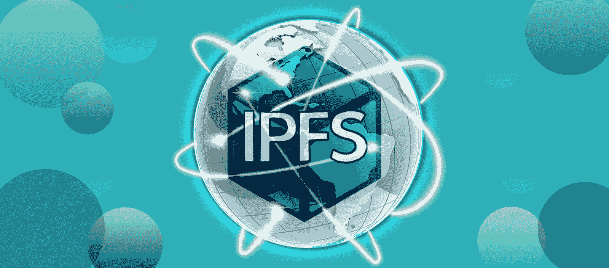

## 将 Web3 Unity 元数据和资产上传到 IPFS–演示

了解我们的 dapp 如何工作将有助于您决定是否要自己使用它。因此，我们从一个快速简单的演示开始“Web3 Unity 元数据”主题:

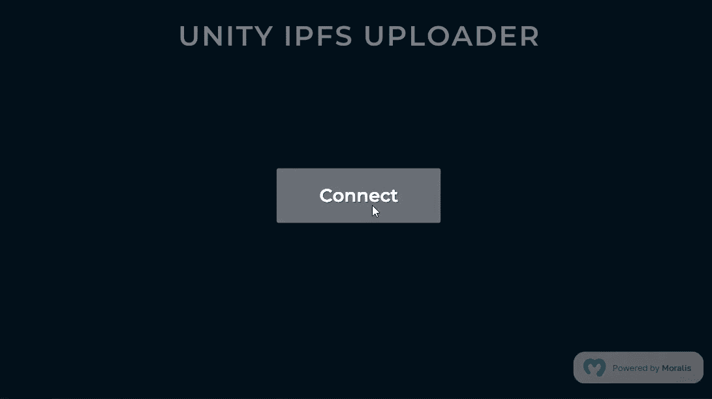

以上是我们的“团结 IPFS 上传者”dapp 的初始屏幕截图。如前所述，用户必须首先点击“连接”按钮连接他们的 [Web3 钱包](https://moralis.io/what-is-a-web3-wallet-web3-wallets-explained/)。完成后，dapp 会显示一个二维码，用户需要使用他们的加密钱包扫描该二维码:

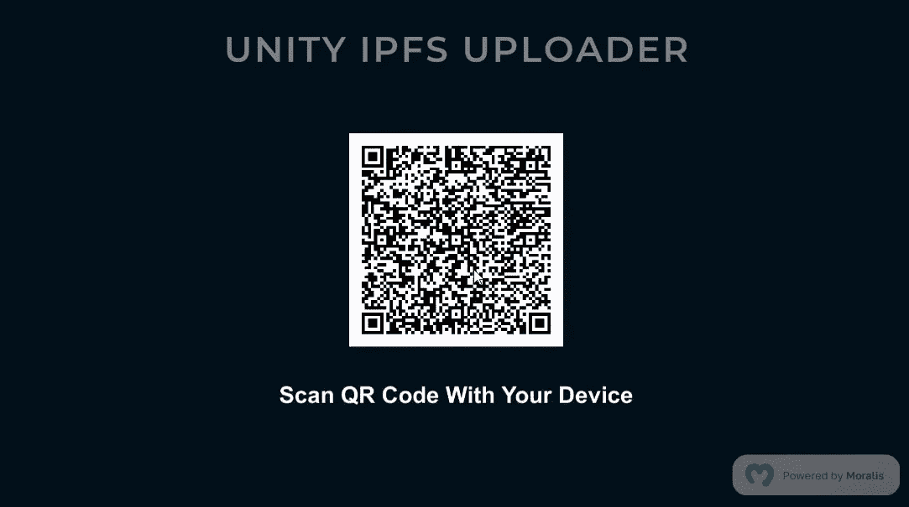

由于大多数用户仍然喜欢用元掩码进行[认证，我们的演示集中在使用](https://moralis.io/how-to-authenticate-with-metamask/)[元掩码](https://moralis.io/metamask-explained-what-is-metamask/)上。但是，这是用移动设备完成的，你在截图中看不到。扫码后，屏幕上出现“用你的钱包签名”的信息，表示 [Web3 登录](https://moralis.io/how-to-build-a-web3-login-in-5-steps/)流程:

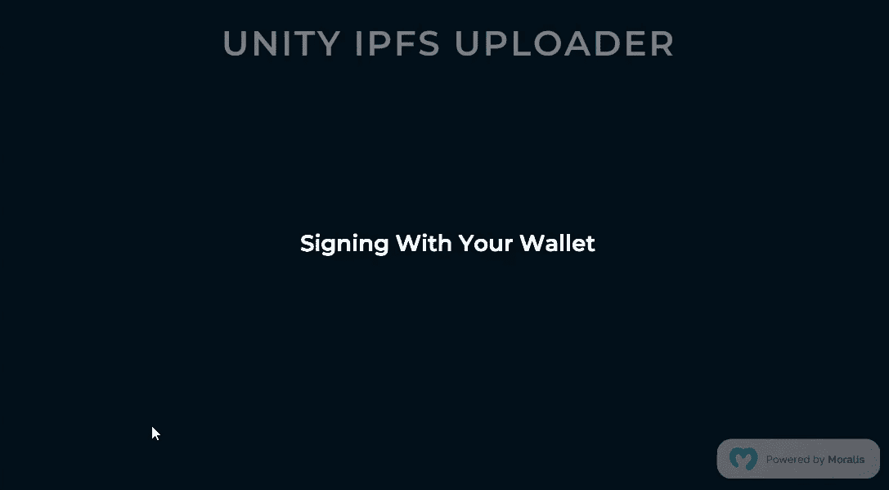

接下来，用户必须通过“签署”确认消息来确认他们钱包内的 [Web3 认证](https://moralis.io/web3-authentication-the-full-guide/)。只要他们点击移动设备上的“签名”按钮，他们就会看到我们 dapp 的核心:

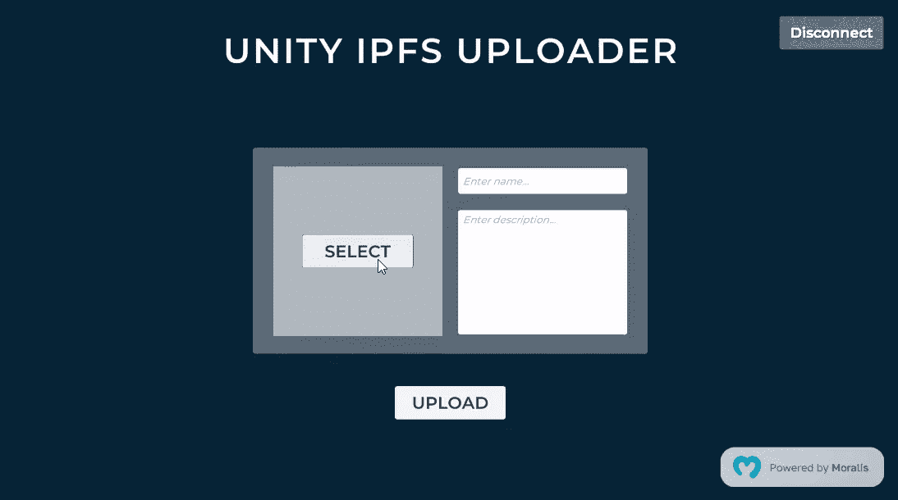

上面的截图显示了设计用于将 Web3 Unity 元数据和资产上传到 IPFS 的界面。因此，让我们看看如何在一个图像示例文件上这样做。

### 上传文件及其元数据

看上面的截图，你可以看到右上角的“断开”按钮。这是用户想要签名时需要点击的地方(断开他们的加密钱包)。另一方面，如果我们把重点放在上传一个文件到 IPFS，两个按钮就可以了:“选择”和“上传”。显然，在用户上传文件之前，他们需要选择它。因此，他们需要单击“选择”按钮，这会弹出一个窗口:

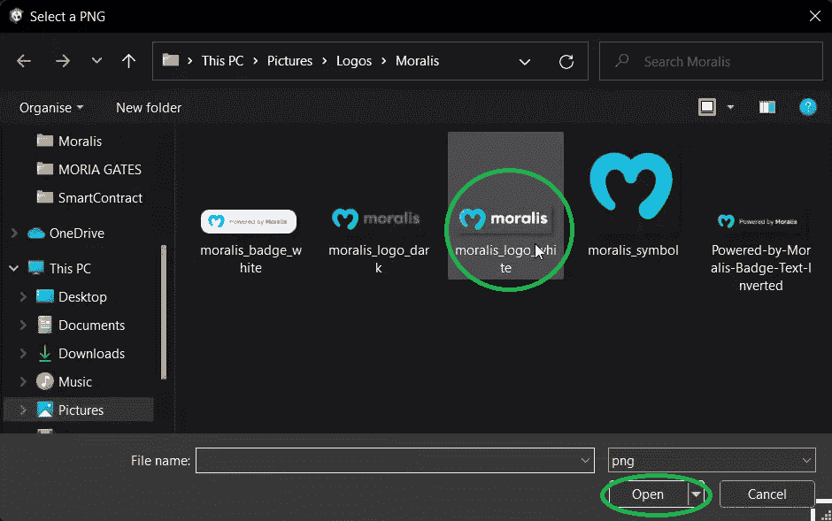

*注意:* *我们以图像文件(PNG)为重点构建了我们的示例 dapp。但是，您可以使用相同的 dapp 将其他类型的文件及其元数据上传到 IPFS。*

正如上面的截图所示，用户需要点击一个图像来选择它，然后使用“打开”按钮。一旦文件被选中，我们的 dapp 就会收集它的详细信息。此外，它还在“选择”按钮下生成文件(精灵)的预览:

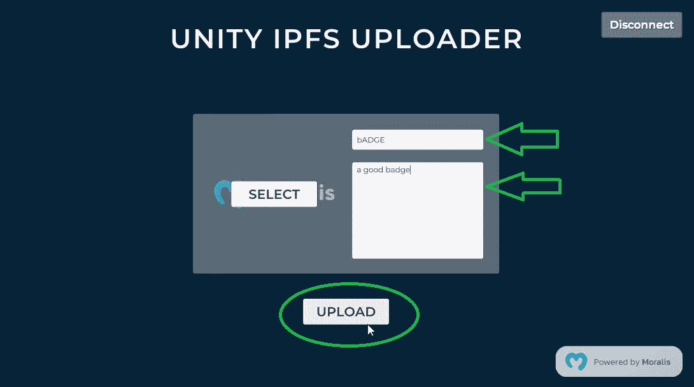

尽管如此，上传按钮是锁定的，直到用户输入文件的名称和描述。然而，一旦用户输入文件的详细信息，他们就可以使用“上传”按钮。通过这样做，我们的 dapp 机制将文件上传到 IPFS。它还会创建该文件的 web Unity 元数据，其格式为“.JSON”文件。此外，dapp 还将元数据存储到 IPFS，并向用户提供资产的 URL。因此，用户可以在浏览器中查看上传文件及其元数据:

*   Web3 Unity 元数据:


*   图像文件:

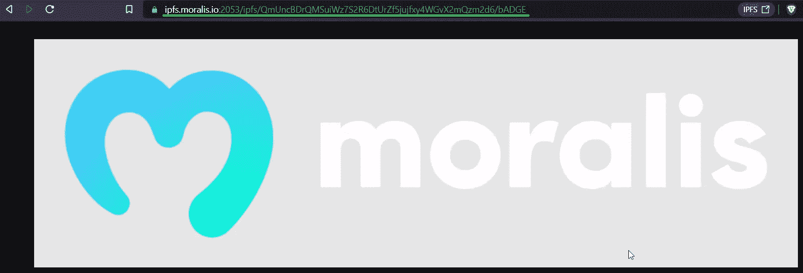

*注意:如果你喜欢视频形式的演示，可以查看本文下面的剪辑。*


## 使用 Moralis 上传 Web3 Unity 元数据

随着我们的发展，我们将向您展示如何设置使用上述 dapp 和上传 Web3 Unity 元数据到 IPFS。同样，这也是我们使用道德的地方。当前 [Web3 技术栈](https://moralis.io/exploring-the-web3-tech-stack-full-guide/)的这一顶峰使得前端开发者能够轻松创建杀手级应用。此外，这个“ [Firebase for crypto](https://moralis.io/firebase-for-crypto-the-best-blockchain-firebase-alternative/) ”平台消除了 RPC 节点的所有[限制。](https://moralis.io/exploring-the-limitations-of-rpc-nodes-and-the-solution-to-them/)

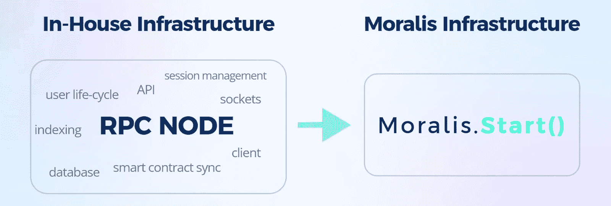

Moralis 提供了一个单一的工作流程，使区块链编程尽可能简单。这个过程通常从 Web3 认证开始，这是 Moralis 提供几个选项的地方。使用简短的代码片段，你甚至可以通过电子邮件进行 [Web3 认证，或者实现](https://moralis.io/how-to-do-web3-authentication-via-email/) [Web3 社交登录](https://moralis.io/web3-social-login-sign-in-dapp-users-with-google-email-or-twitter/)。因此，你可以提升你的 [Web3 用户入职](https://moralis.io/how-to-boost-web3-user-onboarding-success-rates/)，甚至开始探索没有元掩码的 [Web3。此外，Moralis 还为经过身份验证的用户建立会话并创建身份配置文件。它将这些信息存储在一个实时的链上数据库(Moralis dashboard)中。在这个数据库的帮助下，你可以毫不费力地找到区块链的索引。同时，您也可以使用 Moralis 仪表板来](https://moralis.io/web3-without-metamask-web3-authentication-alternatives/)[存储链外数据](https://moralis.io/how-to-store-off-chain-data-unity-web3-database/)。

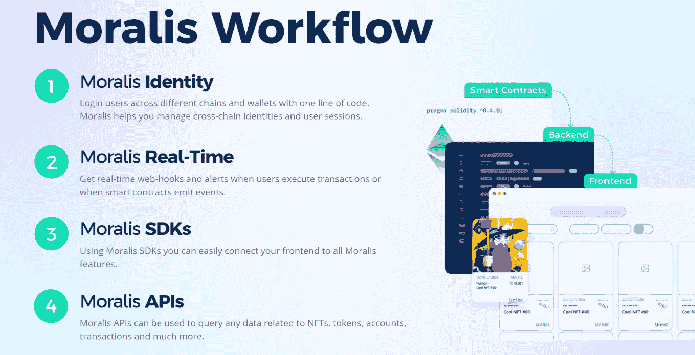

除此之外，您还可以使用 Moralis 的“同步”功能来同步和索引智能合约事件。此外，Moralis 为你提供了[终极 Web3 SDK](https://moralis.io/exploring-moralis-sdk-the-ultimate-web3-sdk/) 和强大的 API，包括[以太坊 API](https://moralis.io/ethereum-api-develop-ethereum-dapps-with-moralis/) 和 [NFT API](https://moralis.io/ultimate-nft-api-exploring-moralis-nft-api/) 。因此，您可以轻松地与数据库进行通信。您还应该注意到，Moralis 提供了跨链和跨平台的互操作性。这让你有机会使用你最喜欢的平台，并扩大你在多个网络的影响力。后者也是你工作的未来证明，因为你不局限于任何一个区块链。

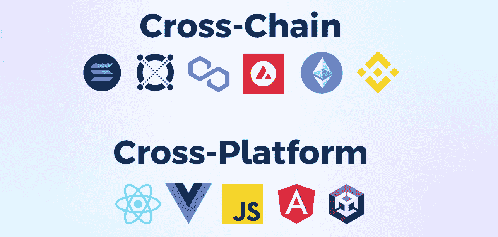

## Web3 Unity 元数据上传解决方案–使用我们的示例 Dapp

我们的示例 dapp 在 [GitHub](https://github.com/MoralisWeb3/youtube-tutorials/tree/main/unity/unity-web3-ipfs-uploader) 上等着你。所以，从下载项目开始，用 Unity 打开它。完成后，您将看到“Moralis Web3 设置”面板:

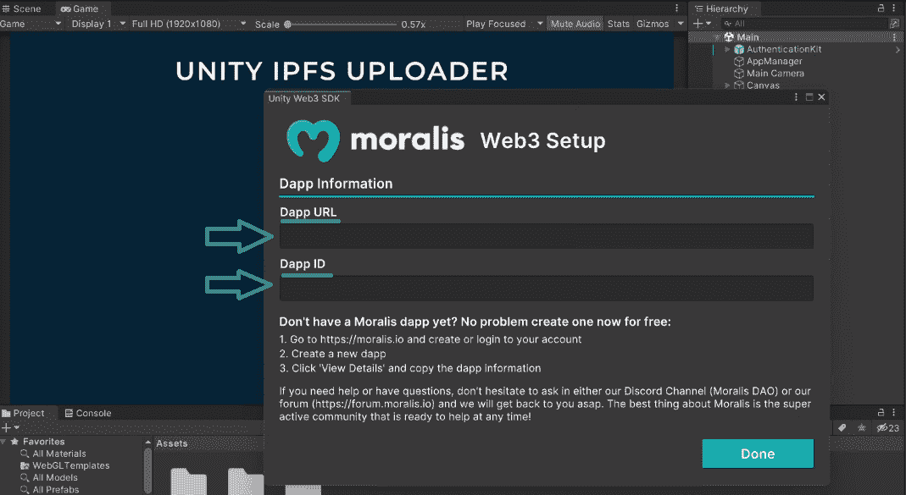

上面的截图向您展示了面板附带的说明。这些包括以下核心步骤:

1.  创建您的新 Moralis 帐户或[登录您现有的帐户](https://admin.moralis.io/login)。
2.  创造一个道德的 dapp。这是你[创建道德服务器](https://docs.moralis.io/moralis-dapp/getting-started/create-a-moralis-dapp#2.-create-a-moralis-server)的地方。
3.  将活动服务器的详细信息(服务器 URL 和应用 ID)复制到上面的面板中。

我们决定“牵着你的手”，带你完成上述步骤，让事情尽可能简单明了。

### 道德入门

如果您还没有这样做，请创建您的免费 Moralis 帐户或使用您的凭据登录您的帐户:

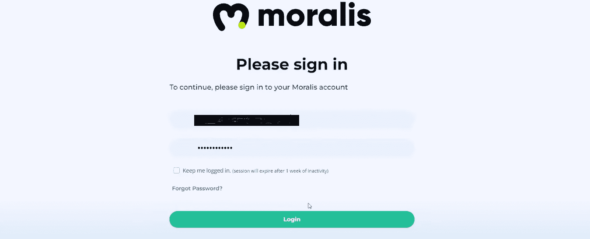

Moralis 管理区的“服务器”部分将允许您创建一个新的服务器。*如果这不是你第一次参加道德竞技，屏幕上的向导会为你指出正确的方向:*


接下来，您需要选择您的服务器类型:


当处理示例项目或测试 dapps 时,“Testnet Server”选项应该是您关注的焦点。然后，您需要输入服务器的详细信息:

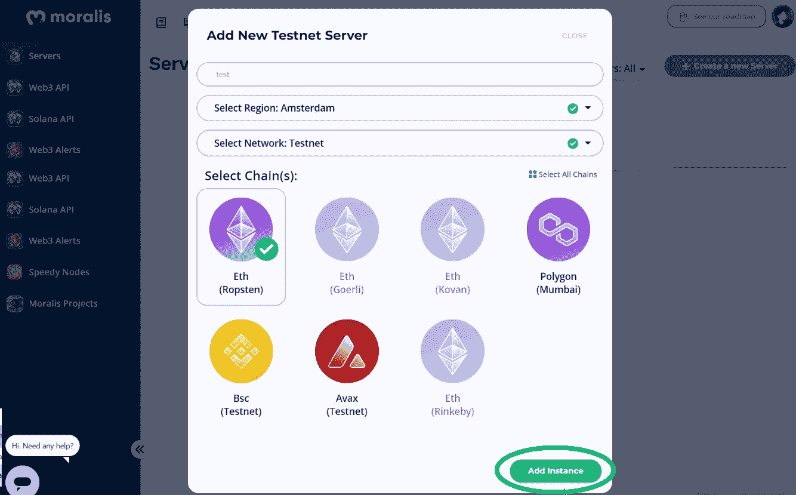

首先输入一个名字(可以是任何你想要的名字)。接下来，选择离你最近的地区。然后，选择您想要关注的链。在测试网中，你有[以太坊测试网](https://moralis.io/ethereum-testnet-guide-connect-to-ethereum-testnets/)和其他几个 [EVM](https://moralis.io/evm-explained-what-is-ethereum-virtual-machine/) 兼容的网络(见上图)。最后，通过点击“添加实例”来启动您的服务器。一旦您的服务器上线，您可以通过“查看详细信息”按钮访问其详细信息:


在新的弹出窗口中，复制服务器 URL 和应用程序 ID:


然后将上面复制的详细信息粘贴到“Moralis Web3 设置”面板中，并单击“完成”:

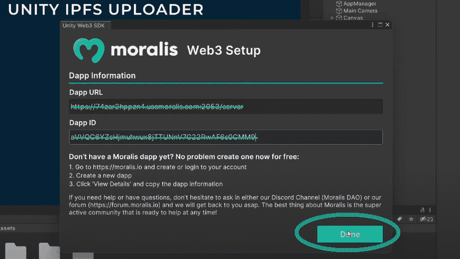

### 启动您的统一 IPFS 上传 Dapp 的实例

如果您已经按照说明完成了上述初始设置，现在您可以使用我们的 dapp。因此，单击播放图标:

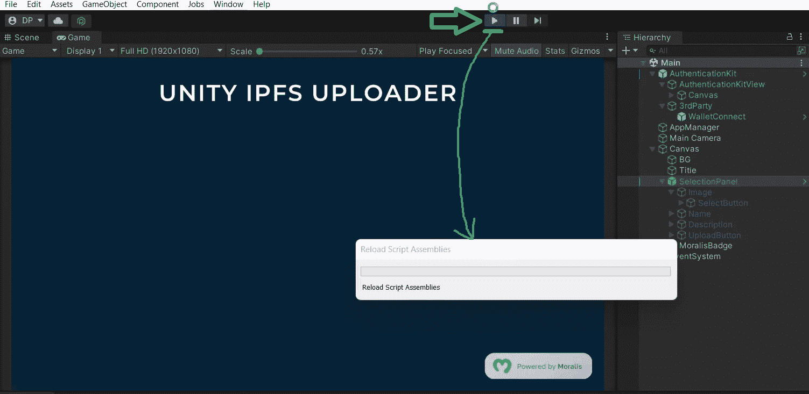

一旦重新加载完成，你会看到“连接”按钮。如果你记得我们的演示，这是一切开始的地方。因此，你已经知道如何使用“统一 IPFS 上传”dapp 上传 Web3 统一元数据和文件到 IPFS。


## 上传 Web3 Unity 元数据–代码演练

我们的 dapp 的功能有两个核心方面:选择一个文件，并将选择的文件上传到 IPFS。我们将看看支持这两个功能的脚本。这样，您将有机会了解我们的 dapp 如何通过原生 Windows 文件浏览器选择 PNG 文件。此外，您可以看到使用 Moralis SDK 的好处。毕竟，正是道德的力量使得上传 Web3 Unity 元数据变得尽可能简单。

### “选择面板”脚本

查看我们项目的层次结构，您可以看到“Canvas”中的“SelectPanel”对象:


这个对象负责选择图像。而且“SelectionPanel”是用户登录成功后自动激活的。后者在“AuthenticationKit”中设置:

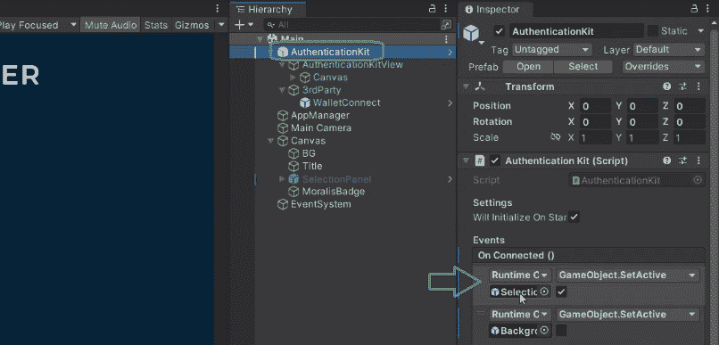

如果我们现在将注意力集中在“ [SelectionPanel](https://github.com/MoralisWeb3/youtube-tutorials/blob/main/unity/unity-web3-ipfs-uploader/Assets/_Project/Scripts/SelectionPanel.cs) ”脚本上，我们必须指出“SelectImage()”函数。一旦用户点击“选择”按钮，这个功能就具有最重要的作用。基本上，“SelectImage()”函数通过“OpenFilePanel”方法打开本机 Windows 文件浏览器:

```js
 *_imagePath = EditorUtility。OpenFilePanel("选择一个 PNG "，""，" PNG ")；*

```
注意: *上面一行代码是你需要应用必要的改变来为其他类型的文件使用我们的 dapp。*一旦用户选择了一个文件，“选择图像”功能使用文件的路径，读取其所有字节，并返回图像数据。然后，它通过使用“LoadImage”从该图像数据创建一个 sprite。“应用管理器”脚本下一步是上传 sprite，输入“OnUploadButtonPressed()”(在“SelectionPanel”脚本中):

```js
        public void OnUploadButtonPressed()
        {
            if (image.sprite == null || nameInput.text == string.Empty || descriptionInput.text == string.Empty)
            {
                Debug.Log("All fields (image, name and description) need to be filled");
                return;
            }

            UploadButtonPressed?.Invoke(nameInput.text, descriptionInput.text, _imagePath, _imageData);
            uploadButton.interactable = false;
        }
```

上面几行代码显示“上传”按钮只有在三个条件都满足时才起作用。只有在用户选择一个图像(创建了一个精灵)并输入他们的文件名和描述后，它才会被激活。仅当所有条件都满足时，“ [AppManager](https://github.com/MoralisWeb3/youtube-tutorials/blob/main/unity/unity-web3-ipfs-uploader/Assets/_Project/Scripts/AppManager.cs) ”脚本才接管工作。该脚本包括“UploadToIpfs”函数，它完成了大部分繁重的工作。这个函数获取文件的细节并将文件保存到 IPFS。它首先使用“SaveImageToIpfs”上传图像文件:

```js
List<IpfsFile> resp = await Moralis.GetClient().Web3Api.Storage.UploadFolder(requests);
```

看着上面的代码行，你可以看到道德的力量。多亏了它的“UploadFolder”方法，一行代码就把图像上传到了 IPFS。最后，“AppManager”还确保上传文件的元数据被创建(“BuildMetadata”)。然后，它让“SaveToIpfs”上传 Web3 Unity 元数据文件(“.JSON”)到 IPFS。最后但同样重要的是，“AppManager”还通过“ResetUploadButton”函数重置上传按钮。这可以防止用户多次上传相同的文件。如果你更喜欢视频，请务必观看我们的“上传者”dapp 的教程:https://www.youtube.com/watch?v=rVlh2BzjmU4上传 Web3 Unity 元数据-摘要通过阅读本文，您有机会了解如何轻松地将 Web3 Unity 元数据上传到 IPFS。此外，如果你按照上述说明，你现在有我们的“团结 IPFS 上传”dapp 自己的实例。如果是这样，您必须已经完成了初始的 Moralis 设置，这意味着您已经准备好处理一些示例项目。如果你喜欢制作 Web3 游戏，我们推荐你使用我们的 Unity 教程。因此，你可以着手将一个 [Unity 游戏与 Web3 登录](https://moralis.io/connecting-a-unity-game-with-web3-login/)连接起来，学习如何[将一个 Unity 应用程序连接到 Web3 钱包](https://moralis.io/how-to-connect-a-unity-app-to-a-web3-wallet/)，或者甚至构建一个 [Web3 MMORPG](https://moralis.io/build-a-web3-mmorpg-with-unity-in-10-minutes/) 。另一方面，你可能更喜欢使用你的 [JavaScript](https://moralis.io/javascript-explained-what-is-javascript/) (JS)熟练程度。在这种情况下，你可能想要构建一个优秀的 [2D Web3 游戏](https://moralis.io/how-to-build-a-2d-web3-game-full-guide%ef%bf%bc/)或者关注其他使用 [React](https://moralis.io/react-explained-what-is-react/) 的 dapps。你可以在 [Moralis YouTube 频道](https://www.youtube.com/c/MoralisWeb3)和 [Moralis 博客](https://moralis.io/blog/)上获得我们所有的教程和文章。一些最新的话题包括一个 [dapp 开发教程](https://moralis.io/dapp-development-tutorial-full-guide-to-building-a-dapp/)，一个[crypto perspective dapp](https://moralis.io/how-to-create-a-crypto-sentiment-dapp/)， [blockend 开发](https://moralis.io/blockend-development-what-is-it-and-how-to-become-a-blockend-developer/)，如何[用 Phantom wallet 认证 Solana 用户](https://moralis.io/how-to-authenticate-solana-users-with-the-phantom-wallet/)，以及创建一个[链上库存系统](https://moralis.io/create-an-nft-on-chain-inventory-system-for-gaming/)。此外，这两个出口也可以作为您的免费和持续的密码教育。然而，如果你渴望更快更自信地成为一名 Web3 开发者，你应该考虑一种更专业的方法。这正是道德学院所提供的。除了顶尖的[区块链发展课程](https://academy.moralis.io/all-courses/)，你还将获得个性化的学习路径和专家指导。最后但同样重要的是，你也将成为业内最先进、最受欢迎的社区之一的一员。    

```js

```