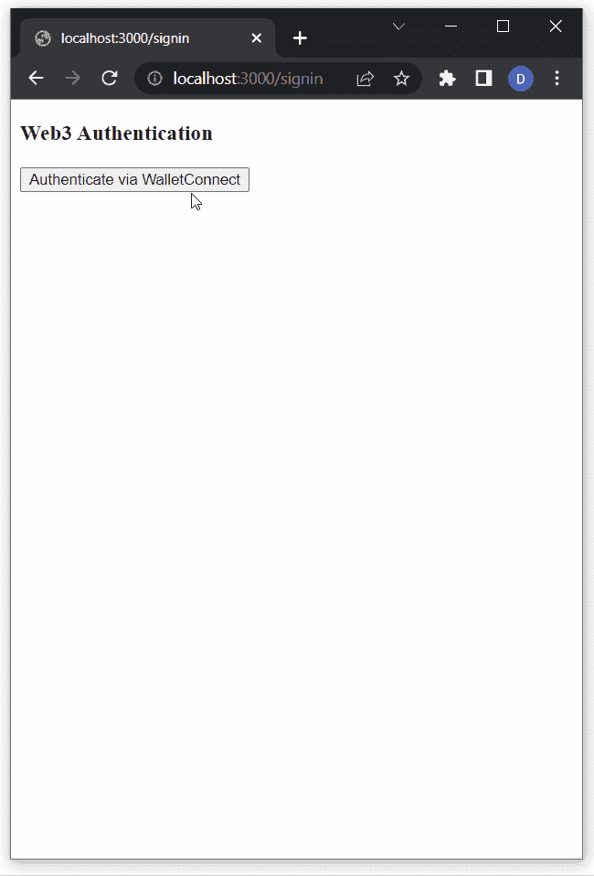
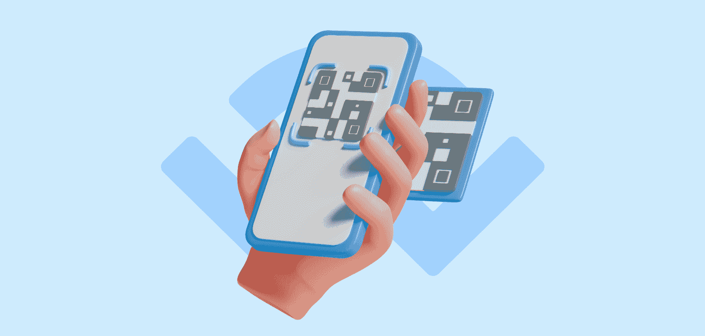
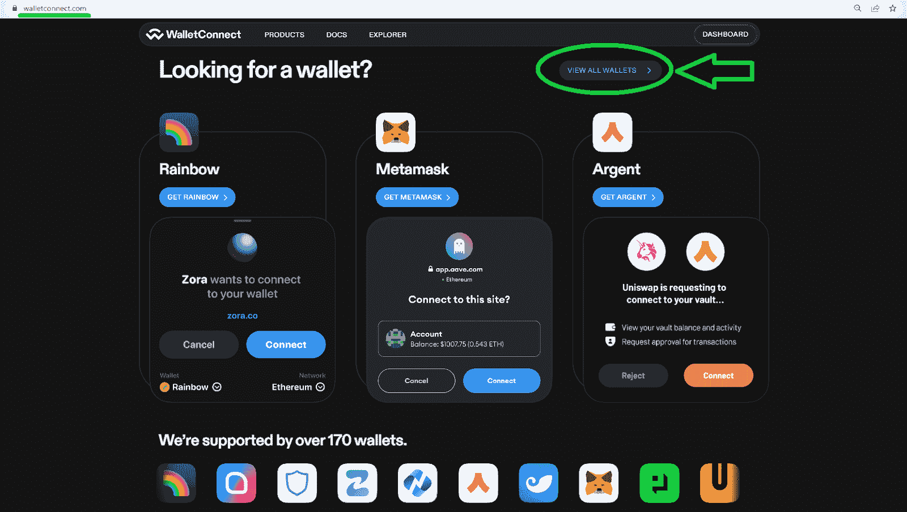
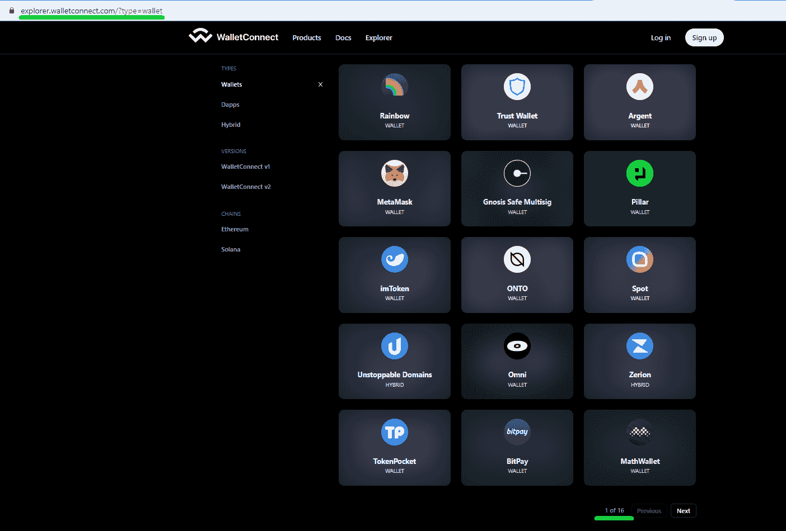
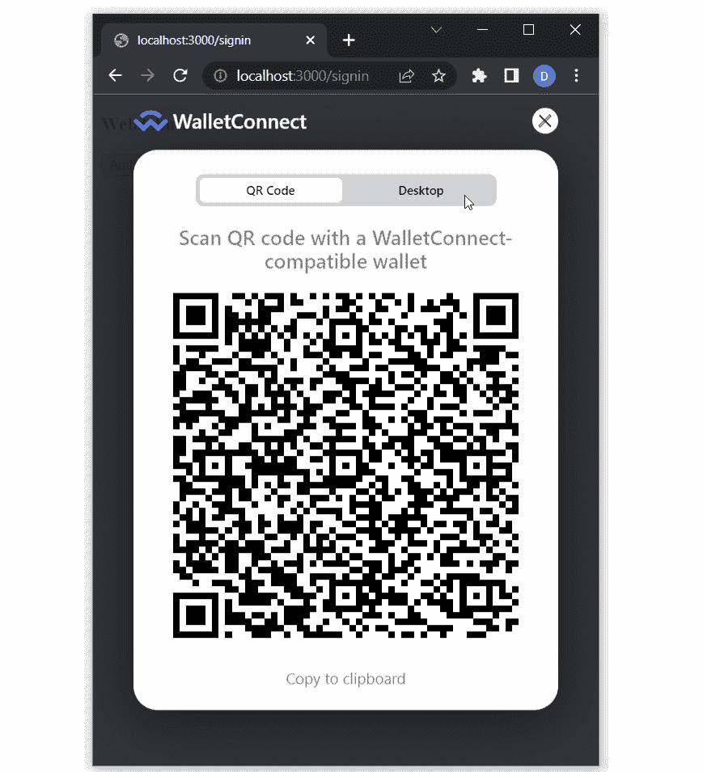
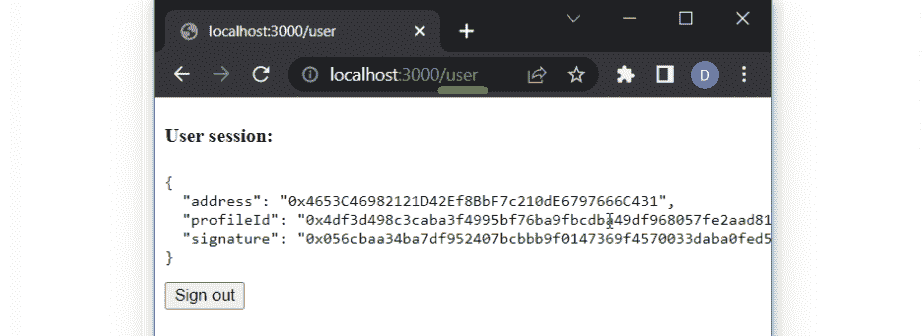
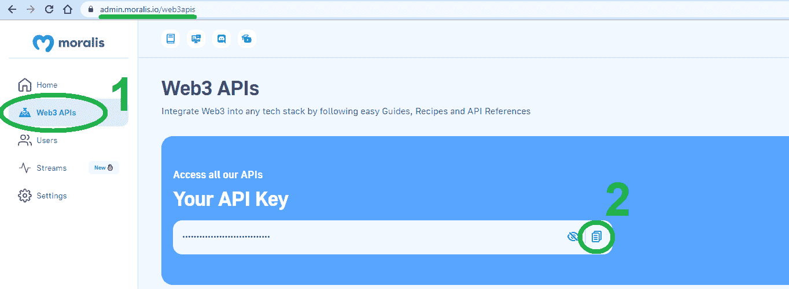
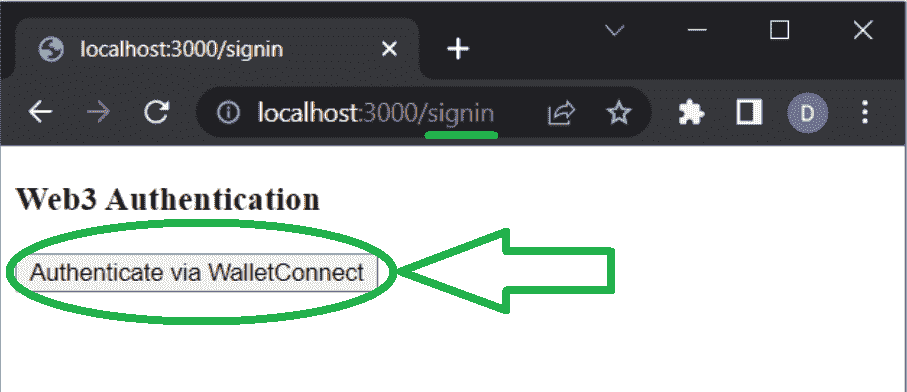
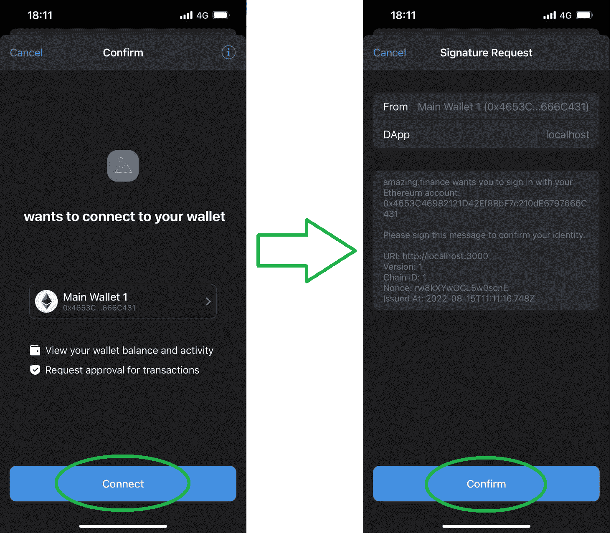

# WalletConnect 集成–如何集成 WalletConnect

> 原文：<https://moralis.io/walletconnect-integration-how-to-integrate-walletconnect/>

本教程着眼于通过 Moralis 添加安全认证，以及如何将 WalletConnect 集成到您的 Web3 项目中。通过遵循本教程，您可以在创纪录的时间内启动并运行身份验证解决方案，如下图所示，展示了 WalletConnect 集成:



如果您是一名经验丰富的开发人员，请在我们的文档页面上访问完整的文件结构和代码，以便立即开始。但是，如果您想要一个如何集成 WalletConnect 的分步指南，我们建议从头到尾阅读这篇文章！

[**Access WalletConnect Integration Documentation**](https://docs.moralis.io/docs/sign-in-with-walletconnect)

### 概观

Web3 身份验证是 dapp(分散式应用程序)的网关，使用 Moralis 的 [Web3 身份验证 API](https://moralis.io/authentication/) ，您可以毫不费力地将 Web3 登录添加到任何 dapp。该 API 支持所有主要解决方案，包括 WalletConnect 集成。由于后者往往是移动用户的最佳选择，因此作为开发人员，您必须学习如何集成 WalletConnect。毕竟，这种开源协议支持 170 多个加密钱包，使其成为最用户友好的 Web3 身份验证方法之一。此外，由于 Moralis 完全是关于跨链互操作性的，它的 Auth API 使您能够跨所有领先的区块链实现 WalletConnect 到 dapps。此外，Moralis 使您能够将其集成为一个独立的 Web3 登录解决方案，或者将其与其他 Web3 onboarding 方法相结合。**T3】**

今天文章的核心部分将向您展示如何使用 Moralis 添加 WalletConnect 集成。在这里，您将有机会创建一个简单的 NextJS 应用程序，并将 WalletConnect 集成为一个身份验证解决方案。然而，在我们邀请您卷起袖子之前，我们需要了解一些基础知识。因此，我们将首先确保你们都知道 WalletConnect 是什么，以及哪些钱包与这个简洁的解决方案兼容。然而，如果你已经熟悉了这些基础知识，请随意[创建你的免费道德账户](https://admin.moralis.io/register)并跳转到“*添加 WalletConnect 集成*”部分。



## wallet connect–这是什么？

WalletConnect 是一种开源协议，可用于在各种加密钱包和 dapps 之间建立连接。该协议确保钱包、应用程序或设备之间的连接是安全的。毕竟，当您使用 WalletConnect 建立这些连接时，它的协议通过两个对等方之间的共享密钥使用对称加密。

本质上，WalletConnect 是一个分散的 Web3 消息层，是连接区块链钱包和 dapps 的标准。此外，WalletConnect 团队的任务是不断扩展 Web3 空间的互操作性。因此，可以很有把握地认为 WalletConnect 将继续为 Web3 钱包和 dapps 提供最好的工具和基础设施。此外，WalletConnect v2 与链无关，并与您选择的任何区块链兼容。因此，选择该解决方案时，很容易提供出色的用户体验。

以下是 WalletConnect 的三个核心功能:

*   **不可知链**–像大多数 Web3 项目一样，WalletConnect 意识到未来很可能是面向多链的。因此，它已经支持各种链，包括以太坊，索拉纳，和许多其他的。此外，他们致力于继续增加对更多链的支持。
*   **多链**–由于 WalletConnect 的多链支持，您可以将任何受支持的钱包同时连接到多个链。
*   **平台无关**–**wallet connect 支持不同的平台。因此，您可以在 web 或桌面、移动和游戏应用程序上使用 WalletConnect 的协议。**

**

### 与 WalletConnect 建立联系–它是如何工作的？

当使用 WalletConnect 集成时，用户有两种方法来建立钱包和 dapps 之间的连接。他们可以通过扫描二维码来完成，这是首选方法，也是默认提供的。但是，用户也可以使用深层链接。在这两种情况下，一个对等体(或 dapp)发送代码或链接，而另一个必须扫描或批准它。因此，当您将 WalletConnect 集成到 dapps 中时，您可以让用户轻松建立安全可靠的 Web3 连接。

### 有哪些钱包兼容 WalletConnect？

根据 WalletConnect 官方网站，他们的解决方案可以与 170 多个 Web3 钱包配合使用。由于这个数字非常高，在此列出所有支持的钱包没有多大意义。但是，您可以通过访问 WalletConnect 的官网查看所有支持的钱包。在那里，向下滚动到“*寻找钱包？*”部分，并点击“查看所有钱包”按钮:



在下一页，您将能够查看所有受支持的加密钱包:



此外，正如上面的截图所示，所有支持的 Web3 钱包都在 16 页中列出。由于每页有 15 个钱包，总共有 15 页，看起来 WalletConnect 已经支持超过 225 个加密钱包。

## 添加 WalletConnect 集成

在这一部分，您将了解如何将 WalletConnect 集成添加到您的 dapps 中。如上所述，我们将重点创建一个 NextJS 应用程序，并使用 Moralis 的 Web3 Auth API 为它配备这个解决方案。因此，如果您决定跟随我们，您将很快拥有集成了 WalletConnect 的 dapp。事实上，下面是您将要构建的内容的快速预览:


点击“通过 WalletConnect 认证”按钮后，将弹出一个二维码，使您(或您的用户)能够通过扫描该码连接您的 Web3 钱包:



最后，在成功完成 Web3 身份验证过程后，我们的 dapp 还将显示有关连接钱包的一些基本信息:



### 先决条件和初始设置

如果您想在我们的指导下构建上面演示的 dapp，请确保您完成了以下先决条件:

*   准备好你的道德账户。
*   安装和设置 Visual Studio 代码(VSC)。
*   创建你的 NextJS dapp。如果你需要这方面的帮助，请使用 NextJS 文档中的“*创建下一个应用程序*”页面，或者使用 NextJS 完成我们的“ [*”教程。*](https://docs.moralis.io/docs/nextjs-dapp)

如果您已经满足了上述先决条件，请继续安装所需的依赖项。本质上，您需要安装 Moralis、NextAuth 和 Axios。为此，请使用以下命令之一(取决于您使用的软件包管理器:

```js
npm install moralis next-auth axios
```

```js
yarn add moralis next-auth axios
```

```js
pnpm add moralis next-auth axios
```

接下来，您需要一个 Web3 库。当然，有几种选择供您选择；然而，我们鼓励你跟随我们的领导，使用和记。因此，使用以下命令之一安装“wagmi”依赖项:

```js
npm install wagmi ethers
```

```js
yarn add wagmi ethers
```

```js
pnpm add wagmi ethers
```

#### 添加环境变量

有了上面的依赖项，就可以在“. env.local”文件中添加所需的环境变量了。此外，请确保您的应用程序根目录下有该文件。以下是您需要添加的变量:

*   "**APP _ DOMAIN**"–这是一个请求签名的" *RFC 4501* " DNS 机构。
*   "**MORALIS _ API _ KEY**"–您可以在您的 MORALIS 管理区的“Web3 APIs”页面获取密钥:



*   "**next auth _ URL**"–这是你的 dapp 地址，在开发阶段，你会使用" *http://localhost:3000* "或者另一个端口。
*   "**next auth _ SECRET**"–使用这个变量来加密用户的 JWT 令牌。此外，您可以在这里输入任何值，或者在“【https://generate-secret.now.sh/32】”生成一个值。

此外，为了帮助您更好地理解上述环境变量，请务必看一下这个示例:


*注意* *:每当你修改你的“. env.local”文件，你需要重启你的 dapp。*

#### 包装您的应用程序

您可能知道，NextJS 使用“App”组件来初始化页面。但是，您可以重写该组件并控制页面初始化。为了实现这一点，您必须用“ *WagmiConfig* 和“ *SessionProvider* ”来包装您的页面。因此，在“pages”文件夹中创建“_app.jsx”文件，并用以下代码行填充该文件:

```js
import { createClient, configureChains, defaultChains, WagmiConfig } from 'wagmi';
import { publicProvider } from 'wagmi/providers/public';
import { SessionProvider } from 'next-auth/react';

const { provider, webSocketProvider } = configureChains(defaultChains, [publicProvider()]);

const client = createClient({
  provider,
  webSocketProvider,
  autoConnect: true,
});

function MyApp({ Component, pageProps }) {
  return (
    <WagmiConfig client={client}>
      <SessionProvider session={pageProps.session} refetchInterval={0}>
        <Component {...pageProps} />
      </SessionProvider>
    </WagmiConfig>
  );
}

export default MyApp;
```

#### 添加“requestMessage”端点

要添加“requestMessage”端点，您必须创建一个新的 API 文件。调用该文件的“request-message.js ”,并确保它在“auth”文件夹中，该文件夹应该在“pages/api”中。您将使用这个端点向" *Moralis 发出请求。Auth* ，这将生成一个唯一的消息。然后，您将在客户端签署该消息。以下是您应该在“request-message.js”文件中使用的代码行:

```js
import Moralis from 'moralis';

const config = {
    domain: process.env.APP_DOMAIN,
    statement: 'Please sign this message to confirm your identity.',
    uri: process.env.NEXTAUTH_URL,
    timeout: 60,
};

export default async function handler(req, res) {
    const { address, chain, network } = req.body;

    await Moralis.start({ apiKey: process.env.MORALIS_API_KEY });

    try {
        const message = await Moralis.Auth.requestMessage({
            address,
            chain,
            network,
            ...config,
        });

        res.status(200).json(message);
    } catch (error) {
        res.status(400).json({ error });
        console.error(error);
    }
}
```

### 使用 WalletConnect 集成创建登录页面

至此，您已经成功完成了初始设置。因此，是时候真正集成 WalletConnect 了。因此，创建一个新的页面文件(在“pages”文件夹中)，并将其命名为“signin.jsx”。此外，首先用下面几行代码填充该文件:

```js
function SignIn() {
    return (
        <div>
            <h3>Web3 Authentication</h3>
        </div>
    );
}

export default SignIn;
```

接下来，您希望使用同一个文件来创建一个按钮，该按钮将启用 Web3 身份验证。此外，您还需要" *console.log* "用户的详细信息(按照上面的演示)。因此，您需要扩展“signin.jsx”的内容以匹配以下内容:

```js
import { useConnect } from 'wagmi';
import { InjectedConnector } from 'wagmi/connectors/injected';
import axios from 'axios';

function SignIn() {
    const { connectAsync } = useConnect();

    const handleAuth = async () => {
        const { account, chain } = await connectAsync({ connector: new InjectedConnector() });

        const userData = { address: account, chain: chain.id, network: 'evm' };

        console.log(userData)
    };

    return (
        <div>
            <h3>Web3 Authentication</h3>
            <button onClick={() => handleAuth()}>Authenticate via WalletConnect</button>
        </div>
    );
}

export default SignIn;
```

#### 扩展“handleAuth”功能

上面几行代码已经确保了您的 Web3 身份验证页面看起来如上所示。然而，我们仍然需要添加实际的功能。因此，让我们首先扩展" *handleAuth* "功能，用它来调用上面创建的" *requestMessage* "端点。这样，您的“signin.jsx”文件应该如下所示:

```js
import { useAccount, useConnect, useSignMessage, useDisconnect } from 'wagmi';
import { InjectedConnector } from 'wagmi/connectors/injected';
import axios from 'axios';

function SignIn() {
    const { connectAsync } = useConnect();
    const { disconnectAsync } = useDisconnect();
    const { isConnected } = useAccount();
    const { signMessageAsync } = useSignMessage();

    const handleAuth = async () => {
        // Disconnects the Web3 provider if it's already active
        if (isConnected) {
            await disconnectAsync();
        }
        // Enabling WalletConnect
               const { account, chain } = await connectAsync({
            connector: new WalletConnectConnector({
                options: {
                    qrcode: true,
                },
            }),
        });

        const userData = { address: account, chain: chain.id, network: 'evm' };
        // Making a post request to our 'request-message' endpoint
        const { data } = await axios.post('/api/auth/request-message', userData, {
            headers: {
                'Content-Type': 'application/json',
            },
        });
        const message = data.message;
        const signature = await signMessageAsync({ message });

        console.log(signature)
    };

    return (
        <div>
            <h3>Web3 Authentication</h3>
            <button onClick={() => handleAuth()}>Authenticate via WalletConnect</button>
        </div>
    );
}

export default SignIn;

```

#### 配置 NextAuth

在“auth”文件夹中(路径:“pages/api/auth/”)，创建一个“[…nextauth]。js "文件，并用下面几行代码填充它:

```js
import CredentialsProvider from 'next-auth/providers/credentials';
import NextAuth from 'next-auth';
import Moralis from 'moralis';

export default NextAuth({
    providers: [
        CredentialsProvider({
            name: 'MoralisAuth',
            credentials: {
                message: {
                    label: 'Message',
                    type: 'text',
                    placeholder: '0x0',
                },
                signature: {
                    label: 'Signature',
                    type: 'text',
                    placeholder: '0x0',
                },
            },
              async authorize(credentials) {
                try {
                  // "message" and "signature" are needed for authorization
                  // We described them in "credentials" above
                  const { message, signature } = credentials;

                  await Moralis.start({ apiKey: process.env.MORALIS_API_KEY });

                  const { address, profileId } = (
                    await Moralis.Auth.verify({ message, signature, network: 'evm' })
                  ).raw;

                  const user = { address, profileId, signature };
                  // Returning the user object and creating  a session
                  return user;
                } catch (e) {
                  console.error(e);
                  return null;
                }
              },
        }),
    ],
    // Adding user info to the user session object
    callbacks: {
        async jwt({ token, user }) {
            user && (token.user = user);
            return token;
        },
        async session({ session, token }) {
            session.user = token.user;
            return session;
        },
    },
});
```

上面配置了 NextAuth，以便您可以将其添加到“signin.jsx”脚本中。此外，您可能已经注意到，上面的配置还利用了在上面的“. env.local”文件中创建的“MORALIS_API_KEY”变量。

#### 安全认证

对于“signin.jsx”文件的最后一个调整，您将添加 NextAuth 身份验证。您还需要从 wagmi 导入“ *WalletConnectConnector* ”，从 Next 导入“ *useRouter* ”，并扩展“登录”功能。最终，您的“signin.jsx”脚本应该是这样的:

```js
import { signIn } from 'next-auth/react';
import { useAccount, useConnect, useSignMessage, useDisconnect } from 'wagmi';
import { useRouter } from 'next/router';
import axios from 'axios';
import { WalletConnectConnector } from 'wagmi/connectors/walletConnect';

function SignIn() {
    const { connectAsync } = useConnect();
    const { disconnectAsync } = useDisconnect();
    const { isConnected } = useAccount();
    const { signMessageAsync } = useSignMessage();
    const { push } = useRouter();

    const handleAuth = async () => {
        if (isConnected) {
            await disconnectAsync();
        }
        // Added WalletConnectConnector
        const { account, chain } = await connectAsync({
            connector: new WalletConnectConnector({
                options: {
                    qrcode: true,
                },
            }),
        });

        const userData = { address: account, chain: chain.id, network: 'evm' };

        const { data } = await axios.post('/api/auth/request-message', userData, {
            headers: {
                'Content-Type': 'application/json',
            },
        });

        const message = data.message;

        const signature = await signMessageAsync({ message });

        // Redirect user after success authentication to '/user' page
        const { url } = await signIn('credentials', { message, signature, redirect: false, callbackUrl: '/user' });
        /**
         * instead of using signIn(..., redirect: "/user")
         * we get the url from callback and push it to the router to avoid page refreshing
         */
        push(url);
    };

    return (
        <div>
            <h3>Web3 Authentication</h3>
            <button onClick={() => handleAuth()}>Authenticate via WalletConnect</button>
        </div>
    );
}

export default SignIn;
```

### 通过 WalletConnect 集成将用户页面添加到 Dapp

完成这个简单的 NextJS dapp 与 WalletConnect 集成的最后一步是围绕“用户”页面。因此，转到“pages”文件夹并创建“user.jsx”文件。以下是您需要添加到该文件中的代码行:

```js
import { getSession, signOut } from 'next-auth/react';

// Gets a prop from getServerSideProps
function User({ user }) {
    return (
        <div>
            <h4>User session:</h4>
            <pre>{JSON.stringify(user, null, 2)}</pre>
            <button onClick={() => signOut({ redirect: '/signin' })}>Sign out</button>
        </div>
    );
}

export async function getServerSideProps(context) {
    const session = await getSession(context);

    // Redirect if not authenticated
    if (!session) {
        return {
            redirect: {
                destination: '/signin',
                permanent: false,
            },
        };
    }

    return {
        props: { user: session.user },
    };
}

export default User;
```

有了所有的脚本，是时候测试你的 dapp 了。

### 测试 WalletConnect 连接器

如果您使用“ *3000* ”端口作为您的“ *NEXTAUTH_URL* ”变量，请访问“*http://localhost:3000/sign in*”。在这里，您将能够测试您的 dapp 的认证流程。进入“登录”页面后，点击“通过 WalletConnect 进行身份验证”:



当二维码出现时，用你手机上最喜欢的 Web3 钱包扫码。例如，如果您决定使用信任钱包，您应该会在手机上看到以下内容(该过程与其他加密钱包类似):



如果认证成功，你应该登陆到“用户”页面(“*http://localhost:3000/user*”)。但是，如果认证不成功，您将被重定向回“签名”页面。

如果您遇到任何问题，请务必仔细阅读这些脚本。因此，请使用以下对今天进展的概述。最终，这些文件是您按照今天的教程创建和填充的:

*   "**. env . local**"–这是您存储所有本地变量的地方，包括您的 Moralis Web3 API 密钥。
*   "**_ app . jsx**"–你用这个文件用" *WagmiConfig* "和" *SessionProvider* "包装你的 app。
*   "**request-message . js**"–这个文件作为一个端点，用于请求生成一个唯一的消息。
*   "**sign in . jsx**"–这是覆盖“登录”页面的文件，使用户能够使用 WalletConnect 集成验证自己的身份。
*   " **[…nextauth]。js**"–这是您配置 NextAuth 的地方。
*   "**user . jsx**"–您创建了这个脚本来向成功通过身份验证的用户提供一些基本的用户数据。

## WalletConnect 集成–如何集成 wallet connect–摘要

我们在今天的文章中谈了相当多的内容。首先，您了解了什么是 WalletConnect，以及哪些钱包与这种开源协议兼容。因此，您现在知道有将近 200 个钱包可用于 WalletConnect 认证。有了这些基础知识，您就可以跟随我们向您展示如何将 WalletConnect 集成到一个简单的 NextJS 应用程序中了。为此，您完成了一些先决条件，安装了适当的依赖项，并完成了初始设置。然后，您只需将这里提供的代码行复制粘贴到我们指示您创建的文件中。最后但同样重要的是，你有机会试运行你的 dapp。

如果您喜欢本教程，我们鼓励您探索其他教程以及 [Moralis 文档](https://docs.moralis.io/)中的操作指南。例如，您可以使用 Moralis 和其他框架和开发平台创建 dapps。或者，你可以探索其他的 [Web3 认证选项](https://docs.moralis.io/docs/web3-authentication)。除了 Moralis 的文档，确保使用 [Moralis YouTube 频道](https://www.youtube.com/c/MoralisWeb3)和 [Moralis 博客](https://moralis.io/blog/)扩展你的区块链发展知识和技能。事实上，你可以使用这两个途径作为你的免费的区块链发展教育。一些最新的文章关注于 [Dogechain](https://moralis.io/build-with-dogecoin-on-evm-what-is-dogechain/) 、 [Aptos](https://moralis.io/what-is-aptos-full-guide-to-the-aptos-blockchain/) 、Sui 区块链、终极[区块链技术栈](https://moralis.io/the-ultimate-blockchain-tech-stack-guide/)、领先的 [Web3 基础设施](https://moralis.io/web3-infrastructure-exploring-the-best-solution-for-web3-development/)解决方案、[跨链桥接](https://moralis.io/cross-chain-bridging-deep-dive/)等等。

另一方面，你可能有兴趣尽快成为全职加密员。在这种情况下，你应该通过注册[道德学院](https://academy.moralis.io/)成为区块链认证。如果你想成为一个有前途的 Web3 项目的领导者，那么“[区块链商业大师班](https://academy.moralis.io/courses/blockchain-business-masterclass)”课程绝对值得你关注。

**