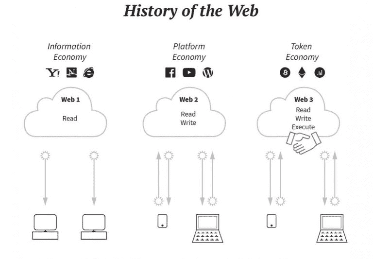
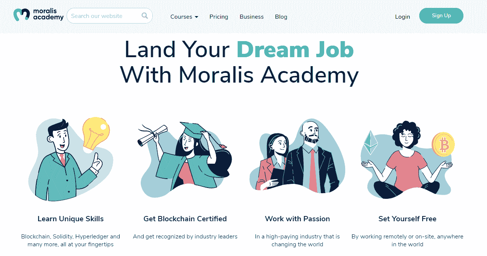
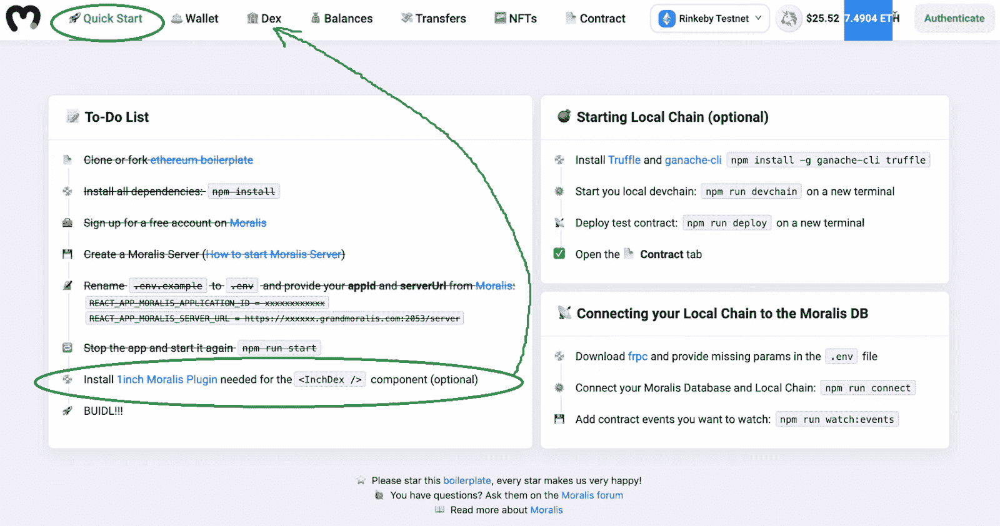
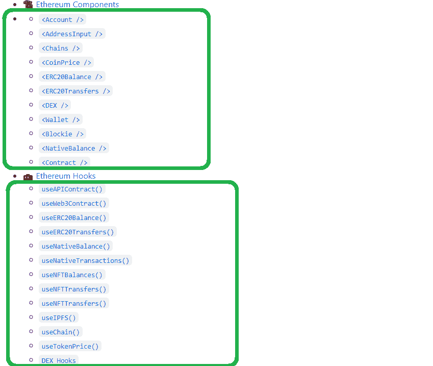

# Web3 样板–web 3 初学者指南

> 原文：<https://moralis.io/web3-boilerplate-beginners-guide-to-web3/>

十多年前，对未来有着更清晰愿景的人看到了 Web3 和区块链颠覆性技术的巨大潜力。得益于这项技术的众多使用案例和各个领域，如[**【NFTs】**](https://moralis.io/non-fungible-tokens-explained-what-are-nfts/)**[**即玩即赚游戏**](https://moralis.io/what-are-nft-games-and-how-to-make-nft-games/) **、收藏品、数字艺术和分散的社交媒体，越来越多的人开始从 Web2 过渡到 Web3。因此，现在是开发人员学习如何** [**创建 Web3 应用**](https://moralis.io/how-to-create-an-ethereum-dapp-instantly/) **的时候了，尤其是当诸如 Moralis 这样的平台提供了 Web3 样板(以及许多其他工具)时，这大大简化了过程。因此，如果你是那些渴望成为一名区块链开发者的人之一，并且想要扩展你关于这个主题的知识，那么这本 Web3 初学者指南将会非常有益。****

**虽然许多区块链开发人员仍然通过直接在 [RPC 节点](https://moralis.io/ethereum-rpc-nodes-what-they-are-and-why-you-shouldnt-use-them/)之上构建来创建[dapp](https://moralis.io/decentralized-applications-explained-what-are-dapps/)，但是有一种更简单、更先进的方法可用。感谢最终的 Web3 开发平台——[Moralis](https://moralis.io/)([Firebase for crypto](https://moralis.io/firebase-for-crypto-the-best-blockchain-firebase-alternative/))，你可以克服 RPC 节点的所有[限制。Moralis 为您提供免费访问其](https://moralis.io/exploring-the-limitations-of-rpc-nodes-and-the-solution-to-them/) [Speedy Nodes](https://moralis.io/speedy-nodes/) 服务([节点提供商](https://moralis.io/infura-alternatives-and-blockchain-node-providers/))、服务器、数据库、 [ultimate Web3 SDK](https://moralis.io/exploring-moralis-sdk-the-ultimate-web3-sdk/) 、[以太坊 API](https://moralis.io/ethereum-api-develop-ethereum-dapps-with-moralis/) ，包括 [ultimate NFT API](https://moralis.io/ultimate-nft-api-exploring-moralis-nft-api/) ，一套强大的[以太坊认证](https://moralis.io/ethereum-authentication-full-tutorial-to-ethereum-login-programming/)集成，以及分散存储解决方案( [IPFS](https://moralis.io/what-is-ipfs-interplanetary-file-system/) 集成)。此外，我们还创建了最好的 Web3 样板(也称为终极[以太坊 dApp 样板](https://moralis.io/ethereum-dapp-boilerplate-full-ethereum-react-boilerplate-tutorial/))，使您能够在几分钟内使用前面列出的所有功能。本质上，通过使用这个 Web3 样板文件，您可以在几分钟内建立并运行一个相对高级的 dApp。此外，Moralis 还整合了跨链互操作性，使您的所有 Web3 开发工作经得起未来考验。**

**

## **Web3 样板基础知识**

在我们向您展示使用这个 Web3 样板来设置和创建您的第一个 dApp 是多么容易之前，我们需要确保我们都在同一页上。假设你已经能够回答“什么是 Web3？、“样板文件是什么？”以及“模板和样板文件之间有什么区别？”。然后可以随意跳到“如何充分利用我们的 Web3 样板文件”部分。

### 什么是 Web3？

就网络而言，现在大多数网站代表着 Web2。这意味着它们是动态的、交互式的，但是以集中的方式托管，与任何区块链都没有关系。因此，他们不抵制审查和用户的数据开发。此外，Web2 革命的主要代表是社交媒体平台。再往前追溯，在 Web2 之前，我们有 Web1，它是静态的。用户无法与网站互动，也没有动态部分。那么，Web3 是什么？随着区块链技术的诞生，引入了去中心化的概念，这是自然而然的下一步。此外，它还整合了数字货币、点对点交易、条件自动化(通过[智能合约](https://moralis.io/smart-contracts-explained-what-are-smart-contracts/))等等。

感谢可编程区块链([以太坊](https://moralis.io/full-guide-what-is-ethereum/)、 [BSC](https://moralis.io/bsc-programming-guide-intro-to-binance-smart-chain-development-in-10-minutes/) 、[雪崩](https://moralis.io/how-to-build-avalanche-dapps-in-minutes/)、[多边形](https://moralis.io/how-to-build-polygon-dapps-easily/)等。)，出现了各种类型的 dApps(去中心化应用)，或者 Web3 应用。此外，值得注意的是，目前有许多“Web2-Web3 混合”应用程序可用。这些有一种方法来验证用户，使他们能够与支持的区块链互动；然而，他们的文件存储和托管的某些部分可能仍然是离线的。当然，有些零件可能不需要存储在区块链上。因此，这种 Web2 和 Web3 的混合很可能成为未来几年的新规范。

### 什么是样板文件，它与模板有什么不同？

如果您刚刚开始开发，您可能不熟悉“样板”术语。另一方面，你肯定听说过“模板”。样板文件类似于模板，因为它们也为应用程序提供结构和布局(在我们的例子中)。然而，样板文件也提供了实际的内容。因此，当您使用模板时，您需要添加自己的内容，而样板文件提供了一个完整的包。本质上，样板文件通常包含更系统的功能或规则。

### **如何充分利用我们的 Web3 样板文件**

虽然我们的 Web3 样板文件是以这样的方式设计的，即使是完全的初学者也可以在几分钟内启动并运行一个功能分散的应用程序，但建议精通 JavaScript 的用户充分利用它。凭借您的 JavaScript 技能，您将能够通过使用各种挂钩来调整组件并扩展样板 dApp 的功能。后者要求您构建自己的用户界面，这是 JavaScript 最擅长的地方。

也就是说，如果你还不知道 JavaScript，我们建议你报名参加 Moralis Academy 的 [2021 区块链开发者 JavaScript 编程](https://academy.moralis.io/courses/javascript-programming-for-blockchain-developers)课程。这样，您将学会这种通用且易于使用的编程语言，并以最好的方式在区块链开发中使用它。此外，如果你对全职加密很认真，我们鼓励你去看看[道德学院](https://academy.moralis.io/)的其他高质量课程。

## **Web3 样板文件——使用 Moralis 进行 Web3 开发的初学者指南**

这是我们卷起袖子实际使用 Web3 样板文件的部分。设置步骤简单快捷；启动并运行 Web3 样板文件 dApp 不需要超过 15 分钟。如果您想真正使用最好的以太坊 dApp 样板文件，请遵循以下步骤:

1.  访问[https://GitHub . com/以太坊-样板/以太坊-样板](https://github.com/ethereum-boilerplate/ethereum-boilerplate)(GitHub 上的终极以太坊 dApp 样板网页)。

2.  使用“***git clone https://github . com/ether eum-boilerplate/ether eum-boilerplate . git***”派生或克隆“以太坊-样板”存放库。*使用复制按钮即可，如下图:*

接下来，转到您的代码编辑器(我们使用 Visual Studio 代码[VSC])，将上述地址粘贴到 VSC 的终端中:

3.  接下来，您需要安装所有的依赖项(使用代码编辑器的终端):
    1.  ***cd 以太坊-样板***
    2.  ***纱装***

4.  然后，将“以太坊-样板”文件夹添加到代码编辑器中:

5.  接下来，将“. env.example”文件重命名为“”。env”:

6.  现在，在上面刚刚重命名的文件中使用 Moralis 服务器的“appId”和“serverUrl”。env "):

*注意* *:使用下面“Moralis 服务器详细信息”一节中的说明来获取这些详细信息。获得后，将它们复制并粘贴到。env "文件:*

7.  最后，使用代码编辑器终端内的“ ***yarn start*** ”来运行 dApp:

*注意* *:你也可以使用“npm”包管理器来代替“yarn”。*

此时，您应该有一个可用的功能性 dApp。这也意味着您已经看到了创建一个具有所有基本功能的 dApp 有多快。但是，请记住，这是一个通用的 dApp，任何人按照相同的步骤都可以创建它。因此，最好将其视为应用调整和添加功能以使您的 dApp 独一无二的起点。

### **Moralis 服务器详情**

无论您是想使用最终的 Web3 样板文件，还是想使用 Moralis 的 Web3 API 构建完全独特的 dApp，您都需要创建自己的 Moralis 服务器。你可以这样做:

1.  **登录您的 Moralis 账户**–只需[登录](https://admin.moralis.io/login)您的 Moralis 账户即可进入您的管理区。如果你还没有创建你的免费道德账户，请确保现在就创建。

**创建一个新服务器**–在您的 Moralis 管理区域内，选择导航选项卡左侧的“服务器”选项。接下来，单击右上角的“+创建新服务器”按钮，这将激活一个下拉菜单。然后，您需要选择最适合您需求的网络类型(见下图)。*选择“测试网服务器”选项(* [*连接以太网测试网*](https://moralis.io/ethereum-testnet-guide-connect-to-ethereum-testnets/) *)往往是创建和处理新项目时的最佳选择。*

弹出窗口出现后，输入服务器名称(可以是您想要的任何名称)，选择区域、网络和链:

接下来，通过单击“添加实例”创建您的服务器。服务器启动可能需要一些时间，请耐心等待。

3.  **访问服务器详细信息**–服务器启动并运行后，您可以访问其详细信息。只需点击服务器名称旁边的“查看详细信息”按钮:

在弹出窗口中，你会看到你需要的所有信息。通过单击复制图标，您可以复制详细信息:

4.  **初始化道德规范**–填充您的”。env”文件，其中包含 Moralis 服务器的详细信息(应用程序 ID 和服务器 URL)，以获得 Moralis 所需的后端功能(上一节中的第六步):

*注意* *:使用您特定服务器的详细信息，* ***而不是*** *上图中的详细信息。*

## **使用 Web3 样板文件并使其独一无二**

正如我们前面指出的，您应该将您的 Web3 样板 dApp 视为项目的起点。然后，应用必要的调整和添加，以最适合您的项目目标。出于这个目的，让我们仔细看看当使用最终的 Web3 样板时，您从 gate 获得了什么功能。下图向您展示了您的样板 dApp 也包含了令人印象深刻的功能选择。此外，它还带有一个“快速启动”部分，让您可以清楚地了解安装进度(如上所述):

此外，样板 dApp 还会自动连接到您的[元掩码](https://moralis.io/metamask-explained-what-is-metamask/)。后者是用 Moralis 开发时的另一个重要工具；它作为一种身份验证解决方案，让用户进入加密领域。如果你不熟悉这个流行的加密钱包，请务必了解[如何用元掩码](https://moralis.io/building-dapps-with-metamask/)构建 dApps 来简化事情。

此外，查看上图中的菜单，您可以看到 Web3 样板文件为您提供了一个令人印象深刻的 dApp。它包括一个钱包，能够显示用户的余额，过去的转账，NFTs 和美元和本地货币的本地硬币余额，一个链选择选项，以及“认证”按钮。此外，还有一个 DEX(分散交换)选项卡。然而，没有[1 英寸插件](https://moralis.io/plugins/1inch/)*DEX 功能就不可用(说明见下一节)。*

进一步来说，你有两个选择:

*   为了获得最快的结果，您应该专注于使用样板组件。
*   如果您想构建自己独特的 UI，您需要探索样板文件的钩子。

### **立即创建以太坊 dApp 包括 DEX 功能**

除了“**<【DEX/>”**之外，上述所有组件都是自动全功能的。为了让后一个组件也能工作，您需要安装 1inch 插件。这将使您能够在 dApp 中进行[程序令牌交换](https://moralis.io/how-to-program-token-swaps-with-1inch-plugin/)。幸运的是，只需点击几下就可以设置好。

要开始安装 1 英寸插件，请导航至 Moralis 管理区的“服务器”选项卡。在那里，点击你的服务器名称旁边的三个点。一旦更多的选项出现，你会看到“插件”按钮。现在，点击它。接下来，会出现一个弹出窗口。在那里你需要点击“去插件商店！”按钮(见下图)。

通过选择 1 英寸插件进入流程的最后阶段(点击 Moralis 1 英寸插件下的“阅读更多”按钮):

接下来，您将转到下一页，在那里您将有一个最终安装插件的选项。现在剩下要做的就是点击“安装插件”按钮:

完成安装后，您应该能够看到“插件”选项中列出的 1 英寸插件:

您的 dApp 现在启用了 DEX 功能。

## **web 3 样板文件的初学者指南——视频**

如果你更多的是一个视频人，那么一定要看下面的视频。在该视频中，来自 Moralis 的 Ash 解释了如何在使用 Moralis 开发 dApps 时利用 Web3 样板(也称为以太坊样板)。因此，您将能够更深入地研究样板文件，以便轻松快速地利用 Web3 样板文件。

https://www.youtube.com/watch?v=gc0kEjjWobc

## **Web3 样板–web 3 初学者指南–摘要**

我们已经覆盖了相当多的领域，如果你跟随我们的领导，你现在知道如何使用我们的 Web3 样板创建一个相当令人印象深刻的 dApp。只需创建样板文件 GitHub 地址的本地副本，并使用代码编辑器启动实例。此外，您需要[创建一个 Moralis 服务器](https://docs.moralis.io/moralis-server/getting-started/create-a-moralis-server)，它为您的 dApp 提供所有后端功能。总而言之，通过使用这个指南，即使是一个完全的初学者也应该在创纪录的时间内建立并运行一个功能齐全的 dApp。

此外，如果您以前使用过任何 Web3 应用程序，您必须同意 Web3 样板 dApp 提供的功能集非常广泛。它涵盖了大多数 dApps 应该包含的所有方面，无需任何编码。此外，不可思议的是，不用花费数周或数月来构建后端以包含所有这些，您只需不到 15 分钟就可以到达相同的点。

展望未来，你需要想办法让你的 Web3 样板 dApp 与众不同。为了给你一些建议，我们推荐你访问[道德伦理 YouTube 频道](https://www.youtube.com/c/MoralisWeb3)和[道德伦理博客](https://moralis.io/blog/)。在那里你会发现许多不同的示例项目，包括如何构建一个[以太坊社交网络](https://moralis.io/ethereum-social-network-how-to-build-an-ethereum-social-media-platform/)，如何[懒人薄荷 NFT](https://moralis.io/how-to-lazy-mint-nfts/)，如何[创建数千个 NFT](https://moralis.io/how-to-generate-thousands-of-nfts/)，如何使用[以太坊移动样板](https://moralis.io/ethereum-mobile-boilerplate-full-guide-to-ethereum-for-mobile/)，等等。此外，这些也是学习其他有用工具的好地方，例如 [OpenZeppelin](https://moralis.io/what-is-openzeppelin-the-ultimate-guide/) 、 [WalletConnect](https://moralis.io/what-is-walletconnect-the-ultimate-walletconnect-guide/) 和 [Remix](https://moralis.io/remix-explained-what-is-remix/) 。

**